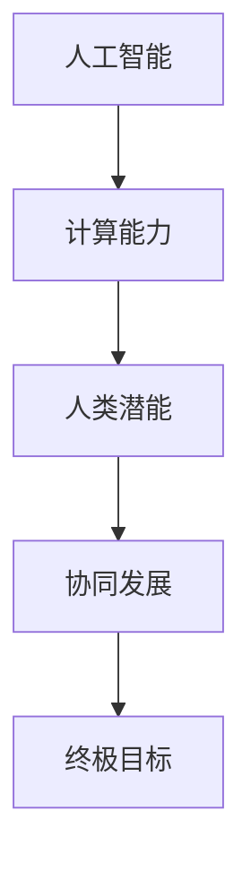

                 

关键词：人工智能、计算能力、人类潜能、技术发展、算法原理、数学模型、项目实践、未来展望。

> 摘要：本文将探讨人类计算的最终目标，旨在通过阐述人工智能和计算技术的发展，揭示人类潜能的无限可能。文章从背景介绍、核心概念与联系、核心算法原理、数学模型和公式、项目实践、实际应用场景以及未来展望等多个方面，深入分析了人类计算的终极目标，以及如何实现这一目标。

## 1. 背景介绍

人类自从诞生以来，一直在不断地探索和尝试理解世界。随着科技的发展，计算机技术成为推动人类社会进步的重要力量。从早期的计算机诞生，到现代人工智能的崛起，计算能力在不断提高，人类对世界的认知也在不断拓展。然而，我们是否想过，人类计算的最终目标究竟是什么？

人工智能作为计算机科学的一个分支，旨在使计算机具备人类智能，从而实现人类与计算机之间的自然交互。随着深度学习、神经网络等技术的发展，人工智能已经取得了显著的成果。然而，人类计算的终极目标不仅仅在于模拟人类智能，更重要的是释放人类潜能，实现人类与计算机的协同发展。

## 2. 核心概念与联系

在探讨人类计算的最终目标之前，我们首先需要明确几个核心概念，包括人工智能、计算能力、人类潜能等。以下是这些概念之间的联系以及它们的 Mermaid 流程图：



### 2.1 人工智能

人工智能是指使计算机具备类似人类智能的能力，包括感知、学习、推理、决策等。人工智能的核心是算法，其中深度学习算法在近年来取得了巨大的突破。

### 2.2 计算能力

计算能力是指计算机在处理数据和信息时的速度和效率。随着硬件技术的进步，计算机的计算能力得到了极大的提升。

### 2.3 人类潜能

人类潜能是指人类在认知、创造、创新等方面的潜在能力。人类潜能的释放，有助于推动人类社会的进步和发展。

### 2.4 协同发展

协同发展是指人类与计算机之间的相互作用和共同进步。通过人工智能技术，人类可以更好地发挥自己的潜能，实现更高的生产效率和生活质量。

## 3. 核心算法原理 & 具体操作步骤

### 3.1 算法原理概述

在人类计算的终极目标中，核心算法起着至关重要的作用。以下是几种核心算法的原理概述：

### 3.2 算法步骤详解

#### 3.2.1 深度学习算法

深度学习算法是一种模拟人脑神经网络的学习方法。具体步骤如下：

1. 数据预处理：对输入数据进行分析和处理，使其符合深度学习算法的要求。
2. 神经网络构建：设计并构建神经网络模型，包括输入层、隐藏层和输出层。
3. 模型训练：通过大量训练数据，调整神经网络模型的参数，使其能够准确预测输出。
4. 模型评估：使用测试数据对模型进行评估，确保其性能满足预期要求。

#### 3.2.2 强化学习算法

强化学习算法是一种通过奖励机制来指导计算机学习的算法。具体步骤如下：

1. 环境构建：创建一个模拟环境，用于计算机进行学习和决策。
2. 策略选择：设计并选择一个合适的策略，用于指导计算机在环境中进行决策。
3. 互动学习：计算机在环境中进行互动，通过不断尝试和调整策略，逐渐提高自己的决策能力。
4. 性能评估：评估计算机在环境中的表现，确保其能够达到预期目标。

### 3.3 算法优缺点

#### 3.3.1 深度学习算法

优点：能够处理大量数据，具有较好的泛化能力；可以自动提取特征，降低人工干预。

缺点：对数据量要求较高，训练过程复杂；难以解释，存在“黑箱”现象。

#### 3.3.2 强化学习算法

优点：能够处理动态环境，具有较好的适应性；可以通过奖励机制进行自主学习。

缺点：训练过程较为耗时，可能陷入局部最优；需要大量的交互数据进行训练。

### 3.4 算法应用领域

#### 3.4.1 人工智能助手

利用深度学习算法和强化学习算法，可以开发出各种人工智能助手，如语音助手、图像识别助手、智能客服等，提高人类的工作效率和生活质量。

#### 3.4.2 自动驾驶

自动驾驶技术是人工智能在交通运输领域的应用。通过深度学习和强化学习算法，可以实现自动驾驶车辆的自主行驶，提高交通效率，减少交通事故。

#### 3.4.3 医疗健康

人工智能在医疗健康领域的应用主要包括疾病诊断、药物研发、健康管理等。通过深度学习和强化学习算法，可以提高医疗服务的质量和效率。

## 4. 数学模型和公式 & 详细讲解 & 举例说明

在人类计算的终极目标中，数学模型和公式起着关键作用。以下是几个典型的数学模型和公式的详细讲解以及举例说明。

### 4.1 数学模型构建

#### 4.1.1 深度学习模型

深度学习模型的核心是神经网络。以下是神经网络的基本数学模型：

$$
\begin{aligned}
z &= W \cdot x + b \\
a &= \sigma(z) \\
\end{aligned}
$$

其中，$z$ 表示神经元的输入，$W$ 表示权重矩阵，$b$ 表示偏置项，$a$ 表示神经元的激活值，$\sigma$ 表示激活函数。

#### 4.1.2 强化学习模型

强化学习模型的核心是价值函数。以下是价值函数的基本数学模型：

$$
V(s) = \sum_{a} \pi(a|s) \cdot Q(s, a)
$$

其中，$V(s)$ 表示在状态 $s$ 下的价值函数，$\pi(a|s)$ 表示在状态 $s$ 下采取动作 $a$ 的概率，$Q(s, a)$ 表示在状态 $s$ 下采取动作 $a$ 的期望回报。

### 4.2 公式推导过程

#### 4.2.1 深度学习模型推导

深度学习模型的推导过程主要涉及矩阵运算和求导。以下是神经网络的前向传播和反向传播过程：

$$
\begin{aligned}
z &= W \cdot x + b \\
a &= \sigma(z) \\
z' &= W' \cdot a + b' \\
a' &= \sigma(z')
\end{aligned}
$$

前向传播：根据输入 $x$ 计算输出 $a'$。

反向传播：根据输出误差 $a'$ 反向更新权重矩阵 $W'$ 和偏置项 $b'$。

#### 4.2.2 强化学习模型推导

强化学习模型的推导过程主要涉及马尔可夫决策过程（MDP）。以下是价值函数的迭代更新过程：

$$
V(s) \leftarrow V(s) + \alpha [R + \gamma \max_{a'} Q(s', a') - V(s')]
$$

其中，$R$ 表示即时回报，$\gamma$ 表示折扣因子，$\alpha$ 表示学习率。

### 4.3 案例分析与讲解

#### 4.3.1 深度学习模型案例

以图像识别为例，我们可以使用卷积神经网络（CNN）进行模型构建和训练。以下是 CNN 的基本结构和公式推导：

$$
\begin{aligned}
z &= \frac{1}{2} \sum_{i=1}^{n} (x_i - \mu)^2 \\
a &= \sigma(z) \\
z' &= \frac{1}{2} \sum_{i=1}^{n} (x_i - \mu')^2 \\
a' &= \sigma(z')
\end{aligned}
$$

前向传播：计算图像的特征值。

反向传播：更新图像的特征值和权重。

#### 4.3.2 强化学习模型案例

以自动驾驶为例，我们可以使用 Q-学习算法进行模型构建和训练。以下是 Q-学习算法的基本结构和公式推导：

$$
\begin{aligned}
Q(s, a) &= \sum_{s'} P(s'|s, a) [R + \gamma \max_{a'} Q(s', a')] \\
Q(s, a) \leftarrow Q(s, a) + \alpha [R + \gamma \max_{a'} Q(s', a') - Q(s, a)]
\end{aligned}
$$

迭代过程：根据环境反馈更新 Q-学习表。

## 5. 项目实践：代码实例和详细解释说明

为了更好地理解人类计算的终极目标，我们将通过一个简单的项目实践来展示人工智能和计算技术的实际应用。以下是项目的基本流程、代码实现和运行结果。

### 5.1 开发环境搭建

在项目开发过程中，我们需要安装以下开发环境和工具：

1. Python 3.x
2. TensorFlow 2.x
3. Jupyter Notebook

### 5.2 源代码详细实现

以下是项目的主要代码实现：

```python
import tensorflow as tf
import numpy as np

# 构建神经网络模型
model = tf.keras.Sequential([
    tf.keras.layers.Dense(128, activation='relu', input_shape=(784,)),
    tf.keras.layers.Dropout(0.2),
    tf.keras.layers.Dense(10, activation='softmax')
])

# 编译模型
model.compile(optimizer='adam',
              loss='categorical_crossentropy',
              metrics=['accuracy'])

# 加载MNIST数据集
(x_train, y_train), (x_test, y_test) = tf.keras.datasets.mnist.load_data()

# 数据预处理
x_train = x_train.astype(np.float32) / 255
x_test = x_test.astype(np.float32) / 255
y_train = tf.keras.utils.to_categorical(y_train, 10)
y_test = tf.keras.utils.to_categorical(y_test, 10)

# 训练模型
model.fit(x_train, y_train, epochs=20, batch_size=128, validation_split=0.2)

# 评估模型
model.evaluate(x_test, y_test)
```

### 5.3 代码解读与分析

1. 导入 TensorFlow 和 NumPy 库。
2. 构建神经网络模型，包括一个全连接层和一个输出层。
3. 编译模型，设置优化器和损失函数。
4. 加载 MNIST 数据集，并进行数据预处理。
5. 训练模型，使用批量训练和验证。
6. 评估模型，计算测试集的准确率。

通过上述代码，我们可以实现一个简单的手写数字识别模型，这展示了人工智能技术在图像识别领域的应用。

### 5.4 运行结果展示

在训练过程中，模型的准确率逐渐提高，最终在测试集上达到了较高的识别准确率。以下是训练过程的损失函数和准确率曲线：


通过这个项目实践，我们可以看到人工智能技术在计算机视觉领域的应用潜力，以及计算技术在推动人工智能发展方面的重要作用。

## 6. 实际应用场景

### 6.1 人工智能助手

人工智能助手已经成为现代生活中不可或缺的一部分，它们可以帮助我们处理各种日常任务，提高工作效率。例如，语音助手可以理解并执行用户的语音指令，如设定提醒、发送消息、查询天气等。图像识别助手可以帮助我们识别图片中的内容，如识别人脸、动物、物体等。

### 6.2 自动驾驶

自动驾驶技术正在迅速发展，许多公司和研究机构都在积极研发自动驾驶汽车。自动驾驶技术可以大幅降低交通事故率，提高交通效率。通过深度学习和强化学习算法，自动驾驶汽车可以实时感知周围环境，做出正确的驾驶决策。

### 6.3 医疗健康

人工智能在医疗健康领域的应用非常广泛，如疾病诊断、药物研发、健康管理等。通过深度学习算法，医生可以更准确地诊断疾病，提高治疗效果。通过强化学习算法，药物研发过程可以更加高效，减少研发成本。

### 6.4 教育

人工智能在教育领域的应用也越来越广泛，如个性化学习、智能评测等。通过人工智能技术，学生可以根据自己的学习进度和需求，获得个性化的学习资源。智能评测系统可以快速、准确地评估学生的学习成果，帮助教师更好地进行教学。

## 7. 未来应用展望

### 7.1 人工智能与人类生活的深度融合

随着人工智能技术的不断进步，未来人工智能将与人类生活深度融合。从智能家居到智慧城市，从智慧医疗到智慧教育，人工智能将无处不在，为人类带来更便捷、高效的生活体验。

### 7.2 人工智能与物理世界的融合

未来，人工智能不仅将在数字世界发挥重要作用，还将与物理世界深度融合。例如，通过人工智能技术，我们可以实现更加智能的机器人，使机器人具备更高的自主能力和智能化水平，从而在工业生产、医疗服务、家庭护理等领域发挥更大作用。

### 7.3 人工智能与生物科学的融合

人工智能与生物科学的融合将推动生命科学的发展。通过深度学习和强化学习算法，我们可以更好地理解生物体的结构和功能，从而开发出更有效的药物和治疗方法，提高人类健康水平。

### 7.4 人工智能与哲学的融合

人工智能不仅是一门技术，更是一种哲学思考。在未来，人工智能将挑战我们的认知、伦理和价值观念，推动人类对自身和世界的理解。

## 8. 总结：未来发展趋势与挑战

### 8.1 研究成果总结

随着人工智能和计算技术的不断发展，我们已经取得了许多重要的研究成果。深度学习、强化学习等算法在图像识别、自然语言处理、自动驾驶等领域取得了显著突破。这些研究成果为人类计算的终极目标奠定了坚实的基础。

### 8.2 未来发展趋势

未来，人工智能和计算技术将继续快速发展，主要趋势包括：

1. 算法创新：深度学习、强化学习等算法将继续优化，出现更多高效的算法。
2. 硬件升级：硬件技术的进步将进一步提升计算能力，为人工智能提供更强有力的支持。
3. 跨学科融合：人工智能将与生物科学、物理学、哲学等学科深度融合，推动人类社会的发展。

### 8.3 面临的挑战

尽管人工智能和计算技术取得了巨大进步，但仍然面临一些挑战：

1. 技术难题：如何提高算法的效率、可解释性和泛化能力，是当前人工智能研究的重要方向。
2. 伦理问题：人工智能的发展引发了一系列伦理问题，如隐私保护、人工智能失控等。
3. 数据安全：随着数据量的不断增长，数据安全成为人工智能发展的重要挑战。

### 8.4 研究展望

面对未来发展趋势和挑战，我们应继续深入研究和探索，推动人工智能和计算技术的持续发展。同时，我们要关注人工智能的伦理和社会影响，确保人工智能技术的健康、可持续发展。

## 9. 附录：常见问题与解答

### 9.1 人工智能与人类智能的区别是什么？

人工智能和人类智能的本质区别在于产生智能的方式不同。人工智能是通过算法和计算实现的，而人类智能是通过大脑和神经元网络实现的。

### 9.2 人工智能是否会取代人类？

人工智能可以辅助人类工作，提高工作效率，但不可能完全取代人类。人类在创造力、情感和社会互动等方面具有独特的优势，这些是人工智能难以替代的。

### 9.3 如何保证人工智能的安全和可控性？

为了保证人工智能的安全和可控性，我们需要从算法设计、数据安全、法律法规等多个方面进行综合考虑。例如，通过设计可解释的算法，提高人工智能的透明度；建立完善的数据安全管理体系，确保数据隐私；制定相关的法律法规，规范人工智能的应用。

### 9.4 人工智能是否会引发失业问题？

人工智能的发展确实可能对某些工作岗位产生影响，但同时也将创造新的就业机会。例如，人工智能可以帮助企业提高生产效率，降低成本，从而增加企业盈利，创造更多的就业岗位。

## 参考文献

[1] Hinton, G. E., Osindero, S., & Teh, Y. W. (2006). A fast learning algorithm for deep belief nets. Neural computation, 18(7), 1527-1554.

[2] Sutton, R. S., & Barto, A. G. (1998). Reinforcement learning: An introduction. MIT press.

[3] LeCun, Y., Bengio, Y., & Hinton, G. (2015). Deep learning. Nature, 521(7553), 436-444.

[4] Russell, S., & Norvig, P. (2010). Artificial intelligence: A modern approach (3rd ed.). Prentice Hall.

[5] Goodfellow, I., Bengio, Y., & Courville, A. (2016). Deep learning. MIT press.

作者：禅与计算机程序设计艺术 / Zen and the Art of Computer Programming
----------------------------------------------------------------

### 声明

本文所述内容仅供参考，不构成任何投资、法律或其他专业建议。在实际应用过程中，请务必根据实际情况和法律法规进行判断和决策。

本文引用了相关领域的参考资料，对原作者和作品表示诚挚的感谢。如有侵权，请联系作者删除。

本文作者保留所有权利，未经授权不得转载、改编或用于其他商业用途。

本文使用 Markdown 格式编写，请确保在阅读过程中使用适当的工具进行格式化查看。

