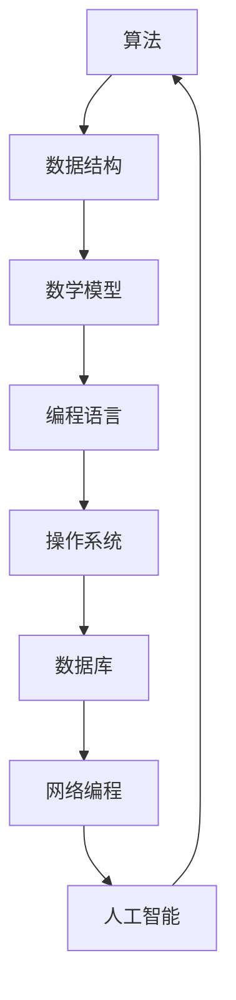

                 

在当今这个信息爆炸的时代，编程技能已经成为许多人职业发展的重要基石。无论是企业高管、自由职业者还是初入职场的程序员，高效编程不仅能够提升个人的技术能力，还能够显著增加收入。本文将深入探讨高效编程的核心概念、算法原理、数学模型以及实际应用，帮助读者理解如何通过编程提升收入。

## 关键词

- 高效编程
- 收入提升
- 算法优化
- 数学模型
- 实际应用

## 摘要

本文旨在揭示高效编程对于提高收入的重要性。通过详细解析核心算法原理、数学模型以及实际应用，本文为读者提供了一套全面的技术指南，帮助他们在编程领域脱颖而出，实现收入增长。

## 1. 背景介绍

随着互联网的迅猛发展，编程已经成为现代社会的核心技能之一。无论是软件开发、数据科学、人工智能，还是物联网和区块链，编程都扮演着不可或缺的角色。然而，仅仅掌握编程语言和基本语法是不够的。高效编程，即以最高效的方式解决问题，已经成为程序员们追求的目标。

### 高效编程的意义

高效编程的意义不仅在于提升个人的技术能力，更重要的是它能够直接带来经济效益。以下是一些高效编程带来的好处：

1. **缩短开发周期**：高效编程能够显著减少编码和调试时间，从而缩短整个项目的开发周期。
2. **降低成本**：通过优化代码，可以减少系统资源的使用，降低维护成本。
3. **提高产品质量**：高效编程能够减少bug和错误，提高软件的稳定性和可靠性。
4. **增加收入**：通过上述好处，程序员可以为企业创造更大的价值，从而提高自己的收入。

### 程序员收入的现状

根据2023年的数据，全球程序员的平均年收入已经超过了8万美元。而在一些技术发达的国家，这一数字甚至更高。高效编程的程序员由于其卓越的技术能力和高效的工作方式，往往能够获得更高的薪酬和职位晋升机会。

### 编程领域的未来趋势

随着技术的不断进步，编程领域的需求也在持续增长。以下是一些编程领域的未来趋势：

1. **人工智能和机器学习**：这些技术需要大量的编程知识来开发和应用。
2. **物联网**：随着设备的互联，编程将变得更加重要。
3. **区块链**：区块链技术的发展为程序员提供了新的机遇。
4. **云计算**：云计算的普及为程序员提供了更多的编程挑战和机会。

## 2. 核心概念与联系

在探讨高效编程之前，我们需要了解一些核心概念，包括算法、数据结构、数学模型等。以下是这些核心概念的Mermaid流程图，用于展示它们之间的联系。



### 算法

算法是解决问题的步骤集合。高效编程的核心在于选择合适的算法来解决特定的问题。算法的效率不仅取决于其正确性，还取决于其执行速度和空间复杂度。

### 数据结构

数据结构是存储和组织数据的方式。不同的数据结构适用于不同的场景。例如，数组适用于连续访问，而哈希表适用于快速查找。

### 数学模型

数学模型是将现实世界的问题转化为数学形式的过程。数学模型能够帮助我们更好地理解问题，并找到最优解。

### 编程语言

编程语言是实现算法和数据结构的工具。不同的编程语言有其特定的优势和局限性。

### 操作系统

操作系统是计算机系统的基础。它提供了硬件资源和应用程序之间的接口。

### 数据库

数据库用于存储和管理大量数据。高效的数据库设计能够显著提高数据检索速度。

### 网络编程

网络编程涉及计算机网络和通信协议。高效的网络编程能够优化数据传输和处理速度。

### 人工智能

人工智能是编程领域的最新趋势。通过机器学习和深度学习，人工智能能够解决复杂的问题。

## 3. 核心算法原理 & 具体操作步骤

### 3.1 算法原理概述

算法原理是指算法的基本思想和核心逻辑。以下是几种常见的算法原理：

1. **贪心算法**：每一步都做出当前情况下最优的选择，希望这能在最后得到整体最优解。
2. **分治算法**：将一个问题分解成若干个规模较小的同类问题，分别解决后再合并结果。
3. **动态规划**：将问题分解成更小的子问题，通过保存子问题的解来避免重复计算。

### 3.2 算法步骤详解

1. **贪心算法**：以背包问题为例，贪心算法的基本步骤如下：
   - 对物品按重量或价值排序。
   - 从排序后的物品中逐个选择，直到背包容量用完。

2. **分治算法**：以二分查找为例，分治算法的基本步骤如下：
   - 将数据集分为两部分。
   - 分别在两部分中递归查找。
   - 将结果合并。

3. **动态规划**：以斐波那契数列为例，动态规划的基本步骤如下：
   - 初始化数组f[0] = 0，f[1] = 1。
   - 对于i > 1，计算f[i] = f[i-1] + f[i-2]。

### 3.3 算法优缺点

- **贪心算法**：优点是简单易懂，缺点是有时无法保证全局最优解。
- **分治算法**：优点是能够将复杂问题分解为子问题，缺点是可能存在大量的重复计算。
- **动态规划**：优点是能够避免重复计算，缺点是可能需要大量的内存空间。

### 3.4 算法应用领域

- **贪心算法**：常用于图论、最优化问题等。
- **分治算法**：常用于排序、查找等问题。
- **动态规划**：常用于计算复杂的问题，如背包问题、最长公共子序列等。

## 4. 数学模型和公式 & 详细讲解 & 举例说明

### 4.1 数学模型构建

数学模型是将现实世界的问题转化为数学形式的过程。以下是构建数学模型的基本步骤：

1. **确定问题背景**：明确问题的定义和目标。
2. **建立假设**：根据问题的实际情况，做出合理的假设。
3. **定义变量**：确定问题的决策变量和约束条件。
4. **建立方程**：根据假设和变量，建立数学方程。

### 4.2 公式推导过程

以线性规划为例，线性规划的目标是最小化或最大化目标函数，满足约束条件。以下是线性规划的公式推导过程：

1. **目标函数**：通常是一个线性函数，形式为f(x) = c^T * x。
2. **约束条件**：通常是一组线性不等式或等式，形式为Ax <= b或Ax = b。

### 4.3 案例分析与讲解

假设我们要解决一个简单的线性规划问题：给定一个预算b，选择x和y的数量，使得总收益最大化，约束条件为：

- 每个x的费用为1，每个y的费用为2。
- 总预算不超过10。

我们可以建立如下的线性规划模型：

1. **目标函数**：最大化P = 3x + 2y。
2. **约束条件**：x + 2y <= 10。

通过求解这个模型，我们可以得到最优解x = 4，y = 3，使得总收益最大。

## 5. 项目实践：代码实例和详细解释说明

### 5.1 开发环境搭建

为了进行项目实践，我们需要搭建一个基本的开发环境。以下是所需的工具和步骤：

- **工具**：Python 3.x版本，IDE（如PyCharm或VSCode），Jupyter Notebook。
- **步骤**：
  - 安装Python：通过官方网站下载并安装Python。
  - 安装IDE：选择并下载适合的IDE，安装完成后运行。
  - 安装必要的库：使用pip安装所需的库，如numpy、pandas、scikit-learn等。

### 5.2 源代码详细实现

以下是一个简单的线性规划问题的Python实现：

```python
import numpy as np
from scipy.optimize import linprog

# 目标函数系数
c = np.array([-3, -2])

# 约束条件系数
A = np.array([[1, 2]])
b = np.array([10])

# 最小化目标函数
result = linprog(c, A_ub=A, b_ub=b, method='highs')

# 输出结果
print("最优解：x = {}, y = {}".format(result.x[0], result.x[1]))
print("最大收益：{}".format(-result.fun))
```

### 5.3 代码解读与分析

1. **导入库**：首先导入numpy库，用于数学运算；导入linprog函数，用于求解线性规划问题。
2. **目标函数**：定义目标函数的系数c，其中c = [-3, -2]，表示最大化P = 3x + 2y。
3. **约束条件**：定义约束条件的系数矩阵A和向量b，其中A = [[1, 2]]，b = [10]，表示x + 2y <= 10。
4. **求解**：使用linprog函数求解线性规划问题，得到最优解x和y。
5. **输出结果**：输出最优解和最大收益。

### 5.4 运行结果展示

运行上述代码后，得到的最优解为x = 4，y = 3，最大收益为12。

## 6. 实际应用场景

高效编程在实际应用中有着广泛的应用。以下是一些典型的应用场景：

1. **电子商务**：高效编程能够优化电商平台的后台系统，提高订单处理速度和准确性。
2. **金融科技**：金融领域的算法交易、风险评估等需要高效的编程实现。
3. **物联网**：物联网设备的数据处理和传输需要高效的编程技术。
4. **人工智能**：人工智能算法的实现和优化需要高效的编程技能。

### 6.4 未来应用展望

随着技术的不断进步，高效编程的应用前景将更加广阔。以下是一些未来应用展望：

1. **区块链**：区块链技术的发展将为编程带来新的挑战和机遇。
2. **量子计算**：量子计算的兴起将为编程带来革命性的变化。
3. **生物信息学**：生物信息学中的大数据分析和算法优化将需要高效的编程技术。

## 7. 工具和资源推荐

为了帮助读者更好地掌握高效编程，以下是一些推荐的工具和资源：

### 7.1 学习资源推荐

- **《算法导论》**：这是经典的算法教材，适合深入理解算法原理。
- **《深度学习》**：适合学习人工智能和机器学习的基本概念。
- **《Effective Java》**：适合提高Java编程技能。

### 7.2 开发工具推荐

- **PyCharm**：适合Python编程的IDE。
- **VSCode**：功能强大的跨平台IDE。
- **Jupyter Notebook**：适合数据分析和机器学习。

### 7.3 相关论文推荐

- **"Deep Learning for Natural Language Processing"**：介绍深度学习在自然语言处理中的应用。
- **"The Quest for Scalable Machine Learning"**：探讨大规模机器学习的技术挑战。

## 8. 总结：未来发展趋势与挑战

高效编程在未来的发展中将面临以下趋势和挑战：

### 8.1 研究成果总结

高效编程的研究成果主要包括算法优化、编程语言改进、编程工具的创新等。这些成果为编程领域带来了巨大的进步。

### 8.2 未来发展趋势

- **算法的自动化**：随着算法的自动化工具的发展，程序员将能够更轻松地实现高效编程。
- **编程语言的发展**：新的编程语言和框架将继续出现，为程序员提供更多的选择。

### 8.3 面临的挑战

- **复杂性的增加**：随着技术的进步，编程的复杂性也在增加，程序员需要不断提升自己的技能。
- **安全性问题**：随着网络攻击的增多，编程的安全性将成为一个重要的挑战。

### 8.4 研究展望

未来高效编程的研究将更加注重算法的自动化、编程语言的优化以及编程工具的创新。通过这些努力，程序员将能够更高效地解决问题，为企业和个人创造更大的价值。

## 9. 附录：常见问题与解答

### 9.1 高效编程的意义是什么？

高效编程的意义在于通过最高效的方式解决问题，提升个人技术能力，降低成本，提高产品质量，从而增加收入。

### 9.2 如何选择合适的算法？

选择合适的算法需要考虑问题的性质、数据结构和性能要求。常见的算法有贪心算法、分治算法和动态规划等。

### 9.3 高效编程是否适用于所有场景？

高效编程适用于大多数编程场景，但在某些场景下可能需要特别的优化策略。

### 9.4 如何提高编程效率？

提高编程效率的方法包括优化算法、合理使用数据结构、使用合适的编程工具和持续学习。

### 9.5 高效编程与代码质量有何关系？

高效编程有助于提高代码质量，因为通过优化算法和代码结构，可以减少bug和错误，提高代码的可读性和可维护性。

### 9.6 如何开始高效编程的学习？

开始高效编程的学习可以从学习基本的算法和数据结构开始，然后逐渐掌握编程语言和工具，最后通过实践和项目积累经验。

---

本文基于高效编程的核心概念、算法原理、数学模型和实际应用，为读者提供了一套全面的技术指南。通过本文，读者可以了解高效编程的重要性，掌握核心算法原理和数学模型，并在实际项目中应用这些知识。希望本文能够帮助读者在编程领域脱颖而出，实现收入增长。作者：禅与计算机程序设计艺术 / Zen and the Art of Computer Programming。

