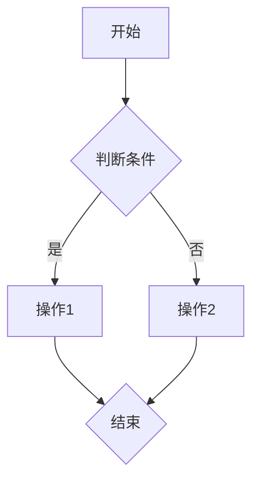
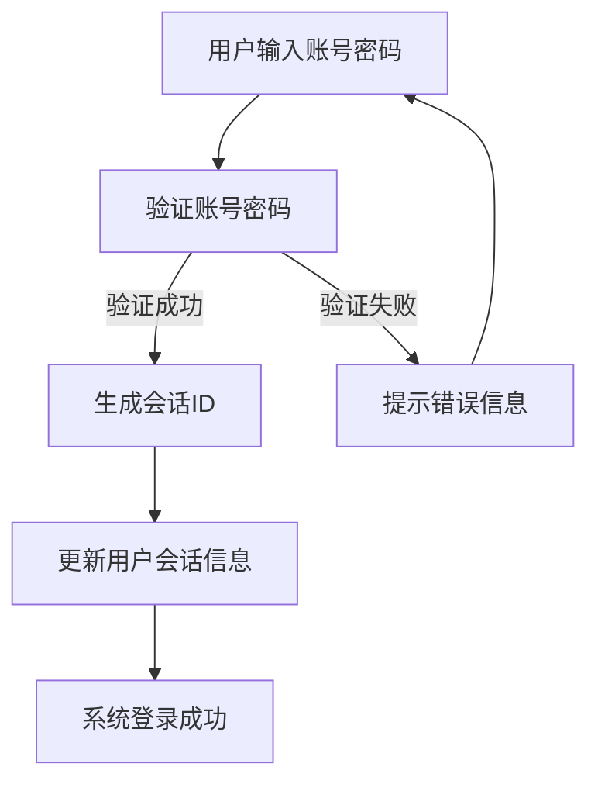
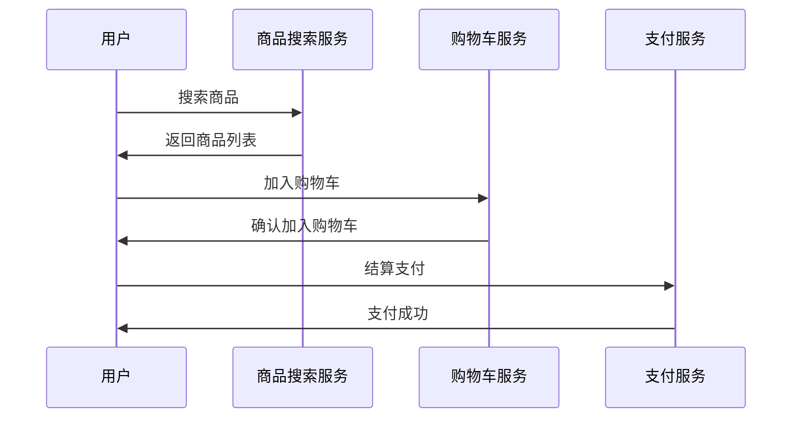
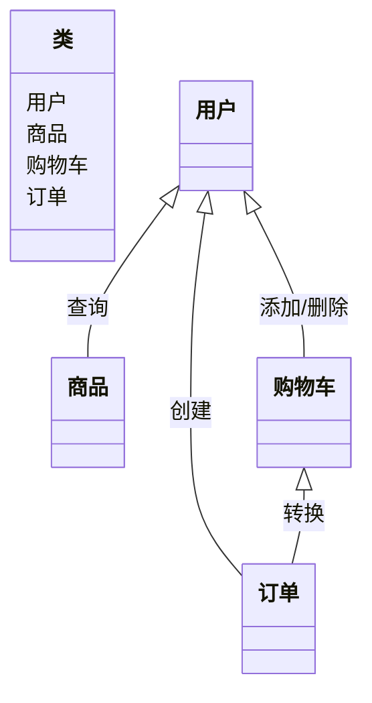

                 

### Mermaid 语法与自然语言描述

#### 什么是Mermaid？

Mermaid 是一种基于 Markdown 的绘图工具，用于创建图表和流程图。它使用一种轻量级的文本格式，将图表描述转换为图形表示。Mermaid 的语法简单易学，使得开发者能够方便快捷地绘制各种图表，非常适合用于文档和演示。

#### Mermaid 的主要用途

1. **创建流程图（Flowchart）**：用于描述程序流程、算法逻辑等。
2. **创建序列图（Sequence Diagram）**：用于描述对象之间的交互顺序。
3. **创建类图（Class Diagram）**：用于描述类的结构、属性和方法。
4. **创建时序图（Timing Diagram）**：用于描述对象之间基于时间的交互。
5. **创建网络图（Gantt Chart）**：用于描述项目进度和时间安排。

#### Mermaid 的基本语法

- **节点定义**：使用方括号 `[]` 包围节点内容。
- **连线定义**：使用箭头 `->` 或 `-->` 连接节点。
- **文本内容**：使用双引号 `" "` 包围文本。
- **样式定义**：使用 `style` 关键字和 CSS 样式规则定义。

##### 例子：

#### Mermaid 实用面试题与编程题

**题目 1：** 使用 Mermaid 语法绘制一个简单的流程图，描述从用户登录到系统登录成功的整个过程。

**答案：**

**解析：** 本题使用 Mermaid 语法描述了用户登录系统的流程，包括账号密码验证、生成会话 ID、更新用户会话信息和系统登录成功或失败的情况。

**题目 2：** 使用 Mermaid 语法绘制一个序列图，描述一个用户在电商平台购物的过程，包括搜索商品、加入购物车、结算支付等步骤。

**答案：**

**解析：** 本题使用 Mermaid 序列图语法描述了用户在电商平台购物的过程，包括搜索商品、加入购物车和结算支付等步骤，以及各服务之间的交互。

**题目 3：** 使用 Mermaid 语法绘制一个类图，描述一个在线购物系统的核心类及其关系。

**答案：**

**解析：** 本题使用 Mermaid 类图语法描述了一个在线购物系统的核心类及其关系，包括用户、商品、购物车和订单等类，以及它们之间的关联关系。

#### 结语

通过本文，我们了解了 Mermaid 的基本概念、用途和语法。此外，我们还通过三个具体的面试题和编程题展示了 Mermaid 在实际应用中的效果。掌握 Mermaid 语法，将有助于我们在文档编写和项目演示中更加高效地创建图表和流程图。在接下来的实战案例中，我们将继续深入探索 Mermaid 的更多功能和用法。希望本文对您有所帮助！

