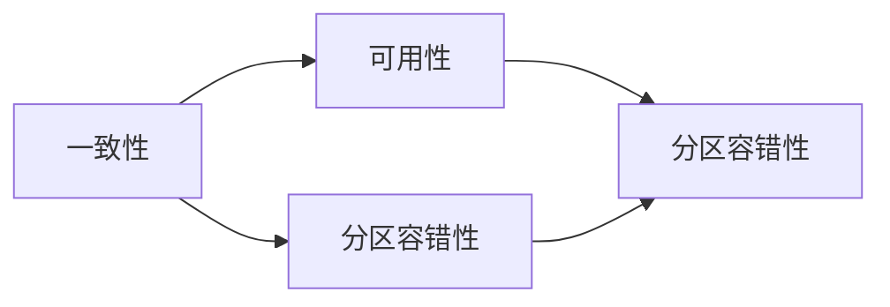

                 

### 自拟标题：高可用性、高可扩展性和高吞吐量系统设计的面试题与算法解析

### 引言

在当前技术飞速发展的时代，企业对于系统的高可用性、高可扩展性和高吞吐量的要求越来越高。本文将围绕这一主题，探讨国内头部一线大厂在面试中经常涉及的20~30道典型面试题和算法编程题，并提供详细的答案解析和源代码实例。

### 高可用性系统设计

#### 1. 如何保证系统的容错能力？

**题目：** 请简述如何设计一个具有高可用性的分布式系统，并举例说明。

**答案：** 
1. **冗余设计：** 在系统关键部分（如数据库、服务器等）进行冗余部署，确保某个部分故障时，其他部分仍能正常运行。
2. **故障检测与恢复：** 实现自动化的故障检测和恢复机制，如心跳检测、自动重启等。
3. **负载均衡：** 通过负载均衡器将流量分配到多个服务器上，避免单点故障。

**示例：**
```go
// 假设有一个分布式服务，通过心跳检测来保证高可用性。
func checkHealth(serverAddress string) bool {
    // 检测服务器状态
    // ...
    return true // 返回服务器是否健康的标志
}

func main() {
    servers := []string{"server1", "server2", "server3"}
    for _, server := range servers {
        if checkHealth(server) {
            // 使用健康的服务器
            break
        } else {
            // 健康检查失败，尝试其他服务器
        }
    }
}
```

#### 2. 负载均衡算法有哪些？

**题目：** 负载均衡有哪些常见的算法？请简要介绍。

**答案：**
1. **轮询（Round Robin）：** 按顺序分配请求。
2. **最小连接（Least Connections）：** 将请求分配给连接数最少的服务器。
3. **最小负载（Least Load）：** 根据服务器当前负载分配请求。
4. **源地址哈希（Source IP Hash）：** 根据客户端IP地址进行哈希分配。

**示例：**
```go
// 轮询算法示例
type LoadBalancer struct {
    servers []string
    index   int
}

func (lb *LoadBalancer) GetServer() string {
    server := lb.servers[lb.index]
    lb.index = (lb.index + 1) % len(lb.servers)
    return server
}
```

### 高可扩展性系统设计

#### 3. 分布式系统中的CAP定理是什么？

**题目：** 请解释CAP定理，并讨论在实际系统设计中如何权衡CAP。

**答案：**
CAP定理指出，在分布式系统中，一致性（Consistency）、可用性（Availability）和分区容错性（Partition tolerance）三者不可同时保证。在实际系统设计中，需要根据业务需求权衡这三个方面。

**示例：**


#### 4. 负载均衡和缓存如何协同工作？

**题目：** 负载均衡和缓存如何协同工作以提高系统的可扩展性？

**答案：**
1. **缓存预热：** 在高流量情况下，预加载热点数据到缓存中，减少数据库压力。
2. **反向代理：** 使用负载均衡器作为反向代理，将请求转发到缓存服务器，缓存命中时直接返回结果。
3. **缓存穿透和缓存雪崩：** 避免缓存穿透和缓存雪崩，提高缓存利用率。

**示例：**
```go
// 缓存预热
func warmUpCache(key string) {
    val, _ := cache.Get(key)
    if val == nil {
        // 缓存未命中，从数据库加载
        val = fetchDataFromDB(key)
        cache.Set(key, val)
    }
}
```

### 高吞吐量系统设计

#### 5. 如何提高系统的响应时间？

**题目：** 提高系统响应时间有哪些常见的方法？

**答案：**
1. **优化算法：** 选择更高效的算法和数据结构。
2. **数据库优化：** 索引优化、分库分表、读写分离等。
3. **服务端优化：** 减少中间件的使用、优化网络传输、减少同步等待等。
4. **客户端优化：** 减少不必要的请求、使用异步处理等。

**示例：**
```go
// 优化网络传输
func doWork() {
    data := fetchData() // 从远程服务器获取数据
    process(data)      // 处理数据
}
```

#### 6. 如何实现分布式系统中的流控？

**题目：** 在分布式系统中，如何实现流控以防止系统过载？

**答案：**
1. **漏桶算法：** 控制请求的流入速度，避免系统过载。
2. **令牌桶算法：** 允许一定速率的流量进入系统，同时限制最大流量。
3. **基于队列的流控：** 控制队列长度，避免队列过长。

**示例：**
```go
// 漏桶算法示例
func tokenBucket(rate float64, capacity int) {
    // ...
    if tokens > 0 {
        tokens--
        processRequest()
    }
}
```

### 结论

本文通过对高可用性、高可扩展性和高吞吐量系统设计相关面试题和算法解析的探讨，为开发者提供了实用的指导和参考。在实际系统设计中，需要综合考虑业务需求、技术能力和资源约束，实现最优的系统架构。

