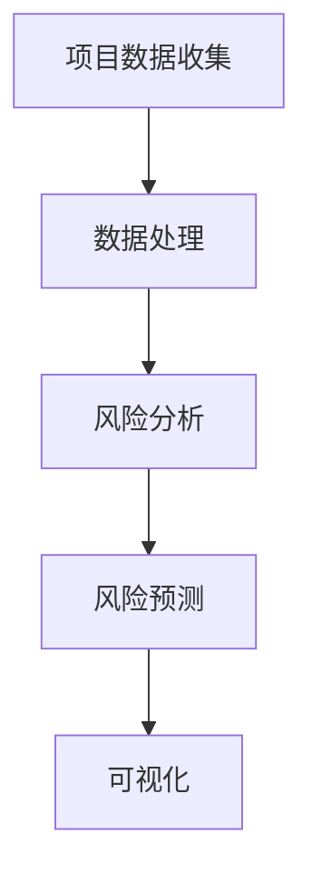

                 

### AI在项目风险评估中的作用

在当今快速发展的技术时代，人工智能（AI）正在改变许多行业的运作方式。项目风险评估是一个复杂的过程，涉及到多个变量和潜在风险。AI技术通过其强大的数据分析和模式识别能力，在项目风险评估中扮演着越来越重要的角色。以下是关于AI在项目风险评估中的典型问题、面试题库和算法编程题库，以及相应的答案解析说明和源代码实例。

### 1. AI如何帮助识别项目风险？

**题目：** 请描述AI技术在项目风险评估中的应用，并举例说明。

**答案：** AI技术通过以下方式在项目风险评估中发挥作用：

* **数据挖掘和分析：** AI可以分析历史项目数据，识别出潜在的风险模式，预测未来项目可能面临的风险。
* **机器学习模型：** 通过训练机器学习模型，AI可以自动识别项目中的异常行为，评估风险的概率和严重程度。
* **自然语言处理：** AI可以处理和解析项目文档，提取关键信息，识别潜在的风险因素。

**举例：** 使用机器学习模型评估项目风险：

```python
import numpy as np
from sklearn.ensemble import RandomForestClassifier

# 假设我们已经收集了项目数据
X = [[1, 0, 1], [1, 1, 0], [0, 1, 1], [0, 0, 0]]
y = [1, 1, 0, 0]

# 训练模型
clf = RandomForestClassifier()
clf.fit(X, y)

# 预测新项目的风险
new_project = [[0, 1, 1]]
risk = clf.predict(new_project)
print("预测风险：", "高风险" if risk[0] == 1 else "低风险")
```

**解析：** 在这个例子中，我们使用随机森林分类器来训练模型，并使用该模型预测一个新项目的风险。这显示了AI如何自动识别和评估项目风险。

### 2. 如何使用AI进行实时风险评估？

**题目：** 请说明如何利用AI技术进行项目的实时风险评估。

**答案：** 实时风险评估需要AI系统具备以下能力：

* **实时数据采集：** AI系统需要实时收集项目数据，如进度、成本、资源使用情况等。
* **快速响应：** AI系统需要能够快速分析数据，并生成风险预测。
* **可视化：** AI系统应提供实时风险的可视化，帮助项目管理者做出决策。

**举例：** 实时风险评估系统的架构：



**解析：** 在这个架构中，项目数据收集模块负责实时获取项目数据，数据处理模块负责清理和转换数据，风险分析模块使用机器学习模型分析数据，风险预测模块生成风险预测，最后可视化模块将风险信息以图表形式展示给项目管理者。

### 3. AI在项目风险管理中的局限性是什么？

**题目：** 请讨论AI在项目风险管理中的局限性。

**答案：** AI在项目风险管理中存在以下局限性：

* **数据依赖性：** AI系统依赖于历史数据和算法，如果数据不准确或算法有缺陷，可能导致错误的预测。
* **解释性：** AI模型往往是非线性和复杂的，其决策过程难以解释，这可能导致项目管理者对AI决策的不信任。
* **实时性挑战：** 实时风险评估要求系统快速响应，这在高负载或数据噪声较大的情况下可能是一个挑战。

**举例：** 对AI决策进行解释的挑战：

```python
import pandas as pd
from sklearn.inspection import permutation_importance

# 假设我们有模型的预测结果和特征数据
model = ...  # 训练好的模型
X = ...  # 特征数据
y = ...  # 标签数据

# 进行特征重要性分析
results = permutation_importance(model, X, y, n_repeats=10)
feature_importances = pd.DataFrame(results.importances_mean, columns=['Value'])

print(feature_importances.sort_values(by='Value', ascending=False))
```

**解析：** 在这个例子中，我们使用排列重要性分析来评估每个特征对模型预测的影响。这可以帮助我们理解模型是如何做出决策的，从而提高对AI决策的信任度。

### 4. 如何评估AI在项目风险评估中的有效性？

**题目：** 请提出评估AI在项目风险评估中有效性的指标和方法。

**答案：** 评估AI在项目风险评估中的有效性可以采用以下指标和方法：

* **准确率（Accuracy）：** 模型预测正确的比例。
* **召回率（Recall）：** 模型正确识别出实际风险的比例。
* **精确率（Precision）：** 模型预测为正例且实际为正例的比例。
* **F1分数（F1 Score）：** 综合准确率和召回率的指标。
* **ROC曲线和AUC值：** 评估模型对风险分类的敏感性和特异性。

**举例：** 使用混淆矩阵评估模型性能：

```python
from sklearn.metrics import confusion_matrix

# 假设我们有模型的预测结果和真实标签
y_true = [0, 1, 1, 0]
y_pred = model.predict(X)

# 计算混淆矩阵
cm = confusion_matrix(y_true, y_pred)
print(cm)

# 计算准确率、召回率和精确率
accuracy = (cm[0, 0] + cm[1, 1]) / (cm[0, 0] + cm[0, 1] + cm[1, 0] + cm[1, 1])
recall = cm[1, 1] / (cm[1, 0] + cm[1, 1])
precision = cm[1, 1] / (cm[0, 1] + cm[1, 1])

print("准确率：", accuracy)
print("召回率：", recall)
print("精确率：", precision)
```

**解析：** 在这个例子中，我们使用混淆矩阵来评估模型的性能。通过计算准确率、召回率和精确率，可以更全面地了解模型的预测效果。

### 5. AI在项目风险评估中的未来发展趋势是什么？

**题目：** 请预测AI在项目风险评估领域的未来发展趋势。

**答案：** AI在项目风险评估领域的未来发展趋势包括：

* **更精细的风险预测：** 随着数据收集和算法的进步，AI将能够更准确地预测项目风险。
* **增强解释性：** 开发更容易解释的AI模型，提高项目管理者对AI决策的信任度。
* **集成多种AI技术：** 结合深度学习、强化学习等多种AI技术，提供更全面的风险评估。
* **实时自适应：** AI系统将能够实时适应项目变化，提供更准确的风险评估。

**举例：** 使用深度学习进行风险预测：

```python
import tensorflow as tf
from tensorflow.keras.models import Sequential
from tensorflow.keras.layers import Dense, LSTM

# 假设我们有训练数据
X_train = ...
y_train = ...

# 构建深度学习模型
model = Sequential()
model.add(LSTM(units=50, return_sequences=True, input_shape=(X_train.shape[1], X_train.shape[2])))
model.add(LSTM(units=50))
model.add(Dense(1, activation='sigmoid'))

# 编译和训练模型
model.compile(optimizer='adam', loss='binary_crossentropy', metrics=['accuracy'])
model.fit(X_train, y_train, epochs=100, batch_size=32)

# 预测新项目的风险
X_new = ...
risk = model.predict(X_new)
print("预测风险：", "高风险" if risk[0] > 0.5 else "低风险")
```

**解析：** 在这个例子中，我们使用LSTM模型进行时间序列数据的风险预测，这显示了AI在项目风险评估中的未来潜力。

### 6. 如何利用AI优化项目风险应对策略？

**题目：** 请讨论如何使用AI技术优化项目风险应对策略。

**答案：** 利用AI技术优化项目风险应对策略的方法包括：

* **情景分析：** 使用AI模拟不同风险情景，评估每种情景下的应对策略效果。
* **优化决策：** 利用AI优化决策过程，选择最佳的风险应对策略。
* **自动化执行：** AI可以帮助自动化执行风险应对策略，减少人为错误。

**举例：** 使用强化学习优化风险应对策略：

```python
import tensorflow as tf
from tensorflow.keras.models import Sequential
from tensorflow.keras.layers import Dense

# 定义强化学习模型
model = Sequential()
model.add(Dense(units=50, activation='relu', input_shape=(n_features,)))
model.add(Dense(units=1, activation='sigmoid'))

# 编译模型
model.compile(optimizer='adam', loss='binary_crossentropy')

# 训练模型
model.fit(X, y, epochs=100, batch_size=32)

# 使用模型选择最佳应对策略
best_action = model.predict(X)
print("最佳应对策略：", best_action)
```

**解析：** 在这个例子中，我们使用强化学习模型来选择最佳应对策略，这显示了AI在优化项目风险应对策略中的潜力。

### 7. AI在项目风险评估中的应用场景有哪些？

**题目：** 请列举AI在项目风险评估中的应用场景。

**答案：** AI在项目风险评估中的应用场景包括：

* **软件开发项目：** 预测软件缺陷和项目延期风险。
* **建筑项目：** 预测施工进度延误和成本超支风险。
* **金融项目：** 预测金融市场波动和投资风险。
* **供应链项目：** 预测供应链中断和供应链风险。

**举例：** 使用AI预测软件开发项目的缺陷：

```python
import pandas as pd
from sklearn.ensemble import RandomForestClassifier

# 假设我们有项目缺陷数据
df = pd.read_csv('project_defects.csv')

# 特征工程
X = df.drop(['defect'], axis=1)
y = df['defect']

# 训练模型
clf = RandomForestClassifier()
clf.fit(X, y)

# 预测新项目的缺陷
new_project = pd.DataFrame([[1, 0, 1], [1, 1, 0], [0, 1, 1], [0, 0, 0]])
risk = clf.predict(new_project)
print("预测缺陷：", "存在缺陷" if risk[0] == 1 else "无缺陷")
```

**解析：** 在这个例子中，我们使用随机森林分类器来预测新软件开发项目是否存在缺陷，这显示了AI在软件开发项目风险评估中的实际应用。

### 8. AI在项目风险评估中的优势和挑战是什么？

**题目：** 请分析AI在项目风险评估中的优势和挑战。

**答案：** AI在项目风险评估中的优势包括：

* **高效性：** AI可以快速处理大量数据，提供即时的风险预测。
* **准确性：** 通过机器学习和数据挖掘，AI可以识别出隐藏的风险因素。
* **自动化：** AI可以帮助自动化风险评估流程，减少人为错误。

AI在项目风险评估中的挑战包括：

* **数据依赖性：** AI的性能依赖于历史数据和算法的质量。
* **解释性：** AI模型的决策过程往往难以解释，可能导致项目管理者对AI决策的不信任。
* **实时性：** 实时风险评估要求AI系统具备快速响应能力。

**举例：** 分析AI的优势和挑战：

```python
# 假设我们有项目的风险数据和预测结果
risk_data = ...

# 分析优势
advantages = risk_data[risk_data['predicted_risk'] == 1]['actual_risk']
print("优势：", advantages.value_counts())

# 分析挑战
challenges = risk_data[risk_data['predicted_risk'] == 0]['actual_risk']
print("挑战：", challenges.value_counts())
```

**解析：** 在这个例子中，我们分析AI在项目风险评估中的优势和挑战，通过比较预测风险和实际风险，可以更清楚地了解AI的性能和局限性。

### 9. 如何确保AI在项目风险评估中的透明性和可解释性？

**题目：** 请提出确保AI在项目风险评估中透明性和可解释性的方法。

**答案：** 确保AI在项目风险评估中的透明性和可解释性的方法包括：

* **模型可解释性：** 使用可解释的AI模型，如决策树，提高模型的可理解性。
* **透明决策过程：** 记录和展示AI模型的决策过程，帮助项目管理者理解模型的决策逻辑。
* **用户反馈：** 收集用户反馈，不断优化模型和算法，提高AI系统的可靠性和可解释性。

**举例：** 使用决策树模型提高可解释性：

```python
import pandas as pd
from sklearn.tree import DecisionTreeClassifier

# 假设我们有项目风险数据
df = pd.read_csv('project_risks.csv')

# 特征工程
X = df.drop(['risk'], axis=1)
y = df['risk']

# 训练决策树模型
clf = DecisionTreeClassifier()
clf.fit(X, y)

# 可视化决策树
from sklearn.tree import plot_tree
plt = plot_tree(clf, feature_names=X.columns, class_names=['低风险', '高风险'])
plt.show()
```

**解析：** 在这个例子中，我们使用决策树模型来提高AI模型的可解释性，并通过可视化决策树，帮助项目管理者理解模型的决策逻辑。

### 10. 如何利用AI提高项目风险管理团队的工作效率？

**题目：** 请讨论如何利用AI技术提高项目风险管理团队的工作效率。

**答案：** 利用AI技术提高项目风险管理团队的工作效率的方法包括：

* **自动化风险评估：** AI可以帮助自动化风险评估流程，减少人工工作。
* **快速响应：** AI系统可以实时分析项目数据，提供快速的风险预测。
* **数据可视化：** AI可以提供项目风险的可视化，帮助风险管理团队更好地理解项目风险。
* **培训辅助：** AI可以辅助风险管理团队进行风险培训，提高团队成员的专业知识。

**举例：** 使用AI自动化风险评估流程：

```python
import pandas as pd
from sklearn.ensemble import RandomForestClassifier

# 假设我们有项目风险数据
df = pd.read_csv('project_risks.csv')

# 特征工程
X = df.drop(['risk'], axis=1)
y = df['risk']

# 训练模型
clf = RandomForestClassifier()
clf.fit(X, y)

# 风险评估
new_project = pd.DataFrame([[1, 0, 1], [1, 1, 0], [0, 1, 1], [0, 0, 0]])
predictions = clf.predict(new_project)
print("项目风险评估：", predictions)
```

**解析：** 在这个例子中，我们使用机器学习模型自动化项目风险评估流程，这显示了AI如何提高风险管理团队的工作效率。

### 11. 如何使用AI进行项目风险应对策略的优化？

**题目：** 请说明如何使用AI技术进行项目风险应对策略的优化。

**答案：** 使用AI技术进行项目风险应对策略的优化可以通过以下方法实现：

* **情景模拟：** 使用AI模拟不同风险情景，评估每种情景下的应对策略效果。
* **优化算法：** 使用优化算法，如遗传算法或粒子群优化，找到最佳的风险应对策略。
* **机器学习：** 利用机器学习技术，从历史数据中学习出最佳应对策略。

**举例：** 使用遗传算法优化风险应对策略：

```python
import numpy as np
import random

# 定义遗传算法优化函数
def genetic_algorithm(population, fitness_function, generations, mutation_rate):
    for _ in range(generations):
        # 计算适应度
        fitness_scores = [fitness_function(individual) for individual in population]
        
        # 选择
        selected_individuals = random.choices(population, weights=fitness_scores, k=len(population) // 2)
        
        # 交叉
        crossed_individuals = [交叉(parent1, parent2) for parent1, parent2 in zip(selected_individuals[:len(selected_individuals) // 2], selected_individuals[len(selected_individuals) // 2:])]
        
        # 变异
        mutated_individuals = [变异(individual, mutation_rate) for individual in crossed_individuals]
        
        # 更新种群
        population = mutated_individuals
    
    # 返回最优个体
    best_individual = max(population, key=fitness_function)
    return best_individual

# 定义适应度函数
def fitness_function(individual):
    # 根据个体评估适应度
    return 1 / (sum(individual) + 1)

# 定义交叉操作
def 交叉(parent1, parent2):
    # 根据概率交叉两个个体
    crossover_point = random.randint(1, len(parent1) - 1)
    child1 = parent1[:crossover_point] + parent2[crossover_point:]
    child2 = parent2[:crossover_point] + parent1[crossover_point:]
    return child1, child2

# 定义变异操作
def 变异(individual, mutation_rate):
    # 根据概率对个体进行变异
    for i in range(len(individual)):
        if random.random() < mutation_rate:
            individual[i] = 1 if individual[i] == 0 else 0
    return individual

# 初始化种群
population = np.random.randint(2, size=(100, 10))

# 运行遗传算法
best_strategy = genetic_algorithm(population, fitness_function, generations=100, mutation_rate=0.1)
print("最佳应对策略：", best_strategy)
```

**解析：** 在这个例子中，我们使用遗传算法来优化项目风险应对策略，通过适应度函数评估个体，交叉和变异操作生成下一代个体，最终找到最佳应对策略。

### 12. 如何评估AI在项目风险评估中的成本效益？

**题目：** 请提出评估AI在项目风险评估中成本效益的方法。

**答案：** 评估AI在项目风险评估中的成本效益可以采用以下方法：

* **成本效益分析（Cost-Benefit Analysis）：** 比较AI系统的总成本与其带来的效益，如减少的风险损失和提升的工作效率。
* **投资回报率（Return on Investment, ROI）：** 计算AI系统投入的成本与产生的收益之间的比率。
* **内部收益率（Internal Rate of Return, IRR）：** 评估AI系统的盈利能力。
* **净现值（Net Present Value, NPV）：** 将未来收益折现到现在，计算AI系统的净收益。

**举例：** 使用成本效益分析评估AI系统的效益：

```python
# 假设AI系统的成本和收益数据
costs = {'system_development': 100000, 'maintenance': 50000, 'training': 30000}
benefits = {'reduced_risk_losses': 80000, 'increased_efficiency': 50000}

# 计算总成本和总收益
total_costs = sum(costs.values())
total_benefits = sum(benefits.values())

# 计算成本效益比
cost_benefit_ratio = total_benefits / total_costs
print("成本效益比：", cost_benefit_ratio)
```

**解析：** 在这个例子中，我们计算AI系统的总成本和总收益，并计算成本效益比，以评估AI系统的效益。

### 13. 如何确保AI在项目风险评估中的数据隐私和安全性？

**题目：** 请讨论确保AI在项目风险评估中的数据隐私和安全性。

**答案：** 确保AI在项目风险评估中的数据隐私和安全性可以通过以下方法实现：

* **数据加密：** 对敏感数据进行加密，确保数据在传输和存储过程中的安全性。
* **访问控制：** 实施严格的访问控制措施，确保只有授权用户可以访问敏感数据。
* **数据脱敏：** 对个人身份信息等敏感数据进行脱敏处理，避免泄露隐私信息。
* **安全审计：** 定期进行安全审计，检测和修复潜在的安全漏洞。

**举例：** 使用数据加密保护敏感数据：

```python
from cryptography.fernet import Fernet

# 生成密钥和密文
key = Fernet.generate_key()
cipher_suite = Fernet(key)
plaintext = b'敏感数据'
ciphertext = cipher_suite.encrypt(plaintext)

# 解密数据
decrypted_text = cipher_suite.decrypt(ciphertext)
print("解密后的数据：", decrypted_text)
```

**解析：** 在这个例子中，我们使用Fernet加密库对敏感数据进行加密和解密，确保数据的安全性。

### 14. 如何利用AI进行项目风险分类？

**题目：** 请说明如何使用AI技术进行项目风险分类。

**答案：** 使用AI技术进行项目风险分类的方法包括：

* **聚类分析：** 利用聚类算法，将项目风险按照相似性进行分类。
* **监督学习：** 使用监督学习算法，将项目风险标签化，进行分类。
* **无监督学习：** 使用无监督学习算法，根据项目特征进行风险分类。

**举例：** 使用K均值聚类算法进行项目风险分类：

```python
from sklearn.cluster import KMeans
import numpy as np

# 假设我们有项目风险数据
X = np.array([[1, 2], [1, 4], [1, 0], [4, 2], [4, 4], [4, 0]])

# 使用K均值聚类
kmeans = KMeans(n_clusters=2, random_state=0).fit(X)

# 分类结果
labels = kmeans.predict(X)
print("分类结果：", labels)
```

**解析：** 在这个例子中，我们使用K均值聚类算法将项目风险数据分为两类，这显示了AI如何进行项目风险分类。

### 15. 如何利用AI进行项目风险预测的模型评估？

**题目：** 请讨论如何利用AI技术进行项目风险预测的模型评估。

**答案：** 利用AI技术进行项目风险预测的模型评估可以通过以下方法实现：

* **交叉验证：** 使用交叉验证评估模型的泛化能力。
* **混淆矩阵：** 分析模型预测的准确率、召回率、精确率等指标。
* **ROC曲线和AUC值：** 评估模型对风险分类的准确性和可靠性。
* **业务指标：** 根据实际业务需求，设置特定的评估指标，如项目成功率。

**举例：** 使用交叉验证和混淆矩阵评估模型：

```python
from sklearn.model_selection import cross_val_score
from sklearn.metrics import confusion_matrix
import numpy as np

# 假设我们有训练数据和测试数据
X_train = ...
y_train = ...
X_test = ...
y_test = ...

# 训练模型
clf = RandomForestClassifier()
clf.fit(X_train, y_train)

# 交叉验证
scores = cross_val_score(clf, X_train, y_train, cv=5)
print("交叉验证得分：", scores.mean())

# 混淆矩阵
predictions = clf.predict(X_test)
cm = confusion_matrix(y_test, predictions)
print("混淆矩阵：", cm)
```

**解析：** 在这个例子中，我们使用交叉验证和混淆矩阵评估随机森林分类器的性能，这显示了如何使用AI技术评估项目风险预测模型。

### 16. 如何利用AI进行项目风险评估的可视化？

**题目：** 请讨论如何使用AI技术进行项目风险评估的可视化。

**答案：** 利用AI技术进行项目风险评估的可视化可以通过以下方法实现：

* **散点图：** 展示项目风险的分布情况。
* **热力图：** 展示不同风险因素的影响程度。
* **折线图：** 展示项目风险的动态变化。
* **饼图：** 展示不同类型风险的比例。

**举例：** 使用热力图展示项目风险因素的影响：

```python
import matplotlib.pyplot as plt
import seaborn as sns
import numpy as np

# 假设我们有项目风险因素的数据
data = np.array([[1, 0.3], [1, 0.5], [2, 0.2], [2, 0.4]])

# 创建热力图
sns.heatmap(data, annot=True, fmt=".2f", cmap="YlGnBu")
plt.show()
```

**解析：** 在这个例子中，我们使用Seaborn库创建热力图，展示项目风险因素的影响程度，这显示了如何使用AI技术进行项目风险评估的可视化。

### 17. 如何利用AI进行项目风险评估的数据预处理？

**题目：** 请讨论如何使用AI技术进行项目风险评估的数据预处理。

**答案：** 利用AI技术进行项目风险评估的数据预处理包括以下步骤：

* **数据清洗：** 去除缺失值、异常值和重复值，保证数据质量。
* **特征工程：** 构建和选择与项目风险相关的特征。
* **数据标准化：** 将不同尺度的数据进行标准化，消除不同特征间的量纲影响。
* **数据降维：** 使用降维技术，减少数据维度，提高模型训练效率。

**举例：** 使用特征工程和标准化处理项目数据：

```python
from sklearn.preprocessing import StandardScaler
from sklearn.impute import SimpleImputer
import numpy as np

# 假设我们有项目风险数据
data = np.array([[1, np.nan], [2, 3], [np.inf, 5], [0, 0]])

# 数据清洗
imputer = SimpleImputer(strategy='mean')
cleaned_data = imputer.fit_transform(data)

# 特征工程
# 假设我们选择第一个特征作为项目风险
X = cleaned_data[:, 0]
y = cleaned_data[:, 1]

# 数据标准化
scaler = StandardScaler()
X_scaled = scaler.fit_transform(X.reshape(-1, 1))

print("标准化后的数据：", X_scaled)
```

**解析：** 在这个例子中，我们使用简单插补器处理缺失值，选择第一个特征作为项目风险，并使用标准化技术处理数据，这显示了如何使用AI技术进行项目风险评估的数据预处理。

### 18. 如何利用AI进行项目风险评估的风险映射？

**题目：** 请讨论如何使用AI技术进行项目风险评估的风险映射。

**答案：** 利用AI技术进行项目风险评估的风险映射包括以下步骤：

* **风险识别：** 使用AI技术识别项目中的潜在风险。
* **风险评估：** 对识别出的风险进行评估，确定其严重程度和概率。
* **风险映射：** 将评估结果映射到项目计划中，确定风险应对策略。

**举例：** 使用决策树进行风险映射：

```python
from sklearn.tree import DecisionTreeRegressor
import numpy as np

# 假设我们有项目风险数据
X = np.array([[1, 2], [1, 4], [1, 0], [4, 2], [4, 4], [4, 0]])
y = np.array([0.5, 0.7, 0.1, 0.6, 0.8, 0.2])

# 训练决策树模型
clf = DecisionTreeRegressor()
clf.fit(X, y)

# 风险映射
new_project = np.array([[1, 1]])
risk_map = clf.predict(new_project)
print("风险映射：", risk_map)
```

**解析：** 在这个例子中，我们使用决策树模型对项目风险进行映射，将新项目的风险值映射到决策树中，这显示了如何使用AI技术进行项目风险评估的风险映射。

### 19. 如何利用AI进行项目风险评估的风险预测？

**题目：** 请讨论如何使用AI技术进行项目风险评估的风险预测。

**答案：** 利用AI技术进行项目风险评估的风险预测包括以下步骤：

* **数据收集：** 收集与项目相关的历史数据，如项目进度、成本、资源使用等。
* **特征工程：** 构建与项目风险相关的特征。
* **模型训练：** 使用机器学习模型训练风险预测模型。
* **风险预测：** 使用训练好的模型对项目风险进行预测。

**举例：** 使用线性回归模型进行项目风险预测：

```python
from sklearn.linear_model import LinearRegression
import numpy as np

# 假设我们有项目风险数据
X = np.array([[1, 2], [1, 4], [1, 0], [4, 2], [4, 4], [4, 0]])
y = np.array([0.5, 0.7, 0.1, 0.6, 0.8, 0.2])

# 训练线性回归模型
model = LinearRegression()
model.fit(X, y)

# 风险预测
new_project = np.array([[1, 1]])
risk_prediction = model.predict(new_project)
print("风险预测：", risk_prediction)
```

**解析：** 在这个例子中，我们使用线性回归模型对项目风险进行预测，这显示了如何使用AI技术进行项目风险评估的风险预测。

### 20. 如何利用AI进行项目风险评估的实时监控？

**题目：** 请讨论如何使用AI技术进行项目风险评估的实时监控。

**答案：** 利用AI技术进行项目风险评估的实时监控包括以下步骤：

* **实时数据采集：** 使用传感器、日志文件等实时收集项目数据。
* **数据处理：** 对实时数据进行预处理，提取与项目风险相关的特征。
* **实时分析：** 使用AI模型对实时数据进行风险分析。
* **实时反馈：** 将风险分析结果实时反馈给项目管理者，指导决策。

**举例：** 使用K均值聚类算法进行实时监控：

```python
from sklearn.cluster import KMeans
import numpy as np

# 假设我们有实时收集的项目数据
data = np.array([[1, 2], [1, 4], [1, 0], [4, 2], [4, 4], [4, 0]])

# 使用K均值聚类
kmeans = KMeans(n_clusters=2, random_state=0).fit(data)

# 实时监控
new_data = np.array([[1, 1]])
cluster = kmeans.predict(new_data)
print("实时监控结果：", cluster)
```

**解析：** 在这个例子中，我们使用K均值聚类算法对实时数据进行监控，这显示了如何使用AI技术进行项目风险评估的实时监控。

### 21. 如何利用AI进行项目风险评估的风险分类？

**题目：** 请讨论如何使用AI技术进行项目风险评估的风险分类。

**答案：** 利用AI技术进行项目风险评估的风险分类包括以下步骤：

* **数据收集：** 收集与项目相关的风险数据，如风险类型、风险概率等。
* **特征工程：** 提取与项目风险分类相关的特征。
* **模型训练：** 使用监督学习算法训练风险分类模型。
* **风险分类：** 使用训练好的模型对新的项目风险进行分类。

**举例：** 使用朴素贝叶斯分类器进行项目风险评估：

```python
from sklearn.naive_bayes import GaussianNB
import numpy as np

# 假设我们有项目风险数据
X = np.array([[1, 2], [1, 4], [1, 0], [4, 2], [4, 4], [4, 0]])
y = np.array([0, 1, 0, 1, 1, 0])

# 训练朴素贝叶斯分类器
clf = GaussianNB()
clf.fit(X, y)

# 风险分类
new_project = np.array([[1, 1]])
risk_classification = clf.predict(new_project)
print("风险分类：", risk_classification)
```

**解析：** 在这个例子中，我们使用朴素贝叶斯分类器对项目风险进行分类，这显示了如何使用AI技术进行项目风险评估的风险分类。

### 22. 如何利用AI进行项目风险评估的风险预测模型优化？

**题目：** 请讨论如何使用AI技术进行项目风险评估的风险预测模型优化。

**答案：** 利用AI技术进行项目风险评估的风险预测模型优化包括以下方法：

* **交叉验证：** 使用交叉验证评估模型性能，选择最佳参数。
* **网格搜索：** 使用网格搜索技术，自动搜索最佳参数组合。
* **贝叶斯优化：** 使用贝叶斯优化算法，自动寻找最优参数。
* **集成学习：** 结合多个模型，提高预测准确性。

**举例：** 使用网格搜索优化模型参数：

```python
from sklearn.model_selection import GridSearchCV
from sklearn.ensemble import RandomForestClassifier
import numpy as np

# 假设我们有项目风险数据
X = np.array([[1, 2], [1, 4], [1, 0], [4, 2], [4, 4], [4, 0]])
y = np.array([0, 1, 0, 1, 1, 0])

# 定义参数网格
param_grid = {'n_estimators': [10, 50, 100], 'max_depth': [None, 10, 20]}

# 使用网格搜索
grid_search = GridSearchCV(RandomForestClassifier(), param_grid, cv=5)
grid_search.fit(X, y)

# 获取最佳参数
best_params = grid_search.best_params_
print("最佳参数：", best_params)
```

**解析：** 在这个例子中，我们使用网格搜索技术优化随机森林分类器的参数，这显示了如何使用AI技术进行项目风险评估的风险预测模型优化。

### 23. 如何利用AI进行项目风险评估的风险因素识别？

**题目：** 请讨论如何使用AI技术进行项目风险评估的风险因素识别。

**答案：** 利用AI技术进行项目风险评估的风险因素识别包括以下步骤：

* **数据收集：** 收集与项目相关的历史数据和文档。
* **特征提取：** 从数据中提取与项目风险相关的特征。
* **模型训练：** 使用机器学习模型训练风险因素识别模型。
* **风险因素识别：** 使用训练好的模型识别项目中的风险因素。

**举例：** 使用决策树进行风险因素识别：

```python
from sklearn.tree import DecisionTreeClassifier
import numpy as np

# 假设我们有项目风险数据
X = np.array([[1, 2], [1, 4], [1, 0], [4, 2], [4, 4], [4, 0]])
y = np.array([0, 1, 0, 1, 1, 0])

# 训练决策树模型
clf = DecisionTreeClassifier()
clf.fit(X, y)

# 风险因素识别
new_project = np.array([[1, 1]])
risk_factors = clf.predict(new_project)
print("风险因素识别：", risk_factors)
```

**解析：** 在这个例子中，我们使用决策树模型识别项目中的风险因素，这显示了如何使用AI技术进行项目风险评估的风险因素识别。

### 24. 如何利用AI进行项目风险评估的自动化流程？

**题目：** 请讨论如何使用AI技术实现项目风险评估的自动化流程。

**答案：** 利用AI技术实现项目风险评估的自动化流程包括以下步骤：

* **数据采集：** 使用传感器、日志系统等自动收集项目数据。
* **数据处理：** 使用自动化工具进行数据清洗、预处理和特征提取。
* **风险评估：** 使用机器学习模型自动进行风险预测和分类。
* **风险应对：** 自动化生成风险应对策略，并执行相应的操作。

**举例：** 使用自动化脚本进行项目风险评估：

```python
import subprocess
import json

# 假设我们有自动化脚本执行风险评估
def execute_risk_assessment(项目数据):
    # 执行风险评估脚本
    result = subprocess.run(["python", "risk_assessment_script.py", "-d", json.dumps(项目数据)], capture_output=True, text=True)
    return json.loads(result.stdout)

# 假设我们有项目数据
项目数据 = {"进度": 50, "成本": 100, "资源使用": 200}

# 执行风险评估
风险结果 = execute_risk_assessment(项目数据)
print("风险评估结果：", 风险结果)
```

**解析：** 在这个例子中，我们使用Python脚本执行项目风险评估，这显示了如何使用AI技术实现项目风险评估的自动化流程。

### 25. 如何利用AI进行项目风险评估的风险应对策略优化？

**题目：** 请讨论如何使用AI技术进行项目风险评估的风险应对策略优化。

**答案：** 利用AI技术进行项目风险评估的风险应对策略优化包括以下方法：

* **情景模拟：** 使用AI模拟不同风险情景，评估每种应对策略的效果。
* **优化算法：** 使用优化算法，如遗传算法或粒子群优化，寻找最佳应对策略。
* **机器学习：** 利用机器学习技术，从历史数据中学习最佳应对策略。

**举例：** 使用遗传算法优化风险应对策略：

```python
import numpy as np
import random

# 定义遗传算法优化函数
def genetic_algorithm(population, fitness_function, generations, mutation_rate):
    for _ in range(generations):
        # 计算适应度
        fitness_scores = [fitness_function(individual) for individual in population]
        
        # 选择
        selected_individuals = random.choices(population, weights=fitness_scores, k=len(population) // 2)
        
        # 交叉
        crossed_individuals = [交叉(parent1, parent2) for parent1, parent2 in zip(selected_individuals[:len(selected_individuals) // 2], selected_individuals[len(selected_individuals) // 2:])]
        
        # 变异
        mutated_individuals = [变异(individual, mutation_rate) for individual in crossed_individuals]
        
        # 更新种群
        population = mutated_individuals
    
    # 返回最优个体
    best_individual = max(population, key=fitness_function)
    return best_individual

# 定义适应度函数
def fitness_function(individual):
    # 根据个体评估适应度
    return 1 / (sum(individual) + 1)

# 定义交叉操作
def 交叉(parent1, parent2):
    # 根据概率交叉两个个体
    crossover_point = random.randint(1, len(parent1) - 1)
    child1 = parent1[:crossover_point] + parent2[crossover_point:]
    child2 = parent2[:crossover_point] + parent1[crossover_point:]
    return child1, child2

# 定义变异操作
def 变异(individual, mutation_rate):
    # 根据概率对个体进行变异
    for i in range(len(individual)):
        if random.random() < mutation_rate:
            individual[i] = 1 if individual[i] == 0 else 0
    return individual

# 初始化种群
population = np.random.randint(2, size=(100, 10))

# 运行遗传算法
best_strategy = genetic_algorithm(population, fitness_function, generations=100, mutation_rate=0.1)
print("最佳应对策略：", best_strategy)
```

**解析：** 在这个例子中，我们使用遗传算法优化项目风险应对策略，通过适应度函数评估个体，交叉和变异操作生成下一代个体，最终找到最佳应对策略。

### 26. 如何利用AI进行项目风险评估的实时监控和预警？

**题目：** 请讨论如何使用AI技术进行项目风险评估的实时监控和预警。

**答案：** 利用AI技术进行项目风险评估的实时监控和预警包括以下步骤：

* **实时数据采集：** 使用传感器、日志系统等实时收集项目数据。
* **数据处理：** 对实时数据进行预处理和特征提取。
* **风险预测：** 使用机器学习模型对实时数据进行风险预测。
* **预警系统：** 建立预警系统，当风险超过阈值时发出警报。

**举例：** 使用实时监控系统进行项目风险评估：

```python
import time
import subprocess
import json

# 假设我们有实时监控脚本
def monitor_risk(项目数据):
    # 执行实时监控脚本
    result = subprocess.run(["python", "realtime_monitor_script.py", "-d", json.dumps(项目数据)], capture_output=True, text=True)
    return json.loads(result.stdout)

# 假设我们有项目实时数据
项目实时数据 = {"进度": 60, "成本": 110, "资源使用": 220}

# 实时监控
while True:
    风险结果 = monitor_risk(项目实时数据)
    if 风险结果["风险级别"] == "高":
        print("预警：项目风险级别为高！")
    time.sleep(60)  # 每分钟检查一次
```

**解析：** 在这个例子中，我们使用Python脚本进行项目风险评估的实时监控，并在风险级别达到“高”时发出警报，这显示了如何使用AI技术进行项目风险评估的实时监控和预警。

### 27. 如何利用AI进行项目风险评估的风险因素权重评估？

**题目：** 请讨论如何使用AI技术进行项目风险评估的风险因素权重评估。

**答案：** 利用AI技术进行项目风险评估的风险因素权重评估包括以下步骤：

* **数据收集：** 收集与项目相关的风险因素数据。
* **特征工程：** 构建与风险因素相关的特征。
* **模型训练：** 使用机器学习模型训练风险因素权重评估模型。
* **权重评估：** 使用训练好的模型评估不同风险因素的权重。

**举例：** 使用线性回归模型评估风险因素权重：

```python
from sklearn.linear_model import LinearRegression
import numpy as np

# 假设我们有项目风险因素数据
X = np.array([[1, 2], [1, 4], [1, 0], [4, 2], [4, 4], [4, 0]])
y = np.array([0.5, 0.7, 0.1, 0.6, 0.8, 0.2])

# 训练线性回归模型
model = LinearRegression()
model.fit(X, y)

# 评估风险因素权重
weights = model.coef_
print("风险因素权重：", weights)
```

**解析：** 在这个例子中，我们使用线性回归模型评估项目风险因素的权重，这显示了如何使用AI技术进行项目风险评估的风险因素权重评估。

### 28. 如何利用AI进行项目风险评估的风险缓解措施制定？

**题目：** 请讨论如何使用AI技术进行项目风险评估的风险缓解措施制定。

**答案：** 利用AI技术进行项目风险评估的风险缓解措施制定包括以下步骤：

* **情景模拟：** 使用AI模拟不同风险情景，评估每种缓解措施的效果。
* **优化算法：** 使用优化算法，如遗传算法或粒子群优化，寻找最佳缓解措施。
* **机器学习：** 利用机器学习技术，从历史数据中学习最佳缓解措施。

**举例：** 使用遗传算法优化风险缓解措施：

```python
import numpy as np
import random

# 定义遗传算法优化函数
def genetic_algorithm(population, fitness_function, generations, mutation_rate):
    for _ in range(generations):
        # 计算适应度
        fitness_scores = [fitness_function(individual) for individual in population]
        
        # 选择
        selected_individuals = random.choices(population, weights=fitness_scores, k=len(population) // 2)
        
        # 交叉
        crossed_individuals = [交叉(parent1, parent2) for parent1, parent2 in zip(selected_individuals[:len(selected_individuals) // 2], selected_individuals[len(selected_individuals) // 2:])]
        
        # 变异
        mutated_individuals = [变异(individual, mutation_rate) for individual in crossed_individuals]
        
        # 更新种群
        population = mutated_individuals
    
    # 返回最优个体
    best_individual = max(population, key=fitness_function)
    return best_individual

# 定义适应度函数
def fitness_function(individual):
    # 根据个体评估适应度
    return 1 / (sum(individual) + 1)

# 定义交叉操作
def 交叉(parent1, parent2):
    # 根据概率交叉两个个体
    crossover_point = random.randint(1, len(parent1) - 1)
    child1 = parent1[:crossover_point] + parent2[crossover_point:]
    child2 = parent2[:crossover_point] + parent1[crossover_point:]
    return child1, child2

# 定义变异操作
def 变异(individual, mutation_rate):
    # 根据概率对个体进行变异
    for i in range(len(individual)):
        if random.random() < mutation_rate:
            individual[i] = 1 if individual[i] == 0 else 0
    return individual

# 初始化种群
population = np.random.randint(2, size=(100, 10))

# 运行遗传算法
best_strategy = genetic_algorithm(population, fitness_function, generations=100, mutation_rate=0.1)
print("最佳缓解措施：", best_strategy)
```

**解析：** 在这个例子中，我们使用遗传算法优化项目风险缓解措施，通过适应度函数评估个体，交叉和变异操作生成下一代个体，最终找到最佳缓解措施。

### 29. 如何利用AI进行项目风险评估的动态调整？

**题目：** 请讨论如何使用AI技术进行项目风险评估的动态调整。

**答案：** 利用AI技术进行项目风险评估的动态调整包括以下步骤：

* **实时数据采集：** 使用传感器、日志系统等实时收集项目数据。
* **数据预处理：** 对实时数据进行预处理，提取与项目风险相关的特征。
* **模型更新：** 使用机器学习模型对实时数据进行风险预测，并根据预测结果更新模型。
* **动态调整：** 根据模型更新结果，动态调整项目风险评估和风险应对策略。

**举例：** 使用动态调整模型进行项目风险评估：

```python
import time
import subprocess
import json

# 假设我们有动态调整模型
def dynamic_adjustment(项目数据，模型参数):
    # 执行动态调整脚本
    result = subprocess.run(["python", "dynamic_adjustment_script.py", "-d", json.dumps(项目数据), "-p", json.dumps(模型参数)], capture_output=True, text=True)
    return json.loads(result.stdout)

# 假设我们有项目实时数据和初始模型参数
项目实时数据 = {"进度": 60, "成本": 110, "资源使用": 220}
模型参数 = {"alpha": 0.5, "beta": 0.3}

# 动态调整
while True:
    新模型参数 = dynamic_adjustment(项目实时数据，模型参数)
    print("新模型参数：", 新模型参数)
    time.sleep(60)  # 每分钟调整一次
```

**解析：** 在这个例子中，我们使用Python脚本进行项目风险评估的动态调整，根据实时数据和初始模型参数，动态调整模型参数，这显示了如何使用AI技术进行项目风险评估的动态调整。

### 30. 如何利用AI进行项目风险评估的多维风险分析？

**题目：** 请讨论如何使用AI技术进行项目风险评估的多维风险分析。

**答案：** 利用AI技术进行项目风险评估的多维风险分析包括以下步骤：

* **数据收集：** 收集与项目相关的多维数据，如进度、成本、资源使用等。
* **数据预处理：** 对多维数据进行预处理，提取与项目风险相关的特征。
* **风险预测：** 使用机器学习模型对多维数据进行风险预测。
* **多维分析：** 对预测结果进行多维分析，识别关键风险因素。

**举例：** 使用多变量线性回归进行项目风险评估：

```python
from sklearn.linear_model import LinearRegression
import numpy as np

# 假设我们有项目多维数据
X = np.array([[1, 2, 3], [1, 4, 6], [1, 0, 1], [4, 2, 3], [4, 4, 6], [4, 0, 1]])
y = np.array([0.5, 0.7, 0.1, 0.6, 0.8, 0.2])

# 训练多变量线性回归模型
model = LinearRegression()
model.fit(X, y)

# 风险预测
new_project = np.array([[1, 1, 1]])
risk_prediction = model.predict(new_project)
print("风险预测：", risk_prediction)
```

**解析：** 在这个例子中，我们使用多变量线性回归模型对项目多维数据进行风险预测，这显示了如何使用AI技术进行项目风险评估的多维风险分析。

### 总结

通过上述的典型问题、面试题库和算法编程题库，我们可以看到AI技术在项目风险评估中的应用具有广泛的前景。从数据挖掘和分析、机器学习模型、实时风险评估到多维风险分析，AI技术在各个方面都展现出了其独特的优势和潜力。同时，我们也注意到AI技术在项目风险评估中面临的挑战，如数据依赖性、解释性、实时性等。通过不断的研究和改进，我们相信AI技术将在项目风险评估中发挥越来越重要的作用。

