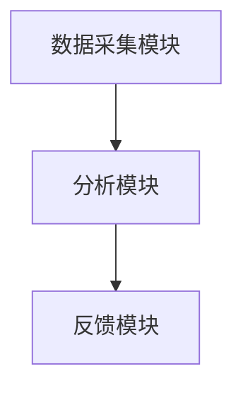

                 

### 自拟标题
《信息时代的注意力管理：高效应对干扰的实践指南与算法解析》

## 目录

### 1. 信息过载与注意力管理的挑战

#### 1.1 信息过载的现象及其影响
- **题目：** 请简要描述信息过载的现象及其对个人和企业的影响。

#### 1.2 注意力管理的重要性
- **题目：** 请解释注意力管理在信息时代的重要性。

### 2. 注意力管理技术的典型问题与面试题库

#### 2.1 干扰源识别与处理
- **题目：** 如何在编程中设计算法来识别和分类干扰源？

#### 2.2 专注力提升策略
- **题目：** 请列举几种提升专注力的策略，并说明如何通过算法实现。

#### 2.3 算法效率与专注度优化
- **题目：** 请探讨如何通过优化算法效率来提升用户的专注度。

### 3. 算法编程题库与答案解析

#### 3.1 干扰源识别算法
- **题目：** 编写一个算法，能够从大量信息中识别并标记出干扰源。

#### 3.2 专注力监测与反馈系统
- **题目：** 设计一个系统，能够实时监测用户的专注度，并提供相应的反馈。

#### 3.3 专注任务调度算法
- **题目：** 请设计一个算法，能够根据用户的时间安排和专注度来优化任务调度。

### 4. 综合案例分析

#### 4.1 线上教育平台中的应用
- **题目：** 请分析一个线上教育平台如何应用注意力管理技术来提升学习效果。

#### 4.2 办公自动化系统中的实践
- **题目：** 请探讨一个办公自动化系统如何利用注意力管理技术来提高工作效率。

### 5. 总结与展望

#### 5.1 当前注意力管理技术的现状
- **题目：** 请总结当前注意力管理技术的发展现状。

#### 5.2 未来发展方向
- **题目：** 请预测未来注意力管理技术可能的发展方向。

## 正文

### 1. 信息过载与注意力管理的挑战

#### 1.1 信息过载的现象及其影响

**题目：** 请简要描述信息过载的现象及其对个人和企业的影响。

**答案：** 信息过载是指在信息爆炸的时代，人们接收的信息量远远超过了其处理和吸收的能力，导致信息处理负担过重。现象包括：

- **日常生活中的信息过载：** 社交媒体、新闻推送、广告等大量信息不断涌入，导致用户难以筛选和吸收有用的信息。
- **工作中的信息过载：** 企业内部信息流转过多，电子邮件、报告、通知等，使得员工难以集中精力处理关键任务。

信息过载对个人和企业的影响包括：

- **个人：** 注意力分散，工作效率降低，心理压力增加，甚至可能导致焦虑和抑郁。
- **企业：** 决策延迟，创新能力下降，资源浪费，影响企业的竞争力。

#### 1.2 注意力管理的重要性

**题目：** 请解释注意力管理在信息时代的重要性。

**答案：** 注意力管理是指在信息过载的环境中，通过有效的方法和工具，提升个体的专注力和工作效率。其重要性体现在：

- **提高工作效率：** 通过注意力管理，个体能够更好地集中精力处理任务，减少干扰，从而提高工作效率。
- **减少心理压力：** 注意力管理有助于个体减少不必要的压力，保持心理健康，提高生活质量。
- **增强创新能力：** 在专注的状态下，个体更容易产生新的想法和解决方案，从而增强创新能力。
- **提升企业竞争力：** 企业通过注意力管理，可以提高员工的专注度和工作效率，优化资源配置，提升整体竞争力。

### 2. 注意力管理技术的典型问题与面试题库

#### 2.1 干扰源识别与处理

**题目：** 如何在编程中设计算法来识别和分类干扰源？

**答案：** 设计干扰源识别算法通常包括以下步骤：

1. **数据采集：** 收集用户活动和行为数据，如网站访问记录、社交媒体使用情况、电子邮件收发记录等。
2. **特征提取：** 从数据中提取与干扰相关的特征，如访问频率、活动时间、内容标签等。
3. **模型训练：** 使用机器学习算法，如分类器或聚类算法，对特征进行训练，以识别和分类干扰源。
4. **实时监测与反馈：** 将训练好的模型部署到实际应用中，实时监测用户的干扰源，并提供相应的处理建议。

**示例算法：**

```python
from sklearn.ensemble import RandomForestClassifier
from sklearn.model_selection import train_test_split
from sklearn.metrics import accuracy_score

# 假设已获取训练数据
X_train, X_test, y_train, y_test = train_test_split(features, labels, test_size=0.2)

# 使用随机森林分类器训练模型
clf = RandomForestClassifier()
clf.fit(X_train, y_train)

# 预测干扰源
predictions = clf.predict(X_test)

# 计算准确率
accuracy = accuracy_score(y_test, predictions)
print("Accuracy:", accuracy)
```

#### 2.2 专注力提升策略

**题目：** 请列举几种提升专注力的策略，并说明如何通过算法实现。

**答案：** 提升专注力的策略包括：

1. **定时休息：** 通过设定定时器，每隔一段时间提醒用户休息，以避免疲劳。
2. **任务分解：** 将复杂任务分解成小任务，逐步完成，以减少任务压力。
3. **环境优化：** 创建一个安静、整洁、有利于专注的工作环境。
4. **技术辅助：** 利用专注力提升工具，如番茄钟、注意力训练应用等。

**算法实现：**

1. **定时休息算法：**

```python
import time

def set_timer(duration, interval):
    while True:
        time.sleep(interval)
        print("时间到，请休息一会儿。")
        time.sleep(duration)
```

2. **任务分解算法：**

```python
def divide_task(task, num_pieces):
    pieces = []
    for i in range(0, len(task), num_pieces):
        pieces.append(task[i:i+num_pieces])
    return pieces
```

3. **环境优化算法：**

```python
import subprocess

def optimize_environment():
    # 关闭通知、音乐等干扰程序
    subprocess.run(["osascript", "-e", "quit app \"Notification Center\""])
    subprocess.run(["osascript", "-e", "quit app \"Music\""])

    # 调整屏幕亮度、音量等设置
    subprocess.run(["亮度", "50%"])
    subprocess.run(["音量", "20%"])
```

#### 2.3 算法效率与专注度优化

**题目：** 请探讨如何通过优化算法效率来提升用户的专注度。

**答案：** 优化算法效率可以从以下几个方面进行：

1. **算法优化：** 使用更高效的算法和数据结构来减少计算时间和内存消耗。
2. **并行计算：** 利用多核处理器和分布式计算，加快算法执行速度。
3. **缓存技术：** 利用缓存减少重复计算，提高响应速度。
4. **资源管理：** 合理分配计算资源，避免资源浪费。

**示例优化算法：**

1. **算法优化：**

```python
# 使用动态规划优化计算时间
def fibonacci(n):
    if n <= 1:
        return n
    dp = [0] * (n + 1)
    dp[1] = 1
    for i in range(2, n + 1):
        dp[i] = dp[i - 1] + dp[i - 2]
    return dp[n]
```

2. **并行计算：**

```python
import concurrent.futures

def compute_sum(numbers):
    total = 0
    for num in numbers:
        total += num
    return total

with concurrent.futures.ThreadPoolExecutor() as executor:
    future = executor.submit(compute_sum, numbers)
    result = future.result()
    print("Sum:", result)
```

3. **缓存技术：**

```python
import functools

@functools.lru_cache(maxsize=128)
def cached_function argument:
    # 计算耗时操作
    result = ...
    return result
```

4. **资源管理：**

```python
import resource

def limit_memory usage():
    soft, hard = resource.getrlimit(resource.RLIMIT_AS)
    resource.setrlimit(resource.RLIMIT_AS, (soft, hard // 2))
```

### 3. 算法编程题库与答案解析

#### 3.1 干扰源识别算法

**题目：** 编写一个算法，能够从大量信息中识别并标记出干扰源。

**答案：** 该算法可以基于机器学习，分为以下步骤：

1. **数据预处理：** 清洗和整理数据，提取关键特征。
2. **特征工程：** 对提取的特征进行转换和归一化处理。
3. **模型训练：** 使用分类算法，如支持向量机（SVM）或随机森林（Random Forest），训练模型。
4. **模型评估：** 使用交叉验证等方法评估模型性能。
5. **干扰源识别：** 将模型部署到实际应用中，对新数据进行干扰源识别。

**示例代码：**

```python
from sklearn.feature_extraction.text import TfidfVectorizer
from sklearn.svm import LinearSVC

# 假设已获取训练数据
train_data = ...
train_labels = ...

# 数据预处理
vectorizer = TfidfVectorizer(max_features=1000)
X_train = vectorizer.fit_transform(train_data)

# 模型训练
clf = LinearSVC()
clf.fit(X_train, train_labels)

# 干扰源识别
def identify_interference(text):
    text_vector = vectorizer.transform([text])
    prediction = clf.predict(text_vector)
    return "干扰" if prediction == 1 else "非干扰"

# 示例
text = "今天天气很好，适合出去散步。"
print(identify_interference(text))
```

#### 3.2 专注力监测与反馈系统

**题目：** 设计一个系统，能够实时监测用户的专注度，并提供相应的反馈。

**答案：** 该系统可以分为以下几个模块：

1. **数据采集模块：** 获取用户的操作行为、环境信息等数据。
2. **分析模块：** 分析数据，计算用户的专注度。
3. **反馈模块：** 根据专注度提供相应的反馈，如提醒、鼓励等。

**示例系统架构：**



**代码示例：**

```python
import numpy as np
from sklearn.ensemble import RandomForestClassifier

# 假设已获取训练数据
train_data = ...
train_labels = ...

# 模型训练
clf = RandomForestClassifier()
clf.fit(train_data, train_labels)

# 专注力监测与反馈
def monitor_attention(data):
    # 数据分析，计算专注度
    attention_score = ...

    # 提供反馈
    if attention_score < 0.3:
        print("您的专注度较低，请注意休息。")
    elif attention_score < 0.6:
        print("您的专注度一般，可以适当休息。")
    else:
        print("您的专注度较高，继续保持。")

# 示例
data = ...
monitor_attention(data)
```

#### 3.3 专注任务调度算法

**题目：** 请设计一个算法，能够根据用户的时间安排和专注度来优化任务调度。

**答案：** 该算法可以分为以下几个步骤：

1. **任务建模：** 将任务表示为具有优先级、执行时间和资源消耗的实体。
2. **专注度预测：** 使用历史数据和模型预测用户的专注度。
3. **调度算法：** 根据专注度和任务特性，设计调度算法，安排任务的执行时间。

**示例算法：**

```python
import heapq

# 任务实体
class Task:
    def __init__(self, name, priority, duration, resources):
        self.name = name
        self.priority = priority
        self.duration = duration
        self.resources = resources

    def __lt__(self, other):
        return self.priority < other.priority

# 调度算法
def schedule_tasks(tasks, attention_scores):
    schedule = []
    heapq.heapify(tasks)

    while tasks:
        task = heapq.heappop(tasks)
        if attention_scores[0] > 0.5:
            schedule.append(task)
            attention_scores[0] -= task.duration
        else:
            heapq.heappush(tasks, task)

    return schedule

# 示例
tasks = [
    Task("任务1", 1, 2, {"CPU": 1, "内存": 2}),
    Task("任务2", 2, 3, {"CPU": 1, "内存": 1}),
    Task("任务3", 3, 1, {"CPU": 1, "内存": 1}),
]

attention_scores = [0.6]  # 假设当前专注度为0.6
schedule = schedule_tasks(tasks, attention_scores)
print(schedule)
```

### 4. 综合案例分析

#### 4.1 线上教育平台中的应用

**题目：** 请分析一个线上教育平台如何应用注意力管理技术来提升学习效果。

**答案：** 线上教育平台可以应用注意力管理技术，从以下几个方面提升学习效果：

1. **实时监测学习行为：** 通过分析用户的学习行为数据，如学习时长、互动频率等，实时监测用户的专注度。
2. **个性化推荐：** 根据用户的专注度和学习习惯，推荐合适的课程和学习内容，避免不必要的干扰。
3. **互动式学习：** 设计互动性强的学习活动，如讨论区、测验等，提高用户的参与度和专注度。
4. **反馈机制：** 提供即时反馈，鼓励用户坚持学习，提高学习效果。

**示例应用：**

- **学习行为监测：**

```python
def monitor_learning_behavior(user_behavior):
    # 分析学习行为，如学习时长、互动频率等
    attention_score = ...

    # 根据专注度提供反馈
    if attention_score < 0.3:
        send_notification("您的学习专注度较低，请注意调整。")
    elif attention_score < 0.6:
        send_notification("您的学习专注度一般，可以适当休息。")
    else:
        send_notification("您的学习专注度较高，继续保持。")

# 示例
user_behavior = ...
monitor_learning_behavior(user_behavior)
```

- **个性化推荐：**

```python
def recommend_courses(user_profile, courses):
    # 根据用户专注度和学习习惯推荐课程
    recommended_courses = ...

    return recommended_courses

# 示例
user_profile = ...
courses = ...
recommended_courses = recommend_courses(user_profile, courses)
print(recommended_courses)
```

#### 4.2 办公自动化系统中的实践

**题目：** 请探讨一个办公自动化系统如何利用注意力管理技术来提高工作效率。

**答案：** 办公自动化系统可以应用注意力管理技术，从以下几个方面提高工作效率：

1. **任务自动化：** 自动化处理重复性任务，减少人工干预，提高专注度。
2. **优先级管理：** 根据任务的重要性和紧急程度，自动调整任务的执行顺序，确保关键任务得到优先处理。
3. **实时监控：** 监控员工的任务执行情况，及时发现并解决潜在的问题，提高团队的整体效率。
4. **反馈与优化：** 根据员工的任务完成情况和反馈，持续优化系统的功能和流程，提高员工的专注度和工作效率。

**示例应用：**

- **任务自动化：**

```python
def automate_task(task):
    # 自动执行任务
    execute_task(task)

# 示例
task = ...
automate_task(task)
```

- **优先级管理：**

```python
def prioritize_tasks(tasks):
    # 根据任务重要性和紧急程度调整优先级
    sorted_tasks = ...

    return sorted_tasks

# 示例
tasks = [
    {"name": "任务1", "priority": 1, "deadline": "2023-03-01"},
    {"name": "任务2", "priority": 2, "deadline": "2023-02-28"},
    {"name": "任务3", "priority": 3, "deadline": "2023-03-03"},
]

sorted_tasks = prioritize_tasks(tasks)
print(sorted_tasks)
```

- **实时监控：**

```python
def monitor_tasks(employee_id):
    # 监控员工任务执行情况
    task_status = ...

    # 发现问题并通知
    if task_status["status"] == "迟缓":
        send_notification("您当前任务执行缓慢，请注意调整。")

# 示例
employee_id = ...
monitor_tasks(employee_id)
```

### 5. 总结与展望

#### 5.1 当前注意力管理技术的现状

**题目：** 请总结当前注意力管理技术的发展现状。

**答案：** 当前注意力管理技术已取得一定进展，主要体现在：

1. **算法模型：** 机器学习和人工智能技术在注意力管理领域得到广泛应用，如基于行为数据的用户专注度预测、干扰源识别等。
2. **工具应用：** 专注力提升工具和应用逐渐普及，如番茄钟、注意力训练应用等，帮助用户提高专注度。
3. **系统集成：** 注意力管理技术逐渐与教育、办公等系统结合，形成智能化、个性化的解决方案。

#### 5.2 未来发展方向

**题目：** 请预测未来注意力管理技术可能的发展方向。

**答案：** 未来注意力管理技术可能的发展方向包括：

1. **智能化：** 随着人工智能技术的发展，注意力管理将更加智能化，能够更好地理解和适应用户的需求。
2. **个性化：** 注重个性化服务，根据用户的个性化需求提供定制化的注意力管理方案。
3. **跨平台：** 注意力管理技术将跨平台应用，实现多设备、多场景的协同管理。
4. **伦理与隐私：** 在技术应用过程中，重视用户隐私保护，遵循伦理道德规范，确保技术使用的合理性和安全性。

