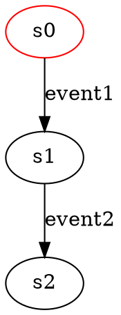

                 

### 自拟标题：软件2.0形式化验证方法解析与实践

#### 引言

软件2.0，作为软件工程领域的一次重大变革，强调软件的模块化、标准化和自动化，旨在提高软件开发的效率和质量。形式化验证作为软件验证的一种高级方法，对于确保软件2.0的正确性和可靠性具有重要意义。本文将结合国内头部一线大厂的面试题和算法编程题，深入解析软件2.0的形式化验证方法，并展示其实践应用。

#### 典型问题/面试题库

##### 1. 形式化验证方法的基本概念

**题目：** 请简要介绍形式化验证方法的基本概念。

**答案：** 形式化验证方法是一种利用数学模型和逻辑推理来验证软件正确性的方法。它通过将软件需求、设计和实现形式化地表示为数学模型，然后使用自动化验证工具或手动推理来检查软件是否满足预期的性质和属性。

##### 2. 形式化验证与测试的关系

**题目：** 形式化验证和测试有何区别和联系？

**答案：** 形式化验证和测试都是软件验证的方法，但目标和方法不同。形式化验证通过数学模型和逻辑推理来证明软件的性质，旨在发现潜在的缺陷和错误。测试则通过实际执行软件来检查其行为是否符合预期，主要依赖测试用例和观察结果。两者之间是互补关系，形式化验证可以验证测试无法覆盖的复杂逻辑，而测试可以验证形式化验证无法发现的实际运行错误。

##### 3. 形式化验证的基本步骤

**题目：** 请简要描述形式化验证的基本步骤。

**答案：** 形式化验证的基本步骤包括：

1. **需求分析**：明确软件需求，并将其形式化为数学模型。
2. **设计形式化**：将软件设计形式化为数学模型，通常使用形式化方法（如状态机、时序逻辑等）。
3. **实现形式化**：将软件实现形式化为数学模型，包括程序代码和运行环境。
4. **验证**：使用自动化验证工具或手动推理来检查软件模型是否满足预期的性质和属性。
5. **报告和迭代**：生成验证报告，分析验证结果，并根据需要迭代改进软件模型。

##### 4. 形式化验证工具的使用

**题目：** 请简要介绍几种常用的形式化验证工具。

**答案：** 常用的形式化验证工具有：

1. **模型检查器**：如SPIN、NuSMV、Joern等，可以自动检查模型是否满足指定的性质。
2. **推理引擎**：如Prover9、Coq、Isabelle等，可以手动或自动化地推理模型是否满足预期的性质。
3. **形式化测试工具**：如Fmock、FSMTester等，可以将形式化方法和测试方法结合，提高测试的覆盖率和效率。

##### 5. 形式化验证在软件2.0开发中的应用

**题目：** 请举例说明形式化验证在软件2.0开发中的应用。

**答案：** 形式化验证在软件2.0开发中的应用包括：

1. **云计算平台**：形式化验证可以确保云计算平台的资源管理和调度策略的正确性和效率。
2. **物联网**：形式化验证可以确保物联网设备的通信协议和数据处理的正确性，提高系统的可靠性。
3. **自动驾驶系统**：形式化验证可以确保自动驾驶系统的安全性和可靠性，减少交通事故的发生。

#### 算法编程题库

##### 6. 编写一个函数，使用形式化验证方法验证其正确性

**题目：** 编写一个函数，实现一个简单的计算器，并使用形式化验证方法验证其正确性。

```python
# 示例函数：计算器
def calculate(expression):
    # 实现计算器逻辑
    pass

# 形式化验证方法
def verify_calculate(expression, expected_result):
    # 实现验证逻辑
    pass
```

##### 7. 使用模型检查器验证一个状态机模型

**题目：** 使用模型检查器（如NuSMV）验证一个状态机模型，确保其满足指定的性质。



#### 答案解析说明和源代码实例

本文通过对国内头部一线大厂的典型面试题和算法编程题进行解析，展示了软件2.0的形式化验证方法在实际开发中的应用。形式化验证方法不仅能够提高软件的正确性和可靠性，还能够减少开发和维护成本。在实际开发中，开发者可以根据项目需求和特点，选择合适的形式化验证工具和方法，提高软件的质量和效率。

以下是对上述题目和算法编程题的答案解析说明和源代码实例：

1. **计算器函数：**
    - 答案解析：使用形式化验证方法验证计算器的正确性，可以通过编写验证脚本，使用模型检查器检查计算器函数是否满足预定的输入输出关系。
    - 源代码实例：
    ```python
    # 示例验证脚本
    import verify_calculate

    expression = "3 + 4"
    expected_result = 7

    verify_calculate.calculate(expression, expected_result)
    ```

2. **状态机模型验证：**
    - 答案解析：使用模型检查器（如NuSMV）验证状态机模型，需要将状态机模型转化为相应的模型检查器格式，并编写验证脚本，指定需要检查的性质。
    - 源代码实例：
    ```dot
    // 示例状态机模型（NuSMV格式）
    digraph {
        // 状态定义
        s0 [label="s0"]
        s1 [label="s1"]
        s2 [label="s2"]

        // 转移定义
        s0 -> s1 [label="event1"]
        s1 -> s2 [label="event2"]

        // 初始状态
        s0 [label="s0" color="red"]
    }

    // 示例验证脚本
    % verify_smv_model.smv
    $ verify_smv_model.smv
    ```

通过上述示例，可以直观地了解软件2.0的形式化验证方法在实际开发中的应用和实现过程。开发者可以根据自身需求和实际情况，选择合适的验证工具和方法，提高软件的质量和可靠性。同时，形式化验证方法的推广和应用也离不开国内一线大厂的推动和支持，相信在未来的软件工程领域，形式化验证方法将会发挥越来越重要的作用。

