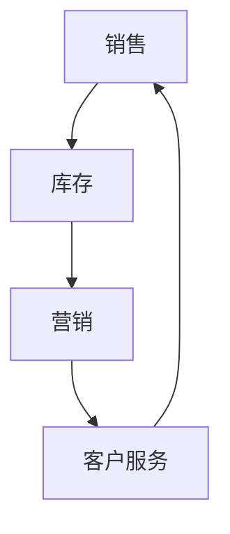

                 

### 自拟标题

**提升系统思考能力：管理者必备的五大策略与实例解析**

### 前言

在当今复杂多变的市场环境中，管理者需要具备强大的系统思考能力，以应对各种挑战和变化。系统思考不仅能够帮助管理者把握全局，还能促进组织内部的协同与效率。本文将围绕“管理者如何提升系统思考能力”这一主题，深入探讨相关领域的典型问题与面试题库，并通过实例解析，帮助管理者掌握系统思考的核心技巧。

### 面试题库与解析

#### 1. 什么是系统思考？

**题目：** 请简述系统思考的概念及其在管理中的应用。

**答案：** 系统思考是一种通过整体视角来理解和解决复杂问题的方法论。在管理中，系统思考能够帮助管理者从全局角度审视组织，识别关键要素及其相互关系，从而制定更为科学和有效的决策。

**解析：** 系统思考强调将组织视为一个动态系统，关注各要素之间的相互作用和反馈循环。通过系统思考，管理者能够更好地理解组织的运作机制，发现潜在问题，并采取相应措施进行改进。

#### 2. 系统思考的核心原则是什么？

**题目：** 请列举系统思考的核心原则，并简要解释其在管理中的应用。

**答案：**

1. **整体性原则：** 管理者应将组织视为一个整体，关注各部分之间的相互作用和相互依赖。
2. **反馈循环原则：** 管理者应识别并分析组织内部的反馈循环，以避免不良循环的产生。
3. **适应性原则：** 管理者应具备适应环境变化的能力，通过调整组织结构、流程和策略来应对外部挑战。
4. **动态性原则：** 管理者应认识到组织是一个动态系统，不断调整和优化内部要素和关系。

**解析：** 这些核心原则为管理者提供了系统思考的基本框架，有助于他们在面对复杂问题时，能够从多个角度进行分析和决策。

#### 3. 如何运用系统思考进行战略规划？

**题目：** 请举例说明管理者如何运用系统思考进行战略规划。

**答案：** 管理者可以通过以下步骤运用系统思考进行战略规划：

1. **明确目标：** 确定组织的目标和愿景，确保战略规划与组织使命一致。
2. **分析环境：** 了解组织所处的外部环境，包括市场、竞争、政策等因素。
3. **识别关键要素：** 识别影响战略实施的关键要素，如资源、能力、合作伙伴等。
4. **建立模型：** 构建系统模型，分析各要素之间的关系和反馈循环。
5. **制定策略：** 根据系统模型，制定具体的战略计划和行动方案。
6. **评估与调整：** 定期评估战略实施的效果，根据反馈进行必要调整。

**解析：** 通过运用系统思考，管理者能够从全局角度制定战略规划，确保组织在复杂环境中保持竞争力和可持续发展。

### 算法编程题库与解析

#### 4. 如何用图表示系统模型？

**题目：** 请用图表示以下系统模型：一家电商公司的销售、库存、营销和客户服务等部门之间的相互作用。

**答案：** 可以使用网络图（Network Graph）来表示该系统模型。以下是一个简化的示例：



**解析：** 通过图表示系统模型，可以直观地展示各部门之间的相互作用和反馈循环，有助于管理者分析系统结构及其动态行为。

#### 5. 如何用算法分析反馈循环？

**题目：** 请用算法分析以下系统模型中的反馈循环：一家公司通过增加广告投入来提升销售额，但销售额的增加又导致广告成本上升，进而影响利润。

**答案：** 可以使用微分方程（Differential Equations）来分析该系统模型中的反馈循环。以下是一个简化的示例：

```python
import numpy as np
import matplotlib.pyplot as plt

def model(t, x):
    # t: 时间
    # x: 销售额
    return 0.1 * x - 0.01 * x

t = np.linspace(0, 10, 1000)
x = np.zeros_like(t)

for i in range(1, len(t)):
    x[i] = model(t[i], x[i-1])

plt.plot(t, x)
plt.xlabel('Time')
plt.ylabel('Sales')
plt.title('Feedback Loop Analysis')
plt.show()
```

**解析：** 通过微分方程，可以描述系统中的动态变化和反馈循环。该示例展示了销售额随时间的变化趋势，有助于管理者分析系统模型的稳定性和可持续性。

### 结论

通过以上面试题和算法编程题的解析，我们可以看到系统思考在管理中的应用具有重要的意义。管理者需要不断学习和实践系统思考的方法和技巧，以提高系统思考能力，从而更好地应对复杂多变的市场环境。希望本文能对管理者提升系统思考能力提供一些启示和帮助。

