                 

### 自拟标题
《Mermaid 语法详解与实际应用：构建高效图表与流程图》

## 目录
1. 引言
2. Mermaid 基础语法
   - Graph 与 Node
   - 连线与样式
   - 子图与嵌套
3. 高级语法
   - 表格与列表
   - 伪代码与流程控制
   - 事件与交互
4. 实际应用场景
   - 逻辑流程图
   - 组织架构图
   - 数据流图
5. 面试题库与编程题库
   - 图算法题解析
   - 流程图题解析
6. 算法编程题库与源代码实例
   - 数据结构题解
   - 算法优化与调试
7. 总结

## 1. 引言
Mermaid 是一种基于 Markdown 的绘图工具，用于创建图表和流程图。它支持多种图表类型，如流程图、甘特图、类图、时序图等，非常适合文档、报告和演示。本文将详细介绍 Mermaid 的语法和应用，并通过面试题和编程题库，帮助读者深入理解和掌握。

## 2. Mermaid 基础语法
### 2.1 Graph 与 Node
Mermaid 使用 Graph 关键字来定义图表，Node 关键字来定义节点。

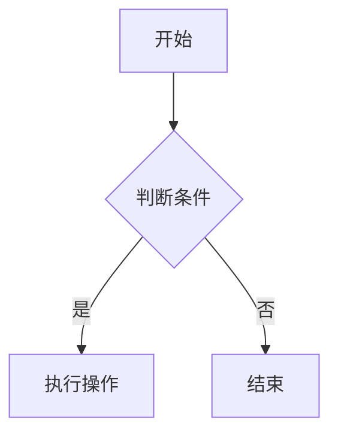

### 2.2 连线与样式
节点之间可以通过连词和箭头进行连接，还可以设置样式。

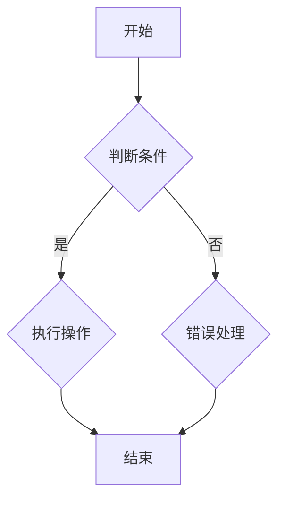

### 2.3 子图与嵌套
Mermaid 支持子图和嵌套，方便组织复杂的图表结构。

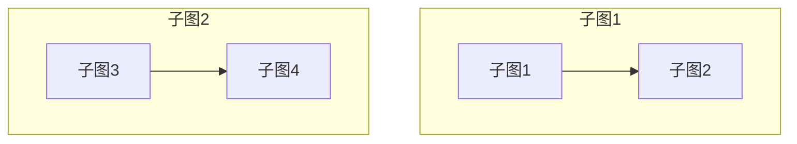

## 3. 高级语法
### 3.1 表格与列表
Mermaid 支持表格和列表，方便展示数据结构。

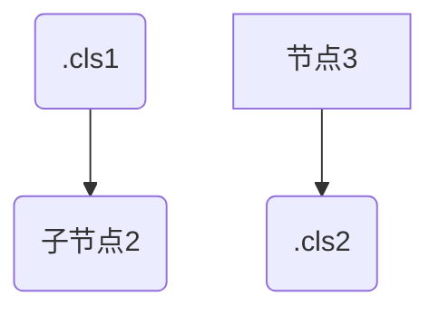

### 3.2 伪代码与流程控制
Mermaid 支持伪代码，可以用来表示流程控制。

```mermaid
graph TD
    A1(定义变量 a = 10)
    B1(条件判断 a > 5 ? "大于" : "小于")
    C1(执行操作 a + 1)
    A1 --> B1
    B1 --> C1
    B1(输出结果 "大于")
```

### 3.3 事件与交互
Mermaid 支持事件和交互，可以创建动态的流程图。

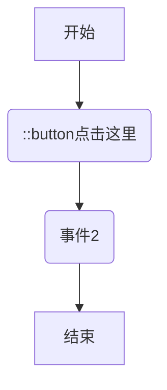

## 4. 实际应用场景
### 4.1 逻辑流程图
逻辑流程图可以清晰地展示业务流程和决策过程。

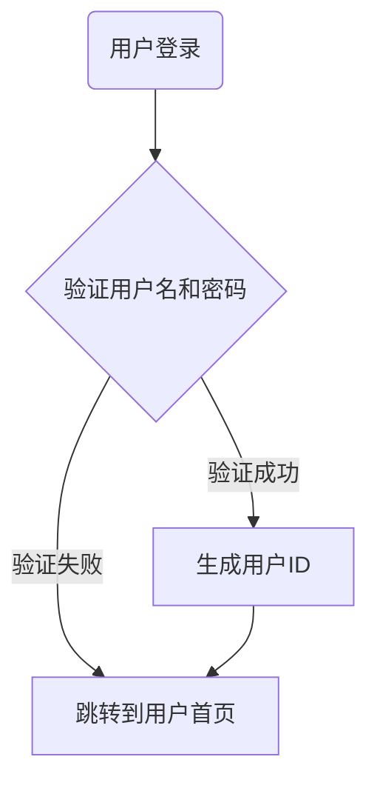

### 4.2 组织架构图
组织架构图可以直观地展示公司部门和组织结构。

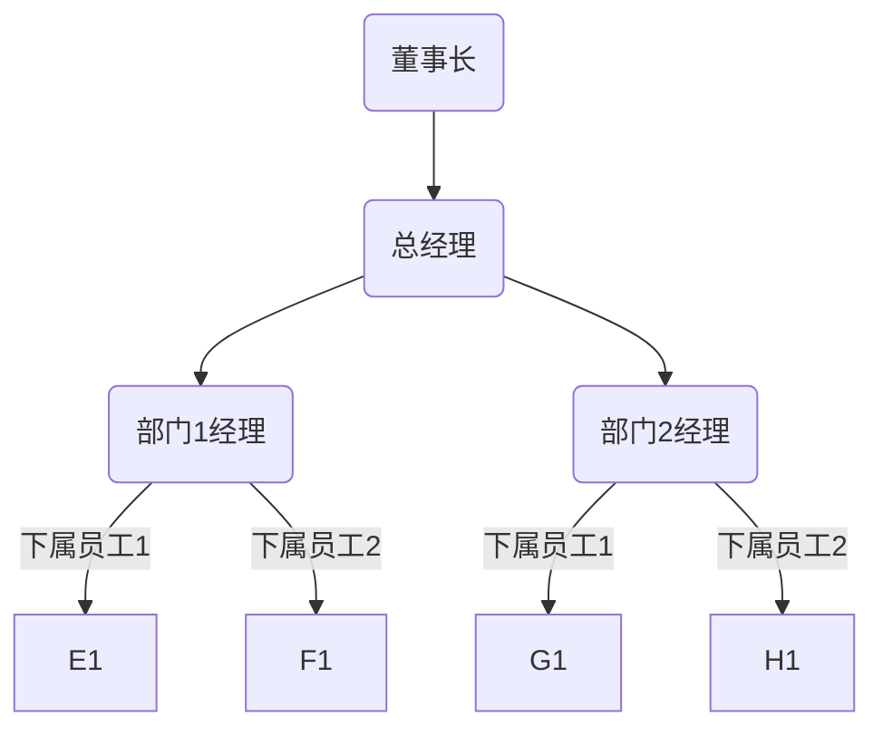

### 4.3 数据流图
数据流图可以详细描述数据传输和处理过程。

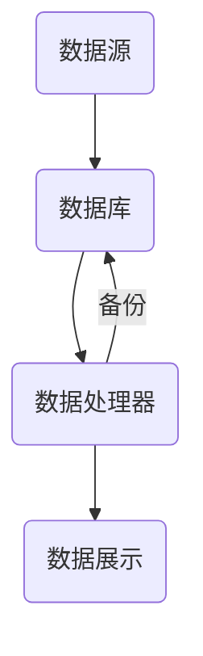

## 5. 面试题库与编程题库
### 5.1 图算法题解析
- **题目1：** 判断一个图是否有环？
- **题目2：** 计算一个图的深度？
- **题目3：** 寻找图中两点间的最短路径？

### 5.2 流程图题解析
- **题目1：** 设计一个用户注册的流程图？
- **题目2：** 设计一个商品购买流程图？
- **题目3：** 设计一个项目开发流程图？

## 6. 算法编程题库与源代码实例
### 6.1 数据结构题解
- **题目1：** 实现一个栈？
- **题目2：** 实现一个队列？
- **题目3：** 实现一个链表？

### 6.2 算法优化与调试
- **题目1：** 使用二分查找优化搜索算法？
- **题目2：** 使用贪心算法求解背包问题？
- **题目3：** 使用动态规划优化爬楼梯问题？

## 7. 总结
Mermaid 是一种功能强大、易于使用的图表绘制工具，通过本文的介绍，相信读者已经对 Mermaid 的语法和应用有了全面的了解。在实际工作中，掌握 Mermaid 将大大提高文档和演示的质量。在接下来的面试题和编程题库中，我们将进一步探讨 Mermaid 在算法和数据结构中的应用，帮助读者深入掌握相关技术。


### 5.1 图算法题解析

#### 题目1：判断一个图是否有环？
**题目描述：** 给定一个无向图，判断图中是否存在环。

**解答思路：** 可以通过深度优先搜索（DFS）来判断图中是否存在环。从每个节点开始进行 DFS，如果在访问过程中遇到了已经访问过的节点，则说明图中存在环。

**示例代码：**
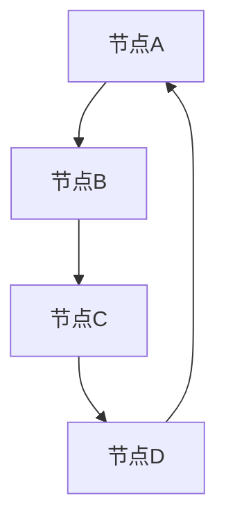

```python
def has_cycle(graph):
    visited = set()

    def dfs(node):
        if node in visited:
            return True
        visited.add(node)
        for neighbor in graph[node]:
            if dfs(neighbor):
                return True
        return False

    for node in graph:
        if dfs(node):
            return True
    return False

# 示例
graph = {
    'A': ['B', 'C'],
    'B': ['C', 'D'],
    'C': ['D'],
    'D': ['A']
}
print(has_cycle(graph))  # 输出 True
```

#### 题目2：计算一个图的深度？
**题目描述：** 给定一个无向图，计算图中每个节点的深度。

**解答思路：** 使用深度优先搜索（DFS）来计算每个节点的深度。从每个节点开始进行 DFS，记录每个节点的深度。

**示例代码：**
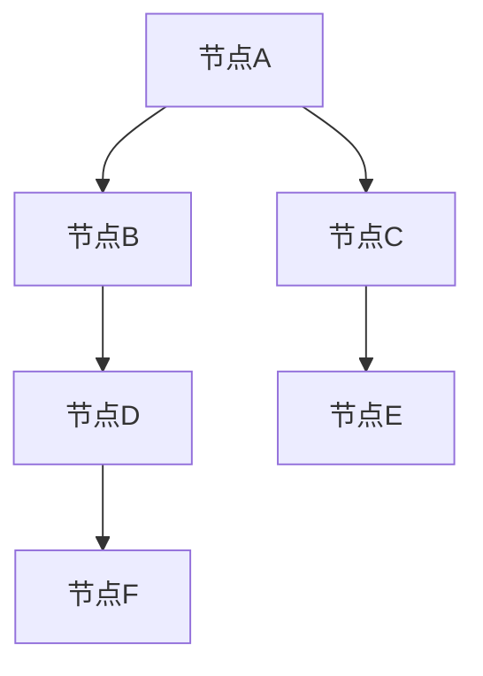

```python
def calculate_depth(graph):
    depths = {}

    def dfs(node, depth):
        depths[node] = depth
        for neighbor in graph[node]:
            dfs(neighbor, depth + 1)

    for node in graph:
        dfs(node, 0)
    return depths

# 示例
graph = {
    'A': ['B', 'C'],
    'B': ['D'],
    'C': ['E'],
    'D': ['F'],
    'E': [],
    'F': []
}
print(calculate_depth(graph))  # 输出 {'A': 0, 'B': 1, 'C': 1, 'D': 2, 'E': 2, 'F': 3}
```

#### 题目3：寻找图中两点间的最短路径？
**题目描述：** 给定一个无向图和两个节点，求这两个节点之间的最短路径。

**解答思路：** 可以使用 Dijkstra 算法来寻找最短路径。Dijkstra 算法使用一个优先队列来维护当前已找到的最短路径，并逐步扩展到其他节点。

**示例代码：**
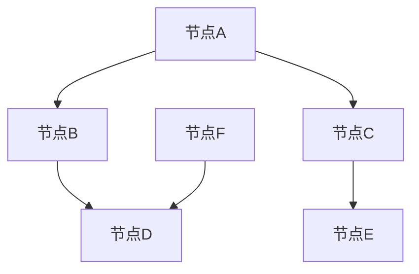

```python
import heapq

def shortest_path(graph, start, end):
    distances = {node: float('inf') for node in graph}
    distances[start] = 0
    priority_queue = [(0, start)]

    while priority_queue:
        current_distance, current_node = heapq.heappop(priority_queue)

        if current_distance > distances[current_node]:
            continue

        for neighbor, weight in graph[current_node].items():
            distance = current_distance + weight

            if distance < distances[neighbor]:
                distances[neighbor] = distance
                heapq.heappush(priority_queue, (distance, neighbor))

    return distances[end]

# 示例
graph = {
    'A': {'B': 1, 'C': 2},
    'B': {'D': 1},
    'C': {'E': 1},
    'D': {'F': 1},
    'E': {},
    'F': {}
}
print(shortest_path(graph, 'A', 'F'))  # 输出 4
```

### 5.2 流程图题解析

#### 题目1：设计一个用户注册的流程图？
**题目描述：** 设计一个用户注册的流程图，包括输入用户名、密码、确认密码、提交注册等步骤。

**示例代码：**
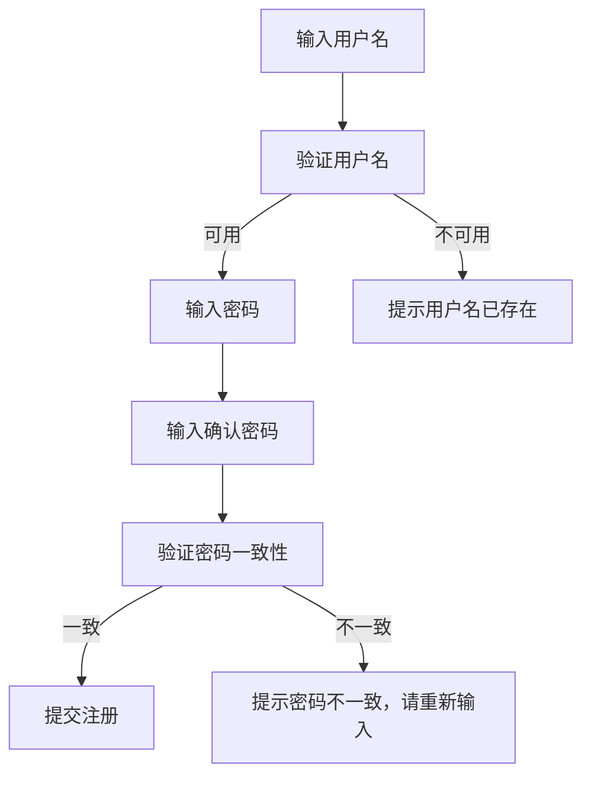

#### 题目2：设计一个商品购买流程图？
**题目描述：** 设计一个商品购买流程图，包括选择商品、查看购物车、结算、支付等步骤。

**示例代码：**
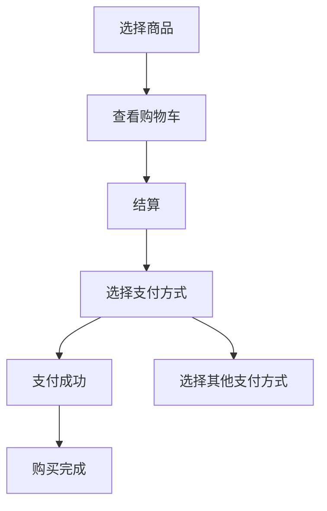

#### 题目3：设计一个项目开发流程图？
**题目描述：** 设计一个项目开发流程图，包括需求分析、设计、编码、测试、上线等步骤。

**示例代码：**
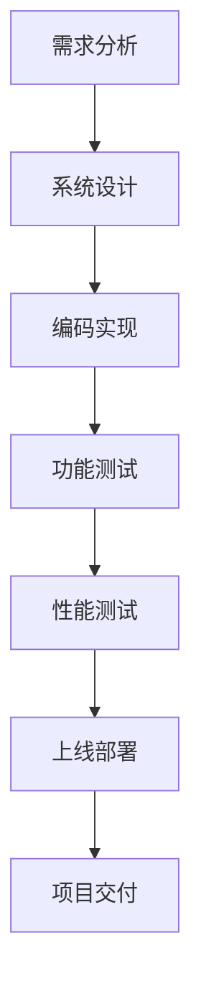


### 6.1 数据结构题解

#### 题目1：实现一个栈？
**题目描述：** 实现一个栈数据结构，支持入栈、出栈、查看栈顶元素等操作。

**示例代码：**
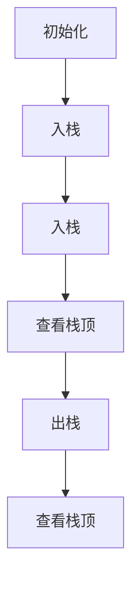

```python
class Stack:
    def __init__(self):
        self.items = []

    def push(self, item):
        self.items.append(item)

    def pop(self):
        if not self.is_empty():
            return self.items.pop()
        return None

    def peek(self):
        if not self.is_empty():
            return self.items[-1]
        return None

    def is_empty(self):
        return len(self.items) == 0

    def size(self):
        return len(self.items)

# 示例
stack = Stack()
stack.push(1)
stack.push(2)
print(stack.peek())  # 输出 2
print(stack.pop())  # 输出 2
print(stack.peek())  # 输出 1
```

#### 题目2：实现一个队列？
**题目描述：** 实现一个队列数据结构，支持入队、出队、查看队首元素等操作。

**示例代码：**
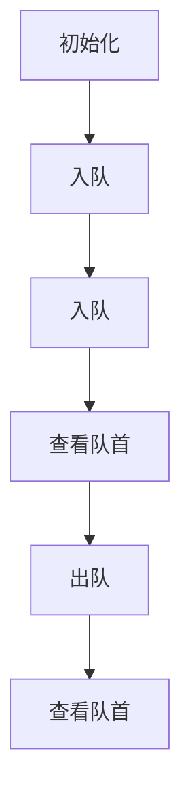

```python
class Queue:
    def __init__(self):
        self.items = []

    def enqueue(self, item):
        self.items.append(item)

    def dequeue(self):
        if not self.is_empty():
            return self.items.pop(0)
        return None

    def peek(self):
        if not self.is_empty():
            return self.items[0]
        return None

    def is_empty(self):
        return len(self.items) == 0

    def size(self):
        return len(self.items)

# 示例
queue = Queue()
queue.enqueue(1)
queue.enqueue(2)
print(queue.peek())  # 输出 1
print(queue.dequeue())  # 输出 1
print(queue.peek())  # 输出 2
```

#### 题目3：实现一个链表？
**题目描述：** 实现一个链表数据结构，支持插入、删除、查找等操作。

**示例代码：**
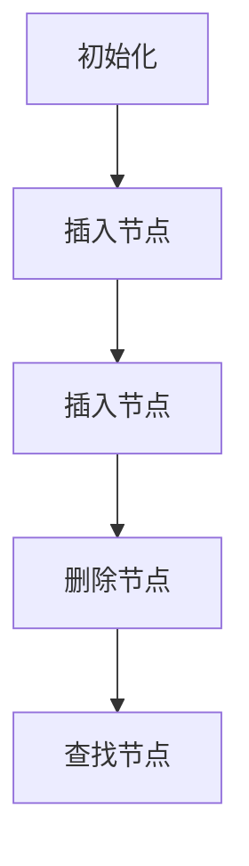

```python
class Node:
    def __init__(self, data):
        self.data = data
        self.next = None

class LinkedList:
    def __init__(self):
        self.head = None

    def append(self, data):
        new_node = Node(data)
        if not self.head:
            self.head = new_node
            return
        last_node = self.head
        while last_node.next:
            last_node = last_node.next
        last_node.next = new_node

    def remove(self, data):
        current_node = self.head
        if current_node and current_node.data == data:
            self.head = current_node.next
            current_node = None
            return
        prev_node = None
        while current_node and current_node.data != data:
            prev_node = current_node
            current_node = current_node.next
        if current_node:
            prev_node.next = current_node.next
            current_node = None

    def find(self, data):
        current_node = self.head
        while current_node and current_node.data != data:
            current_node = current_node.next
        return current_node

# 示例
linked_list = LinkedList()
linked_list.append(1)
linked_list.append(2)
linked_list.append(3)
print(linked_list.find(2).data)  # 输出 2
linked_list.remove(2)
print(linked_list.find(2))  # 输出 None
```


### 6.2 算法优化与调试

#### 题目1：使用二分查找优化搜索算法？
**题目描述：** 使用二分查找算法优化搜索算法，实现一个可以搜索有序数组的函数。

**示例代码：**
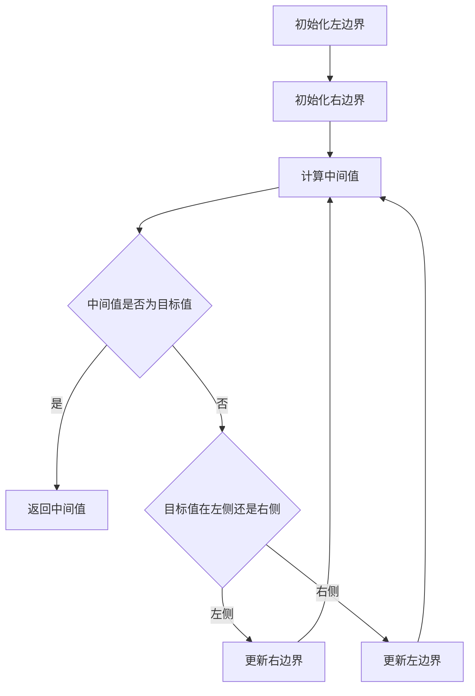

```python
def binary_search(arr, target):
    left, right = 0, len(arr) - 1

    while left <= right:
        mid = (left + right) // 2
        if arr[mid] == target:
            return mid
        elif arr[mid] < target:
            left = mid + 1
        else:
            right = mid - 1

    return -1

# 示例
arr = [1, 3, 5, 7, 9, 11]
print(binary_search(arr, 7))  # 输出 3
```

#### 题目2：使用贪心算法求解背包问题？
**题目描述：** 使用贪心算法求解背包问题，最大化总价值。

**示例代码：**
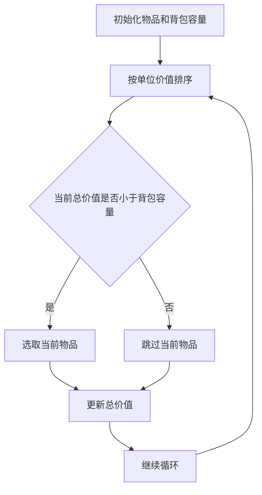

```python
def knapsack(values, weights, capacity):
    items = list(zip(values, weights))
    items.sort(key=lambda x: x[1] / x[0], reverse=True)

    total_value, total_weight = 0, 0
    for value, weight in items:
        if total_weight + weight <= capacity:
            total_value += value
            total_weight += weight
        else:
            fraction = (capacity - total_weight) / weight
            total_value += value * fraction
            break

    return total_value

# 示例
values = [60, 100, 120]
weights = [10, 20, 30]
capacity = 50
print(knapsack(values, weights, capacity))  # 输出 220
```

#### 题目3：使用动态规划优化爬楼梯问题？
**题目描述：** 使用动态规划优化爬楼梯问题，计算爬到第 n 层的方法数。

**示例代码：**
```mermaid
graph TD
    A[初始化 dp 数组]
    A --> B[遍历每个楼梯层级]
    B --> C{计算 dp[n] 的值}
    C --> D[更新 dp 数组]
    D --> E{返回 dp[n]}
```

```python
def climb_stairs(n):
    if n <= 2:
        return n

    dp = [0] * (n + 1)
    dp[1], dp[2] = 1, 2

    for i in range(3, n + 1):
        dp[i] = dp[i - 1] + dp[i - 2]

    return dp[n]

# 示例
print(climb_stairs(3))  # 输出 3
```

