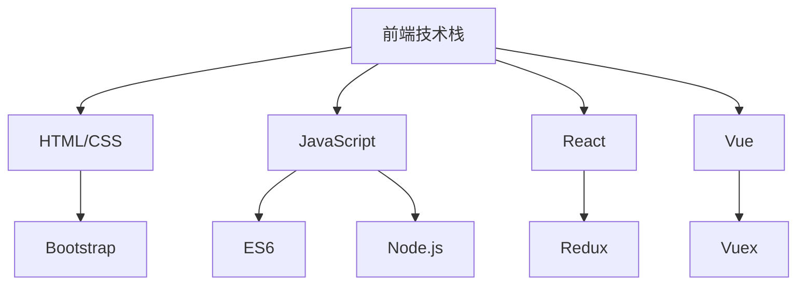

                 

### **程序员如何应对技术栈快速更新**

在当今快速发展的技术行业中，技术栈的更新速度非常快，这给程序员带来了巨大的挑战。如何应对这种快速变化，保持技术竞争力，成为了每个程序员都需要面对的问题。本文将探讨一些有效的策略和实用的建议，帮助程序员应对技术栈的快速更新。

#### **1. 保持持续学习**

**题目：** 如何有效利用业余时间学习新技能？

**答案：**

- **在线课程和教程：** 通过网站如Coursera、Udemy、edX等，选择适合自己兴趣和职业发展的课程，进行系统学习。
- **技术博客和社区：** 定期阅读技术博客，如Medium、Stack Overflow、GitHub等，了解行业动态和技术趋势。
- **技术讲座和研讨会：** 参加线上或线下的技术讲座、研讨会，与行业专家和同行交流。

**举例：**

```python
# 使用 Python 读取 Medium 上的一篇技术文章
import requests
from bs4 import BeautifulSoup

url = "https://medium.com/@example_user/your-article-title"
response = requests.get(url)
soup = BeautifulSoup(response.text, 'html.parser')
article_content = soup.find('div', {'class': 'content'})

print(article_content.text)
```

#### **2. 实践与项目**

**题目：** 如何在没有实际项目的情况下，锻炼编程能力？

**答案：**

- **个人项目：** 自己设计并实现小项目，如开源项目或个人博客，提升实际编程和解决问题能力。
- **代码贡献：** 参与开源项目，为他人项目提供代码贡献，学习并实践团队协作和版本控制。
- **在线编程挑战：** 参与在线编程竞赛和挑战，如LeetCode、HackerRank等，提高算法和数据结构水平。

**举例：**

```java
// Java 实现「两数之和」
public class TwoSum {
    public int[] twoSum(int[] nums, int target) {
        Map<Integer, Integer> numMap = new HashMap<>();
        for (int i = 0; i < nums.length; i++) {
            int complement = target - nums[i];
            if (numMap.containsKey(complement)) {
                return new int[] { numMap.get(complement), i };
            }
            numMap.put(nums[i], i);
        }
        throw new IllegalArgumentException("No two sum solution");
    }
}
```

#### **3. 建立技术储备**

**题目：** 程序员应该如何建立和维护自己的技术储备库？

**答案：**

- **知识管理系统：** 使用诸如Notion、Trello等工具，建立自己的知识管理系统，记录学习笔记和技术文档。
- **技术栈地图：** 绘制自己的技术栈地图，明确熟悉和陌生的技术领域，有针对性地进行学习。
- **书籍和资料：** 阅读相关领域的经典书籍，如《算法导论》、《设计模式：可复用面向对象软件的基础》等，夯实理论基础。

**举例：**



#### **4. 跨学科学习**

**题目：** 程序员如何通过跨学科学习提升自己的竞争力？

**答案：**

- **心理学：** 学习心理学有助于更好地理解用户需求，提高用户体验。
- **产品管理：** 学习产品管理知识，提高对产品设计和流程的理解，有助于在团队中发挥更大作用。
- **项目管理：** 学习项目管理技能，提升团队协作和管理能力。

**举例：**

```javascript
// JavaScript 实现简单的用户需求分析
function analyzeUserNeeds(questions) {
    let needs = {};

    questions.forEach(question => {
        needs[question] = prompt(`请描述您对${question}的需求：`);
    });

    return needs;
}

let userNeeds = analyzeUserNeeds(['网站性能优化', '用户体验设计']);
console.log(userNeeds);
```

#### **5. 与行业专家交流**

**题目：** 程序员如何建立和维护自己的行业人脉？

**答案：**

- **参加技术会议和活动：** 通过参加技术会议、研讨会和行业交流活动，结识行业专家和同行。
- **在线社交网络：** 利用LinkedIn、GitHub等平台，关注行业领袖和专家，进行知识分享和交流。
- **内部培训和分享：** 在公司内部组织或参与技术培训和分享会，提升团队整体技术水平。

**举例：**

```python
# Python 代码示例：使用 LinkedIn API 获取用户关注的人的资料
fromlinkedinapi import LinkedinApi

api = LinkedinApi('YOUR_API_KEY', 'YOUR_API_SECRET', 'YOUR_REDIRECT_URL')
user = api.GetProfile()

# 获取用户关注的人
people = api.GetPeople/~
for person in people:
    print(person['firstName'], person['lastName'])
```

#### **6. 调整职业规划**

**题目：** 程序员如何调整职业规划，以应对技术栈的快速变化？

**答案：**

- **技能多元化：** 不仅专注于技术实现，还要关注业务和行业趋势，提升自己的综合能力。
- **职业转型：** 根据行业需求和个人兴趣，适时考虑职业转型，如产品经理、数据科学家等。
- **职业咨询：** 寻求职业规划师的帮助，制定符合自己发展的职业规划。

**举例：**

```python
# Python 代码示例：使用职业规划 API 获取职业建议
import requests

url = "https://api.careers360.com/v1/career-advice/suggestions"
params = {
    "qualification": "B.Tech",
    "experience": "3-5 years",
    "interests": "data science, product management"
}

response = requests.get(url, params=params)
suggestions = response.json()

print(suggestions['suggestions'])
```

通过上述策略和建议，程序员可以更好地应对技术栈的快速更新，提升自身竞争力，保持行业领先地位。在不断变化的技术浪潮中，持续学习和适应变化是程序员成功的核心要素。

