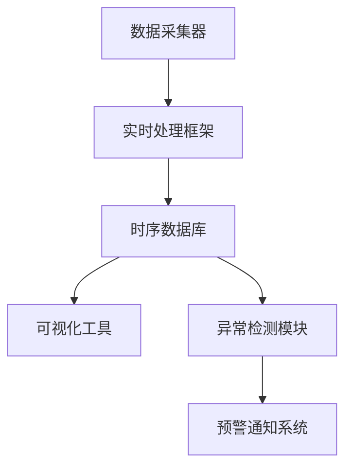
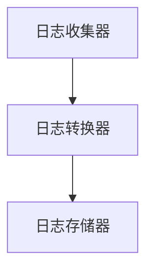
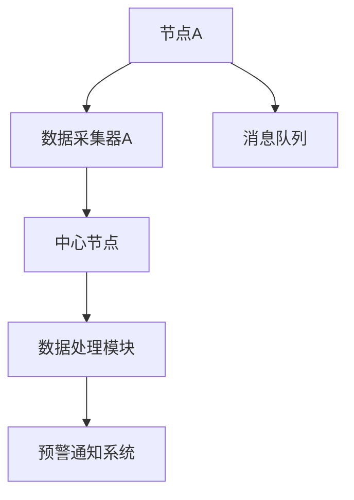
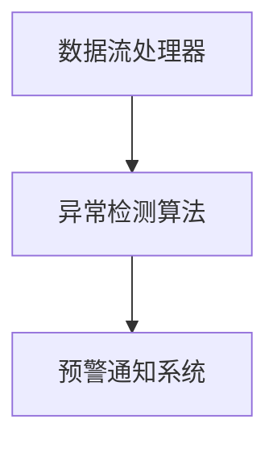
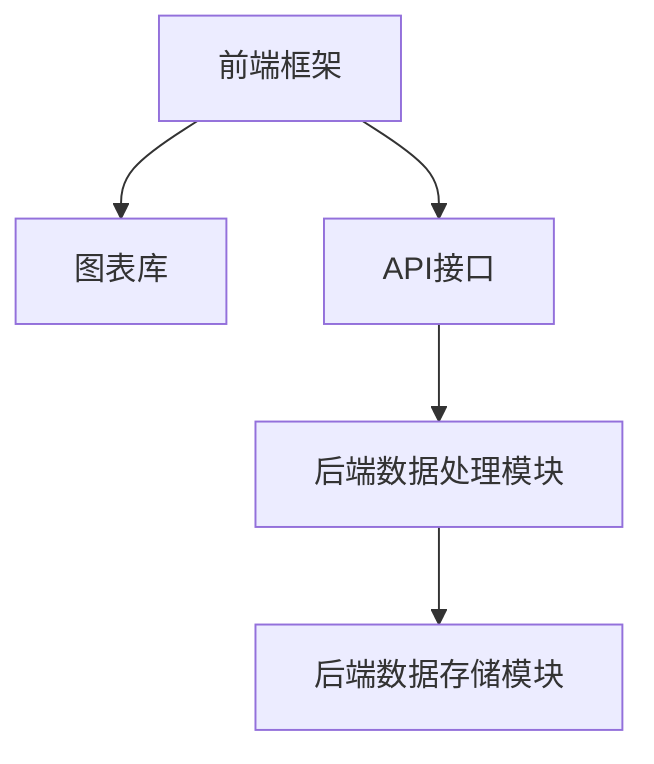
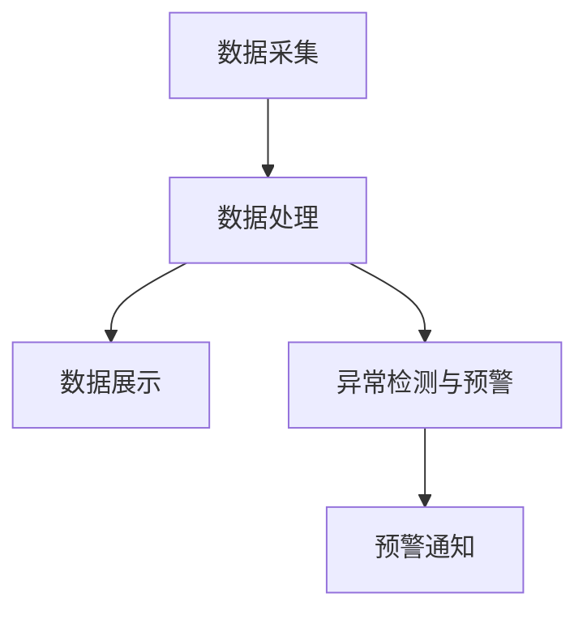

                 

### 标题：AI系统的可观察性设计与实现：典型面试题与算法编程题解析

## 目录

- [1. 可观察性的概念与重要性](#1)
- [2. 常见面试题解析](#2)
  - [2.1. 如何实现系统的日志记录？](#21)
  - [2.2. 监控系统中性能指标的选择有哪些？](#22)
  - [2.3. 如何设计一个实时监控系统？](#23)
  - [2.4. 常见监控工具及其优缺点](#24)
  - [2.5. 如何进行异常检测和预警？](#25)
  - [2.6. 如何确保监控数据的准确性和一致性？](#26)
- [3. 算法编程题解析](#3)
  - [3.1. 如何设计一个日志聚合系统？](#31)
  - [3.2. 如何设计一个分布式监控系统？](#32)
  - [3.3. 如何设计一个实时异常检测系统？](#33)
  - [3.4. 如何实现一个简单的监控仪表盘？](#34)
- [4. 总结](#4)

---

### 1. 可观察性的概念与重要性

可观察性（Observability）是系统设计和运维中非常重要的一环。它与可伸缩性（Scalability）和可用性（Availability）共同构成了系统的三大核心特性。

**概念：** 可观察性指的是系统内部状态的可视化程度。一个具有高可观察性的系统，可以通过各种监控指标、日志、事件等，清晰地了解系统的运行状态、性能和潜在问题。

**重要性：** 可观察性对于系统的运维和故障排查至关重要。它使得运维人员能够快速发现问题、定位问题根源，并采取相应措施。此外，可观察性也有助于优化系统性能、提高系统稳定性。

### 2. 常见面试题解析

#### 2.1. 如何实现系统的日志记录？

**题目：** 如何在一个分布式系统中实现日志记录，确保日志的完整性和一致性？

**答案：** 可以采用以下方法实现日志记录：

1. **集中式日志系统：** 如ELK（Elasticsearch、Logstash、Kibana）等，将日志统一收集、存储、分析。
2. **分布式日志收集框架：** 如Fluentd、Logstash等，支持多源收集、格式转换、负载均衡等功能。
3. **日志存储方案：** 如文件系统、数据库、消息队列等，根据日志量和性能要求选择合适的存储方案。
4. **日志格式规范：** 采用统一的日志格式，如JSON、XML等，方便日志的收集、存储和分析。
5. **日志压缩与加密：** 对日志进行压缩和加密，降低存储和传输成本，提高安全性。

**示例代码：**

```go
package main

import (
    "fmt"
    "log"
    "os"
)

func main() {
    logFile, err := os.OpenFile("example.log", os.O_CREATE|os.O_WRONLY|os.O_APPEND, 0666)
    if err != nil {
        log.Fatal(err)
    }
    log.SetOutput(logFile)

    log.Println("This is a log message.")
}
```

#### 2.2. 监控系统中性能指标的选择有哪些？

**题目：** 监控系统中的性能指标有哪些？如何选择合适的指标？

**答案：** 监控系统中的性能指标包括：

1. **CPU 使用率：** 反映系统计算资源的利用率。
2. **内存使用率：** 反映系统内存的占用情况。
3. **磁盘I/O：** 反映系统磁盘的读写速度。
4. **网络带宽：** 反映系统网络的传输速度。
5. **响应时间：** 反映系统对外部请求的处理速度。
6. **吞吐量：** 反映系统处理请求的数量。
7. **队列长度：** 反映系统处理请求的排队情况。
8. **错误率：** 反映系统出现错误的频率。

选择合适的指标需要根据系统的特点和业务需求。例如，对于电商平台，可以选择CPU使用率、内存使用率、响应时间等指标；对于数据库系统，可以选择磁盘I/O、队列长度等指标。

#### 2.3. 如何设计一个实时监控系统？

**题目：** 如何设计一个实时监控系统，满足以下要求：

1. 数据采集：采集系统性能指标、日志、事件等。
2. 数据处理：实时处理、过滤、聚合、分析等。
3. 数据展示：实时展示系统运行状态、性能指标等。
4. 异常检测与预警：实时检测异常，并发出预警通知。

**答案：** 可以采用以下方法设计实时监控系统：

1. **数据采集：** 使用代理、采集器等组件，实时采集系统性能指标、日志、事件等。
2. **数据处理：** 使用流处理框架，如Apache Kafka、Apache Flink等，对采集到的数据实时处理。
3. **数据存储：** 使用时序数据库，如InfluxDB、Prometheus等，存储处理后的数据。
4. **数据展示：** 使用可视化工具，如Kibana、Grafana等，实时展示系统运行状态、性能指标等。
5. **异常检测与预警：** 使用机器学习、规则引擎等技术，实时检测异常，并发出预警通知。

**示例架构：**



#### 2.4. 常见监控工具及其优缺点

**题目：** 常见监控工具有哪些？它们各自有哪些优缺点？

**答案：** 常见监控工具有：

1. **Zabbix：** 优点：功能强大，支持多种监控指标；缺点：配置复杂，性能较低。
2. **Nagios：** 优点：易于配置，支持插件丰富；缺点：不支持自动化处理，性能较低。
3. **Prometheus：** 优点：基于时间序列数据，高效、灵活；缺点：不支持自动发现、自动监控。
4. **Grafana：** 优点：可视化功能强大，支持多种数据源；缺点：仅支持可视化，不支持监控。
5. **ELK：** 优点：日志处理能力强，可扩展性好；缺点：性能较低，配置复杂。

根据实际需求选择合适的监控工具，以达到最佳效果。

#### 2.5. 如何进行异常检测和预警？

**题目：** 如何进行异常检测和预警？

**答案：** 可以采用以下方法进行异常检测和预警：

1. **阈值报警：** 根据历史数据，设置阈值，当监控指标超出阈值时，触发报警。
2. **机器学习：** 使用机器学习算法，对监控数据进行建模，检测异常行为。
3. **规则引擎：** 根据业务需求，定义一系列规则，当监控指标符合规则时，触发报警。

**示例算法：**

- **基于聚类算法的异常检测：**

```python
from sklearn.cluster import KMeans
from sklearn.metrics import silhouette_score

# 加载监控数据
data = ...

# 使用KMeans聚类
kmeans = KMeans(n_clusters=2).fit(data)

# 计算轮廓系数
silhouette = silhouette_score(data, kmeans.labels_)

# 当轮廓系数小于某个阈值时，认为存在异常
if silhouette < threshold:
    trigger_alarm()
```

#### 2.6. 如何确保监控数据的准确性和一致性？

**题目：** 如何确保监控数据的准确性和一致性？

**答案：** 可以采取以下措施确保监控数据的准确性和一致性：

1. **数据清洗：** 对采集到的监控数据进行清洗，去除重复、错误、缺失的数据。
2. **数据校验：** 对监控数据进行校验，确保数据的格式、范围、精度等符合要求。
3. **数据同步：** 使用分布式同步机制，确保数据在各节点之间的一致性。
4. **数据备份：** 定期对监控数据进行备份，防止数据丢失。

**示例代码：**

```python
import pandas as pd

# 读取监控数据
data = pd.read_csv("monitor_data.csv")

# 数据清洗
data.drop_duplicates(inplace=True)
data.dropna(inplace=True)

# 数据校验
data = data[data["cpu_usage"] >= 0]
data = data[data["memory_usage"] <= 100]

# 数据同步
remote_data = pd.read_csv("remote_monitor_data.csv")
data = data.append(remote_data)

# 数据备份
data.to_csv("backup_monitor_data.csv", index=False)
```

### 3. 算法编程题解析

#### 3.1. 如何设计一个日志聚合系统？

**题目：** 设计一个日志聚合系统，支持以下功能：

1. 多源日志收集：支持从不同来源（如文件、网络流、API接口等）收集日志。
2. 日志格式转换：将不同格式的日志转换为统一的JSON格式。
3. 日志存储：将转换后的日志存储到时序数据库或文件系统中。

**答案：** 可以采用以下方法设计日志聚合系统：

1. **日志收集器：** 使用多线程或协程，同时从多个来源收集日志。
2. **日志转换器：** 根据日志格式，解析和转换日志内容，生成统一的JSON格式。
3. **日志存储器：** 使用时序数据库或文件系统，存储转换后的日志。

**示例架构：**



#### 3.2. 如何设计一个分布式监控系统？

**题目：** 设计一个分布式监控系统，支持以下功能：

1. 多节点监控：支持监控多个节点的系统性能、资源使用情况等。
2. 数据聚合与汇总：将多个节点的监控数据汇总到中心节点。
3. 异常检测与预警：对汇总后的数据进行异常检测，并发出预警通知。

**答案：** 可以采用以下方法设计分布式监控系统：

1. **数据采集器：** 在每个节点上部署数据采集器，收集系统性能、资源使用情况等数据。
2. **数据传输：** 使用消息队列或分布式存储，将采集到的数据传输到中心节点。
3. **数据汇总与处理：** 在中心节点上，对采集到的数据进行汇总和处理，进行异常检测和预警。

**示例架构：**



#### 3.3. 如何设计一个实时异常检测系统？

**题目：** 设计一个实时异常检测系统，支持以下功能：

1. 数据流处理：实时处理和分析流式数据。
2. 异常检测：对数据流进行异常检测，识别异常行为。
3. 预警通知：当检测到异常时，发出预警通知。

**答案：** 可以采用以下方法设计实时异常检测系统：

1. **数据流处理器：** 使用流处理框架，如Apache Kafka、Apache Flink等，实时处理流式数据。
2. **异常检测算法：** 采用机器学习算法、统计方法等，对数据流进行异常检测。
3. **预警通知系统：** 使用邮件、短信、微信等通知方式，当检测到异常时发出预警通知。

**示例架构：**



#### 3.4. 如何实现一个简单的监控仪表盘？

**题目：** 实现一个简单的监控仪表盘，支持以下功能：

1. 数据展示：展示系统性能指标、资源使用情况等数据。
2. 数据筛选：支持按时间、指标、节点等条件筛选数据。
3. 数据交互：支持与后端数据存储和数据处理模块进行数据交互。

**答案：** 可以采用以下方法实现监控仪表盘：

1. **前端框架：** 使用前端框架，如React、Vue等，搭建仪表盘界面。
2. **图表库：** 使用图表库，如ECharts、Chart.js等，展示数据图表。
3. **API接口：** 设计API接口，与后端数据存储和数据处理模块进行数据交互。

**示例架构：**



### 4. 总结

本文介绍了AI系统的可观察性设计与实现的相关面试题和算法编程题，包括日志记录、监控系统设计、异常检测和仪表盘实现等方面。通过深入分析和实例解析，帮助读者更好地理解和掌握可观察性设计与实现的核心技术和方法。在实际工作中，根据业务需求和系统特点，灵活运用这些技术和方法，可以提高系统的可观察性，提升运维效率和系统稳定性。


---

**注意：** 以上内容为Markdown格式，根据用户需求提供了一份关于AI系统可观察性设计与实现的博客大纲，以及相关面试题和算法编程题的解析示例。实际博客撰写时，请根据需求补充完整每个部分的详细内容。


### 题目解析：如何实现系统的日志记录？

**题目：** 如何在一个分布式系统中实现日志记录，确保日志的完整性和一致性？

**答案解析：**

在分布式系统中，日志记录是确保系统可观察性和可维护性的关键部分。为了确保日志的完整性和一致性，需要从日志的生成、传输、存储和检索等多个环节进行设计。以下是几种常见的方法：

#### 1. 日志生成

每个服务实例都应该负责生成自己的日志。日志通常包括时间戳、日志级别、线程ID、进程ID、调用者信息、操作细节等信息。可以使用标准库（如Java的`java.util.logging`，Python的`logging`模块）或专门的日志框架（如Logback、Log4j）来生成日志。

**示例代码（Python）：**

```python
import logging

# 创建日志对象
logger = logging.getLogger("my_logger")
logger.setLevel(logging.DEBUG)

# 创建日志文件处理器
fh = logging.FileHandler("app.log")
fh.setLevel(logging.DEBUG)

# 添加处理器到日志对象
logger.addHandler(fh)

# 记录日志
logger.debug("This is a debug message.")
```

#### 2. 日志传输

为了确保日志的完整性和一致性，需要将日志从一个服务实例传输到集中式日志存储。这可以通过以下几种方式实现：

- **同步传输：** 服务实例在生成日志后立即将其发送到集中式日志存储。这种方式保证了日志的顺序和完整性，但可能会增加系统的延迟。
- **异步传输：** 服务实例将日志写入本地队列，然后由专门的日志代理定期从队列中取出日志并传输到集中式存储。这种方式降低了服务实例的延迟，但可能无法保证日志的顺序。

**示例代码（Python）：**

```python
import pika

# 创建RabbitMQ连接
connection = pika.BlockingConnection(pika.ConnectionParameters('localhost'))
channel = connection.channel()

# 声明队列
channel.queue_declare(queue='log_queue')

# 发送日志到队列
channel.basic_publish(exchange='',
                      routing_key='log_queue',
                      body='This is a log message.')

# 关闭连接
connection.close()
```

#### 3. 日志存储

日志存储可以选择文件系统、关系型数据库（如MySQL）或时间序列数据库（如Elasticsearch、InfluxDB）。选择存储方式时需要考虑日志的规模、查询性能和恢复能力。

- **文件系统：** 简单且易于部署，但难以进行高效查询和复用。
- **关系型数据库：** 查询性能较高，但日志条目通常较大，可能导致数据库压力增大。
- **时间序列数据库：** 专为存储和查询大量时序数据设计，性能优异，适合大规模日志存储。

**示例代码（Elasticsearch）：**

```python
from elasticsearch import Elasticsearch

# 创建Elasticsearch客户端
es = Elasticsearch("localhost:9200")

# 添加日志到Elasticsearch
doc = {
    "timestamp": "2023-10-01T12:00:00",
    "level": "INFO",
    "message": "This is an Elasticsearch log message."
}
es.index(index="log_index", id=1, document=doc)
```

#### 4. 日志检索

日志检索可以通过集中式日志存储系统（如ELK堆栈）或自定义日志查询工具实现。检索工具需要支持基本的日志查询操作，如过滤、排序、聚合等。

**示例代码（Elasticsearch）：**

```python
from elasticsearch import Elasticsearch

# 创建Elasticsearch客户端
es = Elasticsearch("localhost:9200")

# 检索日志
response = es.search(index="log_index", body={
    "query": {
        "match": {
            "message": "log message"
        }
    }
})

# 打印检索结果
print(response['hits']['hits'])
```

#### 确保完整性和一致性

- **冗余存储：** 将日志同时存储在多个地方，以防止数据丢失。
- **分布式一致性算法：** 如Paxos、Raft等，确保分布式系统中的日志一致。
- **校验和：** 在日志传输过程中添加校验和，并在接收端进行校验，以确保日志的完整性。

通过上述方法，可以在分布式系统中实现日志记录，并确保日志的完整性和一致性。


### 题目解析：监控系统中的性能指标的选择有哪些？

**题目：** 监控系统中的性能指标有哪些？如何选择合适的指标？

**答案解析：**

监控系统中的性能指标是评估系统运行状态和性能的关键数据点。选择合适的性能指标对于及时发现系统问题、优化系统性能至关重要。以下是常见的监控系统性能指标以及如何选择合适的指标：

#### 常见性能指标：

1. **CPU使用率：** 反映系统处理任务的效率，计算方式为CPU空闲时间占总时间的比例。高CPU使用率可能表明系统负载过重，需要增加资源或优化代码。

2. **内存使用率：** 反映系统内存的使用情况，计算方式为已使用内存占总内存的比例。高内存使用率可能导致系统性能下降或出现内存溢出。

3. **磁盘I/O：** 反映系统磁盘的读写速度，包括读写速率和读写延迟。高磁盘I/O可能影响系统的响应速度。

4. **网络带宽：** 反映系统网络的传输速度，包括上传和下载速率。高网络带宽消耗可能表明网络资源紧张或存在网络瓶颈。

5. **响应时间：** 反映系统对外部请求的处理速度，包括从接收请求到返回响应所需的时间。长响应时间可能表明系统性能不佳。

6. **吞吐量：** 反映系统处理请求的总量，单位为每秒请求数（RPS）或每秒事务数（TPS）。低吞吐量可能表明系统资源不足或存在瓶颈。

7. **队列长度：** 反映系统处理请求的排队情况，包括待处理的请求数量。高队列长度可能表明系统处理能力不足。

8. **错误率：** 反映系统发生错误的频率，包括异常、超时、拒绝服务等。高错误率可能表明系统存在稳定性问题。

#### 如何选择合适的指标：

1. **业务场景：** 根据业务场景选择相应的性能指标。例如，电商系统可能需要关注响应时间和吞吐量，而金融系统可能需要关注CPU使用率和错误率。

2. **系统特点：** 考虑系统架构和特点，选择对系统运行状态有代表性的指标。例如，分布式系统可能需要关注网络带宽和队列长度，而单机系统可能更关注CPU和内存使用率。

3. **性能瓶颈：** 针对系统的性能瓶颈选择相关指标。例如，如果系统出现CPU过高，应重点关注CPU使用率；如果系统响应时间过长，应重点关注响应时间和网络带宽。

4. **数据可用性：** 选择数据容易获取和处理的指标。确保监控系统能够准确、及时地收集和展示指标数据。

5. **告警阈值：** 根据历史数据和业务需求设置告警阈值，以便及时发现系统异常。

#### 示例：

对于一个电商网站，可以关注以下性能指标：

- CPU使用率：确保不超过90%。
- 内存使用率：确保不超过80%。
- 响应时间：确保不超过500ms。
- 吞吐量：确保达到预期的RPS或TPS。
- 网络带宽：确保上传和下载速率不低于预期。
- 队列长度：确保不超过1000个请求。

通过合理选择和监控性能指标，可以全面了解系统运行状态，及时发现和解决问题，提高系统稳定性和性能。

### 题目解析：如何设计一个实时监控系统？

**题目：** 如何设计一个实时监控系统，满足以下要求：

1. 数据采集：采集系统性能指标、日志、事件等。
2. 数据处理：实时处理、过滤、聚合、分析等。
3. 数据展示：实时展示系统运行状态、性能指标等。
4. 异常检测与预警：实时检测异常，并发出预警通知。

**答案解析：**

设计一个实时监控系统需要考虑数据采集、数据处理、数据展示和异常检测等多个方面。以下是一个典型的实时监控系统设计：

#### 1. 数据采集

数据采集是实时监控系统的第一步，需要确保数据完整性和及时性。可以采用以下方法进行数据采集：

- **Agent部署：** 在每个服务器节点上部署采集代理（Agent），定期采集系统性能指标（如CPU使用率、内存使用率、磁盘I/O等）、日志和事件。
- **SNMP（简单网络管理协议）：** 通过SNMP协议获取网络设备的性能指标。
- **WMI（Windows管理规范）：** 在Windows系统上使用WMI获取系统性能和配置信息。
- **自定义采集器：** 对于特定应用或业务场景，可以开发自定义的采集器。

#### 2. 数据处理

实时处理是数据采集后的关键步骤，需要对数据进行实时处理、过滤、聚合和分析。可以采用以下方法进行数据处理：

- **流处理框架：** 使用流处理框架（如Apache Kafka、Apache Flink、Apache Storm等）处理实时数据流，进行数据清洗、转换、聚合等操作。
- **批量处理：** 对于不适合实时处理的数据，可以采用批量处理方式，如定期执行作业，对历史数据进行处理和汇总。
- **实时分析：** 利用机器学习、统计分析等方法对数据进行实时分析，提取有用的信息。

#### 3. 数据展示

数据展示是将监控数据以可视化方式呈现给用户的重要环节。可以采用以下方法进行数据展示：

- **可视化工具：** 使用可视化工具（如Grafana、Kibana、Prometheus等）创建实时监控仪表板，展示系统运行状态、性能指标等。
- **Web前端：** 开发Web前端应用程序，通过HTTP接口获取监控数据，并展示在网页上。
- **移动应用：** 开发移动应用程序，方便用户在手机或平板电脑上查看监控数据。

#### 4. 异常检测与预警

异常检测与预警是实时监控系统的核心功能之一，可以采用以下方法进行异常检测与预警：

- **阈值检测：** 根据历史数据和业务需求设置阈值，当监控指标超出阈值时，触发预警。
- **统计方法：** 使用统计方法（如移动平均、标准差等）检测数据异常。
- **机器学习：** 使用机器学习算法（如聚类、回归等）对监控数据进行建模，检测异常行为。
- **规则引擎：** 定义一系列规则，当监控指标符合规则时，触发预警。

#### 5. 预警通知

预警通知是将异常情况及时通知相关人员的重要手段。可以采用以下方法进行预警通知：

- **邮件通知：** 通过电子邮件发送预警通知。
- **短信通知：** 通过短信平台发送预警通知。
- **即时通讯：** 通过企业即时通讯工具（如钉钉、企业微信等）发送预警通知。
- **语音通知：** 通过电话或语音机器人发送预警通知。

#### 实例架构：



通过上述设计，可以实现一个功能完善的实时监控系统，帮助运维人员实时监控系统的运行状态，及时发现和处理问题，保障系统的稳定性和可靠性。


### 题目解析：常见监控工具及其优缺点

**题目：** 常见监控工具有哪些？它们各自有哪些优缺点？

**答案解析：**

在系统监控领域，有许多流行的监控工具可供选择。以下是几种常见监控工具及其优缺点：

#### 1. Zabbix

**优点：**
- **功能强大：** 支持多种监控项，如CPU、内存、磁盘、网络、应用等。
- **易于扩展：** 支持自定义监控项和触发器。
- **大规模监控：** 可以监控大量服务器和设备。

**缺点：**
- **配置复杂：** 对于新手来说，配置可能相对复杂。
- **性能问题：** 对于大规模监控场景，性能可能受到影响。

#### 2. Nagios

**优点：**
- **易于配置：** 界面友好，配置相对简单。
- **插件丰富：** 支持广泛的插件，可以监控各种系统和应用。

**缺点：**
- **不支持自动化处理：** 无法自动执行操作，如重启服务。
- **性能问题：** 在大规模监控场景中，性能可能不足。

#### 3. Prometheus

**优点：**
- **时间序列数据库：** 专为监控设计，高效处理时序数据。
- **PromQL：** 强大的查询语言，支持复杂的数据处理和聚合。

**缺点：**
- **不支持自动发现：** 需要手动配置监控目标。
- **数据可视化：** 虽然强大，但数据可视化功能相对有限。

#### 4. Grafana

**优点：**
- **强大可视化：** 支持多种数据源，可视化功能强大。
- **插件支持：** 可以通过插件扩展功能。

**缺点：**
- **仅支持可视化：** 本身不支持监控和数据采集。
- **依赖其他工具：** 需要与其他工具（如Prometheus）配合使用。

#### 5. ELK（Elasticsearch、Logstash、Kibana）

**优点：**
- **日志处理强：** 可以高效处理和存储大规模日志数据。
- **可扩展性高：** 可以轻松扩展集群规模。

**缺点：**
- **性能问题：** 在大规模日志场景中，性能可能受到影响。
- **配置复杂：** 需要熟悉Elasticsearch和Logstash的配置。

#### 6. New Relic

**优点：**
- **全栈监控：** 可以监控前端、后端和数据库。
- **自动发现：** 可以自动发现和配置监控项。

**缺点：**
- **成本较高：** 需要订阅服务，成本较高。

#### 选择建议：

选择监控工具时，应考虑以下因素：

- **监控需求：** 根据监控需求选择合适的工具，如Zabbix适合大规模监控，Prometheus适合时间序列数据。
- **性能要求：** 对于高性能要求的场景，选择如Prometheus或ELK等性能优异的工具。
- **成本预算：** 考虑工具的成本，选择符合预算的工具。

通过综合考虑以上因素，可以选出最适合自己业务的监控工具。


### 题目解析：如何进行异常检测和预警？

**题目：** 如何进行异常检测和预警？

**答案解析：**

异常检测和预警是确保系统稳定性和可靠性的关键环节。以下是一些常见的方法和策略来实现异常检测和预警：

#### 1. 基于阈值的异常检测

**方法：** 设置一定的阈值，当监控指标超过阈值时，触发预警。

**优点：** 简单易懂，易于实现。

**缺点：** 需要事先定义阈值，可能无法捕捉到突发的异常。

**示例：**
- CPU使用率超过90%时触发预警。
- 网络带宽使用率超过80%时触发预警。

#### 2. 基于统计学的异常检测

**方法：** 使用统计学方法，如移动平均、标准差等，检测数据的异常变化。

**优点：** 可以捕捉到数据的长尾异常。

**缺点：** 需要计算历史数据，可能延迟较大。

**示例：**
- 使用3σ原则，当数据点距离平均值超过3倍标准差时触发预警。

#### 3. 基于机器学习的异常检测

**方法：** 使用机器学习算法，如聚类、回归等，对数据建模，检测异常行为。

**优点：** 可以自动学习数据模式，捕捉到更复杂的异常。

**缺点：** 需要大量的历史数据和计算资源。

**示例：**
- 使用K-means聚类算法，将数据划分为不同的簇，检测簇内的异常点。

#### 4. 基于规则引擎的异常检测

**方法：** 定义一系列规则，当监控指标满足规则时，触发预警。

**优点：** 灵活性高，可以应对各种复杂的业务场景。

**缺点：** 需要不断更新和调整规则。

**示例：**
- 如果CPU使用率超过90%且内存使用率超过80%，则触发预警。

#### 5. 异常检测和预警的整合

**方法：** 将多种异常检测方法整合，提高预警的准确性和全面性。

**优点：** 可以利用多种方法的优点，提高异常检测效果。

**缺点：** 需要更多的计算资源和维护成本。

**示例：**
- 使用阈值检测和机器学习算法同时进行异常检测，当两者都触发预警时，才发送通知。

#### 预警通知

**方法：** 当检测到异常时，通过以下方式通知相关人员：

- **邮件通知：** 通过电子邮件发送预警信息。
- **短信通知：** 通过短信平台发送预警信息。
- **即时通讯：** 通过企业即时通讯工具（如钉钉、企业微信等）发送预警信息。
- **语音通知：** 通过电话或语音机器人发送预警信息。

**示例：**
- 当监控系统检测到服务器宕机时，通过短信和钉钉发送预警信息。

通过以上方法和策略，可以有效地进行异常检测和预警，确保系统的稳定性和可靠性。


### 题目解析：如何确保监控数据的准确性和一致性？

**题目：** 如何确保监控数据的准确性和一致性？

**答案解析：**

确保监控数据的准确性和一致性对于构建可靠且高效的监控系统至关重要。以下是一些关键策略和最佳实践：

#### 1. 数据校验

在数据采集和传输过程中，进行数据校验是确保数据准确性的第一步。可以采用以下方法进行数据校验：

- **格式校验：** 确保数据遵循预定义的格式（如JSON、XML等）。
- **范围校验：** 确保数据值在合理的范围内（如CPU使用率应在0%到100%之间）。
- **完整性校验：** 使用哈希算法（如MD5、SHA-256）计算数据摘要，并在接收端进行校验，以确保数据未被篡改。

**示例代码（Python）：**

```python
import hashlib

def check_data_integrity(data, expected_hash):
    actual_hash = hashlib.sha256(data.encode()).hexdigest()
    return actual_hash == expected_hash

# 假设已知预期哈希值
expected_hash = 'abcdef1234567890'
# 传输的数据
data = 'Some data to check'

# 校验数据完整性
is_valid = check_data_integrity(data, expected_hash)
print("Data is valid:", is_valid)
```

#### 2. 数据清洗

数据清洗是处理不一致性和缺失数据的关键步骤。可以采用以下方法进行数据清洗：

- **去除重复数据：** 避免重复记录导致的数据不一致。
- **填充缺失数据：** 使用平均值、中位数或前一个值填充缺失数据。
- **纠正错误数据：** 根据业务逻辑纠正错误的数据值。

**示例代码（Python）：**

```python
import pandas as pd

# 加载数据
df = pd.read_csv('data.csv')

# 去除重复记录
df.drop_duplicates(inplace=True)

# 填充缺失值
df['cpu_usage'].fillna(df['cpu_usage'].mean(), inplace=True)

# 更新数据
df.to_csv('cleaned_data.csv', index=False)
```

#### 3. 数据同步

在分布式系统中，数据同步是确保数据一致性的关键。可以采用以下方法进行数据同步：

- **分布式一致性算法：** 使用如Paxos、Raft等分布式一致性算法，确保多节点数据一致性。
- **两阶段提交（2PC）：** 在分布式数据库中使用两阶段提交协议，确保事务的一致性。
- **事件溯源：** 使用事件溯源模式，确保数据在分布式系统中的有序处理。

**示例代码（Python）：**

```python
from kazoo.client import ZooKeeperClient

# 创建ZooKeeper客户端
zk = ZooKeeperClient(hosts='localhost:2181', timeout=30)

# 设置数据一致性
zk.set('/path/to/data', 'data'.encode())

# 获取数据
data, stat = zk.get('/path/to/data')
print("Data:", data.decode())
```

#### 4. 数据备份

定期备份数据是防止数据丢失的关键措施。可以采用以下方法进行数据备份：

- **增量备份：** 只备份更改的数据，减少备份时间和存储空间。
- **全量备份：** 定期进行全量备份，确保数据完整性。
- **多地点备份：** 将备份数据存储在不同的地理位置，防止本地灾难导致数据丢失。

**示例代码（Python）：**

```python
import tarfile
import os

def backup_data(data_path, backup_path):
    with tarfile.open(backup_path, "w:gz") as tar:
        tar.add(data_path, arcname=os.path.basename(data_path))

# 设置备份路径
data_path = 'data.csv'
backup_path = 'backup_data_20231001.tar.gz'

# 执行备份
backup_data(data_path, backup_path)
```

通过上述方法，可以确保监控数据的准确性和一致性，从而构建一个可靠且高效的监控系统。


### 题目解析：如何设计一个日志聚合系统？

**题目：** 设计一个日志聚合系统，支持以下功能：

1. 多源日志收集：支持从不同来源（如文件、网络流、API接口等）收集日志。
2. 日志格式转换：将不同格式的日志转换为统一的JSON格式。
3. 日志存储：将转换后的日志存储到时序数据库或文件系统中。

**答案解析：**

设计一个日志聚合系统需要考虑日志的收集、格式转换和存储等多个环节。以下是一个典型的日志聚合系统设计：

#### 1. 多源日志收集

为了支持多源日志收集，可以使用以下方法：

- **文件监控：** 使用文件系统监控工具（如Linux的inotify）监听日志文件的更改，实时收集日志。
- **网络流：** 使用网络代理或数据采集工具（如Fluentd、Logstash）从网络流中收集日志。
- **API接口：** 通过API接口从其他系统或服务中收集日志数据。

**示例代码（Python）：**

```python
import os
import requests

def collect_logs_from_file(log_path):
    with open(log_path, 'r') as f:
        logs = f.readlines()
    return logs

def collect_logs_from_api(api_url):
    response = requests.get(api_url)
    logs = response.text.split('\n')
    return logs

# 从文件收集日志
logs = collect_logs_from_file('file.log')
# 从API接口收集日志
logs = collect_logs_from_api('http://api.example.com/logs')
```

#### 2. 日志格式转换

日志格式转换是将不同格式的日志转换为统一的JSON格式，以便于后续处理和存储。可以采用以下方法进行日志格式转换：

- **正则表达式：** 使用正则表达式解析日志，提取关键信息，构建JSON对象。
- **JSON库：** 使用Python的`json`库将文本日志转换为JSON格式。
- **自定义解析器：** 对于特定格式的日志，可以编写自定义的解析器进行格式转换。

**示例代码（Python）：**

```python
import re
import json

def convert_log_to_json(log):
    pattern = r'(\[(.*?)\]) (\[(.*?)\]) (.*)'
    match = re.match(pattern, log)
    if match:
        timestamp, source, level, message = match.groups()
        log_data = {
            'timestamp': timestamp,
            'source': source,
            'level': level,
            'message': message
        }
        return json.dumps(log_data)
    return None

# 转换日志到JSON格式
log_json = convert_log_to_json('2023-10-01 12:00:00 [INFO] [myapp] This is a log message.')
print(log_json)
```

#### 3. 日志存储

日志存储是将转换后的日志数据存储到时序数据库或文件系统中。可以选择以下存储方案：

- **时序数据库：** 如InfluxDB、Prometheus等，适用于大规模时序数据的存储和分析。
- **文件系统：** 如HDFS、EFS等，适用于大规模非结构化数据的存储。
- **关系数据库：** 如MySQL、PostgreSQL等，适用于结构化数据的存储。

**示例代码（Python）：**

```python
import datetime
import json
import pymongo

# 连接MongoDB
client = pymongo.MongoClient('mongodb://localhost:27017/')
db = client['log_database']
collection = db['log_collection']

def store_log_in_mongo(log_json):
    log_data = json.loads(log_json)
    log_data['timestamp'] = datetime.datetime.utcnow()
    collection.insert_one(log_data)

# 存储日志到MongoDB
store_log_in_mongo(log_json)
```

通过以上步骤，可以设计一个功能完善的日志聚合系统，支持多源日志收集、格式转换和存储。这样的系统可以帮助企业高效地管理和分析日志数据，提高系统的可观察性和可维护性。


### 题目解析：如何设计一个分布式监控系统？

**题目：** 设计一个分布式监控系统，支持以下功能：

1. 多节点监控：支持监控多个节点的系统性能、资源使用情况等。
2. 数据聚合与汇总：将多个节点的监控数据汇总到中心节点。
3. 异常检测与预警：对汇总后的数据进行异常检测，并发出预警通知。

**答案解析：**

设计一个分布式监控系统需要考虑多节点监控、数据聚合、异常检测和预警通知等多个方面。以下是一个典型的分布式监控系统设计：

#### 1. 多节点监控

为了实现对多个节点的监控，可以采用以下方法：

- **Agent部署：** 在每个节点上部署监控Agent，定期采集节点性能数据（如CPU、内存、磁盘I/O等）。
- **Agent通信：** Agent与中心节点通过安全的网络协议（如HTTPS）进行通信，上传监控数据。
- **监控插件：** 开发自定义监控插件，针对特定应用或服务进行监控。

**示例架构：**

```
节点1  节点2  节点3
  |      |      |
  +----->+------->+
         中心节点
```

#### 2. 数据聚合与汇总

数据聚合与汇总是将来自多个节点的监控数据汇总到中心节点，以便进行进一步处理和分析。可以采用以下方法：

- **消息队列：** 使用消息队列（如Kafka、RabbitMQ）作为中间件，将监控数据从Agent传输到中心节点。
- **分布式处理：** 使用分布式处理框架（如Apache Flink、Apache Storm）对传输过来的监控数据进行处理和汇总。
- **数据存储：** 使用分布式存储系统（如HDFS、Elasticsearch）存储汇总后的监控数据。

**示例架构：**

```
节点1  节点2  节点3
  |      |      |
  +----->+------->+----+
         |         |
         +----->+---+
         消息队列
         |
        中心节点
```

#### 3. 异常检测与预警

异常检测与预警是对汇总后的监控数据进行实时分析，检测异常行为，并发出预警通知。可以采用以下方法：

- **阈值检测：** 根据历史数据和业务需求设置阈值，当监控指标超出阈值时，触发预警。
- **机器学习：** 使用机器学习算法（如聚类、回归等）对监控数据进行建模，检测异常行为。
- **规则引擎：** 定义一系列规则，当监控指标满足规则时，触发预警。
- **预警通知：** 通过邮件、短信、即时通讯（如钉钉、企业微信）等方式通知相关人员。

**示例架构：**

```
节点1  节点2  节点3
  |      |      |
  +----->+------->+----+
         |         |
         +----->+---+
         消息队列
         |
        中心节点
               |
              分析引擎
               |
            预警通知
```

#### 详细设计

1. **Agent设计：** 开发跨平台的Agent，支持Linux、Windows等操作系统，定期采集系统性能数据，并上传到消息队列。
2. **消息队列设计：** 设计高可用、高并发的消息队列系统，确保监控数据不会丢失，支持大规模数据传输。
3. **分布式处理设计：** 设计分布式处理框架，对监控数据进行实时处理、过滤、聚合和分析。
4. **数据存储设计：** 设计分布式存储系统，确保监控数据的安全、可靠存储，支持高效查询。
5. **异常检测设计：** 设计异常检测算法和规则引擎，实现对监控数据的实时分析和预警。
6. **预警通知设计：** 设计预警通知系统，支持多种通知渠道，确保预警信息能够及时传达。

通过上述设计，可以构建一个功能完善的分布式监控系统，实现对多个节点的实时监控、数据聚合、异常检测和预警通知。这样的系统可以帮助企业高效地管理大规模分布式系统，确保系统的稳定性和可靠性。


### 题目解析：如何设计一个实时异常检测系统？

**题目：** 如何设计一个实时异常检测系统，支持以下功能：

1. 数据流处理：实时处理和分析流式数据。
2. 异常检测：对数据流进行异常检测，识别异常行为。
3. 预警通知：当检测到异常时，发出预警通知。

**答案解析：**

设计一个实时异常检测系统需要考虑数据流处理、异常检测和预警通知等多个方面。以下是一个典型的实时异常检测系统设计：

#### 1. 数据流处理

实时处理流式数据是异常检测系统的第一步。可以采用以下方法：

- **流处理框架：** 使用流处理框架（如Apache Kafka、Apache Flink、Apache Storm等）来实时处理和分析数据流。
- **数据采集：** 从数据源（如日志文件、网络流、API接口等）中采集数据，并将其发送到流处理框架中。
- **数据清洗：** 在流处理框架中对数据进行清洗、过滤和转换，确保数据质量。

**示例架构：**

```
数据源 --> 数据采集器 --> 流处理框架 --> 数据存储/缓存
```

#### 2. 异常检测

对数据流进行异常检测是实时异常检测系统的核心。可以采用以下方法：

- **统计方法：** 使用统计学方法（如移动平均、标准差、分位数等）来检测数据的异常行为。
- **机器学习：** 使用机器学习算法（如K均值聚类、孤立森林、异常检测模型等）来识别数据流中的异常模式。
- **规则引擎：** 定义一系列规则，当数据流中的数据满足特定规则时，触发异常。

**示例架构：**

```
流处理框架 --> 数据预处理 --> 异常检测模型 --> 预警系统
```

#### 3. 预警通知

当检测到异常时，需要及时通知相关人员。可以采用以下方法：

- **即时通讯：** 通过企业即时通讯工具（如钉钉、企业微信）发送预警消息。
- **邮件通知：** 通过电子邮件发送预警通知。
- **短信通知：** 通过短信平台发送预警通知。
- **API接口：** 提供API接口，允许外部系统接收预警通知。

**示例架构：**

```
异常检测模型 --> 预警通知系统 --> 短信平台/邮件服务/即时通讯
```

#### 详细设计

1. **数据流处理：** 使用Apache Kafka作为消息队列，实现数据流的实时处理。使用Apache Flink作为流处理框架，对数据进行实时分析。
2. **异常检测：** 使用统计方法和机器学习算法，构建实时异常检测模型。根据业务需求和数据特征，选择合适的算法和模型。
3. **预警通知：** 设计预警通知系统，支持多种通知方式。使用消息队列或直接调用API接口，确保预警通知的及时性和可靠性。

通过以上设计，可以构建一个功能完善的实时异常检测系统，实现对流式数据的实时处理、异常检测和预警通知。这样的系统可以帮助企业及时发现和应对异常情况，确保系统的稳定性和可靠性。


### 题目解析：如何实现一个简单的监控仪表盘？

**题目：** 实现一个简单的监控仪表盘，支持以下功能：

1. 数据展示：展示系统性能指标、资源使用情况等数据。
2. 数据筛选：支持按时间、指标、节点等条件筛选数据。
3. 数据交互：支持与后端数据存储和数据处理模块进行数据交互。

**答案解析：**

实现一个简单的监控仪表盘通常需要前端展示、数据交互和后端数据支持。以下是一个基于Web的监控仪表盘实现的步骤：

#### 1. 前端展示

前端展示可以使用HTML、CSS和JavaScript，以及一些前端框架（如React、Vue）来构建。以下是一个基本的前端架构：

- **仪表盘布局：** 使用Div元素构建仪表盘的布局，可以采用Flexbox或Grid布局方式。
- **图表组件：** 使用图表库（如ECharts、Chart.js）展示系统性能指标和资源使用情况。
- **数据筛选：** 提供输入框、下拉菜单等组件，用户可以选择时间范围、指标和节点。
- **交互功能：** 添加交互功能，如点击按钮刷新数据、筛选数据等。

**示例代码（HTML + JavaScript）：**

```html
<!DOCTYPE html>
<html lang="en">
<head>
    <meta charset="UTF-8">
    <meta name="viewport" content="width=device-width, initial-scale=1.0">
    <title>监控仪表盘</title>
    <!-- 引入ECharts库 -->
    <script src="https://cdn.bootcss.com/echarts/5.3.2/echarts.min.js"></script>
</head>
<body>
    <div id="dashboard">
        <!-- 仪表盘布局 -->
        <div id="cpuUsageChart" style="width: 600px; height: 400px;"></div>
        <div id="memoryUsageChart" style="width: 600px; height: 400px;"></div>
        <!-- 筛选条件 -->
        <div>
            <label for="timeRange">时间范围：</label>
            <select id="timeRange">
                <option value="1h">过去1小时</option>
                <option value="24h">过去24小时</option>
                <option value="7d">过去7天</option>
            </select>
            <button onclick="refreshData()">刷新数据</button>
        </div>
    </div>

    <script>
        // 初始化图表
        var cpuUsageChart = echarts.init(document.getElementById('cpuUsageChart'));
        var memoryUsageChart = echarts.init(document.getElementById('memoryUsageChart'));

        // 绘制图表
        function drawCharts(data) {
            cpuUsageChart.setOption({
                // CPU使用率图表配置
            });
            memoryUsageChart.setOption({
                // 内存使用率图表配置
            });
        }

        // 刷新数据
        function refreshData() {
            var timeRange = document.getElementById('timeRange').value;
            // 获取数据，并绘制图表
            fetch('/api/data?timeRange=' + timeRange).then(response => response.json()).then(data => drawCharts(data));
        }

        // 页面加载时刷新数据
        window.onload = refreshData;
    </script>
</body>
</html>
```

#### 2. 数据交互

前端与后端的数据交互可以使用RESTful API或GraphQL。以下是一个基本的API设计：

- **API端点：** 提供API端点获取监控数据，如`/api/data`。
- **数据格式：** 使用JSON格式传输数据。
- **查询参数：** 通过URL查询参数传递时间范围、指标和节点等筛选条件。

**示例代码（Node.js + Express）：**

```javascript
const express = require('express');
const app = express();

// 模拟监控数据
const monitorData = {
    'cpuUsage': [85, 90, 88, 92],
    'memoryUsage': [75, 80, 78, 82]
};

app.get('/api/data', (req, res) => {
    const timeRange = req.query.timeRange;
    const data = monitorData; // 根据时间范围筛选数据

    res.json(data);
});

app.listen(3000, () => {
    console.log('监听端口：3000');
});
```

#### 3. 后端数据支持

后端数据支持包括数据采集、处理和存储。以下是一个基本的后端架构：

- **数据采集：** 使用Agent定期采集系统性能指标和资源使用情况。
- **数据处理：** 使用数据处理库（如Prometheus、InfluxDB）处理和存储监控数据。
- **数据存储：** 使用数据库（如MySQL、Elasticsearch）存储监控数据，支持高效的查询和数据分析。

通过上述步骤，可以构建一个简单的监控仪表盘，实现数据展示、数据筛选和与后端数据交互的功能。这样的仪表盘可以帮助用户实时监控系统的运行状态，及时发现潜在问题。


### 总结

本文详细解析了AI系统可观察性设计与实现的几个关键方面，包括日志记录、监控系统设计、异常检测与预警、数据准确性与一致性保障，以及日志聚合和分布式监控系统的设计与实现。通过对常见面试题和算法编程题的深入分析，我们了解了如何在实际项目中应用这些技术，构建一个高效、可靠的监控体系。

**关键知识点回顾：**

1. **日志记录：** 如何在不同的系统环境下生成、传输、存储和检索日志。
2. **监控系统设计：** 如何采集、处理、展示和异常检测系统性能指标。
3. **异常检测与预警：** 如何使用阈值、统计方法和机器学习进行异常检测，以及如何实现预警通知。
4. **数据准确性与一致性：** 如何通过校验、清洗、同步和备份确保监控数据的准确性和一致性。
5. **日志聚合与分布式监控：** 如何设计多源日志收集、格式转换和存储，以及如何实现分布式监控系统的数据汇总和异常检测。

在实际工作中，根据业务需求和系统特点，灵活运用这些技术和方法，可以提高系统的可观察性，提升运维效率和系统稳定性。通过持续优化和迭代监控体系，企业可以更好地应对复杂的业务场景和挑战。

