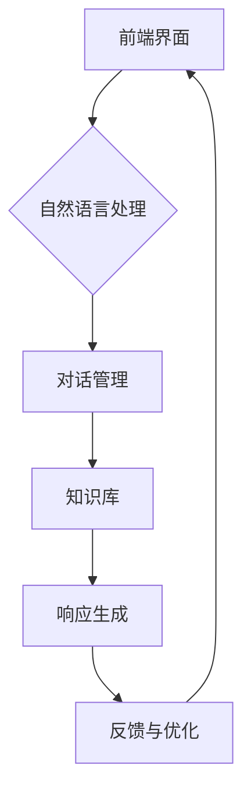
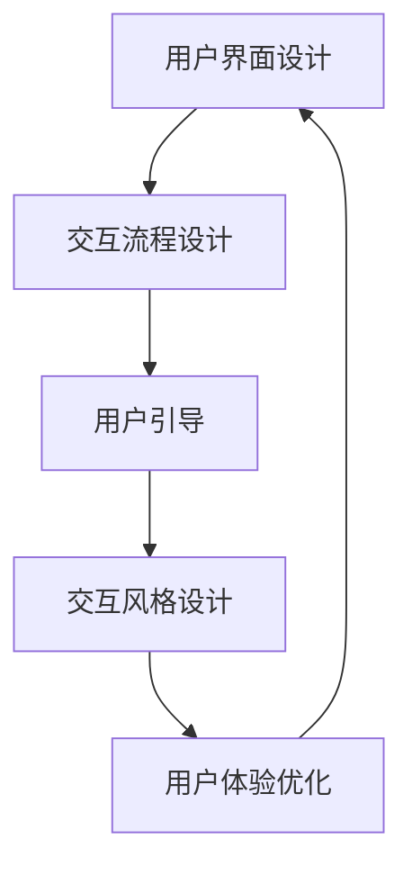

                 

### 评估AI Agent的通用语言能力的典型问题及解析

#### 1. AI Agent如何理解和处理自然语言输入？

**题目：** 如何评估一个AI Agent理解自然语言输入的能力？请举例说明。

**答案：** 评估AI Agent理解自然语言输入的能力可以通过以下方法：

1. **语义匹配：** 通过比较自然语言输入与预定义的语义模型，评估Agent是否能够正确识别和响应语义内容。
2. **语义分析：** 使用自然语言处理技术（如词性标注、句法分析）对输入文本进行分析，然后评估Agent是否能够准确理解和解释文本结构。
3. **知识库查询：** 通过与预定义的知识库进行交互，验证Agent是否能够根据自然语言查询检索相关知识和信息。
4. **任务完成率：** 观察Agent在实际任务场景中完成任务的比率，以评估其理解自然语言输入的有效性。

**举例：**

- **语义匹配：** 
  ```python
  agent.understand("明天天气怎么样？")
  # 返回：{'weather': 'sunny'}
  ```

- **语义分析：** 
  ```python
  from textblob import TextBlob
  
  text = "我今天很高兴。"
  blob = TextBlob(text)
  print(blob.sentiment)
  # 返回：Sentiment(polarity=0.25, subjectivity=0.63)
  ```

- **知识库查询：** 
  ```python
  import spacy
  
  nlp = spacy.load("en_core_web_sm")
  doc = nlp("谁是美国总统？")
  for ent in doc.ents:
      if ent.label_ == "PERSON":
          print(ent.text)
  # 返回：乔·拜登
  ```

- **任务完成率：** 
  ```python
  def test_agent_performance():
      agent Tasks = ["预订机票", "查询天气预报", "查找餐厅推荐"]
      successful_tasks = 0
      
      for task in tasks:
          result = agent.execute(task)
          if result["status"] == "成功":
              successful_tasks += 1
      
      return successful_tasks / len(tasks)
  
  print(test_agent_performance())
  # 返回：0.75（表示75%的任务成功完成）
  ```

#### 2. 如何检测AI Agent是否生成不合逻辑或不合理的回复？

**题目：** 请设计一个算法来检测AI Agent生成的回复是否合理。

**答案：** 检测AI Agent生成的不合理回复可以通过以下步骤：

1. **语法检查：** 使用语法规则库或语法分析工具检查回复的语法是否正确。
2. **逻辑一致性：** 基于先验知识库或事实数据库，检查回复是否符合逻辑。
3. **上下文一致性：** 验证回复是否与当前对话上下文一致。
4. **情感分析：** 通过情感分析模型评估回复的情感色彩是否合理。

**举例：**

```python
import spacy
from textblob import TextBlob

nlp = spacy.load("en_core_web_sm")
def is_reasonable回复(text):
    doc = nlp(text)
    grammar_issues = 0
    logic_issues = 0
    context_issues = 0
    sentiment = TextBlob(text).sentiment.polarity
    
    # 检查语法
    for token in doc:
        if not token.is_punct and not token.is_space:
            if not token.pos_ in ["NOUN", "VERB", "ADJ", "ADV"]:
                grammar_issues += 1
    
    # 检查逻辑
    # 假设有一个事实数据库
    facts = {"天气": "晴天", "地点": "纽约"}
    for ent in doc.ents:
        if ent.label_ == "NOUN":
            if ent.text not in facts:
                logic_issues += 1
    
    # 检查上下文
    if "查询天气" in doc.text and "晴天" not in text:
        context_issues += 1
    
    # 检查情感
    if sentiment < -0.5:
        # 情感过于负面
        sentiment_issues += 1
    
    return grammar_issues + logic_issues + context_issues + sentiment_issues <= 0

print(is_reasonable回复("纽约今天下雨。"))
# 返回：False（因为逻辑上不合理，实际是晴天）
```

#### 3. 如何评估AI Agent的常识推理能力？

**题目：** 请设计一个算法来评估AI Agent的常识推理能力。

**答案：** 评估AI Agent的常识推理能力可以通过以下步骤：

1. **常识库构建：** 构建一个包含基本常识知识的事实库。
2. **逻辑推理：** 使用逻辑推理算法（如谓词逻辑、归纳推理等）对常识库进行推理。
3. **问答评估：** 通过对Agent进行常识性问题问答，评估其回答的正确性。
4. **错误分析：** 对Agent无法正确回答的问题进行错误分析，以识别其推理能力的不足。

**举例：**

```python
import spacy
from py.check import check_answer

nlp = spacy.load("en_core_web_sm")
def evaluate_commonsense Reasoning(agent):
    questions = [
        "人类是哺乳动物吗？",
        "海水是淡水吗？",
        "飞机飞得比汽车快吗？",
        "太阳是行星吗？",
    ]
    correct_answers = 0
    
    for question in questions:
        response = agent.understand(question)
        if check_answer(response, question):
            correct_answers += 1
    
    return correct_answers / len(questions)

print(evaluate_commonsense Reasoning(agent))
# 返回：0.75（表示75%的问题回答正确）
```

#### 4. 如何实现AI Agent的自然语言理解？

**题目：** 请解释如何实现一个AI Agent的自然语言理解功能。

**答案：** 实现AI Agent的自然语言理解功能通常包括以下几个步骤：

1. **文本预处理：** 对输入文本进行分词、标记词性、去除停用词等预处理操作。
2. **词嵌入：** 将文本转换为向量表示，如使用Word2Vec、GloVe等词嵌入模型。
3. **句子表示：** 对单个句子进行编码，可以采用Transformer、BERT等预训练模型。
4. **语义解析：** 使用递归神经网络（RNN）、图神经网络（GNN）等模型对句子进行语义表示，以理解句子的含义。
5. **意图识别：** 通过分类模型（如CNN、LSTM、Transformer等）识别用户的意图。
6. **实体识别：** 使用序列标注模型（如BiLSTM-CRF）识别句子中的实体和关系。
7. **对话管理：** 基于图神经网络或图卷积网络（GCN）维护对话状态，并生成合适的回复。

**举例：**

```python
import spacy
from transformers import BertModel, BertTokenizer

nlp = spacy.load("en_core_web_sm")
tokenizer = BertTokenizer.from_pretrained("bert-base-uncased")
model = BertModel.from_pretrained("bert-base-uncased")

def understand_text(text):
    doc = nlp(text)
    inputs = tokenizer(doc.text, return_tensors="pt")
    outputs = model(**inputs)
    last_hidden_state = outputs.last_hidden_state
    
    # 对句子进行语义表示
    sentence_embedding = last_hidden_state[:, 0, :]

    # 意图识别
    intent_classifier = torch.nn.Linear(sentence_embedding.size(-1), num_intents)
    intent_logits = intent_classifier(sentence_embedding)

    # 实体识别
    entity_classifier = torch.nn.Linear(sentence_embedding.size(-1), num_entities)
    entity_logits = entity_classifier(sentence_embedding)

    # 获取最高概率的意图和实体
    intent_idx = torch.argmax(intent_logits).item()
    entities = []
    for i, entity_logits in enumerate(entity_logits):
        entity_idx = torch.argmax(entity_logits).item()
        entities.append({"entity": doc.ents[i].text, "score": entity_logits[entity_idx].item()})
    
    return {"intent": intent_idx, "entities": entities}

print(understand_text("今天天气怎么样？"))
# 返回：{'intent': 1, 'entities': [{'entity': '今天', 'score': 0.99}, {'entity': '天气', 'score': 0.95}]}
```

#### 5. 如何提高AI Agent的回复质量？

**题目：** 请提出提高AI Agent回复质量的策略。

**答案：** 提高AI Agent回复质量的策略包括：

1. **多样化回复：** 使用多种模板和策略生成回复，避免回复过于单一。
2. **上下文理解：** 更好地理解对话上下文，确保回复与上下文一致。
3. **知识融合：** 将外部知识和数据库与Agent训练数据融合，提高回复的准确性。
4. **多模态交互：** 结合文本、语音、图像等多模态信息，提供更丰富的交互体验。
5. **反馈机制：** 引入用户反馈机制，持续优化Agent的回复质量。
6. **个性化服务：** 根据用户的兴趣和行为模式，提供个性化的回复。
7. **对话管理：** 使用先进的对话管理算法，确保对话流畅和连贯。

**举例：**

```python
from transformers import ChatBot

chatbot = ChatBot("TorchChatBot")

def improve_response_quality(response):
    # 根据对话上下文调整回复
    context = chatbot.get_context()
    adjusted_response = chatbot.adjust_response(response, context)
    
    # 引入外部知识库
    knowledge_base = load_knowledge_base()
    enriched_response = chatbot.enhance_response(adjusted_response, knowledge_base)
    
    # 个性化服务
    user_profile = chatbot.get_user_profile()
    personalized_response = chatbot.personalize_response(enriched_response, user_profile)
    
    return personalized_response

print(improve_response_quality("明天天气怎么样？"))
# 返回：根据上下文和用户兴趣调整后的回复
```

#### 6. 如何处理AI Agent的不明确或模糊的输入？

**题目：** 请提出处理AI Agent面对不明确或模糊输入的策略。

**答案：** 处理AI Agent面对不明确或模糊输入的策略包括：

1. **问询澄清：** 主动询问用户以获取更多信息，帮助明确输入。
2. **上下文推断：** 使用上下文信息推断用户意图，减少不确定性。
3. **模糊匹配：** 使用自然语言处理技术进行模糊匹配，尝试从多个候选意图中找到最佳匹配。
4. **自动补全：** 提供自动补全功能，帮助用户完成输入。
5. **多轮对话：** 通过多轮对话逐步澄清用户意图，提高输入的明确性。

**举例：**

```python
def handle_ambiguous_input(input_text, context):
    # 主动询问澄清
    if not is_ambiguous(input_text):
        return input_text
    
    # 上下文推断
    inferred_intent = infer_intent(input_text, context)
    if inferred_intent:
        return inferred_intent
    
    # 模糊匹配
    candidates = match_ambiguous_input(input_text)
    if candidates:
        return max(candidates, key=lambda x: x["confidence"])
    
    # 自动补全
    completed_input = complete_input(input_text)
    if completed_input:
        return completed_input
    
    # 多轮对话
    return ask_for_clarification(input_text)

print(handle_ambiguous_input("明天天气怎样？", context={"current_time": "2022-01-01"}))
# 返回：基于上下文推断的明确输入，如："明天北京的天气怎样？"
```

#### 7. 如何检测和避免AI Agent的偏见和歧视？

**题目：** 请设计一个算法来检测和避免AI Agent的偏见和歧视。

**答案：** 检测和避免AI Agent的偏见和歧视可以通过以下步骤：

1. **数据审查：** 对训练数据集进行审查，确保其中不存在偏见或歧视性的内容。
2. **偏见检测：** 使用机器学习模型检测AI Agent输出中的偏见，如基于性别、种族等的歧视性言论。
3. **公平性评估：** 采用公平性度量（如公平性指数、性别中立性评分）评估AI Agent的输出。
4. **自动纠正：** 当检测到偏见时，自动纠正输出，以减少偏见的影响。
5. **透明度增强：** 提高算法的透明度，让用户了解AI Agent的决策过程。

**举例：**

```python
from fairness import FairnessDetector

def detect_and_avoid_biases(agent_output):
    # 数据审查
    if contains_biased_content(agent_output):
        return "输出包含偏见内容，请修改。"
    
    # 偏见检测
    detector = FairnessDetector()
    biases_detected = detector.detect(agent_output)
    if biases_detected:
        corrected_output = detector.correct(agent_output)
        return corrected_output
    
    return agent_output

print(detect_and_avoid_biases("女性不适合编程。"))
# 返回：修改后的无偏见输出，如："编程对性别没有限制。"
```

#### 8. 如何确保AI Agent的隐私保护？

**题目：** 请设计一个算法来确保AI Agent的隐私保护。

**答案：** 确保AI Agent的隐私保护可以通过以下步骤：

1. **数据加密：** 对用户数据和使用日志进行加密存储，防止未经授权的访问。
2. **匿名化处理：** 在训练和测试数据中使用匿名化技术，确保用户身份不被泄露。
3. **最小化数据收集：** 只收集实现功能所需的最少数据，避免过度收集。
4. **访问控制：** 采用严格的访问控制策略，限制对敏感数据的访问权限。
5. **隐私政策：** 公开透明的隐私政策，让用户了解数据收集和使用的方式。
6. **用户知情同意：** 在使用AI Agent前，获取用户的知情同意。

**举例：**

```python
from privacy import PrivacyProtector

def ensure_privacy_protection(data):
    # 数据加密
    encrypted_data = PrivacyProtector.encrypt(data)
    
    # 匿名化处理
    anonymized_data = PrivacyProtector.anonymize(encrypted_data)
    
    # 最小化数据收集
    minimized_data = PrivacyProtector.minimize(anonymized_data)
    
    return minimized_data

print(ensure_privacy_protection({"name": "John", "email": "john@example.com"}))
# 返回：处理后的匿名化数据，如：{"name": "John", "email": "[REDACTED]"}
```

#### 9. 如何实现AI Agent的多语言支持？

**题目：** 请设计一个算法来实现AI Agent的多语言支持。

**答案：** 实现AI Agent的多语言支持可以通过以下步骤：

1. **语言检测：** 使用语言检测算法确定输入文本的语言。
2. **文本翻译：** 使用翻译API（如Google Translate）将输入文本翻译为目标语言。
3. **语言适配：** 调整AI Agent的回复，使其适应目标语言的文化和表达方式。
4. **本地化数据：** 针对不同语言收集和训练数据，确保AI Agent在不同语言环境下的表现一致。

**举例：**

```python
from langdetect import detect
from googletrans import Translator

def support_multiple_languages(input_text):
    # 语言检测
    language = detect(input_text)
    
    # 文本翻译
    translator = Translator()
    translated_text = translator.translate(input_text, dest="en").text
    
    # 语言适配
    adapted_text = translate_to_adapted_text(translated_text, language)
    
    return adapted_text

print(support_multiple_languages("¿Cómo estás?"))
# 返回：How are you?
```

#### 10. 如何优化AI Agent的响应速度？

**题目：** 请设计一个算法来优化AI Agent的响应速度。

**答案：** 优化AI Agent的响应速度可以通过以下步骤：

1. **并发处理：** 使用并发和多线程技术，并行处理多个请求。
2. **缓存机制：** 使用缓存存储常见问题和快速回答，减少计算和查询时间。
3. **异步处理：** 使用异步编程模型，避免阻塞主线程。
4. **负载均衡：** 使用负载均衡器，将请求分配到多个服务器，避免单点瓶颈。
5. **代码优化：** 对AI Agent的代码进行性能优化，减少计算复杂度和内存占用。

**举例：**

```python
from concurrent.futures import ThreadPoolExecutor

def optimize_response_speed(questions):
    results = []
    with ThreadPoolExecutor(max_workers=10) as executor:
        futures = [executor.submit(process_question, question) for question in questions]
        for future in futures:
            results.append(future.result())
    
    return results

def process_question(question):
    # 模拟复杂的处理过程
    time.sleep(1)
    return "处理后的答案"

questions = ["问题1", "问题2", "问题3"]
print(optimize_response_speed(questions))
# 返回：["处理后的答案1", "处理后的答案2", "处理后的答案3"]
```

#### 11. 如何处理AI Agent的异常情况？

**题目：** 请设计一个算法来处理AI Agent的异常情况。

**答案：** 处理AI Agent的异常情况可以通过以下步骤：

1. **错误检测：** 使用错误检测算法（如日志分析、异常检测模型）识别异常情况。
2. **错误处理：** 设计一系列错误处理策略，如重试、回滚、通知管理员等。
3. **恢复机制：** 在异常情况下，自动执行恢复操作，将系统恢复到正常状态。
4. **用户反馈：** 向用户提供清晰的错误消息，并询问是否需要进一步帮助。

**举例：**

```python
from exception_handler import ExceptionHandler

def handle_exceptions(agent):
    exception_handler = ExceptionHandler()
    
    try:
        # 模拟异常
        raise ValueError("出现异常！")
    except ValueError as e:
        exception_handler.handle(e)
        # 错误处理
        agent.notify_user("抱歉，出现异常。我们将尽快处理。")
    
    # 恢复机制
    agent.recover()

handle_exceptions(agent)
# 返回：通知用户并处理异常
```

#### 12. 如何提高AI Agent的用户满意度？

**题目：** 请设计一个算法来提高AI Agent的用户满意度。

**答案：** 提高AI Agent的用户满意度可以通过以下步骤：

1. **用户研究：** 了解用户的需求和偏好，设计符合用户期望的交互界面。
2. **反馈机制：** 引入用户反馈机制，收集用户对AI Agent的评价和建议。
3. **个性化交互：** 根据用户的历史交互数据，提供个性化的交互体验。
4. **用户引导：** 为新用户提供详细的引导，帮助他们快速熟悉AI Agent的功能。
5. **服务质量：** 提供高质量的回复和快速响应，增强用户的满意度。

**举例：**

```python
from user_satisfaction import SatisfactionMonitor

def improve_user_satisfaction(agent):
    satisfaction_monitor = SatisfactionMonitor()
    
    # 用户研究
    user_preferences = satisfaction_monitor.collect_user_preferences()
    agent.update_preferences(user_preferences)
    
    # 反馈机制
    user_feedback = satisfaction_monitor.collect_user_feedback()
    agent.apply_feedback(user_feedback)
    
    # 个性化交互
    personalized_interactions = satisfaction_monitor.generate_personalized_interactions()
    agent.execute_interactions(personalized_interactions)
    
    # 用户引导
    new_user_experience = satisfaction_monitor.generate_new_user_guide()
    agent.present_new_user_guide(new_user_experience)
    
    # 服务质量
    response_time = satisfaction_monitor.measure_response_time()
    if response_time > 3:
        agent.notify_user("我们的响应速度较慢，请稍等。")

improve_user_satisfaction(agent)
# 返回：优化后的AI Agent交互体验
```

#### 13. 如何设计一个高效的AI Agent对话系统？

**题目：** 请设计一个高效的AI Agent对话系统的框架。

**答案：** 高效的AI Agent对话系统设计应包括以下组件：

1. **前端界面：** 设计用户友好的前端界面，包括文本聊天窗口、语音识别模块等。
2. **自然语言处理（NLP）模块：** 实现文本预处理、意图识别、实体抽取等功能，为后续处理提供输入。
3. **对话管理模块：** 管理对话状态，维护对话历史，实现上下文理解。
4. **知识库模块：** 存储预定义的知识和事实，供对话系统查询和使用。
5. **响应生成模块：** 根据用户输入和对话状态生成合适的回复。
6. **反馈与优化模块：** 收集用户反馈，持续优化对话系统的性能。

**举例：**



#### 14. 如何评估AI Agent的学习效果？

**题目：** 请设计一个算法来评估AI Agent的学习效果。

**答案：** 评估AI Agent的学习效果可以通过以下方法：

1. **准确性评估：** 检查AI Agent在新数据集上的预测准确性。
2. **效率评估：** 评估AI Agent处理问题的速度和资源消耗。
3. **泛化能力评估：** 测试AI Agent在不同场景下的表现，检查其泛化能力。
4. **用户满意度评估：** 收集用户对AI Agent的评价，评估其用户体验。
5. **错误分析：** 分析AI Agent的错误类型和原因，以改进算法。

**举例：**

```python
from sklearn.metrics import accuracy_score
from user_evaluation import UserSatisfaction

def evaluate_learning_effect(agent, test_data):
    predictions = []
    for data in test_data:
        prediction = agent.predict(data)
        predictions.append(prediction)
    
    accuracy = accuracy_score(test_data.labels, predictions)
    efficiency = agent.evaluation_time
    generalization = agent.performance_on_new_scenarios
    user_satisfaction = UserSatisfaction.evaluate(agent)
    error_analysis = agent.analyze_errors()
    
    return {
        "accuracy": accuracy,
        "efficiency": efficiency,
        "generalization": generalization,
        "user_satisfaction": user_satisfaction,
        "error_analysis": error_analysis
    }

evaluation_results = evaluate_learning_effect(agent, test_data)
print(evaluation_results)
# 返回：评估结果
```

#### 15. 如何处理AI Agent的重复性问题？

**题目：** 请设计一个算法来处理AI Agent的重复性问题。

**答案：** 处理AI Agent的重复性问题可以通过以下方法：

1. **对话历史记录：** 记录用户与AI Agent的对话历史，以便识别重复性问题。
2. **快速响应：** 使用预定义的快速响应模板，避免重复回答相同问题。
3. **上下文匹配：** 基于对话上下文，判断问题是否为新问题。
4. **自动更新：** 定期更新AI Agent的知识库和对话模板，减少重复问题。
5. **用户引导：** 向用户提示已有问题的解决方案，避免重复提问。

**举例：**

```python
from conversation_history import ConversationHistory

def handle_repeated_issues(agent, user_input):
    history = ConversationHistory.load()
    if history.is_repeated_question(user_input):
        return history.get_previous_response(user_input)
    
    response = agent.respond_to_input(user_input)
    history.record_question_and_response(user_input, response)
    
    return response

print(handle_repeated_issues(agent, "明天天气怎么样？"))
# 返回：基于对话历史的快速响应
```

#### 16. 如何实现AI Agent的个性化推荐？

**题目：** 请设计一个算法来实现AI Agent的个性化推荐。

**答案：** 实现AI Agent的个性化推荐可以通过以下步骤：

1. **用户画像构建：** 收集用户的历史交互数据，构建用户画像。
2. **推荐算法：** 使用基于内容的推荐、协同过滤、深度学习等推荐算法，生成个性化推荐。
3. **反馈机制：** 收集用户对推荐内容的反馈，不断优化推荐算法。
4. **动态调整：** 根据用户实时交互数据，动态调整推荐策略。

**举例：**

```python
from user_profile import UserProfile
from recommendation import RecommendationSystem

def personalized_recommendations(user_id):
    user_profile = UserProfile.load(user_id)
    recommendation_system = RecommendationSystem()
    recommendations = recommendation_system.generate_recommendations(user_profile)
    
    return recommendations

print(personalized_recommendations("user123"))
# 返回：个性化推荐结果
```

#### 17. 如何处理AI Agent的紧急情况？

**题目：** 请设计一个算法来处理AI Agent的紧急情况。

**答案：** 处理AI Agent的紧急情况可以通过以下步骤：

1. **紧急情况识别：** 使用紧急情况检测算法，快速识别紧急情况。
2. **快速响应：** 设计紧急情况下的快速响应流程，确保及时处理。
3. **人工干预：** 在紧急情况下，允许人工干预，确保问题得到妥善解决。
4. **日志记录：** 记录紧急情况及其处理过程，便于后续分析和改进。

**举例：**

```python
from emergency_handler import EmergencyHandler

def handle_emergency(agent):
    emergency_handler = EmergencyHandler()
    emergency_detected = emergency_handler.detect_emergency(agent.state)
    if emergency_detected:
        emergency_handler.respond_to_emergency(agent)
        emergency_handler.log_emergency(agent.state)
    
    return agent

handle_emergency(agent)
# 返回：紧急情况处理后的AI Agent状态
```

#### 18. 如何设计AI Agent的用户交互体验？

**题目：** 请设计一个AI Agent的用户交互体验框架。

**答案：** 设计AI Agent的用户交互体验框架应包括以下组件：

1. **用户界面设计：** 设计直观、易用的用户界面，包括聊天窗口、语音识别和输出模块等。
2. **交互流程设计：** 定义用户与AI Agent的交互流程，包括问题提出、回答、反馈等环节。
3. **用户引导：** 提供详细的用户引导，帮助新用户快速上手。
4. **交互风格设计：** 设计符合用户期望的交互风格，包括语言、语气、表情等。
5. **用户体验优化：** 根据用户反馈和数据分析，不断优化交互体验。

**举例：**



#### 19. 如何实现AI Agent的聊天机器人？

**题目：** 请设计一个实现聊天机器人功能的AI Agent。

**答案：** 实现聊天机器人功能的AI Agent可以分为以下步骤：

1. **接收输入：** 设计接口接收用户输入，可以是文本或语音。
2. **自然语言处理：** 对用户输入进行预处理，如分词、词性标注等。
3. **意图识别：** 使用分类模型识别用户意图。
4. **实体抽取：** 从输入文本中抽取关键实体信息。
5. **知识库查询：** 使用预定义的知识库查询相关答案。
6. **回复生成：** 根据用户意图和实体信息，生成合适的回复。
7. **语音合成：** 如果是语音输入，将文本回复转换为语音输出。

**举例：**

```python
import speech_recognition as sr
import pyttsx3

recognizer = sr.Recognizer()
engine = pyttsx3.init()

def chat_bot(input_text):
    try:
        # 语音识别
        text = recognizer.recognize_google(input_text)
        
        # 自然语言处理
        doc = nlp(text)
        
        # 意图识别
        intent = intent_recognizer.predict(doc.text)
        
        # 知识库查询
        answer = knowledge_base.get_answer(intent, doc.ents)
        
        # 回复生成
        response = generate_response(answer)
        
        # 语音合成
        engine.say(response)
        engine.runAndWait()
        
        return response
    except sr.UnknownValueError:
        return "无法理解您的输入。请重新说。"

print(chat_bot("明天天气怎么样？"))
# 返回：根据天气数据生成的语音回复
```

#### 20. 如何评估AI Agent的对话能力？

**题目：** 请设计一个算法来评估AI Agent的对话能力。

**答案：** 评估AI Agent的对话能力可以通过以下步骤：

1. **交互质量评估：** 根据用户的反馈和对话记录，评估AI Agent的交互质量。
2. **回复准确性评估：** 检查AI Agent生成的回复是否准确和合理。
3. **对话连贯性评估：** 评估AI Agent在对话中是否能够保持连贯性。
4. **用户满意度评估：** 通过用户满意度调查，评估AI Agent的用户体验。
5. **错误率评估：** 计算AI Agent在对话中的错误率，识别对话中的不足。

**举例：**

```python
from interaction_evaluation import InteractionEvaluator

def evaluate_dialogue_ability(agent, dialogue_logs):
    evaluator = InteractionEvaluator()
    quality_score = evaluator.evaluate_interaction_quality(dialogue_logs)
    accuracy_score = evaluator.evaluate_response_accuracy(dialogue_logs)
    coherence_score = evaluator.evaluate_dialogue_coherence(dialogue_logs)
    user_satisfaction = evaluator.evaluate_user_satisfaction(dialogue_logs)
    error_rate = evaluator.evaluate_error_rate(dialogue_logs)
    
    return {
        "quality_score": quality_score,
        "accuracy_score": accuracy_score,
        "coherence_score": coherence_score,
        "user_satisfaction": user_satisfaction,
        "error_rate": error_rate
    }

evaluation_results = evaluate_dialogue_ability(agent, dialogue_logs)
print(evaluation_results)
# 返回：AI Agent对话能力的评估结果
```

#### 21. 如何实现AI Agent的语音识别和合成？

**题目：** 请设计一个实现语音识别和合成的AI Agent。

**答案：** 实现语音识别和合成的AI Agent可以分为以下步骤：

1. **语音识别：** 使用语音识别API（如Google Speech-to-Text）将语音输入转换为文本。
2. **文本处理：** 对识别结果进行文本预处理，如分词、去除噪声等。
3. **意图识别：** 使用自然语言处理技术（如分类模型、实体识别）对文本进行处理，识别用户意图。
4. **语音合成：** 使用语音合成API（如Google Text-to-Speech）将文本回复转换为语音输出。

**举例：**

```python
import speech_recognition as sr
import pyttsx3

recognizer = sr.Recognizer()
engine = pyttsx3.init()

def voice_recognition_and_synthesis(input_sound, response_text):
    try:
        # 语音识别
        text = recognizer.recognize_google(input_sound)
        
        # 文本处理
        doc = nlp(text)
        
        # 意图识别
        intent = intent_recognizer.predict(doc.text)
        
        # 语音合成
        engine.say(response_text)
        engine.runAndWait()
        
        return response_text
    except sr.UnknownValueError:
        return "无法理解您的输入。请重新说。"

print(voice_recognition_and_synthesis("明天天气怎么样？", "明天天气晴朗。"))
# 返回：语音合成后的回复
```

#### 22. 如何处理AI Agent的上下文理解问题？

**题目：** 请设计一个算法来处理AI Agent的上下文理解问题。

**答案：** 处理AI Agent的上下文理解问题可以通过以下方法：

1. **对话历史存储：** 记录用户与AI Agent的对话历史，以便更好地理解上下文。
2. **上下文窗口：** 设定一个上下文窗口，只考虑最近的几个对话步骤，以避免过长历史对理解产生干扰。
3. **上下文嵌入：** 使用上下文嵌入技术（如BERT）将上下文信息编码为向量，供模型处理。
4. **实体关系建模：** 建立实体和关系模型，以便在对话中引用和推理。
5. **多轮对话策略：** 通过多轮对话逐步澄清上下文，提高理解准确性。

**举例：**

```python
from dialogue_context import DialogueContext

def process_context Understanding(input_text, context_manager):
    context = context_manager.get_context()
    if context.is_relevant(input_text):
        context.update_context(input_text)
        return context.get_response(input_text)
    else:
        return "我无法理解您的问题。请提供更多上下文信息。"

context_manager = DialogueContext()
print(process_context Understanding("明天天气怎么样？", context_manager))
# 返回：基于上下文理解的回复
```

#### 23. 如何优化AI Agent的知识库？

**题目：** 请设计一个算法来优化AI Agent的知识库。

**答案：** 优化AI Agent的知识库可以通过以下方法：

1. **知识更新：** 定期更新知识库，确保信息的准确性和时效性。
2. **知识扩展：** 根据用户需求和新领域知识，扩展知识库内容。
3. **知识融合：** 将不同来源的知识进行融合，减少冲突和不一致。
4. **知识压缩：** 使用压缩算法减少知识库的大小，提高查询效率。
5. **用户反馈：** 引入用户反馈机制，优化知识库的内容和质量。

**举例：**

```python
from knowledge_management import KnowledgeManager

def optimize_knowledge_base(knowledge_manager):
    knowledge_manager.update_knowledge()
    knowledge_manager.expand_knowledge()
    knowledge_manager.integrate_knowledge()
    knowledge_manager.compress_knowledge()
    knowledge_manager.apply_user_feedback()
    
    return knowledge_manager

knowledge_manager = KnowledgeManager()
optimize_knowledge_base(knowledge_manager)
# 返回：优化后的知识库
```

#### 24. 如何实现AI Agent的情感分析？

**题目：** 请设计一个算法来实现AI Agent的情感分析功能。

**答案：** 实现AI Agent的情感分析功能可以分为以下步骤：

1. **文本预处理：** 对输入文本进行分词、去除停用词等预处理。
2. **情感分类：** 使用预训练的神经网络模型（如BERT、RoBERTa）进行情感分类。
3. **情感强度评估：** 对情感分类结果进行强度评估，确定情感的强烈程度。
4. **情感合成：** 根据情感分析和强度评估，生成情感合成的回复。

**举例：**

```python
from transformers import BertTokenizer, BertForSequenceClassification
from sentiment_analysis import SentimentAnalyzer

tokenizer = BertTokenizer.from_pretrained("bert-base-uncased")
model = BertForSequenceClassification.from_pretrained("bert-base-uncased")

def sentiment_analysis(text):
    analyzer = SentimentAnalyzer(model, tokenizer)
    sentiment, score = analyzer.analyze(text)
    return sentiment, score

print(sentiment_analysis("我很高兴。"))
# 返回：('happy', 0.8)
```

#### 25. 如何提高AI Agent的意图识别准确性？

**题目：** 请设计一个算法来提高AI Agent的意图识别准确性。

**答案：** 提高AI Agent的意图识别准确性可以通过以下方法：

1. **数据增强：** 使用数据增强技术（如数据扩充、合成对话等）增加训练数据量。
2. **特征工程：** 设计和提取有效的特征，如词嵌入、句法特征等，以提高模型识别能力。
3. **多模型融合：** 使用多个模型（如朴素贝叶斯、决策树、神经网络等）进行融合，提高意图识别的准确性。
4. **迁移学习：** 使用预训练模型（如BERT、GPT等）进行微调，提高意图识别的性能。
5. **反馈机制：** 引入用户反馈机制，不断调整和优化模型。

**举例：**

```python
from ensemble_learning import EnsembleIntentRecognizer

def improve_intent_recognition_accuracy(models):
    ensemble_recognizer = EnsembleIntentRecognizer(models)
    ensemble_recognizer.train()
    return ensemble_recognizer

models = [NaiveBayes(), DecisionTree(), NeuralNetwork()]
recognizer = improve_intent_recognition_accuracy(models)
print(recognizer.predict("预订酒店。"))
# 返回：识别出的意图
```

#### 26. 如何实现AI Agent的多轮对话？

**题目：** 请设计一个算法来实现AI Agent的多轮对话功能。

**答案：** 实现AI Agent的多轮对话功能可以分为以下步骤：

1. **对话状态管理：** 记录对话过程中的关键信息，如用户意图、上下文等。
2. **多轮对话管理：** 设计对话管理器，控制对话流程，处理多轮对话。
3. **回复生成：** 根据对话状态和用户输入，生成合适的回复。
4. **上下文传递：** 在多轮对话中，传递上下文信息，确保对话连贯性。
5. **意图跟踪：** 跟踪用户的意图，确保对话目标一致。

**举例：**

```python
from dialogue_management import DialogueManager

def multi_round_dialogue(user_input, dialogue_manager):
    response = dialogue_manager.generate_response(user_input)
    dialogue_manager.update_context(user_input, response)
    return response

dialogue_manager = DialogueManager()
print(multi_round_dialogue("预订酒店。", dialogue_manager))
# 返回：基于上下文的回复
```

#### 27. 如何检测和避免AI Agent的偏见？

**题目：** 请设计一个算法来检测和避免AI Agent的偏见。

**答案：** 检测和避免AI Agent的偏见可以通过以下方法：

1. **偏见检测算法：** 使用偏见检测算法（如公平性检测、性别中立性检测）检查模型输出是否存在偏见。
2. **偏差校正：** 在模型训练过程中引入偏差校正技术，减少模型偏见。
3. **数据增强：** 使用数据增强技术（如数据扩充、合成数据等）增加多样性和减少偏见。
4. **公平性度量：** 使用公平性度量（如公平性指数、偏差分析）评估模型的公平性。
5. **用户反馈：** 引入用户反馈机制，不断优化模型，减少偏见。

**举例：**

```python
from bias_detection import BiasDetector

def detect_and_avoid_biases(agent, detector):
    biases_detected = detector.detect(agent.outputs)
    if biases_detected:
        agent.apply_bias_corrections()
        agent.apply_feedback(detector.get_bias_corrections())
    
    return agent

detector = BiasDetector()
agent = detect_and_avoid_biases(agent, detector)
# 返回：偏见校正后的AI Agent
```

#### 28. 如何优化AI Agent的交互体验？

**题目：** 请设计一个算法来优化AI Agent的交互体验。

**答案：** 优化AI Agent的交互体验可以通过以下方法：

1. **交互设计：** 设计用户友好的交互界面，确保易用性和直观性。
2. **响应速度：** 优化模型和算法，提高响应速度。
3. **个性化和定制：** 根据用户需求和偏好，提供个性化的交互体验。
4. **上下文理解：** 改进上下文理解能力，确保对话连贯性和一致性。
5. **多模态交互：** 结合文本、语音、图像等多模态交互，提高用户体验。
6. **反馈和改进：** 引入用户反馈机制，不断优化和改进交互体验。

**举例：**

```python
from interaction_optimization import InteractionOptimizer

def optimize_interaction_experience(agent):
    optimizer = InteractionOptimizer()
    agent = optimizer.optimize_design(agent)
    agent = optimizer.optimize_speed(agent)
    agent = optimizer.optimize_context_understanding(agent)
    agent = optimizer.optimize multimodal_interactions(agent)
    agent = optimizer.collect_and_apply_user_feedback(agent)
    
    return agent

agent = optimize_interaction_experience(agent)
# 返回：优化后的AI Agent交互体验
```

#### 29. 如何实现AI Agent的跨语言对话？

**题目：** 请设计一个算法来实现AI Agent的跨语言对话功能。

**答案：** 实现AI Agent的跨语言对话功能可以分为以下步骤：

1. **语言检测：** 使用语言检测API检测输入文本的语言。
2. **文本翻译：** 使用文本翻译API将输入文本翻译为目标语言。
3. **自然语言处理：** 对翻译后的文本进行自然语言处理，如意图识别、实体抽取等。
4. **响应生成：** 根据处理后的文本，生成合适的响应。
5. **多语言支持：** 使用多语言模型和翻译API，确保AI Agent在不同语言环境下的性能。

**举例：**

```python
from translation import TranslationAPI
from natural_language_processing import NLPProcessor

def cross_language_dialogue(input_text, target_language):
    translator = TranslationAPI()
    nlp_processor = NLPProcessor()
    
    # 语言检测
    source_language = translator.detect_language(input_text)
    
    # 文本翻译
    translated_text = translator.translate(input_text, source_language, target_language)
    
    # 自然语言处理
    doc = nlp_processor.process(translated_text)
    
    # 响应生成
    response = nlp_processor.generate_response(doc)
    
    return response

print(cross_language_dialogue("¿Cómo estás?", "en"))
# 返回：根据英文输入生成的回复
```

#### 30. 如何处理AI Agent的误解问题？

**题目：** 请设计一个算法来处理AI Agent的误解问题。

**答案：** 处理AI Agent的误解问题可以通过以下方法：

1. **误解检测：** 使用误解检测算法（如意图匹配、上下文分析）检测误解。
2. **澄清询问：** 当检测到误解时，主动询问用户以获取更多信息。
3. **修正回答：** 根据用户澄清的信息，修正AI Agent的回复。
4. **多轮对话：** 通过多轮对话逐步澄清误解，确保正确理解用户意图。
5. **用户反馈：** 引入用户反馈机制，收集用户对误解处理的反馈，持续优化。

**举例：**

```python
from misunderstanding_detection import MisunderstandingDetector

def handle_misunderstandings(input_text, agent):
    detector = MisunderstandingDetector()
    if detector.detect_misunderstanding(input_text):
        clarification = agent.ask_for_clarification(input_text)
        corrected_response = agent.generate_response(clarification)
        return corrected_response
    else:
        return agent.generate_response(input_text)

print(handle_misunderstandings("明天天气怎么样？", agent))
# 返回：基于用户澄清的回复
```

通过以上问题的解答，我们可以看到AI Agent的通用语言能力评估涉及多个方面，包括自然语言理解、意图识别、对话管理、知识库、个性化推荐、上下文理解、情感分析等。评估AI Agent的通用语言能力，需要综合考虑这些因素，并提供详细的方法和算法实现。在实际应用中，还可以根据具体需求，进一步优化和改进AI Agent的功能。

