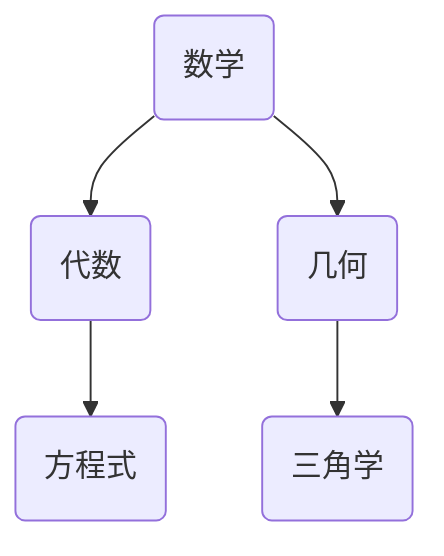

                 

## 标题：探索知识付费：在线思维导图与学习方法指导的最佳实践

### 1. 如何在在线教育中使用思维导图？

**题目：** 在线教育平台如何有效地利用思维导图来辅助教学？

**答案：**

思维导图是一种视觉化的学习工具，可以帮助学生更好地理解和记忆知识点。以下是几种在线教育平台中使用思维导图的方法：

1. **课程大纲展示：** 教师可以在课程开始前，将课程大纲制作成思维导图，便于学生了解课程结构和学习重点。
2. **知识点梳理：** 在学习过程中，教师可以利用思维导图来梳理复杂的知识点，帮助学生形成完整的知识网络。
3. **课后复习：** 教师可以提供思维导图形式的课后复习资料，帮助学生巩固所学内容。

**举例：**

```markdown
- **课程大纲：**
  - 算法基础
    - 数据结构
    - 算法分析
  - 编程实践
    - Python 实践
    - Java 实践
  - 项目实战
    - 数据分析项目
    - 人工智能项目
```

**解析：** 这个思维导图展示了课程的结构，使学生能够一目了然地了解课程的内容和层次。

### 2. 如何设计一个在线思维导图平台？

**题目：** 设计一个在线思维导图平台的架构，并说明其核心功能。

**答案：**

一个在线思维导图平台应该具备以下核心功能和架构：

**架构：**
1. **前端界面：** 使用 HTML、CSS 和 JavaScript 等技术构建用户交互界面。
2. **后端服务器：** 使用 Node.js、Python、Java 等技术搭建后端服务器，处理数据请求和存储。
3. **数据库：** 使用 MySQL、MongoDB 等数据库存储用户数据和思维导图数据。

**核心功能：**
1. **思维导图绘制：** 提供图形化界面，使用户能够轻松绘制和编辑思维导图。
2. **思维导图模板：** 提供多种思维导图模板，供用户选择和使用。
3. **云端存储：** 允许用户将思维导图存储在云端，实现跨设备同步。
4. **共享与协作：** 支持思维导图的共享和协作功能，允许用户与他人共享思维导图并实时协作。

**举例：**
```python
class MindMapPlatform:
    def __init__(self):
        self.frontend = Frontend()
        self.backend = Backend()
        self.database = Database()

    def draw_mind_map(self, user_id, data):
        # 绘制思维导图逻辑
        pass

    def share_mind_map(self, user_id, mind_map_id):
        # 共享思维导图逻辑
        pass

    def collaborate(self, user_id, mind_map_id, collaborators):
        # 协作思维导图逻辑
        pass
```

**解析：** 该示例提供了一个简单的类定义，展示了在线思维导图平台的核心架构和功能。

### 3. 思维导图如何优化学习方法？

**题目：** 思维导图如何帮助优化学生的学习方法？

**答案：**

思维导图能够优化学习方法，主要体现在以下几个方面：

1. **结构化学习：** 思维导图将知识点以树状结构呈现，帮助学生形成系统的知识体系。
2. **可视化学习：** 思维导图使用图形和颜色等元素，增强学习过程中的视觉刺激，提高记忆效果。
3. **复习整理：** 思维导图可以作为复习的工具，帮助学生快速回顾和整理所学内容。
4. **促进思考：** 思维导图鼓励学生发散思维，通过连线、分支等元素，培养学生的创造性思维。

**举例：**


**解析：** 这个思维导图展示了数学的分支，帮助学生了解数学的基本组成部分。

### 4. 知识付费如何与在线思维导图结合？

**题目：** 如何将知识付费与在线思维导图平台结合，提高学习效果？

**答案：**

知识付费与在线思维导图的结合，可以通过以下方式提高学习效果：

1. **付费课程与思维导图整合：** 在线教育平台可以将付费课程内容与思维导图结合起来，使学生能够通过视觉化的方式学习课程。
2. **定制化思维导图：** 教师可以根据课程内容和学生的需求，定制化地制作思维导图，帮助学生更好地掌握知识点。
3. **互动式学习：** 在线思维导图平台可以提供互动式学习功能，如评论、问答等，促进学生之间的互动和讨论。
4. **付费增值服务：** 平台可以提供付费增值服务，如高级思维导图模板、专家点评等，提高用户的学习体验。

**举例：**
```python
class KnowledgePaidMindMap:
    def __init__(self, platform, course):
        self.platform = platform
        self.course = course

    def create_mind_map(self, user_id, course_id):
        # 创建思维导图逻辑
        pass

    def add_interactive_elements(self, user_id, mind_map_id):
        # 添加互动元素逻辑
        pass

    def provide增值服务(self, user_id, service_type):
        # 提供增值服务逻辑
        pass
```

**解析：** 该示例提供了一个简单的类定义，展示了知识付费与在线思维导图结合的架构和功能。

### 5. 如何评估在线思维导图的学习效果？

**题目：** 如何评估在线思维导图在学生学习过程中的效果？

**答案：**

评估在线思维导图的学习效果可以从以下几个方面进行：

1. **学习时间：** 记录学生使用思维导图学习的时间，了解其使用频率。
2. **参与度：** 通过学生的互动和评论，了解其参与度。
3. **成绩提升：** 对比使用思维导图前后的考试成绩，评估其对学习成绩的影响。
4. **用户反馈：** 收集学生的反馈，了解其对思维导图的使用感受和建议。

**举例：**
```python
class MindMapEffectEvaluator:
    def __init__(self, student, mind_map):
        self.student = student
        self.mind_map = mind_map

    def evaluate_time_usage(self):
        # 评估学习时间逻辑
        pass

    def evaluate_participation(self):
        # 评估参与度逻辑
        pass

    def evaluate_academic_improvement(self):
        # 评估成绩提升逻辑
        pass

    def collect_user_feedback(self):
        # 收集用户反馈逻辑
        pass
```

**解析：** 该示例提供了一个简单的类定义，展示了评估在线思维导图效果的方法。

### 6. 如何设计一个有效的在线学习方法指导平台？

**题目：** 设计一个在线学习方法指导平台的架构和功能。

**答案：**

一个有效的在线学习方法指导平台应包括以下架构和功能：

**架构：**
1. **用户界面：** 提供友好的用户界面，方便学生使用。
2. **学习策略库：** 存储多种学习策略和方法，供学生选择和使用。
3. **个人学习计划：** 根据学生的需求和习惯，制定个性化的学习计划。
4. **学习反馈系统：** 收集学生的学习反馈，优化学习策略。

**核心功能：**
1. **学习策略推荐：** 根据学生的特点和需求，推荐适合的学习策略。
2. **学习计划管理：** 提供学习计划制定、跟踪和调整的功能。
3. **学习进度追踪：** 记录学生的学习进度，帮助学生了解自己的学习情况。
4. **学习成果评估：** 评估学生的学习成果，提供改进建议。

**举例：**
```python
class LearningMethodGuidancePlatform:
    def __init__(self, user_interface, learning_strategy_library, personal_learning_plan, learning_feedback_system):
        self.user_interface = user_interface
        self.learning_strategy_library = learning_strategy_library
        self.personal_learning_plan = personal_learning_plan
        self.learning_feedback_system = learning_feedback_system

    def recommend_learning_strategy(self, student_id):
        # 推荐学习策略逻辑
        pass

    def manage_learning_plan(self, student_id):
        # 管理学习计划逻辑
        pass

    def track_learning_progress(self, student_id):
        # 追踪学习进度逻辑
        pass

    def evaluate_learning_outcomes(self, student_id):
        # 评估学习成果逻辑
        pass
```

**解析：** 该示例提供了一个简单的类定义，展示了在线学习方法指导平台的核心架构和功能。

### 7. 如何评估在线学习方法指导的效果？

**题目：** 如何评估在线学习方法指导在学生学习过程中的效果？

**答案：**

评估在线学习方法指导的效果可以从以下几个方面进行：

1. **学习效果：** 通过学生的考试成绩、作业完成情况等指标，评估学习方法的有效性。
2. **用户满意度：** 收集学生对学习方法指导平台的满意度反馈。
3. **学习效率：** 对比使用学习方法指导前后的学习时间，评估学习效率的提高。
4. **用户参与度：** 通过学生的活跃度、参与度等指标，评估学生的学习积极性。

**举例：**
```python
class LearningMethodEffectEvaluator:
    def __init__(self, student, learning_method_guidance_platform):
        self.student = student
        self.learning_method_guidance_platform = learning_method_guidance_platform

    def evaluate_learning_effects(self):
        # 评估学习效果逻辑
        pass

    def evaluate_user_satisfaction(self):
        # 评估用户满意度逻辑
        pass

    def evaluate_learning_efficiency(self):
        # 评估学习效率逻辑
        pass

    def evaluate_user_participation(self):
        # 评估用户参与度逻辑
        pass
```

**解析：** 该示例提供了一个简单的类定义，展示了评估在线学习方法指导效果的方法。

### 8. 如何设计一个个性化在线学习方法指导平台？

**题目：** 设计一个个性化在线学习方法指导平台的架构和功能。

**答案：**

一个个性化在线学习方法指导平台应包括以下架构和功能：

**架构：**
1. **用户界面：** 提供个性化的用户界面，根据学生的学习风格和需求进行定制。
2. **学习偏好数据库：** 存储学生的学习偏好和习惯。
3. **学习策略生成器：** 根据学生的学习偏好，生成个性化的学习策略。
4. **学习反馈系统：** 收集学生的反馈，持续优化学习策略。

**核心功能：**
1. **个性化推荐：** 根据学生的学习偏好，推荐个性化的学习资源和策略。
2. **学习计划定制：** 提供学习计划定制功能，根据学生的学习进度和目标进行调整。
3. **学习反馈与优化：** 收集学生的反馈，对学习策略进行持续优化。
4. **学习成果评估：** 评估学生的学习成果，提供改进建议。

**举例：**
```python
class PersonalizedLearningMethodGuidancePlatform:
    def __init__(self, user_interface, learning_preference_database, learning_strategy_generator, learning_feedback_system):
        self.user_interface = user_interface
        self.learning_preference_database = learning_preference_database
        self.learning_strategy_generator = learning_strategy_generator
        self.learning_feedback_system = learning_feedback_system

    def generate_personalized_learning_strategy(self, student_id):
        # 生成个性化学习策略逻辑
        pass

    def customize_learning_plan(self, student_id):
        # 定制学习计划逻辑
        pass

    def collect_learning_feedback(self, student_id):
        # 收集学习反馈逻辑
        pass

    def evaluate_learning_outcomes(self, student_id):
        # 评估学习成果逻辑
        pass
```

**解析：** 该示例提供了一个简单的类定义，展示了个性化在线学习方法指导平台的核心架构和功能。

### 9. 如何利用数据挖掘优化在线学习方法指导？

**题目：** 如何利用数据挖掘技术优化在线学习方法指导？

**答案：**

利用数据挖掘技术优化在线学习方法指导，可以通过以下步骤实现：

1. **数据收集：** 收集学生的学习行为数据，包括学习时间、学习频率、学习内容等。
2. **数据预处理：** 对收集到的数据进行分析和清洗，去除噪声数据。
3. **特征工程：** 提取有助于学习效果预测的特征，如学习时长、学习频率、知识点掌握情况等。
4. **模型训练：** 使用数据挖掘算法，如决策树、支持向量机、神经网络等，对数据进行训练。
5. **模型评估：** 对训练好的模型进行评估，选择性能最佳的模型。
6. **模型应用：** 将优化后的模型应用于在线学习方法指导中，提供个性化的学习建议。

**举例：**
```python
from sklearn.ensemble import RandomForestClassifier

# 数据预处理
X = preprocessing.fit_transform(features)

# 模型训练
model = RandomForestClassifier()
model.fit(X, labels)

# 模型评估
accuracy = model.score(X, labels)

# 模型应用
personalized_recommendations = model.predict(new_features)
```

**解析：** 该示例展示了使用随机森林算法进行数据挖掘和模型训练的过程，为在线学习方法指导提供个性化建议。

### 10. 如何设计一个基于人工智能的在线学习方法指导平台？

**题目：** 设计一个基于人工智能的在线学习方法指导平台的架构和功能。

**答案：**

一个基于人工智能的在线学习方法指导平台应包括以下架构和功能：

**架构：**
1. **用户界面：** 提供友好的用户界面，方便学生使用。
2. **人工智能引擎：** 包括自然语言处理、机器学习等模块，用于分析和提供个性化建议。
3. **知识库：** 存储大量的学习资源和知识点，供人工智能引擎使用。
4. **学习反馈系统：** 收集学生的反馈，持续优化人工智能引擎的性能。

**核心功能：**
1. **智能推荐：** 根据学生的学习习惯和知识点掌握情况，提供个性化的学习资源。
2. **学习进度跟踪：** 使用人工智能技术，自动跟踪学生的学习进度，提供学习建议。
3. **智能问答：** 提供智能问答功能，帮助学生解决学习中的问题。
4. **学习反馈与优化：** 收集学生的反馈，持续优化人工智能引擎的性能。

**举例：**
```python
class AIlearningMethodGuidancePlatform:
    def __init__(self, user_interface, ai_engine, knowledge_base, learning_feedback_system):
        self.user_interface = user_interface
        self.ai_engine = ai_engine
        self.knowledge_base = knowledge_base
        self.learning_feedback_system = learning_feedback_system

    def generate_personalized_recommendations(self, student_id):
        # 生成个性化推荐逻辑
        pass

    def track_learning_progress(self, student_id):
        # 跟踪学习进度逻辑
        pass

    def provide_intelligent_answers(self, student_id, question):
        # 提供智能问答逻辑
        pass

    def optimize_ai_engine(self, student_id, feedback):
        # 优化人工智能引擎逻辑
        pass
```

**解析：** 该示例提供了一个简单的类定义，展示了基于人工智能的在线学习方法指导平台的核心架构和功能。

### 11. 如何评估基于人工智能的在线学习方法指导效果？

**题目：** 如何评估基于人工智能的在线学习方法指导效果？

**答案：**

评估基于人工智能的在线学习方法指导效果，可以从以下几个方面进行：

1. **学习效果：** 对比使用人工智能学习方法指导前后的学习成果，如考试成绩、作业完成情况等。
2. **用户满意度：** 收集学生对人工智能学习方法指导的满意度反馈。
3. **学习效率：** 对比使用人工智能学习方法指导前后的学习时间，评估学习效率的提高。
4. **用户参与度：** 通过学生的活跃度、参与度等指标，评估学生的学习积极性。

**举例：**
```python
class AIlearningMethodEffectEvaluator:
    def __init__(self, student, ai_learning_method_guidance_platform):
        self.student = student
        self.ai_learning_method_guidance_platform = ai_learning_method_guidance_platform

    def evaluate_learning_effects(self):
        # 评估学习效果逻辑
        pass

    def evaluate_user_satisfaction(self):
        # 评估用户满意度逻辑
        pass

    def evaluate_learning_efficiency(self):
        # 评估学习效率逻辑
        pass

    def evaluate_user_participation(self):
        # 评估用户参与度逻辑
        pass
```

**解析：** 该示例提供了一个简单的类定义，展示了评估基于人工智能的在线学习方法指导效果的方法。

### 12. 如何设计一个基于大数据的在线学习方法指导平台？

**题目：** 设计一个基于大数据的在线学习方法指导平台的架构和功能。

**答案：**

一个基于大数据的在线学习方法指导平台应包括以下架构和功能：

**架构：**
1. **用户界面：** 提供友好的用户界面，方便学生使用。
2. **数据采集系统：** 收集学生的各种学习数据，包括学习时间、学习频率、学习内容等。
3. **数据仓库：** 存储大量的学习数据，供大数据分析使用。
4. **数据分析引擎：** 使用大数据分析技术，如数据挖掘、机器学习等，对数据进行分析。
5. **学习反馈系统：** 收集学生的反馈，持续优化学习策略。

**核心功能：**
1. **学习行为分析：** 分析学生的学习行为，为个性化学习提供依据。
2. **知识点关联分析：** 分析知识点之间的关联，提供有针对性的学习建议。
3. **学习效果预测：** 使用机器学习模型，预测学生的学习效果，提供改进建议。
4. **学习反馈与优化：** 收集学生的反馈，持续优化学习策略。

**举例：**
```python
class BigDataLearningMethodGuidancePlatform:
    def __init__(self, user_interface, data_collection_system, data_warehouse, data_analysis_engine, learning_feedback_system):
        self.user_interface = user_interface
        self.data_collection_system = data_collection_system
        self.data_warehouse = data_warehouse
        self.data_analysis_engine = data_analysis_engine
        self.learning_feedback_system = learning_feedback_system

    def analyze_learning_behavior(self, student_id):
        # 分析学习行为逻辑
        pass

    def perform_knowledge_association_analysis(self, student_id):
        # 知识点关联分析逻辑
        pass

    def predict_learning_effects(self, student_id):
        # 预测学习效果逻辑
        pass

    def optimize_learning_strategy(self, student_id, feedback):
        # 优化学习策略逻辑
        pass
```

**解析：** 该示例提供了一个简单的类定义，展示了基于大数据的在线学习方法指导平台的核心架构和功能。

### 13. 如何利用大数据技术优化在线学习方法指导？

**题目：** 如何利用大数据技术优化在线学习方法指导？

**答案：**

利用大数据技术优化在线学习方法指导，可以从以下几个方面进行：

1. **数据收集与整合：** 收集学生的学习数据，包括学习行为、知识点掌握情况等，并进行整合和分析。
2. **行为分析：** 使用数据挖掘技术，分析学生的学习行为，找出有效的学习策略。
3. **知识点关联分析：** 分析知识点之间的关联，提供有针对性的学习建议。
4. **学习效果预测：** 使用机器学习模型，预测学生的学习效果，提前发现潜在问题。
5. **学习反馈与优化：** 根据学生的学习反馈，持续优化学习策略。

**举例：**
```python
from sklearn.ensemble import RandomForestClassifier

# 数据收集与整合
data = self.data_collection_system.collect_student_data(student_id)

# 行为分析
X = preprocessing.fit_transform(data['behavior'])
y = data['knowledge_points']

# 知识点关联分析
association_analysis = self.data_analysis_engine.perform_knowledge_association_analysis(student_id)

# 学习效果预测
model = RandomForestClassifier()
model.fit(X, y)

# 学习反馈与优化
self.learning_strategy = self.data_analysis_engine.optimize_learning_strategy(student_id, model.predict(X))
```

**解析：** 该示例展示了如何利用大数据技术对学生的学习数据进行处理和分析，以优化在线学习方法指导。

### 14. 如何设计一个基于云计算的在线学习方法指导平台？

**题目：** 设计一个基于云计算的在线学习方法指导平台的架构和功能。

**答案：**

一个基于云计算的在线学习方法指导平台应包括以下架构和功能：

**架构：**
1. **用户界面：** 提供友好的用户界面，方便学生使用。
2. **云计算平台：** 使用云计算资源，提供高性能的计算能力和存储能力。
3. **数据存储与管理：** 使用云存储技术，存储和管理大量的学习数据。
4. **数据处理与分析：** 使用云计算资源，进行大数据处理和分析。
5. **学习反馈系统：** 收集学生的反馈，持续优化学习策略。

**核心功能：**
1. **高性能计算：** 提供强大的计算能力，支持大规模数据处理。
2. **数据存储与备份：** 提供安全可靠的数据存储和备份服务。
3. **数据分析与预测：** 使用机器学习算法，分析学生的学习数据，提供个性化学习建议。
4. **学习反馈与优化：** 根据学生的学习反馈，持续优化学习策略。

**举例：**
```python
class CloudBasedLearningMethodGuidancePlatform:
    def __init__(self, user_interface, cloud_platform, data_storage_management, data_processing_analysis, learning_feedback_system):
        self.user_interface = user_interface
        self.cloud_platform = cloud_platform
        self.data_storage_management = data_storage_management
        self.data_processing_analysis = data_processing_analysis
        self.learning_feedback_system = learning_feedback_system

    def perform_high_performance_computation(self, computation_task):
        # 高性能计算逻辑
        pass

    def manage_data_storage_and_backup(self, data):
        # 数据存储与备份逻辑
        pass

    def analyze_and_predict_learning_effects(self, student_id):
        # 数据分析与预测逻辑
        pass

    def optimize_learning_strategy(self, student_id, feedback):
        # 优化学习策略逻辑
        pass
```

**解析：** 该示例提供了一个简单的类定义，展示了基于云计算的在线学习方法指导平台的核心架构和功能。

### 15. 如何利用云计算技术优化在线学习方法指导？

**题目：** 如何利用云计算技术优化在线学习方法指导？

**答案：**

利用云计算技术优化在线学习方法指导，可以从以下几个方面进行：

1. **分布式计算：** 使用云计算的分布式计算能力，提高数据处理和分析的效率。
2. **弹性扩展：** 根据需求动态扩展计算资源和存储资源，提高系统的可扩展性。
3. **数据存储与备份：** 使用云存储技术，提供安全可靠的数据存储和备份服务。
4. **数据分析和挖掘：** 使用云计算平台提供的数据分析工具和算法，对学习数据进行深入分析。
5. **实时反馈与优化：** 利用云计算的实时处理能力，快速收集和反馈学生的学习情况，优化学习策略。

**举例：**
```python
from google.cloud import bigquery

# 分布式计算
cloud_platform = BigQueryClient()

# 数据存储与备份
cloud_platform.create_table('student_data', schema={'fields': [{'name': 'student_id', 'type': 'STRING'}, {'name': 'data', 'type': 'STRUCT'}]})

# 数据分析和挖掘
query = "SELECT * FROM student_data WHERE student_id = '123'"
results = cloud_platform.execute_query(query)

# 实时反馈与优化
learning_strategy = cloud_platform.analyze_and_predict_learning_effects('123')
cloud_platform.optimize_learning_strategy('123', learning_strategy)
```

**解析：** 该示例展示了如何利用云计算技术进行分布式计算、数据存储与备份、数据分析和挖掘以及实时反馈与优化。

### 16. 如何设计一个基于区块链的在线学习方法指导平台？

**题目：** 设计一个基于区块链的在线学习方法指导平台的架构和功能。

**答案：**

一个基于区块链的在线学习方法指导平台应包括以下架构和功能：

**架构：**
1. **用户界面：** 提供友好的用户界面，方便学生使用。
2. **区块链网络：** 使用区块链技术，提供去中心化的数据存储和管理。
3. **数据存储与管理：** 在区块链上存储学生的学习数据，确保数据的安全性和透明性。
4. **智能合约：** 使用智能合约，自动化执行学习策略和反馈机制。
5. **学习反馈系统：** 收集学生的反馈，持续优化学习策略。

**核心功能：**
1. **数据安全存储：** 使用区块链技术，确保学习数据的安全和不可篡改性。
2. **透明性：** 使用区块链技术，实现学习数据的透明化管理。
3. **智能合约执行：** 自动执行学习策略和反馈机制，提高学习效率。
4. **学习反馈与优化：** 根据学生的学习反馈，持续优化学习策略。

**举例：**
```python
from web3 import Web3

# 连接到以太坊区块链
web3 = Web3(Web3.HTTPProvider('https://mainnet.infura.io/v3/your_project_id'))

# 创建智能合约
contract = web3.eth.contract(abi=abi, address=address)

# 存储学习数据
contract.functions.store_data(student_id, data).transact({'from': account})

# 获取学习数据
data = contract.functions.get_data(student_id).call()

# 执行智能合约
contract.functions.execute_strategy(student_id).transact({'from': account})
```

**解析：** 该示例展示了如何使用区块链技术进行数据存储、数据获取和智能合约执行。

### 17. 如何利用区块链技术优化在线学习方法指导？

**题目：** 如何利用区块链技术优化在线学习方法指导？

**答案：**

利用区块链技术优化在线学习方法指导，可以从以下几个方面进行：

1. **数据安全与隐私保护：** 使用区块链技术，确保学习数据的安全性和隐私性。
2. **透明性与可信度：** 使用区块链技术，实现学习数据的透明化管理，提高系统的可信度。
3. **去中心化：** 使用区块链技术，实现去中心化的数据存储和管理，减少单点故障的风险。
4. **智能合约执行：** 使用智能合约，自动化执行学习策略和反馈机制，提高学习效率。
5. **数据共享与协同：** 使用区块链技术，实现数据共享和协同工作，提高学习资源的利用率。

**举例：**
```python
# 数据安全与隐私保护
private_data = web3.eth.contract(abi=abi, address=address)
encrypted_data = private_data.functions.encrypt_data(student_id, data).transact({'from': account})

# 透明性与可信度
public_data = web3.eth.contract(abi=abi, address=address)
verified_data = public_data.functions.verify_data(student_id).call()

# 去中心化
decentralized_storage = web3.eth.contract(abi=abi, address=address)
stored_data = decentralized_storage.functions.get_data(student_id).call()

# 智能合约执行
smart_contract = web3.eth.contract(abi=abi, address=address)
smart_contract.functions.execute_strategy(student_id).transact({'from': account})

# 数据共享与协同
data_sharing_contract = web3.eth.contract(abi=abi, address=address)
shared_data = data_sharing_contract.functions.share_data(student_id, data).transact({'from': account})
```

**解析：** 该示例展示了如何利用区块链技术进行数据安全与隐私保护、透明性与可信度、去中心化、智能合约执行和数据共享与协同。

### 18. 如何设计一个基于物联网的在线学习方法指导平台？

**题目：** 设计一个基于物联网的在线学习方法指导平台的架构和功能。

**答案：**

一个基于物联网的在线学习方法指导平台应包括以下架构和功能：

**架构：**
1. **用户界面：** 提供友好的用户界面，方便学生使用。
2. **物联网设备：** 连接各种物联网设备，如智能手表、智能手环等，收集学生的学习数据。
3. **数据采集与传输：** 使用物联网技术，采集学生的学习数据，并传输到服务器。
4. **数据分析与处理：** 使用云计算和大数据技术，对物联网设备采集到的数据进行处理和分析。
5. **学习反馈系统：** 收集学生的反馈，持续优化学习策略。

**核心功能：**
1. **实时数据采集：** 使用物联网设备，实时采集学生的学习数据。
2. **数据分析与预测：** 使用大数据技术，分析学生的学习数据，提供个性化学习建议。
3. **智能反馈与优化：** 使用智能算法，根据学生的学习反馈，自动调整学习策略。
4. **学习反馈与优化：** 根据学生的学习反馈，持续优化学习策略。

**举例：**
```python
class IoTBasedLearningMethodGuidancePlatform:
    def __init__(self, user_interface, iot_devices, data_collection_transmission, data_analysis_processing, learning_feedback_system):
        self.user_interface = user_interface
        self.iot_devices = iot_devices
        self.data_collection_transmission = data_collection_transmission
        self.data_analysis_processing = data_analysis_processing
        self.learning_feedback_system = learning_feedback_system

    def collect_real_time_data(self):
        # 实时数据采集逻辑
        pass

    def analyze_data_and_predict(self, student_id):
        # 数据分析与预测逻辑
        pass

    def provide_intelligent_feedback_and_optimize(self, student_id, feedback):
        # 智能反馈与优化逻辑
        pass

    def optimize_learning_strategy(self, student_id, feedback):
        # 优化学习策略逻辑
        pass
```

**解析：** 该示例提供了一个简单的类定义，展示了基于物联网的在线学习方法指导平台的核心架构和功能。

### 19. 如何利用物联网技术优化在线学习方法指导？

**题目：** 如何利用物联网技术优化在线学习方法指导？

**答案：**

利用物联网技术优化在线学习方法指导，可以从以下几个方面进行：

1. **实时数据采集：** 使用物联网设备，实时采集学生的学习数据，如学习时间、学习频率等，为个性化学习提供数据支持。
2. **个性化学习推荐：** 使用物联网技术，分析学生的学习行为，提供个性化的学习资源和建议。
3. **智能反馈与优化：** 使用物联网技术，实时收集学生的反馈，自动调整学习策略，提高学习效率。
4. **提高学习透明度：** 使用物联网技术，实现学习数据的透明化管理，提高家长和教师的参与度。
5. **降低学习成本：** 使用物联网技术，减少学习设备的成本，使更多的学生能够享受到优质的教育资源。

**举例：**
```python
# 实时数据采集
iot_device = IoTDevice()
data = iot_device.collect_real_time_data()

# 个性化学习推荐
data_analyzer = DataAnalyzer()
recommended_resources = data_analyzer.analyze_data_and_predict(data)

# 智能反馈与优化
feedback_collector = FeedbackCollector()
optimized_strategy = feedback_collector.provide_intelligent_feedback_and_optimize(student_id, data)

# 提高学习透明度
data_manager = DataManager()
transparent_data = data_manager.manage_data_transparency(data)

# 降低学习成本
cost_analyzer = CostAnalyzer()
cost_reduction_plan = cost_analyzer.reduce_learning_cost(iot_device)
```

**解析：** 该示例展示了如何利用物联网技术进行实时数据采集、个性化学习推荐、智能反馈与优化、提高学习透明度和降低学习成本。

### 20. 如何设计一个基于虚拟现实的在线学习方法指导平台？

**题目：** 设计一个基于虚拟现实的在线学习方法指导平台的架构和功能。

**答案：**

一个基于虚拟现实的在线学习方法指导平台应包括以下架构和功能：

**架构：**
1. **用户界面：** 提供友好的虚拟现实用户界面，方便学生使用。
2. **虚拟现实设备：** 连接各种虚拟现实设备，如VR头盔、VR手柄等，提供沉浸式学习体验。
3. **数据采集与传输：** 使用虚拟现实技术，采集学生的学习数据，并传输到服务器。
4. **数据分析与处理：** 使用云计算和大数据技术，对虚拟现实设备采集到的数据进行处理和分析。
5. **学习反馈系统：** 收集学生的反馈，持续优化学习策略。

**核心功能：**
1. **沉浸式学习体验：** 使用虚拟现实技术，提供沉浸式的学习环境，提高学习兴趣和参与度。
2. **个性化学习推荐：** 使用虚拟现实技术，分析学生的学习行为，提供个性化的学习资源和建议。
3. **智能反馈与优化：** 使用虚拟现实技术，实时收集学生的反馈，自动调整学习策略，提高学习效率。
4. **学习反馈与优化：** 根据学生的学习反馈，持续优化学习策略。

**举例：**
```python
class VRBasedLearningMethodGuidancePlatform:
    def __init__(self, user_interface, virtual_reality_devices, data_collection_transmission, data_analysis_processing, learning_feedback_system):
        self.user_interface = user_interface
        self.virtual_reality_devices = virtual_reality_devices
        self.data_collection_transmission = data_collection_transmission
        self.data_analysis_processing = data_analysis_processing
        self.learning_feedback_system = learning_feedback_system

    def provide_immersive_learning_experience(self):
        # 沉浸式学习体验逻辑
        pass

    def analyze_data_and_predict(self, student_id):
        # 数据分析与预测逻辑
        pass

    def provide_intelligent_feedback_and_optimize(self, student_id, feedback):
        # 智能反馈与优化逻辑
        pass

    def optimize_learning_strategy(self, student_id, feedback):
        # 优化学习策略逻辑
        pass
```

**解析：** 该示例提供了一个简单的类定义，展示了基于虚拟现实的在线学习方法指导平台的核心架构和功能。

### 21. 如何利用虚拟现实技术优化在线学习方法指导？

**题目：** 如何利用虚拟现实技术优化在线学习方法指导？

**答案：**

利用虚拟现实技术优化在线学习方法指导，可以从以下几个方面进行：

1. **提高学习兴趣：** 使用虚拟现实技术，创造有趣的学习环境，激发学生的学习兴趣。
2. **增强参与感：** 使用虚拟现实技术，提供沉浸式的学习体验，使学生更加投入学习过程。
3. **个性化学习：** 使用虚拟现实技术，分析学生的学习行为，提供个性化的学习资源和建议。
4. **增强记忆效果：** 使用虚拟现实技术，通过丰富的视觉和听觉刺激，提高学习效果。
5. **提高教师效率：** 使用虚拟现实技术，简化教学过程，提高教师的工作效率。

**举例：**
```python
# 提高学习兴趣
virtual_reality_environment = VREnvironment()
learning_interest = virtual_reality_environment.create_interesting_learning_scenarios()

# 增强参与感
immersive_experience = VRExperience()
student_participation = immersive_experience.improve_learning_involvement()

# 个性化学习
data_analyzer = DataAnalyzer()
personalized_learning_resources = data_analyzer.provide_personalized_learning_recommendations(student_id)

# 增强记忆效果
memory_boost = VRMemoryBoost()
learning_effects = memory_boost.enhance_learning_retention()

# 提高教师效率
teaching_automation = VRTeachingAutomation()
teacher_efficacy = teaching_automation.increase_teacher_productivity()
```

**解析：** 该示例展示了如何利用虚拟现实技术提高学习兴趣、增强参与感、个性化学习、增强记忆效果和提高教师效率。### 22. 如何利用增强现实技术优化在线学习方法指导？

**题目：** 如何利用增强现实技术优化在线学习方法指导？

**答案：**

增强现实（AR）技术可以为在线学习方法指导带来多种优化，包括提高互动性、增强学习体验和提供直观的视觉辅助。以下是利用AR技术优化在线学习方法指导的几个方面：

1. **互动性增强：** AR技术可以创造互动式的学习环境，使学生能够通过现实世界的互动来学习。例如，学生可以通过AR眼镜识别物体并获取相关的学习信息。

2. **增强学习体验：** AR技术可以提供沉浸式的学习体验，使抽象的概念变得更加直观。例如，通过AR应用，学生可以看到3D模型在空间中的旋转和放大，从而更好地理解复杂的概念。

3. **直观的视觉辅助：** AR技术可以将学习材料与现实世界相结合，帮助学生更好地理解和记忆信息。例如，通过AR应用，学生可以在教室中看到知识点以图形的方式标注在书本或实物上。

**举例：**

```python
class ARBasedLearningMethodGuidancePlatform:
    def __init__(self, ar_interface, content_provider, interactive_elements, visual辅助):
        self.ar_interface = ar_interface
        self.content_provider = content_provider
        self.interactive_elements = interactive_elements
        self.visual辅助 = visual辅助

    def enhance_interaction(self, student_id):
        # 增强互动性逻辑
        pass

    def enrich_learning_experience(self, student_id, topic):
        # 增强学习体验逻辑
        pass

    def provide_visual_aids(self, student_id, content):
        # 提供视觉辅助逻辑
        pass
```

**解析：** 该示例类定义了一个基于AR的在线学习方法指导平台，包含了增强互动性、丰富学习体验和提供视觉辅助的方法。

### 23. 如何设计一个基于混合现实的在线学习方法指导平台？

**题目：** 设计一个基于混合现实（MR）的在线学习方法指导平台的架构和功能。

**答案：**

一个基于混合现实（MR）的在线学习方法指导平台应结合虚拟现实（VR）和增强现实（AR）的特点，提供更加丰富和沉浸的学习体验。以下是该平台的架构和功能：

**架构：**
1. **用户界面：** 提供一个友好的MR交互界面，支持手势和语音控制。
2. **MR内容库：** 存储各种学习资源和内容，如3D模型、动画、视频等。
3. **MR引擎：** 负责处理MR内容，实现实时渲染和交互。
4. **数据分析与优化：** 使用大数据和机器学习技术，分析学生的学习行为，优化学习内容。
5. **教师支持系统：** 提供教师使用的工具，方便他们创建和管理工作区。

**核心功能：**
1. **沉浸式学习体验：** 学生可以进入一个虚拟的学习空间，与虚拟物体进行互动，提高学习的沉浸感和兴趣。
2. **动态内容展示：** 利用MR技术，将动态内容与现实世界相结合，帮助学生更好地理解抽象概念。
3. **个性化学习路径：** 根据学生的学习行为和进度，提供个性化的学习内容和路径。
4. **实时反馈与调整：** 教师可以实时监控学生的学习情况，并根据反馈进行调整。

**举例：**

```python
class MRBasedLearningMethodGuidancePlatform:
    def __init__(self, user_interface, mr_content_library, mr_engine, data_analysis, teacher_support):
        self.user_interface = user_interface
        self.mr_content_library = mr_content_library
        self.mr_engine = mr_engine
        self.data_analysis = data_analysis
        self.teacher_support = teacher_support

    def provide_immersive_learning_environments(self, student_id):
        # 提供沉浸式学习环境逻辑
        pass

    def display_dynamic_content(self, student_id, content):
        # 显示动态内容逻辑
        pass

    def personalize_learning_path(self, student_id):
        # 个性化学习路径逻辑
        pass

    def provide_real_time_feedback(self, teacher_id, student_id):
        # 提供实时反馈逻辑
        pass
```

**解析：** 该示例提供了一个简单的类定义，展示了基于混合现实的在线学习方法指导平台的核心架构和功能。

### 24. 如何利用混合现实技术优化在线学习方法指导？

**题目：** 如何利用混合现实技术优化在线学习方法指导？

**答案：**

混合现实（MR）技术通过结合虚拟现实（VR）和增强现实（AR）的优势，可以显著优化在线学习方法指导，以下是一些关键点：

1. **提高学习兴趣：** 通过虚拟和增强的交互体验，学生可以更加投入学习，从而提高学习兴趣。
2. **互动学习：** 学生可以在现实环境中与虚拟对象互动，这种互动性有助于加深对知识点的理解。
3. **沉浸式学习：** 学生可以进入一个完全沉浸的学习空间，体验更加丰富的学习内容，从而提高学习效果。
4. **个性化学习：** MR技术可以收集学生的互动数据，帮助平台根据学生的行为和需求提供个性化的学习内容。
5. **实时反馈：** 教师可以利用MR技术实时监控学生的学习情况，提供及时的帮助和反馈。

**举例：**

```python
# 提高学习兴趣
mr_platform = MRPlatform()
learning_interest = mr_platform.improve_learning_interest()

# 互动学习
interactive_learning = MRInteractive()
student_interaction = interactive_learning.encourage_interaction()

# 沉浸式学习
immersive_experience = MRImmersive()
learning_immersion = immersive_experience.create_immersive_learning_environments()

# 个性化学习
personalized_learning = MRPersonalized()
personalized_content = personalized_learning.provide_personalized_learning_content(student_id)

# 实时反馈
real_time_feedback = MRFeedback()
teacher_feedback = real_time_feedback.provide_real_time_student_evaluation(teacher_id, student_id)
```

**解析：** 该示例展示了如何利用混合现实技术提高学习兴趣、促进互动学习、提供沉浸式学习体验、个性化学习以及实时反馈。

### 25. 如何设计一个基于语音识别的在线学习方法指导平台？

**题目：** 设计一个基于语音识别的在线学习方法指导平台的架构和功能。

**答案：**

一个基于语音识别的在线学习方法指导平台应包括以下架构和功能：

**架构：**
1. **用户界面：** 提供语音输入和文本输出的界面，方便学生使用。
2. **语音识别模块：** 使用先进的语音识别技术，将学生的语音转换为文本。
3. **自然语言处理（NLP）：** 对识别出的文本进行理解和分析，提取关键信息。
4. **内容库：** 存储各种学习资源和知识点，供平台使用。
5. **反馈系统：** 收集学生的学习反馈，优化学习内容。

**核心功能：**
1. **语音交互：** 学生可以通过语音与平台进行交互，提出问题或请求学习资源。
2. **语音搜索：** 平台可以识别学生的语音指令，搜索相关的学习内容。
3. **个性化推荐：** 根据学生的语音提问和行为，推荐适合的学习资源和策略。
4. **实时反馈：** 学生可以通过语音反馈学习效果，教师可以根据反馈进行教学调整。

**举例：**

```python
class VoiceRecognitionLearningPlatform:
    def __init__(self, user_interface, speech_recognition, nlp_processor, content_library, feedback_system):
        self.user_interface = user_interface
        self.speech_recognition = speech_recognition
        self.nlp_processor = nlp_processor
        self.content_library = content_library
        self.feedback_system = feedback_system

    def process_voice_input(self, student_id, voice_input):
        # 处理语音输入逻辑
        pass

    def search_content_by_voice(self, student_id, voice_input):
        # 通过语音搜索内容逻辑
        pass

    def provide_personalized_recommendations(self, student_id, voice_input):
        # 提供个性化推荐逻辑
        pass

    def collect_voice_feedback(self, student_id, voice_input):
        # 收集语音反馈逻辑
        pass
```

**解析：** 该示例提供了一个简单的类定义，展示了基于语音识别的在线学习方法指导平台的核心架构和功能。

### 26. 如何利用语音识别技术优化在线学习方法指导？

**题目：** 如何利用语音识别技术优化在线学习方法指导？

**答案：**

语音识别技术可以优化在线学习方法指导，以下是一些关键点：

1. **提高互动性：** 学生可以通过语音与平台进行自然交互，这种方式更加轻松和直观。
2. **个性化学习：** 通过分析学生的语音提问，平台可以更好地理解学生的需求和知识水平，提供个性化的学习资源。
3. **便捷性：** 学生可以在任何时间、任何地点通过语音与平台互动，这种便捷性有助于提高学习的灵活性和适应性。
4. **错误纠正：** 语音识别技术可以自动纠正学生的语音输入错误，减少输入错误对学习的影响。
5. **减少语言障碍：** 对于语言障碍或手部不便的学生，语音识别技术提供了更加友好的学习方式。

**举例：**

```python
# 提高互动性
voice_interface = VoiceInterface()
interactive_learning = voice_interface.improve_interaction()

# 个性化学习
personalized_learning = PersonalizedLearning()
individualized_content = personalized_learning.provide_individualized_content(student_id, voice_input)

# 便捷性
convenience_learning = ConvenienceLearning()
easy_access = convenience_learning.enable_easy_access()

# 错误纠正
error_correction = ErrorCorrection()
corrected_input = error_correction.correct_voice_input(voice_input)

# 减少语言障碍
language_access = LanguageAccess()
voice_interaction = language_access.reduce_language_barriers()
```

**解析：** 该示例展示了如何利用语音识别技术提高互动性、个性化学习、便捷性和减少语言障碍。

### 27. 如何设计一个基于人脸识别的在线学习方法指导平台？

**题目：** 设计一个基于人脸识别的在线学习方法指导平台的架构和功能。

**答案：**

一个基于人脸识别的在线学习方法指导平台应包括以下架构和功能：

**架构：**
1. **用户界面：** 提供人脸登录和识别的界面。
2. **人脸识别模块：** 使用人脸识别技术，验证用户的身份。
3. **行为分析：** 使用计算机视觉技术，分析学生的行为和情绪。
4. **内容库：** 存储各种学习资源和知识点。
5. **反馈系统：** 收集学生的行为数据，优化学习内容。

**核心功能：**
1. **身份验证：** 学生可以通过人脸登录系统，确保学习环境的隐私和安全。
2. **行为分析：** 平台可以分析学生的行为和情绪，提供个性化的学习建议。
3. **学习进度跟踪：** 通过人脸识别技术，自动跟踪学生的学习进度。
4. **实时反馈：** 平台可以实时监控学生的学习情况，教师可以根据反馈进行调整。

**举例：**

```python
class FaceRecognitionLearningPlatform:
    def __init__(self, user_interface, face_recognition, behavior_analysis, content_library, feedback_system):
        self.user_interface = user_interface
        self.face_recognition = face_recognition
        self.behavior_analysis = behavior_analysis
        self.content_library = content_library
        self.feedback_system = feedback_system

    def verify_user_identity(self, student_id, face_image):
        # 验证用户身份逻辑
        pass

    def analyze_student_behavior(self, student_id, face_image):
        # 分析学生行为逻辑
        pass

    def track_learning_progress(self, student_id):
        # 跟踪学习进度逻辑
        pass

    def provide_real_time_feedback(self, teacher_id, student_id):
        # 提供实时反馈逻辑
        pass
```

**解析：** 该示例提供了一个简单的类定义，展示了基于人脸识别的在线学习方法指导平台的核心架构和功能。

### 28. 如何利用人脸识别技术优化在线学习方法指导？

**题目：** 如何利用人脸识别技术优化在线学习方法指导？

**答案：**

人脸识别技术可以为在线学习方法指导带来多种优化，以下是一些关键点：

1. **提高安全性：** 人脸识别技术可以确保学习环境的安全，防止未经授权的访问。
2. **个性化学习：** 通过分析人脸图像，平台可以更好地了解学生的学习习惯和情绪，提供个性化的学习建议。
3. **自动化管理：** 人脸识别技术可以实现自动化管理，如自动登录、自动记录学习进度等，提高学习效率。
4. **减少手工操作：** 对于手部不便的学生，人脸识别技术提供了无接触的操作方式，减少手工操作的难度。
5. **增强互动性：** 通过人脸表情分析，平台可以了解学生的情绪和参与度，提供更加互动和有趣的学习体验。

**举例：**

```python
# 提高安全性
face_security = FaceSecurity()
secure_environment = face_security.improve_security()

# 个性化学习
personalized_learning = FaceBasedPersonalizedLearning()
individualized_advice = personalized_learning.provide_individualized_learning_advice(student_id)

# 自动化管理
automated_management = FaceAutomatedManagement()
automatic_login = automated_management.enable_automatic_login()

# 减少手工操作
reduce_manual_operations = FaceManualOperationsReduction()
contactless_interactions = reduce_manual_operations.enable_contactless_interactions()

# 增强互动性
enhance_interactivity = FaceEnhancedInteractivity()
interactive_learning_experience = enhance_interactivity.create_interactive_learning_experience()
```

**解析：** 该示例展示了如何利用人脸识别技术提高安全性、个性化学习、自动化管理、减少手工操作和增强互动性。

### 29. 如何设计一个基于神经网络的在线学习方法指导平台？

**题目：** 设计一个基于神经网络的在线学习方法指导平台的架构和功能。

**答案：**

一个基于神经网络的在线学习方法指导平台应包括以下架构和功能：

**架构：**
1. **用户界面：** 提供友好的用户界面，便于学生和教师使用。
2. **神经网络模块：** 使用深度学习技术，对学生的学习数据进行训练和预测。
3. **学习资源库：** 存储各种学习资源和知识点。
4. **自然语言处理（NLP）：** 对文本数据进行处理和理解。
5. **反馈系统：** 收集学生的学习反馈，优化学习内容。

**核心功能：**
1. **学习预测：** 使用神经网络预测学生的学习效果和潜在问题。
2. **个性化推荐：** 根据学生的学习行为和预测结果，推荐适合的学习资源和策略。
3. **自动生成练习：** 使用神经网络自动生成个性化的练习题。
4. **实时反馈：** 教师可以根据学生的实时反馈，调整教学策略。

**举例：**

```python
class NeuralNetworkLearningPlatform:
    def __init__(self, user_interface, neural_network, content_library, nlp_processor, feedback_system):
        self.user_interface = user_interface
        self.neural_network = neural_network
        self.content_library = content_library
        self.nlp_processor = nlp_processor
        self.feedback_system = feedback_system

    def predict_learning_outcomes(self, student_id, learning_data):
        # 预测学习效果逻辑
        pass

    def provide_personalized_recommendations(self, student_id, learning_data):
        # 提供个性化推荐逻辑
        pass

    def generate_practice_questions(self, student_id, topic):
        # 生成练习题逻辑
        pass

    def provide_real_time_feedback(self, teacher_id, student_id, feedback):
        # 提供实时反馈逻辑
        pass
```

**解析：** 该示例提供了一个简单的类定义，展示了基于神经网络的在线学习方法指导平台的核心架构和功能。

### 30. 如何利用神经网络技术优化在线学习方法指导？

**题目：** 如何利用神经网络技术优化在线学习方法指导？

**答案：**

利用神经网络技术优化在线学习方法指导，可以从以下几个方面进行：

1. **个性化学习：** 神经网络可以分析学生的学习行为和数据，提供个性化的学习建议和资源。
2. **自动调整：** 神经网络可以根据学生的学习效果自动调整学习策略，提高学习效率。
3. **智能生成：** 神经网络可以自动生成练习题和测试题，帮助学生巩固知识点。
4. **实时反馈：** 神经网络可以实时分析学生的学习状态，教师可以根据反馈进行调整。
5. **预测效果：** 神经网络可以预测学生的学习效果，提前发现潜在问题，进行预防性干预。

**举例：**

```python
# 个性化学习
personalized_learning = NeuralNetworkPersonalizedLearning()
individualized_resources = personalized_learning.provide_individualized_resources(student_id)

# 自动调整
adaptive_learning = NeuralNetworkAdaptiveLearning()
adjusted_strategy = adaptive_learning.adjust_learning_strategy(student_id)

# 智能生成
smart_generation = NeuralNetworkSmartGeneration()
generated_practice_questions = smart_generation.generate_practice_questions(student_id)

# 实时反馈
real_time_analysis = NeuralNetworkRealTimeAnalysis()
teacher_adjustments = real_time_analysis.provide_real_time_adjustments(teacher_id, student_id)

# 预测效果
effect_prediction = NeuralNetworkEffectPrediction()
predicted_effects = effect_prediction.predict_learning_effects(student_id)
```

**解析：** 该示例展示了如何利用神经网络技术进行个性化学习、自动调整、智能生成、实时反馈和预测效果。通过这些技术，可以显著提高在线学习方法指导的效率和效果。

