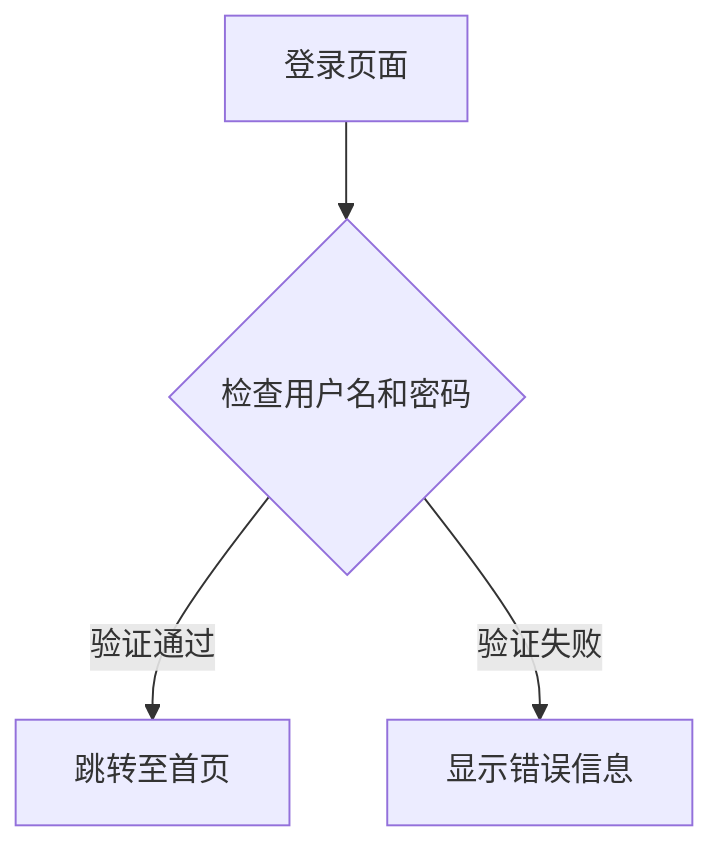
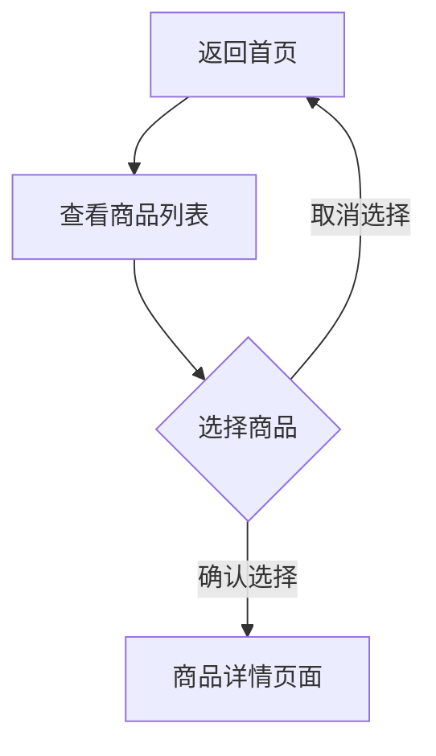
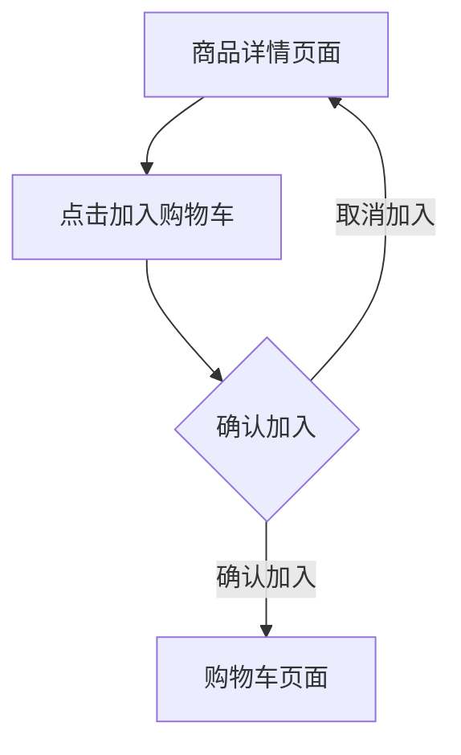
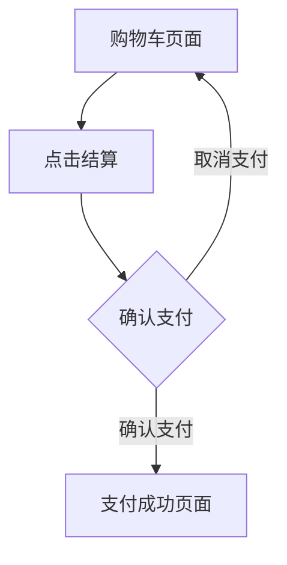
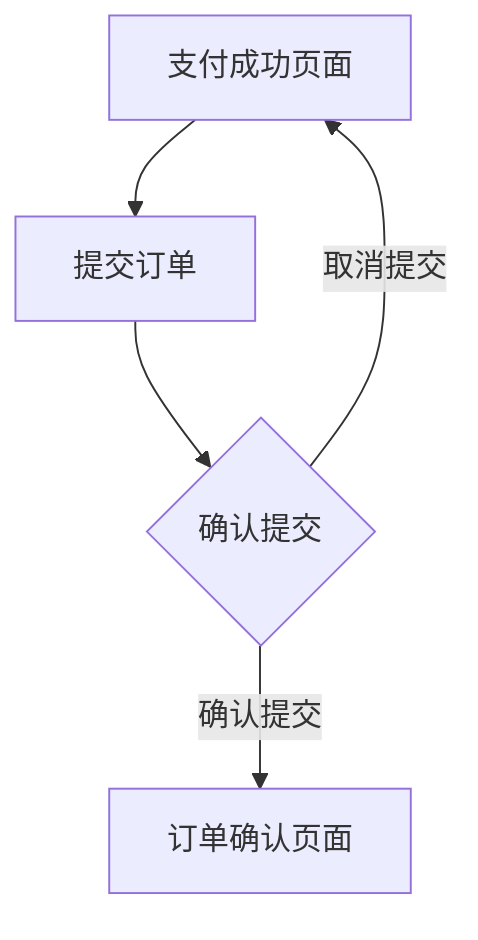

                 

### 题目
使用 Mermaid 语法创建一个流程图，描述用户从登录系统到购买商品的整个过程。

### 问答格式示例

#### 1. 用户登录系统

**题目：** 如何使用 Mermaid 语法描述用户登录系统的过程？

**答案：** 

**解析：** 
- `A[登录页面]` 表示用户进入登录页面。
- `B{检查用户名和密码}` 表示系统检查用户输入的用户名和密码。
- `B -->|验证通过| C[跳转至首页]` 表示如果验证通过，用户将跳转到首页。
- `B -->|验证失败| D[显示错误信息]` 表示如果验证失败，系统将显示错误信息。

#### 2. 查看商品列表

**题目：** 如何使用 Mermaid 语法描述用户查看商品列表的过程？

**答案：** 

**解析：**
- `C[跳转至首页]` 表示用户跳转到首页。
- `D[查看商品列表]` 表示用户在首页查看商品列表。
- `D --> E{选择商品}` 表示用户选择一个商品。
- `E -->|确认选择| F[商品详情页面]` 表示用户确认选择后，跳转到商品详情页面。
- `E -->|取消选择| C[返回首页]` 表示用户取消选择后，返回首页。

#### 3. 加入购物车

**题目：** 如何使用 Mermaid 语法描述用户将商品加入购物车的过程？

**答案：** 

**解析：**
- `F[商品详情页面]` 表示用户在商品详情页面。
- `G[点击加入购物车]` 表示用户点击加入购物车按钮。
- `G --> H{确认加入}` 表示系统提示用户确认加入购物车。
- `H -->|确认加入| I[购物车页面]` 表示用户确认后，跳转到购物车页面。
- `H -->|取消加入| F[商品详情页面]` 表示用户取消后，返回商品详情页面。

#### 4. 购物车结算

**题目：** 如何使用 Mermaid 语法描述用户在购物车结算的过程？

**答案：** 

**解析：**
- `I[购物车页面]` 表示用户在购物车页面。
- `J[点击结算]` 表示用户点击结算按钮。
- `J --> K{确认支付}` 表示系统提示用户确认支付。
- `K -->|确认支付| L[支付成功页面]` 表示用户确认后，跳转到支付成功页面。
- `K -->|取消支付| I[购物车页面]` 表示用户取消后，返回购物车页面。

#### 5. 订单提交

**题目：** 如何使用 Mermaid 语法描述用户提交订单的过程？

**答案：** 

**解析：**
- `L[支付成功页面]` 表示用户在支付成功页面。
- `M[提交订单]` 表示用户点击提交订单按钮。
- `M --> N{确认提交}` 表示系统提示用户确认提交订单。
- `N -->|确认提交| O[订单确认页面]` 表示用户确认后，跳转到订单确认页面。
- `N -->|取消提交| L[支付成功页面]` 表示用户取消后，返回支付成功页面。

