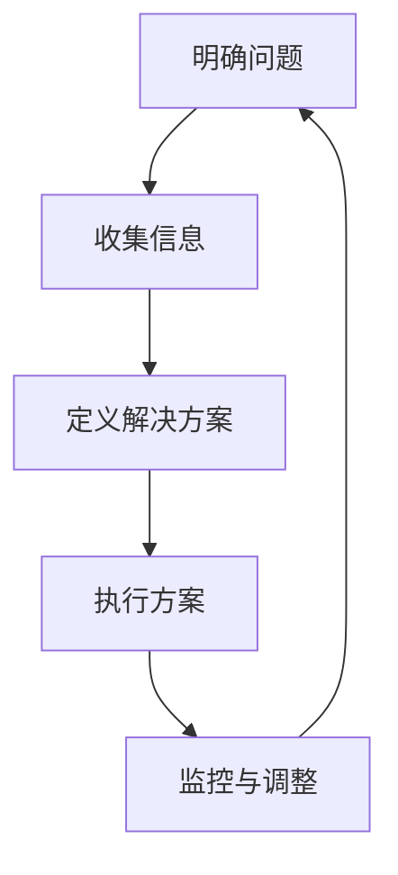

                 

### 标题

《结构化思维解析：面试与编程题解》

## 内容

### 1. 面试题库

#### 1.1 逻辑思维与结构化思维的应用

**题目：**  如何在面试中展示你的逻辑思维和结构化思维能力？

**答案解析：**
在面试中，展示逻辑思维和结构化思维能力通常涉及以下几个方面：

- **准备阶段：** 对面试的公司、岗位和常见问题进行充分了解，构建一个清晰的知识框架，以便在回答问题时能够有条理地展开。
- **回答问题：** 在回答面试问题时，首先给出总体思路，然后按照逻辑顺序分步解释，确保答案的层次清晰，便于理解。
- **举例说明：** 使用具体的例子或故事来支撑你的观点，使回答更具说服力。
- **提问阶段：** 在回答完问题后，可以适时提出问题，展示你对问题的深入思考和对岗位的认真态度。

**示例代码：**
```go
func demonstrateLogicalThinking(question string) {
    fmt.Println("Overall approach:")
    fmt.Println(question)

    fmt.Println("Step 1:")
    // 解答步骤一

    fmt.Println("Step 2:")
    // 解答步骤二

    fmt.Println("Example:")
    // 使用例子说明
}

demonstrateLogicalThinking("How would you design a scalable architecture for a high-traffic e-commerce platform?")
```

### 2. 算法编程题库

#### 2.1 数据结构与算法的理解与应用

**题目：** 如何实现一个高效的快速排序算法？

**答案解析：**
快速排序算法是一种高效的排序算法，其核心思想是通过一趟排序将待排序的记录分割成独立的两部分，其中一部分记录的关键字均比另一部分的关键字小，然后分别对这两部分记录继续进行排序，以达到整个序列有序。

**实现步骤：**
- 选择一个基准元素。
- 将比基准元素小的元素放在基准元素的左边，比它大的元素放在右边。
- 递归地对左右两部分进行快速排序。

**示例代码：**
```go
func quickSort(arr []int, low int, high int) {
    if low < high {
        pi := partition(arr, low, high)
        quickSort(arr, low, pi-1)
        quickSort(arr, pi+1, high)
    }
}

func partition(arr []int, low int, high int) int {
    pivot := arr[high]
    i := low - 1
    for j := low; j < high; j++ {
        if arr[j] < pivot {
            i++
            arr[i], arr[j] = arr[j], arr[i]
        }
    }
    arr[i+1], arr[high] = arr[high], arr[i+1]
    return i + 1
}
```

### 3. 实际问题解决

#### 3.1 项目管理中的结构化思维

**题目：** 如何运用结构化思维解决一个复杂的项目问题？

**答案解析：**
解决复杂项目问题时，结构化思维可以帮助我们系统地分析问题，制定解决方案，并有效地执行。

**步骤：**
- **明确问题：** 准确地定义问题，理解其关键点和影响范围。
- **收集信息：** 收集与问题相关的数据和信息，确保分析全面。
- **定义解决方案：** 根据问题分析，制定可行的解决方案。
- **执行方案：** 将解决方案分解成具体的行动步骤，并执行。
- **监控与调整：** 在执行过程中持续监控，根据实际情况进行调整。

**示例图：**


通过上述步骤，我们可以系统地解决复杂项目中的问题，提高工作效率和项目质量。

**总结：**
结构化思维在面试、编程和项目问题解决中发挥着重要作用。通过掌握结构化思维的原理和应用，我们可以更加高效地解决实际问题，提高面试和项目开发的竞争力。

