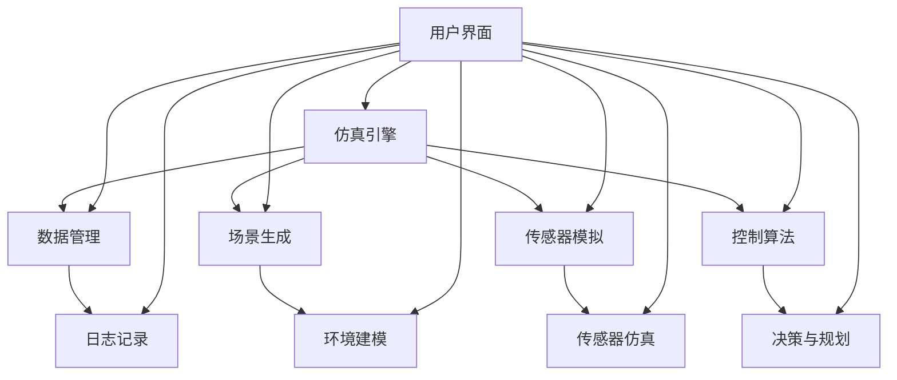

                 

### 1. 自动驾驶仿真平台架构设计相关问题

#### 1.1 如何设计自动驾驶仿真平台的总体架构？

**答案：** 设计自动驾驶仿真平台的总体架构时，需要考虑以下几个关键方面：

1. **模块划分：** 根据功能将平台划分为几个主要模块，如仿真引擎、数据管理、场景生成、传感器模拟、控制算法等。
2. **模块间通信：** 确保模块间的高效通信，可以使用消息队列、事件驱动机制或同步机制来实现。
3. **可扩展性：** 设计时考虑到未来可能的功能扩展，如增加新的传感器类型或仿真场景。
4. **可重用性：** 优化设计，使得各个模块具有较高的可重用性。
5. **稳定性：** 确保平台的稳定运行，避免仿真过程中的错误和异常。

**示例架构设计：**


#### 1.2 如何保证自动驾驶仿真平台的高效性？

**答案：** 为了保证自动驾驶仿真平台的高效性，可以采取以下措施：

1. **并行处理：** 利用多核CPU的优势，对仿真任务进行并行处理，如并行生成场景、并行模拟传感器数据等。
2. **优化算法：** 选择高效的算法和优化技术，如动态规划、蒙特卡洛树搜索等。
3. **缓存技术：** 利用缓存技术减少重复计算，如缓存已生成的场景和传感器数据。
4. **负载均衡：** 根据仿真任务的特点，实现负载均衡，避免某些模块或计算资源过载。
5. **资源复用：** 通过复用已有的仿真资源，如环境模型、传感器数据等，减少资源浪费。

#### 1.3 如何进行自动驾驶仿真平台的安全设计？

**答案：** 自动驾驶仿真平台的安全设计是至关重要的，可以从以下几个方面进行：

1. **数据隔离：** 保障不同用户和项目的数据隔离，防止数据泄露。
2. **权限管理：** 实现严格的权限管理，确保只有授权用户才能访问特定数据和功能。
3. **异常处理：** 设计完善的异常处理机制，确保在出现异常时系统能够稳定运行。
4. **安全审计：** 定期进行安全审计，检查系统中的潜在漏洞和安全风险。
5. **数据加密：** 对敏感数据进行加密存储和传输，确保数据安全性。

### 2. 自动驾驶仿真平台中的核心算法问题

#### 2.1 如何实现自动驾驶仿真平台中的路径规划算法？

**答案：** 路径规划算法是自动驾驶仿真平台中的核心算法之一，以下是一些常见的路径规划算法：

1. **A*算法：** 结合了Dijkstra算法和贪心算法的优点，通过评估函数来优化路径。
2. **RRT（快速随机树）算法：** 通过随机采样和扩展来构建路径，适用于不确定性环境。
3. **RRT*算法：** 在RRT算法的基础上，引入了优化步骤，提高了路径质量。
4. **Dijkstra算法：** 用于求解单源最短路径问题，适用于已知环境。

**示例代码：** A*算法的Python实现

```python
import heapq

def heuristic(a, b):
    return ((b[0] - a[0]) ** 2 + (b[1] - a[1]) ** 2) ** 0.5

def astar(array, start, end):
    neighbors = [(0,1), (0,-1), (1,0), (-1,0)]
    close_set = set()
    g_score = dict()
    g_score[start] = 0
    f_score = dict()
    f_score[start] = heuristic(start, end)
    open_set = [(f_score[start], g_score[start], start)]
    
    while len(open_set) > 0:
        current = heapq.heappop(open_set)
        
        if current[2] == end:
            path = []
            while current[2] != start:
                path.append(current[2])
                current = parent[current]
            path.append(start)
            path = path[::-1]
            return path
        
        close_set.add(current[2])
        
        for neighbor in neighbors:
            neighbor = (current[2][0] + neighbor[0], current[2][1] + neighbor[1])
            tentative_g_score = current[1] + heuristic(current[2], neighbor)
            
            if neighbor in close_set and tentative_g_score >= g_score[neighbor]:
                continue
            
            if tentative_g_score < g_score.get(neighbor, float('inf')):
                parent[neighbor] = current[2]
                g_score[neighbor] = tentative_g_score
                f_score[neighbor] = tentative_g_score + heuristic(neighbor, end)
                if neighbor not in close_set:
                    heapq.heappush(open_set, (f_score[neighbor], tentative_g_score, neighbor))
    
    return None
```

#### 2.2 如何处理自动驾驶仿真平台中的传感器数据？

**答案：** 处理传感器数据是自动驾驶仿真平台中的关键环节，以下是一些常见的方法：

1. **数据预处理：** 去除传感器数据中的噪声和异常值，如使用滤波算法。
2. **数据融合：** 将多个传感器的数据进行融合，提高数据的可靠性和准确性，如使用卡尔曼滤波器。
3. **数据压缩：** 对大量传感器数据进行压缩，减少存储和传输的开销，如使用PCA（主成分分析）。
4. **特征提取：** 从传感器数据中提取有用的特征，用于后续的算法处理，如使用HOG（方向梯度直方图）。
5. **数据存储：** 设计高效的存储方案，如使用时间序列数据库。

#### 2.3 如何实现自动驾驶仿真平台中的决策与控制算法？

**答案：** 决策与控制算法是自动驾驶仿真平台的核心，以下是一些常见的算法：

1. **PID控制器：** 适用于线性系统，通过调整比例、积分和微分系数来实现控制。
2. **模糊控制器：** 通过模糊逻辑来实现控制，适用于非线性系统和不确定环境。
3. **神经网络控制器：** 使用神经网络来学习控制规则，适用于复杂系统的控制。
4. **深度强化学习：** 使用深度神经网络和强化学习算法来实现智能控制，适用于复杂动态环境。

**示例算法：** PID控制器的基本实现

```python
class PIDController:
    def __init__(self, kp, ki, kd):
        self.kp = kp
        self.ki = ki
        self.kd = kd
        self.error_last = 0
        self.integral = 0

    def update(self, setpoint, current_value):
        error = setpoint - current_value
        delta_error = error - self.error_last
        self.integral += error
        control = self.kp * error + self.ki * self.integral + self.kd * delta_error
        self.error_last = error
        return control
```

### 3. 自动驾驶仿真平台中的测试与评估问题

#### 3.1 如何对自动驾驶仿真平台进行系统测试？

**答案：** 对自动驾驶仿真平台进行系统测试时，可以遵循以下步骤：

1. **单元测试：** 对各个模块进行独立的测试，确保模块功能的正确性。
2. **集成测试：** 将模块组合成完整的系统，进行测试，确保模块间的协同工作。
3. **性能测试：** 测试平台的响应时间、处理能力和稳定性等性能指标。
4. **安全测试：** 检查平台在异常情况下的反应和处理能力，如传感器故障、控制失效等。
5. **兼容性测试：** 检查平台在不同操作系统、硬件和环境下的兼容性。

#### 3.2 如何评估自动驾驶仿真平台的效果？

**答案：** 评估自动驾驶仿真平台的效果可以从以下几个方面进行：

1. **路径规划：** 评估路径规划的准确性、速度和鲁棒性。
2. **传感器数据：** 评估传感器数据的准确性、实时性和可靠性。
3. **决策与控制：** 评估决策与控制算法的有效性和稳定性。
4. **仿真场景：** 评估仿真场景的多样性和逼真度。
5. **用户满意度：** 通过用户反馈评估平台的易用性和用户体验。

**评估指标：**
- **准确率：** 路径规划的准确性。
- **响应时间：** 平台处理传感器数据和执行决策的时间。
- **稳定性：** 平台在各种情况下的稳定性。
- **用户满意度：** 用户对平台的整体满意度。

#### 3.3 如何优化自动驾驶仿真平台的性能？

**答案：** 优化自动驾驶仿真平台的性能可以从以下几个方面进行：

1. **算法优化：** 对核心算法进行优化，提高计算效率和准确性。
2. **硬件升级：** 使用更快的处理器、更大的内存和更高效的存储设备。
3. **并行处理：** 利用并行计算技术，提高数据处理速度。
4. **数据压缩：** 对传感器数据进行压缩，减少数据传输和处理的开销。
5. **负载均衡：** 合理分配计算任务，避免某些节点过载。
6. **缓存技术：** 利用缓存技术减少重复计算，提高响应速度。
7. **资源复用：** 通过复用已有的仿真资源，减少资源浪费。

### 4. 自动驾驶仿真平台中的部署与维护问题

#### 4.1 如何部署自动驾驶仿真平台？

**答案：** 部署自动驾驶仿真平台时，可以遵循以下步骤：

1. **环境配置：** 配置操作系统、依赖库和开发环境。
2. **安装组件：** 安装仿真平台所需的各个组件，如仿真引擎、传感器模拟器、控制算法等。
3. **初始化数据：** 初始化仿真平台所需的数据，如地图、传感器参数等。
4. **网络配置：** 配置网络环境，确保平台能够与其他系统进行数据交换。
5. **运行测试：** 在部署后的环境中运行测试，确保平台功能的正确性。

#### 4.2 如何维护自动驾驶仿真平台？

**答案：** 维护自动驾驶仿真平台时，可以遵循以下原则：

1. **定期更新：** 定期更新平台中的软件和硬件，保持最新版本。
2. **故障处理：** 及时处理平台运行中的故障，确保平台的稳定运行。
3. **备份与恢复：** 定期备份平台数据，确保数据的安全性和可恢复性。
4. **性能监控：** 监控平台运行过程中的性能指标，确保平台的性能稳定。
5. **用户支持：** 提供用户技术支持和培训，帮助用户解决使用过程中遇到的问题。

### 5. 自动驾驶仿真平台中的未来发展趋势

#### 5.1 自动驾驶仿真平台的发展趋势是什么？

**答案：** 自动驾驶仿真平台的发展趋势主要包括以下几个方面：

1. **更高逼真的仿真场景：** 随着传感器技术的进步和场景数据的积累，仿真平台的场景逼真度将不断提升。
2. **更智能的决策与控制算法：** 基于深度学习、强化学习等先进算法的决策与控制算法将逐步应用于仿真平台。
3. **更高效的计算资源利用：** 通过并行计算、分布式计算等技术，提高仿真平台的计算效率。
4. **更广泛的应用场景：** 自动驾驶仿真平台将不仅用于自动驾驶车辆的测试，还将扩展到无人机、机器人等领域的仿真。
5. **更紧密的产业合作：** 自动驾驶仿真平台将与其他行业和领域的企业进行深入合作，推动技术的创新和应用。

#### 5.2 自动驾驶仿真平台在未来的潜在应用领域有哪些？

**答案：** 自动驾驶仿真平台在未来的潜在应用领域包括：

1. **自动驾驶车辆：** 包括乘用车、商用车、卡车、公交车等。
2. **无人机：** 用于物流配送、农业监控、环境监测等。
3. **机器人：** 用于工业自动化、医疗服务、家庭服务等领域。
4. **自动驾驶轨道交通：** 包括地铁、轻轨、火车等。
5. **智能城市：** 用于智慧交通管理、城市规划、环境监控等。

#### 5.3 自动驾驶仿真平台在安全性方面的挑战有哪些？

**答案：** 自动驾驶仿真平台在安全性方面面临的挑战主要包括：

1. **仿真场景的全面性：** 如何构建全面、真实的仿真场景，确保测试的覆盖面。
2. **算法的鲁棒性：** 如何保证算法在各种极端条件下的稳定性。
3. **传感器数据的准确性：** 传感器数据的准确性和实时性对仿真结果的影响。
4. **数据隐私与安全：** 如何保护用户数据和平台运行中的敏感信息。
5. **法律法规的合规性：** 随着自动驾驶技术的发展，法律法规也在不断更新，如何确保仿真平台符合相关法规。

### 6. 自动驾驶仿真平台建设的实际案例分析

#### 6.1 请介绍一个成功的自动驾驶仿真平台建设项目。

**答案：** 一个成功的自动驾驶仿真平台建设项目是Waymo的自动驾驶仿真平台。Waymo是谷歌旗下的自动驾驶公司，其仿真平台具有以下几个特点：

1. **大规模仿真：** Waymo的仿真平台能够进行大规模的仿真测试，每天能够生成数百万英里的测试数据。
2. **多样化场景：** 平台涵盖了城市、乡村、高速公路等多种场景，以及各种交通状况和天气条件。
3. **高效数据处理：** Waymo使用分布式计算和高效的数据处理技术，确保仿真平台的计算效率和数据利用率。
4. **智能决策与控制：** 平台采用了先进的决策与控制算法，包括深度学习和强化学习等技术。
5. **实时反馈：** 平台能够实时反馈仿真结果，帮助开发者快速识别和解决问题。

#### 6.2 自动驾驶仿真平台建设中的常见问题有哪些？

**答案：** 自动驾驶仿真平台建设中的常见问题包括：

1. **计算资源不足：** 仿真平台需要大量的计算资源，如CPU、GPU、存储等，如何合理分配资源是一个挑战。
2. **数据质量不佳：** 传感器数据的质量对仿真结果有重要影响，如何保证数据的质量是一个问题。
3. **算法性能不稳定：** 算法的性能可能会受到多种因素的影响，如仿真场景、传感器噪声等，如何保证算法的稳定性是一个挑战。
4. **场景覆盖不足：** 如何构建全面、真实的仿真场景，确保测试的覆盖面是一个问题。
5. **安全性问题：** 仿真平台的安全性是一个重要的考虑因素，如何确保平台的安全性和可靠性是一个挑战。

### 7. 自动驾驶仿真平台建设的最佳实践

#### 7.1 自动驾驶仿真平台建设的最佳实践是什么？

**答案：** 自动驾驶仿真平台建设的最佳实践包括以下几个方面：

1. **需求分析：** 在建设平台之前，充分了解用户需求，明确平台的功能和性能要求。
2. **模块化设计：** 采用模块化设计，确保平台具有良好的可扩展性和可维护性。
3. **高效数据处理：** 利用高效的数据处理技术，如并行计算、分布式计算等，提高数据处理效率。
4. **安全设计：** 在平台设计时充分考虑安全性，包括数据安全、算法安全等。
5. **持续迭代：** 平台建设是一个持续迭代的过程，要不断收集用户反馈，优化平台的功能和性能。
6. **培训与支持：** 提供用户培训和持续的技术支持，帮助用户更好地使用平台。

#### 7.2 如何评估自动驾驶仿真平台的建设效果？

**答案：** 评估自动驾驶仿真平台的建设效果可以从以下几个方面进行：

1. **功能完整性：** 评估平台是否实现了所有预期的功能。
2. **性能指标：** 评估平台的响应时间、处理能力和稳定性等性能指标。
3. **用户体验：** 通过用户反馈评估平台的易用性和用户体验。
4. **测试覆盖率：** 评估平台在不同场景和条件下的测试覆盖率。
5. **安全性：** 评估平台的安全性，包括数据安全、算法安全等。

### 8. 自动驾驶仿真平台建设的未来展望

#### 8.1 自动驾驶仿真平台建设的未来发展方向是什么？

**答案：** 自动驾驶仿真平台建设的未来发展方向主要包括以下几个方面：

1. **更高效的算法：** 开发和应用更高效的算法，提高仿真平台的计算效率和准确性。
2. **更真实的场景：** 构建更真实、更全面的仿真场景，提高仿真平台的逼真度和可靠性。
3. **更智能的决策与控制：** 结合人工智能技术，实现更智能的决策与控制算法。
4. **更广泛的领域应用：** 扩大自动驾驶仿真平台的应用领域，如无人机、机器人等。
5. **更紧密的产业合作：** 加强与各行业的合作，推动自动驾驶技术的发展和应用。

#### 8.2 自动驾驶仿真平台建设在自动驾驶产业发展中的作用是什么？

**答案：** 自动驾驶仿真平台建设在自动驾驶产业发展中具有重要作用，主要体现在以下几个方面：

1. **降低研发成本：** 仿真平台可以模拟真实环境，减少实际道路测试的成本和时间。
2. **提高研发效率：** 通过高效的仿真平台，开发者可以快速测试和优化算法，提高研发效率。
3. **保障安全性：** 仿真平台可以模拟各种场景和异常情况，提高自动驾驶系统的安全性和可靠性。
4. **促进技术创新：** 仿真平台为自动驾驶技术的创新提供了实验和验证的环境。
5. **推动标准化：** 仿真平台的建设有助于推动自动驾驶技术的标准化和规范化。

### 9. 自动驾驶仿真平台建设中的技术挑战与解决方案

#### 9.1 自动驾驶仿真平台建设中的技术挑战有哪些？

**答案：** 自动驾驶仿真平台建设中的技术挑战主要包括以下几个方面：

1. **仿真场景的逼真度：** 如何构建逼真的仿真场景，包括交通状况、天气条件等。
2. **传感器数据的质量：** 传感器数据的质量对仿真结果有重要影响，如何保证数据的质量。
3. **算法的鲁棒性和稳定性：** 算法的性能可能会受到多种因素的影响，如何保证算法的鲁棒性和稳定性。
4. **计算资源的分配：** 仿真平台需要大量的计算资源，如何合理分配资源是一个挑战。
5. **数据隐私与安全：** 如何保护用户数据和平台运行中的敏感信息。

#### 9.2 如何应对自动驾驶仿真平台建设中的技术挑战？

**答案：** 应对自动驾驶仿真平台建设中的技术挑战，可以采取以下措施：

1. **提升仿真场景的逼真度：** 通过实时交通数据、高精度地图等手段，提升仿真场景的逼真度。
2. **提高传感器数据的质量：** 使用滤波算法、数据融合技术等，提高传感器数据的质量。
3. **优化算法的鲁棒性和稳定性：** 选择合适的算法，并进行优化和测试，提高算法的鲁棒性和稳定性。
4. **合理分配计算资源：** 通过负载均衡、分布式计算等技术，合理分配计算资源。
5. **保障数据隐私与安全：** 采用加密技术、访问控制等手段，保障数据隐私与安全。

### 10. 自动驾驶仿真平台建设中的成本控制问题

#### 10.1 自动驾驶仿真平台建设中的成本控制有哪些关键因素？

**答案：** 自动驾驶仿真平台建设中的成本控制关键因素包括：

1. **硬件成本：** 包括服务器、存储设备、网络设备等硬件的成本。
2. **软件开发成本：** 包括开发仿真平台所需的人力、时间成本。
3. **数据成本：** 包括收集、处理、存储仿真数据的成本。
4. **维护成本：** 包括软件维护、硬件维护、数据备份等成本。
5. **培训成本：** 包括对用户进行培训的成本。

#### 10.2 如何降低自动驾驶仿真平台建设中的成本？

**答案：** 降低自动驾驶仿真平台建设中的成本可以采取以下措施：

1. **选择合适的硬件：** 根据实际需求选择性价比高的硬件，避免过度投资。
2. **优化软件开发流程：** 采用敏捷开发、自动化测试等手段，提高开发效率。
3. **数据共享与复用：** 合理利用已有数据，减少重复数据采集和处理。
4. **合理规划维护：** 制定合理的维护计划，避免不必要的维护成本。
5. **提供在线培训：** 采用在线培训、文档等方式，减少对用户现场培训的成本。

