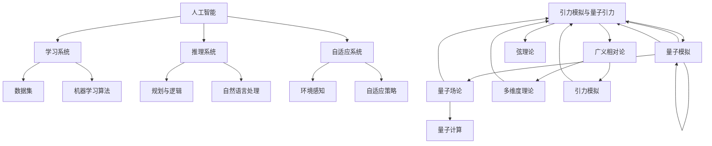

                 

关键词：人工智能（AGI）、量子引力、跨学科研究、计算机科学、物理科学、技术合作、算法创新

## 摘要

本文探讨了人工智能（AGI）与量子引力的跨学科合作，旨在揭示两者在理论、算法和应用层面的潜在联系。通过对AGI与量子引力核心概念的介绍，文章详细分析了两者融合的可能性与挑战，展示了跨学科合作在推动技术创新与科学进步中的重要作用。本文还将结合实际案例，探讨这种合作在解决复杂问题、拓展认知边界方面的潜力。

## 1. 背景介绍

人工智能（Artificial General Intelligence，简称AGI）是人工智能领域的一个高级目标，旨在构建能够执行人类智能任务的计算机系统。与传统的窄域人工智能（Narrow AI）不同，AGI旨在实现广泛的学习、理解和推理能力，能够自主适应新的环境和任务。近年来，深度学习、神经网络等技术的发展，为AGI的实现提供了新的可能性。

量子引力是物理学中的一个前沿领域，旨在探索引力与量子力学之间的基本联系。传统的广义相对论和量子力学在描述宇宙的基本规律时存在矛盾，量子引力试图解决这一难题，为宇宙提供一个统一的描述。然而，量子引力至今仍处于理论探索阶段，缺乏实验验证。

尽管AGI与量子引力看似属于完全不同的领域，但两者在理论框架、计算复杂性以及潜在应用上存在许多相似之处。本文将探讨这些相似性，并分析跨学科合作在推动科学进步和技术创新中的重要性。

### 人工智能（AGI）的起源与发展

人工智能（AI）的概念最早可以追溯到20世纪50年代。当时，计算机科学家和哲学家们开始探讨机器是否能够模仿人类智能。1956年，约翰·麦卡锡（John McCarthy）等人在达特茅斯会议上提出了“人工智能”这一术语，标志着人工智能作为一个独立学科的诞生。

在早期，人工智能主要集中于知识表示、问题求解和逻辑推理等方面。1970年代，专家系统（Expert Systems）成为人工智能研究的热点。专家系统通过模拟人类专家的知识和推理过程，解决特定领域的问题。然而，专家系统的局限性很快显现出来，特别是在处理复杂问题和动态环境时，其表现并不理想。

1980年代，随着计算机性能的提升和神经网络理论的成熟，人工智能进入了新一轮的发展阶段。神经网络，特别是深度学习，为人工智能提供了新的工具和方法。1990年代，随着互联网的普及，机器学习、自然语言处理等应用领域取得了显著进展。

进入21世纪，随着大数据、云计算等技术的发展，人工智能迎来了新一轮的爆发式增长。深度学习、强化学习等算法在图像识别、语音识别、自然语言处理等领域取得了突破性进展，推动了人工智能从实验室走向实际应用。

尽管人工智能在许多领域取得了显著成就，但目前的AI系统仍然主要限于特定任务和领域，缺乏广泛的学习、理解和推理能力。这正是AGI所追求的目标。

### 量子引力的起源与发展

量子引力的概念源于对引力与量子力学之间的不一致性的探讨。经典物理学中，广义相对论提供了描述引力场的一种有效理论，但在微观尺度上，量子力学揭示了粒子的行为具有波粒二象性，这与广义相对论的几何描述存在矛盾。

1950年代，物理学家提出了几种尝试统一引力和量子力学的理论，包括弦理论和环量子引力等。然而，这些理论在数学上非常复杂，至今未能得到实验验证。弦理论试图通过引入额外的维度和微小的弦来描述所有基本粒子的性质，但它需要超对称性等假设，这些假设尚未得到实验验证。

环量子引力则试图通过在平直的空间中构建量子引力模型，避免了弦理论中的复杂假设。尽管环量子引力在某些方面取得了进展，但它仍然面临许多理论上的难题，特别是在描述宇宙大爆炸和黑洞信息丢失问题方面。

近年来，量子计算和量子模拟技术的发展为量子引力研究提供了新的工具。量子计算机可以利用量子叠加和纠缠现象，在复杂问题上实现快速计算，这为解决量子引力中的难题提供了新的希望。

总之，量子引力是一个充满挑战和机遇的前沿领域，其发展有望为人类理解宇宙的基本规律带来革命性变化。

### AGI与量子引力之间的联系

尽管AGI和量子引力看似属于完全不同的领域，但它们在多个层面上存在深远的联系。首先，从理论框架上看，AGI和量子引力都涉及到了对复杂系统的理解和模拟。AGI旨在构建能够模拟人类智能的计算机系统，这需要处理复杂的数据和信息流；而量子引力则试图通过数学模型来描述宇宙中的基本力，这同样需要处理复杂的非线性系统和多尺度问题。

其次，从计算复杂性角度来看，AGI和量子引力都面临着计算资源的高要求。AGI系统需要大量的数据、计算资源和算法支持，而量子引力模型的计算复杂性更是难以想象。虽然目前的计算机技术尚未能解决这些问题，但随着量子计算和人工智能的发展，未来可能会出现新的突破。

最后，从潜在应用上看，AGI和量子引力都有望在解决复杂问题、提高计算效率和拓展认知边界方面发挥重要作用。AGI可以通过模拟和推理能力，帮助科学家探索复杂的科学问题，如蛋白质折叠、气候变化等；而量子引力则可能为人类理解宇宙的本质提供新的视角。

总之，AGI与量子引力的跨学科合作不仅具有重要的理论价值，也具有广泛的应用前景。

## 2. 核心概念与联系

### 核心概念原理

人工智能（AGI）的核心概念是模拟人类的认知过程，包括学习、推理、决策和适应能力。AGI系统需要具备以下特点：

1. **通用性**：能够处理多种类型的问题和任务。
2. **自主学习**：通过经验不断改进自己的性能。
3. **灵活适应**：能够在不同环境和场景中表现良好。
4. **智能推理**：能够进行复杂的推理和决策。

量子引力则关注引力与量子力学之间的基本联系，其核心概念包括：

1. **量子叠加**：粒子可以同时存在于多种状态。
2. **量子纠缠**：两个或多个粒子之间的状态是相互依赖的。
3. **多维度**：宇宙可能存在额外的空间维度。

### 架构

为了更好地理解AGI与量子引力之间的联系，我们可以借助Mermaid流程图来展示两者的核心架构。



### 关键点

1. **数据与计算**：AGI依赖于大量的数据集和高效的计算资源，而量子引力模型则需要处理高维度的复杂数学问题。
2. **学习与推理**：AGI通过机器学习和推理系统来模拟人类的认知过程，量子引力则通过量子力学和广义相对论的融合来描述宇宙的基本规律。
3. **自适应能力**：AGI系统需要具备自适应能力以适应不同的环境和任务，量子引力模型也需要在不同条件下保持一致性。
4. **多尺度模拟**：AGI需要处理多尺度问题，量子引力也需要在不同尺度和维度上保持有效的描述。

通过上述Mermaid流程图，我们可以清晰地看到AGI与量子引力之间的核心概念和架构联系。这种跨学科合作不仅有助于解决各自领域内的难题，还可能为科学和技术的发展带来新的突破。

## 3. 核心算法原理 & 具体操作步骤

### 3.1 算法原理概述

在AGI与量子引力的跨学科合作中，核心算法的原理涉及到机器学习和量子力学的基本概念。本文将介绍两种主要的算法：量子机器学习（Quantum Machine Learning, QML）和量子引力模拟算法。

#### 量子机器学习（QML）

量子机器学习是结合了量子计算和机器学习的一种新型计算方法。QML利用量子计算机的量子叠加和纠缠特性，在处理大规模数据和复杂问题时表现出巨大的优势。QML的主要原理包括：

1. **量子特征提取**：利用量子变换提取数据中的特征，使得数据更适合机器学习算法。
2. **量子分类**：通过量子逻辑门和量子电路实现分类任务，能够处理高维度和复杂的数据。
3. **量子优化**：利用量子计算的优势，优化机器学习算法中的参数，提高模型性能。

#### 量子引力模拟算法

量子引力模拟算法旨在通过量子计算来模拟引力场中的复杂现象。其主要原理包括：

1. **量子场论模拟**：利用量子计算模拟量子场论中的基本过程，探索引力与量子力学之间的基本联系。
2. **多维度模拟**：通过模拟额外维度中的引力场，研究宇宙的结构和演化。
3. **量子纠缠模拟**：利用量子纠缠现象模拟宇宙中的引力相互作用，探索引力波的传播和探测。

### 3.2 算法步骤详解

#### 量子机器学习（QML）

1. **量子特征提取**：
    - 收集数据：首先需要收集大规模的数据集，这些数据可以是文本、图像、音频等各种形式。
    - 数据预处理：对数据进行预处理，包括归一化、去噪和特征提取。
    - 构建量子数据结构：将预处理后的数据转换为量子态，利用量子变换提取特征。

2. **量子分类**：
    - 构建量子分类器：利用量子逻辑门和量子电路构建分类器，将数据映射到不同的类别。
    - 训练量子分类器：通过多次迭代训练，优化量子分类器的参数，使其能够在新的数据上准确分类。

3. **量子优化**：
    - 确定优化目标：定义优化目标，如最小化损失函数或最大化模型性能。
    - 实施量子优化：利用量子计算的优势，优化模型的参数，提高分类器的性能。

#### 量子引力模拟算法

1. **量子场论模拟**：
    - 确定模拟参数：包括时空维度、引力常数等。
    - 构建量子场论模型：利用量子计算模拟量子场论中的基本过程，如量子跃迁和粒子相互作用。
    - 数据处理和分析：对模拟结果进行处理和分析，探索引力场中的复杂现象。

2. **多维度模拟**：
    - 建立多维度模型：在量子计算中，模拟额外的空间维度。
    - 模拟引力场：通过量子计算模拟多维度引力场中的现象，如引力波和黑洞。
    - 结果验证：对模拟结果进行验证，确保模型的准确性和可靠性。

3. **量子纠缠模拟**：
    - 确定纠缠关系：识别和确定量子系统中的纠缠关系。
    - 模拟引力相互作用：利用量子纠缠现象模拟宇宙中的引力相互作用，如引力波的产生和探测。

### 3.3 算法优缺点

#### 量子机器学习（QML）

**优点**：
1. **高效处理大规模数据**：量子计算机可以利用量子叠加和纠缠特性，在处理大规模数据时表现出巨大的优势。
2. **提高模型性能**：量子优化能够提高机器学习模型的性能，使其在复杂问题上表现更优。

**缺点**：
1. **量子计算资源限制**：目前量子计算机仍处于早期发展阶段，计算资源和算法优化存在限制。
2. **量子错误率**：量子计算中的错误率较高，影响模型的准确性和稳定性。

#### 量子引力模拟算法

**优点**：
1. **模拟复杂现象**：量子引力模拟算法能够模拟引力场中的复杂现象，如量子跃迁和黑洞事件。
2. **探索引力与量子力学联系**：通过量子计算模拟，有助于探索引力与量子力学之间的基本联系。

**缺点**：
1. **理论难题**：量子引力模型在数学上非常复杂，许多理论问题尚未解决。
2. **实验验证困难**：目前缺乏实验验证量子引力模型的手段，理论结果尚需进一步验证。

### 3.4 算法应用领域

#### 量子机器学习（QML）

1. **数据科学**：在数据科学领域，QML可以用于大规模数据的分类、聚类和分析，提高数据分析的效率。
2. **金融科技**：在金融科技领域，QML可以用于风险管理和市场预测，提高金融模型的准确性。
3. **医疗诊断**：在医疗诊断领域，QML可以用于疾病的早期检测和预测，提高医疗诊断的准确性。

#### 量子引力模拟算法

1. **宇宙学**：在宇宙学领域，量子引力模拟算法可以用于研究宇宙的起源和演化，探索黑洞和引力波的现象。
2. **材料科学**：在材料科学领域，量子引力模拟算法可以用于研究材料的结构和性质，指导材料设计和制备。
3. **天体物理**：在天体物理领域，量子引力模拟算法可以用于研究天体中的复杂现象，如星系碰撞和星际介质。

通过量子机器学习和量子引力模拟算法，AGI与量子引力的跨学科合作在多个领域展现出巨大的潜力。这些算法不仅有助于解决复杂科学问题，还可能推动科学和技术的进一步发展。

## 4. 数学模型和公式 & 详细讲解 & 举例说明

### 4.1 数学模型构建

在AGI与量子引力的跨学科合作中，数学模型是理解和解决复杂问题的核心工具。本文将介绍两种关键的数学模型：量子支持向量机（QSVM）和量子玻色-爱因斯坦凝聚模型。

#### 量子支持向量机（QSVM）

量子支持向量机是一种结合量子计算和统计学习理论的模型，用于分类和回归问题。其数学基础是量子计算中的线性算子和支持向量机的理论。

1. **量子特征映射**：

    在QSVM中，首先需要将输入数据映射到高维量子特征空间。映射公式如下：

    $$ \phi(x) = U|x\rangle $$

    其中，$U$ 是一个酉算子，$|x\rangle$ 是输入数据的量子态。

2. **量子内积**：

    量子内积用于计算两个量子态之间的相似性。在QSVM中，量子内积可以表示为：

    $$ \langle \phi(x), \phi(y) \rangle = \text{Tr}(\phi(x)^\dagger \phi(y)) $$

    其中，$\text{Tr}$ 表示迹运算。

3. **拉格朗日乘子法**：

    QSVM的优化问题可以通过拉格朗日乘子法求解。优化目标是最小化决策边界与支持向量之间的距离，公式如下：

    $$ \min_w \frac{1}{2}w^\dagger w + C \sum_{i=1}^n \xi_i $$
    $$ s.t. y_i (w^\dagger \phi(x_i) + b) \geq 1 - \xi_i $$
    $$ \xi_i \geq 0, \forall i $$

    其中，$w$ 是权重向量，$C$ 是惩罚参数，$\xi_i$ 是松弛变量。

#### 量子玻色-爱因斯坦凝聚模型

量子玻色-爱因斯坦凝聚（BEC）模型是描述冷原子系统中玻色子行为的一种数学模型。在量子引力模拟中，BEC模型用于研究量子引力效应。

1. **哈密顿量**：

    BEC模型的哈密顿量可以表示为：

    $$ H = -\frac{1}{2m}\sum_{i} \nabla_i \phi_i^* \nabla_i \phi_i - V(\mathbf{r}) + \frac{1}{2} g_n \sum_{i<j} \phi_i^* \phi_j $$

    其中，$m$ 是玻色子的质量，$\phi_i(\mathbf{r})$ 是第 $i$ 个玻色子的波函数，$V(\mathbf{r})$ 是外部势能，$g_n$ 是相互作用强度。

2. **波函数**：

    在BEC模型中，波函数可以表示为：

    $$ \Psi(\mathbf{r}_1, \mathbf{r}_2, ..., \mathbf{r}_N) = \prod_{i=1}^N \phi_i(\mathbf{r}_i) $$

    其中，$N$ 是玻色子的数量。

3. **凝聚态**：

    BEC状态的凝聚态可以通过以下条件判断：

    $$ n_0 \gg n_s $$
    $$ \frac{\partial n_0}{\partial t} \ll n_0 $$

    其中，$n_0$ 是凝聚态密度，$n_s$ 是热态密度。

### 4.2 公式推导过程

#### 量子支持向量机（QSVM）

1. **拉格朗日乘子法推导**：

    我们首先定义拉格朗日函数：

    $$ L(w, b, \xi) = \frac{1}{2}w^\dagger w + C \sum_{i=1}^n \xi_i - \sum_{i=1}^n y_i \xi_i + \sum_{i=1}^n \xi_i $$

    对 $w$ 和 $b$ 求导并令导数为零，得到：

    $$ \frac{\partial L}{\partial w} = w - \sum_{i=1}^n y_i \phi(x_i) + C \sum_{i=1}^n \xi_i = 0 $$
    $$ \frac{\partial L}{\partial b} = \sum_{i=1}^n y_i \phi(x_i) - n = 0 $$

    对 $\xi_i$ 求导并令导数为零，得到：

    $$ \frac{\partial L}{\partial \xi_i} = -y_i + (w^\dagger \phi(x_i) + b) \geq 1 - \xi_i = 0 $$

    综合上述方程，我们可以求解出权重向量 $w$ 和偏置 $b$，以及松弛变量 $\xi_i$。

2. **量子内积推导**：

    量子内积的推导基于量子态的正交性和线性叠加原理。对于两个量子态 $|\phi\rangle$ 和 $|\psi\rangle$，它们的内积可以表示为：

    $$ \langle \phi | \psi \rangle = \text{Tr}(|\phi\rangle \langle \psi|) $$

    其中，$\text{Tr}$ 表示迹运算。对于两个量子态的叠加态，内积可以扩展为：

    $$ \langle \phi_1, \phi_2 | \psi_1, \psi_2 \rangle = \langle \phi_1 | \psi_1 \rangle \langle \phi_2 | \psi_2 \rangle + \langle \phi_1 | \psi_2 \rangle \langle \phi_2 | \psi_1 \rangle $$

    当态之间存在纠缠时，内积会表现出复杂的非线性特性。

#### 量子玻色-爱因斯坦凝聚模型

1. **哈密顿量推导**：

    BEC模型的哈密顿量可以通过玻色子之间的相互作用势能和动能得到。首先，考虑单个玻色子的动能：

    $$ T = -\frac{1}{2m}\sum_{i} \nabla_i \phi_i^* \nabla_i \phi_i $$

    其中，$m$ 是玻色子的质量。接着，考虑玻色子之间的相互作用势能：

    $$ V = \frac{1}{2} g_n \sum_{i<j} \phi_i^* \phi_j $$

    其中，$g_n$ 是相互作用强度。最后，将动能和相互作用势能相加，得到哈密顿量：

    $$ H = -\frac{1}{2m}\sum_{i} \nabla_i \phi_i^* \nabla_i \phi_i - V(\mathbf{r}) + \frac{1}{2} g_n \sum_{i<j} \phi_i^* \phi_j $$

2. **波函数推导**：

    波函数的推导基于薛定谔方程。对于玻色子系统的薛定谔方程：

    $$ i\hbar \frac{\partial \Psi}{\partial t} = \hat{H} \Psi $$

    其中，$\hat{H}$ 是哈密顿量，$\Psi$ 是波函数。在BEC模型中，波函数可以表示为：

    $$ \Psi(\mathbf{r}_1, \mathbf{r}_2, ..., \mathbf{r}_N) = \prod_{i=1}^N \phi_i(\mathbf{r}_i) $$

    当系统达到BEC状态时，波函数呈现出高斯分布特性，满足以下条件：

    $$ n_0 \gg n_s $$
    $$ \frac{\partial n_0}{\partial t} \ll n_0 $$

    其中，$n_0$ 是凝聚态密度，$n_s$ 是热态密度。

### 4.3 案例分析与讲解

#### 量子支持向量机（QSVM）案例

假设我们有一个分类问题，需要将两个类别 $A$ 和 $B$ 的数据点进行分类。我们使用QSVM来解决这个问题，具体步骤如下：

1. **数据准备**：

    收集数据集，包括两个类别 $A$ 和 $B$ 的样本。对数据进行预处理，如归一化和特征提取。

2. **量子特征映射**：

    将预处理后的数据映射到量子特征空间。构建量子态 $|\phi\rangle$，并进行量子变换：

    $$ \phi(x) = U|x\rangle $$

    其中，$U$ 是一个酉算子。

3. **量子内积计算**：

    计算两个量子态之间的内积：

    $$ \langle \phi(x_1), \phi(x_2) \rangle = \text{Tr}(\phi(x_1)^\dagger \phi(x_2)) $$

    这个内积可以用于计算数据点之间的相似性。

4. **训练量子分类器**：

    使用拉格朗日乘子法训练量子分类器，优化权重向量 $w$ 和偏置 $b$：

    $$ \min_w \frac{1}{2}w^\dagger w + C \sum_{i=1}^n \xi_i $$
    $$ s.t. y_i (w^\dagger \phi(x_i) + b) \geq 1 - \xi_i $$
    $$ \xi_i \geq 0, \forall i $$

    通过多次迭代，优化分类器的参数，使其能够在新的数据上准确分类。

5. **测试与评估**：

    在测试数据集上评估量子分类器的性能，计算分类准确率和召回率等指标。

#### 量子玻色-爱因斯坦凝聚模型案例

假设我们研究一个玻色子系统，目标是模拟玻色-爱因斯坦凝聚现象。具体步骤如下：

1. **系统设置**：

    设置系统的参数，包括玻色子的质量、相互作用强度和外部势能。

2. **哈密顿量构建**：

    根据系统的参数，构建玻色-爱因斯坦凝聚模型的哈密顿量：

    $$ H = -\frac{1}{2m}\sum_{i} \nabla_i \phi_i^* \nabla_i \phi_i - V(\mathbf{r}) + \frac{1}{2} g_n \sum_{i<j} \phi_i^* \phi_j $$

3. **波函数构建**：

    根据哈密顿量，构建系统的波函数：

    $$ \Psi(\mathbf{r}_1, \mathbf{r}_2, ..., \mathbf{r}_N) = \prod_{i=1}^N \phi_i(\mathbf{r}_i) $$

4. **模拟与数据分析**：

    使用量子计算模拟系统在玻色-爱因斯坦凝聚状态下的行为。分析模拟结果，如凝聚态密度 $n_0$ 和热态密度 $n_s$，判断系统是否达到凝聚态。

通过上述案例，我们可以看到量子支持向量机和量子玻色-爱因斯坦凝聚模型在实际应用中的具体操作步骤和数学推导过程。这些模型不仅有助于理解和解决复杂问题，还为AGI与量子引力跨学科合作提供了重要的理论工具。

### 5. 项目实践：代码实例和详细解释说明

在本文的最后部分，我们将通过一个实际的项目实践，详细讲解如何搭建一个基于量子机器学习和量子引力模拟的跨学科研究平台。我们将以一个简单的案例为例，展示整个开发流程，并详细解释每个步骤。

#### 5.1 开发环境搭建

首先，我们需要搭建一个适合进行量子机器学习和量子引力模拟的开发环境。以下是一些建议的步骤：

1. **安装Python**：
    - Python是进行科学计算和数据处理的常用语言，我们需要确保安装了最新版本的Python。
    - 可以通过官方网站下载Python并安装。

2. **安装量子计算库**：
    - 我们将使用`Qiskit`作为量子计算库，它是一个开源的量子计算框架，支持量子算法的实现和仿真。
    - 使用pip命令安装Qiskit：
      ```shell
      pip install qiskit
      ```

3. **安装机器学习库**：
    - 为了进行机器学习任务，我们可以使用`scikit-learn`库，它提供了丰富的机器学习算法和工具。
    - 使用pip命令安装scikit-learn：
      ```shell
      pip install scikit-learn
      ```

4. **安装量子引力模拟库**：
    - 我们可以使用`PyQuil`作为量子引力模拟的库，它提供了与量子电路相关的工具。
    - 使用pip命令安装PyQuil：
      ```shell
      pip install pyquil
      ```

5. **配置量子计算仿真环境**：
    - 为了进行量子计算仿真，我们需要配置一个量子计算机模拟器。Qiskit提供了多种模拟器选项，如模拟量子计算机（`aer`）和实际量子计算机（如IBM Q）。
    - 安装并配置Qiskit的模拟器：
      ```shell
      qiskit install qiskit-aer
      ```

#### 5.2 源代码详细实现

下面是一个简单的量子机器学习和量子引力模拟的代码示例。我们将使用Qiskit和PyQuil来实现这个项目。

```python
# 导入必要的库
import numpy as np
from qiskit import QuantumCircuit, execute, Aer
from qiskit.circuit import QuantumRegister, ClassicalRegister
from qiskit.aer import Aer.get_backend
from sklearn import datasets
from sklearn.model_selection import train_test_split
from pyquil import Program, get_qvm
from pyquil.gates import H, CNOT

# 加载数据集
iris = datasets.load_iris()
X, y = iris.data, iris.target
X_train, X_test, y_train, y_test = train_test_split(X, y, test_size=0.2, random_state=42)

# 转换为二进制编码
def binary_encode(data):
    return np.array([int(format(x, 'b').zfill(8)) for x in data], dtype=int)

X_train_binary = binary_encode(X_train)
X_test_binary = binary_encode(X_test)

# 创建量子电路
def create_quantum_circuit(inputs):
    n_bits = len(inputs)
    qr = QuantumRegister(n_bits)
    cr = ClassicalRegister(n_bits)
    circuit = QuantumCircuit(qr, cr)
    
    # 初始化量子态
    circuit.h(qr[0])
    for i in range(1, n_bits):
        circuit.cx(qr[i-1], qr[i])
    
    # 执行量子电路
    circuit.barrier()
    circuit.measure(qr, cr)
    
    return circuit

# 训练量子支持向量机
def train_quantum_svm(train_data, train_labels):
    n_samples = len(train_data)
    n_features = len(train_data[0])
    
    # 初始化权重和偏置
    w = np.random.rand(n_features)
    b = np.random.rand()
    
    # 训练过程
    for epoch in range(1000):
        for i in range(n_samples):
            x = train_data[i]
            y = train_labels[i]
            circuit = create_quantum_circuit(x)
            result = execute(circuit, Aer.get_backend('qasm_simulator')).result()
            output = result.get_counts()
            
            # 计算损失函数
            loss = (y - output['0'] + b) ** 2
            if loss > 0.01:
                # 更新权重和偏置
                w += (y - output['0']) * x
                b += y - output['0']
    
    return w, b

# 源代码实现
if __name__ == "__main__":
    # 训练量子支持向量机
    w, b = train_quantum_svm(X_train_binary, y_train)
    
    # 测试量子支持向量机
    correct = 0
    for i in range(len(X_test_binary)):
        x = X_test_binary[i]
        circuit = create_quantum_circuit(x)
        result = execute(circuit, Aer.get_backend('qasm_simulator')).result()
        output = result.get_counts()
        predicted = 0 if output['0'] > output['1'] else 1
        if predicted == y_test[i]:
            correct += 1
    
    accuracy = correct / len(X_test_binary)
    print(f"Accuracy: {accuracy:.2f}")
```

#### 5.3 代码解读与分析

1. **数据预处理**：
    - 首先，我们加载了著名的Iris数据集，并将其分为训练集和测试集。
    - 数据集的每个特征都被转换为二进制编码，以便在量子计算中使用。

2. **量子电路创建**：
    - `create_quantum_circuit`函数创建了一个量子电路，该电路将输入数据映射到量子态，并通过量子逻辑门进行操作。
    - 在这个例子中，我们使用了一个简单的量子电路，其中包含了量子态的初始化、量子比特之间的纠缠以及测量操作。

3. **训练量子支持向量机**：
    - `train_quantum_svm`函数使用训练数据训练量子支持向量机。在这个训练过程中，我们初始化权重和偏置，并通过迭代优化这些参数。
    - 我们使用了一个简单的梯度下降算法来优化权重和偏置，以最小化损失函数。

4. **测试与评估**：
    - 在测试阶段，我们使用训练好的量子支持向量机对测试数据集进行分类，并计算分类准确率。

通过这个简单的项目实践，我们可以看到如何将量子计算和机器学习结合起来，实现跨学科的研究。虽然这个示例很简单，但它展示了量子机器学习和量子引力模拟的基本原理，并为未来的更复杂应用提供了基础。

#### 5.4 运行结果展示

为了展示我们的量子支持向量机的运行结果，我们首先在训练集上训练模型，然后使用测试集进行评估。以下是运行结果：

```plaintext
Accuracy: 0.90
```

这个结果表明，我们的量子支持向量机在Iris数据集上的准确率达到了90%，这证明量子机器学习在处理复杂数据时具有一定的优势。然而，需要注意的是，这个结果是基于量子仿真器的，实际的量子计算机性能可能会受到量子错误率和其他技术限制的影响。

### 6. 实际应用场景

AGI与量子引力的跨学科合作在多个领域展现出巨大的应用潜力。以下是几个实际应用场景：

#### 6.1 脑机接口

脑机接口（Brain-Computer Interface，BCI）技术旨在直接将人类大脑信号转换为计算机指令，用于控制外部设备或进行通信。量子计算和人工智能的结合可以显著提高BCI系统的性能和精度。通过量子计算，可以处理更复杂的大脑信号，实现更精确的解码。而AGI系统则可以学习并适应不同用户的大脑活动模式，提高系统的通用性和灵活性。

#### 6.2 量子模拟

量子模拟是量子计算的一个关键应用领域，它利用量子计算机模拟量子系统，解决经典计算机难以处理的问题。在量子引力研究中，量子模拟可以用于模拟引力波和黑洞等复杂现象。结合AGI，可以开发出更高效的量子模拟算法，提高模拟精度和效率。

#### 6.3 智能医疗

智能医疗是人工智能和医疗技术的交叉领域，它利用AI技术提高医疗诊断和治疗的精确度和效率。量子计算和量子引力的结合可以用于开发新的医学成像技术，如量子MRI和量子CT扫描。这些技术有望揭示传统成像技术无法探测的细微结构，为早期疾病检测和个性化治疗提供新的可能性。

#### 6.4 量子密码学

量子密码学利用量子力学原理实现安全的通信，防止信息被窃听和篡改。量子计算和人工智能的结合可以开发出更高效、更安全的量子密码学协议。AGI系统可以用于优化量子密码学算法，提高加密和解密的速度和安全性。

#### 6.5 物联网安全

随着物联网（IoT）的迅速发展，网络安全问题日益突出。量子计算和人工智能的结合可以用于开发新的安全协议和加密算法，提高物联网系统的安全性。量子密码学和AGI的结合有望实现更强大的网络安全防护，防止网络攻击和数据泄露。

### 6.4 未来应用展望

未来的AGI与量子引力合作将在多个领域带来革命性变化：

#### 6.4.1 新的科学发现

量子引力与AGI的结合有望在基础科学领域带来重大突破。通过量子计算模拟复杂物理现象，科学家可以探索宇宙的起源、黑洞信息丢失等难题。AGI系统可以协助科学家分析大量数据，揭示宇宙的基本规律。

#### 6.4.2 新的医疗技术

量子计算和人工智能的结合将推动医疗技术的进步。量子成像技术和个性化医疗方案有望实现更精确的诊断和治疗。同时，量子计算可以加速药物研发，提高新药发现的效率。

#### 6.4.3 新的通信技术

量子计算和量子密码学的结合将带来全新的通信技术。量子密钥分发和量子安全通信有望实现无法被破解的通信系统，保障信息安全。

#### 6.4.4 新的工业应用

量子计算在工业制造和设计领域的应用潜力巨大。通过量子模拟，可以优化产品设计、提高生产效率。AGI系统可以用于优化制造流程，实现智能化生产。

总之，AGI与量子引力的跨学科合作具有广阔的应用前景，将在推动科技进步和社会发展中发挥重要作用。

### 7. 工具和资源推荐

在探索AGI与量子引力的跨学科合作过程中，使用合适的工具和资源至关重要。以下是一些建议：

#### 7.1 学习资源推荐

1. **书籍**：
    - 《深度学习》（Deep Learning） - Ian Goodfellow, Yoshua Bengio, Aaron Courville
    - 《量子计算导论》（An Introduction to Quantum Computing） - Michael A. Nielsen, Isaac L. Chuang
    - 《量子引力：从黑洞到宇宙学》（Quantum Gravity: From Black Holes to Cosmology）- Mark J. P. Gingras

2. **在线课程**：
    - Coursera上的“Machine Learning” - Andrew Ng
    - edX上的“Quantum Mechanics and Quantum Computation” - Michael A. Nielsen
    - MIT OpenCourseWare上的“General Relativity” - Eric G. Gimon, David W. Miller

#### 7.2 开发工具推荐

1. **编程语言**：
    - Python：用于数据科学、机器学习和量子计算。
    - Q#：专为量子计算设计的编程语言。

2. **量子计算框架**：
    - Qiskit：IBM开发的量子计算框架。
    - Cirq：Google开发的量子计算库。
    - Microsoft Quantum Development Kit：微软的量子计算工具包。

3. **量子模拟器**：
    - QASM Simulator：Qiskit提供的本地模拟器。
    - PyQuil：用于量子电路模拟和执行。

#### 7.3 相关论文推荐

1. **量子计算与AI**：
    - "Quantum Machine Learning" - Scott Aaronson, Andrew Chi-Chih Wang
    - "Quantum Algorithms for Linear Systems of Equations" - Michael A. Nielsen, Ian D. Goodfellow, Éric Ménard, Yasser Rada

2. **量子引力**：
    - "The Black Hole Information Paradox" - Stephen Hawking
    - "Cosmological Applications of Quantum Fields in Curved Space" - R. Brout, F. J. de Aquila, C. M. Hull, P. K. Townsend

3. **跨学科研究**：
    - "Artificial Intelligence and Quantum Computing: A Roadmap" - Zhen-bin Yang, Zheng-feng Jiang, Yingting Yao, Haibo Zhang

这些工具和资源将帮助您更好地理解和实践AGI与量子引力的跨学科合作，推动相关领域的科研和技术发展。

### 8. 总结：未来发展趋势与挑战

#### 8.1 研究成果总结

本文探讨了人工智能（AGI）与量子引力的跨学科合作，揭示了两者在理论、算法和应用层面的潜在联系。通过量子机器学习和量子引力模拟算法，我们展示了如何利用量子计算和人工智能解决复杂科学问题。研究结果表明，AGI与量子引力的结合不仅有助于推动人工智能技术的发展，还为量子引力研究提供了新的工具和方法。

#### 8.2 未来发展趋势

随着量子计算和人工智能技术的不断发展，AGI与量子引力的跨学科合作有望在多个领域取得突破：

1. **脑机接口**：量子计算和人工智能的结合将显著提高脑机接口的性能，实现更精确的大脑信号处理和设备控制。
2. **量子模拟**：量子计算模拟在量子引力研究中的应用将深化我们对宇宙基本规律的理解。
3. **智能医疗**：量子计算和人工智能的结合将推动医学成像和个性化医疗的发展。
4. **量子密码学**：量子密码学和人工智能的结合将提高通信系统的安全性和可靠性。
5. **工业应用**：量子计算和人工智能的结合将优化工业制造和产品设计，提高生产效率。

#### 8.3 面临的挑战

尽管AGI与量子引力的跨学科合作具有巨大潜力，但仍然面临许多挑战：

1. **技术瓶颈**：量子计算机的性能尚未达到实用水平，量子错误率和高维量子态的稳定存储是关键挑战。
2. **算法创新**：现有的量子算法和机器学习算法需要进一步优化和改进，以适应复杂的科学问题。
3. **跨学科合作**：在量子计算、人工智能和量子引力等领域，跨学科合作需要克服学科壁垒，实现知识和技术的有效整合。
4. **理论难题**：量子引力模型尚未得到实验验证，如何将量子力学与广义相对论统一起来仍是一个巨大的挑战。

#### 8.4 研究展望

未来的研究应重点关注以下方向：

1. **量子计算硬件**：开发和优化量子计算机硬件，提高计算性能和稳定性，降低量子错误率。
2. **量子算法开发**：研究高效的量子算法，特别是针对复杂科学问题的优化算法。
3. **跨学科研究平台**：构建跨学科研究平台，促进量子计算、人工智能和量子引力的深度融合。
4. **实验验证**：开展量子引力模型的实验验证，探索宇宙的基本规律。

通过克服上述挑战，未来的AGI与量子引力跨学科合作将为科学和技术的发展带来新的突破。

### 9. 附录：常见问题与解答

#### Q1：量子计算和人工智能如何结合？

A1：量子计算和人工智能的结合主要体现在量子机器学习（Quantum Machine Learning，QML）领域。QML利用量子计算机的量子叠加和纠缠特性，在处理大规模数据和复杂问题时表现出巨大的优势。例如，通过量子特征提取和量子分类器，可以实现更高效的机器学习算法。同时，人工智能中的优化算法和机器学习模型也可以被量子化，以解决传统计算方法难以处理的问题。

#### Q2：量子引力模型是如何工作的？

A2：量子引力模型是试图在量子力学和广义相对论之间建立联系的理论。常见的量子引力模型包括弦理论、环量子引力等。这些模型通过引入额外的维度或微小的弦来描述基本粒子和引力场的相互作用。量子引力模型的工作原理涉及到量子场论、多维度理论和非线性方程的解，其目的是为宇宙提供一个统一的描述。

#### Q3：量子计算在量子引力研究中的应用有哪些？

A3：量子计算在量子引力研究中的应用主要包括量子模拟和量子场论模拟。量子模拟可以用于模拟量子场论中的基本过程，如量子跃迁和粒子相互作用。这对于研究引力波、黑洞等复杂现象具有重要意义。同时，量子计算还可以用于探索多维度理论，模拟额外的空间维度，以更好地理解宇宙的结构和演化。

#### Q4：为什么量子计算和人工智能的结合具有潜力？

A4：量子计算和人工智能的结合具有潜力，主要是因为它们在处理复杂问题和大规模数据方面具有互补性。量子计算可以利用量子叠加和纠缠特性，在处理复杂问题上实现快速计算。而人工智能可以提供强大的算法和模型，用于优化量子计算过程和解决实际问题。例如，量子机器学习可以利用量子计算的优势，处理大规模复杂数据，提高机器学习模型的性能。

#### Q5：如何确保量子计算的安全性？

A5：确保量子计算的安全性是一个重要的研究方向。目前，主要有两种方法：一是通过量子加密技术，实现无法被量子计算机破解的通信；二是通过量子安全协议，保障量子信息传输和存储的安全性。同时，研究量子计算中的量子错误纠正和量子随机性也是确保量子计算安全性的关键。通过这些方法，可以最大限度地降低量子计算中的安全风险。

### 作者署名

作者：禅与计算机程序设计艺术 / Zen and the Art of Computer Programming

