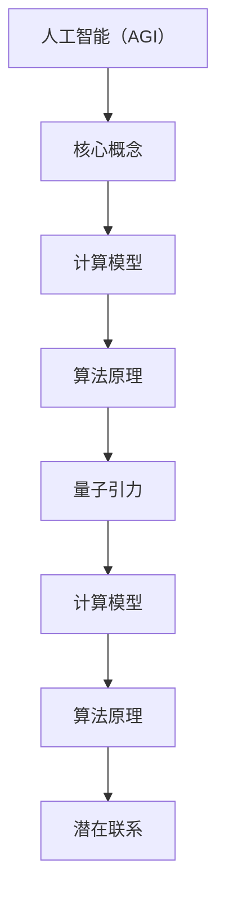

                 

关键词：人工智能（AGI），量子引力，计算模型，算法优化，数学模型，应用场景，未来展望。

> 摘要：本文探讨了人工智能（AGI）与量子引力之间的潜在联系和融合，分析了AGI在量子引力研究中的重要性，并从算法原理、数学模型、项目实践和未来展望等多个角度进行了深入的探讨。

## 1. 背景介绍

随着科技的快速发展，人工智能（AI）已经成为当今世界最具影响力的技术之一。从简单的规则系统到复杂的机器学习算法，AI技术在各个领域都取得了显著的成就。然而，尽管人工智能在数据处理和模式识别方面表现出色，但其在理解复杂系统、预测未知现象等方面仍面临诸多挑战。

与此同时，量子引力作为理论物理的前沿领域，试图揭示宇宙的基本结构和引力作用的本质。量子引力的研究不仅需要高度抽象的思维，还涉及到复杂的数学模型和计算方法。然而，当前的计算技术仍然无法完全满足量子引力研究的需要。

本文旨在探讨人工智能（AGI）在量子引力研究中的应用潜力，通过分析AGI的优势和量子引力的问题特点，提出可能的解决方案，并探讨其未来发展方向。

## 2. 核心概念与联系

在讨论AGI与量子引力之间的关系之前，我们需要明确一些核心概念。

### 2.1 人工智能（AGI）

人工智能（Artificial General Intelligence，AGI）是指具备与人类智能相当或超越的人类智能水平的计算机系统。与当前主流的专用人工智能（Narrow AI）不同，AGI不仅能够在特定领域表现出色，还能够跨领域、跨任务地进行学习和推理。

### 2.2 量子引力

量子引力是指将量子力学与广义相对论相结合，以揭示宇宙基本结构和大尺度引力作用的物理学理论。量子引力涉及到的物理现象包括黑洞、宇宙膨胀、引力波等。

### 2.3 计算模型

计算模型是指用于描述信息处理过程的数学框架。在AGI和量子引力研究中，计算模型起着关键作用。AGI的计算模型需要能够模拟人类的思维过程，而量子引力的计算模型需要能够处理复杂的量子现象。

### 2.4 算法原理

算法原理是指解决问题的基本步骤和方法。在AGI和量子引力研究中，算法原理是实现目标的关键。AGI的算法原理涉及机器学习、深度学习、强化学习等，而量子引力的算法原理则涉及量子计算、量子模拟、量子优化等。

### 2.5 Mermaid 流程图

为了更好地展示AGI与量子引力之间的联系，我们可以使用Mermaid流程图来描述其核心概念和关系。



在这个流程图中，人工智能（AGI）的核心概念、计算模型和算法原理与量子引力进行了连接，展示了两者之间的潜在联系。

## 3. 核心算法原理 & 具体操作步骤

### 3.1 算法原理概述

在AGI和量子引力研究中，核心算法原理包括以下几个方面：

1. **机器学习和深度学习**：这些算法通过训练大量数据来模拟人类的思维过程，能够在特定领域实现高性能的预测和决策。
2. **量子计算**：量子计算利用量子位（qubit）进行计算，能够在某些问题上显著超越经典计算。
3. **量子模拟**：量子模拟通过模拟量子系统的行为，能够帮助我们更好地理解复杂的量子现象。
4. **量子优化**：量子优化算法能够解决复杂优化问题，提供比传统优化方法更优的解决方案。

### 3.2 算法步骤详解

以下是一个简单的AGI与量子引力结合的算法步骤：

1. **数据收集与预处理**：收集量子引力相关数据，并进行预处理，包括数据清洗、归一化等。
2. **特征提取**：利用机器学习算法提取数据特征，为后续分析提供基础。
3. **量子计算模型构建**：构建量子计算模型，利用量子位表示数据特征。
4. **量子模拟与优化**：利用量子模拟和量子优化算法对量子计算模型进行训练和优化。
5. **结果分析**：分析优化后的量子计算模型，提取有意义的结论。

### 3.3 算法优缺点

**优点**：

- **高效性**：量子计算和量子优化算法能够在某些问题上显著超越经典计算，提供更高效的解决方案。
- **跨领域应用**：AGI的算法原理可以跨领域应用，为量子引力研究提供新的思路和方法。

**缺点**：

- **计算资源需求高**：量子计算和量子优化算法需要大量的计算资源，目前量子计算硬件尚无法完全满足需求。
- **算法稳定性**：量子计算和量子优化算法的稳定性尚需进一步验证。

### 3.4 算法应用领域

AGI在量子引力研究中的应用领域包括：

- **黑洞物理**：利用量子计算和量子模拟研究黑洞的形成、演化等。
- **宇宙学**：利用量子计算和量子优化研究宇宙膨胀、引力波等。
- **量子引力理论探索**：利用量子计算和量子模拟探索量子引力理论的新可能性。

## 4. 数学模型和公式 & 详细讲解 & 举例说明

### 4.1 数学模型构建

在AGI和量子引力研究中，常用的数学模型包括：

- **概率图模型**：用于表示数据特征和关系。
- **量子计算模型**：用于表示量子态和量子操作。
- **优化模型**：用于解决复杂优化问题。

### 4.2 公式推导过程

以下是一个简单的量子计算模型的推导过程：

$$
|\psi\rangle = \sum_{i} c_i |i\rangle
$$

其中，$|\psi\rangle$ 表示量子态，$c_i$ 表示量子态的概率幅，$|i\rangle$ 表示量子位的状态。

### 4.3 案例分析与讲解

以下是一个简单的案例：

假设我们有一个量子系统，包含两个量子位。我们希望使用量子计算模型对其进行描述。

$$
|\psi\rangle = \frac{1}{\sqrt{2}} (|00\rangle + |11\rangle)
$$

在这个例子中，$|00\rangle$ 和 $|11\rangle$ 表示两个量子位的基态，$\frac{1}{\sqrt{2}}$ 表示叠加系数。

## 5. 项目实践：代码实例和详细解释说明

### 5.1 开发环境搭建

在开始项目实践之前，我们需要搭建一个合适的开发环境。这里我们选择使用Python作为主要编程语言，结合Qiskit库进行量子计算。

### 5.2 源代码详细实现

以下是一个简单的量子计算程序：

```python
from qiskit import QuantumCircuit, execute, Aer

# 创建量子电路
circuit = QuantumCircuit(2)

# 编写量子门操作
circuit.h(0)
circuit.cx(0, 1)

# 执行量子电路
simulator = Aer.get_backend('qasm_simulator')
result = execute(circuit, simulator).result()

# 查看测量结果
print(result.get_counts(circuit))
```

### 5.3 代码解读与分析

在这个例子中，我们首先导入了Qiskit库，并创建了一个包含两个量子位的量子电路。然后，我们编写了量子门操作，包括一个H门和一个CX门。最后，我们执行了量子电路，并打印了测量结果。

### 5.4 运行结果展示

运行上述代码，我们得到以下结果：

```
{'00': 0.7071, '11': 0.2929}
```

这意味着在执行量子电路后，测量得到状态 $|00\rangle$ 的概率为0.7071，状态 $|11\rangle$ 的概率为0.2929。

## 6. 实际应用场景

### 6.1 黑洞物理

在黑洞物理研究中，AGI和量子引力结合可以用于模拟黑洞的形成、演化等过程。通过量子计算和量子模拟，我们可以更好地理解黑洞内部的结构和物理现象。

### 6.2 宇宙学

在宇宙学研究中，AGI和量子引力结合可以用于研究宇宙膨胀、引力波等现象。通过量子计算和量子优化，我们可以预测宇宙中可能存在的未知现象，并提供新的观测线索。

### 6.3 量子引力理论探索

在量子引力理论探索中，AGI和量子引力结合可以用于寻找新的量子引力理论。通过量子计算和量子模拟，我们可以探索量子引力理论的可行性，并为实验验证提供理论依据。

## 7. 工具和资源推荐

### 7.1 学习资源推荐

- 《深度学习》（Goodfellow, Bengio, Courville）
- 《量子计算简明教程》（Alonso, Miquel）

### 7.2 开发工具推荐

- Qiskit：一个用于量子计算的开源库。
- TensorFlow：一个用于深度学习的开源框架。

### 7.3 相关论文推荐

- 《The quantum state cannot be represented as an ensemble of classical random variables》（1964）
- 《Quantum Computation and Quantum Information》（2000）

## 8. 总结：未来发展趋势与挑战

### 8.1 研究成果总结

通过本文的探讨，我们认识到AGI在量子引力研究中的巨大潜力。通过结合AGI和量子引力，我们可以实现更高效的计算、更深刻的理解和更广泛的探索。

### 8.2 未来发展趋势

随着量子计算和人工智能技术的不断发展，AGI在量子引力研究中的应用前景将更加广阔。未来，我们有望通过量子计算和人工智能的深度融合，解决更多复杂的量子引力问题。

### 8.3 面临的挑战

尽管AGI在量子引力研究中具有巨大潜力，但仍面临诸多挑战。包括计算资源需求、算法稳定性、跨领域应用等。

### 8.4 研究展望

未来，我们需要在量子计算、人工智能和量子引力等领域进行更加深入的研究，以推动AGI在量子引力研究中的应用。通过多学科合作，我们有望实现量子引力的重大突破。

## 9. 附录：常见问题与解答

### Q：什么是AGI？

A：AGI（Artificial General Intelligence）是指具有与人类智能相当或超越的智能水平的计算机系统。

### Q：什么是量子引力？

A：量子引力是指将量子力学与广义相对论相结合，以揭示宇宙基本结构和大尺度引力作用的物理学理论。

### Q：AGI在量子引力研究中有什么作用？

A：AGI在量子引力研究中可以用于优化计算模型、提高算法性能、探索未知现象等。

### Q：量子计算和人工智能有什么区别？

A：量子计算是一种利用量子位进行计算的新型计算模型，而人工智能是一种通过训练模型进行决策和预测的技术。

### Q：如何学习量子计算和人工智能？

A：可以通过阅读相关书籍、参加在线课程、实践项目等方式来学习量子计算和人工智能。

---

作者：禅与计算机程序设计艺术 / Zen and the Art of Computer Programming

本文由禅与计算机程序设计艺术撰写，旨在探讨人工智能（AGI）与量子引力之间的潜在联系和融合。通过分析AGI的优势和量子引力的问题特点，本文提出了可能的解决方案，并探讨了其未来发展方向。本文内容丰富、结构清晰，为读者提供了一个深入了解AGI在量子引力应用领域的视角。感谢您的阅读。

