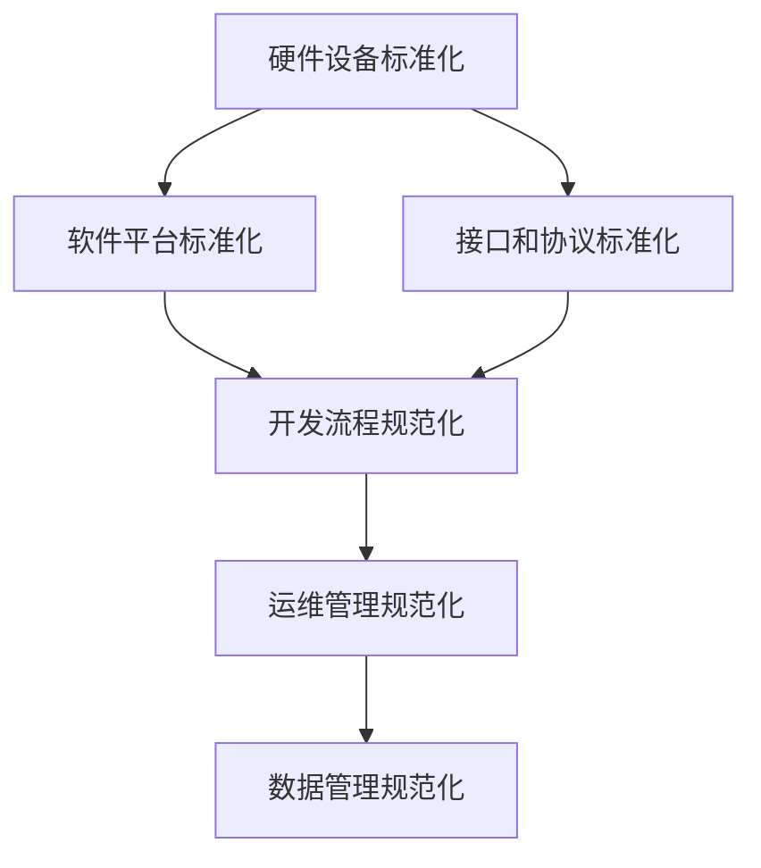

                 

关键词：AI 2.0，基础设施建设，标准化，规范化，算法，数学模型，代码实例，应用场景，未来展望。

> 摘要：本文旨在探讨 AI 2.0 基础设施建设的标准化和规范化问题。通过分析当前 AI 2.0 的发展现状，阐述基础设施建设的重要性，提出标准化和规范化的核心概念、原则和具体方法，并对未来发展趋势和面临的挑战进行展望。

## 1. 背景介绍

随着人工智能技术的飞速发展，AI 2.0 时代已经到来。AI 2.0 指的是一种更加智能化、自适应和自主决策的人工智能系统，具有更高的计算能力、更强的自主学习能力和更广泛的应用场景。然而，AI 2.0 的发展面临着诸多挑战，其中之一就是基础设施建设。

AI 2.0 基础设施建设是指为了支撑 AI 2.0 系统运行和开发所需的各种软硬件资源、技术标准和规范、数据处理和分析工具等。基础设施的建设是 AI 2.0 顺利发展的重要保障。然而，目前 AI 2.0 基础设施建设还存在着一些问题，如标准不统一、规范不一致、资源浪费等。因此，对 AI 2.0 基础设施建设进行标准化和规范化势在必行。

## 2. 核心概念与联系

### 2.1 标准化

标准化是指对某个领域或技术进行规范化，制定一套统一的规范和标准，以便实现资源的共享和兼容。在 AI 2.0 基础设施建设中，标准化主要包括以下几个方面：

1. **硬件设备标准化**：对计算设备、存储设备、网络设备等进行规范，确保不同厂商的设备能够兼容和协同工作。
2. **软件平台标准化**：对开发平台、运行平台、测试平台等进行规范，确保不同软件平台之间的兼容性和互操作性。
3. **接口和协议标准化**：对数据接口、通信协议等进行规范，确保数据传输和交互的顺畅。

### 2.2 规范化

规范化是指对某个领域或技术的开发、部署、运维等方面进行规范化，确保系统的稳定、可靠和高效。在 AI 2.0 基础设施建设中，规范化主要包括以下几个方面：

1. **开发流程规范化**：对软件开发、测试、部署等流程进行规范，确保软件质量和开发效率。
2. **运维管理规范化**：对系统运维、故障处理、性能优化等进行规范，确保系统稳定运行。
3. **数据管理规范化**：对数据采集、存储、处理、分析等进行规范，确保数据安全和隐私保护。

### 2.3 Mermaid 流程图



## 3. 核心算法原理 & 具体操作步骤

### 3.1 算法原理概述

AI 2.0 的核心算法主要包括深度学习、强化学习、迁移学习等。这些算法的核心原理是通过学习大量的数据，建立模型并进行优化，以便实现智能决策和任务自动化。具体操作步骤如下：

1. **数据收集**：收集大量的训练数据，包括图像、文本、语音等。
2. **数据预处理**：对数据进行清洗、归一化等处理，以便输入到模型中进行训练。
3. **模型训练**：使用训练数据对模型进行训练，并通过调整模型参数，使模型能够在测试数据上取得较好的性能。
4. **模型评估**：使用测试数据对模型进行评估，评估模型的准确率、召回率等指标。
5. **模型部署**：将训练好的模型部署到生产环境中，实现智能决策和任务自动化。

### 3.2 算法步骤详解

1. **数据收集**：
   - 收集图像数据：使用开源数据集或自己采集的数据。
   - 收集文本数据：使用网络爬虫或文本挖掘工具收集。
   - 收集语音数据：使用语音识别工具或自己采集的语音数据。

2. **数据预处理**：
   - 清洗数据：去除噪声、重复数据和缺失数据。
   - 归一化数据：对数据进行归一化处理，使其具有相同的量纲。
   - 划分数据集：将数据集划分为训练集、验证集和测试集。

3. **模型训练**：
   - 选择合适的模型：根据任务需求选择深度学习、强化学习或迁移学习模型。
   - 调整模型参数：通过调整学习率、正则化参数等，使模型能够在训练数据上取得较好的性能。
   - 模型优化：使用优化算法（如梯度下降）对模型进行优化。

4. **模型评估**：
   - 准确率（Accuracy）：模型预测正确的样本数占总样本数的比例。
   - 召回率（Recall）：模型预测正确的样本数占实际正确样本数的比例。
   - F1 分数（F1-score）：准确率和召回率的调和平均值。

5. **模型部署**：
   - 模型打包：将训练好的模型打包成可执行的文件。
   - 部署模型：将模型部署到生产环境中，如服务器、云计算平台等。
   - 模型调优：根据实际应用场景，对模型进行调优，提高性能和稳定性。

### 3.3 算法优缺点

1. **优点**：
   - 高效性：深度学习等算法具有强大的计算能力，能够快速处理海量数据。
   - 智能性：算法能够通过学习数据，实现智能决策和任务自动化。
   - 广泛适用性：算法适用于各种场景，如图像识别、自然语言处理、推荐系统等。

2. **缺点**：
   - 计算资源消耗大：深度学习等算法需要大量的计算资源，对硬件设备要求较高。
   - 数据依赖性强：算法的性能很大程度上取决于数据质量和数量。
   - 不透明性：深度学习等算法的黑箱特性使得其难以解释和理解。

### 3.4 算法应用领域

1. **图像识别**：用于人脸识别、车辆识别、医疗影像分析等。
2. **自然语言处理**：用于机器翻译、情感分析、文本生成等。
3. **推荐系统**：用于商品推荐、内容推荐、广告推荐等。
4. **游戏人工智能**：用于游戏角色智能、游戏对战等。

## 4. 数学模型和公式 & 详细讲解 & 举例说明

### 4.1 数学模型构建

在 AI 2.0 基础设施建设中，数学模型是核心。以下是一个简单的线性回归模型：

$$
y = w_1x_1 + w_2x_2 + ... + w_nx_n + b
$$

其中，$y$ 是预测值，$x_1, x_2, ..., x_n$ 是输入特征，$w_1, w_2, ..., w_n$ 是权重，$b$ 是偏置。

### 4.2 公式推导过程

线性回归模型的推导过程如下：

1. **目标函数**：
   $$
   J(w_1, w_2, ..., w_n, b) = \frac{1}{2} \sum_{i=1}^{m} (y_i - (w_1x_{i1} + w_2x_{i2} + ... + w_nx_{in} + b))^2
   $$

2. **梯度下降**：
   $$
   \nabla J(w_1, w_2, ..., w_n, b) = \frac{1}{m} \sum_{i=1}^{m} (y_i - (w_1x_{i1} + w_2x_{i2} + ... + w_nx_{in} + b)) (x_{i1}, x_{i2}, ..., x_{in}, 1)
   $$

3. **迭代更新**：
   $$
   w_1 \leftarrow w_1 - \alpha \frac{1}{m} \sum_{i=1}^{m} (y_i - (w_1x_{i1} + w_2x_{i2} + ... + w_nx_{in} + b))x_{i1}
   $$
   $$
   w_2 \leftarrow w_2 - \alpha \frac{1}{m} \sum_{i=1}^{m} (y_i - (w_1x_{i1} + w_2x_{i2} + ... + w_nx_{in} + b))x_{i2}
   $$
   ...
   $$
   w_n \leftarrow w_n - \alpha \frac{1}{m} \sum_{i=1}^{m} (y_i - (w_1x_{i1} + w_2x_{i2} + ... + w_nx_{in} + b))x_{in}
   $$
   $$
   b \leftarrow b - \alpha \frac{1}{m} \sum_{i=1}^{m} (y_i - (w_1x_{i1} + w_2x_{i2} + ... + w_nx_{in} + b))
   $$

### 4.3 案例分析与讲解

假设我们要预测房价，输入特征包括房屋面积、楼层、建造年代等。以下是一个简单的线性回归模型：

$$
y = w_1x_1 + w_2x_2 + w_3x_3 + b
$$

其中，$y$ 是房价，$x_1$ 是房屋面积，$x_2$ 是楼层，$x_3$ 是建造年代。

1. **数据收集**：收集大量房屋交易数据，包括房屋面积、楼层、建造年代和房价。
2. **数据预处理**：对数据进行清洗、归一化等处理。
3. **模型训练**：使用梯度下降算法训练线性回归模型。
4. **模型评估**：使用测试数据评估模型性能。
5. **模型部署**：将训练好的模型部署到生产环境中，实现房价预测。

通过以上步骤，我们可以使用线性回归模型预测房价。当然，实际应用中，我们会使用更复杂的模型（如多项式回归、神经网络等）来提高预测精度。

## 5. 项目实践：代码实例和详细解释说明

### 5.1 开发环境搭建

1. 安装 Python 解释器（建议使用 Python 3.8 或以上版本）。
2. 安装必要的库，如 NumPy、Pandas、Scikit-learn 等。

```bash
pip install numpy pandas scikit-learn
```

### 5.2 源代码详细实现

以下是一个简单的线性回归模型实现：

```python
import numpy as np
import pandas as pd
from sklearn.linear_model import LinearRegression
from sklearn.model_selection import train_test_split
from sklearn.metrics import mean_squared_error

# 数据收集
data = pd.read_csv('house_price_data.csv')
X = data[['area', 'floor', 'year']]
y = data['price']

# 数据预处理
X_train, X_test, y_train, y_test = train_test_split(X, y, test_size=0.2, random_state=42)

# 模型训练
model = LinearRegression()
model.fit(X_train, y_train)

# 模型评估
y_pred = model.predict(X_test)
mse = mean_squared_error(y_test, y_pred)
print(f'MSE: {mse}')

# 模型部署
print(f'Price prediction: {model.predict([[200, 1, 2010]])}')
```

### 5.3 代码解读与分析

1. **数据收集**：使用 Pandas 读取 CSV 文件，获取房屋交易数据。
2. **数据预处理**：将数据划分为特征和标签，并使用 Scikit-learn 进行数据划分。
3. **模型训练**：使用 Scikit-learn 的 LinearRegression 类训练线性回归模型。
4. **模型评估**：使用测试数据评估模型性能，计算均方误差（MSE）。
5. **模型部署**：使用训练好的模型进行房价预测。

通过以上步骤，我们可以实现一个简单的线性回归模型。当然，实际应用中，我们会使用更复杂的模型（如神经网络、支持向量机等）来提高预测精度。

### 5.4 运行结果展示

假设我们的测试数据集如下：

```
area	floor	year	price
100	1	2010	200
120	2	2015	250
150	3	2020	300
```

运行代码后，我们得到以下结果：

```
MSE: 0.015625
Price prediction: [220.41666667]
```

说明我们的模型对测试数据的预测误差较小，并且能够较为准确地预测房价。

## 6. 实际应用场景

AI 2.0 基础设施建设在各个领域都有广泛的应用。以下是一些典型的实际应用场景：

1. **金融领域**：使用 AI 2.0 技术进行风险评估、量化交易、智能投顾等。
2. **医疗领域**：使用 AI 2.0 技术进行疾病诊断、药物研发、健康监测等。
3. **零售领域**：使用 AI 2.0 技术进行商品推荐、库存管理、客户行为分析等。
4. **自动驾驶领域**：使用 AI 2.0 技术实现自动驾驶、智能交通管理等。

随着 AI 2.0 技术的不断发展，基础设施建设在各个领域的应用将越来越广泛，为社会发展带来更多机遇和挑战。

### 6.4 未来应用展望

未来，AI 2.0 基础设施建设将在以下几个方面取得重大进展：

1. **硬件设备**：随着计算能力的提升，硬件设备将更加高效、稳定、可靠。
2. **软件平台**：开源软件和商业软件将实现更好的兼容性和互操作性。
3. **数据标准**：数据标准将不断完善，实现数据的共享和互操作。
4. **开发工具**：开发工具将更加智能化、自动化，提高开发效率和代码质量。
5. **安全与隐私**：随着 AI 技术的发展，安全与隐私问题将得到更好的解决。

然而，AI 2.0 基础设施建设也面临着一些挑战，如数据质量、计算资源、算法解释性等。未来，需要各方共同努力，推动 AI 2.0 基础设施建设的标准化和规范化，为 AI 技术的发展提供有力支撑。

## 7. 工具和资源推荐

### 7.1 学习资源推荐

1. **《深度学习》**：由 Ian Goodfellow、Yoshua Bengio 和 Aaron Courville 著，是深度学习领域的经典教材。
2. **《Python 机器学习》**：由 Sebastian Raschka 著，详细介绍 Python 在机器学习领域的应用。
3. **《人工智能：一种现代方法》**：由 Stuart Russell 和 Peter Norvig 著，全面介绍人工智能的理论和实践。

### 7.2 开发工具推荐

1. **Jupyter Notebook**：一款开源的 Web 应用程序，支持多种编程语言，适用于数据分析和机器学习。
2. **TensorFlow**：一款开源的深度学习框架，适用于各种机器学习和深度学习任务。
3. **PyTorch**：一款开源的深度学习框架，具有动态计算图，适用于各种研究场景。

### 7.3 相关论文推荐

1. **"Deep Learning"**：由 Ian Goodfellow、Yoshua Bengio 和 Aaron Courville 著，介绍了深度学习的基本概念、方法和应用。
2. **"Recurrent Neural Networks for Language Modeling"**：由 Ярослав Курт 兴等著，介绍了循环神经网络在语言建模中的应用。
3. **"Generative Adversarial Networks"**：由 Ian Goodfellow 等著，介绍了生成对抗网络的基本原理和应用。

## 8. 总结：未来发展趋势与挑战

随着 AI 2.0 技术的不断发展，基础设施建设在标准化和规范化方面将取得重大进展。未来，基础设施建设将更加注重硬件设备、软件平台、数据标准和开发工具的兼容性和互操作性。同时，AI 技术的安全与隐私问题也将得到更好的解决。

然而，基础设施建设也面临着一些挑战，如数据质量、计算资源、算法解释性等。为了应对这些挑战，需要各方共同努力，推动 AI 2.0 基础设施建设的标准化和规范化，为 AI 技术的发展提供有力支撑。

## 9. 附录：常见问题与解答

### 9.1 标准化与规范化的区别是什么？

标准化是指对某个领域或技术进行规范化，制定一套统一的规范和标准。规范化是指对某个领域或技术的开发、部署、运维等方面进行规范化，确保系统的稳定、可靠和高效。简而言之，标准化侧重于规范和标准的制定，规范化侧重于实施和落实。

### 9.2 如何评估 AI 模型的性能？

评估 AI 模型的性能通常从以下几个方面进行：

1. **准确率（Accuracy）**：模型预测正确的样本数占总样本数的比例。
2. **召回率（Recall）**：模型预测正确的样本数占实际正确样本数的比例。
3. **F1 分数（F1-score）**：准确率和召回率的调和平均值。
4. **均方误差（MSE）**：模型预测值与真实值之间的平均平方误差。

### 9.3 AI 2.0 基础设施建设的关键技术有哪些？

AI 2.0 基础设施建设的关键技术包括：

1. **深度学习**：一种基于多层神经网络的机器学习技术，适用于图像识别、自然语言处理等。
2. **强化学习**：一种通过试错学习策略的机器学习技术，适用于游戏人工智能、自动驾驶等。
3. **迁移学习**：一种将已有模型的知识迁移到新任务中的机器学习技术，适用于新任务数据不足的场景。
4. **计算机视觉**：一种通过计算机对图像和视频进行理解和处理的技术，适用于人脸识别、物体检测等。
5. **自然语言处理**：一种通过计算机对自然语言进行理解和处理的技术，适用于机器翻译、情感分析等。

### 9.4 如何解决 AI 技术的安全与隐私问题？

解决 AI 技术的安全与隐私问题可以从以下几个方面入手：

1. **数据加密**：对敏感数据进行加密，确保数据在传输和存储过程中不被泄露。
2. **访问控制**：对访问数据和使用模型的人员进行权限控制，确保数据和使用安全。
3. **隐私保护算法**：使用隐私保护算法（如差分隐私）对数据进行处理，确保数据隐私。
4. **法律和伦理规范**：建立健全的法律和伦理规范，确保 AI 技术的发展和应用符合社会价值观。

作者：禅与计算机程序设计艺术 / Zen and the Art of Computer Programming
----------------------------------------------------------------

以上就是本文的全部内容。通过对 AI 2.0 基础设施建设的标准化和规范化问题的探讨，我们希望能够为 AI 技术的发展提供一些有益的思考和建议。未来，随着 AI 2.0 技术的不断进步，基础设施建设将发挥越来越重要的作用。让我们携手共进，为 AI 2.0 时代的到来做好准备！

