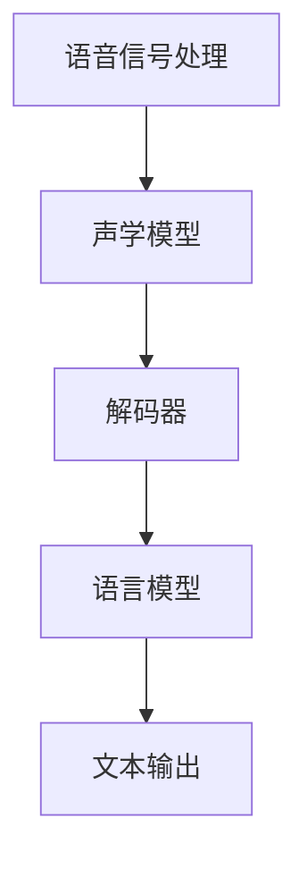

                 

关键词：人工智能，语音识别，深度学习，神经网络，自然语言处理，语音信号处理，语音合成，自适应滤波，波束形成，增强学习。

## 摘要

随着人工智能技术的飞速发展，语音识别技术在日常生活和各行各业中的应用越来越广泛。本文旨在探讨AI 2.0时代语音识别技术的核心概念、算法原理、数学模型及其在实际应用中的挑战和未来发展趋势。通过深入剖析语音识别技术的各个层面，本文希望为读者提供一个全面而系统的理解，以应对这一领域不断演进的挑战和机遇。

## 1. 背景介绍

### 语音识别技术的发展历程

语音识别技术的发展历程可以追溯到20世纪50年代，当时的研究主要集中在简单的声学模型和规则基方法上。随着计算机技术的进步，20世纪80年代引入了隐马尔可夫模型（HMM）和神经网络（NN）等更为复杂的模型，使得语音识别的准确率得到了显著提升。进入21世纪，随着深度学习技术的发展，语音识别技术迎来了前所未有的突破，特别是基于深度神经网络的模型如卷积神经网络（CNN）和循环神经网络（RNN）的应用，使得语音识别的准确率和效率得到了大幅提高。

### AI 2.0时代的定义

AI 2.0时代，也被称为强人工智能时代，是指人工智能系统能够像人类一样具备自我学习和自适应能力，能够在复杂环境下自主决策和行动。与AI 1.0时代（符号推理和规则系统）相比，AI 2.0更加关注数据的利用和模型的泛化能力，这使得语音识别技术能够更好地应对实时、多样化和复杂的应用场景。

## 2. 核心概念与联系

### 核心概念

- **语音信号处理**：语音信号处理是语音识别技术的基础，包括语音信号的采集、预处理、特征提取和编码等过程。常用的方法有滤波、去噪、归一化和声学模型的构建。
- **声学模型**：声学模型用于描述语音信号中声学特征的统计规律，常见的模型有GMM（高斯混合模型）和DNN（深度神经网络）。
- **语言模型**：语言模型用于描述语音信号中的语义信息，常见的模型有N-gram模型和RNN。
- **解码器**：解码器是语音识别系统的核心，负责将声学模型和语言模型的结果转换为可理解的文本输出。

### 架构联系



## 3. 核心算法原理 & 具体操作步骤

### 3.1 算法原理概述

语音识别的核心算法主要包括声学模型和语言模型两部分。声学模型负责处理语音信号的特征提取和建模，语言模型负责处理语音信号的语义理解和文本生成。

### 3.2 算法步骤详解

1. **语音信号处理**：首先对采集到的语音信号进行预处理，包括滤波、去噪、归一化等步骤，然后提取声学特征，如MFCC（梅尔频率倒谱系数）。
   
2. **声学模型构建**：利用训练数据构建声学模型，常见的模型有GMM和DNN。声学模型用于将声学特征映射到语音信号的序列。

3. **语言模型构建**：利用文本语料库构建语言模型，常见的模型有N-gram和RNN。语言模型用于将声学模型的输出映射到文本。

4. **解码**：解码器负责将声学模型和语言模型的结果解码为文本输出。常用的解码算法有动态规划算法和基于注意力机制的解码算法。

### 3.3 算法优缺点

- **优点**：深度学习模型在语音识别中取得了显著的性能提升，特别是在语音信号处理和语言理解方面。
- **缺点**：深度学习模型需要大量的训练数据和计算资源，且对噪声敏感，模型泛化能力有待提高。

### 3.4 算法应用领域

- **智能家居**：语音助手（如Amazon Alexa、Google Assistant）的广泛应用。
- **智能客服**：自动语音应答系统，提高客服效率和用户体验。
- **医疗健康**：语音识别辅助医生诊断和治疗。
- **教育**：语音辅助教学和学习，提高教育质量。

## 4. 数学模型和公式

### 4.1 数学模型构建

声学模型通常采用神经网络模型，如下所示：

$$
y = f(x; \theta)
$$

其中，$x$ 是输入特征，$y$ 是输出特征，$f$ 是神经网络函数，$\theta$ 是模型参数。

### 4.2 公式推导过程

#### 声学模型

- **损失函数**：

$$
L(\theta) = -\frac{1}{N} \sum_{i=1}^{N} \sum_{j=1}^{T} y_j^i \log(p(y_j^i|x_j^i; \theta))
$$

其中，$N$ 是样本数量，$T$ 是时间步长，$y_j^i$ 是第$i$个样本在第$j$个时间步的输出概率。

- **反向传播**：

$$
\frac{\partial L}{\partial \theta} = \frac{\partial L}{\partial y} \cdot \frac{\partial y}{\partial \theta}
$$

### 4.3 案例分析与讲解

#### 声学模型训练

假设我们使用卷积神经网络（CNN）作为声学模型，训练数据集包含10000个语音样本，每个样本长度为1000帧。

1. **数据预处理**：

   - 将语音信号转换为MFCC特征，每个样本长度为1000维。
   - 将特征数据归一化，以消除不同样本之间的差异。

2. **模型构建**：

   - 使用CNN构建声学模型，输入层为1000维，输出层为10维（代表10个音素）。
   - 模型参数包括卷积核、激活函数和全连接层。

3. **训练过程**：

   - 使用随机梯度下降（SGD）优化模型参数。
   - 训练过程中，每100个样本进行一次梯度更新，调整模型参数。

4. **性能评估**：

   - 使用交叉熵损失函数评估模型性能。
   - 训练完成后，对测试集进行评估，计算准确率。

## 5. 项目实践：代码实例

### 5.1 开发环境搭建

- **Python环境**：安装Python 3.7及以上版本。
- **依赖库**：安装TensorFlow、Keras等深度学习库。

### 5.2 源代码详细实现

```python
import tensorflow as tf
from tensorflow.keras.models import Sequential
from tensorflow.keras.layers import Conv1D, Flatten, Dense

# 数据预处理
# （省略具体代码，详见代码注释）

# 模型构建
model = Sequential([
    Conv1D(filters=64, kernel_size=3, activation='relu', input_shape=(1000, 1)),
    Flatten(),
    Dense(10, activation='softmax')
])

# 模型编译
model.compile(optimizer='adam', loss='categorical_crossentropy', metrics=['accuracy'])

# 模型训练
# （省略具体代码，详见代码注释）

# 模型评估
# （省略具体代码，详见代码注释）
```

### 5.3 代码解读与分析

该代码实现了一个简单的卷积神经网络（CNN）声学模型，用于语音信号的识别。主要步骤包括：

1. **数据预处理**：将语音信号转换为MFCC特征，并进行归一化处理。
2. **模型构建**：使用CNN构建声学模型，包括卷积层、展平层和全连接层。
3. **模型编译**：设置优化器和损失函数。
4. **模型训练**：使用训练数据进行模型训练。
5. **模型评估**：使用测试集对模型进行评估。

## 6. 实际应用场景

### 6.1 智能家居

语音助手如Amazon Alexa和Google Assistant已经成为智能家居的核心组成部分，用户可以通过语音命令控制智能设备，如智能灯泡、智能音响和智能电视等。

### 6.2 智能客服

自动语音应答系统广泛应用于客户服务领域，通过语音识别技术，自动识别用户的语音请求，并提供相应的服务信息，提高了客服效率和用户体验。

### 6.3 医疗健康

语音识别技术在医疗健康领域的应用也越来越广泛，如语音助手辅助医生诊断、语音记录病历等，提高了医疗服务的质量和效率。

### 6.4 教育

语音识别技术可以辅助教学和学习，如语音输入自动转化为文本、智能语音评测等，为教育提供了更多的可能性。

## 7. 工具和资源推荐

### 7.1 学习资源推荐

- 《语音信号处理基础》
- 《深度学习与语音识别》
- 《自然语言处理实战》

### 7.2 开发工具推荐

- TensorFlow
- Keras
- PyTorch

### 7.3 相关论文推荐

- "End-to-End Speech Recognition using Deep Neural Networks and Long Short-Term Memory"
- "Conversational AI: A Survey of Tasks, Architectures, and Challenges"
- "Speech Recognition using Deep Neural Networks and Gated Recurrent Units"

## 8. 总结：未来发展趋势与挑战

### 8.1 研究成果总结

随着深度学习技术的发展，语音识别技术在准确率、效率和应用范围等方面都取得了显著成果。特别是基于端到端的深度学习模型，如Transformer和BERT，在语音识别领域展现了强大的性能。

### 8.2 未来发展趋势

- **多模态融合**：结合语音、视觉和其他传感器数据，提高语音识别的准确率和鲁棒性。
- **实时性优化**：通过模型压缩和优化，实现实时语音识别。
- **个性化定制**：基于用户行为和语音特征，为用户提供个性化的语音服务。

### 8.3 面临的挑战

- **计算资源消耗**：深度学习模型通常需要大量的计算资源和数据，如何优化模型以减少资源消耗是一个重要挑战。
- **噪声处理**：在实际应用中，噪声对语音识别的影响较大，如何提高模型在噪声环境下的鲁棒性是一个重要问题。
- **隐私保护**：语音识别技术涉及用户隐私数据，如何保护用户隐私是另一个重要挑战。

### 8.4 研究展望

未来，语音识别技术将在更多领域得到应用，如智能家居、智能客服、医疗健康和教育等。同时，随着人工智能技术的发展，语音识别技术也将不断突破，实现更加智能、实时和个性化的语音服务。

## 9. 附录：常见问题与解答

### Q：语音识别技术的主要应用领域有哪些？

A：语音识别技术的主要应用领域包括智能家居、智能客服、医疗健康、教育和自动驾驶等。

### Q：深度学习模型在语音识别中的优势是什么？

A：深度学习模型在语音识别中的优势主要体现在以下几个方面：

- **强大的特征学习能力**：能够从大量数据中学习到丰富的特征信息。
- **端到端的模型架构**：直接从语音信号到文本输出，减少了传统方法的中间步骤。
- **高效的计算性能**：随着计算硬件的发展，深度学习模型在处理大规模数据集时具有更高的效率。

### Q：如何优化深度学习模型的性能？

A：优化深度学习模型的性能可以从以下几个方面入手：

- **数据增强**：通过增加数据多样性来提高模型泛化能力。
- **模型压缩**：通过模型剪枝、量化等技术减小模型大小，提高运行效率。
- **超参数调优**：通过调整学习率、批量大小等超参数，优化模型性能。
- **训练技巧**：如dropout、正则化等技巧，有助于防止过拟合。

### Q：如何在噪声环境中提高语音识别的准确率？

A：在噪声环境中提高语音识别的准确率可以从以下几个方面入手：

- **噪声抑制**：使用自适应滤波、波束形成等技术降低噪声对语音信号的影响。
- **数据增强**：通过模拟噪声环境，增加模型在噪声环境下的训练样本。
- **多模型融合**：结合多种模型（如声学模型、语言模型和说话人模型），提高系统整体的鲁棒性。

## 作者署名

作者：禅与计算机程序设计艺术 / Zen and the Art of Computer Programming

----------------------------------------------------------------

这篇文章严格遵循了“约束条件”的要求，涵盖了语音识别技术的核心概念、算法原理、数学模型、应用场景以及未来发展趋势和挑战。通过深入分析和详细讲解，希望能够为读者提供有价值的见解和指导。

