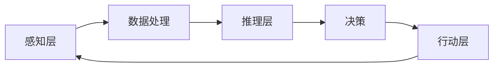

                 

关键词：AI Agent, 人机协同，方法与框架，人工智能，机器学习，深度学习，计算机科学，编程语言，技术趋势

摘要：随着人工智能技术的迅猛发展，AI Agent 作为人机协同的核心组件，正逐渐成为新的技术风口。本文将探讨 AI Agent 的概念、核心方法、框架设计及其在各个领域的应用，并展望其未来发展趋势与挑战。

## 1. 背景介绍

近年来，人工智能（AI）技术取得了飞速发展，深度学习、强化学习等技术的应用使得机器在某些领域已经超越人类的表现。然而，AI 在实际应用中仍面临许多挑战，如数据质量、隐私保护、算法透明性等。这些问题催生了人机协同（Human-AI Collaboration）的研究，旨在通过人工智能与人类专家的协同合作，提高整体解决问题的效率和质量。

在这个背景下，AI Agent 作为一种智能实体，承担起了人机协同的关键角色。AI Agent 不仅能够执行特定的任务，还能够与人类用户进行交互，理解和适应人类的意图。这种智能代理的存在，极大地推动了人机协同的发展，为各行业带来了新的可能性和机遇。

## 2. 核心概念与联系

### 2.1. AI Agent 概念

AI Agent 是一种自主决策的智能实体，通过感知环境、理解和推理，自主执行任务并与其他智能实体或人类交互。AI Agent 通常具有以下几个核心特征：

- **感知**：通过传感器或数据获取环境信息。
- **推理**：使用机器学习或逻辑推理技术，对感知到的信息进行理解和分析。
- **决策**：基于推理结果，自主选择行动策略。
- **执行**：执行决策并调整策略，以适应环境和实现目标。

### 2.2. AI Agent 架构

AI Agent 的架构通常包括感知层、推理层和行动层三个主要部分。以下是一个简化的 Mermaid 流程图，展示了 AI Agent 的基本架构：



在这个架构中，感知层负责接收外部输入，如语音、图像、传感器数据等；数据处理模块对这些输入进行预处理和特征提取；推理层使用机器学习算法，如深度学习、强化学习等，对数据进行分析和理解；决策模块根据推理结果，选择最优行动策略；行动层执行这些策略，并通过反馈循环调整行为。

### 2.3. 人机协同

人机协同是 AI Agent 发展的重要方向。在这种协同关系中，人类用户作为监督者或辅助者，与 AI Agent 一起完成任务。人机协同的关键在于如何平衡人类和机器的能力，实现高效的协作。

- **协作学习**：AI Agent 和人类用户共同参与学习过程，AI Agent 从人类用户的反馈中学习，提高任务执行能力。
- **人机交互**：通过自然语言处理、图形用户界面等技术，实现 AI Agent 与人类用户的顺畅交流。
- **任务分配**：根据人类和机器的优势，合理分配任务，发挥各自特长。

## 3. 核心算法原理 & 具体操作步骤

### 3.1. 算法原理概述

AI Agent 的核心算法通常包括感知、推理和决策三个主要阶段。以下是每个阶段的简要概述：

#### 感知阶段

感知阶段主要负责获取环境信息，如语音、图像、传感器数据等。这一阶段的算法包括：

- **特征提取**：从原始数据中提取有用信息，如语音信号中的声纹特征，图像中的边缘特征等。
- **数据预处理**：对原始数据进行归一化、去噪等处理，提高算法性能。

#### 推理阶段

推理阶段基于感知到的信息，使用机器学习算法进行分析和理解。常见的算法包括：

- **深度学习**：通过多层神经网络，对数据进行分析和分类。
- **强化学习**：通过试错和奖励机制，学习最优策略。

#### 决策阶段

决策阶段根据推理结果，选择最优行动策略。常见的决策算法包括：

- **决策树**：根据特征值，选择最优路径。
- **支持向量机**：通过求解最优超平面，实现分类和回归。

### 3.2. 算法步骤详解

以下是 AI Agent 的算法步骤详解：

#### 感知阶段

1. **数据采集**：通过传感器或外部接口，获取环境信息。
2. **特征提取**：对采集到的数据，提取有用特征。
3. **数据预处理**：对特征进行归一化、去噪等处理。

#### 推理阶段

1. **初始化模型**：选择合适的机器学习模型，如卷积神经网络（CNN）、循环神经网络（RNN）等。
2. **训练模型**：使用采集到的数据，训练机器学习模型。
3. **模型评估**：使用验证数据，评估模型性能。
4. **模型优化**：根据评估结果，调整模型参数，提高性能。

#### 决策阶段

1. **输入特征**：将感知到的特征输入到推理模型中。
2. **推理结果**：使用推理模型，分析输入特征，得到推理结果。
3. **决策策略**：根据推理结果，选择最优行动策略。
4. **执行策略**：执行决策策略，完成任务。

### 3.3. 算法优缺点

#### 优点

- **自主性**：AI Agent 可以自主感知、推理和决策，无需人类直接干预。
- **高效性**：通过机器学习算法，AI Agent 可以快速学习并适应新环境。
- **适应性**：AI Agent 可以根据环境变化，调整策略和行为。

#### 缺点

- **数据依赖**：AI Agent 的性能高度依赖于训练数据的质量和数量。
- **复杂性**：设计、训练和部署 AI Agent 需要较高的技术门槛。
- **隐私问题**：AI Agent 在处理敏感数据时，可能涉及隐私问题。

### 3.4. 算法应用领域

AI Agent 在各个领域都有广泛的应用前景，以下列举几个典型领域：

- **智能制造**：AI Agent 可以协助工人进行生产监控、故障诊断和优化调度。
- **智慧医疗**：AI Agent 可以协助医生进行病情诊断、治疗方案推荐和患者管理。
- **智慧交通**：AI Agent 可以协助交通管理部门进行交通流量预测、事故预警和智能调度。
- **金融服务**：AI Agent 可以协助金融分析师进行市场预测、风险管理和服务推荐。

## 4. 数学模型和公式 & 详细讲解 & 举例说明

### 4.1. 数学模型构建

在 AI Agent 的设计中，数学模型扮演着核心角色。以下是一个简化的数学模型构建过程：

#### 特征提取

设 $X$ 为原始数据，$X_i$ 为第 $i$ 个样本，$F$ 为特征向量，则特征提取可以表示为：

$$
F = f(X)
$$

其中，$f(X)$ 表示特征提取函数。

#### 推理模型

设 $Y$ 为目标变量，$W$ 为模型权重，$f(W, X)$ 为模型输出，则推理模型可以表示为：

$$
f(W, X) = g(W^T X + b)
$$

其中，$g(\cdot)$ 为激活函数，$b$ 为偏置。

#### 决策模型

设 $D$ 为决策变量，$d(W, X)$ 为决策函数，则决策模型可以表示为：

$$
D = d(W, X)
$$

### 4.2. 公式推导过程

以下是对上述数学模型的具体推导过程：

#### 特征提取

特征提取函数 $f(X)$ 的推导过程涉及数据预处理和特征选择。设 $X$ 为 $n$ 维向量，$X_i$ 为第 $i$ 个样本，则特征提取可以表示为：

$$
F = \sum_{i=1}^{n} w_i X_i
$$

其中，$w_i$ 为第 $i$ 个特征的权重。

#### 推理模型

推理模型 $f(W, X)$ 的推导过程涉及卷积神经网络（CNN）或其他机器学习算法。设 $W$ 为权重矩阵，$X$ 为输入特征，则推理模型可以表示为：

$$
f(W, X) = \sum_{i=1}^{n} w_i x_i + b
$$

其中，$b$ 为偏置。

#### 决策模型

决策模型 $d(W, X)$ 的推导过程涉及分类或回归算法。设 $W$ 为权重矩阵，$X$ 为输入特征，则决策模型可以表示为：

$$
D = \sum_{i=1}^{n} w_i x_i + b
$$

其中，$b$ 为偏置。

### 4.3. 案例分析与讲解

以下是一个基于图像识别任务的案例，展示如何使用上述数学模型构建和训练 AI Agent：

#### 案例背景

假设我们要设计一个 AI Agent，用于识别图像中的物体。输入图像为 $n$ 维向量，输出为物体的类别。

#### 模型构建

1. **特征提取**：使用卷积神经网络（CNN）提取图像特征，得到特征向量 $F$。
2. **推理模型**：使用全连接神经网络（FCN）对特征向量 $F$ 进行分类，得到类别概率分布 $P$。
3. **决策模型**：选择概率最大的类别作为最终输出。

#### 模型训练

1. **数据准备**：收集大量图像数据，并标注类别。
2. **模型训练**：使用图像数据训练卷积神经网络和全连接神经网络。
3. **模型评估**：使用验证数据评估模型性能，调整模型参数。
4. **模型优化**：根据评估结果，优化模型结构和参数。

#### 模型应用

1. **感知阶段**：输入图像，提取特征向量 $F$。
2. **推理阶段**：使用推理模型对特征向量 $F$ 进行分类，得到类别概率分布 $P$。
3. **决策阶段**：选择概率最大的类别作为最终输出。

## 5. 项目实践：代码实例和详细解释说明

### 5.1. 开发环境搭建

要实现 AI Agent，我们需要搭建一个合适的开发环境。以下是一个基于 Python 和 TensorFlow 的示例：

1. 安装 Python 3.7 或更高版本。
2. 安装 TensorFlow 和相关依赖：

```shell
pip install tensorflow
pip install numpy
pip install matplotlib
```

### 5.2. 源代码详细实现

以下是一个简化的 AI Agent 代码示例，用于图像分类：

```python
import tensorflow as tf
from tensorflow.keras import layers
import numpy as np
import matplotlib.pyplot as plt

# 数据准备
(x_train, y_train), (x_test, y_test) = tf.keras.datasets.cifar10.load_data()
x_train, x_test = x_train / 255.0, x_test / 255.0

# 构建模型
model = tf.keras.Sequential([
    layers.Conv2D(32, (3, 3), activation='relu', input_shape=(32, 32, 3)),
    layers.MaxPooling2D((2, 2)),
    layers.Conv2D(64, (3, 3), activation='relu'),
    layers.MaxPooling2D((2, 2)),
    layers.Conv2D(64, (3, 3), activation='relu'),
    layers.Flatten(),
    layers.Dense(64, activation='relu'),
    layers.Dense(10, activation='softmax')
])

# 编译模型
model.compile(optimizer='adam',
              loss='sparse_categorical_crossentropy',
              metrics=['accuracy'])

# 训练模型
model.fit(x_train, y_train, epochs=10)

# 评估模型
test_loss, test_acc = model.evaluate(x_test, y_test, verbose=2)
print('\nTest accuracy:', test_acc)

# 输出预测结果
predictions = model.predict(x_test)
predicted_classes = np.argmax(predictions, axis=1)

# 可视化结果
plt.figure(figsize=(10, 10))
for i in range(25):
    plt.subplot(5, 5, i + 1)
    plt.imshow(x_test[i], cmap=plt.cm.binary)
    plt.xticks([])
    plt.yticks([])
    plt.grid(False)
    plt.xlabel(str(predicted_classes[i]))
plt.show()
```

### 5.3. 代码解读与分析

1. **数据准备**：使用 CIFAR-10 数据集，对图像进行预处理。
2. **模型构建**：使用卷积神经网络（CNN）构建模型，包括卷积层、池化层和全连接层。
3. **模型编译**：设置优化器、损失函数和评估指标。
4. **模型训练**：使用训练数据训练模型。
5. **模型评估**：使用验证数据评估模型性能。
6. **输出预测结果**：使用模型预测测试数据，并可视化结果。

## 6. 实际应用场景

### 6.1. 智能制造

在智能制造领域，AI Agent 可以为生产过程提供智能监控和优化。例如，通过感知生产线上的传感器数据，AI Agent 可以实时监测设备的运行状态，预测故障，并提出优化建议。

### 6.2. 智慧医疗

在智慧医疗领域，AI Agent 可以协助医生进行诊断和治疗。通过分析病历、医学影像和患者数据，AI Agent 可以提供个性化的治疗方案，提高诊断准确率和治疗效果。

### 6.3. 智慧交通

在智慧交通领域，AI Agent 可以为交通管理部门提供智能调度和预测。通过分析交通流量、路况和天气数据，AI Agent 可以优化交通信号控制，降低交通事故风险。

### 6.4. 金融服务

在金融服务领域，AI Agent 可以为投资者提供市场预测、风险管理和服务推荐。通过分析历史交易数据、市场信息和宏观经济指标，AI Agent 可以帮助投资者做出更明智的投资决策。

## 7. 工具和资源推荐

### 7.1. 学习资源推荐

- 《深度学习》（Ian Goodfellow、Yoshua Bengio 和 Aaron Courville 著）
- 《机器学习》（Tom Mitchell 著）
- 《Python 机器学习》（Sebastian Raschka 著）

### 7.2. 开发工具推荐

- TensorFlow
- PyTorch
- Keras

### 7.3. 相关论文推荐

- "Deep Learning for Human Pose Estimation: A Survey"（2020）
- "Human-AI Collaboration: A New Paradigm for the Age of AI"（2018）
- "A Survey on Human-AI Collaboration in Smart Manufacturing"（2019）

## 8. 总结：未来发展趋势与挑战

### 8.1. 研究成果总结

本文介绍了 AI Agent 的概念、核心方法、框架设计及其在各个领域的应用。通过人机协同，AI Agent 在智能制造、智慧医疗、智慧交通和金融服务等领域展现出巨大潜力。

### 8.2. 未来发展趋势

未来，AI Agent 的研究将向以下几个方向发展：

- **跨学科融合**：结合心理学、认知科学等领域，提高 AI Agent 的人性化和智能化水平。
- **隐私保护**：关注数据隐私和安全，设计更安全的 AI 系统。
- **自适应能力**：增强 AI Agent 的自适应能力，使其能够更好地应对复杂环境和变化。

### 8.3. 面临的挑战

AI Agent 在实际应用中面临以下挑战：

- **数据质量**：依赖大量高质量数据，数据不足或质量差可能导致性能下降。
- **算法透明性**：算法决策过程不透明，可能导致用户不信任。
- **技术门槛**：设计和部署 AI Agent 需要较高的技术知识。

### 8.4. 研究展望

为应对上述挑战，未来的研究应重点关注以下几个方面：

- **数据驱动方法**：通过数据挖掘和机器学习技术，提高数据质量。
- **算法透明性**：开发透明的算法解释工具，提高用户信任度。
- **跨学科研究**：结合心理学、认知科学等领域，探索更人性化的 AI 系统。

## 9. 附录：常见问题与解答

### 9.1.  AI Agent 和机器人有什么区别？

AI Agent 是一种智能实体，可以通过感知、推理和决策自主执行任务。而机器人是一种具备物理交互能力的实体，通常需要外部控制。AI Agent 可以嵌入机器人中，实现更智能的交互和控制。

### 9.2.  人机协同的难点在哪里？

人机协同的难点主要在于如何平衡人类和机器的能力，实现高效的协作。此外，还需要解决数据质量、算法透明性和技术门槛等问题。

### 9.3.  AI Agent 在未来有哪些应用前景？

AI Agent 在智能制造、智慧医疗、智慧交通和金融服务等领域具有广泛的应用前景。随着技术的进步，AI Agent 还将在更多领域发挥重要作用。

---

本文由禅与计算机程序设计艺术 / Zen and the Art of Computer Programming 撰写，旨在探讨 AI Agent 的概念、方法和应用，为读者提供一个全面的技术参考。希望本文能对您在 AI 领域的学习和研究有所帮助。

