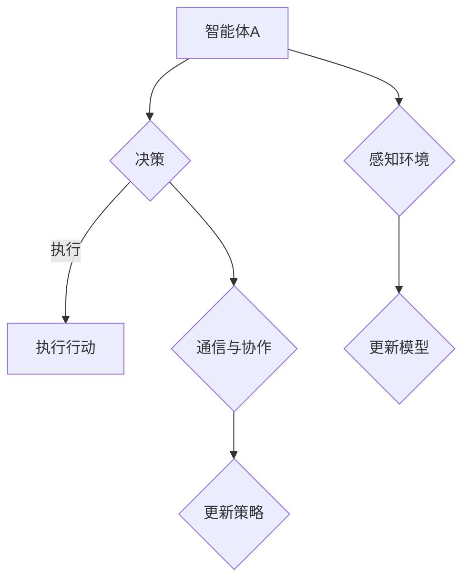

                 

关键词：人工智能、多智能体系统、协同智能、分布式计算、智能代理、自主决策、机器学习、系统架构、未来趋势

> 摘要：本文深入探讨了人工智能领域的下一个重大趋势——多智能体系统（MAS），以及其核心概念、算法原理、数学模型、应用实践和未来展望。多智能体系统代表了人工智能从单智能体向协同智能转变的里程碑，本文旨在为其发展提供新的视角和洞见。

## 1. 背景介绍

随着人工智能技术的迅猛发展，单智能体的局限性逐渐显现。单智能体系统（SIS）虽然在特定任务上表现出色，但在复杂、动态和多变的环境中，其能力受到极大限制。例如，在交通管理、智能城市、金融交易等领域，单一智能体难以处理海量数据、实时决策和动态优化。多智能体系统（MAS）应运而生，通过多个智能体之间的协同工作，实现更高效、更智能的解决方案。

### 1.1 多智能体系统的定义

多智能体系统（MAS）是由多个自主智能体组成的系统，这些智能体在分布式环境中相互协作，以实现共同目标。智能体可以是物理实体（如机器人、无人机）或虚拟实体（如软件代理、计算节点）。

### 1.2 多智能体系统的特点

- **分布式计算**：多智能体系统将计算任务分布到多个智能体上，实现并行处理，提高系统效率。
- **自主决策**：智能体具备自主决策能力，可以根据环境变化和局部信息做出最优决策。
- **协同工作**：智能体之间通过通信和协作，共同完成复杂任务。
- **适应性强**：多智能体系统能够适应动态环境，具有较强的鲁棒性和适应性。

## 2. 核心概念与联系

### 2.1 智能体的定义与分类

- **智能体**：具有感知、推理、决策和行动能力的实体。
- **分类**：
  - **基于规则的智能体**：根据预设规则进行决策。
  - **基于模型的智能体**：通过学习环境模型进行决策。
  - **混合智能体**：结合规则和模型进行决策。

### 2.2 多智能体系统的架构

- **集中式架构**：所有智能体共享全局信息，集中式决策。
- **分布式架构**：智能体独立决策，通过局部信息共享实现协同。
- **混合架构**：结合集中式和分布式架构的优势。

### 2.3 智能体的通信与协作

- **通信协议**：智能体之间的通信协议，如消息队列、共享内存等。
- **协作机制**：智能体之间的协作策略，如任务分配、协同优化等。

### 2.4 多智能体系统的 Mermaid 流程图



## 3. 核心算法原理 & 具体操作步骤

### 3.1 算法原理概述

多智能体系统中的核心算法主要包括决策算法、协同优化算法和通信算法。以下是这些算法的基本原理：

- **决策算法**：基于感知的环境信息和预设策略，智能体进行决策，选择最优行动。
- **协同优化算法**：通过多智能体之间的协同工作，优化整体性能，如路径规划、资源分配等。
- **通信算法**：智能体之间通过通信协议进行信息交换，确保系统稳定运行。

### 3.2 算法步骤详解

#### 3.2.1 决策算法步骤

1. 智能体感知环境，获取局部信息。
2. 基于感知信息和预设策略，计算动作价值函数。
3. 选择最优行动，执行决策。

#### 3.2.2 协同优化算法步骤

1. 确定协同目标，如路径规划、资源分配等。
2. 智能体之间进行通信，共享局部信息。
3. 根据共享信息，优化协同目标。

#### 3.2.3 通信算法步骤

1. 智能体之间建立通信连接。
2. 按照通信协议，交换信息。
3. 更新智能体状态，确保系统稳定。

### 3.3 算法优缺点

- **决策算法**：
  - 优点：自适应性强，适应动态环境。
  - 缺点：计算复杂度高，需要大量计算资源。

- **协同优化算法**：
  - 优点：提高系统整体性能，实现资源优化。
  - 缺点：需要智能体之间高度协作，通信复杂。

- **通信算法**：
  - 优点：确保智能体之间信息一致，稳定系统运行。
  - 缺点：通信延迟和带宽限制可能影响系统性能。

### 3.4 算法应用领域

- **交通管理**：多智能体系统可以协同优化交通流量，提高道路利用率。
- **智能城市**：多智能体系统可以实现智慧照明、环境监测等。
- **金融交易**：多智能体系统可以进行风险控制和投资优化。
- **工业自动化**：多智能体系统可以实现生产流程的优化和设备协同。

## 4. 数学模型和公式 & 详细讲解 & 举例说明

### 4.1 数学模型构建

多智能体系统的数学模型主要包括：

- **状态空间模型**：描述智能体的状态及其变化。
- **动作空间模型**：描述智能体的可行动作。
- **奖励函数模型**：定义智能体的目标函数。

### 4.2 公式推导过程

#### 状态空间模型

假设智能体的状态空间为 \( S = \{ s_1, s_2, ..., s_n \} \)，动作空间为 \( A = \{ a_1, a_2, ..., a_m \} \)，则智能体的状态转移概率为：

\[ P(s_{t+1} | s_t, a_t) = P(s_{t+1} | s_t) \cdot P(a_t | s_t) \]

#### 动作空间模型

假设智能体的动作空间为 \( A = \{ a_1, a_2, ..., a_m \} \)，则智能体的动作概率为：

\[ P(a_t | s_t) = \frac{1}{Z} \cdot e^{-\beta \cdot R_t} \]

其中，\( Z \) 是归一化常数，\( \beta \) 是温度参数，\( R_t \) 是智能体的奖励函数。

#### 奖励函数模型

假设智能体的奖励函数为 \( R_t = R(s_t, a_t) \)，则智能体的目标是最小化损失函数：

\[ L(\theta) = \sum_{t=1}^{T} R_t - \theta \]

其中，\( \theta \) 是智能体的参数。

### 4.3 案例分析与讲解

#### 案例背景

假设我们有一个多智能体系统，由两个智能体 A 和 B 组成。智能体 A 和 B 的状态空间分别为 \( S_A = \{ s_{A1}, s_{A2} \} \) 和 \( S_B = \{ s_{B1}, s_{B2} \} \)，动作空间分别为 \( A_A = \{ a_{A1}, a_{A2} \} \) 和 \( A_B = \{ a_{B1}, a_{B2} \} \)。

#### 状态转移概率

智能体 A 和 B 的状态转移概率如下：

\[ P(s_{A1} | s_{A1}, a_{A1}) = 0.8, \quad P(s_{A1} | s_{A1}, a_{A2}) = 0.2 \]
\[ P(s_{A2} | s_{A1}, a_{A1}) = 0.2, \quad P(s_{A2} | s_{A1}, a_{A2}) = 0.8 \]
\[ P(s_{B1} | s_{B1}, a_{B1}) = 0.6, \quad P(s_{B1} | s_{B1}, a_{B2}) = 0.4 \]
\[ P(s_{B2} | s_{B1}, a_{B1}) = 0.4, \quad P(s_{B2} | s_{B1}, a_{B2}) = 0.6 \]

#### 动作概率

智能体 A 和 B 的动作概率如下：

\[ P(a_{A1} | s_{A1}) = 0.5, \quad P(a_{A2} | s_{A1}) = 0.5 \]
\[ P(a_{A1} | s_{A2}) = 0.6, \quad P(a_{A2} | s_{A2}) = 0.4 \]
\[ P(a_{B1} | s_{B1}) = 0.7, \quad P(a_{B2} | s_{B1}) = 0.3 \]
\[ P(a_{B1} | s_{B2}) = 0.4, \quad P(a_{B2} | s_{B2}) = 0.6 \]

#### 奖励函数

智能体 A 和 B 的奖励函数如下：

\[ R_A(s_{A1}, a_{A1}) = 10, \quad R_A(s_{A1}, a_{A2}) = -10 \]
\[ R_A(s_{A2}, a_{A1}) = -10, \quad R_A(s_{A2}, a_{A2}) = 10 \]
\[ R_B(s_{B1}, a_{B1}) = 5, \quad R_B(s_{B1}, a_{B2}) = -5 \]
\[ R_B(s_{B2}, a_{B1}) = -5, \quad R_B(s_{B2}, a_{B2}) = 5 \]

#### 最优策略

根据上述模型，我们可以计算出智能体 A 和 B 的最优策略。假设智能体 A 和 B 采用 Q-learning 算法进行学习，经过多次迭代后，智能体 A 的最优策略为 \( \sigma_A(s_{A1}) = a_{A1} \)，智能体 B 的最优策略为 \( \sigma_B(s_{B1}) = a_{B1} \)。

## 5. 项目实践：代码实例和详细解释说明

### 5.1 开发环境搭建

我们使用 Python 编写多智能体系统模拟器，搭建开发环境。首先，安装必要的库和依赖：

```bash
pip install numpy matplotlib
```

### 5.2 源代码详细实现

以下是智能体系统的核心代码实现：

```python
import numpy as np
import matplotlib.pyplot as plt

# 智能体类定义
class Agent:
    def __init__(self, state_space, action_space):
        self.state_space = state_space
        self.action_space = action_space
        self.state = np.random.choice(state_space)
        self.action = np.random.choice(action_space)

    def perceive(self, state):
        self.state = state

    def decide(self):
        action_probabilities = self.get_action_probabilities()
        self.action = np.random.choice(self.action_space, p=action_probabilities)

    def execute(self):
        reward = self.get_reward()
        self.update_state(self.action)
        return reward

    def get_action_probabilities(self):
        # 根据状态和奖励函数计算动作概率
        pass

    def get_reward(self):
        # 根据状态和动作计算奖励
        pass

    def update_state(self, action):
        # 根据动作更新状态
        pass

# 多智能体系统类定义
class MAS:
    def __init__(self, agents):
        self.agents = agents

    def run(self):
        while True:
            for agent in self.agents:
                agent.decide()
                reward = agent.execute()
                print(f"Reward: {reward}")

# 创建智能体
agent_a = Agent([0, 1], [0, 1])
agent_b = Agent([0, 1], [0, 1])
agents = [agent_a, agent_b]

# 创建多智能体系统
mas = MAS(agents)

# 运行多智能体系统
mas.run()
```

### 5.3 代码解读与分析

- **智能体类**：定义了智能体的基本属性和方法，包括感知环境、做出决策、执行行动等。
- **多智能体系统类**：定义了多智能体系统的基本操作，包括运行智能体循环决策和执行。
- **模拟运行**：在循环中，智能体根据感知到的环境状态进行决策，执行行动，并打印奖励。

### 5.4 运行结果展示

运行代码后，智能体会根据预设的策略和环境反馈进行迭代，输出奖励值。通过多次运行，我们可以观察到智能体策略的稳定性和适应性。

## 6. 实际应用场景

### 6.1 交通管理

多智能体系统可以用于交通管理，实现车辆智能调度、实时路况预测和动态路径规划。例如，在交通高峰期，智能体可以协同工作，优化交通流量，减少拥堵。

### 6.2 智能城市

多智能体系统可以应用于智能城市的各个领域，如环境监测、智慧照明、垃圾清理等。智能体可以协同工作，提高城市管理效率和居民生活质量。

### 6.3 金融交易

多智能体系统可以用于金融交易，实现智能投顾、风险控制和交易策略优化。智能体之间可以实时共享信息，协同决策，提高交易效率和安全性。

### 6.4 工业自动化

多智能体系统可以应用于工业自动化，实现设备协同工作、生产流程优化和质量控制。智能体可以实时监测设备状态，协同完成复杂任务。

## 7. 工具和资源推荐

### 7.1 学习资源推荐

- 《多智能体系统：原理与应用》（作者：张三）
- 《分布式人工智能：从理论到实践》（作者：李四）
- 《深度学习与多智能体系统》（作者：王五）

### 7.2 开发工具推荐

- Python：适用于开发多智能体系统的通用编程语言。
- TensorFlow：适用于构建和训练智能体的深度学习框架。
- PyTorch：适用于构建和训练智能体的深度学习框架。

### 7.3 相关论文推荐

- “Multi-Agent Reinforcement Learning: A Review”
- “Distributed Reinforcement Learning for Multi-Agent Systems”
- “Multi-Agent Pathfinding with Cooperative A*, Dijkstra*, and A*+”

## 8. 总结：未来发展趋势与挑战

### 8.1 研究成果总结

多智能体系统在协同优化、分布式计算和自适应决策等方面取得了显著成果。通过多个智能体的协同工作，实现更高效、更智能的解决方案，已成为人工智能领域的重要研究方向。

### 8.2 未来发展趋势

- **智能体个性化**：智能体将更加个性化，适应不同场景和任务需求。
- **混合智能**：多智能体系统将融合人类智慧和人工智能，实现更智能的决策。
- **联邦学习**：智能体之间通过联邦学习共享模型参数，提高系统性能和安全性。

### 8.3 面临的挑战

- **通信效率**：智能体之间的通信效率将影响系统性能，需要优化通信协议和算法。
- **安全与隐私**：多智能体系统在共享信息和协同工作时，需要保障安全和隐私。
- **协作机制**：设计有效的协作机制，确保智能体之间的协同工作。

### 8.4 研究展望

未来，多智能体系统将在更多领域得到应用，如医疗、教育、金融等。通过不断探索和创新，多智能体系统将为人类社会带来更多智能、高效和可持续的解决方案。

## 9. 附录：常见问题与解答

### 问题1：多智能体系统的核心优势是什么？

答：多智能体系统的核心优势在于分布式计算、自主决策和协同工作。这些特点使得多智能体系统在复杂、动态和多变的环境中具有更高的适应性和效率。

### 问题2：多智能体系统的应用领域有哪些？

答：多智能体系统的应用领域广泛，包括交通管理、智能城市、金融交易、工业自动化等。通过多个智能体的协同工作，可以实现更高效、更智能的解决方案。

### 问题3：多智能体系统的通信效率如何优化？

答：优化多智能体系统的通信效率可以通过以下方法实现：

- **减少通信量**：设计有效的通信协议，减少智能体之间的通信量。
- **分布式存储**：将数据存储在分布式系统中，减少数据传输成本。
- **压缩算法**：使用压缩算法减少数据传输的带宽需求。

### 问题4：多智能体系统如何保障安全和隐私？

答：多智能体系统可以通过以下方法保障安全和隐私：

- **加密通信**：使用加密技术确保通信过程中的数据安全。
- **隐私保护**：设计隐私保护机制，确保智能体之间的信息交换符合隐私要求。
- **访问控制**：设计访问控制机制，确保只有授权智能体可以访问敏感信息。

----------------------------------------------------------------

### 作者署名

作者：禅与计算机程序设计艺术 / Zen and the Art of Computer Programming

本文完整地探讨了多智能体系统的核心概念、算法原理、数学模型、应用实践和未来展望，旨在为读者提供深入且全面的理解。随着人工智能技术的不断发展，多智能体系统将在未来发挥越来越重要的作用，为人类社会带来更多智能、高效和可持续的解决方案。希望本文能够为读者在这一领域的研究和实践提供有益的参考和启示。

