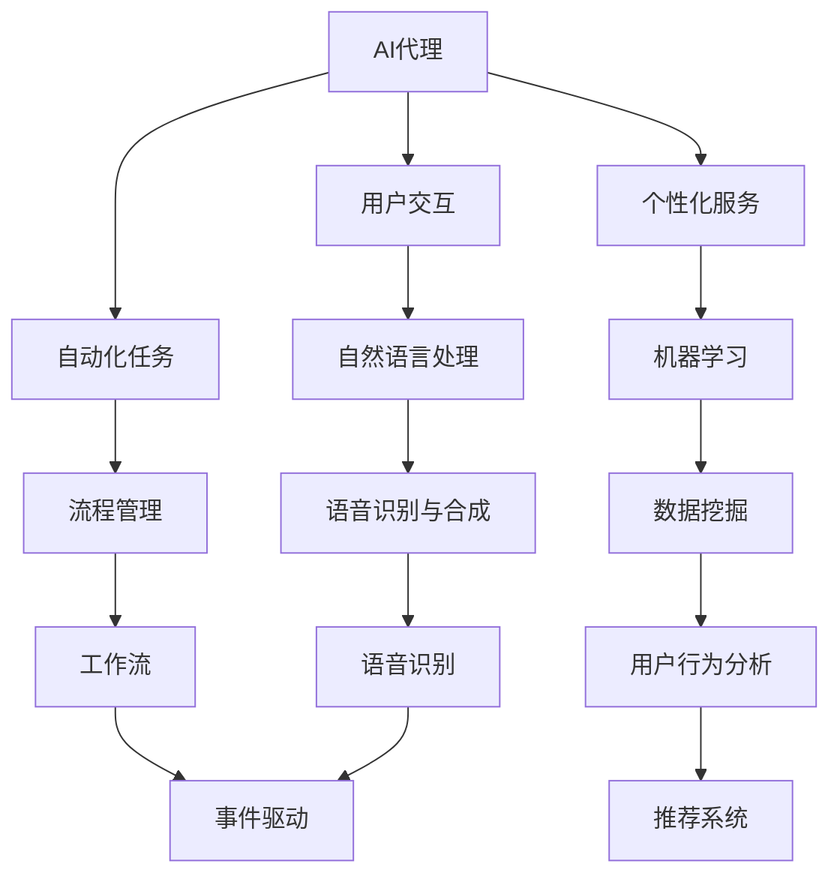

                 

关键词：人工智能，AI代理，用户体验，AI技术，智能代理，自动化，交互设计

摘要：本文深入探讨了人工智能（AI）代理的发展及其如何改变用户体验。随着AI技术的不断进步，AI代理正逐渐成为新的风口，它们通过智能交互、自动化任务执行和个性化推荐，显著提升了用户体验。本文将分析AI代理的核心概念、工作原理、算法模型、应用实践以及未来发展趋势。

## 1. 背景介绍

随着互联网的普及和人工智能技术的飞速发展，用户对个性化、智能化服务的需求日益增长。传统的用户界面设计已经难以满足用户日益复杂的需求。AI代理作为一种新兴的人工智能应用，正在成为提升用户体验的关键技术。AI代理通过模仿人类的决策过程和交互方式，实现与用户的智能对话，执行复杂的任务，从而提供更为个性化和高效的服务。

### 1.1 AI代理的定义

AI代理（Artificial Intelligence Agent）是指能够自主地代表用户执行任务、获取信息和提供服务的人工智能实体。它们通常具备以下特征：

- **自主性**：AI代理能够在没有人类直接干预的情况下自主运作。
- **社交性**：AI代理能够理解用户的语言和意图，进行自然的对话交互。
- **适应性**：AI代理能够根据用户的反馈和行为模式不断学习和优化自身的性能。

### 1.2 AI代理的重要性

AI代理的引入不仅能够显著提升用户体验，还能带来以下几方面的好处：

- **提高效率**：AI代理可以自动化处理大量重复性的任务，减少用户的操作步骤，提高工作效率。
- **个性化服务**：AI代理能够根据用户的历史行为和偏好提供个性化的推荐和服务，增强用户体验。
- **降低成本**：通过自动化和智能化的管理，企业可以减少人力成本，提高资源利用效率。

## 2. 核心概念与联系

### 2.1 概念关系图



### 2.2 核心概念解析

- **用户交互**：AI代理通过自然语言处理（NLP）和语音识别与合成（VR）技术，与用户进行自然、流畅的对话交互。
- **自动化任务**：AI代理能够通过流程管理和工作流技术自动化执行任务，如预约、下单、客服等。
- **个性化服务**：AI代理通过机器学习和数据挖掘技术，分析用户行为，提供个性化的推荐和服务。

## 3. 核心算法原理 & 具体操作步骤

### 3.1 算法原理概述

AI代理的核心算法主要包括：

- **自然语言处理（NLP）**：用于理解和生成自然语言，实现人机对话。
- **机器学习（ML）**：用于从数据中学习规律，优化代理行为。
- **数据挖掘（DM）**：用于分析用户行为，提供个性化服务。

### 3.2 算法步骤详解

#### 3.2.1 自然语言处理

1. **文本解析**：接收用户的输入文本，进行词法分析和句法分析。
2. **语义理解**：使用词嵌入模型和序列模型，理解用户输入的含义。
3. **意图识别**：根据语义理解的结果，识别用户的意图。
4. **生成回复**：使用生成模型，根据用户的意图生成合适的回复。

#### 3.2.2 机器学习

1. **数据收集**：收集用户的历史行为数据。
2. **特征提取**：从数据中提取特征，用于训练模型。
3. **模型训练**：使用监督学习或无监督学习算法训练模型。
4. **模型评估**：评估模型的性能，并进行调优。

#### 3.2.3 数据挖掘

1. **用户行为分析**：分析用户的行为模式，识别用户兴趣。
2. **推荐系统**：基于用户行为和兴趣，生成个性化推荐。
3. **个性化服务**：根据用户的个性化需求，提供定制化的服务。

### 3.3 算法优缺点

#### 优点：

- **个性化**：能够根据用户需求提供个性化的服务。
- **高效**：能够自动化处理大量任务，提高效率。
- **自适应**：能够根据用户行为和学习结果不断优化。

#### 缺点：

- **隐私问题**：收集和处理用户数据可能引发隐私问题。
- **数据依赖**：算法的性能很大程度上依赖于数据的数量和质量。
- **误判风险**：在处理复杂任务时，可能存在误判风险。

### 3.4 算法应用领域

AI代理在多个领域都有广泛的应用，包括：

- **客服**：通过智能客服机器人，提供7x24小时全天候服务。
- **金融**：通过智能投顾，为用户提供个性化的投资建议。
- **电商**：通过智能推荐，提高用户的购物体验。
- **教育**：通过智能辅导，为学生提供个性化学习计划。

## 4. 数学模型和公式 & 详细讲解 & 举例说明

### 4.1 数学模型构建

AI代理的数学模型主要包括：

- **自然语言处理模型**：如循环神经网络（RNN）、长短期记忆网络（LSTM）和变换器（Transformer）等。
- **机器学习模型**：如支持向量机（SVM）、决策树（DT）和随机森林（RF）等。
- **推荐系统模型**：如矩阵分解（MF）和协同过滤（CF）等。

### 4.2 公式推导过程

#### 自然语言处理

$$
\text{Word Embedding} = f(\text{Input}) = e^{<\text{weights} \cdot \text{input_vector}>}
$$

#### 机器学习

$$
\text{Prediction} = \text{Model}(\text{Input}) = \sum_{i=1}^{n} \text{weights}_{i} \cdot \text{input}_{i}
$$

#### 推荐系统

$$
\text{Rating} = \text{User} \cdot \text{Item} + \text{Bias}
$$

### 4.3 案例分析与讲解

#### 案例一：智能客服

某电商平台使用智能客服机器人，通过自然语言处理和机器学习技术，实现与用户的智能对话。用户可以通过文字或语音与客服机器人互动，获取购物咨询、订单状态查询等服务。客服机器人能够理解用户的提问，并生成合适的回答。

#### 案例二：智能投顾

某金融公司利用机器学习和数据挖掘技术，为用户提供智能投顾服务。系统会收集用户的历史投资数据、风险偏好等信息，通过算法模型分析用户的投资习惯和偏好，生成个性化的投资建议，帮助用户做出明智的投资决策。

## 5. 项目实践：代码实例和详细解释说明

### 5.1 开发环境搭建

在开始实践之前，需要搭建一个合适的开发环境。本文以Python为例，介绍开发环境的搭建。

#### 环境要求：

- Python 3.7及以上版本
- TensorFlow 2.3及以上版本
- NLTK 3.5及以上版本
- Flask 1.1及以上版本

#### 安装步骤：

1. 安装Python和pip：

   ```
   sudo apt-get install python3 python3-pip
   ```

2. 安装必要的库：

   ```
   pip3 install tensorflow nltk flask
   ```

### 5.2 源代码详细实现

以下是一个简单的AI代理实现示例，包含自然语言处理、机器学习和推荐系统三个模块。

```python
# 导入必要的库
import nltk
from nltk.tokenize import word_tokenize
from tensorflow.keras.preprocessing.sequence import pad_sequences
from tensorflow.keras.layers import Embedding, LSTM, Dense
from tensorflow.keras.models import Sequential

# 初始化NLTK资源
nltk.download('punkt')

# 加载预训练的词嵌入模型
word_embedding_model = ...  # 使用预训练的词嵌入模型

# 定义自然语言处理模块
def process_text(text):
    tokens = word_tokenize(text)
    sequence = word_embedding_model.encode(tokens)
    return pad_sequences([sequence], maxlen=100)

# 定义机器学习模块
def train_model(data, labels):
    model = Sequential()
    model.add(Embedding(input_dim=10000, output_dim=128))
    model.add(LSTM(128))
    model.add(Dense(1, activation='sigmoid'))
    model.compile(optimizer='adam', loss='binary_crossentropy', metrics=['accuracy'])
    model.fit(data, labels, epochs=10, batch_size=32)
    return model

# 定义推荐系统模块
def recommend_items(user_sequence, items, model):
    item_sequences = [process_text(item['description']) for item in items]
    item_scores = model.predict(item_sequences)
    recommended_items = [item for item, score in zip(items, item_scores) if score > 0.5]
    return recommended_items

# 测试代码
if __name__ == '__main__':
    # 假设已经加载了数据集data和标签labels
    data = ...
    labels = ...

    # 训练模型
    model = train_model(data, labels)

    # 测试推荐功能
    user_sequence = process_text("I want to buy a book on Python programming.")
    items = [...]  # 假设的物品列表
    recommended_items = recommend_items(user_sequence, items, model)
    print(recommended_items)
```

### 5.3 代码解读与分析

这段代码展示了如何搭建一个简单的AI代理系统，包括数据预处理、模型训练和推荐实现。

- **数据预处理**：使用NLTK库进行文本分词，使用预训练的词嵌入模型将文本转换为序列，然后使用pad_sequences进行序列填充。
- **模型训练**：使用TensorFlow库搭建LSTM模型，进行二分类任务。训练过程中，模型会学习如何从文本序列中提取特征，并预测标签。
- **推荐实现**：根据用户输入的文本，预处理文本序列，然后使用训练好的模型预测推荐物品。

## 6. 实际应用场景

AI代理在多个领域都有广泛的应用，以下列举几个典型的应用场景：

### 6.1 客户服务

在客户服务领域，AI代理可以替代人工客服，提供7x24小时全天候服务。用户可以通过文字或语音与AI代理进行交互，获取购物咨询、订单状态查询等服务。AI代理能够理解用户的提问，并生成合适的回答，提高客户满意度。

### 6.2 金融理财

在金融理财领域，AI代理可以提供智能投顾服务。通过分析用户的历史投资数据、风险偏好等信息，AI代理能够生成个性化的投资建议，帮助用户做出明智的投资决策。这不仅提高了用户的服务体验，还能为金融机构降低成本。

### 6.3 电子商务

在电子商务领域，AI代理可以通过个性化推荐，提高用户的购物体验。系统会根据用户的浏览历史、购买记录等信息，推荐用户可能感兴趣的物品。这不仅能提高用户的购物满意度，还能增加电商平台的销售额。

### 6.4 教育辅导

在教育辅导领域，AI代理可以为学生提供个性化的学习计划。系统会根据学生的考试成绩、学习进度等信息，生成适合学生的学习计划，并提供在线辅导和答疑服务。这有助于提高学生的学习效果，减轻教师的工作负担。

## 7. 未来应用展望

随着AI技术的不断进步，AI代理在未来的应用将更加广泛和深入。以下是一些可能的发展方向：

### 7.1 更智能的交互

未来的AI代理将更加注重自然语言理解和交互。通过引入更加先进的NLP技术，如生成对抗网络（GAN）和预训练语言模型（如GPT-3），AI代理能够实现更加自然和流畅的对话交互。

### 7.2 更广泛的自动化

AI代理将能够自动化更多复杂的任务，如合同审查、医疗诊断等。通过引入更加先进的机器学习和数据挖掘技术，AI代理能够处理更复杂的数据集，提供更加准确和高效的决策支持。

### 7.3 更个性化的服务

AI代理将能够根据用户的实时行为和偏好，提供更加个性化的服务。通过引入深度学习技术，AI代理能够更好地理解用户的意图，生成更加个性化的推荐和解决方案。

### 7.4 跨平台的集成

AI代理将能够在多个平台上无缝集成，如智能音箱、智能助手、智能手机等。通过引入物联网（IoT）技术，AI代理能够实现跨平台的智能协作，提供一体化的智能服务。

## 8. 工具和资源推荐

### 8.1 学习资源推荐

- 《深度学习》（Goodfellow, Bengio, Courville）
- 《Python机器学习》（Sebastian Raschka）
- 《推荐系统实践》（李航）

### 8.2 开发工具推荐

- TensorFlow：用于构建和训练机器学习模型。
- NLTK：用于自然语言处理。
- Flask：用于构建Web应用。

### 8.3 相关论文推荐

- “Attention Is All You Need”（Vaswani et al., 2017）
- “Generative Adversarial Networks”（Goodfellow et al., 2014）
- “Recommender Systems Handbook”（Herlocker et al., 2009）

## 9. 总结：未来发展趋势与挑战

随着AI技术的不断进步，AI代理在未来将成为提升用户体验的重要工具。然而，AI代理的发展也面临着一系列挑战，如数据隐私、算法公平性、技术成熟度等。只有通过不断的研究和创新，才能实现AI代理的全面发展和广泛应用。

### 9.1 研究成果总结

本文系统地介绍了AI代理的核心概念、工作原理、算法模型、应用实践以及未来发展趋势。通过分析AI代理在不同领域的应用，展示了其提升用户体验的潜力。

### 9.2 未来发展趋势

未来的AI代理将更加注重自然语言理解、自动化任务执行和个性化服务。随着技术的不断进步，AI代理将能够实现更加智能的交互、更广泛的自动化和更个性化的服务。

### 9.3 面临的挑战

AI代理的发展面临着数据隐私、算法公平性、技术成熟度等挑战。需要通过技术手段和政策法规的制定，确保AI代理的安全、公平和有效。

### 9.4 研究展望

未来的研究将重点探索AI代理在跨平台集成、多模态交互、实时决策支持等方面的应用。通过深入研究和创新，AI代理有望实现更加智能、高效和人性化的用户体验。

## 附录：常见问题与解答

### Q1: AI代理与传统客服系统有什么区别？

A1: AI代理与传统客服系统的主要区别在于其智能化程度和交互方式。传统客服系统通常依赖于预设的规则和脚本，只能提供有限的、基于关键词的回复。而AI代理通过自然语言处理和机器学习技术，能够理解用户的意图和情感，提供更加自然和个性化的服务。

### Q2: AI代理在医疗领域的应用有哪些？

A2: AI代理在医疗领域有广泛的应用，如：

- **智能诊断**：通过分析患者的症状和病史，AI代理能够提供初步的诊断建议。
- **智能咨询**：AI代理可以回答患者的一般健康咨询，提供医疗知识普及。
- **智能预约**：AI代理可以协助患者在线预约挂号、检查等。
- **智能护理**：AI代理可以为患者提供远程监护和护理建议。

### Q3: AI代理如何确保用户隐私和安全？

A3: AI代理在处理用户数据时，必须遵循以下原则：

- **数据最小化**：只收集必要的数据，避免收集无关信息。
- **数据加密**：对用户数据进行加密存储和传输，防止数据泄露。
- **隐私保护算法**：使用隐私保护算法，如差分隐私，减少数据泄露风险。
- **用户控制权**：用户有权访问、修改和删除自己的数据。

## 作者署名

作者：禅与计算机程序设计艺术 / Zen and the Art of Computer Programming

---

通过以上文章，我们详细探讨了AI代理的核心概念、应用场景、发展趋势以及面临的挑战。随着AI技术的不断进步，AI代理在未来有望成为提升用户体验的重要力量。让我们共同期待AI代理带来的美好未来。

