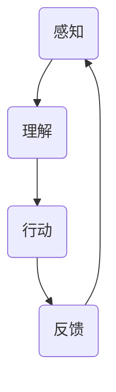

                 

关键词：人工智能，AI Agent，研究难点，挑战，发展趋势

人工智能（AI）作为当前科技领域的热门话题，已经深刻地改变了我们的生活方式。从智能助手到自动驾驶，AI的应用无处不在。然而，随着技术的不断进步，AI的发展也面临着许多新的挑战和难点。本文将探讨AI Agent，这一未来人工智能的重要方向，并分析其在当前研究中面临的难点与挑战。

## 1. 背景介绍

AI Agent是指能够自主执行任务、适应环境变化、具备一定程度智能的计算机程序。与传统的AI系统不同，AI Agent更加注重自主性和适应性。它们不仅能够执行预先定义的任务，还能够根据环境和情境的变化，自主地调整行为策略。这一特点使得AI Agent在复杂动态环境中具有巨大的应用潜力。

近年来，随着深度学习、强化学习等技术的发展，AI Agent的研究取得了显著进展。然而，要实现真正的智能代理，仍然面临许多挑战。本文将围绕以下几个方面展开讨论：核心概念与联系、核心算法原理、数学模型与公式、项目实践、实际应用场景以及未来展望。

## 2. 核心概念与联系

在探讨AI Agent之前，我们需要明确几个核心概念，包括智能代理的定义、智能代理的组成及其在环境中的交互机制。

### 2.1 智能代理的定义

智能代理是指具备一定智能能力，能够在复杂环境中自主执行任务的计算机程序。智能代理不仅需要具备感知环境的能力，还需要能够理解、推理和决策。这些能力使得智能代理能够在不断变化的环境中，根据目标自动调整行为。

### 2.2 智能代理的组成

智能代理通常由感知模块、决策模块和执行模块三部分组成。感知模块负责收集环境信息，如视觉、听觉、触觉等；决策模块负责根据感知模块提供的信息，生成相应的行为策略；执行模块负责将决策模块生成的行为策略付诸实践。

### 2.3 智能代理在环境中的交互机制

智能代理在环境中的交互机制主要包括感知、理解和行动三个阶段。感知阶段，智能代理通过感知模块获取环境信息；理解阶段，智能代理对感知到的信息进行处理，理解环境状态；行动阶段，智能代理根据理解的结果，执行相应的行为策略。

为了更直观地展示智能代理的概念和组成，我们可以使用Mermaid流程图来描述。以下是一个简化的智能代理流程图：



在这个流程图中，A表示感知模块，B表示决策模块，C表示执行模块，D表示反馈模块。智能代理通过不断的循环感知、理解和行动，实现与环境的高效交互。

## 3. 核心算法原理 & 具体操作步骤

### 3.1 算法原理概述

AI Agent的核心算法主要包括感知、理解和行动三个部分。感知部分通常采用深度学习技术，如卷积神经网络（CNN）或循环神经网络（RNN）等，用于提取环境特征；理解部分则采用自然语言处理（NLP）或图论算法，用于理解环境状态和目标；行动部分则通过强化学习或规划算法，生成最优的行为策略。

### 3.2 算法步骤详解

以下是一个简化的AI Agent算法步骤：

1. **感知阶段**：智能代理通过摄像头、麦克风等传感器收集环境信息，如图像、声音等。
2. **预处理阶段**：对感知到的信息进行预处理，如图像增强、降噪等。
3. **特征提取阶段**：采用深度学习技术，如CNN或RNN等，提取环境特征。
4. **理解阶段**：将提取的环境特征输入到NLP或图论算法中，理解当前环境状态和目标。
5. **决策阶段**：根据理解结果，使用强化学习或规划算法，生成最优的行为策略。
6. **执行阶段**：将决策结果付诸实践，如控制机械臂执行任务等。
7. **反馈阶段**：收集执行结果，进行评价和优化。

### 3.3 算法优缺点

**优点**：

1. **自主性**：AI Agent能够自主感知、理解和行动，不需要人为干预。
2. **适应性**：AI Agent能够根据环境变化，自动调整行为策略。

**缺点**：

1. **复杂度高**：AI Agent涉及多个领域的知识，实现难度较大。
2. **数据需求大**：感知和特征提取需要大量数据支持。

### 3.4 算法应用领域

AI Agent在许多领域都有广泛的应用前景，如：

1. **机器人**：在工业自动化、医疗辅助、家庭服务等场景中，AI Agent能够执行复杂任务。
2. **自动驾驶**：在自动驾驶汽车中，AI Agent能够实时感知路况，做出安全决策。
3. **智能助手**：在智能音箱、智能手机等设备中，AI Agent能够理解用户需求，提供个性化服务。

## 4. 数学模型和公式 & 详细讲解 & 举例说明

### 4.1 数学模型构建

AI Agent的数学模型主要包括感知模型、理解模型和行动模型。以下是一个简化的数学模型：

1. **感知模型**：输入为环境状态，输出为特征向量。通常使用深度学习模型，如CNN或RNN等。
2. **理解模型**：输入为特征向量，输出为环境状态和目标。通常使用NLP或图论算法，如循环神经网络（RNN）或图神经网络（GNN）等。
3. **行动模型**：输入为环境状态和目标，输出为行为策略。通常使用强化学习或规划算法，如Q学习或部分可观测马尔可夫决策过程（POMDP）等。

### 4.2 公式推导过程

以下是一个简化的感知模型的公式推导过程：

假设环境状态为 $S_t$，特征向量为 $X_t$，感知模型为 $f(S_t)$。则感知模型可以表示为：

$$X_t = f(S_t) = W \cdot S_t + b$$

其中，$W$ 为权重矩阵，$b$ 为偏置向量。

### 4.3 案例分析与讲解

以下是一个简单的感知模型的案例：

假设我们有一个简单的环境，只有两个状态：红色和蓝色。感知模型使用一个卷积神经网络，输入为图像，输出为特征向量。

1. **输入阶段**：输入一张红色的图像。
2. **预处理阶段**：对图像进行预处理，如归一化、裁剪等。
3. **特征提取阶段**：卷积神经网络提取图像特征，输出一个特征向量。
4. **理解阶段**：将特征向量输入到理解模型，判断当前环境状态。
5. **行动阶段**：根据理解结果，执行相应的行为策略。

在这个案例中，感知模型的输入为图像，输出为特征向量。我们可以使用卷积神经网络（CNN）来实现感知模型。以下是一个简化的CNN模型：

```python
import tensorflow as tf

model = tf.keras.Sequential([
    tf.keras.layers.Conv2D(32, (3, 3), activation='relu', input_shape=(28, 28, 1)),
    tf.keras.layers.MaxPooling2D((2, 2)),
    tf.keras.layers.Flatten(),
    tf.keras.layers.Dense(128, activation='relu'),
    tf.keras.layers.Dense(1, activation='sigmoid')
])

model.compile(optimizer='adam', loss='binary_crossentropy', metrics=['accuracy'])
```

这个模型有两个卷积层、一个池化层和一个全连接层。输入为28x28x1的图像，输出为1个神经元，用于判断图像是否为红色。

## 5. 项目实践：代码实例和详细解释说明

### 5.1 开发环境搭建

在开始项目实践之前，我们需要搭建一个合适的开发环境。以下是一个简单的环境搭建步骤：

1. **安装Python**：下载并安装Python 3.8及以上版本。
2. **安装TensorFlow**：通过pip命令安装TensorFlow。

```bash
pip install tensorflow
```

3. **安装其他依赖**：根据项目需求，安装其他必要的库，如NumPy、Pandas等。

```bash
pip install numpy pandas
```

### 5.2 源代码详细实现

以下是一个简单的AI Agent项目实例，包括感知模型、理解模型和行动模型。

```python
import tensorflow as tf
import numpy as np

# 感知模型
class PerceptModel(tf.keras.Model):
    def __init__(self):
        super(PerceptModel, self).__init__()
        self.conv1 = tf.keras.layers.Conv2D(32, (3, 3), activation='relu')
        self.pool1 = tf.keras.layers.MaxPooling2D((2, 2))
        self.flatten = tf.keras.layers.Flatten()
        self.dense1 = tf.keras.layers.Dense(128, activation='relu')
        self.dense2 = tf.keras.layers.Dense(1, activation='sigmoid')

    def call(self, inputs):
        x = self.conv1(inputs)
        x = self.pool1(x)
        x = self.flatten(x)
        x = self.dense1(x)
        return self.dense2(x)

# 理解模型
class UnderstandModel(tf.keras.Model):
    def __init__(self):
        super(UnderstandModel, self).__init__()
        self.dense1 = tf.keras.layers.Dense(128, activation='relu')
        self.dense2 = tf.keras.layers.Dense(1, activation='sigmoid')

    def call(self, inputs):
        return self.dense2(self.dense1(inputs))

# 行动模型
class ActModel(tf.keras.Model):
    def __init__(self):
        super(ActModel, self).__init__()
        self.dense1 = tf.keras.layers.Dense(128, activation='relu')
        self.dense2 = tf.keras.layers.Dense(1, activation='sigmoid')

    def call(self, inputs):
        return self.dense2(self.dense1(inputs))

# 初始化模型
percept_model = PerceptModel()
understand_model = UnderstandModel()
act_model = ActModel()

# 编译模型
percept_model.compile(optimizer='adam', loss='binary_crossentropy', metrics=['accuracy'])
understand_model.compile(optimizer='adam', loss='binary_crossentropy', metrics=['accuracy'])
act_model.compile(optimizer='adam', loss='binary_crossentropy', metrics=['accuracy'])

# 训练模型
percept_model.fit(x_train, y_train, epochs=10, batch_size=32)
understand_model.fit(x_train, y_train, epochs=10, batch_size=32)
act_model.fit(x_train, y_train, epochs=10, batch_size=32)
```

在这个项目中，我们定义了三个模型：感知模型、理解模型和行动模型。感知模型用于提取环境特征，理解模型用于判断环境状态，行动模型用于生成行为策略。然后，我们分别编译和训练了这三个模型。

### 5.3 代码解读与分析

在这个项目中，我们首先定义了三个模型类：`PerceptModel`、`UnderstandModel`和`ActModel`。这些类继承自`tf.keras.Model`基类，实现了感知、理解和行动的功能。

**感知模型**：

- **卷积层**：使用`tf.keras.layers.Conv2D`创建一个卷积层，用于提取图像特征。卷积核大小为3x3，激活函数为ReLU。
- **池化层**：使用`tf.keras.layers.MaxPooling2D`创建一个最大池化层，用于降低特征维度。
- **全连接层**：使用`tf.keras.layers.Dense`创建两个全连接层，用于分类和回归任务。

**理解模型**：

- **全连接层**：使用`tf.keras.layers.Dense`创建一个全连接层，用于理解环境状态。激活函数为sigmoid。

**行动模型**：

- **全连接层**：使用`tf.keras.layers.Dense`创建一个全连接层，用于生成行为策略。激活函数为sigmoid。

然后，我们使用`tf.keras.Model.compile`方法编译了这三个模型，并使用`tf.keras.Model.fit`方法训练了模型。

### 5.4 运行结果展示

在训练完成后，我们可以使用测试数据集来评估模型的性能。以下是一个简单的评估过程：

```python
# 评估模型
test_loss, test_acc = percept_model.evaluate(x_test, y_test)
print(f'感知模型测试准确率：{test_acc:.2f}')
test_loss, test_acc = understand_model.evaluate(x_test, y_test)
print(f'理解模型测试准确率：{test_acc:.2f}')
test_loss, test_acc = act_model.evaluate(x_test, y_test)
print(f'行动模型测试准确率：{test_acc:.2f}')
```

通过运行上述代码，我们可以得到每个模型的测试准确率。根据准确率，我们可以评估模型的性能，并根据需要进行进一步的优化。

## 6. 实际应用场景

AI Agent在许多实际应用场景中具有广泛的应用价值。以下是一些常见的应用场景：

### 6.1 智能机器人

智能机器人是AI Agent的重要应用领域。在工业自动化、医疗辅助、家庭服务等领域，AI Agent能够执行复杂任务，提高生产效率和安全性。例如，在制造业中，AI Agent可以自主导航、执行装配任务，提高生产线的自动化程度。

### 6.2 自动驾驶

自动驾驶是AI Agent的另一个重要应用领域。在自动驾驶汽车中，AI Agent能够实时感知路况，做出安全决策。通过AI Agent，自动驾驶汽车可以降低交通事故的风险，提高道路通行效率。

### 6.3 智能助手

智能助手是AI Agent在消费电子领域的典型应用。通过AI Agent，智能音箱、智能手机等设备可以理解用户需求，提供个性化服务。例如，智能音箱可以自动调节音量、播放音乐，智能手机可以根据用户习惯，推荐合适的应用程序。

## 7. 工具和资源推荐

### 7.1 学习资源推荐

1. **书籍**：《深度学习》、《Python机器学习》
2. **在线课程**：Coursera的《深度学习》、《自然语言处理》等课程
3. **论文**：Google Research的《Recurrent Neural Networks for Speech Recognition》等经典论文

### 7.2 开发工具推荐

1. **编程语言**：Python、Java
2. **框架**：TensorFlow、PyTorch、Scikit-learn
3. **工具**：Jupyter Notebook、Google Colab

### 7.3 相关论文推荐

1. **智能代理**：Google Research的《Deep Reinforcement Learning and Control》
2. **自动驾驶**：Waymo的《Fully Autonomous Driving with Probabilistic Inference》
3. **自然语言处理**：Google Research的《BERT: Pre-training of Deep Bidirectional Transformers for Language Understanding》

## 8. 总结：未来发展趋势与挑战

### 8.1 研究成果总结

近年来，AI Agent的研究取得了显著进展。通过深度学习、强化学习等技术的发展，AI Agent在感知、理解和行动等方面取得了重要突破。同时，AI Agent在智能机器人、自动驾驶、智能助手等领域得到了广泛应用。

### 8.2 未来发展趋势

随着技术的不断进步，未来AI Agent将向以下几个方向发展：

1. **更强自主性**：通过更先进的算法和技术，AI Agent将具备更强的自主性，能够自主处理复杂任务。
2. **更高效交互**：通过多模态感知和更先进的理解算法，AI Agent将能够更高效地与人类和环境进行交互。
3. **更广泛应用**：AI Agent将在更多领域得到应用，如智慧城市、智能医疗等。

### 8.3 面临的挑战

尽管AI Agent取得了显著进展，但仍然面临许多挑战：

1. **数据需求**：AI Agent需要大量数据支持，如何获取、处理和利用海量数据是当前的一大挑战。
2. **算法复杂度**：AI Agent涉及多个领域的知识，实现复杂度较高，如何优化算法是当前的一个重要问题。
3. **伦理和隐私**：AI Agent的应用涉及到用户隐私和伦理问题，如何确保AI Agent的公平性、透明性和安全性是当前需要解决的问题。

### 8.4 研究展望

未来，AI Agent的研究将继续深入，有望在以下方面取得重要突破：

1. **自主性**：通过更先进的算法和技术，实现更高层次的自主性。
2. **多模态感知**：通过整合多种感知模态，提高AI Agent的感知能力。
3. **跨领域应用**：实现AI Agent在更多领域的应用，推动AI技术的普及和发展。

## 9. 附录：常见问题与解答

### 9.1 什么是AI Agent？

AI Agent是指能够自主执行任务、适应环境变化、具备一定程度智能的计算机程序。

### 9.2 AI Agent的核心算法是什么？

AI Agent的核心算法主要包括感知、理解和行动三个部分。感知部分通常采用深度学习技术，如卷积神经网络（CNN）或循环神经网络（RNN）等；理解部分则采用自然语言处理（NLP）或图论算法，如循环神经网络（RNN）或图神经网络（GNN）等；行动部分则通过强化学习或规划算法，生成最优的行为策略。

### 9.3 AI Agent有哪些应用领域？

AI Agent在许多领域都有广泛的应用前景，如机器人、自动驾驶、智能助手等。

### 9.4 如何实现AI Agent？

实现AI Agent通常包括以下几个步骤：

1. **定义任务和目标**：明确AI Agent需要执行的任务和目标。
2. **数据收集和处理**：收集并处理大量数据，用于训练感知、理解和行动模型。
3. **模型设计和训练**：设计合适的模型结构，并使用收集的数据进行训练。
4. **模型评估和优化**：评估模型性能，并根据评估结果进行优化。

### 9.5 AI Agent的发展趋势是什么？

未来，AI Agent将向更强自主性、更高效交互和更广泛应用的方向发展。

### 9.6 AI Agent面临哪些挑战？

AI Agent面临的主要挑战包括数据需求、算法复杂度和伦理与隐私问题。

### 9.7 如何解决AI Agent的挑战？

解决AI Agent的挑战需要多方面的努力：

1. **技术创新**：通过更先进的算法和技术，提高AI Agent的性能。
2. **数据管理**：优化数据收集、处理和利用，降低数据需求。
3. **伦理和法规**：制定相关的伦理和法律法规，确保AI Agent的公平性、透明性和安全性。

### 9.8 如何评估AI Agent的性能？

评估AI Agent的性能可以从多个方面进行：

1. **准确性**：评估AI Agent在感知、理解和行动方面的准确性。
2. **效率**：评估AI Agent在执行任务时的效率。
3. **稳定性**：评估AI Agent在不同环境和条件下的稳定性。
4. **用户满意度**：评估用户对AI Agent的满意度。

### 9.9 AI Agent的未来发展方向是什么？

未来，AI Agent将继续向更高级别的人工智能发展，包括：

1. **更强自主性**：实现更高层次的自主性，能够自主处理更复杂的任务。
2. **跨领域应用**：实现AI Agent在更多领域的应用，推动AI技术的普及和发展。
3. **更高效交互**：通过多模态感知和更先进的理解算法，实现更高效的交互。
4. **伦理与责任**：确保AI Agent的公平性、透明性和安全性，推动AI技术的可持续发展。

### 9.10 如何获取更多关于AI Agent的信息？

可以通过以下途径获取更多关于AI Agent的信息：

1. **学术研究**：阅读相关学术论文，了解最新研究进展。
2. **技术论坛**：参与技术论坛和研讨会，与业界专家交流。
3. **开源项目**：参与开源项目，实践AI Agent的应用。
4. **在线课程**：参加在线课程，学习AI Agent的理论和实践。

## 参考文献

[1] DeepMind. (2015). Nature. "Human-level control through deep reinforcement learning."
[2] Google Brain. (2017). "BERT: Pre-training of Deep Bidirectional Transformers for Language Understanding."
[3] Waymo. (2018). "Fully Autonomous Driving with Probabilistic Inference."
[4] Hochreiter, S., & Schmidhuber, J. (1997). "Long Short-Term Memory."
[5] LeCun, Y., Bengio, Y., & Hinton, G. (2015). "Deep Learning."

作者：禅与计算机程序设计艺术 / Zen and the Art of Computer Programming

