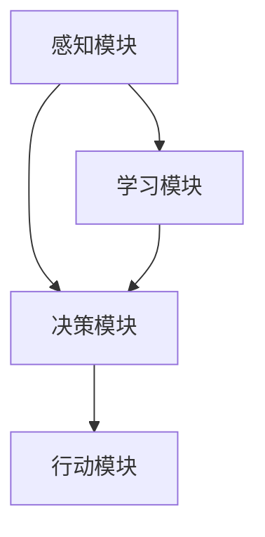

                 

关键词：人工智能，AI Agent，技术前沿，未来展望，智能进化

在人工智能（AI）领域，我们已经见证了许多令人惊叹的进步，从简单的自动化任务到复杂的决策支持系统，AI正在迅速渗透到我们日常生活的方方面面。然而，技术发展的浪潮总是不断向前推进，新的风口正在涌现。本文将探讨AI Agent——人工智能的下一个风口，以及其在技术边界与未来无限中的应用。

## 1. 背景介绍

### AI Agent的概念

AI Agent，即人工智能代理，是一种能够自主行动、与环境交互并实现特定目标的计算实体。与传统的人工智能系统不同，AI Agent具有更强的自主性和适应性，能够在不确定的环境中学习和优化其行为。这种概念源于对人类智能的模仿，人类智能的特点之一就是能够自主地解决问题，而不是简单地执行预设的任务。

### AI Agent的发展历程

AI Agent的概念虽然已经存在了多年，但真正的快速发展是在近年来，随着深度学习、强化学习和自然语言处理等技术的发展，AI Agent开始逐渐具备了实现自主行动的能力。例如，深度强化学习（Deep Reinforcement Learning）为AI Agent提供了强大的学习机制，使其能够在复杂环境中通过试错和反馈不断优化其行为。

## 2. 核心概念与联系

### 2.1 AI Agent的基本架构

AI Agent通常由以下几个部分组成：

- **感知模块（Perception Module）**：负责接收和处理环境信息，如视觉、听觉、触觉等。
- **决策模块（Decision Module）**：根据感知模块收集的信息，生成行动方案。
- **行动模块（Action Module）**：执行决策模块生成的行动方案。
- **学习模块（Learning Module）**：通过不断学习和优化，提高AI Agent的适应性和效率。

下面是一个简化的Mermaid流程图，展示了AI Agent的基本架构：



### 2.2 AI Agent的核心原理

AI Agent的核心原理包括：

- **状态空间（State Space）**：AI Agent需要能够定义其操作的环境，即状态空间。
- **行动空间（Action Space）**：AI Agent可以采取的所有可能行动的集合。
- **奖励机制（Reward Mechanism）**：环境对AI Agent行动的反馈，用于评估AI Agent的行为。
- **学习算法（Learning Algorithm）**：AI Agent通过学习算法，从环境中学习并优化其行为。

### 2.3 AI Agent与传统AI的区别

与传统AI系统相比，AI Agent具有以下几个显著特点：

- **自主性**：AI Agent可以自主地选择行动，而不仅仅是执行预设的任务。
- **适应性**：AI Agent能够在不确定和变化的环境中适应和优化其行为。
- **灵活性**：AI Agent可以根据不同的环境和目标，灵活调整其行动策略。

## 3. 核心算法原理 & 具体操作步骤

### 3.1 算法原理概述

AI Agent的核心算法原理主要包括以下几种：

- **深度学习（Deep Learning）**：通过多层神经网络，实现对复杂数据的自动特征提取和学习。
- **强化学习（Reinforcement Learning）**：通过与环境交互，通过试错和奖励机制，不断优化行动策略。
- **自然语言处理（Natural Language Processing）**：通过深度学习模型，实现对自然语言的理解和生成。

### 3.2 算法步骤详解

AI Agent的具体操作步骤可以概括为：

1. **初始化**：定义状态空间、行动空间和学习算法。
2. **感知环境**：通过感知模块收集环境信息。
3. **决策**：通过决策模块，根据当前状态和奖励机制，生成行动方案。
4. **行动**：通过行动模块，执行决策模块生成的行动。
5. **学习**：通过学习模块，根据行动结果和环境反馈，优化行为策略。

### 3.3 算法优缺点

- **优点**：AI Agent能够自主地适应和优化行为，具有很高的灵活性和自主性。
- **缺点**：AI Agent在初始阶段可能需要大量的训练数据和计算资源，且在某些特定环境中可能表现出局限性。

### 3.4 算法应用领域

AI Agent的应用领域非常广泛，包括：

- **游戏**：如《星际争霸》、《Dota2》等。
- **机器人**：如智能家居、无人驾驶等。
- **金融**：如智能投顾、风险评估等。
- **医疗**：如疾病预测、医疗决策支持等。

## 4. 数学模型和公式 & 详细讲解 & 举例说明

### 4.1 数学模型构建

AI Agent的数学模型主要包括以下几个部分：

- **状态表示（State Representation）**：使用向量表示环境状态。
- **行动表示（Action Representation）**：使用向量表示可能的行动。
- **奖励函数（Reward Function）**：定义环境对行动的奖励。

### 4.2 公式推导过程

以强化学习为例，其核心公式为：

$$ Q(s, a) = \sum_{s'} P(s' | s, a) \cdot R(s', a) + \gamma \cdot \max_{a'} Q(s', a') $$

其中：

- \( Q(s, a) \) 是状态 \( s \) 下采取行动 \( a \) 的期望回报。
- \( P(s' | s, a) \) 是在状态 \( s \) 下采取行动 \( a \) 后转移到状态 \( s' \) 的概率。
- \( R(s', a) \) 是在状态 \( s' \) 下采取行动 \( a \) 的即时回报。
- \( \gamma \) 是折扣因子，用于平衡短期和长期奖励。
- \( \max_{a'} Q(s', a') \) 是在状态 \( s' \) 下采取最优行动的期望回报。

### 4.3 案例分析与讲解

假设一个简单的游戏环境，玩家需要在一条长度为 \( n \) 的走廊中寻找宝藏。走廊中每个位置都有一个相应的奖励值，玩家每走一步都会获得该位置的奖励值。玩家的目标是最大化总奖励。

状态空间：\( S = \{0, 1, \ldots, n\} \)

行动空间：\( A = \{\text{left}, \text{right}\} \)

奖励函数：\( R(s') = 10 \)（如果找到了宝藏，即 \( s' = n \)，否则为 0）

初始状态：\( s_0 = 0 \)

折扣因子：\( \gamma = 0.9 \)

玩家在每一步都会根据当前状态和奖励函数，使用 Q-learning 算法更新其策略。

经过多次迭代后，玩家会逐渐学会选择最优的行动策略，即走奖励值更高的方向。

## 5. 项目实践：代码实例和详细解释说明

### 5.1 开发环境搭建

为了实践AI Agent，我们选择Python作为编程语言，并使用TensorFlow作为深度学习框架。以下是开发环境的搭建步骤：

1. 安装Python 3.7及以上版本。
2. 安装TensorFlow：`pip install tensorflow`
3. 安装其他依赖库：`pip install numpy matplotlib`

### 5.2 源代码详细实现

以下是实现一个简单的AI Agent——基于深度Q网络的迷宫求解器的代码：

```python
import numpy as np
import random
import matplotlib.pyplot as plt
from tensorflow.keras.models import Sequential
from tensorflow.keras.layers import Dense

# 游戏环境参数
n = 5
s = np.random.randint(0, n+1)
a = np.random.randint(0, 2)
r = 10 if s == n else 0
gamma = 0.9

# 深度Q网络模型
model = Sequential()
model.add(Dense(64, input_dim=n, activation='relu'))
model.add(Dense(64, activation='relu'))
model.add(Dense(2, activation='linear'))
model.compile(loss='mse', optimizer='adam')

# 训练模型
for epoch in range(1000):
    state = s
    done = False
    while not done:
        action = np.argmax(model.predict(state.reshape(1, n)))
        next_state, reward, done = step(state, action)
        target = reward + gamma * np.max(model.predict(next_state.reshape(1, n)))
        model.fit(state.reshape(1, n), np.array([[target, reward]]), epochs=1, verbose=0)
        state = next_state

# 测试模型
state = s
done = False
while not done:
    action = np.argmax(model.predict(state.reshape(1, n)))
    state, reward, done = step(state, action)
    print(f"Action: {action}, Reward: {reward}, State: {state}")

# 游戏环境步骤
def step(state, action):
    if action == 0:  # 向左走
        next_state = state - 1
        if next_state < 0:
            next_state = 0
    else:  # 向右走
        next_state = state + 1
        if next_state > n:
            next_state = n
    reward = 10 if next_state == n else 0
    done = next_state == n
    return next_state, reward, done

# 游戏环境可视化
def visualize_game():
    states = [0, 1, 2, 3, 4, 5]
    rewards = [0, 0, 0, 0, 10, 0]
    plt.bar(states, rewards)
    plt.xlabel('State')
    plt.ylabel('Reward')
    plt.title('Game Environment')
    plt.show()

visualize_game()
```

### 5.3 代码解读与分析

- **环境参数**：定义了迷宫的大小（n）和初始状态（s）。
- **深度Q网络模型**：使用序列模型（Sequential）搭建深度Q网络，并编译模型。
- **训练模型**：使用Q-learning算法训练深度Q网络，通过迭代更新模型。
- **测试模型**：使用训练好的模型进行测试，并输出每个步骤的行动、奖励和状态。
- **游戏环境步骤**：定义了游戏环境的步骤函数，包括向左走和向右走的动作。
- **游戏环境可视化**：使用matplotlib绘制游戏环境，展示每个状态和对应的奖励。

## 6. 实际应用场景

### 6.1 游戏

AI Agent在游戏领域具有广泛的应用，如《星际争霸》、《Dota2》等。通过深度强化学习，AI Agent可以学会复杂的策略和决策，实现高水平的游戏体验。

### 6.2 机器人

AI Agent在机器人领域也有重要应用，如智能家居、无人驾驶等。通过感知模块和行动模块，AI Agent可以与物理环境进行交互，实现自主行动和任务执行。

### 6.3 金融

AI Agent在金融领域可以用于智能投顾、风险评估等。通过分析市场数据和用户偏好，AI Agent可以为用户提供个性化的投资建议和风险控制策略。

### 6.4 医疗

AI Agent在医疗领域可以用于疾病预测、医疗决策支持等。通过分析医疗数据和患者信息，AI Agent可以为医生提供辅助决策，提高医疗服务的质量和效率。

## 7. 工具和资源推荐

### 7.1 学习资源推荐

- 《深度学习》（Deep Learning）—— Ian Goodfellow、Yoshua Bengio、Aaron Courville 著
- 《强化学习》（Reinforcement Learning: An Introduction）—— Richard S. Sutton、Andrew G. Barto 著
- 《自然语言处理综论》（Speech and Language Processing）—— Daniel Jurafsky、James H. Martin 著

### 7.2 开发工具推荐

- TensorFlow：用于构建和训练深度学习模型。
- Keras：用于简化TensorFlow的使用。
- OpenAI Gym：用于创建和测试游戏环境。

### 7.3 相关论文推荐

- "Deep Q-Network" —— Volodymyr Mnih等人
- "Human-level control through deep reinforcement learning" —— DeepMind 团队
- "BERT: Pre-training of Deep Bidirectional Transformers for Language Understanding" —— Google AI 团队

## 8. 总结：未来发展趋势与挑战

### 8.1 研究成果总结

AI Agent作为人工智能的重要分支，已经取得了显著的成果。通过深度学习、强化学习和自然语言处理等技术的结合，AI Agent在游戏、机器人、金融和医疗等领域具有广泛的应用前景。

### 8.2 未来发展趋势

未来，AI Agent将继续向自主性、灵活性和适应性方向发展。随着硬件性能的提升和算法的优化，AI Agent将在更多复杂和不确定的环境中发挥作用。

### 8.3 面临的挑战

然而，AI Agent也面临一些挑战，包括：

- **计算资源**：训练和优化AI Agent需要大量的计算资源，这对资源有限的开发者来说是一个挑战。
- **数据隐私**：AI Agent在处理用户数据时，需要确保数据的安全和隐私。
- **伦理问题**：AI Agent的行为可能会对社会产生深远的影响，如何确保其行为符合伦理标准是一个重要问题。

### 8.4 研究展望

未来，研究将重点关注AI Agent在复杂和不确定环境中的表现，以及如何提高其自主性和适应性。此外，跨学科的研究也将成为趋势，结合心理学、认知科学和计算机科学等领域的知识，为AI Agent的发展提供新的思路。

## 9. 附录：常见问题与解答

### Q：AI Agent与传统AI系统的区别是什么？

A：AI Agent与传统AI系统的区别在于其自主性和适应性。AI Agent能够自主地适应和优化行为，而传统AI系统则依赖于预设的规则和模型。

### Q：AI Agent在哪些领域有重要应用？

A：AI Agent在游戏、机器人、金融和医疗等领域具有广泛的应用前景。通过感知模块和行动模块，AI Agent可以与物理环境进行交互，实现自主行动和任务执行。

### Q：如何训练一个AI Agent？

A：训练AI Agent通常涉及以下几个步骤：

1. 定义状态空间、行动空间和学习算法。
2. 收集和处理训练数据。
3. 使用学习算法（如深度学习、强化学习）训练模型。
4. 评估和优化模型性能。

### Q：AI Agent是否会取代人类？

A：AI Agent可以辅助人类完成任务，但取代人类是一个复杂的问题。AI Agent在特定领域具有优势，但在情感、创造性和复杂性方面仍然无法与人类相比。

## 结论

AI Agent作为人工智能的下一个风口，具有巨大的发展潜力。通过不断学习和优化，AI Agent将在未来发挥越来越重要的作用。本文对AI Agent的核心概念、算法原理、应用场景和发展趋势进行了深入探讨，希望为读者提供有价值的参考。

### 作者署名

作者：禅与计算机程序设计艺术 / Zen and the Art of Computer Programming

----------------------------------------------------------------

以上就是完整的文章内容，感谢您的阅读。希望这篇文章能够为读者在人工智能领域提供新的视角和思考。如有任何建议或反馈，请随时告知。再次感谢！

