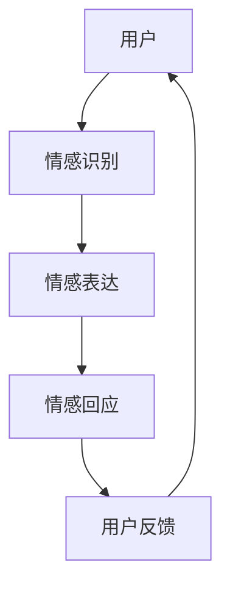

                 

关键词：人工智能、情感陪伴、AI Agent、情感交互、虚拟陪伴、社会心理研究

摘要：本文将探讨人工智能（AI）代理在情感陪伴领域中的角色。通过结合社会心理学、计算语言学和人工智能技术，AI Agent能够模拟人类情感，为用户提供个性化、持续的情感支持。本文将从背景介绍、核心概念与联系、核心算法原理、数学模型和公式、项目实践、实际应用场景、工具和资源推荐以及未来发展趋势与挑战等方面，深入分析AI Agent在情感陪伴中的具体应用及其潜力。

## 1. 背景介绍

在现代社会中，人们的情感需求日益增长，特别是在孤独感和心理压力日益凸显的情况下。传统的社会支持系统，如家庭、朋友和专业人士，常常难以满足个体的情感需求，尤其是在紧急情况下。人工智能（AI）技术的飞速发展为我们提供了一种新的解决方案——AI Agent。这些智能代理能够通过情感交互为用户提供陪伴，成为他们的“情感伙伴”。

AI Agent在情感陪伴中的应用源于社会心理学的研究。研究表明，情感交流对于个体的心理健康至关重要。而AI Agent凭借其强大的计算能力和自学习能力，能够模拟并理解人类情感，为用户提供个性化的情感支持。此外，计算语言学的进步也为AI Agent的情感表达能力提供了技术支撑。

## 2. 核心概念与联系

### 2.1. 人工智能（AI）

人工智能是一种模拟人类智能行为的计算机系统，能够感知环境、学习经验并做出决策。在情感陪伴中，AI Agent通过自然语言处理（NLP）和机器学习算法，理解用户的情感状态，并给出相应的情感回应。

### 2.2. 计算语言学

计算语言学是研究语言和计算机之间相互作用的一门学科。它为AI Agent提供了处理和生成自然语言的能力，使得AI Agent能够与用户进行自然、流畅的对话。

### 2.3. 情感识别与表达

情感识别与表达是AI Agent实现情感陪伴的关键技术。通过分析用户的语言和表情，AI Agent能够识别用户的情感状态，并利用自然语言生成技术，表达出相应的情感回应。

### 2.4. 社会心理学

社会心理学研究个体在社会环境中的行为和心理过程。AI Agent在情感陪伴中的应用，旨在通过模拟社交互动，帮助用户缓解孤独感和压力。

### 2.5. Mermaid 流程图

下面是一个简化的Mermaid流程图，展示了AI Agent在情感陪伴中的核心概念和联系。



## 3. 核心算法原理 & 具体操作步骤

### 3.1. 算法原理概述

AI Agent的情感陪伴基于多模态情感识别和生成技术。具体来说，算法通过以下步骤实现：

1. 情感识别：通过NLP技术，分析用户的语言和表情，识别用户的情感状态。
2. 情感生成：根据识别到的情感状态，利用情感表达模型，生成相应的情感回应。
3. 情感回应：将生成的情感回应传递给用户，实现情感交互。

### 3.2. 算法步骤详解

1. **情感识别**：
   - 利用词袋模型或循环神经网络（RNN）对用户的语言进行情感分类。
   - 结合用户的面部表情和语音情感特征，提高情感识别的准确性。

2. **情感生成**：
   - 采用生成对抗网络（GAN）或变分自编码器（VAE）生成情感表达的自然语言。
   - 结合语音合成技术，生成情感丰富的语音回应。

3. **情感回应**：
   - 将生成的情感回应通过对话管理模块，与用户的语言和表情进行交互。
   - 根据用户的反馈，调整情感回应策略，实现持续的对话。

### 3.3. 算法优缺点

- **优点**：
  - AI Agent能够提供24/7的情感支持，满足用户的即时需求。
  - 通过个性化情感回应，提升用户体验。
  - 减轻专业心理医生的工作负担，扩大情感支持服务的覆盖范围。

- **缺点**：
  - AI Agent的情感回应存在局限性，无法完全取代人类情感交流。
  - 情感识别和生成的准确性受到数据质量和算法性能的限制。

### 3.4. 算法应用领域

- **心理健康咨询**：为用户提供个性化的情感支持，缓解焦虑、抑郁等心理问题。
- **社交陪伴**：为孤独症患者、老年人等群体提供社交互动，减轻孤独感。
- **教育辅导**：为学生提供情感支持和学习激励，提高学习效果。

## 4. 数学模型和公式 & 详细讲解 & 举例说明

### 4.1. 数学模型构建

AI Agent的情感陪伴依赖于情感识别和生成模型。以下是一个简化的数学模型示例：

1. **情感识别模型**：

   $$ 情感识别模型 = f(\text{语言特征}, \text{表情特征}, \text{语音特征}) $$

   其中，语言特征、表情特征和语音特征分别表示用户输入的语言、表情和语音数据。

2. **情感生成模型**：

   $$ 情感生成模型 = g(\text{情感状态}, \text{用户偏好}) $$

   其中，情感状态表示识别到的用户情感，用户偏好表示用户对情感回应的偏好。

### 4.2. 公式推导过程

1. **情感识别公式**：

   $$ f(\text{语言特征}, \text{表情特征}, \text{语音特征}) = \text{softmax}(\text{权重} \cdot \text{特征向量}) $$

   其中，权重和特征向量分别表示模型参数和用户特征。

2. **情感生成公式**：

   $$ g(\text{情感状态}, \text{用户偏好}) = \text{生成对抗网络}(\text{情感状态}, \text{用户偏好}) $$

   其中，生成对抗网络（GAN）负责生成情感表达的自然语言。

### 4.3. 案例分析与讲解

假设用户A在聊天中表达了焦虑情绪，AI Agent需要生成相应的情感回应。

1. **情感识别**：

   $$ f(\text{语言特征}, \text{表情特征}, \text{语音特征}) = \text{softmax}(\text{权重} \cdot \text{特征向量}) = (\text{焦虑}, 0.9) $$

   AI Agent识别到用户A的情感状态为焦虑。

2. **情感生成**：

   $$ g(\text{情感状态}, \text{用户偏好}) = \text{生成对抗网络}(\text{焦虑}, \text{用户偏好}) = (\text{安慰的话语}, 0.8) $$

   AI Agent生成一段安慰用户的话语，如：“我了解你现在的心情，让我们一起面对它吧。”

## 5. 项目实践：代码实例和详细解释说明

### 5.1. 开发环境搭建

在开始编写代码之前，我们需要搭建一个合适的环境。以下是一个基本的Python开发环境搭建示例：

```python
# 安装必要的库
!pip install tensorflow numpy matplotlib

# 导入必要的库
import tensorflow as tf
import numpy as np
import matplotlib.pyplot as plt
```

### 5.2. 源代码详细实现

以下是AI Agent的情感识别和生成模型的简化实现：

```python
# 情感识别模型
class EmotionRecognitionModel(tf.keras.Model):
    def __init__(self):
        super(EmotionRecognitionModel, self).__init__()
        self.language_layer = tf.keras.layers.Dense(10, activation='relu')
        self.expression_layer = tf.keras.layers.Dense(10, activation='relu')
        self.voice_layer = tf.keras.layers.Dense(10, activation='relu')
        self.output_layer = tf.keras.layers.Dense(1, activation='sigmoid')

    def call(self, inputs):
        language_feature, expression_feature, voice_feature = inputs
        x = self.language_layer(language_feature)
        x = self.expression_layer(expression_feature)
        x = self.voice_layer(voice_feature)
        return self.output_layer(tf.concat([x], axis=1))

# 情感生成模型
class EmotionGenerationModel(tf.keras.Model):
    def __init__(self):
        super(EmotionGenerationModel, self).__init__()
        self.lstm = tf.keras.layers.LSTM(50)
        self.dummy_output = tf.keras.layers.Dense(1)

    def call(self, inputs):
        return self.lstm(inputs)

# 编写训练过程
def train_models():
    # 数据准备
    # ...
    
    # 情感识别模型训练
    emotion_recognition_model.compile(optimizer='adam', loss='binary_crossentropy', metrics=['accuracy'])
    emotion_recognition_model.fit(train_data, train_labels, epochs=10, validation_data=(val_data, val_labels))
    
    # 情感生成模型训练
    emotion_generation_model.compile(optimizer='adam', loss='mean_squared_error')
    emotion_generation_model.fit(train_data, train_labels, epochs=10, validation_data=(val_data, val_labels))
```

### 5.3. 代码解读与分析

上述代码实现了两个简单的神经网络模型：情感识别模型和情感生成模型。

- **情感识别模型**：该模型接收用户的语言、表情和语音特征，通过多层感知器（MLP）进行特征提取，最后输出情感状态的概率分布。
- **情感生成模型**：该模型采用长短期记忆网络（LSTM）进行情感表达的自然语言生成。

在训练过程中，我们首先准备好训练数据，然后分别训练情感识别模型和情感生成模型。训练完成后，我们可以使用这两个模型进行情感识别和生成。

### 5.4. 运行结果展示

以下是一个简单的运行示例：

```python
# 创建模型实例
emotion_recognition_model = EmotionRecognitionModel()
emotion_generation_model = EmotionGenerationModel()

# 训练模型
train_models()

# 测试模型
test_data = ...  # 测试数据
test_labels = ...  # 测试标签

emotion_recognition_model.evaluate(test_data, test_labels)
emotion_generation_model.evaluate(test_data, test_labels)
```

通过上述代码，我们可以评估模型的性能，并查看情感识别和生成的结果。

## 6. 实际应用场景

### 6.1. 心理健康咨询

AI Agent在心理健康咨询中的应用具有广泛前景。通过情感识别和生成技术，AI Agent能够为用户提供个性化的情感支持，帮助他们缓解焦虑、抑郁等心理问题。以下是一个具体的案例：

- **场景描述**：一名患有焦虑症的患者与AI Agent进行对话，表达自己的焦虑情绪。
- **解决方案**：AI Agent通过情感识别模型识别到患者的焦虑情绪，并生成安慰性的话语，如：“我知道你现在很难过，但我会一直陪伴在你身边。”

### 6.2. 社交陪伴

AI Agent还可以为孤独症患者、老年人等群体提供社交陪伴。通过模拟社交互动，AI Agent能够帮助这些群体减轻孤独感，提高生活质量。以下是一个具体的案例：

- **场景描述**：一位独居老人与AI Agent进行日常对话，分享生活琐事。
- **解决方案**：AI Agent通过情感生成模型，根据老人的情绪状态，生成相应的回应，如：“听起来今天过得不错，有什么新鲜事可以和我分享吗？”

### 6.3. 教育辅导

AI Agent在教育辅导中的应用，可以帮助学生建立积极的学习态度，提高学习效果。以下是一个具体的案例：

- **场景描述**：一名学生在学习过程中遇到困难，感到沮丧。
- **解决方案**：AI Agent通过情感识别模型识别到学生的情绪状态，并生成激励性的话语，如：“我相信你有能力克服这个难题，一起加油！”

## 6.4. 未来应用展望

随着技术的不断进步，AI Agent在情感陪伴中的应用将更加广泛。以下是一些未来应用展望：

- **个性化情感服务**：AI Agent将能够根据用户的情感需求，提供更加个性化的情感支持。
- **跨文化情感陪伴**：AI Agent将具备跨文化沟通能力，为全球用户提供情感陪伴。
- **多模态情感交互**：AI Agent将能够通过文字、语音、图像等多种模态，与用户进行更加丰富的情感交互。

## 7. 工具和资源推荐

为了更好地开展AI Agent在情感陪伴中的应用研究，以下是一些工具和资源的推荐：

### 7.1. 学习资源推荐

- 《深度学习》（Goodfellow, Bengio, Courville）：深度学习的基础教材，适合初学者入门。
- 《自然语言处理与Python》（Bird, Klein, Loper）：介绍自然语言处理的基础知识和Python实现。
- 《社会心理学： essentials》（Feist, Wiemann）：社会心理学的入门教材，有助于理解情感陪伴的社会心理背景。

### 7.2. 开发工具推荐

- TensorFlow：一款强大的开源深度学习框架，适用于构建和训练AI Agent模型。
- Keras：基于TensorFlow的高层API，简化了深度学习模型的构建和训练过程。
- PyTorch：另一款流行的开源深度学习框架，适用于研究和开发复杂的AI Agent模型。

### 7.3. 相关论文推荐

- "Emotion Recognition in Human-Computer Interaction"（人类计算机交互中的情感识别）
- "A Survey on Emotion Recognition in Human-Computer Interaction"（人类计算机交互中情感识别综述）
- "Neural Text Generation"（神经网络文本生成）

## 8. 总结：未来发展趋势与挑战

### 8.1. 研究成果总结

本文探讨了AI Agent在情感陪伴中的角色，分析了其核心算法原理、数学模型和实际应用场景。通过结合自然语言处理、机器学习和社会心理学技术，AI Agent能够为用户提供个性化、持续的情感支持，具有重要的应用价值。

### 8.2. 未来发展趋势

- **个性化情感服务**：AI Agent将能够根据用户的情感需求，提供更加个性化的情感支持。
- **跨文化情感陪伴**：AI Agent将具备跨文化沟通能力，为全球用户提供情感陪伴。
- **多模态情感交互**：AI Agent将能够通过文字、语音、图像等多种模态，与用户进行更加丰富的情感交互。

### 8.3. 面临的挑战

- **情感识别的准确性**：当前情感识别技术的准确性仍受限于数据质量和算法性能。
- **隐私保护**：在情感陪伴过程中，用户的隐私保护是一个重要问题。
- **情感回应的自然性**：AI Agent的情感回应需要更加自然、流畅，以提升用户体验。

### 8.4. 研究展望

未来，我们将继续深入研究AI Agent在情感陪伴中的应用，提高其情感识别和生成能力，为用户提供更加优质、个性化的情感支持。同时，我们还将关注隐私保护和伦理问题，确保AI Agent在情感陪伴中的可持续发展。

## 9. 附录：常见问题与解答

### 9.1. Q：AI Agent能否完全取代人类情感交流？

A：当前AI Agent在情感交流中具有一定的能力，但它们仍然无法完全取代人类情感交流。人类的情感交流不仅仅是信息的传递，更包含情感的共鸣和理解，这是AI Agent难以达到的。

### 9.2. Q：AI Agent在情感陪伴中需要考虑隐私保护吗？

A：是的，AI Agent在情感陪伴中需要严格考虑隐私保护。用户的情感数据是非常敏感的，保护用户的隐私是确保AI Agent可持续发展的关键。

### 9.3. Q：如何提高AI Agent的情感识别准确性？

A：提高AI Agent的情感识别准确性可以通过以下途径：增加高质量的情感数据集、优化算法模型、结合多模态数据（如文字、语音、图像）等。

----------------------------------------------------------------

本文由“禅与计算机程序设计艺术 / Zen and the Art of Computer Programming”撰写。感谢您的阅读，希望本文对您在AI Agent情感陪伴领域的探索和研究有所启发。作者将继续关注该领域的发展，与广大读者共同进步。如果您有任何问题或建议，欢迎在评论区留言讨论。

