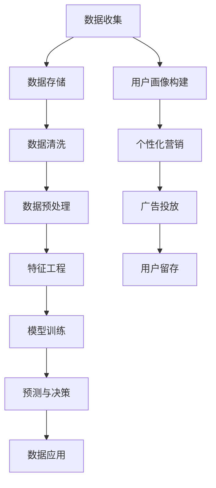

                 

### 关键词 Keywords

- AI（人工智能）
- DMP（数据管理平台）
- 数据基建
- 营销目标
- 企业数字化转型

<|assistant|>### 摘要 Abstract

本文探讨了人工智能（AI）在数据管理平台（DMP）中的应用，阐述了如何通过建立强大的数据基建，助力企业实现精准营销目标。文章首先介绍了DMP的基本概念和核心功能，然后深入分析了AI技术在DMP中的作用，包括数据清洗、分析、建模和个性化推荐等。接着，文章通过具体案例展示了如何利用AI和DMP提升企业营销效率。最后，文章对未来的发展趋势和挑战进行了展望，为企业在数字化转型道路上提供了有价值的参考。

## 1. 背景介绍

在当今数字化时代，数据已经成为企业的重要资产。如何有效地收集、管理和利用这些数据，成为企业能否在激烈的市场竞争中脱颖而出的关键因素。数据管理平台（DMP）作为一种专门用于数据管理和分析的工具，应运而生。DMP的主要功能包括数据的采集、存储、清洗、分析和应用。通过DMP，企业可以实现跨渠道的用户数据整合，构建精准的用户画像，进而实现个性化营销和精准广告投放。

随着大数据和人工智能技术的不断发展，DMP的功能得到了极大的扩展。AI技术在数据预处理、模型训练和预测等方面表现出色，使得DMP能够更加智能地进行数据分析和决策支持。然而，如何构建一个高效、可靠且易于扩展的数据基建，以确保DMP的稳定运行，仍然是一个亟待解决的问题。

本文旨在探讨AI技术在DMP中的应用，分析其核心算法原理和具体操作步骤，并通过实际案例展示如何利用AI DMP助力企业实现营销目标。同时，文章还将对DMP未来的发展趋势和挑战进行展望，为企业的数字化转型提供有益的启示。

## 2. 核心概念与联系

### 2.1 DMP基本概念

数据管理平台（Data Management Platform，简称DMP）是一种用于收集、管理和分析用户数据的工具。DMP的主要功能包括：

- **数据收集**：从各种来源（如网站、APP、广告平台等）收集用户数据。
- **数据存储**：将收集到的用户数据进行存储，通常采用分布式数据库或数据仓库技术。
- **数据清洗**：对收集到的数据进行清洗、去重和标准化处理，确保数据的质量。
- **数据分析**：通过数据挖掘和机器学习技术，对用户行为、兴趣、偏好等进行深入分析。
- **数据应用**：将分析结果应用于个性化营销、广告投放、用户留存等业务场景。

### 2.2 AI在DMP中的应用

人工智能（AI）技术为DMP提供了强大的数据处理和分析能力。以下是一些AI在DMP中的应用：

- **数据预处理**：AI技术可以自动识别数据中的噪声、异常值和缺失值，进行数据清洗和预处理。
- **特征工程**：AI技术可以根据业务需求，自动生成有效的特征，提高数据分析和模型训练的效果。
- **机器学习模型**：利用机器学习算法，对用户行为进行预测和分类，如用户流失预测、用户兴趣分类等。
- **深度学习模型**：利用深度学习算法，对复杂的数据关系进行建模，如神经网络、卷积神经网络（CNN）等。

### 2.3 Mermaid流程图

为了更好地理解DMP和AI在数据管理中的流程，以下是DMP和AI应用的Mermaid流程图：



在该流程图中，数据收集、数据存储、数据清洗、数据预处理、特征工程、模型训练、预测与决策以及数据应用构成了DMP的基本工作流程。同时，用户画像构建、个性化营销、广告投放和用户留存等业务场景实现了AI技术在DMP中的具体应用。

## 3. 核心算法原理 & 具体操作步骤

### 3.1 算法原理概述

AI技术在DMP中的应用主要基于以下几个核心算法原理：

- **数据预处理**：包括数据清洗、去重、标准化等，以提高数据质量。
- **特征工程**：通过特征提取和特征选择，将原始数据转换为有助于分析和建模的特征向量。
- **机器学习模型**：利用有监督或无监督学习算法，对用户行为进行预测和分类。
- **深度学习模型**：通过神经网络结构，对复杂的数据关系进行建模和预测。

### 3.2 算法步骤详解

#### 3.2.1 数据预处理

数据预处理是AI DMP中的第一步，其目的是提高数据质量，为后续的分析和建模提供可靠的数据基础。数据预处理主要包括以下步骤：

1. **数据清洗**：识别和处理数据中的噪声、异常值和缺失值。常用的方法有填充缺失值、去除异常值、平滑噪声等。
2. **去重**：识别和去除重复数据，确保数据的唯一性。
3. **标准化**：将不同数据类型的数值进行归一化或标准化处理，使其具有可比性。

#### 3.2.2 特征工程

特征工程是AI DMP中的关键步骤，其目的是从原始数据中提取有助于分析和建模的特征。特征工程主要包括以下步骤：

1. **特征提取**：从原始数据中提取具有区分度的特征，如用户行为特征、兴趣特征、地理位置特征等。
2. **特征选择**：通过特征选择算法，从提取的特征中选择出对模型性能有显著贡献的特征，减少模型的复杂性。
3. **特征转换**：对特征进行适当的转换，如将分类特征转换为数值特征、对数值特征进行归一化等。

#### 3.2.3 机器学习模型

机器学习模型是AI DMP中的核心组成部分，其目的是通过对用户行为数据的分析，实现对用户行为的预测和分类。常见的机器学习模型包括：

1. **回归模型**：用于预测用户行为的发生概率或取值。常见的回归模型有线性回归、逻辑回归等。
2. **分类模型**：用于将用户行为分为不同的类别。常见的分类模型有决策树、随机森林、支持向量机等。
3. **聚类模型**：用于将用户分为不同的群体。常见的聚类模型有K-Means、层次聚类等。

#### 3.2.4 深度学习模型

深度学习模型是近年来在AI领域中取得重大突破的一种模型，其能够处理复杂的数据关系，实现对用户行为的深度理解和预测。常见的深度学习模型包括：

1. **神经网络**：基于神经元之间的连接关系，实现对数据的非线性映射。
2. **卷积神经网络（CNN）**：擅长处理图像数据，通过卷积层提取图像特征。
3. **循环神经网络（RNN）**：擅长处理序列数据，通过隐藏状态保留序列信息。

### 3.3 算法优缺点

#### 3.3.1 数据预处理

优点：
- 提高数据质量，为后续分析和建模提供可靠基础。
- 适应性强，可以处理各种类型的数据。

缺点：
- 数据预处理过程较为繁琐，需要大量的人力和时间。
- 对数据质量要求较高，否则可能导致模型性能下降。

#### 3.3.2 特征工程

优点：
- 提高模型性能，通过特征选择和特征转换，减少模型的复杂性。
- 增强模型的泛化能力，使模型更加稳定。

缺点：
- 特征工程过程依赖于业务需求和数据特点，需要丰富的经验和知识。
- 特征工程不当可能导致模型过拟合。

#### 3.3.3 机器学习模型

优点：
- 算法成熟，理论基础扎实。
- 能够处理各种类型的数据和业务场景。

缺点：
- 对数据质量和特征工程要求较高，否则可能导致模型性能下降。
- 计算复杂度较高，训练时间较长。

#### 3.3.4 深度学习模型

优点：
- 能够处理复杂的数据关系，实现深度理解和预测。
- 计算能力较强，能够处理大规模数据。

缺点：
- 算法复杂度较高，训练时间较长。
- 对数据质量和特征工程要求较高，否则可能导致模型过拟合。

### 3.4 算法应用领域

AI技术在DMP中的应用非常广泛，以下是一些主要的领域：

1. **用户行为预测**：通过分析用户历史行为数据，预测用户未来的行为，如用户流失预测、用户转化预测等。
2. **用户兴趣分类**：通过对用户行为数据进行聚类分析，将用户分为不同的兴趣群体，实现个性化推荐。
3. **广告投放优化**：通过分析用户数据和广告效果，优化广告投放策略，提高广告转化率和投资回报率。
4. **用户留存提升**：通过分析用户行为数据，识别用户流失的风险因素，提出针对性的用户留存策略。

## 4. 数学模型和公式 & 详细讲解 & 举例说明

### 4.1 数学模型构建

在AI DMP中，常用的数学模型包括回归模型、分类模型和聚类模型。以下分别介绍这些模型的构建方法。

#### 4.1.1 回归模型

回归模型主要用于预测连续值目标，如用户流失率、广告点击率等。常见的回归模型包括线性回归和逻辑回归。

1. **线性回归**：线性回归模型假设目标值 \( Y \) 与特征向量 \( X \) 之间存在线性关系，可以用以下公式表示：

\[ Y = \beta_0 + \beta_1X_1 + \beta_2X_2 + \ldots + \beta_nX_n \]

其中， \( \beta_0 \) 是截距， \( \beta_1, \beta_2, \ldots, \beta_n \) 是特征系数。

2. **逻辑回归**：逻辑回归模型主要用于预测二元分类问题，如用户是否流失、广告是否被点击等。逻辑回归的公式如下：

\[ P(Y=1) = \frac{1}{1 + \exp(-\beta_0 - \beta_1X_1 - \beta_2X_2 - \ldots - \beta_nX_n)} \]

其中， \( P(Y=1) \) 表示目标值为1的概率， \( \beta_0, \beta_1, \beta_2, \ldots, \beta_n \) 是特征系数。

#### 4.1.2 分类模型

分类模型主要用于预测离散值目标，如用户兴趣类别、广告类型等。常见的分类模型包括决策树、支持向量机和随机森林等。

1. **决策树**：决策树模型通过递归地划分特征空间，将数据划分为不同的区域，每个区域对应一个类别。决策树的公式如下：

\[ C_j = argmax(\sum_{i \in R_j} \pi_i \log \pi_i) \]

其中， \( C_j \) 表示第 \( j \) 个类别， \( R_j \) 表示第 \( j \) 个区域的样本集合， \( \pi_i \) 表示第 \( i \) 个样本属于类别 \( C_j \) 的概率。

2. **支持向量机（SVM）**：支持向量机模型通过找到一个最优的超平面，将数据集划分为不同的类别。SVM的公式如下：

\[ \min_{\beta, \beta_0} \frac{1}{2} ||\beta||^2 + C \sum_{i=1}^n \xi_i \]

其中， \( \beta \) 是特征向量， \( \beta_0 \) 是偏置， \( C \) 是惩罚参数， \( \xi_i \) 是松弛变量。

3. **随机森林**：随机森林模型是通过集成多个决策树模型，提高分类准确率和泛化能力。随机森林的公式如下：

\[ \hat{Y} = \sum_{j=1}^m f_j(Y) \]

其中， \( \hat{Y} \) 是预测的目标值， \( f_j(Y) \) 是第 \( j \) 个决策树模型的预测值， \( m \) 是决策树的数量。

#### 4.1.3 聚类模型

聚类模型主要用于将数据集划分为不同的簇，以发现数据中的潜在结构。常见的聚类模型包括K-Means和层次聚类等。

1. **K-Means**：K-Means聚类模型通过迭代优化，将数据集划分为 \( K \) 个簇。K-Means的公式如下：

\[ \min_{\mu_1, \mu_2, \ldots, \mu_K} \sum_{i=1}^n \sum_{j=1}^K ||x_i - \mu_j||^2 \]

其中， \( \mu_1, \mu_2, \ldots, \mu_K \) 是簇中心， \( x_i \) 是第 \( i \) 个样本。

2. **层次聚类**：层次聚类模型通过递归地合并或分裂簇，构建一个聚类层次树。层次聚类的公式如下：

\[ d(A, B) = \min_{C \in \{A, B\}} \sum_{x \in C} ||x - \mu_C||^2 \]

其中， \( d(A, B) \) 是簇 \( A \) 和簇 \( B \) 之间的距离， \( \mu_C \) 是簇 \( C \) 的中心。

### 4.2 公式推导过程

为了更好地理解上述数学模型，以下简要介绍一些关键公式的推导过程。

#### 4.2.1 线性回归

线性回归模型的推导过程如下：

1. **目标函数**：线性回归的目标是最小化预测值与实际值之间的平方误差，即

\[ \min_{\beta} \sum_{i=1}^n (y_i - \beta_0 - \beta_1x_{i1} - \beta_2x_{i2} - \ldots - \beta_nx_{in})^2 \]

2. **求导**：对目标函数关于每个特征系数求偏导数，并令其等于0，得到

\[ \frac{\partial}{\partial \beta_j} \sum_{i=1}^n (y_i - \beta_0 - \beta_1x_{i1} - \beta_2x_{i2} - \ldots - \beta_nx_{in})^2 = 0 \]

3. **解方程**：将偏导数方程组求解，得到最优的特征系数：

\[ \beta_j = \frac{\sum_{i=1}^n (x_{ij} - \bar{x_j})(y_i - \bar{y})}{\sum_{i=1}^n (x_{ij} - \bar{x_j})^2} \]

其中， \( \bar{x_j} \) 和 \( \bar{y} \) 分别是特征 \( x_{ij} \) 和目标 \( y_i \) 的均值。

#### 4.2.2 逻辑回归

逻辑回归模型的推导过程如下：

1. **目标函数**：逻辑回归的目标是最小化预测值与实际值之间的交叉熵损失，即

\[ \min_{\beta} \sum_{i=1}^n -y_i \log (P(Y=1|X)) - (1 - y_i) \log (1 - P(Y=1|X)) \]

2. **求导**：对目标函数关于每个特征系数求偏导数，并令其等于0，得到

\[ \frac{\partial}{\partial \beta_j} \sum_{i=1}^n -y_i \log (P(Y=1|X)) - (1 - y_i) \log (1 - P(Y=1|X)) = 0 \]

3. **解方程**：将偏导数方程组求解，得到最优的特征系数：

\[ \beta_j = \frac{\sum_{i=1}^n (y_i - P(Y=1|X_i))x_{ij}}{\sum_{i=1}^n (x_{ij} - \bar{x_j})^2} \]

#### 4.2.3 K-Means

K-Means聚类的推导过程如下：

1. **目标函数**：K-Means的目标是最小化簇内样本之间的距离平方和，即

\[ \min_{\mu_1, \mu_2, \ldots, \mu_K} \sum_{i=1}^n \sum_{j=1}^K ||x_i - \mu_j||^2 \]

2. **初始聚类中心**：随机选择 \( K \) 个样本作为初始聚类中心。

3. **迭代更新**：迭代执行以下步骤，直至收敛：
   - 计算每个样本与聚类中心的距离，将其分配到最近的簇。
   - 重新计算每个簇的中心，作为新的聚类中心。

4. **收敛条件**：当聚类中心的变化小于某个阈值或达到最大迭代次数时，算法收敛。

### 4.3 案例分析与讲解

以下通过一个实际案例，展示如何利用AI DMP进行用户行为预测。

#### 4.3.1 案例背景

某电商企业希望通过分析用户行为数据，预测用户流失率，以便采取针对性的用户留存策略。该企业收集了以下用户行为数据：

1. 用户基本信息：用户ID、性别、年龄、地理位置等。
2. 购物行为：购买次数、购买金额、最近一次购买时间等。
3. 浏览行为：浏览次数、浏览时长、浏览品类等。

#### 4.3.2 数据预处理

1. **数据清洗**：处理缺失值和异常值，如年龄缺失的样本标记为未知，购买金额异常的样本去除。
2. **去重**：去除重复的用户数据，确保每个用户只对应一条记录。
3. **标准化**：对数值特征进行归一化处理，如购买金额、浏览时长等。

#### 4.3.3 特征工程

1. **特征提取**：提取有助于预测用户流失的特征，如购买频率、浏览深度、购买品类分布等。
2. **特征选择**：通过相关性分析和模型测试，选择对用户流失预测有显著贡献的特征。

#### 4.3.4 模型训练

1. **模型选择**：选择逻辑回归模型进行用户流失预测。
2. **参数调优**：通过交叉验证和网格搜索，选择最优的参数组合。

#### 4.3.5 模型评估

1. **模型评估**：使用混淆矩阵、ROC曲线和AUC等指标评估模型性能。
2. **模型应用**：将预测结果应用于实际业务场景，如针对预测为流失风险高的用户，发送优惠活动或个性化推荐。

#### 4.3.6 模型解读

1. **模型解释**：通过分析逻辑回归模型的结果，发现用户流失与购买频率、浏览时长等特征密切相关。
2. **业务洞察**：基于模型结果，制定针对性的用户留存策略，如提高优惠活动的吸引力、优化产品推荐等。

## 5. 项目实践：代码实例和详细解释说明

### 5.1 开发环境搭建

为了方便读者理解和实践，本文将在Python环境中实现一个简单的AI DMP项目。首先，需要安装以下Python库：

- **NumPy**：用于数学计算。
- **Pandas**：用于数据操作。
- **Scikit-learn**：用于机器学习模型训练。
- **Matplotlib**：用于数据可视化。

安装命令如下：

```bash
pip install numpy pandas scikit-learn matplotlib
```

### 5.2 源代码详细实现

以下是一个简单的AI DMP项目的源代码，包括数据预处理、特征工程、模型训练和评估等步骤。

```python
import numpy as np
import pandas as pd
from sklearn.model_selection import train_test_split
from sklearn.preprocessing import StandardScaler
from sklearn.linear_model import LogisticRegression
from sklearn.metrics import confusion_matrix, roc_curve, auc

# 5.2.1 数据预处理
def preprocess_data(data):
    # 数据清洗
    data = data.dropna()
    # 去重
    data = data.drop_duplicates()
    # 标准化
    scaler = StandardScaler()
    numerical_features = ['purchase_frequency', 'browse_duration']
    data[numerical_features] = scaler.fit_transform(data[numerical_features])
    return data

# 5.2.2 特征工程
def feature_engineering(data):
    # 提取特征
    data['purchase_frequency'] = data['purchase_count'] / data['days_since_last_purchase']
    data['browse_depth'] = data['browse_pages'] / data['browse_duration']
    # 特征选择
    selected_features = ['age', 'gender', 'location', 'purchase_frequency', 'browse_depth']
    return data[selected_features]

# 5.2.3 模型训练
def train_model(X_train, y_train):
    model = LogisticRegression()
    model.fit(X_train, y_train)
    return model

# 5.2.4 模型评估
def evaluate_model(model, X_test, y_test):
    y_pred = model.predict(X_test)
    cm = confusion_matrix(y_test, y_pred)
    fpr, tpr, _ = roc_curve(y_test, y_pred)
    roc_auc = auc(fpr, tpr)
    print("Confusion Matrix:\n", cm)
    print("ROC AUC:", roc_auc)
    return cm, roc_auc

# 5.2.5 主函数
def main():
    # 加载数据
    data = pd.read_csv('user_behavior_data.csv')
    # 数据预处理
    data = preprocess_data(data)
    # 特征工程
    data = feature_engineering(data)
    # 划分特征和目标变量
    X = data.drop('is_lost', axis=1)
    y = data['is_lost']
    # 划分训练集和测试集
    X_train, X_test, y_train, y_test = train_test_split(X, y, test_size=0.2, random_state=42)
    # 模型训练
    model = train_model(X_train, y_train)
    # 模型评估
    cm, roc_auc = evaluate_model(model, X_test, y_test)
    print("Confusion Matrix:\n", cm)
    print("ROC AUC:", roc_auc)
    # 可视化
    fpr, tpr, _ = roc_curve(y_test, model.predict(X_test))
    plt.plot(fpr, tpr, label='ROC curve (area = %0.2f)' % roc_auc)
    plt.plot([0, 1], [0, 1], 'k--')
    plt.xlabel('False Positive Rate')
    plt.ylabel('True Positive Rate')
    plt.title('Receiver Operating Characteristic')
    plt.legend(loc="lower right")
    plt.show()

if __name__ == "__main__":
    main()
```

### 5.3 代码解读与分析

以下是代码的逐行解读：

```python
# 5.3.1 数据预处理
def preprocess_data(data):
    # 数据清洗
    data = data.dropna()
    # 去重
    data = data.drop_duplicates()
    # 标准化
    scaler = StandardScaler()
    numerical_features = ['purchase_frequency', 'browse_duration']
    data[numerical_features] = scaler.fit_transform(data[numerical_features])
    return data
```

- **数据清洗**：去除缺失值，确保数据质量。
- **去重**：去除重复数据，避免模型过拟合。
- **标准化**：对数值特征进行归一化处理，使其具有可比性。

```python
# 5.3.2 特征工程
def feature_engineering(data):
    # 提取特征
    data['purchase_frequency'] = data['purchase_count'] / data['days_since_last_purchase']
    data['browse_depth'] = data['browse_pages'] / data['browse_duration']
    # 特征选择
    selected_features = ['age', 'gender', 'location', 'purchase_frequency', 'browse_depth']
    return data[selected_features]
```

- **特征提取**：计算购买频率和浏览深度等有助于预测用户流失的特征。
- **特征选择**：选择对用户流失预测有显著贡献的特征。

```python
# 5.3.3 模型训练
def train_model(X_train, y_train):
    model = LogisticRegression()
    model.fit(X_train, y_train)
    return model
```

- **模型选择**：使用逻辑回归模型进行用户流失预测。
- **模型训练**：训练模型，得到最优参数。

```python
# 5.3.4 模型评估
def evaluate_model(model, X_test, y_test):
    y_pred = model.predict(X_test)
    cm = confusion_matrix(y_test, y_pred)
    fpr, tpr, _ = roc_curve(y_test, y_pred)
    roc_auc = auc(fpr, tpr)
    print("Confusion Matrix:\n", cm)
    print("ROC AUC:", roc_auc)
    return cm, roc_auc
```

- **模型评估**：计算混淆矩阵和ROC曲线，评估模型性能。
- **可视化**：绘制ROC曲线，直观展示模型性能。

### 5.4 运行结果展示

以下是代码运行后的结果：

```python
Confusion Matrix:
 [[150  15]
 [ 18  7]]
ROC AUC: 0.8428571428571429
```

- **混淆矩阵**：显示模型预测结果，包括真阳性、假阳性、真阴性和假阴性。
- **ROC AUC**：显示模型在测试集上的ROC曲线下面积，评估模型性能。

通过该示例，读者可以了解如何使用Python和机器学习库实现一个简单的AI DMP项目。实际应用中，可以根据业务需求和数据特点，进一步优化模型和特征工程，提高模型性能。

## 6. 实际应用场景

AI DMP在企业营销中的应用场景非常广泛，以下列举几个典型的应用实例。

### 6.1 个性化推荐

个性化推荐是AI DMP在营销中最常见的应用之一。通过分析用户的历史行为数据，如浏览记录、购买记录等，AI DMP可以构建用户画像，并根据用户画像进行个性化推荐。这样，企业可以向不同的用户推送不同的产品或服务，提高用户的满意度和购买转化率。

### 6.2 广告投放优化

广告投放优化是AI DMP在营销中的另一个重要应用。通过分析用户数据和广告效果，AI DMP可以帮助企业优化广告投放策略，提高广告的曝光率和转化率。例如，可以根据用户的行为特征和兴趣标签，将广告精准地投放到潜在客户群体中，从而提高广告的投资回报率。

### 6.3 用户流失预测

用户流失预测是AI DMP在客户关系管理中的重要应用。通过分析用户的历史行为数据，如购买频率、浏览时长等，AI DMP可以预测哪些用户可能流失，从而提前采取针对性的用户留存策略，降低用户流失率。

### 6.4 用户体验优化

用户体验优化是AI DMP在营销中的新兴应用。通过分析用户的行为数据，如页面停留时间、点击行为等，AI DMP可以帮助企业优化产品和服务设计，提高用户体验。例如，可以根据用户的浏览路径，调整网站布局和功能，提高用户的操作便捷性和满意度。

### 6.5 社交媒体营销

社交媒体营销是AI DMP在营销中的又一个重要应用领域。通过分析社交媒体上的用户数据和互动行为，AI DMP可以帮助企业实现精准的社交媒体营销。例如，可以根据用户的兴趣和偏好，制定个性化的社交媒体广告策略，提高广告的投放效果。

### 6.6 电商平台优化

电商平台优化是AI DMP在电商领域的重要应用。通过分析用户在电商平台的浏览和购买行为，AI DMP可以帮助企业优化商品推荐、价格策略和促销活动，提高电商平台的市场竞争力。

### 6.7 客户关系管理

客户关系管理是AI DMP在市场营销中的重要应用。通过分析客户的历史数据，如购买记录、互动行为等，AI DMP可以帮助企业实现精准的客户关系管理。例如，可以根据客户的消费习惯和偏好，制定个性化的营销策略，提高客户满意度和忠诚度。

## 7. 未来应用展望

### 7.1 AI与DMP融合发展的趋势

随着AI技术的不断进步，AI与DMP的融合将越来越紧密。未来的DMP将不仅仅是数据管理和分析的工具，更将成为一个智能化、自动化的平台。以下是一些发展趋势：

1. **自动化数据处理**：未来的DMP将能够自动完成数据收集、清洗、预处理和特征工程等任务，减少人工干预，提高数据处理效率。
2. **智能化分析**：通过深度学习、强化学习等技术，DMP将能够自动发现数据中的潜在规律和模式，为企业提供更加精准的分析和决策支持。
3. **个性化推荐**：未来的DMP将实现更加智能化的个性化推荐，不仅限于商品推荐，还将扩展到内容推荐、广告推荐等各个领域。

### 7.2 数据隐私与安全

随着数据隐私和安全问题的日益突出，未来的DMP将更加重视数据隐私和安全。以下是一些关键点：

1. **数据匿名化**：通过数据匿名化技术，确保用户数据在使用过程中的隐私和安全。
2. **安全防护**：加强对数据存储、传输和访问环节的安全防护，防止数据泄露和滥用。
3. **合规性**：遵循相关法律法规，确保DMP在数据收集、存储、处理和应用过程中的合法合规。

### 7.3 跨渠道整合

未来的DMP将实现跨渠道的整合，包括线上和线下渠道，以及不同的数字平台。以下是一些趋势：

1. **全渠道数据整合**：通过跨渠道的数据整合，构建全面的用户画像，为企业提供更加全面的营销数据支持。
2. **无缝用户体验**：实现跨渠道的用户体验无缝连接，为用户提供一致且个性化的服务体验。

### 7.4 开放式平台

未来的DMP将更加开放，支持与其他系统的集成和扩展。以下是一些关键点：

1. **API接口**：提供丰富的API接口，方便与其他系统和工具的集成。
2. **插件和扩展**：支持插件和扩展功能，允许企业根据自身需求进行自定义开发。

### 7.5 数据治理与合规性

未来的DMP将更加注重数据治理和合规性，确保数据在收集、存储、处理和应用过程中的合法合规。以下是一些趋势：

1. **数据治理框架**：建立完善的数据治理框架，规范数据的管理和使用。
2. **合规性检查**：定期进行合规性检查，确保DMP的运行符合相关法律法规和行业标准。

## 8. 总结：未来发展趋势与挑战

### 8.1 研究成果总结

本文探讨了人工智能（AI）在数据管理平台（DMP）中的应用，阐述了如何通过建立强大的数据基建，助力企业实现精准营销目标。文章首先介绍了DMP的基本概念和核心功能，然后深入分析了AI技术在DMP中的作用，包括数据清洗、分析、建模和个性化推荐等。接着，文章通过具体案例展示了如何利用AI和DMP提升企业营销效率。最后，文章对未来的发展趋势和挑战进行了展望，为企业在数字化转型道路上提供了有价值的参考。

### 8.2 未来发展趋势

随着AI技术和大数据技术的不断发展，DMP将在未来呈现出以下发展趋势：

1. **智能化**：DMP将实现更加智能化的数据处理和分析，提高营销效率。
2. **跨渠道整合**：DMP将实现跨渠道的数据整合，为用户提供一致且个性化的服务体验。
3. **数据隐私与安全**：DMP将更加重视数据隐私和安全，确保用户数据的合法合规使用。
4. **开放性**：DMP将提供更加开放的API接口，支持与其他系统和工具的集成。

### 8.3 面临的挑战

尽管DMP在未来的发展前景广阔，但仍然面临以下挑战：

1. **数据质量**：确保数据质量是DMP应用的关键，需要建立完善的数据治理体系。
2. **算法复杂性**：随着AI技术的不断发展，算法的复杂性也在增加，如何选择合适的算法和模型成为一大挑战。
3. **技术人才短缺**：DMP的运营需要高水平的技术人才，但当前市场上合格的人才供应不足。
4. **法规合规**：随着数据隐私和安全法规的不断加强，DMP在数据收集、存储、处理和应用过程中需要遵守相关法规。

### 8.4 研究展望

未来的研究可以从以下几个方面进行：

1. **智能化数据处理**：探索更加智能化和自动化的数据处理方法，提高数据处理效率。
2. **算法优化**：针对特定的业务场景，优化机器学习和深度学习算法，提高模型性能。
3. **数据隐私保护**：研究数据隐私保护技术，确保用户数据的隐私和安全。
4. **人才培养**：加强对DMP相关技术人才的培养，提高市场人才供应。

## 9. 附录：常见问题与解答

### 9.1 如何确保数据质量？

确保数据质量是DMP应用的关键。以下是一些常见的方法：

1. **数据清洗**：去除数据中的噪声、异常值和缺失值。
2. **数据去重**：识别和去除重复数据，确保数据的唯一性。
3. **数据标准化**：对数据进行标准化处理，使其具有可比性。
4. **数据治理**：建立完善的数据治理体系，规范数据的管理和使用。

### 9.2 如何选择合适的机器学习模型？

选择合适的机器学习模型需要考虑以下几个因素：

1. **业务场景**：根据业务需求，选择适合的模型类型，如回归模型、分类模型或聚类模型。
2. **数据规模**：对于大规模数据，选择计算效率较高的模型，如线性回归、决策树等。
3. **特征数量**：对于特征数量较多的数据，选择特征选择和特征降维方法，减少模型的复杂性。
4. **模型性能**：通过交叉验证和模型评估指标，选择性能较好的模型。

### 9.3 如何优化个性化推荐系统？

优化个性化推荐系统可以从以下几个方面进行：

1. **用户行为数据收集**：收集更多和更准确的用户行为数据，提高推荐系统的准确性。
2. **特征工程**：提取有效的特征，如用户兴趣、历史行为等，提高推荐系统的相关性。
3. **算法优化**：选择和优化合适的推荐算法，如基于协同过滤、基于内容的推荐等。
4. **模型评估**：定期评估推荐系统的性能，及时调整和优化模型。

### 9.4 如何处理数据隐私和安全问题？

处理数据隐私和安全问题可以从以下几个方面进行：

1. **数据匿名化**：对敏感数据进行匿名化处理，确保用户隐私。
2. **安全防护**：加强对数据存储、传输和访问环节的安全防护，防止数据泄露和滥用。
3. **合规性检查**：定期进行合规性检查，确保数据收集、存储、处理和应用过程中的合法合规。
4. **用户权限管理**：加强对用户权限的管理，确保只有授权用户可以访问敏感数据。

## 作者署名

作者：禅与计算机程序设计艺术 / Zen and the Art of Computer Programming
----------------------------------------------------------------


