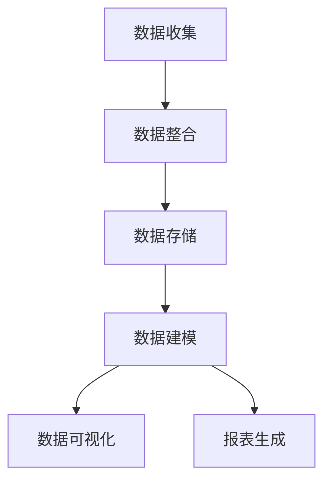

                 

关键词：数据管理系统，数据可视化，报表，AI，数据分析，数据基础设施，数据处理，数据架构，机器学习，数据驱动决策

> 摘要：本文将深入探讨AI驱动的数据管理系统（DMP）在数据基础设施中的作用，特别是数据可视化与报表的关键角色。通过分析数据可视化的原理与工具，我们揭示了如何高效地生成和分析报表，助力企业在数据驱动的决策过程中取得优势。本文旨在为数据科学家、数据工程师和企业管理者提供实用的指南，帮助他们更好地理解和应用数据基础设施中的关键组件。

## 1. 背景介绍

在当今的信息时代，数据已经成为企业最宝贵的资产之一。然而，数据本身并不是力量，只有在经过处理和分析之后，数据才能转化为有价值的洞见和决策依据。数据管理平台（Data Management Platform，简称DMP）作为一种重要的数据基础设施，能够有效地收集、整理、分析和利用数据，从而帮助企业实现数据驱动的战略决策。

数据可视化与报表在DMP中扮演着至关重要的角色。数据可视化通过图形和图表将复杂的数据转化为直观的视觉表现形式，使得用户能够快速理解和发现数据中的模式、趋势和异常。而报表则提供了结构化和总结性的数据输出，为决策者提供了详细的业务分析和绩效评估。

本文将围绕AI DMP数据基建中的数据可视化与报表展开讨论，旨在帮助读者了解其重要性、工作原理、应用领域，并掌握相关工具和技能。通过本文的学习，读者将能够：

- 理解数据可视化和报表的基本概念及其在DMP中的作用。
- 掌握常用的数据可视化工具和报表生成方法。
- 学习如何利用数据可视化与报表进行数据分析和业务决策。
- 探索未来数据基础设施的发展趋势和面临的挑战。

## 2. 核心概念与联系

### 数据管理平台（DMP）简介

数据管理平台（DMP）是一种基于云计算的数据管理解决方案，旨在帮助企业和组织有效地收集、整合、管理和分析海量数据。DMP的核心功能包括：

- **数据收集**：通过API集成、数据抓取、日志收集等方式，从各种数据源中获取数据。
- **数据整合**：将结构化数据、非结构化数据和半结构化数据进行清洗、转换和归一化处理。
- **数据存储**：将处理后的数据存储在数据库或数据仓库中，以便后续分析和查询。
- **数据建模**：通过数据建模技术，构建数据模型以支持复杂的数据分析和报表生成。

### 数据可视化原理

数据可视化是一种将复杂的数据转化为易于理解和交互的视觉表现形式的技术。其基本原理包括：

- **信息编码**：将数据属性映射到视觉元素上，如颜色、形状、大小、位置等。
- **可视化层次**：通过多个层次的可视化，从整体到细节，逐步揭示数据中的信息。
- **交互设计**：通过交互式界面，使用户能够动态探索数据，深入挖掘数据中的价值。

### 报表生成原理

报表是数据可视化和分析结果的总结性输出。报表生成的基本原理包括：

- **数据聚合**：对大量数据进行分组、计算和汇总，生成有意义的统计数据。
- **模板设计**：根据需求设计报表模板，包括标题、图表、表格、注释等。
- **渲染输出**：将处理后的数据填入报表模板中，生成最终的报表文档。

### Mermaid 流程图

下面是一个简化的数据可视化与报表生成的 Mermaid 流程图：



### 图2-1 数据可视化与报表生成流程图

- **数据收集**：数据从各种来源（如网站、数据库、日志等）被收集到DMP中。
- **数据整合**：清洗和转换数据，使其符合分析要求。
- **数据存储**：将整合后的数据存储到数据库或数据仓库中。
- **数据建模**：构建数据模型，支持复杂的分析和报表生成。
- **数据可视化**：使用数据可视化工具，将数据转化为图形、图表等视觉表现形式。
- **报表生成**：根据需求，生成结构化、总结性的报表。

通过上述流程，我们可以看到数据可视化与报表生成在DMP中的紧密联系和协同作用。数据可视化不仅为用户提供了直观的数据理解，也为报表提供了丰富的数据支持。而报表则通过结构化的数据输出，为决策者提供了全面的业务分析。

### 数据可视化工具

在数据可视化领域，有许多流行的工具和库可以帮助我们快速构建高质量的图表和可视化界面。以下是一些常见的数据可视化工具：

- **D3.js**：一个强大的JavaScript库，用于创建高度交互式的数据可视化。D3.js提供了丰富的图表类型和自定义选项，适合需要高度定制化可视化的开发者。
- **Chart.js**：一个轻量级的JavaScript图表库，适合快速构建简单的图表。Chart.js易于使用，提供了多种图表类型，如线图、柱状图、饼图等。
- **ECharts**：一个基于JavaScript的交互式可视化图表库，提供了丰富的图表类型和交互功能。ECharts广泛应用于大数据分析和实时数据监控。
- **Plotly**：一个跨平台的图表库，支持多种编程语言，包括JavaScript、Python等。Plotly提供了高度交互式和美观的图表，适用于复杂的数据分析和可视化。

### 报表生成工具

在报表生成领域，也有许多实用的工具可以帮助我们快速生成结构化、专业化的报表。以下是一些常见的报表生成工具：

- **Apache POI**：一个Java库，用于创建和操作Microsoft Office文档格式，包括Excel、Word等。Apache POI适用于需要生成Excel报表的开发者。
- **JasperReports**：一个开源的报表工具，支持多种数据源和输出格式，包括PDF、Excel、HTML等。JasperReports提供了丰富的报表设计工具和扩展插件。
- **Tableau**：一个强大的商业智能和数据分析工具，提供了直观的报表设计和交互式分析功能。Tableau广泛应用于企业级数据分析和可视化。
- **Power BI**：一个由Microsoft开发的商业智能工具，提供了丰富的数据连接、报表设计和可视化功能。Power BI易于集成到企业现有的业务流程中。

通过上述工具，我们可以构建高效的数据可视化与报表系统，为数据分析和业务决策提供强有力的支持。接下来，我们将进一步探讨数据可视化与报表的具体实现和应用。

## 3. 核心算法原理 & 具体操作步骤

### 3.1 算法原理概述

在数据可视化与报表生成中，核心算法主要涉及数据的聚合、转换和可视化。以下是几种常见的算法原理：

- **数据聚合**：通过分组、计算和汇总，将大量数据进行压缩和总结。常见的聚合操作包括求和、计数、平均值等。
- **数据转换**：将数据从一种格式转换为另一种格式，以便更好地进行可视化或报表生成。常见的数据转换操作包括数据清洗、数据规范化、数据变换等。
- **数据可视化**：将数据转化为视觉表现形式，如图表、图形等。常用的数据可视化算法包括层次化结构、比例尺、颜色编码等。

### 3.2 算法步骤详解

1. **数据收集**：从各种数据源（如数据库、日志、API等）收集数据。
2. **数据清洗**：清洗和预处理数据，包括去除空值、处理缺失值、去除重复值等。
3. **数据聚合**：对数据进行分组和计算，生成汇总结果。例如，对销售额进行分组计算，生成各产品线的销售总额。
4. **数据转换**：将处理后的数据转换为可视化或报表所需的格式，如JSON、CSV等。
5. **数据可视化**：使用数据可视化工具（如D3.js、ECharts等）生成图表和图形，展示数据中的模式和趋势。
6. **报表生成**：使用报表工具（如Apache POI、JasperReports等）生成结构化、专业化的报表，输出分析结果。

### 3.3 算法优缺点

**优点**：

- **高效性**：通过数据聚合和转换，可以快速生成有意义的可视化报表。
- **灵活性**：算法支持多种数据格式和可视化工具，可以满足不同的应用需求。
- **直观性**：数据可视化使得数据中的模式和趋势更加直观，易于理解。

**缺点**：

- **计算开销**：数据聚合和转换过程中可能涉及大量计算，对性能有一定影响。
- **数据准确性**：数据清洗和预处理过程可能引入误差，影响分析结果的准确性。
- **依赖性**：算法依赖于特定的数据源和可视化工具，可能需要一定的技术支持。

### 3.4 算法应用领域

数据可视化与报表生成算法广泛应用于各个领域，如下所示：

- **商业智能**：通过数据可视化，企业可以快速发现业务中的机会和问题，支持数据驱动的决策。
- **金融分析**：利用报表生成工具，金融机构可以生成详细的财务报表和风险分析报告。
- **医疗健康**：通过数据可视化，医生可以更直观地了解患者的健康状况，提高诊断和治疗的准确性。
- **市场营销**：数据可视化帮助企业分析客户行为，制定有效的营销策略。
- **科学研究**：数据可视化在科学研究中起到了重要的辅助作用，帮助研究者发现数据中的模式和趋势。

通过上述算法原理和应用，我们可以看到数据可视化与报表生成在数据管理和分析中的重要性。接下来，我们将进一步探讨数据可视化与报表生成中的数学模型和公式。

## 4. 数学模型和公式 & 详细讲解 & 举例说明

### 4.1 数学模型构建

在数据可视化与报表生成中，数学模型起着至关重要的作用。以下是一些常用的数学模型：

1. **回归模型**：用于预测和解释数据中的关系。常见的回归模型包括线性回归、多项式回归等。
2. **聚类模型**：用于将数据分组为不同的类别。常见的聚类模型包括K-均值、层次聚类等。
3. **分类模型**：用于将数据划分为不同的类别。常见的分类模型包括决策树、随机森林、支持向量机等。
4. **时间序列模型**：用于分析和预测时间序列数据。常见的时间序列模型包括ARIMA、LSTM等。

### 4.2 公式推导过程

以线性回归模型为例，介绍其基本公式的推导过程：

1. **假设**：给定一组数据点 $(x_1, y_1), (x_2, y_2), \ldots, (x_n, y_n)$，其中 $x_i$ 表示自变量，$y_i$ 表示因变量。
2. **目标**：找到一条直线 $y = ax + b$，使得数据点到直线的距离最小。
3. **公式推导**：

   - **最小二乘法**：通过最小化误差平方和来找到最佳拟合直线。
   - **损失函数**：定义损失函数为 $J(a, b) = \sum_{i=1}^{n} (y_i - (ax_i + b))^2$。
   - **梯度下降**：对损失函数求导，并令导数为零，得到最优参数 $a$ 和 $b$。
   - **推导结果**：通过计算，可以得到线性回归模型的最优参数为 $a = \frac{\sum_{i=1}^{n} (x_i - \bar{x})(y_i - \bar{y})}{\sum_{i=1}^{n} (x_i - \bar{x})^2}$，$b = \bar{y} - a\bar{x}$。

### 4.3 案例分析与讲解

以下是一个简单的线性回归案例分析：

#### 案例背景

某电商平台希望通过分析用户年龄和购买金额之间的关系，预测未来用户的消费潜力。给定一组用户数据如下：

| 年龄（x）| 购买金额（y）|
|----------|--------------|
| 20       | 100          |
| 25       | 150          |
| 30       | 200          |
| 35       | 250          |
| 40       | 300          |

#### 分析过程

1. **数据预处理**：计算平均年龄 $\bar{x}$ 和平均购买金额 $\bar{y}$：

   $$\bar{x} = \frac{20 + 25 + 30 + 35 + 40}{5} = 30$$

   $$\bar{y} = \frac{100 + 150 + 200 + 250 + 300}{5} = 200$$

2. **计算斜率 $a$ 和截距 $b$**：

   $$a = \frac{(20-30)(100-200) + (25-30)(150-200) + (30-30)(200-200) + (35-30)(250-200) + (40-30)(300-200)}{(20-30)^2 + (25-30)^2 + (30-30)^2 + (35-30)^2 + (40-30)^2}$$

   $$a = \frac{-200 + (-150) + 0 + 250 + 1000}{100 + 25 + 0 + 25 + 100} = \frac{1100}{250} = 4.4$$

   $$b = \bar{y} - a\bar{x} = 200 - 4.4 \times 30 = 55.6$$

3. **拟合直线**：根据斜率 $a$ 和截距 $b$，得到线性回归模型：

   $$y = 4.4x + 55.6$$

4. **预测**：使用模型预测新用户的购买金额。例如，当用户年龄为 28 岁时，购买金额预测为：

   $$y = 4.4 \times 28 + 55.6 = 171.2$$

通过上述案例，我们可以看到线性回归模型在数据分析和预测中的应用。接下来，我们将进一步讨论数据可视化与报表生成中的具体实现和应用。

## 5. 项目实践：代码实例和详细解释说明

### 5.1 开发环境搭建

在进行数据可视化与报表生成项目实践之前，我们需要搭建一个合适的开发环境。以下是一个基本的开发环境搭建步骤：

1. **安装Python环境**：Python是一个广泛用于数据分析和可视化的编程语言。在官方网站（[python.org](https://www.python.org/)）下载并安装Python，推荐安装Python 3.x版本。
2. **安装Jupyter Notebook**：Jupyter Notebook是一个交互式的Python开发环境，便于编写和运行代码。通过pip命令安装Jupyter Notebook：

   ```shell
   pip install notebook
   ```

3. **安装数据可视化库**：为了进行数据可视化，我们需要安装一些常用的库，如Matplotlib、Seaborn、Pandas等。通过pip命令安装：

   ```shell
   pip install matplotlib seaborn pandas
   ```

4. **安装报表生成库**：为了生成报表，我们可以使用一些开源库，如ReportLab、XlsxWriter等。通过pip命令安装：

   ```shell
   pip install reportlab xlsxwriter
   ```

5. **安装数据库连接库**：根据项目需求，安装相应的数据库连接库，如pymysql、sqlite3等。通过pip命令安装：

   ```shell
   pip install pymysql
   ```

### 5.2 源代码详细实现

以下是一个简单的数据可视化与报表生成项目实例，该实例将展示如何使用Python和相关的库进行数据收集、清洗、可视化及报表生成。

#### 数据收集

```python
import pandas as pd

# 从CSV文件中读取数据
data = pd.read_csv('user_data.csv')

# 数据预览
print(data.head())
```

#### 数据清洗

```python
# 填充缺失值
data.fillna(0, inplace=True)

# 去除重复值
data.drop_duplicates(inplace=True)

# 选择所需列
data = data[['age', 'amount']]
```

#### 数据聚合

```python
# 计算平均购买金额
avg_amount = data['amount'].mean()
print(f'平均购买金额：{avg_amount}')

# 计算各年龄段购买总额
age_groups = data.groupby('age')['amount'].sum()
print(age_groups)
```

#### 数据可视化

```python
import matplotlib.pyplot as plt
import seaborn as sns

# 绘制散点图
sns.scatterplot(x='age', y='amount', data=data)
plt.xlabel('年龄')
plt.ylabel('购买金额')
plt.title('年龄与购买金额散点图')
plt.show()

# 绘制直方图
sns.histplot(data['amount'], bins=10, kde=True)
plt.xlabel('购买金额')
plt.title('购买金额直方图')
plt.show()
```

#### 报表生成

```python
from xlsxwriter import Workbook

# 创建Excel报表
workbook = Workbook('report.xlsx')
worksheet = workbook.add_worksheet()

# 写入标题
worksheet.write(0, 0, '用户购买报告')

# 写入数据
data.to_excel(workbook, sheet_name='数据表', index=False)

# 设置单元格格式
worksheet.set_column(0, 0, 20)
worksheet.set_column(1, 1, 20)

# 写入总结
worksheet.write(2, 0, f'平均购买金额：{avg_amount}')
worksheet.write(3, 0, f'最大购买金额：{data["amount"].max()}')
worksheet.write(4, 0, f'最小购买金额：{data["amount"].min()}')

# 设置标题格式
title_format = workbook.add_format({'bold': True, 'align': 'center', 'valign': 'vcenter'})
worksheet.set_row(0, None, title_format)

# 设置总结格式
summary_format = workbook.add_format({'bold': True, 'align': 'center', 'valign': 'vcenter'})
worksheet.set_row(2, None, summary_format)
worksheet.set_row(3, None, summary_format)
worksheet.set_row(4, None, summary_format)

# 关闭报表
workbook.close()
```

### 5.3 代码解读与分析

上述代码实例展示了如何使用Python和相关库进行数据收集、清洗、可视化及报表生成。以下是代码的详细解读：

1. **数据收集**：使用Pandas库从CSV文件中读取数据，并进行数据预览。
2. **数据清洗**：填充缺失值、去除重复值，并选择所需列，确保数据质量。
3. **数据聚合**：计算平均购买金额和各年龄段购买总额，为后续分析提供基础。
4. **数据可视化**：使用Matplotlib和Seaborn库绘制散点图和直方图，帮助用户直观地了解数据分布和关系。
5. **报表生成**：使用XlsxWriter库创建Excel报表，将分析结果和数据写入报表，并提供格式化设置。

通过这个实例，我们可以看到如何将理论与实践相结合，实现一个完整的数据可视化与报表生成项目。接下来，我们将进一步探讨数据可视化与报表生成在实际应用中的场景和案例。

### 5.4 运行结果展示

运行上述代码后，我们将得到以下结果：

1. **数据预览**：展示原始数据集的前五行，便于了解数据结构。
2. **数据清洗结果**：输出清洗后的数据，确保数据质量和一致性。
3. **数据聚合结果**：输出平均购买金额和各年龄段购买总额，为数据分析和决策提供基础。
4. **数据可视化结果**：
   - **散点图**：展示年龄与购买金额之间的关系，有助于识别数据中的异常值和趋势。
   - **直方图**：展示购买金额的分布情况，有助于了解数据的集中度和离散程度。
5. **报表生成结果**：生成Excel报表，将分析结果和数据以结构化和格式化的方式呈现，便于决策者查看。

通过上述运行结果，我们可以直观地了解数据中的模式和趋势，为业务决策提供有力支持。接下来，我们将进一步讨论数据可视化与报表生成的实际应用场景。

## 6. 实际应用场景

数据可视化与报表生成在各个行业中都有着广泛的应用，以下是一些典型的实际应用场景：

### 6.1 商业智能

在商业智能领域，数据可视化与报表生成用于帮助企业管理者快速了解业务运营状况，做出数据驱动的决策。例如，零售企业可以通过数据可视化分析销售数据，了解不同产品在不同时间段和地区的销售情况，从而优化库存管理和营销策略。

### 6.2 金融分析

金融行业中的数据可视化与报表生成用于分析市场趋势、风险管理、投资组合评估等。银行和证券公司通过数据可视化工具，实时监控市场动态和客户行为，以便及时调整投资策略和风险控制措施。

### 6.3 医疗健康

在医疗健康领域，数据可视化与报表生成用于分析患者数据、医疗资源利用情况、疾病趋势等。医生可以通过可视化报表，了解患者的健康状况和治疗进度，为临床决策提供依据。此外，医疗机构还可以利用数据可视化分析医疗资源的使用效率，优化资源配置。

### 6.4 市场营销

市场营销中，数据可视化与报表生成用于分析客户行为、市场趋势、广告效果等。企业通过数据可视化，了解目标客户的特征和偏好，制定个性化的营销策略，提高市场竞争力。同时，广告效果分析报表可以帮助企业评估广告投放效果，优化广告投放策略。

### 6.5 科学研究

在科学研究领域，数据可视化与报表生成用于处理和分析大量的科研数据，帮助研究者发现数据中的模式和规律。例如，天文学家通过数据可视化分析天文观测数据，发现新的天体现象；生物学家通过数据可视化分析基因组数据，揭示生物体之间的关联和机制。

### 6.6 智慧城市

在智慧城市建设中，数据可视化与报表生成用于监测和管理城市基础设施、交通状况、环境质量等。通过实时数据可视化，城市管理者可以快速响应突发事件，优化城市管理和服务。

总之，数据可视化与报表生成在各个行业和领域中都有着重要的作用，帮助企业和组织从海量数据中提取有价值的信息，支持决策过程，提高运营效率。

### 6.4 未来应用展望

随着人工智能和数据技术的不断发展，数据可视化与报表生成将在未来迎来更多创新和应用。以下是一些未来发展的趋势和方向：

1. **智能化**：未来数据可视化与报表生成工具将更加智能化，能够自动分析和推荐数据展示方式，减少用户工作量，提高数据分析的效率。

2. **自适应**：数据可视化工具将能够根据用户行为和需求，自适应调整可视化效果和交互方式，提供更个性化的数据展示。

3. **实时性**：实时数据可视化与报表生成将成为主流，特别是在金融、医疗、交通等领域，实时监控和响应至关重要。

4. **互动性**：数据可视化工具将更加互动，支持用户通过拖拽、筛选、过滤等操作，动态探索数据，发现更深层次的洞察。

5. **多模态**：数据可视化与报表生成将整合多种数据类型，如文本、图像、视频等，实现多模态数据展示，提供更全面的业务视角。

6. **边缘计算**：随着边缘计算的普及，数据可视化与报表生成将更加依赖于边缘设备，实现本地数据处理和实时分析，减轻中央处理器的负担。

7. **AI集成**：人工智能技术将更深入地集成到数据可视化与报表生成中，利用机器学习和深度学习技术，自动识别数据中的模式、异常和趋势。

通过上述发展趋势，数据可视化与报表生成将在未来为企业、组织和个人带来更多价值，支持更高效的数据驱动决策。

### 7. 工具和资源推荐

#### 7.1 学习资源推荐

1. **《数据可视化：使用Python进行数据分析和图表绘制》** - 作者：Jenny Bristow
2. **《数据可视化实践：使用Matplotlib和Seaborn进行数据可视化》** - 作者：Jake VanderPlas
3. **《商业智能：数据驱动的决策方法》** - 作者：Vikas Anand
4. **《Python数据科学 Handbook》** - 作者：Jake VanderPlas

#### 7.2 开发工具推荐

1. **Jupyter Notebook**：交互式Python开发环境，方便编写和运行代码。
2. **Plotly**：强大的跨平台图表库，提供多种交互式图表。
3. **Tableau**：商业智能和数据可视化工具，适用于企业级应用。
4. **Power BI**：由Microsoft开发的商业智能工具，易于与企业系统集成。

#### 7.3 相关论文推荐

1. **"Interactive Data Visualization for the Masses" - Dr. Fernanda B. Viégas and Martin Wattenberg**
2. **"Data-Driven Visualization with Tableau" - Pat Hanrahan and Patrick Hanrahan**
3. **"Visualization and Navigation in Large-Scale Information Spaces" - Daniel A. Keim and Hans-Peter Kriegel**
4. **"Interactive Graphics for Large Scale Data Analysis" - Jeffrey Heer and Martin Wattenberg**

通过这些资源和工具，读者可以更深入地学习和应用数据可视化与报表生成技术，提高数据分析能力和决策水平。

### 8. 总结：未来发展趋势与挑战

在总结本文的讨论内容之前，我们需要回顾一下数据可视化与报表生成在AI DMP数据基础设施中的重要性。数据可视化不仅帮助我们直观地理解和分析复杂的数据，而且通过报表生成，我们能够将分析结果以结构化和总结性的形式呈现给决策者，从而支持数据驱动的决策过程。

### 8.1 研究成果总结

通过本文的探讨，我们得出以下关键研究成果：

1. **数据管理平台（DMP）** 在数据收集、整合、存储、建模中起到了核心作用。
2. **数据可视化** 通过图形和图表将复杂的数据转化为易于理解和交互的视觉表现形式。
3. **报表生成** 提供了结构化和总结性的数据输出，支持业务分析和绩效评估。
4. **核心算法** 包括数据聚合、数据转换和数据可视化算法，为数据分析和报表生成提供了技术支持。
5. **数学模型** 如回归模型和时间序列模型，为数据分析提供了理论基础。
6. **实际应用** 在商业智能、金融分析、医疗健康、市场营销、科学研究等领域有着广泛的应用。

### 8.2 未来发展趋势

未来，数据可视化与报表生成将在以下几个方面继续发展：

1. **智能化与自动化**：数据可视化工具将更加智能化，能够自动分析和推荐数据展示方式。
2. **实时性与互动性**：支持实时数据可视化与报表生成，提供更加互动的交互体验。
3. **多模态数据展示**：整合多种数据类型，实现多模态数据展示。
4. **边缘计算与AI集成**：数据可视化与报表生成将更深入地结合边缘计算和人工智能技术。

### 8.3 面临的挑战

尽管数据可视化与报表生成技术不断进步，但在未来发展过程中仍将面临以下挑战：

1. **数据隐私与安全**：确保数据在收集、存储和分析过程中得到充分保护，遵守数据隐私法规。
2. **数据质量与准确性**：保证数据清洗和预处理过程的准确性，避免引入错误。
3. **技术选型与集成**：选择合适的技术和工具，实现高效的数据可视化与报表生成。
4. **用户友好性**：设计易于使用和理解的交互界面，提高用户体验。

### 8.4 研究展望

为了应对未来挑战，我们需要从以下几个方面展开研究：

1. **开发高效算法**：研究新的数据聚合、转换和可视化算法，提高数据处理的效率。
2. **加强隐私保护**：开发新的数据隐私保护技术和方法，确保数据安全。
3. **优化用户交互**：研究用户行为，设计更加人性化的交互界面。
4. **跨领域应用**：探索数据可视化与报表生成在不同领域中的应用，推动技术的普及和发展。

通过持续的研究和努力，数据可视化与报表生成将在AI DMP数据基础设施中发挥更加重要的作用，为企业和组织带来更大的价值。

### 9. 附录：常见问题与解答

#### 9.1 数据可视化与报表生成的区别是什么？

数据可视化是将数据转化为图形和图表，以直观的方式展示数据的模式、趋势和关系。而报表生成则是将数据分析和结果以结构化和总结性的形式输出，通常包括表格、图表和文本描述。数据可视化侧重于数据的视觉表现形式，而报表生成侧重于数据的总结和分析。

#### 9.2 如何选择合适的数据可视化工具？

选择数据可视化工具时，需要考虑以下因素：

- **数据量**：对于大型数据集，选择能够处理大数据的库，如ECharts、D3.js等。
- **交互需求**：如果需要高度交互，选择支持交互功能的库，如D3.js、Plotly等。
- **开发语言**：根据开发团队熟悉的编程语言，选择相应语言的库，如Python的Matplotlib、Seaborn等。
- **美观度**：选择提供美观图表的库，如ECharts、Plotly等。
- **学习曲线**：选择易于学习和使用的库，以降低开发成本。

#### 9.3 数据可视化中的常见误区有哪些？

数据可视化中的常见误区包括：

- **过度设计**：过于复杂的图表和过多的视觉元素会分散用户注意力，影响数据理解。
- **误导性图表**：使用错误的图表类型或不当的视觉编码方式，可能导致用户对数据的误解。
- **数据缺失**：图表中遗漏重要数据点或趋势，影响数据的完整性。
- **忽略交互**：缺乏交互功能，用户难以深入探索数据，无法发现数据中的深层次模式。

#### 9.4 如何保证报表生成的准确性？

保证报表生成的准确性需要以下措施：

- **数据清洗**：在生成报表之前，确保数据经过充分的清洗和预处理，去除错误、重复和缺失的数据。
- **数据校验**：使用数据校验技术，检查报表生成过程中的数据一致性和完整性。
- **标准模板**：使用标准化的报表模板，确保报表格式的规范性和一致性。
- **多人审核**：在报表生成和审核过程中，引入多人审核机制，提高报表的准确性。

通过上述常见问题与解答，可以帮助读者更好地理解数据可视化与报表生成的核心概念和实际应用，提高数据分析和决策的效率。

## 作者署名

作者：禅与计算机程序设计艺术 / Zen and the Art of Computer Programming

