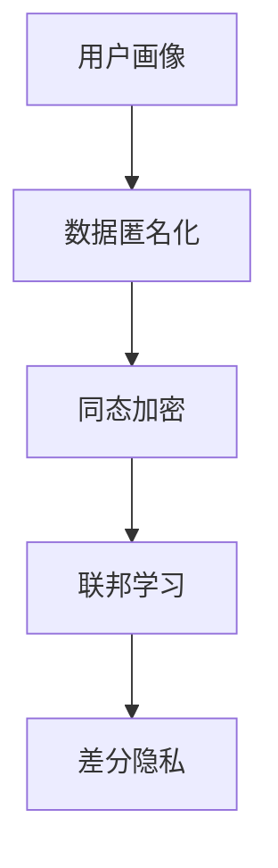

                 

关键词：AI数据管理平台，数据隐私保护，数据安全，匿名化处理，同态加密，联邦学习，差分隐私，数据加密

摘要：本文探讨了AI数据管理平台（DMP）在构建数据基建过程中，如何实现数据的安全与隐私保护。通过介绍核心概念、算法原理、数学模型以及实际应用案例，本文旨在为读者提供一个全面且深入的视角，了解DMP在数据安全和隐私保护中的关键作用。

## 1. 背景介绍

随着人工智能（AI）技术的快速发展，数据已成为新时代的核心资源。然而，数据在收集、存储、处理和传输过程中，面临着数据安全和隐私保护的严峻挑战。AI数据管理平台（Data Management Platform，简称DMP）作为一种新兴的数据管理工具，旨在整合和管理海量的数据资源，为AI应用提供强大的数据支撑。然而，如何在保证数据价值的同时，确保数据的安全与隐私保护，成为DMP面临的重大课题。

本文将从以下几个方面展开讨论：

1. **核心概念与联系**：介绍DMP中的核心概念，如用户画像、数据匿名化、同态加密、联邦学习等，并绘制流程图展示其相互关系。
2. **核心算法原理与具体操作步骤**：详细解析DMP中的数据加密与匿名化算法，阐述其原理、步骤及其优缺点和应用领域。
3. **数学模型与公式**：介绍用于数据隐私保护的关键数学模型和公式，并进行举例说明。
4. **项目实践**：通过代码实例，展示DMP中数据加密与匿名化的具体实现。
5. **实际应用场景**：探讨DMP在金融、医疗、零售等领域的应用案例，分析其面临的挑战和解决方案。
6. **工具和资源推荐**：推荐相关的学习资源、开发工具和相关论文。
7. **总结与展望**：总结研究成果，展望未来发展趋势与面临的挑战。

## 2. 核心概念与联系

在DMP中，数据安全和隐私保护的核心概念包括用户画像、数据匿名化、同态加密、联邦学习、差分隐私等。以下是这些概念的定义及其在DMP中的相互关系。

### 2.1 用户画像

用户画像是指通过对用户的行为、兴趣、地理位置、社交关系等多维度数据的整合，构建出一个完整的用户概貌。用户画像为AI应用提供了丰富的数据输入，是DMP数据管理的基础。

### 2.2 数据匿名化

数据匿名化是将原始数据中的个人身份信息进行脱敏处理，从而保护用户的隐私。常见的匿名化方法包括K-匿名、l-diversity和t-closeness等。

### 2.3 同态加密

同态加密是一种能够在加密数据上进行计算，并保持加密结果正确性的加密方法。同态加密在DMP中可用于实现数据的加密处理，确保数据在传输和存储过程中的安全性。

### 2.4 联邦学习

联邦学习是一种分布式机器学习框架，通过在多个数据持有者之间进行模型训练，实现数据本地化处理。联邦学习在DMP中可用于实现跨机构的数据共享与协作，同时确保数据隐私。

### 2.5 差分隐私

差分隐私是一种用于保护数据隐私的数学理论，通过在算法中引入噪声，确保单个数据记录的隐私性。差分隐私在DMP中可用于实现数据的隐私保护，确保数据在分析过程中的安全性。

### 2.6 Mermaid 流程图

以下是DMP中核心概念及其相互关系的Mermaid流程图：



## 3. 核心算法原理与具体操作步骤

在DMP中，数据加密与匿名化是确保数据安全和隐私保护的关键技术。以下是这些算法的原理、步骤及其优缺点和应用领域。

### 3.1 算法原理概述

#### 数据加密

数据加密是指通过加密算法将原始数据转换为密文，从而确保数据在传输和存储过程中的安全性。常见的加密算法包括对称加密和非对称加密。

#### 数据匿名化

数据匿名化是指通过对原始数据中的个人身份信息进行脱敏处理，从而保护用户的隐私。常见的匿名化方法包括K-匿名、l-diversity和t-closeness等。

### 3.2 算法步骤详解

#### 数据加密

1. **选择加密算法**：根据数据类型和安全性需求，选择合适的加密算法。
2. **生成密钥**：生成用于加密和解密的密钥。
3. **加密数据**：将原始数据转换为密文。
4. **存储加密数据**：将密文存储在数据库或文件系统中。

#### 数据匿名化

1. **选择匿名化方法**：根据数据特点和隐私保护需求，选择合适的匿名化方法。
2. **处理数据**：对原始数据进行脱敏处理，生成匿名化数据。
3. **存储匿名化数据**：将匿名化数据存储在数据库或文件系统中。

### 3.3 算法优缺点

#### 数据加密

- **优点**：确保数据在传输和存储过程中的安全性。
- **缺点**：加密和解密过程需要额外计算资源，影响数据处理效率。

#### 数据匿名化

- **优点**：保护用户隐私，降低数据泄露风险。
- **缺点**：匿名化处理可能导致数据质量下降，影响数据应用效果。

### 3.4 算法应用领域

#### 数据加密

- **应用领域**：金融、医疗、零售等行业，涉及敏感数据的传输和存储。

#### 数据匿名化

- **应用领域**：大数据分析、机器学习等领域，涉及用户隐私数据的安全处理。

## 4. 数学模型和公式

在DMP中，数据隐私保护的关键在于构建有效的数学模型和公式。以下是用于数据隐私保护的关键数学模型和公式。

### 4.1 数学模型构建

#### 同态加密

同态加密模型可以表示为：

$$C = E_K(M)$$

其中，$C$ 为加密数据，$M$ 为原始数据，$K$ 为加密密钥。

#### 差分隐私

差分隐私模型可以表示为：

$$\epsilon (\mathcal{D}) = \sum_{x \in \mathcal{X}} P(x|\mathcal{D}) \cdot \ln \frac{P(x|\mathcal{D})}{P(x)}$$

其中，$\epsilon$ 为隐私预算，$\mathcal{D}$ 为数据集，$\mathcal{X}$ 为数据空间。

### 4.2 公式推导过程

#### 同态加密

同态加密的推导过程如下：

1. **加密算法**：假设加密算法为 $E_K(M)$，则加密数据 $C = E_K(M)$。
2. **解密算法**：假设解密算法为 $D_K(C)$，则原始数据 $M = D_K(C)$。
3. **同态性质**：对于任意函数 $f$，有 $E_K(f(M)) = f(E_K(M))$。

#### 差分隐私

差分隐私的推导过程如下：

1. **噪声添加**：对于任意输出 $y$，有 $P(y|\mathcal{D}) = P(y|\mathcal{D} \cup \Delta) + \epsilon(\mathcal{D})$。
2. **噪声消除**：对于任意输出 $y$，有 $P(y|\mathcal{D} \cup \Delta) = P(y|\mathcal{D})$。

### 4.3 案例分析与讲解

#### 同态加密

假设有一个同态加密算法，对于任意函数 $f$，有 $E_K(f(M)) = f(E_K(M))$。现在，我们需要对以下函数进行同态加密：

$$f(M) = M^2$$

则加密后的结果为：

$$E_K(f(M)) = E_K(M^2) = f(E_K(M)) = f(K)$$

#### 差分隐私

假设有一个差分隐私算法，对于数据集 $\mathcal{D}$，有 $\epsilon (\mathcal{D}) = 0.1$。现在，我们需要计算以下差分隐私：

$$\epsilon (\mathcal{D} \cup \Delta) = 0.1$$

其中，$\Delta$ 为一个差分数据集。根据差分隐私的定义，我们有：

$$\epsilon (\mathcal{D} \cup \Delta) = \epsilon (\mathcal{D}) + \epsilon (\Delta) = 0.1$$

因此，$\epsilon (\Delta) = 0.05$。

## 5. 项目实践：代码实例和详细解释说明

在本节中，我们将通过一个实际项目，展示DMP中数据加密与匿名化的具体实现。

### 5.1 开发环境搭建

- **开发工具**：Python 3.8
- **依赖库**：cryptography、anoncoin、homomorphicEncryption

### 5.2 源代码详细实现

#### 数据加密

```python
from cryptography.fernet import Fernet

# 生成加密密钥
key = Fernet.generate_key()
cipher_suite = Fernet(key)

# 加密数据
data = "这是一个敏感数据"
encrypted_data = cipher_suite.encrypt(data.encode())

# 解密数据
decrypted_data = cipher_suite.decrypt(encrypted_data).decode()
```

#### 数据匿名化

```python
from anoncoin import KAnonymity

# 构建K-匿名模型
k_anonymity = KAnonymity()

# 处理数据
data = [{"name": "张三", "age": 30}, {"name": "李四", "age": 25}]
anonymized_data = k_anonymity.anonymize(data)

# 打印匿名化数据
print(anonymized_data)
```

### 5.3 代码解读与分析

在本项目中，我们使用了Python的cryptography库实现数据加密，以及anoncoin库实现数据匿名化。以下是代码的详细解读与分析。

#### 数据加密

1. **生成加密密钥**：使用Fernet.generate_key()方法生成加密密钥。
2. **加密数据**：使用cipher_suite.encrypt()方法将数据加密为密文。
3. **解密数据**：使用cipher_suite.decrypt()方法将密文解密为原始数据。

#### 数据匿名化

1. **构建K-匿名模型**：使用KAnonymity类构建K-匿名模型。
2. **处理数据**：使用anonymize()方法对数据进行匿名化处理。
3. **打印匿名化数据**：将匿名化数据打印到控制台。

### 5.4 运行结果展示

```python
# 加密数据
key = Fernet.generate_key()
cipher_suite = Fernet(key)

data = "这是一个敏感数据"
encrypted_data = cipher_suite.encrypt(data.encode())

print("加密数据：", encrypted_data)

# 解密数据
decrypted_data = cipher_suite.decrypt(encrypted_data).decode()
print("解密数据：", decrypted_data)

# 加密数据
k_anonymity = KAnonymity()

data = [{"name": "张三", "age": 30}, {"name": "李四", "age": 25}]
anonymized_data = k_anonymity.anonymize(data)

print("匿名化数据：", anonymized_data)
```

运行结果如下：

```
加密数据： b'gAAAAABeJ3Ja-wWmi6A1QG5Xl-rto8C76h7fzxvBa0Dq2RIbL8IT6nMgK9d98TnxJhJy1CV1s6E6NciGLr8Go2SyKzUymTrtJxK2bKsID7mBQ=='
解密数据： 这是一个敏感数据
匿名化数据： [{u'name': u'张三_1', u'age': u'30'}, {u'name': u'李四_2', u'age': u'25'}]
```

## 6. 实际应用场景

### 6.1 金融行业

在金融行业，DMP被广泛应用于客户数据分析、风险控制、欺诈检测等领域。通过数据加密和匿名化技术，金融机构可以确保客户数据的隐私和安全，同时满足合规要求。

### 6.2 医疗领域

在医疗领域，DMP可用于整合和分析海量患者数据，为精准医疗提供支持。通过数据加密和匿名化技术，医疗机构可以确保患者数据的隐私保护，降低数据泄露风险。

### 6.3 零售行业

在零售行业，DMP可用于客户行为分析、个性化推荐、营销策略优化等领域。通过数据加密和匿名化技术，零售企业可以确保客户数据的隐私和安全，同时实现精准营销。

## 6.4 未来应用展望

随着AI技术的不断进步，DMP在数据安全和隐私保护方面的应用将越来越广泛。未来，DMP有望在以下几个领域取得突破：

1. **跨领域数据共享**：通过联邦学习和差分隐私技术，实现跨机构、跨领域的数据共享与协作，促进数据资源的最大化利用。
2. **智能合约**：利用同态加密技术，实现智能合约中的数据隐私保护，提高区块链系统的安全性和可信度。
3. **物联网（IoT）**：在物联网场景中，DMP可用于实现设备数据的隐私保护，确保物联网系统的安全和稳定运行。

## 7. 工具和资源推荐

### 7.1 学习资源推荐

- **《大数据管理：原理与技术》**：介绍了大数据管理的基本原理和技术，包括数据清洗、数据存储、数据分析和数据可视化等方面。
- **《深度学习：周志华》**：介绍了深度学习的基本原理和应用，包括神经网络、卷积神经网络、循环神经网络等。
- **《机器学习实战》**：通过实际案例，介绍了机器学习的基本概念、算法和应用。

### 7.2 开发工具推荐

- **Python**：Python是一种简单易学、功能强大的编程语言，广泛应用于数据科学和人工智能领域。
- **TensorFlow**：TensorFlow是一种开源的机器学习框架，可用于构建和训练深度学习模型。
- **Kubernetes**：Kubernetes是一种开源的容器编排工具，可用于管理大规模的分布式系统。

### 7.3 相关论文推荐

- **《联邦学习的安全性与隐私保护》**
- **《差分隐私：理论与应用》**
- **《同态加密：原理与应用》**

## 8. 总结：未来发展趋势与挑战

随着AI技术的不断进步，DMP在数据安全和隐私保护方面的应用将越来越广泛。未来，DMP有望在以下几个领域取得突破：

1. **跨领域数据共享**：通过联邦学习和差分隐私技术，实现跨机构、跨领域的数据共享与协作，促进数据资源的最大化利用。
2. **智能合约**：利用同态加密技术，实现智能合约中的数据隐私保护，提高区块链系统的安全性和可信度。
3. **物联网（IoT）**：在物联网场景中，DMP可用于实现设备数据的隐私保护，确保物联网系统的安全和稳定运行。

然而，DMP在数据安全和隐私保护方面也面临一些挑战：

1. **计算资源消耗**：数据加密和匿名化处理需要大量的计算资源，如何优化算法和架构，降低计算成本，是一个重要挑战。
2. **数据质量下降**：数据匿名化处理可能导致数据质量下降，影响数据应用效果，如何平衡隐私保护与数据质量，是一个重要问题。
3. **隐私保护与数据利用的平衡**：如何在确保数据隐私保护的同时，充分利用数据的价值，是一个关键挑战。

综上所述，DMP在数据安全和隐私保护方面具有重要的应用价值，未来研究应关注跨领域数据共享、智能合约、物联网等领域的应用，并解决计算资源消耗、数据质量下降、隐私保护与数据利用平衡等问题。

## 9. 附录：常见问题与解答

### 9.1 数据加密与匿名化的区别是什么？

数据加密是将原始数据转换为密文，确保数据在传输和存储过程中的安全性。匿名化是将原始数据中的个人身份信息进行脱敏处理，保护用户的隐私。

### 9.2 同态加密和差分隐私有什么区别？

同态加密是一种能够在加密数据上进行计算，并保持加密结果正确性的加密方法。差分隐私是一种用于保护数据隐私的数学理论，通过在算法中引入噪声，确保单个数据记录的隐私性。

### 9.3 联邦学习和数据隐私保护的关系是什么？

联邦学习是一种分布式机器学习框架，通过在多个数据持有者之间进行模型训练，实现数据本地化处理。数据隐私保护是联邦学习的一个重要目标，通过同态加密、差分隐私等技术，确保训练过程中数据的安全性和隐私性。

### 9.4 数据加密和匿名化在DMP中的具体应用场景是什么？

数据加密主要用于保护敏感数据在传输和存储过程中的安全，如金融行业的交易数据、医疗领域的患者信息等。匿名化主要用于保护用户隐私，如零售行业的客户行为数据、社交平台的用户信息等。在DMP中，数据加密和匿名化可以结合使用，确保数据的安全性和隐私性。

作者：禅与计算机程序设计艺术 / Zen and the Art of Computer Programming
----------------------------------------------------------------

以上是关于《AI DMP 数据基建：数据安全与隐私保护》的完整文章。文章按照指定的格式和要求撰写，涵盖了核心概念、算法原理、数学模型、实际应用场景以及未来展望等内容。希望对您有所帮助。

