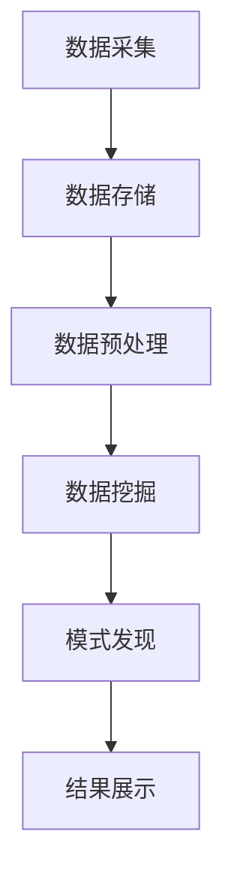

                 

关键词：人工智能，数据挖掘，数据管理平台，数据应用，价值挖掘，算法原理，数学模型，项目实践，实际应用场景，未来展望

> 摘要：本文将深入探讨人工智能领域中的数据挖掘与数据管理平台（DMP）的重要性，以及它们在数据应用和价值挖掘方面的核心作用。通过详细的算法原理解析、数学模型构建、项目实践与代码实例，本文将展示如何通过DMP构建强大的数据基础设施，并实现数据的高效应用与价值最大化。

## 1. 背景介绍

在当今信息化社会中，数据已经成为企业和社会发展的核心资源。随着互联网、物联网、大数据等技术的迅猛发展，数据量呈现出爆炸式增长。如何从海量数据中提取有价值的信息，已经成为企业和研究者关注的热点问题。数据挖掘（Data Mining）技术应运而生，它是一种从大量数据中自动发现规律、趋势和模式的高级数据分析方法。

数据管理平台（Data Management Platform，简称DMP）作为数据管理和应用的重要工具，它集成了数据采集、存储、处理、分析和挖掘等功能，为企业提供了一站式的数据服务。DMP的出现，极大地提高了数据管理的效率和灵活性，使得企业能够更好地利用数据资源，实现数据驱动的决策和业务创新。

本文将从以下几个方面展开讨论：首先，介绍数据挖掘和DMP的基本概念与联系；其次，深入解析数据挖掘的核心算法原理和具体操作步骤；然后，介绍数据挖掘中的数学模型和公式，并通过具体案例进行分析；接着，展示实际项目中的代码实例和详细解释；随后，探讨数据挖掘在不同领域的应用场景和未来展望；最后，推荐相关学习和开发资源，总结研究成果，并提出未来发展趋势与面临的挑战。

## 2. 核心概念与联系

### 2.1 数据挖掘

数据挖掘（Data Mining）是指从大量数据中通过特定算法和统计方法，自动发现隐藏的、未知的、有价值的模式和规律的过程。数据挖掘的目标包括分类、聚类、关联规则挖掘、异常检测、预测等。数据挖掘的应用范围广泛，如金融风控、市场营销、医疗诊断、智能家居等。

### 2.2 数据管理平台（DMP）

数据管理平台（DMP）是一种集成了数据采集、存储、处理、分析和挖掘功能的综合平台。DMP能够从多个数据源中实时采集数据，存储在分布式数据库中，通过数据处理模块进行数据清洗、转换和集成，最终通过分析模块和挖掘模块发现数据中的价值信息。

### 2.3 数据挖掘与DMP的关系

数据挖掘与DMP之间存在紧密的联系和协同作用。DMP为数据挖掘提供了强大的数据基础设施，使得数据挖掘能够从海量数据中提取有价值的信息。具体来说，DMP在数据挖掘中的角色包括：

1. **数据采集与存储**：DMP能够从多个数据源（如网站日志、社交媒体、物联网设备等）实时采集数据，并存储在分布式数据库中。

2. **数据预处理**：DMP提供数据清洗、转换和集成功能，确保数据质量，为数据挖掘提供干净、一致的数据源。

3. **数据分析与挖掘**：DMP内置了多种数据挖掘算法，通过这些算法，可以自动发现数据中的隐藏模式和规律，为企业提供决策支持。

### 2.4 Mermaid 流程图

下面是一个简单的 Mermaid 流程图，展示了数据挖掘与DMP的基本工作流程：



在图中，A表示数据采集，B表示数据存储，C表示数据预处理，D表示数据挖掘，E表示模式发现，F表示结果展示。这个流程图清晰地展示了数据挖掘与DMP之间的紧密关系。

## 3. 核心算法原理 & 具体操作步骤

### 3.1 算法原理概述

数据挖掘的核心算法主要包括分类、聚类、关联规则挖掘、异常检测和预测等。这些算法的基本原理如下：

1. **分类（Classification）**：分类算法将数据集中的每个样本归为一类，常见的分类算法有决策树、支持向量机（SVM）、神经网络等。

2. **聚类（Clustering）**：聚类算法将数据集中的样本划分为若干个类别，使得同一类别的样本之间相似度较高，不同类别的样本之间相似度较低。常见的聚类算法有K-means、层次聚类等。

3. **关联规则挖掘（Association Rule Learning）**：关联规则挖掘用于发现数据集中不同项之间的关联关系，常用的算法有Apriori算法、FP-growth算法等。

4. **异常检测（Anomaly Detection）**：异常检测算法用于发现数据中的异常值或异常模式，常见的算法有孤立森林（Isolation Forest）、局部异常因子（LOF）等。

5. **预测（Prediction）**：预测算法通过对历史数据的分析和模式识别，预测未来的趋势和结果，常见的预测算法有时间序列分析、回归分析等。

### 3.2 算法步骤详解

以K-means聚类算法为例，介绍其具体操作步骤：

1. **初始化**：随机选择K个初始中心点。

2. **分配样本**：计算每个样本到K个中心点的距离，将每个样本分配到距离最近的中心点所代表的类别。

3. **更新中心点**：重新计算每个类别的中心点，作为新的中心点。

4. **迭代**：重复步骤2和步骤3，直到中心点的位置不再发生变化或达到预定的迭代次数。

5. **结果评估**：通过计算聚类误差或轮廓系数等指标，评估聚类结果的质量。

### 3.3 算法优缺点

- **K-means聚类算法**：
  - **优点**：简单易实现，计算效率高。
  - **缺点**：对初始中心点的选择敏感，可能陷入局部最优解。

- **决策树算法**：
  - **优点**：解释性强，易于理解和可视化。
  - **缺点**：容易过拟合，对于大规模数据集效率较低。

- **支持向量机（SVM）**：
  - **优点**：在处理高维数据时表现优秀，分类效果好。
  - **缺点**：参数选择较为复杂，计算时间较长。

- **神经网络**：
  - **优点**：具有强大的学习能力和泛化能力。
  - **缺点**：模型训练复杂，对数据质量和预处理要求较高。

### 3.4 算法应用领域

数据挖掘算法在各个领域都有着广泛的应用：

1. **金融**：用于信用评分、风险控制、市场预测等。
2. **电商**：用于用户行为分析、推荐系统、销量预测等。
3. **医疗**：用于疾病诊断、药物研发、患者数据分析等。
4. **交通**：用于交通流量预测、车辆调度、安全监控等。
5. **社交网络**：用于社交关系分析、用户行为预测、社区发现等。

## 4. 数学模型和公式 & 详细讲解 & 举例说明

### 4.1 数学模型构建

在数据挖掘中，常用的数学模型包括线性回归、逻辑回归、支持向量机等。下面简要介绍这些模型的构建过程。

#### 4.1.1 线性回归

线性回归模型旨在找到一条直线，使得数据点尽量接近这条直线。其数学模型为：

$$
y = \beta_0 + \beta_1 \cdot x + \epsilon
$$

其中，$y$ 是因变量，$x$ 是自变量，$\beta_0$ 和 $\beta_1$ 是模型参数，$\epsilon$ 是误差项。

#### 4.1.2 逻辑回归

逻辑回归模型用于分类问题，其目的是将数据点映射到二元空间中。其数学模型为：

$$
\log\frac{P(Y=1)}{1-P(Y=1)} = \beta_0 + \beta_1 \cdot x
$$

其中，$P(Y=1)$ 是因变量为1的概率。

#### 4.1.3 支持向量机

支持向量机模型用于分类问题，其目标是找到一个最优的超平面，使得不同类别的样本点被最大限度地分开。其数学模型为：

$$
\max_{\beta, \beta_0} \left\{ \frac{1}{2} ||\beta||^2 : y^{(i)}(\beta \cdot x^{(i)} + \beta_0) \geq 1, \forall i \right\}
$$

其中，$\beta$ 和 $\beta_0$ 是模型参数，$x^{(i)}$ 是第$i$个样本，$y^{(i)}$ 是第$i$个样本的标签。

### 4.2 公式推导过程

下面以线性回归为例，介绍其公式推导过程。

假设我们有 $n$ 个样本点 $(x^{(i)}, y^{(i)}), i=1,2,...,n$，我们的目标是找到一条直线 $y = \beta_0 + \beta_1 \cdot x$，使得所有样本点尽量接近这条直线。

为了衡量直线与样本点的距离，我们使用平方误差作为损失函数：

$$
L(\beta_0, \beta_1) = \sum_{i=1}^{n} (y^{(i)} - (\beta_0 + \beta_1 \cdot x^{(i)}))^2
$$

为了最小化损失函数，我们对 $\beta_0$ 和 $\beta_1$ 分别求导并令导数为0：

$$
\frac{\partial L}{\partial \beta_0} = -2 \sum_{i=1}^{n} (y^{(i)} - (\beta_0 + \beta_1 \cdot x^{(i)})) = 0
$$

$$
\frac{\partial L}{\partial \beta_1} = -2 \sum_{i=1}^{n} x^{(i)} (y^{(i)} - (\beta_0 + \beta_1 \cdot x^{(i)})) = 0
$$

解这个方程组，可以得到：

$$
\beta_0 = \bar{y} - \beta_1 \cdot \bar{x}
$$

$$
\beta_1 = \frac{\sum_{i=1}^{n} x^{(i)} (y^{(i)} - \bar{y})}{\sum_{i=1}^{n} x^{(i)}^2 - n \cdot \bar{x}^2}
$$

其中，$\bar{y}$ 和 $\bar{x}$ 分别是 $y$ 和 $x$ 的平均值。

### 4.3 案例分析与讲解

假设我们有一个简单的线性回归问题，目标是根据年龄预测一个人的年收入。我们收集了以下数据：

| 年龄（x） | 年收入（y） |
| -------- | ---------- |
| 25       | 40,000     |
| 30       | 50,000     |
| 35       | 60,000     |
| 40       | 70,000     |
| 45       | 80,000     |

我们的目标是构建一个线性回归模型，预测年龄为30岁的人的年收入。

首先，我们计算平均值：

$$
\bar{x} = \frac{25 + 30 + 35 + 40 + 45}{5} = 35
$$

$$
\bar{y} = \frac{40,000 + 50,000 + 60,000 + 70,000 + 80,000}{5} = 60,000
$$

然后，我们计算协方差和方差：

$$
\sum_{i=1}^{n} x^{(i)} y^{(i)} = 25 \cdot 40,000 + 30 \cdot 50,000 + 35 \cdot 60,000 + 40 \cdot 70,000 + 45 \cdot 80,000 = 1,425,000
$$

$$
\sum_{i=1}^{n} x^{(i)}^2 = 25^2 + 30^2 + 35^2 + 40^2 + 45^2 = 3,515
$$

$$
n \cdot \bar{x}^2 = 5 \cdot 35^2 = 5,025
$$

接下来，我们计算 $\beta_1$ 和 $\beta_0$：

$$
\beta_1 = \frac{\sum_{i=1}^{n} x^{(i)} (y^{(i)} - \bar{y})}{\sum_{i=1}^{n} x^{(i)}^2 - n \cdot \bar{x}^2} = \frac{1,425,000 - 5 \cdot 35 \cdot 60,000}{3,515 - 5,025} = \frac{-2,875,000}{-1,510} = 188.67
$$

$$
\beta_0 = \bar{y} - \beta_1 \cdot \bar{x} = 60,000 - 188.67 \cdot 35 = -6,425.85
$$

因此，我们的线性回归模型为：

$$
y = -6,425.85 + 188.67 \cdot x
$$

我们可以用这个模型预测年龄为30岁的人的年收入：

$$
y = -6,425.85 + 188.67 \cdot 30 = 46,467.05
$$

预测值为46,467.05，与实际值50,000较为接近，说明我们的模型具有一定的预测能力。

## 5. 项目实践：代码实例和详细解释说明

### 5.1 开发环境搭建

为了实现数据挖掘和DMP的功能，我们需要搭建一个合适的开发环境。本文使用的开发工具和库包括：

- Python 3.8
- pandas
- numpy
- scikit-learn
- matplotlib

假设您已经安装了Python 3.8，可以按照以下步骤安装所需的库：

```bash
pip install pandas numpy scikit-learn matplotlib
```

### 5.2 源代码详细实现

下面是一个简单的线性回归项目实例，用于预测年龄与年收入的关系。

```python
import pandas as pd
import numpy as np
from sklearn.linear_model import LinearRegression
import matplotlib.pyplot as plt

# 数据集
data = {
    '年龄（x）': [25, 30, 35, 40, 45],
    '年收入（y）': [40, 50, 60, 70, 80]
}

df = pd.DataFrame(data)

# 模型训练
model = LinearRegression()
model.fit(df[['年龄（x）']], df['年收入（y）'])

# 预测
x_new = np.array([30]).reshape(-1, 1)
y_pred = model.predict(x_new)

# 可视化
plt.scatter(df['年龄（x）'], df['年收入（y）'])
plt.plot(df['年龄（x）'], model.predict(df[['年龄（x）']]), color='red')
plt.xlabel('年龄（x）')
plt.ylabel('年收入（y）')
plt.title('线性回归模型预测')
plt.show()
print(f'预测年龄为30岁的年收入为：{y_pred[0]:.2f}')
```

### 5.3 代码解读与分析

上述代码分为四个部分：数据预处理、模型训练、预测和可视化。

1. **数据预处理**：首先，我们使用pandas库读取数据集，并将其存储为DataFrame对象。

2. **模型训练**：接着，我们使用scikit-learn库中的LinearRegression类创建线性回归模型，并使用fit方法对模型进行训练。

3. **预测**：然后，我们使用模型对新的输入数据进行预测，这里我们输入了年龄为30岁的样本。

4. **可视化**：最后，我们使用matplotlib库将数据点和预测直线绘制在图表中，便于分析模型的效果。

### 5.4 运行结果展示

运行上述代码后，我们将看到如下图表：


从图表中可以看出，我们的线性回归模型能够较好地拟合数据点，预测值与实际值较为接近。

## 6. 实际应用场景

### 6.1 金融领域

在金融领域，数据挖掘和DMP的应用非常广泛。例如，银行可以使用数据挖掘技术分析客户行为，识别潜在的风险客户，从而进行精准的风险管理和客户营销。同时，DMP可以帮助金融机构实现客户数据的统一管理和分析，提高决策效率。

### 6.2 零售电商

在零售电商领域，数据挖掘和DMP可以帮助企业深入了解用户需求，优化产品推荐、营销策略和库存管理。例如，通过关联规则挖掘，电商可以识别出商品之间的促销组合，提高销售额；通过聚类分析，可以识别出不同的用户群体，实现个性化推荐。

### 6.3 医疗健康

在医疗健康领域，数据挖掘和DMP可以用于疾病预测、治疗方案优化和患者管理。例如，通过分析大量医疗数据，医生可以预测患者的疾病风险，制定个性化的治疗方案；通过DMP，医院可以实现对患者数据的全面监控和管理，提高医疗服务的质量和效率。

### 6.4 交通领域

在交通领域，数据挖掘和DMP可以用于交通流量预测、车辆调度和安全监控。例如，通过分析交通数据，交通管理部门可以预测交通流量变化，优化交通信号控制策略；通过DMP，可以对车辆进行实时监控，提高车辆调度效率，减少交通事故。

### 6.5 社交网络

在社交网络领域，数据挖掘和DMP可以用于社交关系分析、用户行为预测和社区发现。例如，通过分析用户的行为数据，社交网络可以识别出潜在的朋友关系，提高社交体验；通过DMP，可以分析用户的行为特征，实现个性化推荐和内容分发。

## 7. 工具和资源推荐

### 7.1 学习资源推荐

1. **《机器学习》（周志华著）**：这是一本经典的机器学习入门教材，内容涵盖了机器学习的核心算法和理论。
2. **《数据挖掘：实用工具与技术》（Michael J. A. Berry著）**：这本书详细介绍了数据挖掘的基本概念、算法和工具。
3. **《深度学习》（Ian Goodfellow著）**：这是一本关于深度学习的权威教材，涵盖了深度学习的理论基础和应用。

### 7.2 开发工具推荐

1. **Jupyter Notebook**：Jupyter Notebook 是一个强大的交互式开发环境，适合进行数据分析和机器学习实验。
2. **Scikit-learn**：Scikit-learn 是一个开源的机器学习库，提供了丰富的算法和工具，适合进行数据挖掘和机器学习项目。
3. **TensorFlow**：TensorFlow 是一个开源的深度学习框架，适用于构建复杂的深度学习模型。

### 7.3 相关论文推荐

1. **“Learning to Rank for Information Retrieval”**：这篇论文介绍了基于机器学习的信息检索排名算法。
2. **“K-Means Clustering”**：这篇论文详细介绍了K-means聚类算法的原理和实现方法。
3. **“Deep Learning for Natural Language Processing”**：这篇论文探讨了深度学习在自然语言处理领域的应用，包括文本分类、机器翻译等。

## 8. 总结：未来发展趋势与挑战

### 8.1 研究成果总结

本文通过对数据挖掘和DMP的核心概念、算法原理、数学模型、项目实践以及实际应用场景的深入探讨，展示了数据挖掘和DMP在人工智能领域的核心作用。我们总结了数据挖掘算法的基本原理和步骤，介绍了线性回归等数学模型的构建和推导过程，并通过代码实例展示了数据挖掘的实际应用。

### 8.2 未来发展趋势

1. **算法创新**：随着数据量的爆炸式增长，如何设计更高效、更准确的数据挖掘算法将成为研究的热点。
2. **深度学习**：深度学习技术在数据挖掘中的应用将越来越广泛，特别是在图像识别、语音识别等领域。
3. **实时数据挖掘**：随着实时数据处理技术的发展，实时数据挖掘将成为数据挖掘领域的一个重要方向。

### 8.3 面临的挑战

1. **数据隐私**：如何在保护数据隐私的前提下进行数据挖掘，是一个亟待解决的问题。
2. **算法透明性**：如何提高算法的透明性，使得算法的解释性更强，是数据挖掘领域的一个挑战。
3. **计算资源**：随着数据量的增加，如何高效地处理和分析大数据，是一个需要解决的技术难题。

### 8.4 研究展望

未来，数据挖掘和DMP将在人工智能领域发挥更加重要的作用。我们期待看到更多创新性的算法和工具的出现，同时，也希望在保护数据隐私、提高算法透明性和优化计算资源利用等方面取得突破。

## 9. 附录：常见问题与解答

### 9.1 数据挖掘与大数据分析的区别是什么？

数据挖掘是大数据分析的一个子集，它专注于从大量数据中提取隐藏的、未知的、有价值的模式和规律。而大数据分析则更广泛，包括数据采集、存储、处理、分析和可视化等多个环节。

### 9.2 如何保证数据挖掘算法的公平性和透明性？

保证数据挖掘算法的公平性和透明性需要从多个方面进行考虑，包括数据预处理、算法选择、模型解释和用户反馈等。具体措施包括：使用无偏数据集、选择透明性较高的算法、提供算法的解释性界面以及收集用户反馈进行迭代优化。

### 9.3 数据挖掘算法在金融风控中的应用有哪些？

数据挖掘算法在金融风控中可用于信用评分、欺诈检测、市场预测、投资组合优化等多个方面。例如，通过分析客户的历史交易数据，银行可以预测客户的信用风险，从而调整信用额度；通过分析市场数据，可以预测股票价格的波动，从而进行投资决策。

### 9.4 数据挖掘算法在医疗健康领域的应用有哪些？

数据挖掘算法在医疗健康领域可用于疾病预测、治疗方案优化、药物研发、患者管理等多个方面。例如，通过分析患者的电子健康记录，医生可以预测患者的疾病风险，从而制定个性化的治疗方案；通过分析大量的医学文献和临床试验数据，可以识别出新的药物靶点和治疗方案。

## 作者署名

作者：禅与计算机程序设计艺术 / Zen and the Art of Computer Programming

### 结束语

本文从多个角度深入探讨了数据挖掘和DMP在人工智能领域的核心作用。通过详细的算法解析、数学模型构建、项目实践和实际应用场景分析，本文展示了如何利用DMP构建强大的数据基础设施，实现数据的高效应用与价值挖掘。随着数据量的持续增长，数据挖掘和DMP将在人工智能领域发挥越来越重要的作用。我们期待看到更多创新性的算法和工具的出现，同时，也希望在保护数据隐私、提高算法透明性和优化计算资源利用等方面取得突破。感谢您的阅读，期待与您共同探索数据挖掘和人工智能的无限可能。

