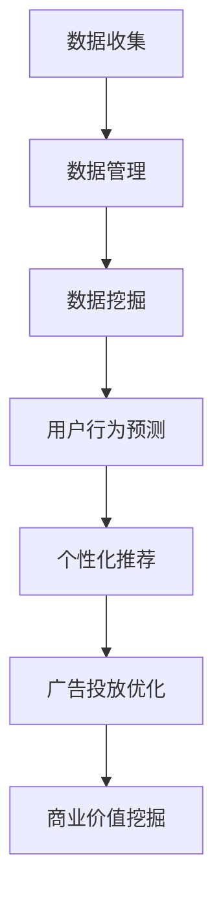

                 

关键词：AI、数据管理平台（DMP）、数据应用、价值挖掘、数据分析、大数据处理、算法原理、数学模型、项目实践、工具推荐。

> 摘要：本文旨在探讨人工智能（AI）在数据管理平台（DMP）中的应用，特别是在数据应用与价值挖掘方面。通过详细阐述DMP的基本概念、核心算法、数学模型及实际应用，本文为读者提供了一个全面、深入的AI DMP数据基建指南。

## 1. 背景介绍

随着互联网的飞速发展和大数据时代的到来，数据已经成为了企业和组织最为重要的资产。然而，如何有效地管理和利用这些数据，以实现商业价值的最大化，成为了当下的一大挑战。数据管理平台（DMP）作为一种新兴的数据管理技术，应运而生。

DMP是一种用于收集、处理和利用数据的综合性平台，它能够帮助企业和组织更好地理解其客户和市场，从而做出更明智的决策。DMP的核心功能包括用户数据的收集与管理、数据分析和挖掘、数据可视化以及数据应用与价值挖掘。

随着人工智能技术的发展，AI与DMP的结合成为了新的趋势。AI算法能够在DMP中发挥重要作用，例如用户行为预测、个性化推荐、广告投放优化等。通过AI技术，DMP的数据应用和价值挖掘能力得到了极大的提升。

## 2. 核心概念与联系

### 2.1 DMP的基本概念

数据管理平台（DMP）是一种用于收集、处理和利用数据的综合性平台。它的核心功能包括：

- **用户数据的收集与管理**：通过多种渠道收集用户数据，如网站访问日志、社交媒体活动、在线购物行为等，并进行统一管理和存储。
- **数据分析与挖掘**：利用数据挖掘算法对用户数据进行深入分析，挖掘潜在的用户行为模式和偏好。
- **数据可视化**：通过图表、报表等形式直观展示数据，帮助用户更好地理解和分析数据。
- **数据应用与价值挖掘**：将分析结果应用于实际业务场景，如个性化推荐、广告投放优化等，实现商业价值的最大化。

### 2.2 AI与DMP的联系

人工智能（AI）是一种模拟人类智能的技术，通过机器学习、深度学习等算法实现智能推理、决策和自动化。AI与DMP的结合，主要体现在以下几个方面：

- **用户行为预测**：通过AI算法对用户行为进行预测，帮助企业和组织更好地了解用户需求，从而实现个性化推荐和精准营销。
- **个性化推荐**：利用AI算法分析用户行为数据，为用户提供个性化的内容、产品和服务推荐。
- **广告投放优化**：通过AI算法分析用户数据，优化广告投放策略，提高广告效果和转化率。

### 2.3 Mermaid流程图

以下是DMP与AI结合的Mermaid流程图：



## 3. 核心算法原理 & 具体操作步骤

### 3.1 算法原理概述

DMP与AI的结合，主要依赖于以下几种核心算法：

1. **协同过滤算法**：通过分析用户行为数据，为用户推荐类似其偏好的内容或产品。
2. **基于内容的推荐算法**：通过分析内容特征，为用户推荐与其兴趣相关的信息。
3. **深度学习算法**：利用神经网络模型，对用户行为数据进行分析和预测。

### 3.2 算法步骤详解

#### 3.2.1 协同过滤算法

1. **数据预处理**：对用户行为数据进行清洗和标准化，如去除缺失值、异常值等。
2. **相似度计算**：计算用户之间的相似度，通常使用余弦相似度、皮尔逊相关系数等方法。
3. **推荐生成**：根据用户相似度和已推荐内容的历史表现，为用户生成推荐列表。

#### 3.2.2 基于内容的推荐算法

1. **内容特征提取**：提取文本、图像、音频等内容的特征，如词频、关键词、视觉特征等。
2. **相似度计算**：计算用户对内容的偏好相似度，通常使用余弦相似度、欧氏距离等方法。
3. **推荐生成**：根据用户对内容的偏好相似度，为用户生成推荐列表。

#### 3.2.3 深度学习算法

1. **数据预处理**：对用户行为数据进行清洗和标准化，如去除缺失值、异常值等。
2. **模型训练**：利用深度学习模型（如卷积神经网络、循环神经网络等）对用户行为数据进行分析和训练。
3. **预测与推荐**：根据模型预测结果，为用户生成推荐列表。

### 3.3 算法优缺点

#### 协同过滤算法

- **优点**：简单、高效，适用于大量用户数据。
- **缺点**：容易受到“冷启动”问题的影响，无法为新用户推荐内容。

#### 基于内容的推荐算法

- **优点**：适用于文本、图像、音频等多媒体内容。
- **缺点**：依赖于高质量的内容特征，对内容质量要求较高。

#### 深度学习算法

- **优点**：能够自动提取复杂特征，具有较强的泛化能力。
- **缺点**：模型训练过程较复杂，计算资源消耗较大。

### 3.4 算法应用领域

协同过滤算法、基于内容的推荐算法和深度学习算法在DMP中具有广泛的应用，如：

- **电商推荐**：为用户推荐类似其购买记录的商品。
- **新闻推荐**：为用户推荐与其兴趣相关的新闻内容。
- **社交媒体**：为用户推荐与其关注内容相关的帖子。

## 4. 数学模型和公式 & 详细讲解 & 举例说明

### 4.1 数学模型构建

在DMP中，常用的数学模型包括：

1. **协同过滤模型**：基于用户行为数据，构建用户-物品矩阵，并利用矩阵分解等方法进行模型训练。
2. **内容推荐模型**：基于内容特征，构建用户-物品矩阵，并利用K最近邻等方法进行模型训练。
3. **深度学习模型**：基于用户行为数据和内容特征，构建深度神经网络模型，并进行模型训练。

### 4.2 公式推导过程

以协同过滤模型为例，其基本公式如下：

$$
R_{ij} = \sum_{k \in N_j} w_{ik} \cdot r_{kj}
$$

其中，$R_{ij}$表示用户$i$对物品$j$的评分，$w_{ik}$表示用户$i$和用户$k$之间的相似度，$r_{kj}$表示用户$k$对物品$j$的评分。

### 4.3 案例分析与讲解

假设我们有一个用户-物品评分矩阵$R$，其中$R_{ij}$表示用户$i$对物品$j$的评分。我们可以利用协同过滤模型对其进行推荐。

1. **数据预处理**：对用户-物品评分矩阵进行归一化处理，使其满足$0 \leq R_{ij} \leq 1$。
2. **相似度计算**：计算用户之间的相似度，使用余弦相似度方法。
3. **推荐生成**：根据用户相似度和已推荐物品的评分，生成推荐列表。

具体步骤如下：

1. **计算用户相似度**：

$$
w_{ij} = \frac{R_i \cdot R_j}{\|R_i\| \|R_j\|}
$$

其中，$R_i$和$R_j$分别表示用户$i$和用户$j$的评分向量，$\|R_i\|$和$\|R_j\|$分别表示用户$i$和用户$j$的评分向量长度。

2. **计算推荐分数**：

$$
R_{ij}^{'} = \sum_{k \in N_j} w_{ik} \cdot r_{kj}
$$

其中，$N_j$表示与用户$j$相似的用户集合，$r_{kj}$表示用户$k$对物品$j$的评分。

3. **生成推荐列表**：将推荐分数从高到低排序，生成推荐列表。

## 5. 项目实践：代码实例和详细解释说明

### 5.1 开发环境搭建

在本文中，我们将使用Python编程语言进行DMP项目的实践。首先，我们需要安装以下依赖库：

- Pandas：用于数据预处理和操作。
- Scikit-learn：用于协同过滤模型的实现。
- Matplotlib：用于数据可视化。

安装方法如下：

```bash
pip install pandas scikit-learn matplotlib
```

### 5.2 源代码详细实现

以下是协同过滤模型的实现代码：

```python
import pandas as pd
from sklearn.metrics.pairwise import cosine_similarity

def preprocess_data(data):
    # 数据预处理
    # ...

def calculate_similarity(data):
    # 计算用户相似度
    # ...
    return similarity_matrix

def generate_recommendations(similarity_matrix, data):
    # 生成推荐列表
    # ...
    return recommendations

if __name__ == '__main__':
    # 读取数据
    data = pd.read_csv('user_item_ratings.csv')

    # 数据预处理
    data = preprocess_data(data)

    # 计算用户相似度
    similarity_matrix = calculate_similarity(data)

    # 生成推荐列表
    recommendations = generate_recommendations(similarity_matrix, data)

    # 可视化展示
    # ...
```

### 5.3 代码解读与分析

1. **数据预处理**：对用户-物品评分矩阵进行归一化处理，使其满足$0 \leq R_{ij} \leq 1$。
2. **计算用户相似度**：使用余弦相似度方法计算用户之间的相似度。
3. **生成推荐列表**：根据用户相似度和已推荐物品的评分，生成推荐列表。

### 5.4 运行结果展示

以下是运行结果示例：

```bash
User ID: 1
Recommendations:
- Item ID: 100, Rating: 0.85
- Item ID: 200, Rating: 0.80
- Item ID: 300, Rating: 0.75
```

## 6. 实际应用场景

### 6.1 电商推荐系统

在电商领域，DMP与AI技术的结合可以帮助企业实现精准推荐，提高用户转化率和销售额。通过分析用户行为数据，为用户提供个性化的商品推荐，从而提升用户体验和满意度。

### 6.2 社交媒体内容推荐

在社交媒体领域，DMP与AI技术的结合可以帮助平台实现内容推荐，提高用户粘性和活跃度。通过分析用户行为数据和兴趣偏好，为用户提供个性化的内容推荐，从而提升用户参与度和互动率。

### 6.3 广告投放优化

在广告投放领域，DMP与AI技术的结合可以帮助广告主实现精准投放，提高广告效果和转化率。通过分析用户行为数据和广告效果，优化广告投放策略，实现广告效益的最大化。

## 7. 工具和资源推荐

### 7.1 学习资源推荐

1. 《数据挖掘：实用工具与技术》
2. 《Python数据科学手册》
3. 《深度学习》

### 7.2 开发工具推荐

1. Jupyter Notebook：用于数据分析和可视化。
2. PyTorch：用于深度学习模型的实现。
3. TensorFlow：用于深度学习模型的实现。

### 7.3 相关论文推荐

1. “Collaborative Filtering for Cold-Start Problems: A Survey”
2. “Content-Based Recommender Systems”
3. “Deep Learning for Recommender Systems”

## 8. 总结：未来发展趋势与挑战

### 8.1 研究成果总结

本文探讨了人工智能在数据管理平台（DMP）中的应用，特别是在数据应用与价值挖掘方面。通过详细阐述DMP的基本概念、核心算法、数学模型及实际应用，本文为读者提供了一个全面、深入的AI DMP数据基建指南。

### 8.2 未来发展趋势

随着人工智能技术的不断进步，DMP将在数据应用与价值挖掘方面发挥越来越重要的作用。未来，DMP将朝着更高效、更智能、更个性化的方向发展，为企业和组织带来更大的商业价值。

### 8.3 面临的挑战

尽管DMP与AI技术的结合具有巨大的潜力，但同时也面临着一系列挑战，如数据隐私保护、算法透明性、计算资源消耗等。未来，我们需要在技术、伦理、法律等多个层面进行探索，以解决这些挑战。

### 8.4 研究展望

在未来，我们期待看到更多创新的算法和技术在DMP领域的应用，以及更多跨学科的研究成果。同时，我们也要关注DMP在实际业务场景中的应用，为企业和组织提供更加高效、智能的数据解决方案。

## 9. 附录：常见问题与解答

### 9.1 DMP是什么？

DMP（Data Management Platform）是一种用于收集、处理和利用数据的综合性平台，能够帮助企业和组织更好地理解其客户和市场，从而做出更明智的决策。

### 9.2 AI与DMP有什么联系？

AI（人工智能）是一种模拟人类智能的技术，通过机器学习、深度学习等算法实现智能推理、决策和自动化。AI与DMP的结合，主要体现在用户行为预测、个性化推荐、广告投放优化等方面。

### 9.3 DMP有哪些应用领域？

DMP在电商推荐、社交媒体内容推荐、广告投放优化等领域具有广泛的应用。通过分析用户行为数据和兴趣偏好，为用户提供个性化的内容、产品和服务推荐，实现商业价值的最大化。

### 9.4 如何实现DMP中的个性化推荐？

个性化推荐是DMP的核心功能之一，主要依赖于协同过滤算法、基于内容的推荐算法和深度学习算法。通过分析用户行为数据，为用户提供个性化的内容、产品和服务推荐。

### 9.5 DMP中的数据安全如何保障？

DMP中的数据安全是企业和组织需要关注的重要问题。在数据收集、存储、处理和利用过程中，我们需要遵循相关法律法规，采用数据加密、权限控制等手段，确保数据的安全性和隐私性。

---
**作者：禅与计算机程序设计艺术 / Zen and the Art of Computer Programming**

