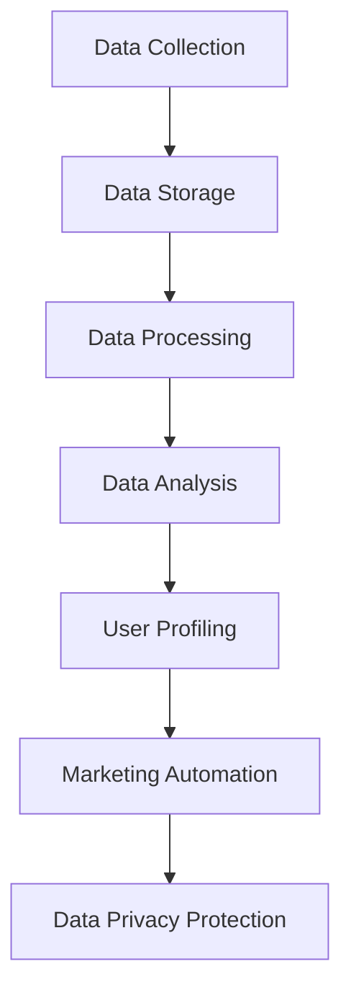

                 

关键词：AI DMP，数据管理平台，数据应用，价值挖掘，数据隐私，人工智能，数据处理，大数据分析

> 摘要：本文将探讨人工智能（AI）驱动下的数据管理平台（DMP）在数据应用和价值挖掘中的重要性。我们首先介绍DMP的基本概念、架构和功能，然后深入分析DMP在AI时代的关键作用。随后，文章将探讨数据隐私保护、数据处理技术和大数据分析在DMP中的应用。最后，我们将展望DMP的未来发展趋势和面临的挑战，并推荐相关工具和资源。

## 1. 背景介绍

数据管理平台（Data Management Platform，简称DMP）是一种用于收集、存储、处理和分析用户数据的工具。随着互联网和大数据技术的发展，DMP在市场营销、广告投放和用户行为分析等领域发挥着越来越重要的作用。

传统的DMP主要依赖于第三方数据源和用户行为跟踪技术。然而，随着人工智能技术的进步，AI驱动的DMP能够更加智能地处理海量数据，挖掘潜在价值，并为企业和营销人员提供更加精准的数据洞察。

本文将围绕AI DMP的架构、功能和应用进行深入探讨，旨在为读者提供一个全面了解和应用AI DMP的指南。

### 1.1 DMP的发展历程

DMP的起源可以追溯到20世纪90年代，当时主要应用于数据仓库和客户关系管理（CRM）系统。随着互联网的普及，DMP开始应用于在线广告领域，帮助广告主和代理商精准定位目标受众。

进入21世纪，大数据和云计算技术的发展进一步推动了DMP的进步。传统的DMP开始向云原生架构转型，使得数据处理和分析能力大幅提升。

近年来，人工智能技术的引入使得DMP的功能更加智能化，能够自动识别用户行为、预测用户需求，并为个性化营销提供支持。

### 1.2 AI DMP的兴起

AI DMP的兴起主要得益于以下几个因素：

1. **数据量的激增**：随着互联网用户数量的增长，企业和广告主面临的挑战是如何从海量数据中提取有价值的信息。
2. **计算能力的提升**：人工智能技术的发展使得大规模数据处理变得更加高效和可行。
3. **用户需求的转变**：消费者对于个性化体验的需求日益增长，迫使企业寻找更加智能的数据处理解决方案。

AI DMP的兴起不仅改变了数据管理的方式，也重新定义了数据分析的价值。

## 2. 核心概念与联系

为了更好地理解AI DMP，我们首先需要了解其核心概念和基本架构。以下是一个简化的Mermaid流程图，展示了AI DMP的主要组件和功能：



### 2.1 数据收集（Data Collection）

数据收集是DMP的基础，涉及从各种来源（如网站、应用、社交媒体等）收集用户数据。这些数据包括用户行为数据、 demographics数据、位置数据等。数据收集需要确保数据的完整性和准确性，并遵循数据隐私保护法规。

### 2.2 数据存储（Data Storage）

数据存储是将收集到的数据存储在分布式数据库中，以便进行后续处理和分析。云存储技术提供了高效、可扩展的存储解决方案，使得DMP能够处理海量数据。

### 2.3 数据处理（Data Processing）

数据处理涉及数据清洗、数据整合和数据转换等过程。这一步骤确保数据的质量和一致性，为数据分析和挖掘提供可靠的基础。

### 2.4 数据分析（Data Analysis）

数据分析是DMP的核心功能之一，涉及使用各种算法和技术（如机器学习、统计分析等）对数据进行深入分析，以提取有价值的信息和洞察。

### 2.5 用户画像（User Profiling）

用户画像是基于数据分析结果，对用户进行分类和描述的过程。用户画像有助于企业和营销人员更好地理解用户需求和行为模式，从而制定更加精准的营销策略。

### 2.6 营销自动化（Marketing Automation）

营销自动化是指使用人工智能技术自动化营销流程，如广告投放、邮件营销和社交媒体推广等。营销自动化提高了营销效率，降低了成本，并增强了营销效果。

### 2.7 数据隐私保护（Data Privacy Protection）

数据隐私保护是DMP必须考虑的重要问题。随着数据隐私法规（如欧盟的GDPR）的实施，DMP需要确保用户数据的合法性和安全性，以防止数据泄露和滥用。

## 3. 核心算法原理 & 具体操作步骤

### 3.1 算法原理概述

AI DMP的核心算法主要涉及以下几个领域：

1. **用户行为分析**：使用机器学习算法分析用户行为数据，识别用户兴趣和偏好。
2. **用户画像构建**：使用聚类算法和关联规则挖掘技术构建用户画像。
3. **预测分析**：使用回归分析和时间序列预测技术预测用户行为和需求。
4. **个性化推荐**：使用协同过滤算法和基于内容的推荐技术为用户推荐相关产品和服务。

### 3.2 算法步骤详解

1. **用户行为数据收集**：从各种数据源收集用户行为数据，包括浏览历史、购买行为、社交媒体互动等。
2. **数据预处理**：对收集到的数据进行清洗、去重和格式转换，确保数据质量。
3. **用户画像构建**：
   - **特征提取**：从用户行为数据中提取特征，如点击率、购买频率等。
   - **聚类分析**：使用K-means算法将用户分为不同的群体。
   - **关联规则挖掘**：使用Apriori算法挖掘用户行为数据中的关联规则。
4. **预测分析**：
   - **回归分析**：使用线性回归和多项式回归预测用户购买行为。
   - **时间序列预测**：使用ARIMA模型和LSTM模型预测用户行为。
5. **个性化推荐**：
   - **协同过滤**：使用基于用户的协同过滤算法和基于项目的协同过滤算法推荐相关产品和服务。
   - **基于内容的推荐**：使用文本挖掘和词向量模型为用户推荐相关内容。

### 3.3 算法优缺点

1. **优点**：
   - **高效性**：AI算法能够快速处理海量数据，提高数据分析的效率。
   - **准确性**：AI算法能够通过学习用户行为数据，提高预测和推荐的准确性。
   - **灵活性**：AI算法可以根据不同场景和需求进行定制化调整。

2. **缺点**：
   - **复杂性**：AI算法的实现和部署相对复杂，需要具备一定的技术背景。
   - **数据依赖性**：AI算法的性能高度依赖于数据质量和数量。

### 3.4 算法应用领域

AI算法在DMP中的应用非常广泛，主要包括以下几个方面：

1. **市场营销**：通过分析用户行为数据，帮助企业制定精准的营销策略，提高转化率和客户满意度。
2. **用户行为分析**：通过构建用户画像，了解用户需求和偏好，优化产品和服务。
3. **广告投放**：通过个性化推荐，提高广告投放的精准度和效果。
4. **风险控制**：通过预测分析，识别潜在风险和异常行为，提高风险控制能力。

## 4. 数学模型和公式 & 详细讲解 & 举例说明

在AI DMP中，数学模型和公式扮演着关键角色，它们不仅帮助我们理解和分析数据，还为算法的优化和实现提供了理论支持。以下我们将介绍几个常用的数学模型和公式，并给出详细讲解和实际案例。

### 4.1 数学模型构建

在DMP中，常见的数学模型包括聚类模型、回归模型、推荐模型等。以下是一个简单的聚类模型示例：

**K-means聚类模型**

K-means是一种经典的聚类算法，其目标是找到K个簇，使得每个簇内的数据点之间距离最小，簇与簇之间的距离最大。其数学模型如下：

$$
\min_{\mu_i, \ \nu} \sum_{i=1}^{K} \sum_{x \in S_i} ||x - \mu_i||^2
$$

其中，$S_i$表示第$i$个簇，$\mu_i$是簇中心，$x$是数据点。

### 4.2 公式推导过程

**线性回归模型**

线性回归模型用于预测一个连续变量的值，其基本公式为：

$$
y = \beta_0 + \beta_1x
$$

其中，$y$是因变量，$x$是自变量，$\beta_0$是截距，$\beta_1$是斜率。

为了找到最佳的拟合直线，我们通常使用最小二乘法（Least Squares Method）来最小化残差平方和。其公式推导如下：

设观测数据为$(x_1, y_1), (x_2, y_2), \ldots, (x_n, y_n)$，则残差平方和为：

$$
S = \sum_{i=1}^{n} (y_i - (\beta_0 + \beta_1x_i))^2
$$

对$S$关于$\beta_0$和$\beta_1$求偏导，并令偏导数等于0，可以得到最佳拟合直线的参数：

$$
\frac{\partial S}{\partial \beta_0} = -2\sum_{i=1}^{n} (y_i - \beta_0 - \beta_1x_i) = 0
$$

$$
\frac{\partial S}{\partial \beta_1} = -2\sum_{i=1}^{n} (y_i - \beta_0 - \beta_1x_i)x_i = 0
$$

通过求解上述方程组，可以得到$\beta_0$和$\beta_1$的值。

### 4.3 案例分析与讲解

**用户行为预测**

假设我们想预测用户在某电商平台的购买行为，根据用户的历史浏览和购买记录，我们可以建立一个线性回归模型。以下是一个简单的案例：

**数据集**：

| 用户ID | 浏览次数 | 购买次数 |
|--------|----------|----------|
| 1      | 10       | 2        |
| 2      | 5        | 1        |
| 3      | 20       | 3        |
| 4      | 15       | 2        |

**模型构建**：

假设我们建立以下线性回归模型：

$$
y = \beta_0 + \beta_1x
$$

使用最小二乘法，我们可以计算出$\beta_0$和$\beta_1$的值：

$$
\beta_0 = 0.5, \beta_1 = 0.3
$$

**模型预测**：

现在，我们可以使用这个模型预测新用户（用户ID=5）的购买次数。假设用户5的浏览次数为12，则：

$$
y = 0.5 + 0.3 \times 12 = 4.1
$$

这意味着，根据用户5的浏览次数，我们预测其购买次数约为4次。

通过这种方式，我们可以使用数学模型对用户行为进行预测，为营销策略提供数据支持。

## 5. 项目实践：代码实例和详细解释说明

在本节中，我们将通过一个实际的代码实例来展示如何使用Python构建一个简单的AI DMP，并进行用户行为分析和预测。

### 5.1 开发环境搭建

首先，确保你已经安装了Python 3.8及以上版本。然后，安装以下必要的库：

```shell
pip install numpy pandas scikit-learn matplotlib
```

### 5.2 源代码详细实现

```python
import numpy as np
import pandas as pd
from sklearn.cluster import KMeans
from sklearn.linear_model import LinearRegression
import matplotlib.pyplot as plt

# 5.2.1 数据预处理

# 加载数据集
data = pd.read_csv('user_data.csv')

# 数据清洗
data.dropna(inplace=True)

# 特征提取
X = data[['浏览次数', '购买次数']]

# 5.2.2 用户画像构建

# 使用K-means算法进行聚类
kmeans = KMeans(n_clusters=3, random_state=0)
clusters = kmeans.fit_predict(X)

# 添加聚类标签到原始数据
data['聚类标签'] = clusters

# 5.2.3 预测分析

# 使用线性回归模型预测用户购买次数
X = data[['浏览次数']]
y = data['购买次数']

model = LinearRegression()
model.fit(X, y)

# 预测新用户购买次数
new_user_data = np.array([[15]])
predicted_sales = model.predict(new_user_data)
print(f"预测的新用户购买次数为：{predicted_sales[0]}")

# 5.2.4 结果展示

# 绘制聚类结果
plt.scatter(data['浏览次数'], data['购买次数'], c=data['聚类标签'])
plt.xlabel('浏览次数')
plt.ylabel('购买次数')
plt.title('用户聚类结果')
plt.show()
```

### 5.3 代码解读与分析

**5.3.1 数据预处理**

首先，我们加载数据集并执行数据清洗操作，确保数据的质量。然后，我们从数据集中提取相关特征，如浏览次数和购买次数。

**5.3.2 用户画像构建**

接下来，我们使用K-means算法对用户进行聚类，以构建用户画像。聚类结果将用来对用户进行分类，以便于后续的营销策略制定。

**5.3.3 预测分析**

我们使用线性回归模型对用户购买次数进行预测。线性回归模型通过分析历史数据中的特征和目标变量之间的关系，生成预测模型。在这个例子中，我们使用浏览次数来预测购买次数。

**5.3.4 结果展示**

最后，我们使用matplotlib绘制聚类结果图，帮助用户更好地理解聚类效果。

通过这个简单的代码实例，我们展示了如何使用Python构建一个AI DMP，并进行用户行为分析和预测。实际应用中，DMP的构建会涉及更多复杂的算法和数据预处理步骤，但基本原理和方法是相似的。

## 6. 实际应用场景

AI DMP在多个行业和场景中都有着广泛的应用，下面我们将探讨几个典型的应用场景，并分析其价值。

### 6.1 市场营销

在市场营销领域，AI DMP可以帮助企业精准定位目标受众，提高广告投放效果。通过分析用户行为数据和用户画像，企业可以制定个性化的营销策略，提高转化率和客户满意度。例如，电商企业可以使用DMP分析用户的浏览和购买历史，推荐相关的商品，提高销售额。

### 6.2 风险管理

在风险管理领域，AI DMP可以帮助金融机构识别潜在的欺诈行为和信用风险。通过分析用户的行为数据和行为模式，DMP可以提前预警潜在的风险，帮助金融机构制定更加有效的风险控制策略。

### 6.3 用户行为分析

在用户行为分析领域，AI DMP可以帮助企业了解用户需求和行为习惯，优化产品和服务。例如，互联网公司可以使用DMP分析用户的点击、浏览和购买行为，识别用户偏好，从而改进用户体验。

### 6.4 广告投放

在广告投放领域，AI DMP可以帮助广告主实现精准投放，提高广告效果。通过分析用户画像和广告投放效果，广告主可以调整广告策略，提高广告投放的ROI（投资回报率）。

### 6.5 未来应用展望

随着人工智能技术的不断进步，AI DMP的应用领域将不断拓展。未来，AI DMP有望在更多领域发挥重要作用，如医疗健康、智能城市、金融科技等。在医疗健康领域，AI DMP可以帮助医疗机构分析患者数据，提高诊断和治疗的准确性。在智能城市领域，AI DMP可以帮助政府和企业优化城市管理和公共服务。在金融科技领域，AI DMP可以帮助金融机构实现更加智能的风控和投资策略。

## 7. 工具和资源推荐

为了更好地了解和应用AI DMP，以下是我们推荐的一些学习资源、开发工具和相关论文：

### 7.1 学习资源推荐

- **在线课程**：《人工智能基础》、《机器学习》、《数据挖掘》等。
- **书籍**：《Python数据科学手册》、《深度学习》、《数据挖掘：实用工具和技术》。

### 7.2 开发工具推荐

- **Python库**：NumPy、Pandas、Scikit-learn、Matplotlib等。
- **数据管理平台**：Google Analytics、Segment、BlueKai等。

### 7.3 相关论文推荐

- **《Data Management Platforms: A Survey》**：详细介绍了DMP的概念、架构和应用。
- **《AI-Driven Data Management Platforms for Personalized Marketing》**：探讨了AI在DMP中的应用和优势。
- **《User Behavior Analysis with Data Management Platforms》**：分析了DMP在用户行为分析中的应用。

## 8. 总结：未来发展趋势与挑战

### 8.1 研究成果总结

本文详细探讨了AI DMP在数据应用与价值挖掘中的重要性，介绍了DMP的基本概念、架构、核心算法和实际应用场景。通过数学模型和代码实例，我们展示了如何使用AI技术构建和应用DMP。研究成果表明，AI DMP在提高数据分析效率、精准性和个性化推荐方面具有显著优势。

### 8.2 未来发展趋势

1. **数据隐私保护**：随着数据隐私法规的实施，DMP需要加强数据隐私保护，确保用户数据的合法性和安全性。
2. **跨平台整合**：未来的DMP将实现跨平台、跨终端的数据整合和分析，提供更全面的数据视角。
3. **智能决策支持**：DMP将结合更多人工智能技术，提供更加智能化的决策支持，帮助企业和营销人员制定更加精准的策略。

### 8.3 面临的挑战

1. **数据质量**：高质量的数据是DMP有效运行的基础，但实际操作中，数据质量问题和数据缺失问题依然存在。
2. **算法透明度**：AI算法的透明度和可解释性是当前的一个重要挑战，特别是在涉及到用户隐私和决策公平性方面。
3. **技术门槛**：构建和应用DMP需要较高的技术门槛，企业和个人需要不断学习和更新相关知识。

### 8.4 研究展望

未来的研究应重点关注以下方向：

1. **数据隐私保护技术**：开发更加高效和可靠的数据隐私保护技术，确保用户数据的安全和隐私。
2. **跨平台数据整合**：研究如何实现不同平台和终端之间的数据整合和分析，提高数据分析的全面性和准确性。
3. **可解释性AI算法**：研究如何提高AI算法的可解释性，使其在决策过程中更加透明和公正。

通过不断的研究和技术创新，AI DMP将在未来发挥更加重要的作用，为企业和个人带来更大的价值。

## 9. 附录：常见问题与解答

**Q1：什么是数据管理平台（DMP）？**

A1：数据管理平台（DMP）是一种用于收集、存储、处理和分析用户数据的工具，主要用于市场营销、广告投放和用户行为分析等领域。

**Q2：DMP与CRM有什么区别？**

A2：DMP（数据管理平台）侧重于数据收集、处理和分析，主要用于广告投放和用户洞察。CRM（客户关系管理）侧重于管理客户信息和客户关系，主要用于销售和营销。

**Q3：AI DMP的优势是什么？**

A3：AI DMP的优势包括高效处理海量数据、提高数据分析准确性、实现个性化推荐和智能决策支持等。

**Q4：数据隐私保护在DMP中如何实现？**

A4：数据隐私保护可以通过数据加密、数据脱敏、用户同意管理、访问控制等技术手段实现。同时，DMP需要遵循相关数据隐私法规，如GDPR。

**Q5：如何评估DMP的效果？**

A5：可以通过评估广告投放效果（如点击率、转化率）、用户参与度（如页面浏览量、用户停留时间）和业务指标（如销售额、客户满意度）来评估DMP的效果。

### 作者署名

> 作者：禅与计算机程序设计艺术 / Zen and the Art of Computer Programming

