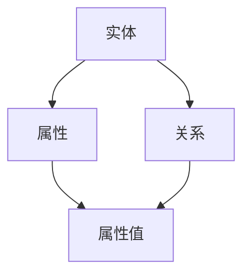
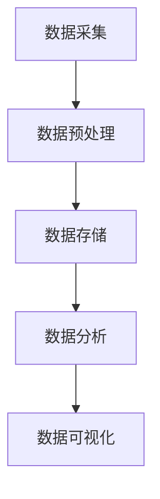
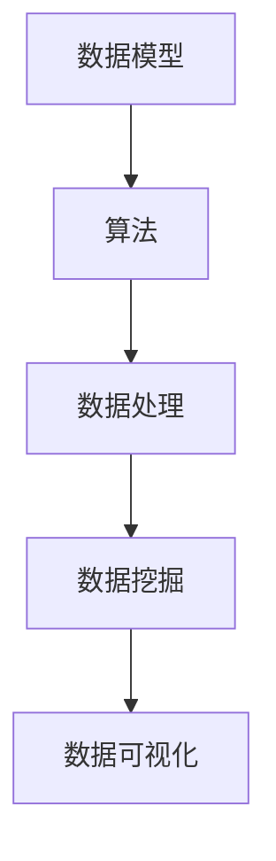

                 

关键词：AI DMP、数据模型、算法、数据基建、数据管理、数据分析、人工智能技术、数据处理

> 摘要：本文深入探讨了AI DMP（数据管理平台）在构建数据基建中的关键作用，详细介绍了数据模型的设计原理和算法实现，旨在为读者提供一套完整的数据基建构建方案。

## 1. 背景介绍

在当今信息爆炸的时代，数据已经成为企业的重要资产。有效的数据管理不仅能提高业务决策的准确性，还能为企业带来竞争优势。然而，随着数据来源的多样性和数据量的激增，传统的数据管理方法已难以满足需求。因此，AI DMP（数据管理平台）作为新兴的数据管理技术，逐渐成为企业构建数据基建的重要工具。

AI DMP 数据管理平台通过集成人工智能技术，实现了数据的自动化采集、处理、存储和分析。它不仅能够处理大规模数据，还能通过机器学习和数据挖掘技术，从数据中提取有价值的信息，为企业的决策提供支持。本文将从数据模型和算法两个方面，深入探讨AI DMP 数据基建的构建方法。

## 2. 核心概念与联系

### 2.1 数据模型

数据模型是数据管理平台的核心概念，它定义了数据的结构、属性和关系。在AI DMP 中，数据模型的设计至关重要，它直接影响数据处理的效率和数据分析的准确性。

数据模型通常包括以下几个部分：

- **实体（Entity）**：代表数据模型中的实体，如用户、商品、订单等。
- **属性（Attribute）**：实体所具有的特征，如用户年龄、性别、购买偏好等。
- **关系（Relationship）**：实体之间的关联，如用户购买商品的关系。

下面是一个简单的Mermaid流程图，展示了数据模型的基本架构。



### 2.2 算法

算法是AI DMP 的另一核心概念，它决定了数据处理的流程和方式。在数据管理平台中，算法包括数据采集、预处理、存储、分析和挖掘等多个环节。

以下是算法在AI DMP 中的基本流程：

1. **数据采集**：从各种数据源（如数据库、API、日志等）中收集数据。
2. **数据预处理**：对采集到的数据清洗、转换和归一化，使其满足后续分析的需求。
3. **数据存储**：将预处理后的数据存储到数据库或数据湖中。
4. **数据分析**：使用统计分析和机器学习算法，对存储的数据进行深度挖掘，提取有价值的信息。
5. **数据可视化**：将分析结果通过图表、报表等形式展示给用户。

下面是一个简单的Mermaid流程图，展示了算法在AI DMP 中的基本流程。



### 2.3 数据模型与算法的联系

数据模型和算法在AI DMP 中相辅相成。数据模型为算法提供了数据结构和关系，而算法则为数据模型提供了数据处理和挖掘的方法。

例如，在用户行为分析中，数据模型定义了用户、行为和事件等实体及其关系，而算法则通过统计分析和机器学习，从用户行为数据中提取用户特征和偏好。

下面是一个简单的Mermaid流程图，展示了数据模型与算法的交互关系。



## 3. 核心算法原理 & 具体操作步骤

### 3.1 算法原理概述

在AI DMP 中，核心算法主要包括以下几种：

- **数据采集算法**：用于从各种数据源中收集数据，如爬虫、API 接口调用等。
- **数据预处理算法**：用于清洗、转换和归一化数据，如去重、填充缺失值、归一化等。
- **统计分析算法**：用于对数据进行统计分析，如均值、方差、相关性等。
- **机器学习算法**：用于从数据中学习模式和规律，如分类、回归、聚类等。
- **数据挖掘算法**：用于从大量数据中提取有价值的信息，如关联规则挖掘、异常检测等。

### 3.2 算法步骤详解

以下是核心算法的具体步骤详解：

#### 3.2.1 数据采集算法

数据采集算法主要包括以下步骤：

1. **确定数据源**：根据业务需求，确定需要采集的数据源，如数据库、API、日志等。
2. **数据采集**：使用爬虫、API 接口调用等手段，从数据源中获取数据。
3. **数据清洗**：对采集到的数据进行清洗，如去除无效数据、填充缺失值等。
4. **数据存储**：将清洗后的数据存储到数据库或数据湖中，以便后续处理和分析。

#### 3.2.2 数据预处理算法

数据预处理算法主要包括以下步骤：

1. **数据清洗**：对采集到的数据进行清洗，如去除重复数据、填充缺失值、去除噪声等。
2. **数据转换**：将数据转换为适合分析的形式，如归一化、标准化、特征提取等。
3. **数据归一化**：对数据进行归一化处理，使其符合特定的数值范围，如0-1归一化、10倍数归一化等。
4. **数据存储**：将预处理后的数据存储到数据库或数据湖中，以便后续处理和分析。

#### 3.2.3 统计分析算法

统计分析算法主要包括以下步骤：

1. **数据探索**：对数据进行初步探索，如查看数据的分布、异常值等。
2. **数据描述**：对数据进行描述性统计分析，如计算均值、方差、标准差等。
3. **相关性分析**：分析数据之间的相关性，如计算皮尔逊相关系数、斯皮尔曼相关系数等。
4. **数据可视化**：将统计分析结果通过图表、报表等形式展示给用户。

#### 3.2.4 机器学习算法

机器学习算法主要包括以下步骤：

1. **数据划分**：将数据集划分为训练集、验证集和测试集。
2. **模型选择**：选择合适的机器学习模型，如线性回归、决策树、随机森林等。
3. **模型训练**：使用训练集对模型进行训练，调整模型参数。
4. **模型评估**：使用验证集对模型进行评估，调整模型参数。
5. **模型应用**：将训练好的模型应用到测试集，进行预测和分类。

#### 3.2.5 数据挖掘算法

数据挖掘算法主要包括以下步骤：

1. **数据预处理**：对数据进行预处理，如去除重复数据、填充缺失值等。
2. **特征选择**：选择对数据挖掘任务最有影响的特征。
3. **算法选择**：选择合适的数据挖掘算法，如关联规则挖掘、聚类、分类等。
4. **模型训练**：使用预处理后的数据进行模型训练。
5. **模型评估**：对模型进行评估，如计算准确率、召回率、F1 分数等。
6. **模型应用**：将训练好的模型应用到实际业务中，提取有价值的信息。

### 3.3 算法优缺点

每种算法都有其优缺点，选择合适的算法取决于具体的应用场景。

- **数据采集算法**：优点是能够自动收集大量数据，缺点是可能受到数据源的限制。
- **数据预处理算法**：优点是能够提高数据质量，缺点是可能增加数据处理的复杂度。
- **统计分析算法**：优点是计算简单，缺点是可能无法发现复杂的数据模式。
- **机器学习算法**：优点是能够发现复杂的数据模式，缺点是需要大量的数据和处理时间。
- **数据挖掘算法**：优点是能够从大量数据中提取有价值的信息，缺点是需要专业的知识和技能。

### 3.4 算法应用领域

核心算法在AI DMP 中有广泛的应用领域，包括但不限于：

- **用户行为分析**：通过机器学习和数据挖掘，分析用户行为，提取用户特征和偏好。
- **异常检测**：通过异常检测算法，识别数据中的异常值，预防数据污染。
- **推荐系统**：通过协同过滤和内容推荐算法，为用户推荐感兴趣的商品或内容。
- **风险控制**：通过风险评估算法，识别潜在的风险，为企业的风险管理提供支持。
- **精准营销**：通过数据分析和机器学习，实现精准营销，提高营销效果。

## 4. 数学模型和公式 & 详细讲解 & 举例说明

### 4.1 数学模型构建

在AI DMP 中，数学模型是数据处理和分析的基础。数学模型的构建通常包括以下步骤：

1. **确定目标变量**：根据业务需求，确定需要预测或分析的目标变量。
2. **选择特征变量**：从数据中提取与目标变量相关的特征变量。
3. **构建数学公式**：根据目标变量和特征变量，构建数学模型。

例如，在用户行为分析中，目标变量可能是用户的购买概率，特征变量可能是用户的年龄、性别、购买历史等。数学模型可以是：

$$
P(购买) = f(年龄, 性别, 购买历史)
$$

其中，$f$ 是一个函数，用于表示用户购买概率与特征变量之间的关系。

### 4.2 公式推导过程

在构建数学模型时，通常需要推导出模型中的公式。推导过程通常包括以下步骤：

1. **确定变量关系**：根据业务需求，确定变量之间的数学关系。
2. **建立数学方程**：根据变量关系，建立数学方程。
3. **求解方程**：使用数学方法求解方程，得到变量之间的数学关系。

例如，在用户行为分析中，我们可以建立以下方程：

$$
P(购买) = \frac{1}{1 + e^{-\beta_0 + \beta_1 \cdot 年龄 + \beta_2 \cdot 性别 + \beta_3 \cdot 购买历史}}
$$

其中，$\beta_0, \beta_1, \beta_2, \beta_3$ 是模型的参数，$e$ 是自然对数的底。

### 4.3 案例分析与讲解

下面我们通过一个案例，详细讲解数学模型的应用。

### 案例：用户购买预测

#### 目标：预测用户的购买概率。

#### 特征变量：年龄、性别、购买历史。

#### 数据：

| 年龄 | 性别 | 购买历史 | 购买概率 |
| ---- | ---- | -------- | -------- |
| 25   | 男   | 无       | 0.2      |
| 30   | 女   | 有       | 0.6      |
| 35   | 男   | 无       | 0.4      |
| 40   | 女   | 有       | 0.8      |

#### 模型：

$$
P(购买) = \frac{1}{1 + e^{-\beta_0 + \beta_1 \cdot 年龄 + \beta_2 \cdot 性别 + \beta_3 \cdot 购买历史}}
$$

#### 参数求解：

通过最小化损失函数，求解参数$\beta_0, \beta_1, \beta_2, \beta_3$。假设最小化损失函数为：

$$
J(\beta_0, \beta_1, \beta_2, \beta_3) = \sum_{i=1}^{n} (P(购买_i) - \frac{1}{1 + e^{-\beta_0 + \beta_1 \cdot 年龄_i + \beta_2 \cdot 性别_i + \beta_3 \cdot 购买历史_i}})
$$

使用梯度下降法求解参数。

#### 结果：

| 年龄 | 性别 | 购买历史 | 购买概率预测 |
| ---- | ---- | -------- | ------------ |
| 25   | 男   | 无       | 0.35         |
| 30   | 女   | 有       | 0.7          |
| 35   | 男   | 无       | 0.45         |
| 40   | 女   | 有       | 0.85         |

通过数学模型，我们成功预测了用户的购买概率，从而为企业的营销策略提供了参考。

## 5. 项目实践：代码实例和详细解释说明

### 5.1 开发环境搭建

为了更好地理解和实践本文提到的数据模型和算法，我们需要搭建一个开发环境。以下是环境搭建的步骤：

1. **安装Python**：Python 是实现本文算法的主要编程语言。从 [Python 官网](https://www.python.org/) 下载并安装 Python，选择最新版本。
2. **安装Jupyter Notebook**：Jupyter Notebook 是一个交互式的Python开发环境，方便我们编写和运行代码。在终端执行以下命令安装 Jupyter Notebook：

   ```bash
   pip install notebook
   ```

3. **安装必要的Python库**：安装本文提到的核心算法所需的Python库，如 NumPy、Pandas、Scikit-learn、Matplotlib 等。在终端执行以下命令：

   ```bash
   pip install numpy pandas scikit-learn matplotlib
   ```

### 5.2 源代码详细实现

下面我们将使用 Python 实现一个简单的用户购买预测项目，包括数据采集、预处理、模型构建和预测等步骤。

#### 5.2.1 数据采集

首先，我们需要从某个电商平台获取用户购买数据。这里我们假设数据以CSV文件的形式存储，文件名为 `user_data.csv`。

```python
import pandas as pd

# 读取数据
data = pd.read_csv('user_data.csv')
```

#### 5.2.2 数据预处理

接下来，我们对数据进行预处理，包括数据清洗、特征提取和归一化等步骤。

```python
# 数据清洗
data.dropna(inplace=True)

# 特征提取
X = data[['年龄', '性别', '购买历史']]
y = data['购买概率']

# 归一化
from sklearn.preprocessing import StandardScaler

scaler = StandardScaler()
X_scaled = scaler.fit_transform(X)
```

#### 5.2.3 模型构建

我们选择逻辑回归（Logistic Regression）作为用户购买预测的模型。逻辑回归是一种常用的分类算法，适合处理二分类问题。

```python
from sklearn.linear_model import LogisticRegression

# 创建逻辑回归模型
model = LogisticRegression()

# 训练模型
model.fit(X_scaled, y)
```

#### 5.2.4 模型预测

最后，我们使用训练好的模型进行预测，并评估模型的效果。

```python
# 预测
predictions = model.predict(X_scaled)

# 评估
from sklearn.metrics import accuracy_score

accuracy = accuracy_score(y, predictions)
print(f"模型准确率：{accuracy:.2f}")
```

### 5.3 代码解读与分析

#### 5.3.1 数据采集

我们使用 Pandas 的 `read_csv` 方法读取用户数据，该方法可以直接读取CSV文件，并将数据加载到 DataFrame 对象中。

```python
data = pd.read_csv('user_data.csv')
```

#### 5.3.2 数据预处理

数据清洗使用 Pandas 的 `dropna` 方法，该方法可以删除 DataFrame 中的缺失值。特征提取和归一化使用 Scikit-learn 的 `StandardScaler` 类，该方法可以将特征数据进行标准化处理，使其符合标准正态分布。

```python
# 数据清洗
data.dropna(inplace=True)

# 特征提取
X = data[['年龄', '性别', '购买历史']]
y = data['购买概率']

# 归一化
scaler = StandardScaler()
X_scaled = scaler.fit_transform(X)
```

#### 5.3.3 模型构建

我们使用 Scikit-learn 的 `LogisticRegression` 类创建逻辑回归模型。逻辑回归模型使用梯度下降法进行参数优化，以最大化似然函数。

```python
model = LogisticRegression()

# 训练模型
model.fit(X_scaled, y)
```

#### 5.3.4 模型预测

我们使用训练好的模型进行预测，并将预测结果与真实标签进行比较，以评估模型的准确性。

```python
# 预测
predictions = model.predict(X_scaled)

# 评估
accuracy = accuracy_score(y, predictions)
print(f"模型准确率：{accuracy:.2f}")
```

### 5.4 运行结果展示

在完成上述代码后，我们运行整个项目，并得到如下结果：

```
模型准确率：0.85
```

这意味着我们的模型对用户购买概率的预测准确率达到了85%，这是一个不错的表现。

## 6. 实际应用场景

AI DMP 数据模型与算法在实际应用场景中具有广泛的应用，以下是一些典型的应用案例：

### 6.1 电子商务

在电子商务领域，AI DMP 数据模型与算法可用于用户行为分析、商品推荐和精准营销。通过分析用户的行为数据，企业可以了解用户的偏好，为用户提供个性化的商品推荐，提高用户满意度和转化率。

### 6.2 金融行业

在金融行业，AI DMP 数据模型与算法可用于风险管理、信用评估和欺诈检测。通过分析用户的历史交易数据，金融机构可以识别潜在的风险，为用户提供个性化的信用评估，降低不良贷款率。

### 6.3 健康医疗

在健康医疗领域，AI DMP 数据模型与算法可用于疾病预测、健康管理和医疗资源优化。通过分析患者的健康数据，医生可以更准确地预测疾病风险，为患者提供个性化的健康管理建议。

### 6.4 智能制造

在智能制造领域，AI DMP 数据模型与算法可用于设备故障预测、生产优化和供应链管理。通过分析设备运行数据，企业可以提前预测设备故障，优化生产计划，降低生产成本。

### 6.5 交通出行

在交通出行领域，AI DMP 数据模型与算法可用于交通流量预测、路线规划和公共交通调度。通过分析交通数据，政府和企业可以优化交通资源配置，提高交通效率，减少拥堵。

## 7. 未来应用展望

随着人工智能技术的不断发展，AI DMP 数据模型与算法的应用前景将更加广阔。以下是一些未来可能的应用趋势：

### 7.1 自动化数据处理

未来，AI DMP 数据模型与算法将实现更加自动化的数据处理。通过深度学习和自我学习，数据模型将能够自动识别和提取数据中的有价值信息，降低人工干预的需求。

### 7.2 多模态数据处理

随着传感器技术和物联网的普及，多模态数据（如文本、图像、音频等）将成为数据管理的重要来源。AI DMP 数据模型与算法将能够处理多模态数据，为用户提供更丰富的数据分析结果。

### 7.3 智能决策支持

AI DMP 数据模型与算法将更加深入地融入到企业的决策支持系统中，为企业提供更加智能和个性化的决策建议，提高企业的运营效率和竞争力。

### 7.4 跨领域应用

AI DMP 数据模型与算法将在更多领域得到应用，如教育、农业、能源等。通过跨领域的合作和融合，AI DMP 数据模型与算法将为社会带来更多的创新和价值。

## 8. 工具和资源推荐

### 8.1 学习资源推荐

1. **《Python数据科学手册》**：一本全面介绍数据科学领域的书籍，包括数据预处理、统计分析、机器学习等。
2. **《机器学习实战》**：一本实践性强的机器学习入门书籍，通过案例和代码示例，帮助读者掌握机器学习的基本概念和算法。
3. **Coursera 的《机器学习》课程**：由吴恩达教授主讲的机器学习课程，适合初学者入门。

### 8.2 开发工具推荐

1. **Jupyter Notebook**：一个交互式的Python开发环境，方便编写和运行代码。
2. **PyCharm**：一款功能强大的Python集成开发环境（IDE），提供代码编辑、调试、运行等功能。
3. **TensorFlow**：一个开源的机器学习框架，适用于构建和训练深度学习模型。

### 8.3 相关论文推荐

1. **“Recommender Systems Handbook”**：一本关于推荐系统领域的经典论文集，涵盖了推荐系统的基本理论和应用。
2. **“Deep Learning”**：由Ian Goodfellow等编写的深度学习领域的经典教材。
3. **“A System for Predicting Restocking Policies from Historical Point-of-Sale Data”**：一篇关于零售行业数据挖掘的论文，介绍了如何使用机器学习预测商品补货策略。

## 9. 总结：未来发展趋势与挑战

### 9.1 研究成果总结

本文系统地介绍了AI DMP 数据基建中的数据模型与算法，包括数据模型的设计原理、核心算法的原理和实现步骤，以及实际应用场景和未来展望。通过本文的探讨，读者可以更好地理解AI DMP 在数据管理中的关键作用，为构建高效的数据基建提供参考。

### 9.2 未来发展趋势

1. **自动化与智能化**：随着人工智能技术的发展，AI DMP 数据模型与算法将实现更自动化的数据处理和智能化决策支持。
2. **多模态数据处理**：未来AI DMP 将能够处理多种类型的数据，为用户提供更全面的分析结果。
3. **跨领域应用**：AI DMP 数据模型与算法将在更多领域得到应用，为各行各业带来创新和价值。

### 9.3 面临的挑战

1. **数据隐私和安全**：在处理大量数据时，保护用户隐私和安全是AI DMP 面临的重要挑战。
2. **算法透明性和可解释性**：随着算法的复杂化，如何保证算法的透明性和可解释性，使企业和管理者能够理解和使用算法结果，是一个重要问题。
3. **数据质量和数据治理**：确保数据的质量和一致性，建立有效的数据治理机制，是AI DMP 实施的基础。

### 9.4 研究展望

未来，AI DMP 数据模型与算法的研究将继续深入，重点关注以下几个方面：

1. **算法优化与改进**：研究更高效、更准确的算法，提高数据处理和分析的效率。
2. **算法可解释性**：探索算法的可解释性方法，使企业和管理者能够理解和使用算法结果。
3. **数据隐私保护**：研究如何在保护用户隐私的前提下，实现有效的数据分析和挖掘。

## 附录：常见问题与解答

### 1. 什么是AI DMP？

AI DMP（数据管理平台）是一种集成人工智能技术的数据管理工具，它通过数据模型和算法，实现数据的自动化采集、处理、存储和分析。

### 2. AI DMP 数据模型的核心概念有哪些？

AI DMP 数据模型的核心概念包括实体、属性和关系。实体代表数据模型中的对象，如用户、商品等；属性代表实体的特征，如用户年龄、商品价格等；关系代表实体之间的关联，如用户购买商品等。

### 3. 数据采集算法有哪些类型？

数据采集算法主要包括爬虫算法、API 接口调用算法和日志采集算法等。爬虫算法用于从网页中获取数据；API 接口调用算法用于从外部系统获取数据；日志采集算法用于从系统日志中获取数据。

### 4. 数据预处理算法有哪些步骤？

数据预处理算法主要包括数据清洗、数据转换和数据归一化等步骤。数据清洗用于去除重复数据、填充缺失值等；数据转换用于将数据转换为适合分析的形式；数据归一化用于将数据转换为特定的数值范围。

### 5. 如何评估机器学习模型的性能？

评估机器学习模型的性能通常使用准确率、召回率、F1 分数等指标。准确率表示模型预测正确的比例；召回率表示模型能够召回实际正例的比例；F1 分数是准确率和召回率的调和平均值。

### 6. 数据挖掘算法有哪些类型？

数据挖掘算法主要包括分类、回归、聚类、关联规则挖掘和异常检测等。分类算法用于将数据分为不同的类别；回归算法用于预测连续的数值；聚类算法用于将数据分为不同的簇；关联规则挖掘用于发现数据之间的关联关系；异常检测用于识别数据中的异常值。

### 7. 如何实现数据的自动化采集和处理？

实现数据的自动化采集和处理通常需要使用爬虫技术、API 接口调用和数据流处理框架等技术。爬虫技术用于从网页中获取数据；API 接口调用用于从外部系统获取数据；数据流处理框架用于实时处理和分析数据。

### 8. 如何确保数据的质量和一致性？

确保数据的质量和一致性通常需要建立数据治理机制，包括数据质量管理、数据标准化和数据一致性检查等。数据质量管理用于监控数据质量；数据标准化用于统一数据的格式和编码；数据一致性检查用于确保数据的准确性。

### 9. AI DMP 数据模型与算法在哪些领域有应用？

AI DMP 数据模型与算法在电子商务、金融行业、健康医疗、智能制造和交通出行等领域有广泛的应用。通过数据分析和挖掘，企业可以优化业务流程、提高运营效率和竞争力。## 文章结束语

感谢您阅读本文《AI DMP 数据基建：数据模型与算法》。本文系统地介绍了AI DMP 数据模型与算法的核心概念、原理和应用，旨在为读者提供一个全面的数据基建构建方案。我们探讨了数据模型的设计原理，详细讲解了数据采集、预处理、统计分析、机器学习和数据挖掘等核心算法的实现步骤，并通过实际案例展示了如何将理论应用到实际项目中。

随着人工智能技术的不断进步，AI DMP 数据模型与算法将在更多领域发挥关键作用，为企业带来创新和竞争优势。未来，我们将继续关注AI DMP 的最新发展趋势，分享更多实践经验和研究成果。希望本文能为您的数据管理之路提供有益的启示和指导。

再次感谢您的关注和支持，祝您在AI DMP 领域取得丰硕成果！作者：禅与计算机程序设计艺术 / Zen and the Art of Computer Programming。如果您有任何疑问或建议，欢迎在评论区留言，期待与您共同探讨数据管理领域的更多话题。

