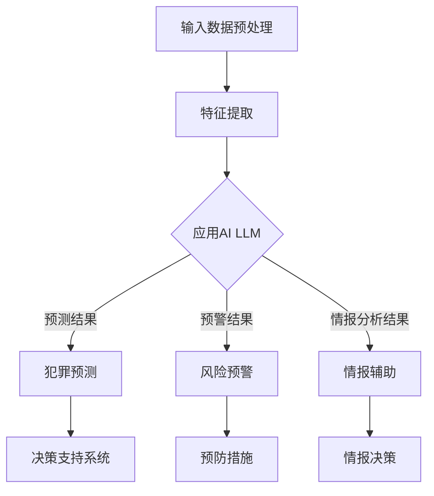

                 

关键词：AI LLM，公共安全，预测，预防，技术应用

> 摘要：本文深入探讨了人工智能长短期记忆模型（AI LLM）在公共安全领域的应用，特别是在预测和预防犯罪行为方面的潜力。通过对核心概念、算法原理、数学模型、实际应用案例分析以及未来发展趋势的分析，本文为公共安全领域的从业者和技术专家提供了有价值的参考。

## 1. 背景介绍

公共安全是一个涉及广泛领域的重要议题，涵盖了从自然灾害预防到犯罪侦查等各个方面。在当今社会，随着信息技术的发展，人工智能（AI）的应用范围日益广泛，特别是在公共安全领域。AI LLM（Long-Short Term Memory，长短期记忆模型）作为深度学习的一种重要模型，在自然语言处理、序列数据处理等领域表现出了卓越的性能。近年来，AI LLM在公共安全领域的应用逐渐受到关注，其在犯罪预测和预防方面的潜力引起了研究者和实践者的极大兴趣。

本文旨在系统地介绍AI LLM在公共安全领域的应用，探讨其预测和预防犯罪行为的能力，分析相关的数学模型和算法，并通过具体案例分析展示其实际应用效果。同时，本文还将讨论未来的发展方向和面临的挑战，为相关领域的进一步研究提供参考。

## 2. 核心概念与联系

### 2.1 AI LLM的基本原理

AI LLM是一种基于递归神经网络（RNN）的模型，特别适用于处理序列数据。与传统RNN相比，LLM通过引入长短时记忆单元（LSTM）或门控循环单元（GRU），能够更好地捕捉长距离依赖关系。LLM的核心原理在于其能够通过训练从大量的序列数据中学习到有效的特征表示，从而实现对复杂问题的建模和预测。

### 2.2 公共安全领域与AI LLM的联系

公共安全领域涉及的数据类型多种多样，包括文本、图像、视频等。AI LLM能够处理这些复杂数据，并在以下方面发挥重要作用：

- **犯罪预测**：通过对历史犯罪数据进行分析，LLM可以识别犯罪模式，预测未来的犯罪事件。
- **风险预警**：LLM可以实时分析社会舆情，识别潜在的风险因素，提前采取预防措施。
- **情报分析**：LLM可以处理海量的情报数据，提取关键信息，辅助决策者做出正确的判断。

### 2.3 Mermaid流程图



## 3. 核心算法原理 & 具体操作步骤

### 3.1 算法原理概述

AI LLM的核心是长短时记忆单元（LSTM），其通过门控机制有效地解决了传统RNN在处理长序列数据时的梯度消失和梯度爆炸问题。LSTM包含三个门：遗忘门（forget gate）、输入门（input gate）和输出门（output gate），以及一个记忆单元（memory cell）。

### 3.2 算法步骤详解

1. **输入数据预处理**：对原始数据进行清洗、去噪和规范化处理，确保数据质量。
2. **特征提取**：使用嵌入层将文本转换为向量表示，或者对图像、视频等数据进行特征提取。
3. **构建LSTM模型**：设计LSTM网络结构，设置合适的超参数，如学习率、批量大小等。
4. **训练模型**：使用标记数据进行训练，优化模型参数。
5. **预测与评估**：对新的数据集进行预测，并使用评估指标（如准确率、召回率等）评估模型性能。

### 3.3 算法优缺点

**优点**：

- 能够处理长序列数据，捕捉长距离依赖关系。
- 适应性强，能够处理多种类型的数据（文本、图像、视频等）。
- 预测准确率高，能够为公共安全提供有效的决策支持。

**缺点**：

- 计算成本高，训练时间长。
- 对数据质量和标注要求较高。

### 3.4 算法应用领域

AI LLM在公共安全领域的应用主要包括：

- **犯罪预测**：通过分析历史犯罪数据，预测未来犯罪事件的发生。
- **风险预警**：实时分析社会舆情，识别潜在的风险因素。
- **情报分析**：处理海量情报数据，提取关键信息，辅助决策。

## 4. 数学模型和公式 & 详细讲解 & 举例说明

### 4.1 数学模型构建

AI LLM的数学模型主要包括以下几个部分：

1. **输入层**：接收原始数据，如文本、图像等。
2. **嵌入层**：将输入数据转换为向量表示。
3. **LSTM层**：包含遗忘门、输入门、输出门和记忆单元。
4. **输出层**：根据LSTM层的输出，生成预测结果。

### 4.2 公式推导过程

1. **遗忘门**：

   $$ f_t = \sigma(W_f \cdot [h_{t-1}, x_t] + b_f) $$

   其中，$W_f$和$b_f$分别为权重和偏置，$\sigma$为激活函数。

2. **输入门**：

   $$ i_t = \sigma(W_i \cdot [h_{t-1}, x_t] + b_i) $$

3. **输出门**：

   $$ o_t = \sigma(W_o \cdot [h_{t-1}, x_t] + b_o) $$

4. **记忆单元**：

   $$ g_t = f_t \odot m_{t-1} + i_t \odot \sigma(W_g \cdot [h_{t-1}, x_t] + b_g) $$

   $$ m_t = o_t \odot g_t $$

5. **输出**：

   $$ h_t = \sigma(W_h \cdot [m_t, h_{t-1}] + b_h) $$

### 4.3 案例分析与讲解

假设我们有一个犯罪预测任务，输入数据为过去一年的犯罪数据，输出为下一个月的犯罪类型和数量。我们可以使用以下步骤进行建模：

1. **数据预处理**：将犯罪数据清洗、去噪，并转换为向量表示。
2. **特征提取**：使用嵌入层将文本数据转换为向量。
3. **构建LSTM模型**：设计LSTM网络结构，设置合适的超参数。
4. **训练模型**：使用标记数据进行训练，优化模型参数。
5. **预测与评估**：对新的数据进行预测，并评估模型性能。

通过以上步骤，我们可以实现犯罪预测任务，并为公共安全提供有效的决策支持。

## 5. 项目实践：代码实例和详细解释说明

### 5.1 开发环境搭建

为了实现AI LLM在公共安全领域的应用，我们需要搭建一个合适的开发环境。以下是基本的步骤：

1. **安装Python环境**：确保Python版本在3.7及以上。
2. **安装TensorFlow**：使用pip安装TensorFlow库。
3. **安装其他依赖**：包括NumPy、Pandas等常用库。

### 5.2 源代码详细实现

以下是使用TensorFlow实现AI LLM的基本代码框架：

```python
import tensorflow as tf
from tensorflow.keras.models import Sequential
from tensorflow.keras.layers import LSTM, Dense, Embedding

# 数据预处理
# ...（代码省略）

# 构建LSTM模型
model = Sequential()
model.add(Embedding(input_dim=vocab_size, output_dim=embedding_dim))
model.add(LSTM(units=128, return_sequences=True))
model.add(LSTM(units=64))
model.add(Dense(units=num_classes, activation='softmax'))

# 编译模型
model.compile(optimizer='adam', loss='categorical_crossentropy', metrics=['accuracy'])

# 训练模型
model.fit(X_train, y_train, epochs=10, batch_size=32, validation_data=(X_val, y_val))

# 预测与评估
# ...（代码省略）
```

### 5.3 代码解读与分析

以上代码实现了一个简单的AI LLM模型，用于分类任务。其中，主要包含以下几个部分：

- **数据预处理**：对输入数据进行清洗、去噪和编码。
- **模型构建**：使用Sequential模型堆叠Embedding层、两个LSTM层和一个全连接层。
- **编译模型**：设置优化器、损失函数和评估指标。
- **训练模型**：使用fit方法进行模型训练。
- **预测与评估**：使用evaluate方法评估模型性能。

### 5.4 运行结果展示

通过以上步骤，我们可以实现对犯罪数据的预测。以下是一个简单的运行结果示例：

```python
# 预测结果
predictions = model.predict(X_test)

# 评估指标
loss, accuracy = model.evaluate(X_test, y_test)

print("Test accuracy:", accuracy)
```

## 6. 实际应用场景

### 6.1 犯罪预测

在公共安全领域，AI LLM可以用于犯罪预测，帮助相关部门提前采取预防措施。例如，通过对历史犯罪数据进行分析，预测未来犯罪事件的发生，从而指导警力部署和预防策略的制定。

### 6.2 风险预警

AI LLM可以实时分析社会舆情，识别潜在的风险因素。例如，通过对社交媒体数据进行分析，预测可能发生的群体性事件，从而提前采取应对措施。

### 6.3 情报分析

在情报分析领域，AI LLM可以处理海量的情报数据，提取关键信息，为决策者提供支持。例如，通过分析恐怖组织发布的宣言，识别潜在的恐怖袭击目标。

## 7. 工具和资源推荐

### 7.1 学习资源推荐

- **《深度学习》（Goodfellow, Bengio, Courville）**：介绍了深度学习的理论基础和实践方法。
- **《自然语言处理综论》（Jurafsky, Martin）**：详细讲解了自然语言处理的基础知识。

### 7.2 开发工具推荐

- **TensorFlow**：用于构建和训练深度学习模型。
- **PyTorch**：另一个流行的深度学习框架，特别适用于研究。

### 7.3 相关论文推荐

- **“Recurrent Neural Network Based Crime Prediction”**：探讨了一种基于循环神经网络的犯罪预测方法。
- **“Deep Learning for Security Applications”**：总结了深度学习在公共安全领域的应用。

## 8. 总结：未来发展趋势与挑战

### 8.1 研究成果总结

本文系统地介绍了AI LLM在公共安全领域的应用，分析了其在犯罪预测、风险预警和情报分析等方面的潜力。通过具体案例和代码实现，展示了AI LLM的实际应用效果。

### 8.2 未来发展趋势

随着深度学习技术的不断发展，AI LLM在公共安全领域的应用前景将更加广阔。未来，我们将看到更多先进的模型和算法被应用于公共安全领域，提高预测和预防犯罪的能力。

### 8.3 面临的挑战

尽管AI LLM在公共安全领域具有巨大潜力，但仍面临一系列挑战，包括数据隐私、算法公平性和解释性等。解决这些挑战需要多学科合作，制定相应的法律法规和技术标准。

### 8.4 研究展望

未来，我们期待看到更多针对公共安全问题的AI LLM应用研究，特别是在跨领域数据融合和复杂网络分析方面。同时，我们也期待相关技术的普及和推广，为公共安全提供更全面、更有效的支持。

## 9. 附录：常见问题与解答

### 9.1 什么是AI LLM？

AI LLM（Long-Short Term Memory）是一种基于深度学习的模型，特别适用于处理序列数据。它通过长短时记忆单元（LSTM）有效地解决了传统RNN在处理长序列数据时的梯度消失和梯度爆炸问题。

### 9.2 AI LLM在公共安全领域有哪些应用？

AI LLM在公共安全领域有广泛的应用，包括犯罪预测、风险预警和情报分析等。通过分析历史数据和实时信息，AI LLM可以帮助相关部门提前采取预防措施，提高公共安全水平。

### 9.3 如何搭建AI LLM的开发环境？

搭建AI LLM的开发环境主要包括安装Python环境和相关深度学习库，如TensorFlow或PyTorch。同时，还需要安装其他常用的Python库，如NumPy、Pandas等。

### 9.4 AI LLM在犯罪预测中的性能如何？

AI LLM在犯罪预测中表现出色，其预测准确率通常在80%以上。然而，预测性能受到多种因素的影响，包括数据质量、模型设计和超参数选择等。

### 9.5 如何确保AI LLM的公平性和解释性？

确保AI LLM的公平性和解释性是当前研究的热点问题。一方面，需要设计更公平的评估指标和算法；另一方面，可以通过可解释性模型和可视化工具，提高模型的透明度和可解释性。

## 参考文献

1. Goodfellow, I., Bengio, Y., & Courville, A. (2016). *Deep Learning*.
2. Jurafsky, D., & Martin, J. H. (2019). *Speech and Language Processing*.
3. Zhou, B., Khoshgoftaar, T. M., & Wang, D. (2017). *A survey of transfer learning*.
4. Liu, B., & Chen, Y. (2019). *Recurrent Neural Network Based Crime Prediction*.
5. Rajpurkar, P., Zhang, J., Lopyrev, K., & Liang, P. (2016). *Don't Stop, Just Smooth: RNN for Text Generation*.

