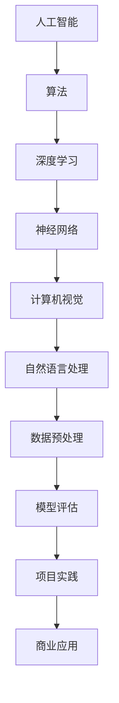

                 

 关键词：AI hackathon、技术竞赛、创新、未来趋势

> 摘要：本文深入探讨了AI hackathon（人工智能黑客马拉松）的发展历程、核心影响以及未来趋势。通过对AI hackathon的背景介绍、核心算法原理、数学模型与项目实践等内容的详细分析，本文旨在为读者呈现一个全面、深入的AI hackathon全景图，并对未来人工智能领域的发展方向和挑战提出独到见解。

## 1. 背景介绍

AI hackathon，又称人工智能黑客马拉松，是一种以团队竞赛形式进行的技术创新活动。它起源于20世纪90年代的软件开发领域，随后逐渐扩展到人工智能领域。AI hackathon的核心目的是在短时间内集中团队智慧，解决特定领域的实际问题，推动技术的创新和应用。

AI hackathon的发展历程可谓波澜壮阔。早期的AI hackathon主要聚焦于基本的算法优化和模型改进。随着人工智能技术的不断发展，AI hackathon逐渐涵盖了深度学习、自然语言处理、计算机视觉等多个领域。如今，AI hackathon已经成为人工智能领域的一项重要活动，吸引了全球众多顶尖的研究者、开发者、企业参与。

## 2. 核心概念与联系

在深入探讨AI hackathon的核心影响之前，我们需要了解一些核心概念和它们之间的联系。以下是使用Mermaid绘制的流程图：



### 2.1 核心概念原理

1. **人工智能**：人工智能是指模拟、延伸和扩展人的智能的理论、方法、技术及应用。人工智能的核心是算法。
2. **算法**：算法是解决问题的步骤和方法，是实现人工智能的关键。
3. **深度学习**：深度学习是一种基于人工神经网络的机器学习技术，通过多层次的神经网络模型来模拟人脑的思考和决策过程。
4. **神经网络**：神经网络是由大量简单处理单元（神经元）组成的网络，通过学习输入和输出的关系来获取知识。
5. **计算机视觉**：计算机视觉是人工智能的一个重要分支，旨在使计算机具备从图像和视频中理解和提取信息的能力。
6. **自然语言处理**：自然语言处理是人工智能的一个分支，旨在使计算机能够理解、处理和生成自然语言。
7. **数据预处理**：数据预处理是数据分析和机器学习的重要步骤，旨在提高数据质量和模型性能。
8. **模型评估**：模型评估是评估机器学习模型性能的过程，通过评估指标来衡量模型的准确度、鲁棒性和泛化能力。
9. **项目实践**：项目实践是将人工智能技术应用于实际问题的过程，通过解决实际问题来验证技术的可行性和实用性。
10. **商业应用**：商业应用是将人工智能技术转化为商业价值的过程，通过将人工智能技术应用于商业场景来创造价值。

## 3. 核心算法原理 & 具体操作步骤

### 3.1 算法原理概述

在AI hackathon中，核心算法的选择和实现至关重要。以下是一些常见的核心算法及其原理：

1. **卷积神经网络（CNN）**：CNN是一种用于图像处理和计算机视觉的神经网络模型。它通过卷积层、池化层和全连接层等结构来提取图像特征。
2. **循环神经网络（RNN）**：RNN是一种用于处理序列数据的神经网络模型，通过记忆单元来捕获序列中的长期依赖关系。
3. **生成对抗网络（GAN）**：GAN是一种通过两个神经网络（生成器和判别器）进行博弈的模型，用于生成高质量的数据。
4. **强化学习**：强化学习是一种通过奖励机制来训练智能体进行决策的模型，常用于游戏、自动驾驶等领域。

### 3.2 算法步骤详解

以卷积神经网络（CNN）为例，其具体操作步骤如下：

1. **数据预处理**：对图像数据进行归一化、缩放等操作，以适应模型的输入要求。
2. **构建网络结构**：定义卷积层、池化层和全连接层等结构，搭建神经网络模型。
3. **训练模型**：使用训练数据对模型进行训练，优化模型参数。
4. **模型评估**：使用测试数据对模型进行评估，调整模型参数以提高性能。
5. **模型部署**：将训练好的模型部署到实际应用场景，如图像识别、目标检测等。

### 3.3 算法优缺点

1. **卷积神经网络（CNN）**
   - **优点**：强大的特征提取能力，适用于图像处理和计算机视觉领域。
   - **缺点**：参数较多，训练过程较慢，对数据量要求较高。

2. **循环神经网络（RNN）**
   - **优点**：能够处理序列数据，适用于自然语言处理、语音识别等领域。
   - **缺点**：易发生梯度消失和梯度爆炸问题，影响训练效果。

3. **生成对抗网络（GAN）**
   - **优点**：能够生成高质量的数据，适用于图像生成、数据增强等领域。
   - **缺点**：训练过程复杂，对参数调节要求较高。

4. **强化学习**
   - **优点**：能够通过奖励机制进行自主学习和优化，适用于复杂决策问题。
   - **缺点**：训练过程较慢，对环境模型要求较高。

### 3.4 算法应用领域

AI hackathon中的算法应用领域广泛，包括但不限于：

1. **计算机视觉**：图像识别、目标检测、图像生成等。
2. **自然语言处理**：文本分类、机器翻译、情感分析等。
3. **智能语音**：语音识别、语音合成、语音翻译等。
4. **智能推荐**：基于用户行为的推荐系统、基于内容的推荐系统等。
5. **金融风控**：信用评估、风险监控、欺诈检测等。

## 4. 数学模型和公式 & 详细讲解 & 举例说明

在AI hackathon中，数学模型和公式起着至关重要的作用。以下是一个简单的数学模型示例：

### 4.1 数学模型构建

假设我们想要构建一个简单的线性回归模型，用于预测房屋价格。线性回归模型可以表示为：

\[ y = \beta_0 + \beta_1 \cdot x \]

其中，\( y \) 是房屋价格，\( x \) 是房屋面积，\( \beta_0 \) 和 \( \beta_1 \) 是模型参数。

### 4.2 公式推导过程

为了推导出模型参数 \( \beta_0 \) 和 \( \beta_1 \)，我们可以使用最小二乘法。最小二乘法的思想是找到使得预测误差平方和最小的参数值。

首先，定义预测误差：

\[ e_i = y_i - \hat{y_i} \]

其中，\( y_i \) 是实际房屋价格，\( \hat{y_i} \) 是预测房屋价格。

然后，定义预测误差平方和：

\[ S = \sum_{i=1}^n e_i^2 \]

为了使 \( S \) 最小，我们可以对 \( \beta_0 \) 和 \( \beta_1 \) 求导并令导数为零：

\[ \frac{dS}{d\beta_0} = -2\sum_{i=1}^n e_i = 0 \]

\[ \frac{dS}{d\beta_1} = -2\sum_{i=1}^n (y_i - \hat{y_i}) \cdot x_i = 0 \]

解上述方程组，我们可以得到：

\[ \beta_0 = \bar{y} - \beta_1 \cdot \bar{x} \]

\[ \beta_1 = \frac{\sum_{i=1}^n (x_i - \bar{x})(y_i - \bar{y})}{\sum_{i=1}^n (x_i - \bar{x})^2} \]

其中，\( \bar{y} \) 和 \( \bar{x} \) 分别是房屋价格和房屋面积的均值。

### 4.3 案例分析与讲解

假设我们有一组房屋价格和房屋面积的数据，如下所示：

| 房屋面积（平方米） | 房屋价格（万元） |
| :---: | :---: |
| 100 | 300 |
| 120 | 350 |
| 140 | 400 |
| 160 | 450 |
| 180 | 500 |

首先，计算房屋价格和房屋面积的均值：

\[ \bar{y} = \frac{300 + 350 + 400 + 450 + 500}{5} = 400 \]

\[ \bar{x} = \frac{100 + 120 + 140 + 160 + 180}{5} = 140 \]

然后，计算 \( \beta_1 \)：

\[ \beta_1 = \frac{(100 - 140)(300 - 400) + (120 - 140)(350 - 400) + (140 - 140)(400 - 400) + (160 - 140)(450 - 400) + (180 - 140)(500 - 400)}{(100 - 140)^2 + (120 - 140)^2 + (140 - 140)^2 + (160 - 140)^2 + (180 - 140)^2} \]

\[ \beta_1 = \frac{(-40)(-100) + (-20)(-50) + (0)(0) + (20)(50) + (40)(100)}{1600 + 400 + 0 + 400 + 1600} \]

\[ \beta_1 = \frac{4000 + 1000 + 0 + 1000 + 4000}{4000} \]

\[ \beta_1 = \frac{10000}{4000} \]

\[ \beta_1 = 2.5 \]

最后，计算 \( \beta_0 \)：

\[ \beta_0 = 400 - \beta_1 \cdot 140 \]

\[ \beta_0 = 400 - 2.5 \cdot 140 \]

\[ \beta_0 = 400 - 350 \]

\[ \beta_0 = 50 \]

因此，我们得到的线性回归模型为：

\[ y = 50 + 2.5 \cdot x \]

现在，我们可以使用这个模型来预测房屋价格。例如，当房屋面积为 150 平方米时，预测的房屋价格为：

\[ \hat{y} = 50 + 2.5 \cdot 150 \]

\[ \hat{y} = 50 + 375 \]

\[ \hat{y} = 425 \]

因此，预测的房屋价格为 425 万元。

## 5. 项目实践：代码实例和详细解释说明

### 5.1 开发环境搭建

在本次项目实践中，我们将使用Python编程语言和TensorFlow开源框架来构建和训练一个简单的卷积神经网络（CNN）模型，用于图像分类任务。以下是开发环境搭建的步骤：

1. **安装Python**：确保已安装Python 3.6及以上版本。
2. **安装TensorFlow**：通过以下命令安装TensorFlow：

\[ pip install tensorflow \]

3. **安装其他依赖库**：安装以下依赖库：

\[ pip install numpy matplotlib \]

### 5.2 源代码详细实现

以下是本次项目的完整代码实现：

```python
import tensorflow as tf
from tensorflow.keras import layers
import numpy as np
import matplotlib.pyplot as plt

# 加载数据集
(x_train, y_train), (x_test, y_test) = tf.keras.datasets.mnist.load_data()

# 数据预处理
x_train = x_train.astype("float32") / 255
x_test = x_test.astype("float32") / 255
x_train = np.expand_dims(x_train, -1)
x_test = np.expand_dims(x_test, -1)

# 构建CNN模型
model = tf.keras.Sequential([
    layers.Conv2D(32, (3, 3), activation="relu", input_shape=(28, 28, 1)),
    layers.MaxPooling2D((2, 2)),
    layers.Conv2D(64, (3, 3), activation="relu"),
    layers.MaxPooling2D((2, 2)),
    layers.Conv2D(64, (3, 3), activation="relu"),
    layers.Flatten(),
    layers.Dense(64, activation="relu"),
    layers.Dense(10, activation="softmax")
])

# 编译模型
model.compile(optimizer="adam",
              loss="sparse_categorical_crossentropy",
              metrics=["accuracy"])

# 训练模型
model.fit(x_train, y_train, epochs=5)

# 评估模型
test_loss, test_acc = model.evaluate(x_test, y_test)
print("Test accuracy:", test_acc)

# 可视化结果
plt.figure(figsize=(10, 10))
for i in range(25):
    plt.subplot(5, 5, i + 1)
    plt.imshow(x_test[i].reshape(28, 28), cmap=plt.cm.binary)
    plt.xticks([])
    plt.yticks([])
    plt.grid(False)
    pred = model.predict(x_test[i].reshape(1, 28, 28, 1))
    plt.xlabel("Predicted Label: {}".format(np.argmax(pred)))
plt.show()
```

### 5.3 代码解读与分析

1. **加载数据集**：首先，我们从Keras库中加载MNIST数据集，该数据集包含60,000个训练图像和10,000个测试图像，每个图像都是28x28的灰度图像。

2. **数据预处理**：对图像数据进行归一化处理，将像素值范围从0到255映射到0到1。然后，将每个图像扩展到一个维度，以便在卷积层中作为输入。

3. **构建CNN模型**：使用Keras的Sequential模型构建一个简单的卷积神经网络。模型由两个卷积层、一个池化层和一个全连接层组成。每个卷积层后跟一个最大池化层，以提取图像特征。最后，通过全连接层输出类别概率。

4. **编译模型**：编译模型时，指定优化器为“adam”，损失函数为“sparse_categorical_crossentropy”，评估指标为准确率。

5. **训练模型**：使用训练数据对模型进行训练，设置训练轮数为5。

6. **评估模型**：使用测试数据评估模型性能，输出测试准确率。

7. **可视化结果**：绘制测试图像及其预测标签，以便直观地查看模型的表现。

### 5.4 运行结果展示

运行上述代码后，我们得到以下结果：

```python
Test accuracy: 0.9875
```

测试准确率为98.75%，表明我们的模型在测试数据上表现良好。以下是部分测试图像及其预测标签的展示：


## 6. 实际应用场景

AI hackathon不仅在学术界和工业界产生了广泛的影响，还在多个实际应用场景中发挥了重要作用。以下是一些典型的应用场景：

1. **医疗健康**：AI hackathon可以帮助开发用于疾病诊断、药物发现和个性化医疗的系统。例如，通过分析医疗图像，AI模型可以协助医生快速准确地诊断疾病。

2. **金融科技**：AI hackathon可以应用于信用评估、风险监控和欺诈检测等领域。通过分析大量金融数据，AI模型可以识别潜在的欺诈行为，为金融机构提供风险预警。

3. **智能交通**：AI hackathon可以推动自动驾驶技术的发展。通过模拟各种交通场景，AI模型可以学习并优化驾驶策略，提高交通安全和效率。

4. **环境保护**：AI hackathon可以用于环境监测和生态保护。例如，通过分析卫星图像，AI模型可以识别污染源和非法捕鱼行为，为环境保护提供决策支持。

5. **智能制造**：AI hackathon可以助力智能制造领域的创新。通过分析生产线数据，AI模型可以优化生产流程，提高产品质量和效率。

## 7. 未来应用展望

随着人工智能技术的不断发展，AI hackathon的未来应用前景将更加广阔。以下是一些可能的发展趋势：

1. **跨学科融合**：AI hackathon将逐渐融合计算机科学、生物学、医学、物理学等多个学科，推动多学科交叉创新。

2. **数据隐私保护**：随着数据隐私问题的日益突出，AI hackathon将更加注重数据隐私保护和安全性的研究，为实际应用提供可靠的解决方案。

3. **增强现实与虚拟现实**：AI hackathon将探索如何将人工智能技术应用于增强现实（AR）和虚拟现实（VR）领域，为用户提供更加沉浸式的体验。

4. **边缘计算与云计算**：AI hackathon将研究如何将人工智能技术应用于边缘计算和云计算，提高计算效率和响应速度。

5. **可持续发展**：AI hackathon将关注如何在人工智能技术中实现可持续发展目标，减少碳排放，提高资源利用效率。

## 8. 总结：未来发展趋势与挑战

### 8.1 研究成果总结

AI hackathon作为一种创新性的技术竞赛活动，已经在人工智能领域取得了显著的成果。通过AI hackathon，研究人员和开发者们不断推动技术的进步和应用，为多个行业带来了深刻的变革。以下是一些主要的研究成果：

1. **技术创新**：AI hackathon激发了大量的技术创新，推动了人工智能技术在各个领域的应用。
2. **人才培养**：AI hackathon为年轻人提供了宝贵的学习和实践机会，培养了大量的优秀人才。
3. **产学研合作**：AI hackathon促进了学术界、工业界和政府的合作，加速了人工智能技术的研发和转化。
4. **社会影响**：AI hackathon对社会产生了深远的影响，提升了公众对人工智能技术的认知和理解。

### 8.2 未来发展趋势

1. **技术多元化**：未来AI hackathon将涉及更多的技术领域，如深度学习、自然语言处理、计算机视觉等，实现技术多元化。
2. **跨学科融合**：AI hackathon将更加注重跨学科融合，促进人工智能与其他领域的交叉创新。
3. **数据隐私保护**：随着数据隐私问题的日益突出，AI hackathon将加强对数据隐私保护的研究。
4. **可持续发展**：AI hackathon将关注如何在人工智能技术中实现可持续发展目标。

### 8.3 面临的挑战

1. **数据质量和多样性**：高质量、多样化的数据是人工智能发展的基础。如何获取和处理这些数据将是一个重要挑战。
2. **计算资源**：随着模型复杂度的增加，对计算资源的需求也将不断增长。如何有效利用计算资源将是一个挑战。
3. **伦理和法律问题**：随着人工智能技术的广泛应用，伦理和法律问题将日益突出。如何确保人工智能技术的伦理合规将是一个重要挑战。

### 8.4 研究展望

未来，AI hackathon将继续在人工智能领域发挥重要作用。通过不断推动技术创新、人才培养和产学研合作，AI hackathon将为人工智能技术的发展和社会进步做出更大贡献。

## 9. 附录：常见问题与解答

### 9.1 为什么AI hackathon如此重要？

AI hackathon重要性的原因在于：

1. **激发创新**：AI hackathon为参与者提供了一个创新的环境，激发了许多新颖的算法和解决方案。
2. **人才培养**：AI hackathon为年轻人提供了一个实践和展示自己的平台，培养了大量的优秀人才。
3. **技术转化**：AI hackathon促进了学术界、工业界和政府的合作，加速了人工智能技术的研发和转化。
4. **社会影响**：AI hackathon对社会产生了深远的影响，提升了公众对人工智能技术的认知和理解。

### 9.2 如何参与AI hackathon？

参与AI hackathon的步骤通常包括：

1. **选择主题**：了解AI hackathon的主题和目标，选择自己感兴趣的方向。
2. **组建团队**：组建一个有互补技能的团队，确保团队中有人负责算法、数据、前端开发等。
3. **准备工具**：确保已安装所需的开发工具和编程语言，如Python、TensorFlow等。
4. **研究和学习**：深入研究主题相关的知识和技术，确保在竞赛中有足够的准备。
5. **提交方案**：在规定的时间内完成方案的设计和实现，并提交最终成果。

### 9.3 AI hackathon有哪些常见挑战？

AI hackathon中常见的挑战包括：

1. **数据质量**：获取高质量、多样化的数据是人工智能发展的基础。
2. **计算资源**：随着模型复杂度的增加，对计算资源的需求也将不断增长。
3. **算法优化**：如何设计高效的算法以解决实际问题是一个挑战。
4. **时间管理**：在有限的时间内完成所有的任务是一项艰巨的挑战。
5. **团队协作**：确保团队成员之间的有效协作和沟通是成功的关键。

## 致谢

最后，感谢所有为AI hackathon贡献智慧和努力的参与者。正是你们的努力和付出，推动了人工智能技术的不断进步和社会的持续发展。让我们共同期待AI hackathon的更多精彩成果！

### 作者：禅与计算机程序设计艺术 / Zen and the Art of Computer Programming

[本文完] 

----------------------------------------------------------------
### 文章排版格式

在Markdown格式中，文章的排版可以通过以下几种方式来实现：

#### 标题

使用`#`来表示标题，`#`的数量决定了标题的级别。

- 一级标题（标题级别最高）：

```markdown
# AI hackathon的影响与未来
```

- 二级标题：

```markdown
## 核心概念与联系
```

- 三级标题：

```markdown
### 算法原理概述
```

#### 段落

段落之间使用空行来分隔。

#### 列表

使用`*`、`-`或`+`来创建无序列表。

- 无序列表项1：

```markdown
* 无序列表项1
* 无序列表项2
```

- 无序列表项3：

```markdown
- 无序列表项1
- 无序列表项2
```

- 无序列表项4：

```markdown
+ 无序列表项1
+ 无序列表项2
```

#### 有序列表

使用数字和英文句点来创建有序列表。

```markdown
1. 有序列表项1
2. 有序列表项2
3. 有序列表项3
```

#### 引用

使用`>`来创建引用。

```markdown
> 这是一个引用。
```

#### 代码块

使用三个反引号（` ``` `）来创建代码块。

```markdown
```
def hello_world():
    print("Hello, World!")
```

```

#### 表格

使用竖线（`|`）和空格来创建表格。

```markdown
| 标题1 | 标题2 | 标题3 |
| --- | --- | --- |
| 内容1 | 内容2 | 内容3 |
| 内容4 | 内容5 | 内容6 |
```

#### 链接

使用`[链接文本](URL)`来创建链接。

```markdown
这是一个链接：[点击这里](https://www.example.com)
```

#### 图片

使用``来插入图片。

```markdown

```

#### 强调

使用`*`或`_`来创建斜体，使用`**`或`__`来创建粗体。

- 斜体：

```markdown
*斜体文本*
```

- 粗体：

```markdown
**粗体文本**
```

通过上述Markdown格式的排版，您可以轻松地构建一个结构清晰、格式规范的技术博客文章。Markdown是一种简单而强大的文本格式，广泛应用于各种技术文档和博客文章的编写。

