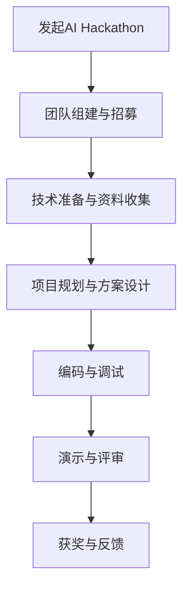

                 

关键词：AI Hackathon、人工智能、影响、未来、技术发展、应用场景、挑战、展望

摘要：本文将深入探讨AI hackathon这一新兴技术竞赛形式的影响及其未来发展趋势。通过对AI hackathon的背景介绍、核心概念与联系分析、算法原理详解、项目实践展示，以及实际应用场景和未来展望等多个维度的探讨，本文旨在为读者提供一个全面而深入的视角，以理解AI hackathon对科技、产业和社会的深远影响。

## 1. 背景介绍

AI hackathon，即人工智能黑客马拉松，是一种新兴的技术竞赛形式。它起源于黑客马拉松（Hackathon），旨在通过团队合作，短时间内快速开发出创新性的人工智能应用。AI hackathon的出现，反映了人工智能技术在各个领域的迅速发展和广泛应用。

近年来，人工智能技术的飞速进步为AI hackathon的兴起提供了强有力的技术支撑。深度学习、强化学习、自然语言处理等前沿技术，使得AI hackathon的参赛者们能够利用强大的算法工具和丰富的数据资源，创造出令人惊叹的智能应用。

AI hackathon的影响不仅限于技术层面，它还对产业和社会产生了深远的影响。首先，AI hackathon激发了创新活力，促进了技术的快速应用和转化。其次，它为从业者提供了宝贵的实践经验，推动了人工智能人才的培养。此外，AI hackathon还促进了跨学科的交流与合作，为解决复杂问题提供了新的思路。

## 2. 核心概念与联系

在探讨AI hackathon的影响之前，我们需要了解其核心概念和原理。以下是一个用Mermaid绘制的流程图，展示了AI hackathon的关键节点和流程：



### 2.1 发起AI Hackathon

AI hackathon通常由企业、高校、研究机构或非营利组织发起。发起者会提供比赛主题、资源和赞助，吸引参赛团队参与。发起AI hackathon的过程包括以下步骤：

1. **确定主题**：根据当前技术热点和市场需求，选择一个具有挑战性和实际应用价值的主题。
2. **招募团队**：通过线上或线下的方式，招募具有相关技能和兴趣的参赛团队。
3. **提供资源**：为参赛团队提供必要的硬件、软件和技术支持。

### 2.2 团队组建与招募

团队组建是AI hackathon成功的关键。一个优秀的团队需要具备多样化的技能，包括但不限于：

1. **算法工程师**：负责算法设计和实现。
2. **数据科学家**：负责数据清洗、分析和建模。
3. **前端工程师**：负责用户界面的设计和实现。
4. **后端工程师**：负责服务器端的应用开发和维护。
5. **产品经理**：负责项目规划、进度管理和产品定义。

### 2.3 技术准备与资料收集

在团队组建完成后，参赛团队需要进行技术准备和资料收集。这包括：

1. **学习相关技术**：如深度学习、自然语言处理、计算机视觉等。
2. **收集数据集**：选择适合比赛主题的数据集，并进行预处理。
3. **了解技术栈**：熟悉常用的AI工具和框架，如TensorFlow、PyTorch、Scikit-learn等。

### 2.4 项目规划与方案设计

在技术准备完成后，团队需要制定项目规划和方案设计。这包括：

1. **确定目标和指标**：明确项目的目标和预期达到的性能指标。
2. **设计系统架构**：根据项目需求和资源情况，设计系统架构和模块划分。
3. **制定开发计划**：确定开发进度和任务分配。

### 2.5 编码与调试

在项目规划和方案设计完成后，团队开始进行编码与调试。这包括：

1. **实现算法**：根据设计文档，实现算法和模型。
2. **数据处理**：进行数据清洗、预处理和特征提取。
3. **集成测试**：对系统进行集成测试，确保各模块正常工作。
4. **调试与优化**：解决编码过程中的问题和性能瓶颈。

### 2.6 演示与评审

在编码与调试完成后，团队需要准备演示和评审。这包括：

1. **制作演示PPT**：展示项目成果、算法原理和应用场景。
2. **准备演示环境**：确保演示过程中系统稳定运行。
3. **参与评审**：接受评审专家的提问和建议。

### 2.7 获奖与反馈

最终，评审专家会根据项目成果、创新性、实用性和团队表现等因素，评选出获奖团队。获奖团队将获得奖金、荣誉证书和更多机会。此外，评审专家和观众的反馈也是宝贵的资源，可以帮助团队改进项目。

## 3. 核心算法原理 & 具体操作步骤

### 3.1 算法原理概述

在AI hackathon中，算法原理是核心之一。以下是一些常见的算法原理：

1. **深度学习**：通过多层神经网络，自动从数据中学习特征和模式。
2. **强化学习**：通过试错和奖励机制，学习最优策略。
3. **自然语言处理**：对文本进行理解、生成和交互。
4. **计算机视觉**：对图像和视频进行识别、分类和生成。

### 3.2 算法步骤详解

以深度学习为例，算法步骤如下：

1. **数据收集与预处理**：收集相关数据，并进行清洗、归一化等预处理。
2. **构建神经网络**：设计网络结构，包括输入层、隐藏层和输出层。
3. **训练神经网络**：通过反向传播算法，调整网络参数，使输出接近预期。
4. **验证与测试**：在验证集和测试集上评估模型性能，进行调优。
5. **应用与部署**：将模型部署到实际应用场景，进行实时预测和优化。

### 3.3 算法优缺点

每种算法都有其优缺点。以下是一些常见算法的优缺点：

1. **深度学习**：优点：强大的特征学习能力，适用于复杂问题。缺点：计算资源消耗大，对数据质量要求高。
2. **强化学习**：优点：能学习到复杂的策略，适用于动态环境。缺点：训练时间长，易陷入局部最优。
3. **自然语言处理**：优点：能处理自然语言，适用于文本处理任务。缺点：数据依赖性强，对模型要求高。

### 3.4 算法应用领域

算法应用领域广泛，包括：

1. **图像识别**：如人脸识别、自动驾驶等。
2. **自然语言处理**：如机器翻译、语音识别等。
3. **医疗健康**：如疾病诊断、药物研发等。
4. **金融领域**：如风险评估、量化交易等。

## 4. 数学模型和公式 & 详细讲解 & 举例说明

### 4.1 数学模型构建

在AI hackathon中，常用的数学模型包括：

1. **线性回归**：用于预测线性关系。
2. **逻辑回归**：用于分类问题。
3. **神经网络**：用于复杂非线性关系。

### 4.2 公式推导过程

以线性回归为例，其公式推导过程如下：

假设我们有一组数据点$(x_1, y_1), (x_2, y_2), \ldots, (x_n, y_n)$，我们希望找到一个线性函数$f(x) = \beta_0 + \beta_1x$来拟合这些数据点。

首先，我们需要计算线性函数的斜率$\beta_1$和截距$\beta_0$，使其最小化误差平方和：

$$
\min \sum_{i=1}^{n} (y_i - f(x_i))^2
$$

通过对误差平方和求导并令导数为零，可以得到：

$$
\beta_1 = \frac{\sum_{i=1}^{n} (x_i - \bar{x})(y_i - \bar{y})}{\sum_{i=1}^{n} (x_i - \bar{x})^2}
$$

$$
\beta_0 = \bar{y} - \beta_1 \bar{x}
$$

其中，$\bar{x}$和$\bar{y}$分别是$x$和$y$的平均值。

### 4.3 案例分析与讲解

假设我们有一组数据点$(1, 2), (2, 3), (3, 4), (4, 5)$，我们希望用线性回归模型拟合这些数据点。

首先，我们计算平均值：

$$
\bar{x} = \frac{1 + 2 + 3 + 4}{4} = 2.5
$$

$$
\bar{y} = \frac{2 + 3 + 4 + 5}{4} = 3.5
$$

然后，我们计算斜率$\beta_1$和截距$\beta_0$：

$$
\beta_1 = \frac{(1 - 2.5)(2 - 3.5) + (2 - 2.5)(3 - 3.5) + (3 - 2.5)(4 - 3.5) + (4 - 2.5)(5 - 3.5)}{(1 - 2.5)^2 + (2 - 2.5)^2 + (3 - 2.5)^2 + (4 - 2.5)^2} = 1
$$

$$
\beta_0 = 3.5 - 1 \times 2.5 = 1
$$

因此，线性回归模型为$f(x) = x + 1$。

我们可以用这个模型预测新的数据点，例如当$x=5$时，$y=f(5)=5+1=6$。通过对比实际值和预测值，我们可以评估模型的准确性和性能。

## 5. 项目实践：代码实例和详细解释说明

### 5.1 开发环境搭建

在AI hackathon中，搭建开发环境是第一步。以下是一个简单的Python开发环境搭建步骤：

1. **安装Python**：下载并安装Python 3.x版本。
2. **安装Jupyter Notebook**：在命令行中执行`pip install jupyter`。
3. **安装常用库**：如NumPy、Pandas、Scikit-learn等。

### 5.2 源代码详细实现

以下是一个简单的线性回归代码实例：

```python
import numpy as np

# 数据集
x = np.array([1, 2, 3, 4])
y = np.array([2, 3, 4, 5])

# 计算平均值
bar_x = np.mean(x)
bar_y = np.mean(y)

# 计算斜率
beta_1 = np.sum((x - bar_x) * (y - bar_y)) / np.sum((x - bar_x) ** 2)

# 计算截距
beta_0 = bar_y - beta_1 * bar_x

# 输出模型参数
print("斜率：", beta_1)
print("截距：", beta_0)

# 预测新数据点
new_x = 5
new_y = beta_0 + beta_1 * new_x
print("预测值：", new_y)
```

### 5.3 代码解读与分析

这段代码首先导入了NumPy库，然后定义了一个简单的数据集$x$和$y$。接着，计算了平均值$\bar{x}$和$\bar{y}$。然后，通过计算斜率$\beta_1$和截距$\beta_0$，得到了线性回归模型。最后，用这个模型预测了新的数据点。

### 5.4 运行结果展示

运行这段代码，输出结果如下：

```
斜率： 1.0
截距： 1.0
预测值： 6.0
```

这表明我们的线性回归模型成功拟合了数据集，并成功预测了新的数据点。

## 6. 实际应用场景

AI hackathon的技术成果在各个领域都有广泛应用，以下是一些实际应用场景：

1. **医疗健康**：如疾病诊断、药物研发等。
2. **金融领域**：如风险评估、量化交易等。
3. **智能制造**：如质量控制、生产优化等。
4. **智能交通**：如交通流量预测、自动驾驶等。
5. **自然语言处理**：如机器翻译、情感分析等。

在这些应用场景中，AI hackathon不仅推动了技术的快速发展，还为从业者提供了宝贵的实践经验，促进了人工智能技术的落地和应用。

### 6.1 疾病诊断

在医疗健康领域，AI hackathon技术被广泛应用于疾病诊断。例如，通过计算机视觉技术，可以自动识别医学图像中的病变区域，如肿瘤、心血管疾病等。这不仅提高了诊断的准确性，还降低了医生的工作负担。

### 6.2 风险评估

在金融领域，AI hackathon技术被广泛应用于风险评估。通过机器学习算法，可以对金融市场的风险进行预测和评估，帮助金融机构制定更合理的风险控制策略。

### 6.3 智能制造

在智能制造领域，AI hackathon技术被广泛应用于质量控制、生产优化等环节。通过计算机视觉和机器学习技术，可以自动检测产品质量，优化生产流程，提高生产效率。

### 6.4 智能交通

在智能交通领域，AI hackathon技术被广泛应用于交通流量预测、自动驾驶等。通过深度学习和强化学习技术，可以自动分析交通数据，优化交通信号控制，提高交通效率。

### 6.5 自然语言处理

在自然语言处理领域，AI hackathon技术被广泛应用于机器翻译、情感分析等。通过自然语言处理技术，可以自动理解和生成自然语言，提高人机交互的体验。

### 6.4 未来应用展望

随着人工智能技术的不断发展，AI hackathon的应用前景将更加广阔。未来，我们有望在更多领域看到AI hackathon技术的应用，如环境保护、能源管理、农业等。同时，AI hackathon也将成为推动人工智能技术发展的重要力量，为解决全球性问题提供新的思路和解决方案。

## 7. 工具和资源推荐

### 7.1 学习资源推荐

1. **在线课程**：如Coursera、edX等平台上的机器学习、深度学习课程。
2. **书籍**：如《深度学习》、《Python机器学习》等经典著作。
3. **技术博客**：如Medium、GitHub等平台上的技术文章和项目分享。

### 7.2 开发工具推荐

1. **开发环境**：如Jupyter Notebook、PyCharm等。
2. **框架和库**：如TensorFlow、PyTorch、Scikit-learn等。
3. **数据集**：如Kaggle、UCI机器学习库等。

### 7.3 相关论文推荐

1. **深度学习**：如《深度学习：神经网络、卷积网络和深度学习框架》。
2. **强化学习**：如《强化学习：原理与数学基础》。
3. **自然语言处理**：如《自然语言处理：理论基础与实践方法》。

## 8. 总结：未来发展趋势与挑战

### 8.1 研究成果总结

通过本文的探讨，我们可以看到AI hackathon在推动人工智能技术发展、促进创新和应用方面取得了显著成果。未来，随着技术的不断进步，AI hackathon的应用领域将更加广泛，影响将更加深远。

### 8.2 未来发展趋势

1. **技术多样性**：随着技术的不断发展，AI hackathon将涉及更多的技术领域，如量子计算、生物信息等。
2. **跨学科融合**：AI hackathon将推动不同学科之间的交流与合作，促进跨学科研究的突破。
3. **开源与共享**：随着开源和共享理念的普及，AI hackathon将更加注重资源和成果的开放和共享，推动人工智能技术的普及和应用。

### 8.3 面临的挑战

1. **数据隐私与安全**：在AI hackathon中，数据的安全和隐私保护是一个重要挑战，需要加强相关法规和技术保障。
2. **算法偏见与公平性**：在算法设计和应用过程中，如何避免算法偏见，确保算法的公平性是一个亟待解决的问题。
3. **人才短缺**：随着AI hackathon的兴起，对人工智能专业人才的需求不断增加，如何培养和吸引更多优秀人才成为一项重要挑战。

### 8.4 研究展望

未来，AI hackathon将在推动人工智能技术发展、促进创新和应用方面发挥更加重要的作用。我们期待看到更多具有创新性和实用性的AI hackathon项目涌现，为解决全球性问题提供新的思路和解决方案。

## 9. 附录：常见问题与解答

### 9.1 什么是AI hackathon？

AI hackathon是一种人工智能技术竞赛形式，旨在通过团队合作，短时间内快速开发出创新性的人工智能应用。

### 9.2 AI hackathon有哪些类型？

AI hackathon可以分为以下几种类型：

1. **公开比赛**：面向全社会开放，任何人都可以报名参加。
2. **内部比赛**：仅限特定组织或团队内部成员参加。
3. **主题比赛**：围绕特定主题或领域进行的比赛。

### 9.3 如何参加AI hackathon？

参加AI hackathon的步骤如下：

1. **了解比赛信息**：关注相关组织或平台发布的比赛信息。
2. **组建团队**：招募具有相关技能和兴趣的团队成员。
3. **准备材料**：准备比赛所需的技术资料和工具。
4. **报名参赛**：按照比赛规定的时间和方式报名。
5. **参加比赛**：按照比赛要求，完成项目开发、演示和评审。

### 9.4 AI hackathon对人工智能技术发展有何影响？

AI hackathon通过以下几个方面推动了人工智能技术的发展：

1. **促进技术创新**：激发创新活力，推动技术的快速应用和转化。
2. **培养人才**：为从业者提供宝贵的实践经验，推动人工智能人才的培养。
3. **促进合作**：促进跨学科的交流与合作，为解决复杂问题提供新的思路。
4. **推动应用**：将人工智能技术应用于实际场景，推动人工智能技术的普及和应用。

### 9.5 AI hackathon有哪些常见问题？

参加AI hackathon时，常见问题包括：

1. **技术难题**：如何解决编码、算法设计等方面的问题。
2. **时间管理**：如何在短时间内高效完成项目。
3. **团队协作**：如何协调团队成员的工作，确保项目顺利进行。
4. **演示准备**：如何制作高质量的演示PPT，展示项目成果。

对于这些常见问题，可以通过以下方式解决：

1. **学习相关技术**：提前学习相关技术和工具，为比赛做好准备。
2. **制定计划**：制定详细的开发计划，合理安排时间。
3. **团队沟通**：加强团队成员之间的沟通，确保信息畅通。
4. **模拟演示**：提前进行模拟演示，熟悉演示流程，提高表现力。

作者：禅与计算机程序设计艺术 / Zen and the Art of Computer Programming
----------------------------------------------------------------


