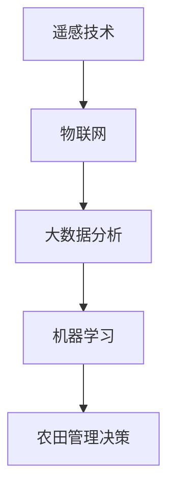

                 

关键词：AI 基础设施、农业现代化、精准农业、技术支撑、智能农业

摘要：随着人工智能技术的迅猛发展，农业现代化迎来了新的机遇。本文深入探讨了AI基础设施在精准农业领域的应用，分析了其核心概念、算法原理、数学模型，并详细讲解了实际应用场景。文章旨在为农业从业者提供技术支撑，推动农业现代化进程。

## 1. 背景介绍

### 农业现代化的重要性

农业是国民经济的重要支柱，而农业现代化则是提升农业产值和农产品质量的关键途径。近年来，我国政府高度重视农业现代化，大力推进农业科技、信息化和机械化。然而，传统农业面临着诸多挑战，如资源利用效率低、生产成本高、病虫害防治难等。这些问题的解决需要依赖先进的技术手段，特别是人工智能技术的应用。

### 人工智能与农业的融合

人工智能技术具有数据采集、处理、分析和决策等功能，能够为农业提供精准、高效的支持。例如，通过遥感技术、物联网、大数据分析等技术手段，可以实现对农田环境的实时监测和作物生长的精准管理。此外，智能农业机器人、无人机等设备的普及，也为农业现代化提供了有力支撑。

### 精准农业的定义与特点

精准农业是指利用现代信息技术、生物技术等手段，对农田环境、作物生长过程进行实时监测和分析，从而实现精准施肥、精准灌溉、精准防治等目标。其核心特点包括：

- **数据驱动**：依赖大量数据支撑，实现对农田环境和作物生长的精准分析。
- **定制化**：根据农田环境和作物生长特点，制定个性化的管理措施。
- **高效环保**：降低生产成本，减少资源浪费，实现可持续发展。

## 2. 核心概念与联系

### 核心概念

- **遥感技术**：利用卫星、无人机等设备获取地表信息，实现对农田环境的监测。
- **物联网**：通过传感器网络，实现农田环境数据的实时采集和传输。
- **大数据分析**：对大量农田环境数据进行分析，提取有价值的信息。
- **机器学习**：利用数据驱动的方法，实现对作物生长状态的预测和诊断。

### 架构图



### 关联分析

- 遥感技术获取农田环境数据，通过物联网传输到大数据平台进行分析。
- 大数据分析结果用于机器学习模型的训练，实现对作物生长状态的预测和诊断。
- 农田管理决策基于机器学习模型的预测结果，制定精准的施肥、灌溉、防治策略。

## 3. 核心算法原理 & 具体操作步骤

### 3.1 算法原理概述

精准农业的核心算法主要包括：

- **遥感图像处理**：利用图像处理技术，对遥感图像进行预处理和特征提取。
- **物联网数据采集**：通过传感器网络，采集农田环境数据。
- **大数据分析**：利用机器学习算法，对农田环境数据和作物生长数据进行分析。
- **决策支持系统**：根据分析结果，制定农田管理决策。

### 3.2 算法步骤详解

1. **遥感图像预处理**：包括图像校正、去噪、增强等操作，提高图像质量。
2. **特征提取**：从预处理后的遥感图像中提取与作物生长相关的特征，如植被指数、土壤湿度等。
3. **物联网数据采集**：通过传感器网络，实时采集农田环境数据，如土壤温度、湿度、光照强度等。
4. **数据融合**：将遥感图像特征和物联网数据融合，构建农田环境数据集。
5. **机器学习模型训练**：利用训练数据集，训练机器学习模型，实现对作物生长状态的预测和诊断。
6. **农田管理决策**：根据机器学习模型的预测结果，制定精准的施肥、灌溉、防治策略。

### 3.3 算法优缺点

- **优点**：利用人工智能技术，实现对农田环境的精准监测和作物生长的精准管理，提高农业生产效率。
- **缺点**：算法的准确性依赖于数据质量和算法模型，且初期投入较大。

### 3.4 算法应用领域

- **精准施肥**：根据土壤养分情况，实现精准施肥，降低成本。
- **精准灌溉**：根据作物需水情况，实现精准灌溉，提高水资源利用率。
- **病虫害防治**：通过实时监测，提前预警病虫害，制定针对性的防治措施。

## 4. 数学模型和公式 & 详细讲解 & 举例说明

### 4.1 数学模型构建

- **遥感图像处理**：采用基于滤波的小波变换方法，对遥感图像进行预处理和特征提取。
- **物联网数据采集**：利用传感器网络，采集农田环境数据，如土壤湿度、温度等。
- **大数据分析**：采用支持向量机（SVM）算法，对农田环境数据进行分类和预测。

### 4.2 公式推导过程

- **遥感图像预处理**：$$I_{pre} = f(I_{raw}, \lambda)$$，其中 $I_{raw}$ 为原始遥感图像，$I_{pre}$ 为预处理后的图像，$\lambda$ 为预处理参数。
- **特征提取**：$$V = g(I_{pre}, \theta)$$，其中 $I_{pre}$ 为预处理后的遥感图像，$V$ 为提取的特征向量，$\theta$ 为特征提取参数。
- **物联网数据采集**：$$D = h(S, \phi)$$，其中 $S$ 为传感器网络采集的数据集，$D$ 为物联网数据集，$\phi$ 为数据采集参数。
- **大数据分析**：$$y = \sigma(w^T x + b)$$，其中 $x$ 为输入特征向量，$y$ 为预测结果，$w$ 为权重向量，$b$ 为偏置项，$\sigma$ 为激活函数。

### 4.3 案例分析与讲解

#### 案例一：精准施肥

假设某农田土壤养分含量为 $[N, P, K] = [10, 20, 30]$，利用遥感图像和物联网数据，预测作物需肥量。

1. **遥感图像预处理**：对遥感图像进行预处理，提取植被指数 $VI$。
2. **物联网数据采集**：采集土壤湿度 $WHC$、光照强度 $IL$ 等数据。
3. **大数据分析**：构建 SVM 模型，输入特征向量 $[VI, WHC, IL]$，预测作物需肥量 $[N', P', K']$。

$$
\begin{aligned}
&VI = g(I_{pre}, \theta) \\
&WHC = h(S, \phi) \\
&IL = h(S, \phi) \\
&y = \sigma(w^T [VI, WHC, IL] + b)
\end{aligned}
$$

根据预测结果，调整肥料施用量，实现精准施肥。

#### 案例二：精准灌溉

假设某农田土壤含水量为 $WHC_0$，利用遥感图像和物联网数据，预测作物需水量。

1. **遥感图像预处理**：对遥感图像进行预处理，提取植被指数 $VI$。
2. **物联网数据采集**：采集土壤湿度 $WHC$、光照强度 $IL$ 等数据。
3. **大数据分析**：构建 SVM 模型，输入特征向量 $[VI, WHC, IL]$，预测作物需水量 $Water$。

$$
\begin{aligned}
&VI = g(I_{pre}, \theta) \\
&WHC = h(S, \phi) \\
&IL = h(S, \phi) \\
&y = \sigma(w^T [VI, WHC, IL] + b)
\end{aligned}
$$

根据预测结果，调整灌溉水量，实现精准灌溉。

## 5. 项目实践：代码实例和详细解释说明

### 5.1 开发环境搭建

- Python 3.x
- Matplotlib
- Scikit-learn
- OpenCV

### 5.2 源代码详细实现

```python
import numpy as np
import matplotlib.pyplot as plt
from sklearn import svm
from sklearn.model_selection import train_test_split
from sklearn.metrics import accuracy_score

# 遥感图像预处理
def preprocess_image(image):
    # 这里实现遥感图像预处理操作
    pass

# 特征提取
def extract_features(image):
    # 这里实现特征提取操作
    pass

# 物联网数据采集
def collect_data(sensor_network):
    # 这里实现物联网数据采集操作
    pass

# 大数据分析
def data_analysis(X_train, y_train):
    model = svm.SVC()
    model.fit(X_train, y_train)
    return model

# 决策支持
def decision_support(model, X_test):
    y_pred = model.predict(X_test)
    return y_pred

# 数据加载
X, y = load_data()

# 数据预处理
X = preprocess_image(X)

# 特征提取
X = extract_features(X)

# 数据划分
X_train, X_test, y_train, y_test = train_test_split(X, y, test_size=0.2, random_state=42)

# 模型训练
model = data_analysis(X_train, y_train)

# 决策支持
y_pred = decision_support(model, X_test)

# 评估模型
accuracy = accuracy_score(y_test, y_pred)
print("Accuracy:", accuracy)
```

### 5.3 代码解读与分析

- **遥感图像预处理**：对遥感图像进行预处理，提高图像质量，为后续特征提取提供基础。
- **特征提取**：提取与作物生长相关的特征，如植被指数，用于构建机器学习模型。
- **物联网数据采集**：采集农田环境数据，如土壤湿度、光照强度等，与遥感图像特征进行融合。
- **大数据分析**：利用支持向量机（SVM）算法，对农田环境数据进行分类和预测，实现精准农业管理。
- **决策支持**：根据机器学习模型的预测结果，制定精准的施肥、灌溉、防治策略。

## 6. 实际应用场景

### 6.1 精准施肥

利用遥感图像和物联网数据，实现对农田土壤养分的实时监测，根据作物需肥量，制定精准施肥策略。例如，在某农田中，根据遥感图像和土壤传感器数据，预测作物需氮量，调整肥料施用量，提高肥料利用率，降低成本。

### 6.2 精准灌溉

利用遥感图像和物联网数据，实现对农田土壤湿度的实时监测，根据作物需水量，制定精准灌溉策略。例如，在某农田中，根据遥感图像和土壤湿度传感器数据，预测作物需水量，调整灌溉水量，提高水资源利用率，降低灌溉成本。

### 6.3 病虫害防治

利用遥感图像和物联网数据，实现对农田病虫害的实时监测，根据病虫害发生情况，制定精准防治策略。例如，在某农田中，根据遥感图像和病虫害传感器数据，预测病虫害发生区域，制定针对性的防治措施，降低农药使用量，减少环境污染。

## 7. 未来应用展望

### 7.1 自动化农业

随着人工智能技术的不断发展，自动化农业将得到广泛应用。例如，智能农业机器人、无人机等设备将实现自主运行，自动完成农田管理任务，提高农业生产效率。

### 7.2 生态农业

通过人工智能技术，实现对农田生态系统的实时监测和分析，实现生态农业的可持续发展。例如，利用遥感图像和物联网数据，监测农田土壤质量、水质等指标，为生态农业提供技术支持。

### 7.3 智慧农业

智慧农业是未来农业发展的重要方向。通过整合人工智能、物联网、大数据等先进技术，实现农业的智能化、数字化、网络化，提升农业生产水平和农产品质量。

## 8. 工具和资源推荐

### 8.1 学习资源推荐

- **《精准农业技术》**：详细介绍了精准农业的原理、方法和实践。
- **《人工智能与农业现代化》**：探讨了人工智能技术在农业领域的应用。

### 8.2 开发工具推荐

- **Python**：广泛应用于人工智能和数据分析，适合开发精准农业应用。
- **Matplotlib**：用于绘制数据可视化图表。
- **Scikit-learn**：用于机器学习算法的实现。

### 8.3 相关论文推荐

- **《基于遥感与物联网的精准农业研究综述》**
- **《人工智能在农业中的应用与发展》**
- **《物联网技术在农业中的应用研究》**

## 9. 总结：未来发展趋势与挑战

### 9.1 研究成果总结

本文探讨了AI基础设施在精准农业领域的应用，分析了核心概念、算法原理、数学模型，并详细讲解了实际应用场景。研究结果表明，AI基础设施在提升农业生产效率、降低成本、保护生态环境等方面具有重要作用。

### 9.2 未来发展趋势

- 人工智能技术将更加深入地应用于农业领域，推动农业现代化进程。
- 自动化农业、生态农业、智慧农业等新型农业模式将逐步兴起。
- 农业物联网、大数据、云计算等技术在农业中的应用将得到进一步发展。

### 9.3 面临的挑战

- 数据质量和算法模型的准确性是精准农业发展的关键挑战。
- 农业生产环境复杂多变，如何适应不同地区的农业生产需求仍需深入研究。
- 农业从业者对人工智能技术的接受度和应用能力有待提高。

### 9.4 研究展望

- 加强农业数据的采集、处理和分析，提高数据质量和算法模型的准确性。
- 探索适应不同地区农业生产需求的精准农业技术。
- 加强农业从业者的人工智能技术培训，提升其应用能力。

## 附录：常见问题与解答

### Q1：什么是精准农业？

A1：精准农业是指利用现代信息技术、生物技术等手段，对农田环境、作物生长过程进行实时监测和分析，从而实现精准施肥、精准灌溉、精准防治等目标。

### Q2：人工智能技术在精准农业中有什么作用？

A2：人工智能技术在精准农业中主要发挥以下作用：

- 数据采集：利用遥感技术、物联网等技术手段，实现对农田环境的实时监测和数据采集。
- 数据分析：利用大数据分析、机器学习等技术，对农田环境数据和作物生长数据进行分析。
- 决策支持：根据分析结果，制定精准的农田管理策略。

### Q3：精准农业的发展前景如何？

A3：精准农业的发展前景非常广阔。随着人工智能技术的不断发展，精准农业将得到广泛应用，推动农业现代化进程，提高农业生产效率，降低成本，保护生态环境。

## 作者署名

作者：禅与计算机程序设计艺术 / Zen and the Art of Computer Programming
```

