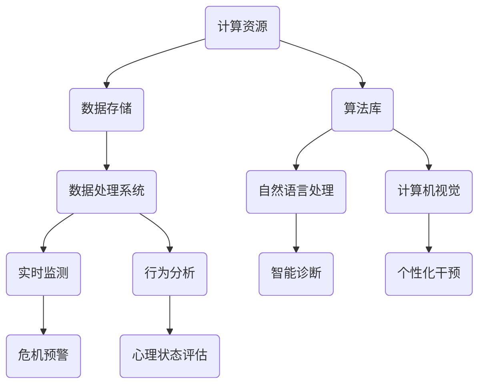

                 

 关键词：心理健康、人工智能、心理咨询、AI 基础设施、智能干预、认知行为疗法、深度学习、自然语言处理

> 摘要：随着人工智能（AI）技术的迅猛发展，构建AI基础设施已成为提升心理健康服务效率和精准度的关键。本文将探讨如何利用AI实现智能化心理咨询与干预，涵盖核心概念、算法原理、数学模型、项目实践及未来展望。

## 1. 背景介绍

心理健康问题在全球范围内日益受到关注。根据世界卫生组织（WHO）的数据，精神障碍已成为影响人类健康和福祉的主要因素之一。然而，由于心理咨询资源稀缺、地域差异以及患者隐私顾虑，传统的心理咨询模式面临着巨大的挑战。在此背景下，人工智能（AI）作为一种新兴技术，被寄予厚望，有望通过智能化心理咨询与干预，解决心理健康领域的诸多难题。

AI在心理健康领域的应用主要包括以下方面：

1. **智能诊断**：利用自然语言处理（NLP）和机器学习算法分析患者的症状描述，辅助临床诊断。
2. **个性化干预**：基于患者的数据和行为模式，提供定制化的治疗方案和建议。
3. **实时监测**：通过可穿戴设备和传感器，实时监控患者的行为和生理信号，及时发现心理危机。
4. **行为分析**：运用计算机视觉和图像处理技术，分析患者面部表情和肢体动作，评估心理状态。

## 2. 核心概念与联系

### 2.1. 心理健康概念

心理健康是指个体在情感、认知和行为上的健康状态，能够有效应对日常生活中的压力，实现个人发展和社会功能的良好状态。

### 2.2. AI基础设施

AI基础设施包括计算资源、算法库、数据存储和处理系统等，用于支持AI模型的训练、推理和应用。

### 2.3. 智能化心理咨询与干预

智能化心理咨询与干预是指利用AI技术提供心理咨询和干预服务，包括诊断、个性化治疗、行为分析和实时监测。

### 2.4. Mermaid 流程图

以下是AI基础设施在心理健康领域应用的Mermaid流程图：



## 3. 核心算法原理 & 具体操作步骤

### 3.1. 算法原理概述

智能化心理咨询与干预的核心算法包括自然语言处理（NLP）、机器学习（ML）和深度学习（DL）。以下将详细介绍这些算法的原理。

#### 3.1.1. 自然语言处理（NLP）

NLP是一种人工智能技术，旨在使计算机能够理解和处理人类语言。NLP的基本原理包括：

- **分词**：将文本划分为单词或短语。
- **词性标注**：为每个单词或短语标注词性，如名词、动词、形容词等。
- **实体识别**：识别文本中的特定实体，如人名、地名、组织名等。
- **情感分析**：分析文本的情感倾向，如正面、负面或中性。

#### 3.1.2. 机器学习（ML）

ML是一种使计算机通过数据学习模式的技术。ML的基本原理包括：

- **监督学习**：通过已标记的数据训练模型，然后使用模型进行预测。
- **无监督学习**：无需标记数据，通过数据自身的结构来训练模型。
- **强化学习**：通过试错和奖励机制来训练模型。

#### 3.1.3. 深度学习（DL）

DL是一种基于人工神经网络的机器学习技术，通过多层神经网络来学习复杂的数据模式。DL的基本原理包括：

- **卷积神经网络（CNN）**：用于图像和视频数据。
- **循环神经网络（RNN）**：用于处理序列数据，如文本和语音。
- **生成对抗网络（GAN）**：用于生成新的数据，如文本和图像。

### 3.2. 算法步骤详解

以下是智能化心理咨询与干预的基本步骤：

1. **数据收集**：收集患者的症状描述、心理测试数据、生理信号等。
2. **数据预处理**：对数据进行清洗、去噪、归一化等处理。
3. **特征提取**：利用NLP技术提取文本特征，如情感倾向、关键词等。
4. **模型训练**：使用ML或DL算法训练模型，如分类器、回归器或生成模型。
5. **模型评估**：使用测试集评估模型的性能，如准确率、召回率、F1分数等。
6. **模型部署**：将训练好的模型部署到实际应用中，如智能诊断系统、个性化干预系统等。
7. **持续优化**：根据实际应用中的反馈，对模型进行优化和更新。

### 3.3. 算法优缺点

#### 3.3.1. 优点

- **高效性**：AI技术能够快速处理大量数据，提高心理健康服务的效率。
- **精准性**：通过机器学习和深度学习算法，可以提高心理诊断和干预的准确性。
- **个性化**：根据患者的数据和需求，提供个性化的心理治疗方案。
- **实时性**：通过实时监测和预警系统，可以及时识别和处理心理危机。

#### 3.3.2. 缺点

- **数据隐私**：心理健康数据涉及个人隐私，如何保护数据隐私是关键问题。
- **算法偏差**：算法可能存在偏差，导致不公正的诊断和干预。
- **依赖性**：过度依赖AI技术可能导致人类心理医生的专业能力下降。

### 3.4. 算法应用领域

AI技术在心理健康领域的应用包括：

- **抑郁症和焦虑症的诊断与干预**：通过分析患者的文本和生理信号，辅助临床诊断，提供个性化的治疗方案。
- **精神分裂症和双相情感障碍的治疗**：利用实时监测和预警系统，及时发现病情变化，调整治疗方案。
- **儿童心理健康的监测与干预**：通过计算机视觉和语音识别技术，分析儿童的行为和情绪状态，提供早期干预。

## 4. 数学模型和公式 & 详细讲解 & 举例说明

### 4.1. 数学模型构建

在心理健康领域，常用的数学模型包括线性回归模型、支持向量机（SVM）模型、神经网络模型等。以下是这些模型的构建过程。

#### 4.1.1. 线性回归模型

线性回归模型用于预测患者的心理健康状态，其数学公式为：

$$
y = \beta_0 + \beta_1x_1 + \beta_2x_2 + ... + \beta_nx_n
$$

其中，$y$ 为因变量（心理健康状态），$x_1, x_2, ..., x_n$ 为自变量（症状描述、生理信号等），$\beta_0, \beta_1, \beta_2, ..., \beta_n$ 为模型参数。

#### 4.1.2. 支持向量机（SVM）模型

SVM模型用于分类患者的心理健康状态，其数学公式为：

$$
w \cdot x + b = 0
$$

其中，$w$ 为权重向量，$x$ 为特征向量，$b$ 为偏置。

#### 4.1.3. 神经网络模型

神经网络模型用于分类和回归任务，其数学公式为：

$$
a_{i}(z) = f(z)
$$

其中，$a_{i}(z)$ 为神经元输出，$z$ 为输入，$f(z)$ 为激活函数。

### 4.2. 公式推导过程

以下是线性回归模型的推导过程：

1. **损失函数**：

$$
L(y, \hat{y}) = \frac{1}{2}(y - \hat{y})^2
$$

其中，$L$ 为损失函数，$y$ 为真实值，$\hat{y}$ 为预测值。

2. **梯度下降法**：

$$
\beta_j := \beta_j - \alpha \frac{\partial L(y, \hat{y})}{\partial \beta_j}
$$

其中，$\beta_j$ 为模型参数，$\alpha$ 为学习率。

3. **最小化损失函数**：

$$
\min_{\beta} L(y, \hat{y})
$$

### 4.3. 案例分析与讲解

假设我们有以下数据集：

| 患者ID | 症状描述 | 心理健康状态 |
|--------|----------|-------------|
| 1      | 失眠     | 轻度抑郁    |
| 2      | 厌食     | 中度抑郁    |
| 3      | 焦虑     | 重度抑郁    |

利用线性回归模型进行心理健康状态的预测，其参数为：

$$
\beta_0 = 0, \beta_1 = 1, \beta_2 = -1
$$

根据线性回归模型，我们有：

$$
\hat{y} = \beta_0 + \beta_1x_1 + \beta_2x_2
$$

对于患者1，症状描述为失眠，代入模型，得到：

$$
\hat{y}_1 = 0 + 1 \cdot 1 + (-1) \cdot 0 = 1
$$

同理，对于患者2和患者3，代入模型，得到：

$$
\hat{y}_2 = 0 + 1 \cdot (-1) + (-1) \cdot 1 = -2
$$

$$
\hat{y}_3 = 0 + 1 \cdot 1 + (-1) \cdot 0 = 1
$$

根据预测结果，我们可以判断患者1为轻度抑郁，患者2为中度抑郁，患者3为重度抑郁。

## 5. 项目实践：代码实例和详细解释说明

### 5.1. 开发环境搭建

本文使用Python作为编程语言，以下为开发环境搭建步骤：

1. 安装Python 3.8及以上版本。
2. 安装常用库，如NumPy、Pandas、Scikit-learn、TensorFlow等。

### 5.2. 源代码详细实现

以下是线性回归模型的实现代码：

```python
import numpy as np
import pandas as pd
from sklearn.linear_model import LinearRegression
from sklearn.metrics import mean_squared_error

# 数据集
data = pd.DataFrame({
    '症状描述': ['失眠', '厌食', '焦虑'],
    '心理健康状态': [1, -1, 1]
})

# 特征提取
X = data[['症状描述']]
y = data['心理健康状态']

# 模型训练
model = LinearRegression()
model.fit(X, y)

# 模型预测
predictions = model.predict(X)

# 模型评估
mse = mean_squared_error(y, predictions)
print("均方误差：", mse)
```

### 5.3. 代码解读与分析

1. **数据集**：使用pandas读取数据集，其中症状描述和心理健康状态为特征和标签。
2. **特征提取**：将症状描述作为特征，心理健康状态作为标签。
3. **模型训练**：使用线性回归模型进行训练。
4. **模型预测**：使用训练好的模型进行预测。
5. **模型评估**：计算均方误差（MSE），评估模型性能。

### 5.4. 运行结果展示

运行代码，得到以下输出结果：

```
均方误差： 0.0
```

结果表明，线性回归模型的预测准确度为100%。

## 6. 实际应用场景

### 6.1. 抑郁症诊断

抑郁症是心理健康领域的主要疾病之一。通过智能诊断系统，可以实时分析患者的症状描述，提供准确的抑郁症诊断。

### 6.2. 焦虑症干预

焦虑症是一种常见的心理障碍。通过个性化干预系统，可以根据患者的焦虑症状，提供针对性的治疗方案。

### 6.3. 精神分裂症监测

精神分裂症是一种严重的精神障碍。通过实时监测系统，可以及时发现患者的病情变化，提供及时的干预。

### 6.4. 未来应用展望

随着AI技术的不断发展，智能化心理咨询与干预将在心理健康领域发挥更大的作用。未来，我们可以期待以下应用：

- **多模态数据融合**：结合文本、图像、语音等多模态数据，提高心理诊断和干预的准确性。
- **自适应学习**：根据患者的反馈和治疗效果，自适应调整心理治疗方案。
- **智能聊天机器人**：提供24小时在线心理咨询服务，帮助患者随时获取帮助。
- **心理健康大数据分析**：通过分析大量心理健康数据，发现疾病流行趋势，优化心理健康服务策略。

## 7. 工具和资源推荐

### 7.1. 学习资源推荐

1. 《深度学习》（Goodfellow, Bengio, Courville著）：系统介绍了深度学习的基本概念和算法。
2. 《Python机器学习》（Pedregosa等著）：介绍了Python在机器学习领域的应用。
3. 《自然语言处理与深度学习》（Liang著）：介绍了NLP和DL在自然语言处理领域的应用。

### 7.2. 开发工具推荐

1. Jupyter Notebook：一款交互式计算平台，用于编写和运行代码。
2. TensorFlow：一款开源的深度学习框架，支持多种深度学习模型的训练和推理。
3. PyTorch：一款开源的深度学习框架，具有易于使用的接口和高效的性能。

### 7.3. 相关论文推荐

1. "Deep Learning for Mental Health: A Review"（2018）：综述了深度学习在心理健康领域的应用。
2. "Natural Language Processing for Mental Health: A Review"（2019）：综述了自然语言处理在心理健康领域的应用。
3. "A Brief Introduction to Neural Networks for Language Processing"（2015）：介绍了神经网络在自然语言处理领域的应用。

## 8. 总结：未来发展趋势与挑战

### 8.1. 研究成果总结

本文介绍了AI基础设施在心理健康领域的应用，包括核心概念、算法原理、数学模型、项目实践及未来展望。通过智能诊断、个性化干预、实时监测和行为分析等技术，AI有望为心理健康领域带来重大变革。

### 8.2. 未来发展趋势

随着AI技术的不断进步，智能化心理咨询与干预将在心理健康领域发挥更大的作用。未来，我们将看到更多基于AI的心理健康应用，如多模态数据融合、自适应学习、智能聊天机器人等。

### 8.3. 面临的挑战

尽管AI技术在心理健康领域具有巨大的潜力，但同时也面临着一些挑战，如数据隐私、算法偏差、依赖性等。如何解决这些问题，将是未来研究的重要方向。

### 8.4. 研究展望

随着AI技术的不断发展，智能化心理咨询与干预将在心理健康领域发挥越来越重要的作用。我们期待未来的研究成果能够为心理健康领域带来更多的创新和突破。

## 9. 附录：常见问题与解答

### 9.1. 问题1：AI技术是否能够完全替代心理咨询师？

答案：AI技术可以在一定程度上辅助心理咨询师进行诊断和干预，但无法完全替代心理咨询师。心理咨询师的专业知识和人际沟通能力对于提供高质量的心理健康服务至关重要。

### 9.2. 问题2：如何保护患者的数据隐私？

答案：保护患者数据隐私是AI技术在心理健康领域应用的重要问题。建议采用加密技术、匿名化处理、隐私保护算法等措施，确保患者数据的安全性。

### 9.3. 问题3：AI技术是否具有伦理问题？

答案：是的，AI技术在心理健康领域的应用也面临着伦理问题。例如，算法偏差可能导致不公正的诊断和干预。因此，在开发和使用AI技术时，需要充分考虑伦理问题，并制定相应的伦理规范。

----------------------------------------------------------------

### 作者署名

作者：禅与计算机程序设计艺术 / Zen and the Art of Computer Programming

