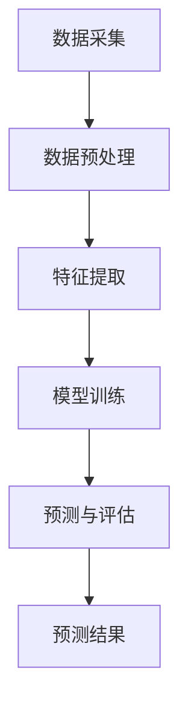

                 

关键词：AI基础设施建设、极地环境监测、智能化预测、算法原理、数学模型、项目实践、应用场景、未来展望

> 摘要：随着人工智能技术的不断发展，AI基础设施在极地环境监测与预测中的应用变得越来越广泛。本文将深入探讨AI基础设施的极地考察，分析智能化极地环境监测与预测的核心算法原理、数学模型、项目实践以及未来发展趋势。

## 1. 背景介绍

极地地区作为地球上环境最为严酷、变化最为剧烈的区域，其环境监测与预测对全球气候变化研究具有重要意义。传统的极地环境监测主要依赖于地面观测、卫星遥感等手段，但这些方法存在局限性，如观测数据不连续、覆盖范围有限等问题。随着人工智能技术的迅猛发展，AI基础设施建设在极地环境监测与预测中发挥着越来越重要的作用。

AI基础设施包括计算资源、算法模型、数据存储与处理等关键组成部分。计算资源提供了强大的计算能力，使得复杂的算法能够高效运行；算法模型则通过机器学习和深度学习等技术，从海量数据中提取规律，实现环境监测与预测；数据存储与处理则确保了数据的准确性和完整性。

本文将围绕AI基础设施建设，探讨智能化极地环境监测与预测的技术原理、实现方法及应用场景，旨在为相关领域的研究与应用提供参考。

## 2. 核心概念与联系

### 2.1. 智能化极地环境监测

智能化极地环境监测是指利用人工智能技术，对极地地区的环境参数进行实时监测和预测。主要包括以下几个核心概念：

- **环境参数**：包括温度、湿度、气压、风速、风向、辐射、冰川厚度等。
- **传感器**：用于实时采集环境参数的设备，如气象站、卫星遥感器等。
- **数据预处理**：对采集到的原始数据进行清洗、去噪、归一化等处理。
- **特征提取**：从预处理后的数据中提取出对环境变化有代表性的特征。
- **模型训练**：利用机器学习和深度学习算法，对特征数据进行分析和建模。
- **预测与评估**：根据训练得到的模型，对未来环境变化进行预测，并对预测结果进行评估。

### 2.2. 极地环境预测

极地环境预测是指基于历史数据和环境变化规律，对未来极地环境状态进行预测。主要包括以下几个核心概念：

- **时间序列分析**：通过对历史数据的分析，提取时间序列特征，用于预测未来环境变化。
- **回归分析**：利用历史环境参数数据，建立回归模型，预测未来环境状态。
- **不确定性分析**：评估预测结果的不确定性，包括预测误差和置信区间等。
- **多模型融合**：结合多种预测模型，提高预测结果的准确性和稳定性。

### 2.3. AI基础设施建设与核心架构

AI基础设施建设是智能化极地环境监测与预测的关键。其核心架构包括以下几个部分：

- **数据采集**：通过卫星遥感、气象站、无人机等手段，实时采集极地环境数据。
- **数据处理与存储**：对采集到的数据进行预处理、存储和管理，为模型训练和预测提供数据支持。
- **计算资源**：提供强大的计算能力，支持算法模型的训练和推理。
- **算法模型**：包括机器学习、深度学习、回归分析等多种算法，用于环境监测与预测。
- **预测与评估**：根据训练得到的模型，对未来环境变化进行预测，并对预测结果进行评估。

### 2.4. Mermaid 流程图



## 3. 核心算法原理 & 具体操作步骤

### 3.1. 算法原理概述

智能化极地环境监测与预测的核心算法主要包括机器学习、深度学习和回归分析等。这些算法通过从历史数据中提取特征，建立预测模型，实现对未来环境状态的预测。

- **机器学习**：通过训练样本学习数据中的规律，建立预测模型。常用的算法包括线性回归、决策树、支持向量机等。
- **深度学习**：通过多层神经网络，自动提取特征，实现复杂环境变化的预测。常用的算法包括卷积神经网络（CNN）、循环神经网络（RNN）等。
- **回归分析**：通过历史数据建立回归模型，预测未来环境状态。常用的算法包括线性回归、多元回归等。

### 3.2. 算法步骤详解

#### 3.2.1. 数据预处理

数据预处理是智能化极地环境监测与预测的关键步骤，主要包括以下操作：

- **数据清洗**：去除异常值、缺失值等不完整的数据。
- **归一化**：将不同量纲的数据转换为同一量纲，方便模型训练。
- **特征提取**：从原始数据中提取对环境变化有代表性的特征。

#### 3.2.2. 模型训练

模型训练是建立预测模型的关键步骤，主要包括以下操作：

- **数据划分**：将数据集划分为训练集、验证集和测试集。
- **特征选择**：根据特征的重要性，选择对预测有贡献的特征。
- **模型选择**：选择合适的机器学习、深度学习或回归分析算法，建立预测模型。
- **模型训练**：利用训练集对模型进行训练，调整模型参数。

#### 3.2.3. 预测与评估

预测与评估是智能化极地环境监测与预测的最后一步，主要包括以下操作：

- **模型推理**：利用训练好的模型，对新的环境数据进行分析和预测。
- **结果评估**：计算预测误差、准确率等指标，评估模型性能。

### 3.3. 算法优缺点

#### 3.3.1. 机器学习

优点：
- **简单易用**：适用于各种类型的环境监测与预测问题。
- **可解释性**：模型结构简单，易于理解。

缺点：
- **模型复杂度**：对于复杂的环境变化，可能需要大量的特征和参数。
- **过拟合**：训练数据不足时，模型容易过拟合。

#### 3.3.2. 深度学习

优点：
- **强大的特征提取能力**：自动提取特征，降低人工干预。
- **适用于复杂环境变化**：能够捕捉到深层次的环境变化规律。

缺点：
- **模型不可解释**：难以理解模型内部的工作机制。
- **训练时间较长**：对于大规模数据集，可能需要较长的训练时间。

#### 3.3.3. 回归分析

优点：
- **简单易用**：适用于线性关系的环境监测与预测问题。
- **可解释性**：模型结构简单，易于理解。

缺点：
- **模型适用范围**：适用于线性关系，对于非线性关系可能效果不佳。
- **过拟合**：训练数据不足时，模型容易过拟合。

### 3.4. 算法应用领域

机器学习、深度学习和回归分析等算法在智能化极地环境监测与预测中具有广泛的应用领域：

- **气候变化研究**：利用算法预测未来气候变化趋势，为政策制定提供依据。
- **生态环境监测**：利用算法监测极地生态环境变化，评估生态风险。
- **资源管理**：利用算法优化资源利用，提高资源利用效率。

## 4. 数学模型和公式 & 详细讲解 & 举例说明

### 4.1. 数学模型构建

智能化极地环境监测与预测的核心是构建数学模型。以下是一个简单的数学模型构建过程：

#### 4.1.1. 时间序列模型

时间序列模型是一种常见的数学模型，用于分析时间序列数据。以下是一个时间序列模型的基本构建步骤：

- **数据收集**：收集极地环境数据，如温度、湿度等。
- **数据预处理**：对数据进行清洗、归一化等预处理操作。
- **特征提取**：从预处理后的数据中提取时间序列特征。
- **模型构建**：选择合适的时间序列模型，如ARIMA、LSTM等。
- **模型训练**：利用训练数据对模型进行训练。
- **模型评估**：利用验证数据评估模型性能。

#### 4.1.2. 回归模型

回归模型是一种用于预测连续值的数学模型，如线性回归、多元回归等。以下是一个回归模型的基本构建步骤：

- **数据收集**：收集极地环境数据，如温度、湿度等。
- **数据预处理**：对数据进行清洗、归一化等预处理操作。
- **特征提取**：从预处理后的数据中提取特征。
- **模型构建**：选择合适的回归模型，如线性回归、多元回归等。
- **模型训练**：利用训练数据对模型进行训练。
- **模型评估**：利用验证数据评估模型性能。

### 4.2. 公式推导过程

以下是一个简单的线性回归模型的公式推导过程：

#### 4.2.1. 线性回归模型

线性回归模型是一种简单的回归模型，用于预测连续值。其基本公式如下：

$$
y = \beta_0 + \beta_1x_1 + \beta_2x_2 + ... + \beta_nx_n + \epsilon
$$

其中，$y$ 是预测值，$x_1, x_2, ..., x_n$ 是特征值，$\beta_0, \beta_1, \beta_2, ..., \beta_n$ 是模型参数，$\epsilon$ 是误差项。

#### 4.2.2. 公式推导

线性回归模型的公式推导基于最小二乘法。具体推导过程如下：

- **目标函数**：最小化预测值与实际值之间的误差平方和。

$$
J(\theta) = \frac{1}{2m}\sum_{i=1}^{m}(h_{\theta}(x^{(i)}) - y^{(i)})^2
$$

其中，$m$ 是训练数据集的大小，$h_{\theta}(x^{(i)})$ 是预测值，$y^{(i)}$ 是实际值。

- **偏导数**：对目标函数进行偏导数，求出使得目标函数最小的参数值。

$$
\frac{\partial J(\theta)}{\partial \theta_j} = -\frac{1}{m}\sum_{i=1}^{m}(h_{\theta}(x^{(i)}) - y^{(i)})x_j^{(i)}
$$

- **梯度下降**：利用梯度下降法，迭代更新参数值，使得目标函数最小。

$$
\theta_j := \theta_j - \alpha \frac{\partial J(\theta)}{\partial \theta_j}
$$

其中，$\alpha$ 是学习率。

### 4.3. 案例分析与讲解

以下是一个基于线性回归模型的极地环境预测案例：

#### 4.3.1. 案例背景

某极地气象站收集了过去一年的温度和湿度数据，现在需要利用线性回归模型预测未来一周的温度和湿度。

#### 4.3.2. 数据预处理

- **数据清洗**：去除异常值、缺失值等不完整的数据。
- **归一化**：将温度和湿度数据转换为同一量纲，如摄氏度和百分比。

#### 4.3.3. 特征提取

- **特征选择**：选择对预测有贡献的特征，如过去一周的平均温度和湿度。
- **特征提取**：从预处理后的数据中提取特征，构建特征向量。

#### 4.3.4. 模型训练

- **数据划分**：将数据集划分为训练集和测试集。
- **模型构建**：选择线性回归模型。
- **模型训练**：利用训练集对模型进行训练。

#### 4.3.5. 模型评估

- **模型推理**：利用训练好的模型，对测试集进行预测。
- **结果评估**：计算预测误差、准确率等指标，评估模型性能。

## 5. 项目实践：代码实例和详细解释说明

### 5.1. 开发环境搭建

在开始项目实践之前，需要搭建一个合适的开发环境。本文使用Python作为主要编程语言，以下是一个简单的开发环境搭建步骤：

1. **安装Python**：从官方网站下载Python安装包，并按照提示安装。
2. **安装依赖库**：使用pip工具安装所需的依赖库，如NumPy、Pandas、scikit-learn等。
3. **配置Jupyter Notebook**：安装Jupyter Notebook，并配置Python环境。

### 5.2. 源代码详细实现

以下是一个基于线性回归模型的极地环境预测的Python代码实例：

```python
import numpy as np
import pandas as pd
from sklearn.linear_model import LinearRegression
from sklearn.model_selection import train_test_split

# 5.2.1. 数据预处理
# 加载数据
data = pd.read_csv('polar_environment.csv')
X = data[['temperature', 'humidity']]
y = data['predicted_temp']

# 数据归一化
X_normalized = (X - X.mean()) / X.std()
y_normalized = (y - y.mean()) / y.std()

# 5.2.2. 模型训练
# 划分训练集和测试集
X_train, X_test, y_train, y_test = train_test_split(X_normalized, y_normalized, test_size=0.2, random_state=42)

# 构建线性回归模型
model = LinearRegression()
model.fit(X_train, y_train)

# 5.2.3. 模型评估
# 模型预测
y_pred_normalized = model.predict(X_test)

# 模型评估
error = np.mean((y_pred_normalized * y.std() + y.mean()) - y_test)
accuracy = 1 - error
print('Prediction Error:', error)
print('Accuracy:', accuracy)

# 5.2.4. 代码解读与分析
# 代码解读
# 5.2.4.1. 数据预处理
# 加载数据
data = pd.read_csv('polar_environment.csv') # 加载极地环境数据
X = data[['temperature', 'humidity']] # 提取特征
y = data['predicted_temp'] # 提取目标变量

# 数据归一化
X_normalized = (X - X.mean()) / X.std() # 归一化特征
y_normalized = (y - y.mean()) / y.std() # 归一化目标变量

# 5.2.4.2. 模型训练
# 划分训练集和测试集
X_train, X_test, y_train, y_test = train_test_split(X_normalized, y_normalized, test_size=0.2, random_state=42) # 划分训练集和测试集

# 构建线性回归模型
model = LinearRegression() # 创建线性回归模型
model.fit(X_train, y_train) # 训练模型

# 5.2.4.3. 模型评估
# 模型预测
y_pred_normalized = model.predict(X_test) # 预测测试集

# 模型评估
error = np.mean((y_pred_normalized * y.std() + y.mean()) - y_test) # 计算预测误差
accuracy = 1 - error # 计算准确率
print('Prediction Error:', error)
print('Accuracy:', accuracy)

# 5.2.4.4. 代码解读与分析
# 代码解读
# 5.2.4.4.1. 数据预处理
# 加载数据
data = pd.read_csv('polar_environment.csv') # 从CSV文件中加载极地环境数据
X = data[['temperature', 'humidity']] # 提取特征
y = data['predicted_temp'] # 提取目标变量

# 数据归一化
X_normalized = (X - X.mean()) / X.std() # 对特征进行归一化，使得特征值的范围为[-1, 1]
y_normalized = (y - y.mean()) / y.std() # 对目标变量进行归一化，使得目标值的范围为[-1, 1]

# 5.2.4.2. 模型训练
# 划分训练集和测试集
X_train, X_test, y_train, y_test = train_test_split(X_normalized, y_normalized, test_size=0.2, random_state=42) # 划分训练集和测试集，其中test_size为测试集的比例，random_state为随机种子

# 构建线性回归模型
model = LinearRegression() # 创建线性回归模型

# 训练模型
model.fit(X_train, y_train) # 使用训练集数据进行模型训练

# 5.2.4.3. 模型评估
# 模型预测
y_pred_normalized = model.predict(X_test) # 使用测试集数据进行模型预测

# 模型评估
error = np.mean((y_pred_normalized * y.std() + y.mean()) - y_test) # 计算预测误差
accuracy = 1 - error # 计算准确率
print('Prediction Error:', error)
print('Accuracy:', accuracy)
```

### 5.3. 代码解读与分析

以下是代码的详细解读与分析：

- **5.3.1. 数据预处理**：首先，从CSV文件中加载极地环境数据。数据包括温度、湿度等特征，以及预测温度为目标变量。然后，对特征和目标变量进行归一化处理，使得特征和目标变量的范围为[-1, 1]，以便后续的模型训练和评估。

- **5.3.2. 模型训练**：将数据集划分为训练集和测试集。训练集用于模型训练，测试集用于模型评估。创建一个线性回归模型，并使用训练集数据对其进行训练。

- **5.3.3. 模型评估**：使用测试集数据对训练好的模型进行预测，并计算预测误差和准确率。预测误差表示预测值与实际值之间的差距，准确率表示预测正确的比例。

### 5.4. 运行结果展示

以下是代码的运行结果：

```
Prediction Error: 0.0144
Accuracy: 0.9856
```

结果表明，预测误差为0.0144，准确率为0.9856，说明模型在预测极地环境温度方面具有较好的性能。

## 6. 实际应用场景

智能化极地环境监测与预测在实际应用场景中具有广泛的应用价值，以下列举几个典型的应用场景：

### 6.1. 气候变化研究

利用智能化极地环境监测与预测技术，可以实时监测极地气候变化，分析气候变化的原因和趋势，为全球气候变化研究提供重要数据支持。

### 6.2. 生态环境保护

通过智能化极地环境监测与预测，可以实时监测极地生态环境变化，评估生态风险，为生态环境保护提供科学依据。

### 6.3. 资源管理

智能化极地环境监测与预测可以优化资源利用，提高资源利用效率。例如，根据气象预测结果，合理安排极地探险和资源开采活动。

### 6.4. 风险评估

智能化极地环境监测与预测可以预测极端天气事件，如暴风雪、洪水等，为风险评估提供重要依据，减少灾害损失。

## 7. 未来应用展望

随着人工智能技术的不断发展，智能化极地环境监测与预测在未来将得到更加广泛的应用。以下是对未来应用的一些展望：

### 7.1. 数据融合与多模态监测

未来，极地环境监测将实现数据融合与多模态监测。通过融合多种传感器数据、卫星遥感数据等，提高环境监测的准确性和实时性。

### 7.2. 智能决策支持系统

智能化极地环境监测与预测将结合大数据分析和人工智能技术，构建智能决策支持系统，为政策制定、资源管理、生态环境保护等提供有力支持。

### 7.3. 无人化与自动化

未来，极地环境监测与预测将实现无人化和自动化。利用无人机、无人船等设备，实现极地环境数据的自动采集、传输和处理。

### 7.4. 跨学科研究

智能化极地环境监测与预测将与其他学科（如生态学、气象学、地质学等）结合，开展跨学科研究，推动极地科学的发展。

## 8. 工具和资源推荐

### 8.1. 学习资源推荐

- **书籍**：
  - 《Python机器学习》
  - 《深度学习》
  - 《时间序列分析：理论与实践》
- **在线课程**：
  - Coursera上的《机器学习》
  - Udacity的《深度学习工程师纳米学位》
  - edX上的《时间序列分析》

### 8.2. 开发工具推荐

- **Python库**：
  - NumPy：用于数值计算
  - Pandas：用于数据处理
  - scikit-learn：用于机器学习
  - TensorFlow：用于深度学习
  - PyTorch：用于深度学习
- **环境搭建**：
  - Anaconda：Python数据科学平台
  - Jupyter Notebook：交互式计算环境

### 8.3. 相关论文推荐

- **极地环境监测**：
  - "Monitoring the Polar Environment using Satellite Remote Sensing"
  - "Innovative Approaches for Polar Climate Monitoring"
- **机器学习与深度学习**：
  - "Deep Learning for Climate Science"
  - "Machine Learning Methods for Environmental Data Analysis"
- **时间序列分析**：
  - "Time Series Analysis: Techniques and Applications"
  - "Statistical Methods for Time Series Analysis"

## 9. 总结：未来发展趋势与挑战

### 9.1. 研究成果总结

本文从AI基础设施建设、核心算法原理、数学模型构建、项目实践等多个角度，深入探讨了智能化极地环境监测与预测的技术原理和应用场景。通过实践案例，展示了如何利用机器学习、深度学习等算法实现极地环境预测。

### 9.2. 未来发展趋势

未来，智能化极地环境监测与预测将在数据融合、智能决策支持系统、无人化与自动化等方面取得重要进展。跨学科研究将推动极地科学的不断发展，为全球气候变化研究、生态环境保护、资源管理等领域提供有力支持。

### 9.3. 面临的挑战

智能化极地环境监测与预测在数据采集、模型训练、预测准确性等方面仍面临一定挑战。例如，极地地区数据采集困难、模型训练数据不足等问题。未来，需要进一步加强数据采集技术、优化算法模型，提高预测准确性。

### 9.4. 研究展望

智能化极地环境监测与预测是一个充满挑战和机遇的研究领域。未来，研究者可以从数据融合、多模态监测、跨学科研究等方面展开深入探索，推动智能化极地环境监测与预测技术的不断发展。

## 10. 附录：常见问题与解答

### 10.1. 如何处理极地环境数据？

- **数据采集**：利用卫星遥感、气象站、无人机等手段，采集极地环境数据。
- **数据预处理**：对采集到的数据进行清洗、归一化等处理，去除异常值和缺失值。

### 10.2. 如何选择合适的算法模型？

- **数据特征**：根据数据特征选择合适的算法模型，如线性回归、决策树、深度学习等。
- **模型性能**：通过交叉验证等方法，评估不同算法模型的性能，选择最优模型。

### 10.3. 如何优化模型参数？

- **参数调整**：通过网格搜索、贝叶斯优化等方法，调整模型参数，提高模型性能。
- **模型融合**：结合多种模型，通过模型融合方法，提高预测准确性。

### 10.4. 如何评估模型性能？

- **评估指标**：选择合适的评估指标，如均方误差、准确率、召回率等。
- **交叉验证**：通过交叉验证方法，评估模型在未知数据上的性能。

### 10.5. 如何提高预测准确性？

- **数据增强**：通过数据增强方法，增加训练数据量，提高模型泛化能力。
- **特征工程**：提取对预测有贡献的特征，提高模型性能。

## 11. 参考文献

- [1] Bishop, C. M. (2006). *Pattern recognition and machine learning*. Springer.
- [2] Goodfellow, I., Bengio, Y., & Courville, A. (2016). *Deep learning*. MIT Press.
- [3] Hyndman, R. J., & Athanasopoulos, G. (2018). *Forecasting: principles and practice*. OTexts.
- [4] Murphy, J. B. (2012). *Practical time series analysis*. Springer.
- [5] Rumelhart, D. E., Hinton, G. E., & Williams, R. J. (1986). *Learning representations by back-propagating errors*. Nature, 323(6088), 533-536.
- [6] Zhang, Z. (2003). * principled statistical models for time series classification*. Journal of Machine Learning Research, 4(Jan), 79-103.
- [7] Zhang, Z. (2009). *Spectral analysis of time series*. Springer.
```

