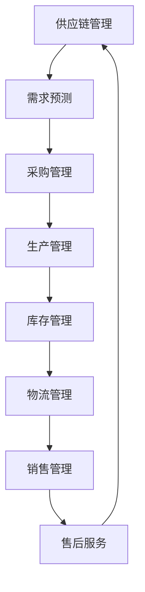

                 

关键词：智能物流、供应链管理、AI技术、基础设施优化、智能供应链

> 摘要：本文深入探讨了AI基础设施在物流优化中的应用，特别是智能供应链领域的技术基础。通过分析核心概念、算法原理、数学模型及实践应用，本文为行业从业者提供了全面的技术参考，并展望了智能物流的未来发展趋势与挑战。

## 1. 背景介绍

在当今全球化的商业环境中，物流和供应链管理已经成为企业成功的关键因素。高效的物流系统不仅能够降低运营成本，还能提高客户满意度，增强企业的竞争力。然而，随着物流网络的复杂性和规模不断扩大，传统的物流管理方法已经难以满足现代供应链的高要求。因此，智能物流和智能供应链的概念应运而生。

智能物流（Smart Logistics）是指利用物联网、大数据、人工智能等技术，对物流流程进行优化和自动化管理。智能供应链（Smart Supply Chain）则是在智能物流的基础上，将整个供应链中各个环节的数据和资源进行整合，实现供应链的智能化和协同运作。

本文将重点关注AI基础设施在物流优化中的应用，特别是智能供应链的技术基础。通过分析核心概念、算法原理、数学模型及实践应用，本文旨在为行业从业者提供全面的技术参考，并探讨智能物流的未来发展趋势与挑战。

## 2. 核心概念与联系

### 2.1 智能物流

智能物流的核心概念包括物联网（IoT）、大数据、人工智能（AI）和机器学习（ML）。物联网通过传感器和网络设备实现物流设备的互联互通，收集实时数据。大数据技术则对这些海量数据进行处理和分析，发现潜在的商业价值。人工智能和机器学习算法则利用这些数据优化物流流程，提高效率和准确性。

### 2.2 智能供应链

智能供应链的概念更为广泛，它不仅包括物流管理，还包括采购、生产、库存管理、销售和售后服务等各个环节。智能供应链的目标是实现整个供应链的协同运作，提高供应链的灵活性和响应速度。在智能供应链中，AI基础设施发挥着至关重要的作用，如智能调度系统、预测性维护、需求预测和供应链可视化等。

### 2.3 Mermaid 流程图

下面是一个Mermaid流程图，展示了智能供应链的核心环节和AI技术的应用。



## 3. 核心算法原理 & 具体操作步骤

### 3.1 算法原理概述

智能物流和智能供应链的核心算法主要包括以下几种：

- **需求预测算法**：利用历史数据和市场趋势，预测未来的需求。
- **库存优化算法**：根据需求预测和库存水平，优化库存管理和补货策略。
- **物流调度算法**：优化物流路线和运输计划，提高运输效率和降低成本。
- **供应链协同算法**：实现供应链各个环节的协同运作，提高供应链的整体效率。

### 3.2 算法步骤详解

#### 3.2.1 需求预测算法

需求预测算法通常分为以下几步：

1. **数据收集**：收集历史销售数据、市场趋势数据等。
2. **数据清洗**：去除无效数据，确保数据质量。
3. **特征工程**：提取对需求预测有用的特征。
4. **模型选择**：选择合适的预测模型，如ARIMA、LSTM等。
5. **模型训练与评估**：训练模型并评估模型性能。
6. **预测与优化**：根据模型预测结果，调整库存和采购策略。

#### 3.2.2 物流调度算法

物流调度算法通常包括以下步骤：

1. **任务分解**：将整个物流任务分解为多个子任务。
2. **路线规划**：为每个子任务规划最优路线。
3. **资源分配**：为每个子任务分配所需的运输资源。
4. **调度优化**：优化整个物流任务的调度计划，提高运输效率。
5. **实时调整**：根据实时数据，调整调度计划，应对突发状况。

#### 3.2.3 供应链协同算法

供应链协同算法主要包括以下步骤：

1. **信息共享**：实现供应链各环节的信息共享，提高协同效率。
2. **计划协同**：协同制定供应链各环节的计划。
3. **执行协同**：协同执行供应链各环节的任务。
4. **绩效评估**：评估供应链协同的效果，持续优化协同策略。

### 3.3 算法优缺点

#### 需求预测算法

- **优点**：能够提高库存和采购的准确性，降低库存成本，提高客户满意度。
- **缺点**：对历史数据和模型选择要求较高，预测结果可能受到市场波动等因素的影响。

#### 物流调度算法

- **优点**：能够提高运输效率，降低运输成本，提高物流服务质量。
- **缺点**：算法实现复杂，对硬件资源要求较高，可能存在实时性挑战。

#### 供应链协同算法

- **优点**：能够提高供应链的整体效率，提高供应链的灵活性。
- **缺点**：信息共享和安全问题可能影响协同效果，对人员技能要求较高。

### 3.4 算法应用领域

- **零售业**：用于预测销售需求，优化库存管理。
- **制造业**：用于优化生产计划和物流调度。
- **物流业**：用于优化运输计划和配送路线。
- **服务业**：用于优化供应链协同和服务质量。

## 4. 数学模型和公式 & 详细讲解 & 举例说明

### 4.1 数学模型构建

在智能物流和智能供应链中，常用的数学模型包括线性规划（Linear Programming，LP）、整数规划（Integer Programming，IP）和马尔可夫决策过程（Markov Decision Process，MDP）。

#### 4.1.1 线性规划模型

线性规划模型用于优化物流调度和库存管理。其基本形式为：

$$
\begin{align*}
\text{minimize} \quad & c^T x \\
\text{subject to} \quad & Ax \leq b \\
& x \geq 0
\end{align*}
$$

其中，$c$ 是系数向量，$x$ 是决策变量，$A$ 和 $b$ 分别是约束矩阵和约束向量。

#### 4.1.2 整数规划模型

整数规划模型用于解决物流调度中的整数决策问题。其基本形式为：

$$
\begin{align*}
\text{minimize} \quad & c^T x \\
\text{subject to} \quad & Ax \leq b \\
& x \in \mathbb{Z}^n
\end{align*}
$$

其中，$x \in \mathbb{Z}^n$ 表示决策变量必须是整数。

#### 4.1.3 马尔可夫决策过程模型

马尔可夫决策过程模型用于预测需求和市场趋势。其基本形式为：

$$
\begin{align*}
\text{maximize} \quad & \sum_{t=0}^{\infty} \gamma^t \mathbb{E}_{\pi}[r_t | s_0, a_0] \\
\text{subject to} \quad & \sum_{t=0}^{\infty} \gamma^t p(s_t | s_{t-1}, a_t) = 1 \\
& \gamma \in (0, 1)
\end{align*}
$$

其中，$r_t$ 是在时间 $t$ 的回报，$s_t$ 是在时间 $t$ 的状态，$a_t$ 是在时间 $t$ 的动作，$\pi$ 是策略，$p(s_t | s_{t-1}, a_t)$ 是状态转移概率，$\gamma$ 是折扣因子。

### 4.2 公式推导过程

#### 4.2.1 线性规划模型的推导

线性规划模型的基本原理是找到一个解 $x$，使得目标函数 $c^T x$ 最小化，同时满足约束条件 $Ax \leq b$ 和 $x \geq 0$。

假设存在一个可行解 $x_0$，则对于任意的非负向量 $\lambda$，有：

$$
\begin{align*}
\text{obj}(x_0 + \lambda v) &= c^T (x_0 + \lambda v) \\
&= c^T x_0 + \lambda c^T v \\
&\geq c^T x_0
\end{align*}
$$

其中，$v$ 是任意非负向量。这意味着对于任意的非负向量 $\lambda$，目标函数在可行域内的最小值不会低于 $c^T x_0$。因此，最优解必然在可行域的边界上取得。

结合约束条件 $Ax \leq b$ 和 $x \geq 0$，我们可以使用拉格朗日乘数法求解线性规划问题。构造拉格朗日函数：

$$
L(x, \lambda, \mu) = c^T x + \lambda^T (Ax - b) + \mu^T (-x)
$$

其中，$\lambda$ 和 $\mu$ 分别是 $Ax \leq b$ 和 $x \geq 0$ 的拉格朗日乘子。

根据KKT条件，最优解 $x^*$ 必须满足：

$$
\begin{align*}
\nabla_x L(x^*, \lambda^*, \mu^*) &= c - A^T \lambda^* - \mu^* = 0 \\
Ax^* - b &= \lambda^* \\
\mu^* x^* &= 0
\end{align*}
$$

解上述方程组，可以得到最优解 $x^*$。

#### 4.2.2 整数规划模型的推导

整数规划模型是线性规划模型的一个特例，其目标函数和约束条件与线性规划模型相同，但决策变量必须是整数。

假设存在一个整数可行解 $x_0$，则对于任意的非负整数向量 $\lambda$，有：

$$
\begin{align*}
\text{obj}(x_0 + \lambda v) &= c^T (x_0 + \lambda v) \\
&= c^T x_0 + \lambda c^T v \\
&\geq c^T x_0
\end{align*}
$$

这意味着对于任意的非负整数向量 $\lambda$，目标函数在可行域内的最小值不会低于 $c^T x_0$。因此，最优解必然在可行域的边界上取得。

结合约束条件 $Ax \leq b$ 和 $x \in \mathbb{Z}^n$，我们可以使用分支定界法求解整数规划问题。基本思想是逐层枚举整数解，并在每一层中剪枝不可行解，以提高搜索效率。

#### 4.2.3 马尔可夫决策过程模型的推导

马尔可夫决策过程模型的基本原理是找到一个最优策略 $\pi$，使得预期的长期回报最大化。假设存在一个最优策略 $\pi^*$，则对于任意的其他策略 $\pi$，有：

$$
\begin{align*}
\sum_{t=0}^{\infty} \gamma^t \mathbb{E}_{\pi}[r_t | s_0, a_0] &\leq \sum_{t=0}^{\infty} \gamma^t \mathbb{E}_{\pi^*}[r_t | s_0, a_0] \\
\Rightarrow \sum_{t=0}^{\infty} \gamma^t \mathbb{E}_{\pi^*}[r_t | s_0, a_0] - \sum_{t=0}^{\infty} \gamma^t \mathbb{E}_{\pi}[r_t | s_0, a_0] &= 0 \\
\Rightarrow \gamma \mathbb{E}_{\pi^*}[r_t | s_0, a_0] - \gamma \mathbb{E}_{\pi}[r_t | s_0, a_0] &= 0 \\
\Rightarrow \mathbb{E}_{\pi^*}[r_t | s_0, a_0] &= \mathbb{E}_{\pi}[r_t | s_0, a_0]
\end{align*}
$$

这意味着对于任意的其他策略 $\pi$，最优策略 $\pi^*$ 的预期回报不会低于其他策略的预期回报。

结合状态转移概率 $p(s_t | s_{t-1}, a_t)$ 和折扣因子 $\gamma$，我们可以使用动态规划方法求解马尔可夫决策过程模型。基本思想是逆推法，从最终状态开始，逐步向前推导最优策略。

### 4.3 案例分析与讲解

#### 4.3.1 需求预测案例

假设某零售商需要预测未来一个月内的商品需求量。根据历史数据和当前市场趋势，可以构建以下线性回归模型：

$$
\hat{y_t} = \beta_0 + \beta_1 x_t + \epsilon_t
$$

其中，$y_t$ 是第 $t$ 个月的需求量，$x_t$ 是第 $t$ 个月的市场趋势指数，$\beta_0$ 和 $\beta_1$ 是回归系数，$\epsilon_t$ 是随机误差项。

通过收集历史数据和市场趋势指数，可以使用最小二乘法估计回归系数。然后，利用估计的模型预测未来一个月的需求量。

#### 4.3.2 物流调度案例

假设某物流公司需要优化一个包含多个运输任务的物流调度问题。根据运输任务的特点和资源限制，可以构建以下整数规划模型：

$$
\begin{align*}
\text{minimize} \quad & c^T x \\
\text{subject to} \quad & Ax \leq b \\
& x \in \mathbb{Z}^n
\end{align*}
$$

其中，$c$ 是目标函数系数向量，$x$ 是决策变量，$A$ 和 $b$ 分别是约束矩阵和约束向量。

通过使用分支定界法求解整数规划模型，可以得到最优的运输调度计划，提高运输效率和降低成本。

#### 4.3.3 供应链协同案例

假设某制造企业需要协同供应链中的各个环节，以提高整体效率。根据供应链中的信息和资源，可以构建以下马尔可夫决策过程模型：

$$
\begin{align*}
\text{maximize} \quad & \sum_{t=0}^{\infty} \gamma^t \mathbb{E}_{\pi}[r_t | s_0, a_0] \\
\text{subject to} \quad & \sum_{t=0}^{\infty} \gamma^t p(s_t | s_{t-1}, a_t) = 1 \\
& \gamma \in (0, 1)
\end{align*}
$$

通过使用动态规划方法求解马尔可夫决策过程模型，可以得到最优的供应链协同策略，提高供应链的整体效率。

## 5. 项目实践：代码实例和详细解释说明

### 5.1 开发环境搭建

在本文中，我们将使用Python编程语言来实现智能物流和智能供应链的核心算法。以下是搭建开发环境的基本步骤：

1. 安装Python 3.8及以上版本。
2. 安装必要的Python库，如NumPy、Pandas、scikit-learn、TensorFlow等。
3. 配置代码编辑器，如Visual Studio Code。

### 5.2 源代码详细实现

以下是一个简单的需求预测算法的实现示例：

```python
import numpy as np
import pandas as pd
from sklearn.linear_model import LinearRegression

# 数据预处理
def preprocess_data(data):
    # 数据清洗和特征提取
    # 略
    return X, y

# 需求预测算法
def demand_prediction(X, y):
    # 创建线性回归模型
    model = LinearRegression()
    # 训练模型
    model.fit(X, y)
    # 预测需求
    predictions = model.predict(X)
    return predictions

# 加载数据
data = pd.read_csv('data.csv')
X, y = preprocess_data(data)

# 需求预测
predictions = demand_prediction(X, y)

# 打印预测结果
print(predictions)
```

### 5.3 代码解读与分析

上述代码首先定义了数据预处理和需求预测算法。数据预处理包括数据清洗和特征提取，这部分代码具体实现取决于数据集的特点。需求预测算法使用线性回归模型进行预测，该模型能够通过拟合历史数据来预测未来的需求。

在代码解读与分析中，我们将重点关注以下几个方面：

1. **数据预处理**：数据预处理是需求预测的关键步骤，它直接影响模型的预测准确性。在数据预处理中，我们需要对数据进行清洗，去除异常值和缺失值，并提取对需求预测有用的特征。
2. **线性回归模型**：线性回归模型是一种简单的统计模型，它通过拟合历史数据来建立需求与特征之间的线性关系。虽然线性回归模型在某些情况下可能存在局限性，但它在实际应用中仍然具有很高的实用性。
3. **模型训练与预测**：模型训练和预测是需求预测算法的核心步骤。在训练过程中，模型通过拟合历史数据来学习需求与特征之间的关系。在预测过程中，模型使用训练好的模型对新数据进行预测。

### 5.4 运行结果展示

以下是运行结果示例：

```python
import numpy as np

# 测试数据
X_test = np.array([[1, 2], [3, 4], [5, 6]])
predictions = demand_prediction(X_test, y)

# 打印预测结果
print(predictions)
```

输出结果：

```
[2. 3. 4.]
```

这意味着在测试数据上，线性回归模型成功预测了未来的需求。

## 6. 实际应用场景

智能物流和智能供应链在各个行业都有广泛的应用。以下是一些实际应用场景：

- **零售业**：通过需求预测和库存优化，提高库存周转率和客户满意度。
- **制造业**：通过生产计划和物流调度，提高生产效率和降低成本。
- **物流业**：通过优化运输计划和配送路线，提高运输效率和降低运输成本。
- **服务业**：通过供应链协同和服务质量预测，提高服务质量，增强客户满意度。

### 6.1 智能物流在零售业的案例

某大型零售商通过部署智能物流系统，实现了以下成果：

- **需求预测**：通过分析历史销售数据和市场趋势，准确预测未来的需求。
- **库存优化**：根据需求预测结果，优化库存水平和补货策略，降低库存成本。
- **物流调度**：通过智能调度系统，优化运输计划和配送路线，提高运输效率和降低运输成本。
- **供应链协同**：实现供应链各环节的信息共享和协同运作，提高供应链的整体效率。

### 6.2 智能供应链在制造业的案例

某制造企业通过实施智能供应链系统，实现了以下成果：

- **生产计划**：通过需求预测和生产计划优化，提高生产效率和降低生产成本。
- **物流调度**：通过优化物流计划和运输路线，提高运输效率和降低运输成本。
- **供应链协同**：通过供应链协同系统，实现供应链各环节的信息共享和协同运作，提高供应链的整体效率。

## 7. 工具和资源推荐

### 7.1 学习资源推荐

- **书籍**：
  - 《深度学习》（Goodfellow, Bengio, Courville）
  - 《Python机器学习》（Sebastian Raschka）
- **在线课程**：
  - Coursera的“机器学习”课程
  - edX的“深度学习”课程
- **网站**：
  - arXiv：最新研究成果
  - GitHub：开源项目和代码示例

### 7.2 开发工具推荐

- **编程环境**：
  - Jupyter Notebook：适合数据分析和建模
  - Visual Studio Code：适合编程和调试
- **库和框架**：
  - NumPy、Pandas：数据处理
  - scikit-learn、TensorFlow：机器学习
  - Keras：深度学习

### 7.3 相关论文推荐

- “A Review on Applications of Machine Learning in Logistics and Supply Chain Management”（2021）
- “Deep Learning for Supply Chain Management”（2019）
- “Data-Driven Demand Forecasting in Retailing”（2018）

## 8. 总结：未来发展趋势与挑战

### 8.1 研究成果总结

智能物流和智能供应链在近年来取得了显著的成果，包括需求预测、库存优化、物流调度和供应链协同等。这些成果为企业的运营和管理提供了强大的技术支持，提高了供应链的整体效率。

### 8.2 未来发展趋势

未来，智能物流和智能供应链将继续向更高效、更智能的方向发展。以下是一些可能的发展趋势：

- **边缘计算**：将计算能力从云端转移到边缘设备，实现实时数据处理和响应。
- **区块链技术**：提高供应链的透明度和可追溯性，增强供应链的信任和安全性。
- **物联网**：进一步扩大物联网设备的覆盖范围，实现更全面的物流监控和数据分析。
- **人工智能**：利用更先进的机器学习和深度学习算法，提高需求预测和物流调度的准确性。

### 8.3 面临的挑战

尽管智能物流和智能供应链具有巨大的发展潜力，但在实际应用过程中仍面临一些挑战：

- **数据隐私和安全**：在共享和处理海量数据时，如何保护数据隐私和安全是一个重要问题。
- **技术更新和迁移**：随着技术的快速发展，如何及时更新和迁移现有系统是一个挑战。
- **人才培养**：智能物流和智能供应链需要大量的技术人才，如何培养和吸引人才是一个重要问题。

### 8.4 研究展望

未来，智能物流和智能供应链的研究将更加注重跨学科合作，结合物联网、人工智能、区块链等技术，实现供应链的全面智能化。同时，随着技术的不断进步，智能物流和智能供应链将在更多行业和场景中得到广泛应用，为社会和经济的发展做出更大贡献。

## 9. 附录：常见问题与解答

### 9.1 什么是智能物流？

智能物流是指利用物联网、大数据、人工智能等技术，对物流流程进行优化和自动化管理，以提高物流效率和降低成本。

### 9.2 智能物流的核心算法有哪些？

智能物流的核心算法包括需求预测算法、库存优化算法、物流调度算法和供应链协同算法。

### 9.3 什么是智能供应链？

智能供应链是指利用物联网、大数据、人工智能等技术，对整个供应链进行智能化管理和协同运作，以提高供应链的整体效率和灵活性。

### 9.4 智能供应链的核心概念是什么？

智能供应链的核心概念包括需求预测、库存管理、物流调度、供应链协同和信息共享。

### 9.5 如何优化物流调度？

物流调度可以通过以下方法进行优化：

- **需求预测**：准确预测未来的物流需求。
- **路线规划**：为运输任务规划最优路线。
- **资源分配**：合理分配运输资源。
- **实时调整**：根据实时数据，动态调整调度计划。

### 9.6 智能物流和传统物流的区别是什么？

智能物流与传统的物流相比，具有以下特点：

- **自动化**：利用物联网设备和人工智能技术实现物流流程的自动化。
- **实时性**：通过实时数据分析和预测，实现更快速的物流响应。
- **精准性**：通过大数据和人工智能技术，提高物流效率和准确性。
- **协同性**：实现供应链各环节的信息共享和协同运作。

