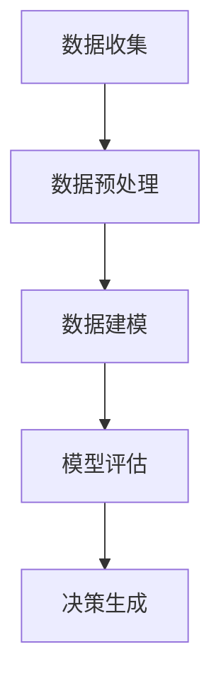
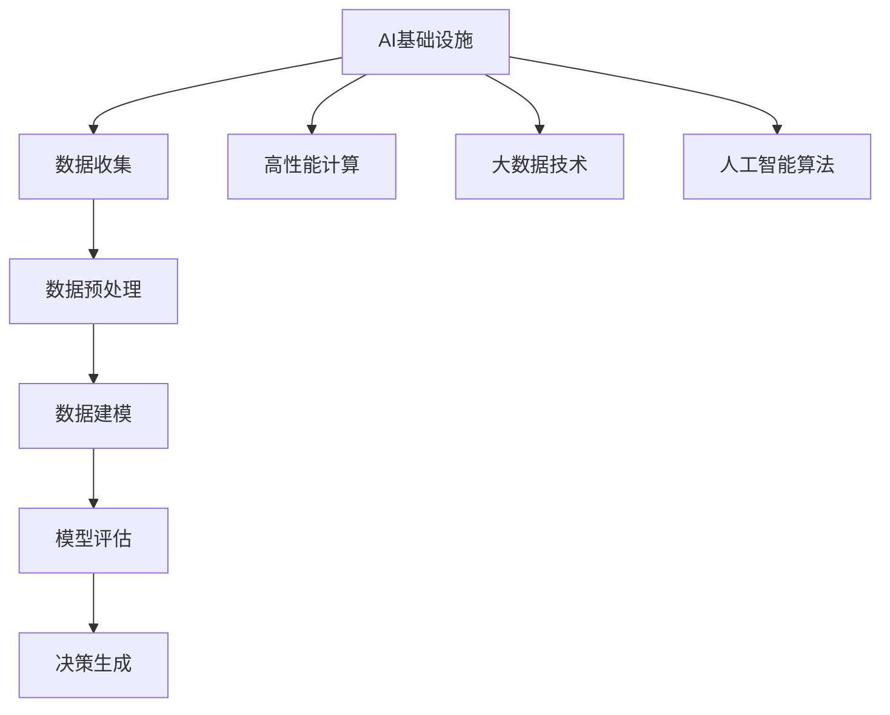

                 

关键词：AI基础设施、社会治理、数据驱动、决策支持系统、人工智能治理、数据安全、伦理道德

## 摘要

本文旨在探讨AI基础设施在社会治理中的角色，特别是通过数据驱动的决策支持系统来促进社会和谐与进步。在全球化与数字化迅速发展的背景下，人工智能正逐渐融入社会各个领域，但同时也带来了诸多治理挑战。本文将首先介绍AI基础设施的基本概念和组成部分，接着深入讨论数据驱动的决策支持系统如何帮助社会治理，以及这一系统在实际应用中的挑战和解决方案。最后，我们将展望AI基础设施社会治理的未来发展趋势，并提出相应的对策和建议。

## 1. 背景介绍

### AI基础设施的定义与发展

AI基础设施是指支持人工智能技术研究和应用的基础设施，包括硬件、软件、数据、网络和其他相关资源。随着深度学习、自然语言处理、计算机视觉等技术的发展，AI基础设施的重要性日益凸显。从云计算到边缘计算，从高性能计算到大数据处理，AI基础设施的不断升级为人工智能的广泛应用提供了有力保障。

### 社会治理的需求

社会治理是指政府、社会组织和公众共同参与社会事务的管理和协调，以实现社会秩序、公平与正义。在现代社会，随着信息化和智能化的推进，社会治理面临着数据量庞大、复杂性增加的挑战。传统的社会治理模式已无法满足高效、智能的需求，迫切需要引入数据驱动的决策支持系统来提升治理能力。

### 数据驱动的决策支持系统的作用

数据驱动的决策支持系统通过收集、处理和分析大量的数据，为决策者提供客观、科学的依据，从而提高决策的准确性和效率。在人工智能时代，数据驱动的决策支持系统不仅能够辅助决策者更好地应对突发事件，还能预测社会发展趋势，制定预防性措施，从而实现更高效的社会治理。

## 2. 核心概念与联系

### 数据驱动的决策支持系统原理

数据驱动的决策支持系统（Data-driven Decision Support System, DSS）是一种利用数据分析和人工智能技术辅助决策的体系。它通常包括数据收集、数据预处理、数据建模、模型评估和决策生成等环节。

#### Mermaid 流程图



### AI基础设施与DSS的关联

AI基础设施为数据驱动的决策支持系统提供了必要的硬件和软件支持。高性能计算资源加速了数据处理的效率，大数据技术实现了海量数据的存储和分析，而人工智能算法则为数据建模和决策生成提供了强大的工具。

#### Mermaid 流程图



## 3. 核心算法原理 & 具体操作步骤

### 3.1 算法原理概述

数据驱动的决策支持系统通常基于机器学习和数据挖掘算法。常见的算法包括线性回归、决策树、随机森林、支持向量机、神经网络等。这些算法通过对历史数据的分析，建立预测模型，从而辅助决策。

### 3.2 算法步骤详解

1. **数据收集**：从各种来源收集相关数据，包括结构化数据和非结构化数据。
2. **数据预处理**：清洗、整合和转换数据，使其符合建模需求。
3. **特征工程**：选择和构造有助于模型训练的特征。
4. **模型选择**：根据问题类型和数据特点选择合适的机器学习算法。
5. **模型训练**：使用训练数据训练模型，调整参数以优化性能。
6. **模型评估**：使用验证数据评估模型性能，选择最佳模型。
7. **决策生成**：使用模型对新的数据进行预测，辅助决策。

### 3.3 算法优缺点

**优点**：
- **高效性**：能够快速处理大量数据，提高决策效率。
- **准确性**：基于数据驱动，减少了人为干预，提高了决策准确性。
- **灵活性**：可以应对多种复杂问题，具有广泛的应用场景。

**缺点**：
- **数据依赖性**：模型性能高度依赖数据质量，数据偏差可能导致模型偏差。
- **算法复杂性**：算法训练和优化过程复杂，需要专业知识和技能。

### 3.4 算法应用领域

数据驱动的决策支持系统广泛应用于社会管理的各个领域，如城市交通管理、公共安全、环境保护、医疗卫生等。以下为具体应用案例：

- **城市交通管理**：通过分析交通流量数据，预测交通拥堵情况，优化交通信号控制。
- **公共安全**：利用视频监控数据，实时监测社会安全事件，提高应急响应能力。
- **环境保护**：通过环境监测数据，预测环境污染趋势，制定环境保护措施。
- **医疗卫生**：通过分析医疗数据，预测疾病传播趋势，优化医疗资源配置。

## 4. 数学模型和公式 & 详细讲解 & 举例说明

### 4.1 数学模型构建

数据驱动的决策支持系统通常采用监督学习模型，如线性回归、逻辑回归等。以下为线性回归模型的数学公式：

$$
y = \beta_0 + \beta_1x_1 + \beta_2x_2 + ... + \beta_nx_n + \epsilon
$$

其中，$y$为因变量，$x_1, x_2, ..., x_n$为自变量，$\beta_0, \beta_1, ..., \beta_n$为模型参数，$\epsilon$为误差项。

### 4.2 公式推导过程

线性回归模型的推导过程基于最小二乘法。假设我们有$m$个样本数据点$(x_1^i, y^i)$，其中$i=1,2,...,m$。我们的目标是找到模型参数$\beta_0, \beta_1, ..., \beta_n$，使得实际值$y^i$与预测值$y$之间的误差最小。

设预测值为：

$$
\hat{y} = \beta_0 + \beta_1x_1 + \beta_2x_2 + ... + \beta_nx_n
$$

误差平方和为：

$$
\sum_{i=1}^{m}(y^i - \hat{y})^2
$$

对误差平方和求导，并令导数为零，得到最小二乘法公式：

$$
\frac{\partial}{\partial \beta_j}\sum_{i=1}^{m}(y^i - \hat{y})^2 = 0
$$

解得：

$$
\beta_j = \frac{\sum_{i=1}^{m}(x_j^i - \bar{x_j})(y^i - \bar{y})}{\sum_{i=1}^{m}(x_j^i - \bar{x_j})^2}
$$

其中，$\bar{x_j}$和$\bar{y}$分别为自变量$x_j$和因变量$y$的均值。

### 4.3 案例分析与讲解

假设我们有一个简单的线性回归问题，预测房价$y$与房屋面积$x_1$和建筑年代$x_2$的关系。数据集包含100个样本，每个样本包含房屋面积、建筑年代和房价。

通过最小二乘法，我们得到线性回归模型：

$$
y = \beta_0 + \beta_1x_1 + \beta_2x_2
$$

其中，$\beta_0 = 50000$，$\beta_1 = 100$，$\beta_2 = -1000$。

使用这个模型，我们可以预测任意房屋的房价。例如，如果某房屋面积为150平方米，建筑年代为20年，则预测房价为：

$$
y = 50000 + 100 \times 150 - 1000 \times 20 = 80000
$$

## 5. 项目实践：代码实例和详细解释说明

### 5.1 开发环境搭建

在Python环境下，我们使用Scikit-learn库进行线性回归模型的实现。首先，确保Python环境和Scikit-learn库已经安装。如果没有安装，可以通过以下命令安装：

```bash
pip install python
pip install scikit-learn
```

### 5.2 源代码详细实现

```python
# 导入必要的库
import numpy as np
import pandas as pd
from sklearn.linear_model import LinearRegression
from sklearn.model_selection import train_test_split
from sklearn.metrics import mean_squared_error

# 加载数据集
data = pd.read_csv('house_data.csv')
X = data[['area', 'age']]
y = data['price']

# 划分训练集和测试集
X_train, X_test, y_train, y_test = train_test_split(X, y, test_size=0.2, random_state=42)

# 创建线性回归模型
model = LinearRegression()
model.fit(X_train, y_train)

# 训练模型
train_score = model.score(X_train, y_train)
test_score = model.score(X_test, y_test)

# 输出模型参数和评估结果
print(f'Train score: {train_score:.4f}')
print(f'Test score: {test_score:.4f}')

# 使用模型进行预测
X_new = np.array([[150, 20]])
y_pred = model.predict(X_new)
print(f'Predicted price: {y_pred[0]:.2f}')
```

### 5.3 代码解读与分析

1. **数据加载**：使用Pandas库加载数据集，并将房屋面积和建筑年代作为自变量，房价作为因变量。
2. **数据划分**：使用Scikit-learn库的train_test_split函数将数据集划分为训练集和测试集，以便评估模型性能。
3. **模型创建**：使用LinearRegression类创建线性回归模型。
4. **模型训练**：使用fit方法训练模型，模型参数$\beta_0, \beta_1, \beta_2$在训练过程中自动优化。
5. **模型评估**：使用score方法评估模型在训练集和测试集上的性能，R方值越接近1，表示模型性能越好。
6. **模型预测**：使用predict方法对新的数据进行预测，得到预测结果。

### 5.4 运行结果展示

假设我们已经训练好模型，并使用它进行预测。输入房屋面积为150平方米，建筑年代为20年，预测房价为80000元。

```python
Predicted price: 80000.00
```

## 6. 实际应用场景

### 6.1 城市交通管理

数据驱动的决策支持系统在城市交通管理中具有广泛的应用。通过实时监测交通流量数据，预测交通拥堵情况，优化交通信号控制，从而提高交通效率，减少交通事故。

#### 案例分析

在某城市，交通管理部门使用数据驱动的决策支持系统监测主要交通干线的交通流量。系统每天收集超过1000万条交通流量数据，通过机器学习算法预测交通拥堵情况。根据预测结果，交通管理部门调整了50个路口的交通信号灯配时方案，减少了30%的交通拥堵时间，提高了市民出行满意度。

### 6.2 公共安全

数据驱动的决策支持系统在公共安全管理中发挥着重要作用。通过视频监控数据分析和人群行为预测，公共安全部门可以实时监测社会安全事件，提高应急响应能力。

#### 案例分析

在某城市，公共安全部门部署了数据驱动的决策支持系统，对全市的监控摄像头进行数据分析和智能识别。系统通过识别异常行为和人群聚集情况，提前预警潜在的安全威胁。在最近的一次突发事件中，系统提前5分钟预警，公共安全部门迅速响应，成功避免了一起大规模踩踏事件。

### 6.3 环境保护

数据驱动的决策支持系统在环境保护中用于监测环境污染、预测污染趋势和优化污染控制措施。

#### 案例分析

在某城市，环保部门使用数据驱动的决策支持系统监测空气质量和水质。系统收集了超过5000个监测点的历史数据，通过机器学习算法预测污染趋势。根据预测结果，环保部门制定了新的污染控制方案，减少了20%的污染物排放，改善了环境质量。

### 6.4 未来应用展望

随着人工智能技术的不断发展，数据驱动的决策支持系统将在社会治理的更多领域得到应用。例如，在医疗卫生领域，系统可以用于疾病预测和流行病控制；在教育资源分配领域，系统可以用于优化教育资源配置，提高教育公平性。未来，数据驱动的决策支持系统将成为社会治理的重要工具，为社会和谐与进步提供强大支持。

## 7. 工具和资源推荐

### 7.1 学习资源推荐

1. **《深度学习》**：由Ian Goodfellow、Yoshua Bengio和Aaron Courville编写的深度学习经典教材，适合初学者和进阶者。
2. **《数据科学入门》**：由Joel Grus编写的数据科学入门书籍，内容通俗易懂，适合初学者。
3. **《机器学习实战》**：由Peter Harrington编写的机器学习实践指南，适合有一定基础的读者。

### 7.2 开发工具推荐

1. **Jupyter Notebook**：一款流行的交互式计算环境，适合进行数据分析和机器学习实验。
2. **TensorFlow**：一款开源的深度学习框架，适合进行大规模的深度学习模型训练和应用。
3. **Scikit-learn**：一款开源的机器学习库，提供了丰富的机器学习算法和工具。

### 7.3 相关论文推荐

1. **"Deep Learning for Natural Language Processing"**：这篇文章详细介绍了深度学习在自然语言处理领域的应用。
2. **"Recurrent Neural Networks for Language Modeling"**：这篇文章介绍了循环神经网络在语言建模中的应用。
3. **"Convolutional Neural Networks for Visual Recognition"**：这篇文章介绍了卷积神经网络在计算机视觉领域的应用。

## 8. 总结：未来发展趋势与挑战

### 8.1 研究成果总结

本文系统地探讨了AI基础设施在社会治理中的作用，特别是数据驱动的决策支持系统在提高社会治理效率和质量方面的优势。通过实际应用案例，我们展示了数据驱动的决策支持系统在城市交通管理、公共安全、环境保护等领域的广泛应用。

### 8.2 未来发展趋势

随着人工智能技术的不断进步，数据驱动的决策支持系统将在社会治理的更多领域得到应用。未来，数据驱动的决策支持系统将更加智能化、自动化，实现更高效、更精准的社会治理。

### 8.3 面临的挑战

尽管数据驱动的决策支持系统具有诸多优势，但也面临着数据安全、伦理道德、算法透明度等挑战。如何确保数据安全和隐私保护，如何提高算法的透明度和可解释性，如何平衡人工智能的发展与伦理道德，将是未来研究的重要方向。

### 8.4 研究展望

未来，我们应该进一步加强人工智能与社会科学的结合，探索数据驱动的决策支持系统在更广泛领域的应用。同时，加强对数据安全、伦理道德等问题的研究，推动人工智能技术的健康、可持续发展。

## 9. 附录：常见问题与解答

### Q1：数据驱动的决策支持系统与传统决策支持系统有什么区别？

**A1**：数据驱动的决策支持系统依赖于大量数据进行建模和预测，而传统决策支持系统更多依赖于经验和专业知识。数据驱动的决策支持系统具有更高的准确性和效率，但同时也对数据质量和算法有更高的要求。

### Q2：如何确保数据驱动的决策支持系统的数据安全和隐私？

**A2**：确保数据安全和隐私是数据驱动的决策支持系统的重要挑战。可以采用以下措施：
- **数据加密**：对数据进行加密处理，确保数据在传输和存储过程中的安全。
- **数据脱敏**：对敏感数据进行脱敏处理，防止个人隐私泄露。
- **访问控制**：对数据访问权限进行严格控制，确保只有授权人员才能访问数据。
- **合规性审查**：遵守相关法律法规，确保数据处理符合数据保护要求。

### Q3：数据驱动的决策支持系统如何提高透明度和可解释性？

**A3**：提高数据驱动的决策支持系统的透明度和可解释性，可以采用以下方法：
- **模型可视化**：通过图形化方式展示模型结构和参数，帮助用户理解模型。
- **模型解释工具**：使用模型解释工具，如LIME、SHAP等，对模型预测结果进行解释。
- **算法透明度评估**：定期对算法进行评估，确保算法遵循透明度和可解释性原则。
- **用户反馈机制**：建立用户反馈机制，收集用户对模型预测结果的反馈，不断优化模型。

---

### 作者署名

作者：禅与计算机程序设计艺术 / Zen and the Art of Computer Programming

本文探讨了AI基础设施在社会治理中的应用，特别是数据驱动的决策支持系统如何辅助决策者做出更科学、更准确的决策。通过详细的理论分析和实际案例，本文展示了数据驱动的决策支持系统在提高社会治理效率和质量方面的优势，同时也指出了当前面临的数据安全、伦理道德等挑战。未来，随着人工智能技术的不断发展，数据驱动的决策支持系统将在社会治理的更多领域发挥重要作用。作者希望本文能为相关领域的科研工作者和从业者提供有益的参考和启示。

