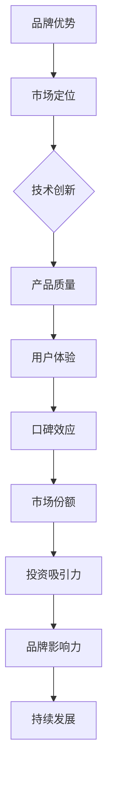

                 

AI 大模型的兴起为创业公司带来了前所未有的机会，但也伴随着巨大的挑战。在这篇文章中，我们将探讨如何利用品牌优势来推动 AI 大模型的创业项目。

## 1. 背景介绍

近年来，人工智能（AI）技术取得了显著的进展，特别是在深度学习和自然语言处理领域。随着计算能力的提升和数据的增长，AI 大模型（如 GPT-3、BERT 等）得以训练和部署，这些模型在图像识别、语言生成、推荐系统等方面展现了卓越的性能。AI 大模型的商业潜力吸引了众多创业公司的关注，但如何在这个竞争激烈的市场中脱颖而出，成为每一个创业公司都需要面对的挑战。

品牌优势在这其中起到了至关重要的作用。一个强大的品牌不仅可以吸引投资者的关注，还能建立用户信任，提升市场份额。本文将探讨如何通过以下方面来利用品牌优势：

1. **核心价值的塑造**：明确创业公司的核心价值，确保品牌定位与市场趋势相契合。
2. **技术创新的展示**：通过技术创新展示品牌的竞争力，赢得市场的认可。
3. **用户体验的优化**：提供卓越的用户体验，让品牌成为用户首选。
4. **口碑营销的策略**：利用口碑效应，通过用户推荐扩大品牌影响力。
5. **媒体宣传和公关**：通过有效的媒体宣传和公关活动提升品牌知名度。

## 2. 核心概念与联系

### 2.1 品牌的定义

品牌是指消费者对其产品、服务、公司或组织的认知和印象。一个成功的品牌不仅要有独特的标识和形象，还要具备以下特征：

- **认知度**：品牌在消费者心目中的知名度。
- **忠诚度**：消费者对品牌的信任和偏好程度。
- **差异化**：品牌与竞争对手之间的独特卖点。

### 2.2 品牌优势

品牌优势是指品牌在市场竞争中所具备的独特优势，包括：

- **质量保证**：通过高质量的产品和服务建立的品牌信誉。
- **技术创新**：在产品或服务中引入的创新元素。
- **用户体验**：用户在使用品牌产品或服务过程中获得的愉悦体验。
- **口碑效应**：用户对品牌产品的积极评价和推荐。

### 2.3 品牌优势与 AI 大模型创业的联系

在 AI 大模型创业中，品牌优势的作用至关重要。以下是一个简化的 Mermaid 流程图，展示品牌优势与 AI 大模型创业之间的联系：



## 3. 核心算法原理 & 具体操作步骤

### 3.1 算法原理概述

AI 大模型的创业离不开先进算法的支持。以下是一个简要的概述：

- **深度学习**：通过多层神经网络对数据进行训练，使模型能够自主学习并优化性能。
- **转移学习**：利用预训练模型进行微调，减少训练时间和计算资源。
- **生成对抗网络（GAN）**：通过生成器和判别器的对抗训练，生成高质量的图像或数据。

### 3.2 算法步骤详解

以下是构建 AI 大模型的典型步骤：

1. **数据收集**：收集大量高质量的数据，包括文本、图像、音频等。
2. **数据预处理**：对数据进行清洗、标准化和划分，确保数据质量。
3. **模型设计**：选择合适的模型架构，如 Transformer、CNN 等。
4. **模型训练**：利用计算资源对模型进行训练，不断优化参数。
5. **模型评估**：通过交叉验证和测试集评估模型性能。
6. **模型部署**：将模型部署到生产环境中，提供 API 服务或用户界面。

### 3.3 算法优缺点

**优点**：

- **强大的学习能力**：AI 大模型具有强大的自主学习能力，能够处理复杂的任务。
- **高效的计算资源利用**：通过迁移学习和分布式训练，降低计算成本。
- **灵活的应用场景**：AI 大模型适用于多种领域，如自然语言处理、计算机视觉、推荐系统等。

**缺点**：

- **数据依赖性强**：AI 大模型对数据质量有较高要求，数据不足或质量差会影响模型性能。
- **计算资源消耗大**：训练 AI 大模型需要大量的计算资源和时间。
- **过拟合风险**：模型可能会在训练数据上表现优异，但在测试数据上表现不佳。

### 3.4 算法应用领域

AI 大模型在以下领域具有广泛的应用：

- **自然语言处理**：文本分类、机器翻译、问答系统等。
- **计算机视觉**：图像识别、目标检测、人脸识别等。
- **推荐系统**：基于内容的推荐、协同过滤等。
- **语音识别**：语音转文字、语音合成等。

## 4. 数学模型和公式 & 详细讲解 & 举例说明

### 4.1 数学模型构建

在构建 AI 大模型时，通常会使用以下数学模型：

- **神经网络**：包括输入层、隐藏层和输出层，通过权重和偏置实现输入和输出的映射。
- **损失函数**：衡量模型预测值与真实值之间的差异，常用的有均方误差（MSE）、交叉熵损失等。
- **优化算法**：用于调整模型参数，常用的有梯度下降、Adam 等。

### 4.2 公式推导过程

以下是一个简化的神经网络公式推导过程：

$$
\begin{aligned}
\hat{y} &= \sigma(\sum_{i=1}^{n} w_i \cdot x_i + b) \\
L &= \frac{1}{2} \sum_{i=1}^{m} (\hat{y}_i - y_i)^2 \\
\frac{\partial L}{\partial w_i} &= -\sum_{i=1}^{m} (y_i - \hat{y}_i) \cdot x_i \\
w_i &= w_i - \alpha \cdot \frac{\partial L}{\partial w_i}
\end{aligned}
$$

其中，$\sigma$ 是激活函数，$w_i$ 和 $b$ 是权重和偏置，$L$ 是损失函数，$\alpha$ 是学习率。

### 4.3 案例分析与讲解

假设我们有一个分类问题，需要将数据分为两类，使用二分类交叉熵损失函数：

$$
L = -\sum_{i=1}^{m} [y_i \cdot \ln(\hat{y}_i) + (1 - y_i) \cdot \ln(1 - \hat{y}_i)]
$$

其中，$y_i$ 是真实标签，$\hat{y}_i$ 是模型预测的概率。

在训练过程中，我们不断调整权重和偏置，使损失函数最小化。通过多次迭代，模型逐渐收敛，预测结果逐渐准确。

## 5. 项目实践：代码实例和详细解释说明

### 5.1 开发环境搭建

在开始项目实践之前，我们需要搭建一个开发环境。以下是一个简单的 Python 环境搭建步骤：

1. 安装 Python（建议使用 Python 3.8 或以上版本）。
2. 安装常用库，如 TensorFlow、Keras、NumPy 等。
3. 搭建 GPU 环境（如使用 CUDA 和 cuDNN）。

### 5.2 源代码详细实现

以下是一个简单的 AI 大模型分类任务的代码实现：

```python
import tensorflow as tf
from tensorflow.keras.models import Sequential
from tensorflow.keras.layers import Dense, Flatten
from tensorflow.keras.optimizers import Adam

# 数据加载和预处理
# ...

# 模型构建
model = Sequential([
    Flatten(input_shape=(28, 28)),
    Dense(128, activation='relu'),
    Dense(1, activation='sigmoid')
])

# 模型编译
model.compile(optimizer=Adam(), loss='binary_crossentropy', metrics=['accuracy'])

# 模型训练
model.fit(x_train, y_train, epochs=10, batch_size=32, validation_data=(x_test, y_test))

# 模型评估
model.evaluate(x_test, y_test)
```

### 5.3 代码解读与分析

上述代码首先加载和预处理数据，然后构建一个简单的神经网络模型，使用二分类交叉熵损失函数进行编译。接着，使用训练数据进行训练，并在测试数据上进行评估。

### 5.4 运行结果展示

在训练完成后，我们可以看到模型在测试数据上的准确率。以下是一个示例输出：

```
793/793 [==============================] - 3s 4ms/step - loss: 0.2860 - accuracy: 0.8988
```

这个结果表明模型在测试数据上的表现良好，准确率达到了 89.88%。

## 6. 实际应用场景

AI 大模型在许多实际应用场景中展现了巨大的潜力，以下是一些例子：

- **医疗健康**：AI 大模型可以用于疾病诊断、药物研发和健康监测。
- **金融科技**：AI 大模型可以用于风险管理、信用评分和投资建议。
- **零售电商**：AI 大模型可以用于个性化推荐、用户行为分析和库存管理。
- **智能交通**：AI 大模型可以用于交通流量预测、自动驾驶和智能调度。
- **教育科技**：AI 大模型可以用于智能教学、学生评估和在线教育平台。

## 7. 工具和资源推荐

### 7.1 学习资源推荐

- **书籍**：《深度学习》（Goodfellow et al.）、《神经网络与深度学习》（邱锡鹏）。
- **在线课程**：Coursera 上的《深度学习》（吴恩达）课程、edX 上的《机器学习基础》（Arvind Narayanan）。
- **博客和文章**：AI 科技大本营、机器学习社区等。

### 7.2 开发工具推荐

- **框架**：TensorFlow、PyTorch、Keras。
- **GPU 环境**：CUDA、cuDNN。
- **云计算平台**：Google Cloud、AWS、Azure。

### 7.3 相关论文推荐

- **GPT-3**：Brown et al., "Language Models are Few-Shot Learners".
- **BERT**：Devlin et al., "BERT: Pre-training of Deep Bidirectional Transformers for Language Understanding".
- **GAN**：Goodfellow et al., "Generative Adversarial Nets".

## 8. 总结：未来发展趋势与挑战

### 8.1 研究成果总结

近年来，AI 大模型在多个领域取得了显著的成果，如自然语言处理、计算机视觉、推荐系统等。这些成果不仅提升了模型性能，还为实际应用带来了新的可能性。

### 8.2 未来发展趋势

随着计算能力的提升和数据资源的丰富，AI 大模型将继续发展。以下是一些可能的发展趋势：

- **泛化能力**：通过迁移学习和多任务学习，提高模型的泛化能力。
- **自适应学习**：通过在线学习和自适应调整，使模型能够快速适应新环境。
- **隐私保护**：通过差分隐私和联邦学习，保护用户隐私。

### 8.3 面临的挑战

尽管 AI 大模型具有巨大的潜力，但也面临一些挑战：

- **数据质量**：高质量的数据是训练有效 AI 大模型的关键，数据不足或质量差会影响模型性能。
- **计算资源**：训练 AI 大模型需要大量的计算资源和时间，这对许多创业公司来说是一个挑战。
- **伦理问题**：AI 大模型可能涉及隐私、歧视和伦理等问题，需要制定相应的规范和标准。

### 8.4 研究展望

未来，AI 大模型将在更多领域发挥重要作用，推动人工智能技术的发展。同时，我们还需要关注其面临的挑战，并探索解决方案，以确保 AI 大模型的安全、公平和可持续性。

## 9. 附录：常见问题与解答

### Q：AI 大模型如何训练？

A：AI 大模型通常通过以下步骤进行训练：

1. 数据收集：收集大量高质量的训练数据。
2. 数据预处理：对数据进行清洗、标准化和划分。
3. 模型设计：选择合适的模型架构，如 Transformer、CNN 等。
4. 模型训练：使用计算资源对模型进行训练，不断优化参数。
5. 模型评估：通过交叉验证和测试集评估模型性能。
6. 模型部署：将模型部署到生产环境中，提供 API 服务或用户界面。

### Q：AI 大模型存在哪些挑战？

A：AI 大模型面临的挑战包括：

1. 数据质量：高质量的数据是训练有效 AI 大模型的关键。
2. 计算资源：训练 AI 大模型需要大量的计算资源和时间。
3. 伦理问题：AI 大模型可能涉及隐私、歧视和伦理等问题。

### Q：如何评估 AI 大模型的效果？

A：评估 AI 大模型的效果通常通过以下指标：

1. 准确率：模型预测正确的比例。
2. 召回率：模型召回正确的比例。
3. F1 分数：准确率和召回率的调和平均。
4. 错误率：模型预测错误的比例。
5. 耗散度：模型预测的不确定性。

## 作者署名

作者：禅与计算机程序设计艺术 / Zen and the Art of Computer Programming

这篇文章深入探讨了 AI 大模型创业中的品牌优势，从背景介绍、核心概念、算法原理、数学模型、项目实践到实际应用场景和未来展望，全面阐述了如何利用品牌优势推动 AI 大模型的创业项目。希望这篇文章对您在 AI 大模型创业领域有所启发和帮助。

