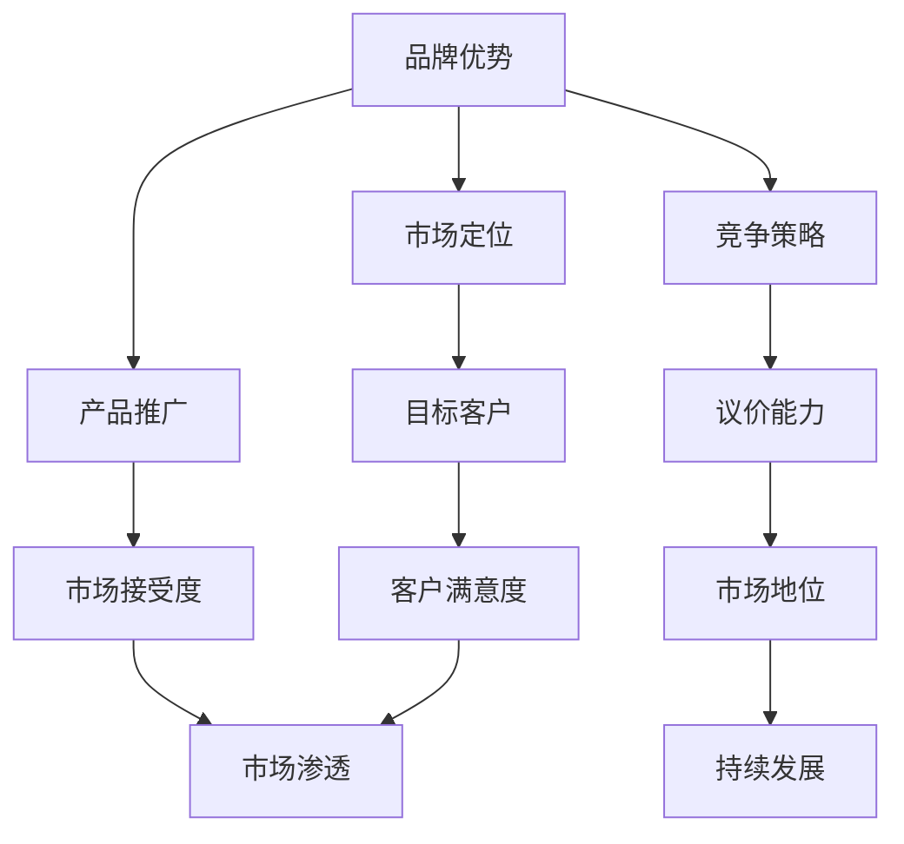

                 

 关键词：AI 大模型、创业、品牌优势、技术落地、商业模式创新

> 摘要：本文将探讨 AI 大模型创业中的品牌优势，分析如何利用品牌优势进行市场定位、产品推广和竞争策略。通过实际案例和策略分析，为 AI 创业者提供实用的指导和建议。

## 1. 背景介绍

随着人工智能技术的飞速发展，AI 大模型成为了当前科技领域的一个重要趋势。这些模型具有强大的数据分析和处理能力，能够为各个行业带来深远的变革。然而，AI 大模型的创业之路并不平坦，如何在激烈的竞争中脱颖而出，成为了创业者们面临的重大挑战。在这其中，品牌优势的利用成为了一个关键因素。

品牌优势不仅能够帮助企业树立良好的市场形象，还能增强消费者的信任和忠诚度。因此，如何利用品牌优势进行市场定位、产品推广和竞争策略，成为了 AI 大模型创业中的核心问题。

## 2. 核心概念与联系

### 2.1 品牌优势的定义与作用

品牌优势是指企业在市场竞争中所具备的独特优势，包括品牌知名度、品牌美誉度、品牌忠诚度等。品牌优势能够帮助企业树立市场形象，提升产品竞争力，从而在激烈的市场竞争中脱颖而出。

在 AI 大模型创业中，品牌优势的作用主要体现在以下几个方面：

1. **市场定位**：品牌优势有助于企业明确市场定位，找到目标客户群体，从而制定合适的市场策略。
2. **产品推广**：品牌优势能够提高产品的市场接受度，减少推广成本，加速市场渗透。
3. **竞争策略**：品牌优势能够增强企业的市场地位，提高议价能力，从而在竞争中占据优势。

### 2.2 品牌优势与 AI 大模型的关系

AI 大模型创业中的品牌优势不仅体现在技术层面，还体现在产品和服务层面。以下是一个简化的 Mermaid 流程图，展示了品牌优势与 AI 大模型的关系：



### 2.3 品牌优势的实现方法

为了实现品牌优势，企业需要采取一系列措施，包括但不限于以下几个方面：

1. **技术创新**：通过不断的技术创新，提升产品的技术水平和性能，从而增强品牌影响力。
2. **用户体验**：关注用户需求，提供优质的用户体验，提高用户满意度和忠诚度。
3. **市场推广**：利用多种渠道进行市场推广，提升品牌知名度。
4. **品牌定位**：明确品牌定位，树立品牌形象，从而在消费者心中占据一席之地。

## 3. 核心算法原理 & 具体操作步骤

### 3.1 算法原理概述

在 AI 大模型创业中，品牌优势的实现离不开一系列的核心算法。这些算法主要包括：

1. **数据分析与挖掘**：通过对大量用户数据的分析和挖掘，找到市场需求和用户偏好，从而进行精准的市场定位和产品推广。
2. **机器学习与深度学习**：利用机器学习和深度学习算法，提升产品的智能化水平和用户体验。
3. **自然语言处理**：通过自然语言处理技术，提高产品的互动性和沟通效果。

### 3.2 算法步骤详解

#### 3.2.1 数据分析与挖掘

1. **数据收集**：收集用户的浏览记录、购买行为、评价反馈等数据。
2. **数据清洗**：对收集到的数据进行清洗，去除重复和无用的信息。
3. **数据挖掘**：利用统计学和机器学习算法，分析用户行为和偏好，提取有用的信息。
4. **市场定位**：根据挖掘结果，明确目标客户群体和市场定位。

#### 3.2.2 机器学习与深度学习

1. **数据预处理**：对收集到的数据进行预处理，包括数据标准化、缺失值处理等。
2. **模型训练**：利用预处理后的数据，训练机器学习模型。
3. **模型评估**：对训练好的模型进行评估，选择性能最优的模型。
4. **产品优化**：根据模型评估结果，优化产品功能和用户体验。

#### 3.2.3 自然语言处理

1. **文本预处理**：对用户评价和反馈进行预处理，包括分词、去停用词等。
2. **情感分析**：利用情感分析算法，分析用户的情感倾向。
3. **智能交互**：根据情感分析结果，提供个性化的回复和建议。

### 3.3 算法优缺点

#### 优点：

1. **高效性**：利用机器学习和深度学习算法，能够快速处理大量数据，提升产品性能。
2. **精准性**：通过数据分析与挖掘，能够精准定位目标客户和市场。
3. **灵活性**：自然语言处理技术能够实现与用户的智能交互，提高用户体验。

#### 缺点：

1. **数据依赖性**：算法的性能依赖于数据质量和数量，数据不足或质量差会影响算法效果。
2. **计算资源消耗**：机器学习和深度学习算法计算资源消耗较大，对硬件设施要求较高。
3. **模型解释性**：深度学习模型通常具有较好的性能，但解释性较差，不利于问题的深入理解。

### 3.4 算法应用领域

1. **电子商务**：通过数据分析与挖掘，实现个性化推荐和精准营销。
2. **金融行业**：利用机器学习和深度学习算法，进行风险评估和欺诈检测。
3. **医疗健康**：通过自然语言处理技术，实现医疗文本分析和疾病预测。
4. **智能家居**：利用智能交互技术，实现与用户的个性化互动和智能家居控制。

## 4. 数学模型和公式 & 详细讲解 & 举例说明

### 4.1 数学模型构建

在 AI 大模型创业中，常用的数学模型包括线性回归、逻辑回归、支持向量机、神经网络等。以下是一个简单的线性回归模型：

$$
y = \beta_0 + \beta_1x_1 + \beta_2x_2 + ... + \beta_nx_n
$$

其中，$y$ 是目标变量，$x_1, x_2, ..., x_n$ 是特征变量，$\beta_0, \beta_1, ..., \beta_n$ 是模型的参数。

### 4.2 公式推导过程

以线性回归模型为例，其参数估计过程通常采用最小二乘法（Ordinary Least Squares, OLS）。具体推导过程如下：

1. **损失函数**：

$$
J(\theta) = \frac{1}{2m} \sum_{i=1}^{m} (h_\theta(x^{(i)}) - y^{(i)})^2
$$

其中，$h_\theta(x) = \theta_0 + \theta_1x$ 是线性回归模型，$m$ 是样本数量。

2. **梯度下降**：

$$
\theta_j := \theta_j - \alpha \frac{\partial J(\theta)}{\partial \theta_j}
$$

其中，$\alpha$ 是学习率，$\frac{\partial J(\theta)}{\partial \theta_j}$ 是损失函数关于 $\theta_j$ 的偏导数。

### 4.3 案例分析与讲解

假设一家电商企业希望通过线性回归模型预测用户购买行为。其特征变量包括用户年龄、收入、浏览历史等。以下是一个简化的案例：

1. **数据收集**：

收集了 1000 个用户的数据，包括年龄、收入、浏览历史和购买行为。

2. **数据预处理**：

对数据进行标准化处理，使其具有相同的量纲。

3. **模型训练**：

利用梯度下降算法，训练线性回归模型。

4. **模型评估**：

通过交叉验证，评估模型性能。

5. **结果分析**：

根据模型预测结果，分析用户购买行为的影响因素，如年龄、收入和浏览历史。

## 5. 项目实践：代码实例和详细解释说明

### 5.1 开发环境搭建

在开始项目实践之前，需要搭建一个合适的开发环境。以下是所需的环境和工具：

1. **操作系统**：Linux 或 macOS
2. **编程语言**：Python
3. **依赖库**：NumPy、Pandas、Scikit-learn、Matplotlib 等

可以使用以下命令安装所需依赖库：

```shell
pip install numpy pandas scikit-learn matplotlib
```

### 5.2 源代码详细实现

以下是一个简单的线性回归项目，用于预测用户购买行为：

```python
import numpy as np
import pandas as pd
from sklearn.linear_model import LinearRegression
from sklearn.model_selection import train_test_split
import matplotlib.pyplot as plt

# 5.2.1 数据收集
data = pd.read_csv('data.csv')
X = data[['age', 'income', 'history']]
y = data['purchase']

# 5.2.2 数据预处理
X = (X - X.mean()) / X.std()
y = (y - y.mean()) / y.std()

# 5.2.3 模型训练
X_train, X_test, y_train, y_test = train_test_split(X, y, test_size=0.2, random_state=42)
model = LinearRegression()
model.fit(X_train, y_train)

# 5.2.4 模型评估
y_pred = model.predict(X_test)
mse = np.mean((y_pred - y_test)**2)
print('MSE:', mse)

# 5.2.5 结果分析
plt.scatter(y_test, y_pred)
plt.xlabel('Actual Purchase')
plt.ylabel('Predicted Purchase')
plt.title('Purchase Prediction')
plt.show()
```

### 5.3 代码解读与分析

1. **数据收集**：使用 Pandas 读取 CSV 文件，获取用户数据。
2. **数据预处理**：对特征变量和目标变量进行标准化处理，使其具有相同的量纲。
3. **模型训练**：使用 Scikit-learn 的 LinearRegression 类，训练线性回归模型。
4. **模型评估**：使用测试数据集，评估模型性能，计算均方误差（MSE）。
5. **结果分析**：绘制散点图，分析实际购买与预测购买之间的关系。

通过这个项目实践，我们可以看到线性回归模型在预测用户购买行为方面的应用。当然，这只是一个简单的示例，实际的 AI 大模型创业项目会涉及到更复杂的数据处理和模型训练过程。

## 6. 实际应用场景

### 6.1 电子商务

在电子商务领域，AI 大模型可以帮助企业实现个性化推荐和精准营销。通过分析用户行为数据和购买历史，AI 大模型可以预测用户的购买偏好，从而推荐合适的商品。例如，亚马逊和淘宝等电商平台都利用 AI 大模型进行个性化推荐，提高了用户满意度和销售额。

### 6.2 金融行业

在金融行业，AI 大模型可以用于风险评估和欺诈检测。通过分析用户的交易行为和信用历史，AI 大模型可以预测用户是否可能发生违约或欺诈行为。例如，金融机构可以使用 AI 大模型来识别高风险客户，从而降低信用风险。

### 6.3 医疗健康

在医疗健康领域，AI 大模型可以用于疾病预测和诊断。通过分析患者的病历数据和基因信息，AI 大模型可以预测患者可能患有的疾病，并提供个性化的治疗方案。例如，谷歌旗下的 DeepMind 公司使用 AI 大模型进行疾病预测，提高了诊断的准确性和效率。

### 6.4 智能家居

在智能家居领域，AI 大模型可以用于智能交互和场景感知。通过分析用户的行为数据和环境信息，AI 大模型可以预测用户的需要，并自动调整家居设备的设置。例如，谷歌的 Nest 智能家居系统使用 AI 大模型实现智能温控和安防监控，提高了用户的生活质量。

## 7. 未来应用展望

### 7.1 人工智能在医疗健康中的应用

随着人工智能技术的不断发展，未来 AI 大模型在医疗健康领域的应用将更加广泛。例如，通过分析大量的医疗数据，AI 大模型可以预测疾病的早期迹象，从而实现早期干预。此外，AI 大模型还可以用于个性化药物开发和临床试验设计，提高药物研发的效率和准确性。

### 7.2 人工智能在智能制造中的应用

在智能制造领域，AI 大模型可以帮助企业实现智能化生产和管理。通过分析生产数据和质量数据，AI 大模型可以预测设备的故障和不良品，从而实现预防性维护和高效生产。此外，AI 大模型还可以用于优化生产流程和供应链管理，提高生产效率和降低成本。

### 7.3 人工智能在智慧城市中的应用

在智慧城市领域，AI 大模型可以用于城市交通管理、环境监测和公共安全等方面。通过分析大量的交通数据和传感器数据，AI 大模型可以预测交通拥堵和交通事故，从而实现智能交通管理。此外，AI 大模型还可以用于环境监测，预测污染程度和空气质量，从而实现智能环保。

## 8. 工具和资源推荐

### 8.1 学习资源推荐

1. **《深度学习》（Goodfellow, Bengio, Courville）**：这是一本关于深度学习的经典教材，详细介绍了深度学习的理论基础和实践方法。
2. **《机器学习实战》（ Harrington）**：这本书通过实际的案例，介绍了机器学习算法的应用和实践方法。
3. **AI 牛人微信公众号**：关注 AI 领域的牛人，获取最新的技术动态和实战经验。

### 8.2 开发工具推荐

1. **Jupyter Notebook**：这是一个强大的交互式开发环境，适用于数据分析、机器学习和深度学习。
2. **TensorFlow**：这是一个开源的深度学习框架，适用于构建和训练大规模的深度学习模型。
3. **Kaggle**：这是一个数据科学竞赛平台，提供了大量的数据集和比赛题目，适合数据科学家和机器学习爱好者。

### 8.3 相关论文推荐

1. **"Deep Learning for Speech Recognition"（2014）**：这篇文章介绍了深度学习在语音识别领域的应用。
2. **"Recurrent Neural Networks for Speech Recognition"（2015）**：这篇文章介绍了循环神经网络在语音识别中的应用。
3. **"Generative Adversarial Networks"（2014）**：这篇文章介绍了生成对抗网络（GAN）的理论基础和应用。

## 9. 总结：未来发展趋势与挑战

### 9.1 研究成果总结

随着人工智能技术的不断发展，AI 大模型在各个领域都取得了显著的成果。在医疗健康、金融、智能制造和智慧城市等领域，AI 大模型的应用已经取得了实质性进展，为各行各业带来了深远的影响。

### 9.2 未来发展趋势

未来，AI 大模型的发展将朝着以下几个方向迈进：

1. **模型规模与性能的提升**：随着计算能力和数据量的提升，AI 大模型的规模和性能将不断提高。
2. **跨领域的应用融合**：AI 大模型将在多个领域实现交叉应用，为不同行业提供智能化解决方案。
3. **伦理与安全性的关注**：随着 AI 大模型的普及，其伦理和安全性的问题将越来越受到关注。

### 9.3 面临的挑战

尽管 AI 大模型的发展前景广阔，但同时也面临着一系列挑战：

1. **数据质量和隐私保护**：数据质量和隐私保护是 AI 大模型应用的关键问题，需要采取有效的措施解决。
2. **算法透明性和可解释性**：随着 AI 大模型的复杂度增加，其算法的透明性和可解释性成为了一个重要挑战。
3. **资源分配与公平性**：在资源有限的情况下，如何公平地分配计算资源和数据资源，是一个亟待解决的问题。

### 9.4 研究展望

在未来，AI 大模型的研究将朝着以下几个方向展开：

1. **算法优化与加速**：通过算法优化和硬件加速，提高 AI 大模型的训练和推理效率。
2. **多模态数据处理**：研究如何处理多种类型的数据，实现跨模态的智能交互。
3. **强化学习与决策优化**：结合强化学习技术，实现更智能的决策和优化算法。

通过不断的研究和创新，AI 大模型将在未来为人类社会带来更多的便利和进步。

## 10. 附录：常见问题与解答

### 10.1 什么是 AI 大模型？

AI 大模型是指具有大规模参数和复杂结构的神经网络模型，能够处理海量数据和复杂任务。

### 10.2 AI 大模型创业的挑战有哪些？

AI 大模型创业的主要挑战包括数据质量和隐私保护、算法透明性和可解释性、资源分配与公平性等。

### 10.3 如何利用品牌优势进行 AI 大模型创业？

利用品牌优势进行 AI 大模型创业的方法包括技术创新、用户体验优化、市场推广和品牌定位等。

### 10.4 AI 大模型在医疗健康领域的应用有哪些？

AI 大模型在医疗健康领域的应用包括疾病预测、诊断、个性化药物开发、临床试验设计等。

### 10.5 如何构建一个有效的 AI 大模型团队？

构建一个有效的 AI 大模型团队需要包括数据科学家、机器学习工程师、软件工程师和产品经理等角色。

### 10.6 AI 大模型创业的成功案例有哪些？

AI 大模型创业的成功案例包括谷歌的 DeepMind、OpenAI、特斯拉等公司。它们通过技术创新和品牌优势，取得了显著的商业成功。

