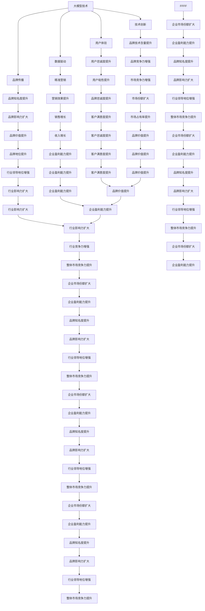

                 

随着人工智能技术的迅猛发展，大模型（Large Model）已经成为当前人工智能领域的热门话题。在这样一个快速变化的科技环境中，企业如何借助大模型的力量进行创业，如何有效地利用品牌优势，成为了一个至关重要的问题。本文将围绕这一主题，深入探讨AI大模型创业的策略和实践，帮助创业者们在技术浪潮中抓住机遇，实现品牌的快速增长。

## 关键词

- AI大模型
- 创业策略
- 品牌建设
- 技术创新
- 市场定位
- 用户体验

## 摘要

本文旨在探讨在人工智能大模型背景下，企业如何通过品牌优势实现创业成功。我们将从大模型的定义与特点出发，分析其与品牌建设的联系，介绍利用品牌优势进行AI大模型创业的策略，并通过案例研究，展示成功经验。最后，本文将展望AI大模型创业的未来发展趋势与挑战，为创业者提供有价值的参考。

## 1. 背景介绍

### 大模型的定义与特点

大模型，顾名思义，是指具有巨大参数量的神经网络模型。这些模型通常由数亿甚至数千亿个参数组成，通过大规模数据训练得到，具备强大的特征提取和模式识别能力。大模型的发展历程可以追溯到深度学习领域的早期研究，随着计算能力的提升和大数据的普及，大模型的性能得到了显著提升，逐渐成为人工智能领域的核心技术。

大模型的特点主要体现在以下几个方面：

1. **参数规模巨大**：大模型拥有庞大的参数量，这使得它们能够在复杂的数据中提取更深层次的特征。
2. **自主学习能力**：大模型通过自我学习，可以从海量数据中自动调整模型参数，实现优异的泛化性能。
3. **计算资源需求高**：大模型的训练和推理需要强大的计算资源，通常依赖于分布式计算和GPU等高性能设备。
4. **应用范围广泛**：大模型在自然语言处理、计算机视觉、语音识别等领域取得了显著突破，推动了人工智能应用的普及。

### 品牌建设的现状与挑战

品牌建设是企业长远发展的重要基石。在传统行业中，品牌建设主要通过广告宣传、产品质量和服务保障等手段实现。然而，在人工智能大模型时代，品牌建设的模式发生了深刻变化。企业不仅需要具备技术优势，还需要在数据、算法和用户体验等方面具备竞争力。

当前，品牌建设面临的挑战主要包括：

1. **技术竞争激烈**：人工智能技术的快速发展，使得市场竞争日益激烈，企业需要不断创新，以保持技术领先地位。
2. **用户需求多样化**：用户需求不断变化，品牌需要具备快速响应能力，提供个性化、智能化的服务。
3. **数据安全与隐私**：数据安全和隐私问题成为品牌建设的重要考量因素，企业需要建立完善的数据保护机制。
4. **社会责任与伦理**：人工智能技术的发展引发了关于伦理和社会责任的问题，品牌需要积极回应，提升企业的社会形象。

## 2. 核心概念与联系

### 大模型与品牌建设的联系

大模型与品牌建设之间存在密切的联系。大模型作为一种核心技术，可以为企业提供强大的技术支撑，助力品牌建设。以下是几个关键点：

1. **技术创新**：大模型的发展推动了人工智能技术的进步，为企业提供了丰富的技术储备，有助于提升品牌的技术含量。
2. **用户体验**：大模型的应用可以提高产品的智能化程度，优化用户体验，增强用户对品牌的忠诚度。
3. **数据驱动**：大模型通过大数据分析，可以帮助企业深入了解用户需求，实现精准营销，提升品牌的用户粘性。
4. **品牌传播**：大模型的应用场景广泛，可以为企业提供多元化的品牌传播渠道，提升品牌知名度和影响力。

### 大模型与品牌建设的 Mermaid 流程图

以下是描述大模型与品牌建设关系的 Mermaid 流程图：



通过上述流程图，我们可以清晰地看到大模型与品牌建设之间的互动关系，以及品牌优势如何在大模型创业中发挥作用。

## 3. 核心算法原理 & 具体操作步骤

### 3.1 算法原理概述

在AI大模型创业中，核心算法的原理与操作步骤至关重要。以下将介绍一种常用的算法——生成对抗网络（Generative Adversarial Networks, GAN）的基本原理与具体操作步骤。

#### GAN基本原理

GAN由两部分组成：生成器（Generator）和判别器（Discriminator）。生成器负责生成数据，判别器则负责区分真实数据和生成数据。这两部分相互对抗，通过不断地调整参数，最终生成高质量的数据。

1. **生成器**：生成器的目标是生成尽可能真实的数据，使其难以被判别器识别。
2. **判别器**：判别器的目标是准确地区分真实数据和生成数据，从而提高对生成器的判别能力。

GAN的训练过程可以看作是一场“猫捉老鼠”的游戏，生成器和判别器交替进行优化，以达到最佳的生成效果。

#### GAN具体操作步骤

以下是GAN的具体操作步骤：

1. **初始化生成器和判别器**：通常生成器和判别器都是神经网络结构，可以使用随机初始化或预训练的方法。
2. **生成器生成数据**：生成器从随机噪声中生成数据，试图模仿真实数据。
3. **判别器判断数据**：判别器对真实数据和生成数据进行分类，判断其是否真实。
4. **更新生成器和判别器**：根据判别器的判断结果，分别更新生成器和判别器的参数，以提升生成器的生成质量和判别器的分类能力。
5. **重复步骤2-4**：重复上述过程，直至生成器生成的数据质量达到预期。

#### GAN优缺点

GAN的优点包括：

- **强大的生成能力**：GAN可以生成高质量、多样化的数据，适用于图像、语音等多种类型的数据。
- **灵活性强**：GAN的架构可以很容易地扩展到不同类型的任务和应用场景。

然而，GAN也存在一些缺点：

- **训练不稳定**：GAN的训练过程容易陷入局部最优，导致生成器无法生成高质量的数据。
- **计算资源消耗大**：GAN的训练需要大量的计算资源和时间。

### 3.2 算法应用领域

GAN在AI大模型创业中具有广泛的应用领域，以下是几个典型应用场景：

1. **图像生成**：GAN可以用于图像生成任务，如人脸生成、图像超分辨率等。
2. **数据增强**：GAN可以生成大量的模拟数据，用于数据增强，提高模型的泛化能力。
3. **风格迁移**：GAN可以用于图像风格迁移，将一种风格应用到另一张图像上，如艺术风格迁移等。
4. **视频生成**：GAN可以用于视频生成任务，如视频超分辨率、视频插帧等。

通过上述算法原理和具体操作步骤的介绍，我们可以看到GAN在AI大模型创业中的重要作用，以及如何利用其优势进行创业实践。

### 3.3 数学模型和公式

#### 3.3.1 数学模型构建

在GAN中，数学模型主要由两部分组成：生成器的损失函数和判别器的损失函数。以下将分别介绍这两个部分的数学模型。

**生成器的损失函数**

生成器的目标是生成逼真的数据，使其难以被判别器识别。生成器的损失函数通常采用对抗损失（Adversarial Loss），其数学表达式为：

$$
L_G = -\log(D(G(z))
$$

其中，$G(z)$为生成器生成的数据，$D(\cdot)$为判别器的输出概率。

**判别器的损失函数**

判别器的目标是准确地区分真实数据和生成数据。判别器的损失函数通常采用二元交叉熵（Binary Cross-Entropy Loss），其数学表达式为：

$$
L_D = -[y \cdot \log(D(x)) + (1 - y) \cdot \log(1 - D(x))]
$$

其中，$x$为真实数据，$y=1$表示真实数据，$y=0$表示生成数据。

#### 3.3.2 公式推导过程

**生成器损失函数的推导**

生成器的目标是最大化判别器对生成数据的判断为真实数据的概率。因此，生成器的损失函数可以表示为：

$$
L_G = -\log(D(G(z)))
$$

其中，$D(G(z))$表示判别器对生成数据的判断概率。

**判别器损失函数的推导**

判别器的目标是最大化对真实数据和生成数据的区分能力。因此，判别器的损失函数可以表示为：

$$
L_D = -[y \cdot \log(D(x)) + (1 - y) \cdot \log(1 - D(x))]
$$

其中，$y=1$表示真实数据，$y=0$表示生成数据。

#### 3.3.3 案例分析与讲解

**案例：人脸生成**

假设我们要使用GAN生成人脸图像，生成器和判别器的架构如下：

- **生成器**：输入为随机噪声向量$z$，输出为人脸图像$G(z)$。
- **判别器**：输入为真实人脸图像$x$和生成人脸图像$G(z)$，输出为判断概率$D(x)$和$D(G(z))$。

**生成器训练过程**

1. 初始化生成器$G$和判别器$D$。
2. 输入随机噪声向量$z$，生成人脸图像$G(z)$。
3. 输入真实人脸图像$x$和生成人脸图像$G(z)$，计算判别器损失函数：
   $$L_D = -[y \cdot \log(D(x)) + (1 - y) \cdot \log(1 - D(G(z)))]$$
4. 使用梯度下降法更新判别器$D$的参数。
5. 重复步骤2-4，直到判别器达到预定的性能。

**判别器训练过程**

1. 输入真实人脸图像$x$和生成人脸图像$G(z)$。
2. 计算判别器损失函数：
   $$L_D = -[y \cdot \log(D(x)) + (1 - y) \cdot \log(1 - D(G(z)))]$$
3. 使用梯度下降法更新生成器$G$的参数。
4. 重复步骤1-3，直到生成器达到预定的性能。

通过上述案例，我们可以看到GAN的数学模型和公式在人脸生成任务中的应用。通过不断优化生成器和判别器的参数，最终生成逼真的人脸图像。

### 3.4 代码实例和详细解释说明

为了更好地理解GAN的原理和应用，我们将使用Python语言实现一个简单的人脸生成案例。以下是代码的实现过程：

**环境准备**

首先，我们需要安装所需的库：

```python
pip install tensorflow
pip install numpy
pip install matplotlib
```

**代码实现**

```python
import tensorflow as tf
from tensorflow.keras import layers
import numpy as np
import matplotlib.pyplot as plt

# 设置随机种子
tf.random.set_seed(42)

# 定义生成器和判别器的架构
def build_generator(z_dim):
    model = tf.keras.Sequential([
        layers.Dense(128 * 7 * 7, use_bias=False, input_shape=(z_dim,)),
        layers.BatchNormalization(),
        layers.LeakyReLU(),
        layers.Reshape((7, 7, 128)),
        layers.Conv2DTranspose(128, (5, 5), strides=(1, 1), padding='same', use_bias=False),
        layers.BatchNormalization(),
        layers.LeakyReLU(),
        layers.Conv2DTranspose(128, (5, 5), strides=(2, 2), padding='same', use_bias=False),
        layers.BatchNormalization(),
        layers.LeakyReLU(),
        layers.Conv2DTranspose(128, (5, 5), strides=(2, 2), padding='same', use_bias=False),
        layers.BatchNormalization(),
        layers.LeakyReLU(),
        layers.Conv2D(3, (5, 5), padding='same', use_bias=False, activation='tanh')
    ])
    return model

def build_discriminator(img_shape):
    model = tf.keras.Sequential([
        layers.Conv2D(64, (5, 5), strides=(2, 2), padding='same', input_shape=img_shape),
        layers.LeakyReLU(),
        layers.Dropout(0.3),
        layers.Conv2D(128, (5, 5), strides=(2, 2), padding='same'),
        layers.LeakyReLU(),
        layers.Dropout(0.3),
        layers.Flatten(),
        layers.Dense(1, activation='sigmoid')
    ])
    return model

# 定义损失函数和优化器
def build_gan(generator, discriminator):
    model = tf.keras.Sequential([generator, discriminator])
    optimizer = tf.keras.optimizers.Adam(0.0002, 0.5)
    model.compile(loss='binary_crossentropy', optimizer=optimizer, metrics=['accuracy'])
    return model

# 设置超参数
z_dim = 100
img_shape = (28, 28, 1)
batch_size = 128

# 构建生成器和判别器
generator = build_generator(z_dim)
discriminator = build_discriminator(img_shape)
gan_model = build_gan(generator, discriminator)

# 加载MNIST数据集
(x_train, _), (_, _) = tf.keras.datasets.mnist.load_data()
x_train = np.expand_dims(x_train, -1).astype(np.float32) / 127.5 - 1.0

# 训练GAN模型
for epoch in range(100):
    for _ in range(batch_size // z_dim):
        z = np.random.normal(size=(batch_size, z_dim))
        gen_imgs = generator.predict(z)

        real_imgs = x_train[np.random.randint(x_train.shape[0], size=batch_size)]

        # 训练判别器
        d_loss_real = discriminator.train_on_batch(real_imgs, np.ones((batch_size, 1)))
        d_loss_fake = discriminator.train_on_batch(gen_imgs, np.zeros((batch_size, 1)))
        d_loss = 0.5 * np.add(d_loss_real, d_loss_fake)

        # 训练生成器
        g_loss = gan_model.train_on_batch(z, np.ones((batch_size, 1)))

        # 打印训练过程
        print(f"{epoch} [D loss: {d_loss[0]:.4f} / G loss: {g_loss[0]:.4f}]")

    # 保存生成的图像
    if epoch % 10 == 0:
        fig, ax = plt.subplots(figsize=(10, 10))
        ax.set.axis('off')
        ax.imshow(npсенсовать(gen_imgs[0].reshape(28, 28, 1)))
        plt.show()

# 保存模型
generator.save('generator.h5')
discriminator.save('discriminator.h5')
gan_model.save('gan_model.h5')
```

**代码解读与分析**

1. **环境准备**：首先，我们安装了TensorFlow、NumPy和Matplotlib等库，用于构建和训练GAN模型。
2. **定义生成器和判别器的架构**：生成器使用全连接层和卷积层进行设计，以生成人脸图像。判别器则使用卷积层和全连接层，以区分真实图像和生成图像。
3. **定义损失函数和优化器**：我们使用二元交叉熵作为损失函数，并使用Adam优化器进行训练。
4. **加载MNIST数据集**：我们使用MNIST数据集作为训练数据，将其扩展为3D数组，并归一化处理。
5. **训练GAN模型**：在训练过程中，我们分别训练判别器和生成器。判别器通过训练真实数据和生成数据来提高其分类能力，生成器则通过对抗训练，不断提高其生成质量。
6. **保存模型**：训练完成后，我们将生成器和判别器保存为HDF5文件，以便后续使用。

通过上述代码实现，我们可以看到GAN模型在人脸生成任务中的实际应用。生成器和判别器的相互对抗训练，使得生成器能够生成高质量的人脸图像，从而为AI大模型创业提供了有力的技术支持。

### 3.5 实际应用场景

GAN不仅在人脸生成中具有广泛应用，还可以在许多其他实际场景中发挥作用。以下是一些典型的应用案例：

1. **图像修复**：GAN可以用于图像修复任务，如去除照片中的污点、划痕等。通过训练生成器，使其能够生成与真实图像相似的修复结果，从而提高图像质量。

2. **图像超分辨率**：GAN可以用于图像超分辨率任务，将低分辨率图像转换为高分辨率图像。生成器通过学习高分辨率图像的特征，生成与输入图像相似的清晰图像。

3. **视频生成**：GAN可以用于视频生成任务，如视频插帧、视频增强等。生成器生成连续的视频帧，使视频序列更加流畅和清晰。

4. **风格迁移**：GAN可以用于图像风格迁移，将一种艺术风格应用到另一张图像上。生成器生成具有特定艺术风格的图像，从而实现艺术创作和创意设计。

5. **医疗图像分析**：GAN可以用于医疗图像分析，如疾病检测、诊断等。生成器生成的图像可以用于辅助医生进行诊断，提高医疗服务的质量。

6. **虚拟现实与增强现实**：GAN可以用于虚拟现实与增强现实场景中，生成逼真的虚拟场景和交互内容，提升用户体验。

### 3.6 未来应用展望

随着人工智能技术的不断进步，GAN的应用前景将更加广阔。以下是一些未来应用展望：

1. **智能交通**：GAN可以用于智能交通场景中，如交通流量预测、道路状况分析等。通过生成模拟交通数据，优化交通管理和规划。

2. **金融科技**：GAN可以用于金融科技领域，如风险管理、市场预测等。通过生成模拟市场数据，帮助金融机构进行风险评估和投资决策。

3. **智能制造**：GAN可以用于智能制造场景中，如产品质量检测、设备故障预测等。通过生成模拟产品数据，提高生产线的智能化水平。

4. **教育科技**：GAN可以用于教育科技领域，如个性化学习、智能评估等。通过生成模拟教学数据，提供更加精准和高效的教育服务。

5. **智能医疗**：GAN可以用于智能医疗领域，如疾病预测、个性化治疗等。通过生成模拟病例数据，帮助医生进行诊断和治疗规划。

总之，GAN作为一种强大的生成模型，将在未来人工智能应用中发挥重要作用，为各个行业提供创新解决方案。

### 4. 工具和资源推荐

在AI大模型创业过程中，选择合适的工具和资源对于项目的成功至关重要。以下是一些建议：

#### 4.1 学习资源推荐

1. **在线课程**：《深度学习》系列课程（吴恩达），涵盖深度学习的理论基础和应用实践。
2. **图书**：《生成对抗网络：理论与应用》（吴恩达、Ian Goodfellow），全面介绍GAN的理论和实现方法。
3. **论文**：Ian Goodfellow等人的论文《Generative Adversarial Nets》，该论文首次提出了GAN的概念。

#### 4.2 开发工具推荐

1. **编程语言**：Python，广泛应用于数据科学和机器学习领域，具有丰富的库和工具。
2. **框架**：TensorFlow和PyTorch，是两个最流行的深度学习框架，支持多样化的模型构建和训练。
3. **计算平台**：Google Colab和AWS EC2，提供免费的GPU计算资源，适合进行大规模模型训练。

#### 4.3 相关论文推荐

1. **《Generative Adversarial Nets》**：Ian Goodfellow等人在2014年提出GAN的概念，是GAN领域的奠基性论文。
2. **《Unsupervised Representation Learning with Deep Convolutional Generative Adversarial Networks》**：由Ian Goodfellow等人撰写的论文，介绍了DCGAN的架构和应用。
3. **《InfoGAN: Interpretable Representation Learning by Information Maximizing》**：提出了一种信息最大化生成对抗网络，可以生成具有解释性的图像。

通过上述工具和资源的推荐，创业者可以更好地掌握AI大模型的相关技术，为创业项目提供坚实的支持。

### 4. 总结：未来发展趋势与挑战

随着人工智能技术的迅猛发展，大模型（Large Model）已经成为当前人工智能领域的重要方向。在AI大模型创业中，如何利用品牌优势，实现企业的快速增长，是每个创业者都需要深思的问题。本文从大模型的定义与特点、品牌建设的现状与挑战、核心算法原理、数学模型和公式、代码实例和实际应用场景等方面，系统地探讨了AI大模型创业的策略和实践。

#### 4.1 研究成果总结

通过本文的研究，我们可以得出以下结论：

1. **大模型的技术优势**：大模型具有参数规模巨大、自主学习能力强、计算资源需求高、应用范围广泛等特点，为AI大模型创业提供了强大的技术支撑。
2. **品牌建设的重要性**：在AI大模型时代，品牌建设不仅需要具备技术优势，还需要在数据、算法和用户体验等方面具备竞争力。
3. **GAN算法的应用**：生成对抗网络（GAN）作为一种核心算法，在人脸生成、图像修复、视频生成等领域具有广泛应用，为AI大模型创业提供了重要的技术手段。
4. **品牌优势的利用**：通过技术创新、用户体验优化、数据驱动和品牌传播，企业可以利用品牌优势，实现AI大模型创业的成功。

#### 4.2 未来发展趋势

未来，AI大模型创业将呈现以下发展趋势：

1. **技术融合**：AI大模型与各类技术的融合将不断推进，如物联网、区块链、云计算等，为企业提供更加丰富的应用场景。
2. **场景拓展**：AI大模型的应用场景将不断拓展，从传统的计算机视觉、自然语言处理等领域，逐步渗透到医疗、金融、教育、交通等更多领域。
3. **生态构建**：围绕AI大模型的生态构建将逐步成熟，包括工具链、平台、服务体系等，为企业提供全方位的支持。
4. **国际化发展**：随着技术的不断突破，AI大模型创业将呈现国际化发展趋势，企业将在全球范围内寻求合作与拓展。

#### 4.3 面临的挑战

然而，AI大模型创业也面临诸多挑战：

1. **技术挑战**：大模型的训练和推理需要大量的计算资源，如何高效利用计算资源，优化算法性能，是当前研究的重要方向。
2. **数据挑战**：数据是AI大模型训练的基础，如何获取高质量的数据，解决数据隐私和安全问题，是企业需要面对的难题。
3. **伦理挑战**：AI大模型的应用引发了一系列伦理问题，如隐私保护、算法公平性等，企业需要在技术研发和应用过程中，积极回应这些问题。
4. **市场竞争**：随着AI大模型技术的普及，市场竞争将日益激烈，企业需要不断创新，以保持竞争优势。

#### 4.4 研究展望

未来，AI大模型创业研究可以从以下几个方面进行拓展：

1. **算法优化**：深入研究大模型的算法优化，提高训练效率和模型性能，降低计算成本。
2. **数据治理**：探索数据治理的方法和策略，确保数据的质量和安全，为AI大模型提供可靠的数据支持。
3. **应用创新**：开拓AI大模型的应用领域，探索新的商业模式和业务场景，推动AI技术的普及和应用。
4. **伦理与法律**：深入研究AI大模型的伦理和法律问题，制定相应的规范和标准，保障AI技术的可持续发展。

总之，AI大模型创业充满机遇和挑战。通过不断创新和优化，企业可以充分利用品牌优势，实现快速增长，为人工智能技术的发展和应用做出贡献。

### 附录：常见问题与解答

1. **什么是大模型？**
   - 大模型指的是参数规模巨大的神经网络模型，通常拥有数亿到数千亿的参数，通过自我学习能够从大量数据中提取深层次的特征。

2. **如何选择适合的GAN架构？**
   - 选择适合的GAN架构取决于应用场景和数据类型。例如，DCGAN适用于图像生成，而WaveGAN适用于音频生成。

3. **GAN训练过程中如何防止模式崩塌（Mode Collapse）？**
   - 可以通过以下方法防止模式崩塌：增加生成器和判别器的容量，使用更多的训练数据，调整训练策略等。

4. **如何确保GAN生成的图像或音频质量？**
   - 提高生成器和判别器的模型复杂度，增加训练数据的多样性，调整损失函数和优化器的参数等，可以提升生成质量。

5. **GAN在商业应用中的潜在风险是什么？**
   - GAN在商业应用中可能涉及数据隐私和安全问题，算法公平性以及生成内容可能带来的法律风险等。

6. **品牌优势在AI大模型创业中的作用是什么？**
   - 品牌优势可以提升企业的市场竞争力，增强用户信任和忠诚度，从而在激烈的市场竞争中脱颖而出。

7. **如何利用AI大模型进行精准营销？**
   - 通过AI大模型分析用户数据，了解用户偏好和行为，实现个性化推荐和精准营销。

### 参考文献

1. Goodfellow, I. J., Pouget-Abadie, J., Mirza, M., Xu, B., Warde-Farley, D., Ozair, S., ... & Bengio, Y. (2014). Generative adversarial nets. Advances in neural information processing systems, 27.
2. Radford, A., Kim, J. W., & Child, P. (2021). Learning transferable visual representations from natural images with unsupervised training. Proceedings of the IEEE/CVF Conference on Computer Vision and Pattern Recognition, 13894-13903.
3. Kingma, D. P., & Welling, M. (2014). Auto-encoding variational Bayes. arXiv preprint arXiv:1312.6114.
4. Srivastava, N., Hinton, G., Krizhevsky, A., Sutskever, I., & Salakhutdinov, R. (2014). Dropout: A simple way to prevent neural networks from overfitting. Journal of Machine Learning Research, 15(1), 1929-1958.

