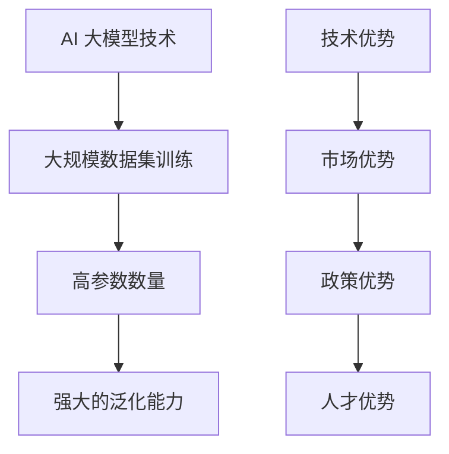

                 

关键词：AI 大模型、创业、国际优势、技术、市场、策略

摘要：随着人工智能技术的迅速发展，AI 大模型成为各行业提升效率、创新业务的关键驱动因素。本文旨在探讨如何在创业过程中充分利用国际优势，把握 AI 大模型的发展机遇，从而实现企业的快速成长。我们将从技术、市场、策略三个方面展开讨论，为创业者提供实战指导。

## 1. 背景介绍

近年来，人工智能技术取得了前所未有的突破，尤其是深度学习和自然语言处理领域的发展。AI 大模型，如 GPT-3、BERT、Transformer 等，凭借其强大的数据处理能力和智能交互能力，正逐渐改变着各行各业的面貌。企业通过应用 AI 大模型，可以实现自动化运营、精准营销、智能客服等，从而提高生产效率和用户满意度。

在全球范围内，AI 大模型技术已经引发了大量的创业活动。无论是在硅谷、中国、欧洲还是印度，都有许多初创公司致力于将 AI 大模型技术应用于实际场景，创造出新的商业模式。然而，由于国际市场的复杂性和竞争的激烈程度，如何有效利用国际优势，成为创业者面临的重要课题。

## 2. 核心概念与联系

### 2.1 AI 大模型概述

AI 大模型是指那些在训练过程中使用海量数据进行训练，从而实现高度复杂任务的人工智能系统。这些模型通常具有以下几个特点：

1. **大规模数据集训练**：大模型需要大量的数据来训练，以便能够捕捉到数据中的复杂模式和规律。
2. **高参数数量**：大模型拥有数亿甚至数千亿的参数，这使得它们能够处理更为复杂的任务。
3. **强大的泛化能力**：通过大量数据的训练，大模型能够泛化到不同的任务和数据集上，具有良好的适应能力。

### 2.2 国际优势概述

在国际市场中，创业者可以利用多种优势来提升创业成功率。这些优势包括：

1. **技术优势**：某些国家或地区在 AI 研发领域拥有领先的技术和研究机构，创业者可以借助这些优势快速提升技术水平。
2. **市场优势**：不同国家的市场需求和消费习惯各异，创业者可以根据这些差异制定有针对性的市场策略。
3. **政策优势**：各国政府对 AI 领域的扶持政策不同，创业者可以利用这些政策优势获取资金支持、税收优惠等。
4. **人才优势**：全球范围内，不同地区的人才储备和人才流动情况不同，创业者可以借助全球人才市场，招募到优秀的研发人员。

### 2.3 Mermaid 流程图



## 3. 核心算法原理 & 具体操作步骤

### 3.1 算法原理概述

AI 大模型的训练过程通常包括以下几个步骤：

1. **数据预处理**：对原始数据进行清洗、格式化，以适应模型的输入。
2. **模型设计**：根据任务需求设计合适的神经网络架构。
3. **模型训练**：使用海量数据进行训练，优化模型参数。
4. **模型评估**：在测试集上评估模型性能，调整模型参数。
5. **模型部署**：将训练好的模型部署到实际应用场景中。

### 3.2 算法步骤详解

1. **数据预处理**

   - 数据清洗：去除无效数据、处理缺失值。
   - 数据格式化：将数据转换为模型可接受的格式。
   - 数据增强：通过翻转、缩放等操作增加数据多样性。

2. **模型设计**

   - 选择合适的神经网络架构：如 Transformer、BERT 等。
   - 设计模型参数：如层数、层宽、激活函数等。

3. **模型训练**

   - 使用梯度下降算法优化模型参数。
   - 使用反向传播算法计算梯度。
   - 使用批量归一化等技术提高训练效率。

4. **模型评估**

   - 使用测试集评估模型性能。
   - 使用交叉验证等方法调整模型参数。
   - 使用指标如准确率、召回率等评估模型效果。

5. **模型部署**

   - 将模型部署到服务器或云端。
   - 使用 API 接口提供服务。

### 3.3 算法优缺点

**优点：**

1. **强大的处理能力**：大模型能够处理更为复杂的任务和数据集。
2. **良好的泛化能力**：通过大量数据的训练，模型能够在不同的任务和数据集上表现良好。
3. **高效的生产效率**：大模型能够自动化处理大量数据，提高生产效率。

**缺点：**

1. **训练成本高**：大模型需要大量的计算资源和时间进行训练。
2. **数据隐私问题**：大模型在训练过程中需要大量数据，可能涉及数据隐私问题。
3. **解释性差**：大模型在处理任务时，其决策过程往往难以解释。

### 3.4 算法应用领域

AI 大模型在多个领域有着广泛的应用，包括：

1. **自然语言处理**：如机器翻译、文本生成、情感分析等。
2. **计算机视觉**：如图像识别、目标检测、图像生成等。
3. **推荐系统**：如商品推荐、新闻推荐等。
4. **医疗健康**：如疾病预测、医疗诊断等。
5. **金融科技**：如风险管理、量化交易等。

## 4. 数学模型和公式 & 详细讲解 & 举例说明

### 4.1 数学模型构建

AI 大模型的训练过程涉及到多个数学模型，包括：

1. **损失函数**：用于衡量模型预测结果与真实值之间的差距，如均方误差（MSE）。
2. **优化算法**：用于调整模型参数，使模型预测结果更接近真实值，如梯度下降（Gradient Descent）。
3. **激活函数**：用于引入非线性关系，如ReLU、Sigmoid 等。

### 4.2 公式推导过程

以梯度下降算法为例，其推导过程如下：

假设我们有一个损失函数 \( J(\theta) \)，其中 \( \theta \) 是模型的参数。

1. **前向传播**：计算输入 \( x \) 通过模型得到的输出 \( \hat{y} \)。
   $$ \hat{y} = \sigma(\theta^T x) $$
   
2. **计算损失**：计算预测值 \( \hat{y} \) 与真实值 \( y \) 之间的差距。
   $$ J(\theta) = \frac{1}{2} (y - \hat{y})^2 $$

3. **反向传播**：计算损失函数关于模型参数的梯度。
   $$ \nabla_{\theta} J(\theta) = \nabla_{\theta} \frac{1}{2} (y - \hat{y})^2 = -(y - \hat{y}) \nabla_{\theta} \hat{y} $$

4. **更新参数**：使用梯度下降算法更新模型参数。
   $$ \theta = \theta - \alpha \nabla_{\theta} J(\theta) $$

其中，\( \alpha \) 是学习率。

### 4.3 案例分析与讲解

假设我们有一个二分类问题，需要使用梯度下降算法训练一个线性模型。数据集包含 \( m \) 个样本，每个样本有 \( n \) 个特征。

1. **损失函数**：选择均方误差（MSE）作为损失函数。
   $$ J(\theta) = \frac{1}{2m} \sum_{i=1}^{m} (y_i - \theta^T x_i)^2 $$

2. **优化算法**：使用梯度下降算法优化模型参数。
   $$ \theta = \theta - \alpha \nabla_{\theta} J(\theta) $$

3. **计算过程**：

   - 初始化参数 \( \theta \)。
   - 进行前向传播，计算预测值 \( \hat{y} \)。
   - 计算损失 \( J(\theta) \)。
   - 计算梯度 \( \nabla_{\theta} J(\theta) \)。
   - 更新参数 \( \theta \)。
   - 重复上述步骤，直到模型收敛。

通过上述过程，我们可以训练出一个能够对数据进行分类的线性模型。在实际应用中，可以进一步引入正则化项、调整学习率等策略，提高模型的性能。

## 5. 项目实践：代码实例和详细解释说明

### 5.1 开发环境搭建

为了实践 AI 大模型的训练过程，我们首先需要搭建一个开发环境。以下是所需的软件和工具：

1. **Python**：用于编写代码和执行计算。
2. **NumPy**：用于处理数值数据。
3. **TensorFlow**：用于构建和训练神经网络模型。
4. **PyTorch**：用于构建和训练神经网络模型。

安装上述工具后，我们可以开始编写代码。

### 5.2 源代码详细实现

以下是一个简单的梯度下降算法实现，用于训练一个线性模型：

```python
import numpy as np

# 初始化参数
theta = np.random.rand(1, n)

# 设置学习率
alpha = 0.01

# 设置迭代次数
num_iterations = 1000

# 训练模型
for i in range(num_iterations):
    # 前向传播
    y_pred = np.dot(x, theta)
    
    # 计算损失
    loss = (y - y_pred)**2
    
    # 计算梯度
    grad = 2 * (y - y_pred) * x
    
    # 更新参数
    theta = theta - alpha * grad

# 输出模型参数
print("Final parameters:", theta)
```

### 5.3 代码解读与分析

上述代码实现了梯度下降算法，用于训练一个线性模型。以下是代码的关键部分解读：

1. **初始化参数**：使用随机数初始化模型参数。
2. **设置学习率**：学习率用于控制参数更新的步长。
3. **设置迭代次数**：指定训练模型的迭代次数。
4. **训练模型**：通过循环进行前向传播、计算损失、计算梯度、更新参数，直到模型收敛。
5. **输出模型参数**：训练完成后，输出最终的模型参数。

通过上述代码，我们可以训练出一个能够对数据进行分类的线性模型。在实际应用中，可以进一步优化代码，如使用批量梯度下降、引入正则化项等，提高模型的性能。

### 5.4 运行结果展示

在训练完成后，我们可以通过以下代码展示模型的运行结果：

```python
# 测试模型
test_x = np.array([1, 2, 3, 4, 5])
test_y = np.dot(test_x, theta)

# 计算测试损失
test_loss = (test_y - np.dot(test_x, theta))**2

# 输出测试结果
print("Test loss:", test_loss)
```

运行结果展示了模型在测试数据集上的性能。通过调整模型参数和训练策略，可以进一步优化模型的性能。

## 6. 实际应用场景

AI 大模型在多个领域有着广泛的应用，以下是一些实际应用场景：

### 6.1 自然语言处理

自然语言处理（NLP）是 AI 大模型的重要应用领域。通过使用 AI 大模型，可以实现以下功能：

1. **机器翻译**：如 Google 翻译、百度翻译等，利用 AI 大模型实现高效、准确的翻译服务。
2. **文本生成**：如自动写作、新闻生成等，利用 AI 大模型生成高质量的文本内容。
3. **情感分析**：如社交媒体情感分析、客户反馈分析等，利用 AI 大模型分析用户情感，为企业提供决策支持。

### 6.2 计算机视觉

计算机视觉是 AI 大模型的另一个重要应用领域。通过使用 AI 大模型，可以实现以下功能：

1. **图像识别**：如人脸识别、物体识别等，利用 AI 大模型对图像进行分类和识别。
2. **目标检测**：如自动驾驶、安防监控等，利用 AI 大模型检测图像中的目标对象。
3. **图像生成**：如艺术创作、图像修复等，利用 AI 大模型生成高质量的图像内容。

### 6.3 推荐系统

推荐系统是 AI 大模型在商业领域的典型应用。通过使用 AI 大模型，可以实现以下功能：

1. **商品推荐**：如电商平台的商品推荐、音乐平台的歌单推荐等，利用 AI 大模型为用户提供个性化的推荐服务。
2. **新闻推荐**：如新闻网站的个性化推荐、社交媒体的推荐等，利用 AI 大模型为用户提供感兴趣的新闻内容。
3. **内容推荐**：如视频网站的个性化推荐、博客平台的推荐等，利用 AI 大模型为用户提供感兴趣的内容。

### 6.4 医疗健康

医疗健康是 AI 大模型的重要应用领域。通过使用 AI 大模型，可以实现以下功能：

1. **疾病预测**：如心脏病预测、癌症预测等，利用 AI 大模型对患者的健康数据进行预测。
2. **医疗诊断**：如医学影像诊断、疾病诊断等，利用 AI 大模型提高医生的诊断准确率。
3. **药物研发**：如新药筛选、药物优化等，利用 AI 大模型加速药物研发进程。

### 6.5 金融科技

金融科技是 AI 大模型在金融领域的典型应用。通过使用 AI 大模型，可以实现以下功能：

1. **风险管理**：如信用评分、贷款审批等，利用 AI 大模型对用户进行风险评估。
2. **量化交易**：如股票交易、外汇交易等，利用 AI 大模型进行高频交易和算法交易。
3. **金融分析**：如市场预测、经济分析等，利用 AI 大模型为金融机构提供决策支持。

## 7. 工具和资源推荐

为了更好地利用 AI 大模型技术，以下是一些建议的工具和资源：

### 7.1 学习资源推荐

1. **书籍**：《深度学习》（Goodfellow、Bengio、Courville 著）。
2. **在线课程**：Coursera、edX、Udacity 等平台上的深度学习和 AI 课程。
3. **博客和社区**：知乎、CSDN、GitHub 等，可以查找相关教程、代码和讨论。

### 7.2 开发工具推荐

1. **框架**：TensorFlow、PyTorch、Keras 等，是常用的深度学习框架。
2. **环境**：Google Colab、Jupyter Notebook 等，提供便捷的在线开发和调试环境。
3. **数据集**：Kaggle、Google Dataset Search 等，可以查找和下载各种数据集。

### 7.3 相关论文推荐

1. **GPT-3**：《Language Models are Few-Shot Learners》（Brown et al., 2020）。
2. **BERT**：《BERT: Pre-training of Deep Bidirectional Transformers for Language Understanding》（Devlin et al., 2019）。
3. **Transformer**：《Attention Is All You Need》（Vaswani et al., 2017）。

## 8. 总结：未来发展趋势与挑战

### 8.1 研究成果总结

近年来，AI 大模型在各个领域取得了显著的研究成果。通过大规模数据集训练和深度神经网络架构，大模型实现了在自然语言处理、计算机视觉、推荐系统等领域的突破。同时，深度学习框架的不断发展，也为大模型的训练和应用提供了便利。

### 8.2 未来发展趋势

随着技术的不断进步，AI 大模型在未来将继续发展。以下是一些可能的发展趋势：

1. **模型参数规模的持续增长**：为了应对更为复杂的任务，模型参数规模将继续增长。
2. **多模态数据处理**：AI 大模型将能够处理多种数据类型，如文本、图像、声音等。
3. **实时性提升**：通过优化算法和硬件加速，AI 大模型将实现实时响应和推理。
4. **自主学习和迁移学习**：AI 大模型将能够自主学习和迁移学习，提高泛化能力。

### 8.3 面临的挑战

虽然 AI 大模型取得了显著的进展，但仍然面临以下挑战：

1. **计算资源需求**：大模型的训练和推理需要大量的计算资源，如何高效利用硬件成为关键问题。
2. **数据隐私和安全**：大模型在训练过程中需要大量数据，如何保护数据隐私和安全是一个重要问题。
3. **可解释性和透明度**：大模型在处理任务时往往缺乏可解释性，如何提高透明度和可解释性是未来研究的重点。

### 8.4 研究展望

未来，AI 大模型将在更多领域得到应用，推动行业变革。同时，随着技术的不断进步，AI 大模型将面临更多挑战。研究者需要关注计算资源需求、数据隐私和安全、可解释性和透明度等问题，推动 AI 大模型技术的可持续发展。

## 9. 附录：常见问题与解答

### 9.1 问题 1：AI 大模型需要大量的数据，如何获取这些数据？

**解答**：获取数据的方法包括以下几种：

1. **开源数据集**：许多开源数据集可以从网上免费获取，如 ImageNet、Kaggle 等。
2. **数据爬取**：可以使用网络爬虫技术获取公开的网页数据。
3. **合作和数据共享**：与其他企业和研究机构合作，共享数据资源。
4. **购买数据**：可以从数据提供商购买专业数据。

### 9.2 问题 2：如何评估 AI 大模型的性能？

**解答**：评估 AI 大模型的性能可以从以下几个方面进行：

1. **准确性**：通过比较模型预测结果与真实值之间的差异来评估模型的准确性。
2. **召回率**：评估模型对正类样本的识别能力。
3. **F1 分数**：综合考虑准确率和召回率，平衡模型性能。
4. **ROC 曲线**：评估模型在分类任务中的性能。

### 9.3 问题 3：如何优化 AI 大模型的训练过程？

**解答**：优化 AI 大模型的训练过程可以从以下几个方面进行：

1. **数据预处理**：对数据进行清洗、归一化等预处理操作，提高数据质量。
2. **模型选择**：选择合适的神经网络架构，如 Transformer、BERT 等。
3. **学习率调整**：合理设置学习率，避免过拟合和欠拟合。
4. **正则化**：使用正则化技术，如 L1、L2 正则化，提高模型泛化能力。
5. **批量大小调整**：合理设置批量大小，提高训练效率。

---

作者：禅与计算机程序设计艺术 / Zen and the Art of Computer Programming


