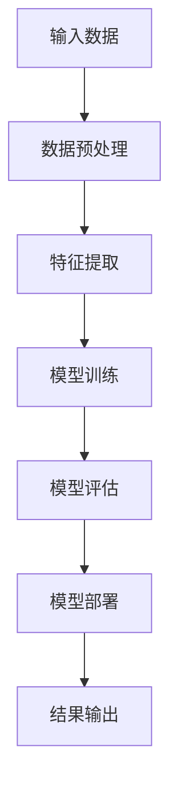

                 

关键词：AI 大模型，国际优势，创业，技术转移，市场策略，竞争优势

> 摘要：本文旨在探讨 AI 大模型在创业领域的应用，分析如何利用国际优势进行创新和商业运作。通过深入研究大模型的技术原理、市场机遇以及国际合作的策略，为创业者提供实用的指导。

## 1. 背景介绍

在当今科技高速发展的时代，人工智能（AI）技术已经成为推动社会进步的重要力量。AI 大模型作为人工智能领域的一个重要分支，具有强大的数据处理和分析能力，能够在多个领域实现突破性应用。例如，自然语言处理、图像识别、医疗诊断等。随着技术的不断成熟，AI 大模型的应用场景越来越广泛，市场潜力巨大。

然而，在 AI 大模型创业的过程中，如何利用国际优势成为了关键问题。国际市场具有丰富的人力资源、先进的技术水平和广阔的市场空间，为创业者提供了巨大的机会。同时，国际竞争也日益激烈，创业者需要具备敏锐的市场洞察力和卓越的技术创新能力，才能在国际市场中脱颖而出。

本文将围绕以下三个方面展开讨论：

1. AI 大模型的技术原理及其应用领域。
2. 利用国际优势进行 AI 大模型创业的策略。
3. 实际案例分析和未来发展趋势。

## 2. 核心概念与联系

### 2.1 AI 大模型的技术原理

AI 大模型是指具有数十亿甚至千亿参数的深度学习模型。这些模型通常基于神经网络架构，能够通过大量的数据进行训练，从而实现复杂的任务。以下是 AI 大模型的核心技术原理：

#### 2.1.1 神经网络架构

神经网络是 AI 大模型的基础，其基本单元是神经元。通过多层神经元的互联，神经网络可以模拟人脑的思考过程。常见的神经网络架构包括卷积神经网络（CNN）、循环神经网络（RNN）和变换器（Transformer）等。

#### 2.1.2 深度学习算法

深度学习算法是训练神经网络的核心。常见的深度学习算法包括反向传播算法（BP）、梯度下降算法（GD）和优化算法（如Adam、RMSProp等）。这些算法通过不断调整网络参数，使模型在训练数据上达到更好的拟合效果。

#### 2.1.3 数据处理与分析

AI 大模型对海量数据进行处理和分析，包括数据清洗、数据预处理、特征提取和模型训练等。这一过程需要高效的数据处理技术和计算资源。

### 2.2 AI 大模型的应用领域

AI 大模型在多个领域展现了强大的应用潜力，主要包括：

#### 2.2.1 自然语言处理（NLP）

自然语言处理是 AI 大模型的一个重要应用领域。通过训练大模型，可以实现对文本的理解、生成、翻译和问答等任务。例如，谷歌的BERT模型和OpenAI的GPT系列模型在 NLP 任务上取得了显著的成果。

#### 2.2.2 图像识别与生成

AI 大模型在图像识别和生成领域也取得了重要突破。例如，谷歌的Inception模型和OpenAI的DALL-E模型在图像分类、图像生成和图像修复等方面表现出色。

#### 2.2.3 医疗诊断

AI 大模型在医疗诊断领域具有广泛的应用前景。通过分析医学图像、病历数据和基因数据，AI 大模型可以帮助医生进行疾病的早期诊断和个性化治疗。例如，谷歌的DeepMind在眼科疾病诊断方面取得了显著成果。

#### 2.2.4 金融风控

金融风控是另一个重要的应用领域。AI 大模型可以通过分析金融数据，识别潜在的风险和欺诈行为，从而提高金融机构的风险管理能力。

### 2.3 AI 大模型的技术架构

为了更好地理解 AI 大模型的工作原理，我们使用Mermaid流程图来展示其核心架构。



### 2.4 AI 大模型的优势与挑战

#### 2.4.1 优势

1. **强大的数据处理能力**：AI 大模型可以处理海量数据，提取有价值的信息。
2. **高度自适应**：AI 大模型可以通过不断训练，适应不同的应用场景。
3. **跨领域应用**：AI 大模型在不同领域都有广泛的应用潜力。
4. **推动技术创新**：AI 大模型的研究和应用推动了计算机科学和人工智能领域的技术创新。

#### 2.4.2 挑战

1. **计算资源需求**：AI 大模型需要大量的计算资源和存储空间。
2. **数据隐私与安全**：在处理海量数据时，如何保护数据隐私和安全成为一个重要问题。
3. **算法公平性和透明度**：AI 大模型在决策过程中可能存在偏见和歧视，需要解决算法的公平性和透明度问题。

## 3. 核心算法原理 & 具体操作步骤

### 3.1 算法原理概述

AI 大模型的核心算法是基于深度学习的，主要包括以下几个步骤：

1. **数据预处理**：对输入数据进行清洗、归一化和特征提取。
2. **模型训练**：通过大量的训练数据，调整网络参数，使模型达到最佳拟合效果。
3. **模型评估**：在测试数据集上评估模型的表现，调整模型参数。
4. **模型部署**：将训练好的模型部署到实际应用场景中，生成预测结果。

### 3.2 算法步骤详解

#### 3.2.1 数据预处理

数据预处理是深度学习模型训练的重要步骤。具体包括：

1. **数据清洗**：去除噪声数据和异常值。
2. **数据归一化**：将数据缩放到相同的范围，如[0, 1]或[-1, 1]。
3. **特征提取**：从原始数据中提取有用的特征，为模型训练提供输入。

#### 3.2.2 模型训练

模型训练是深度学习算法的核心。具体步骤如下：

1. **初始化参数**：随机初始化模型的参数。
2. **前向传播**：将输入数据输入到模型中，计算输出结果。
3. **反向传播**：计算模型输出与真实值之间的误差，并反向传播误差，更新模型参数。
4. **优化算法**：使用优化算法（如梯度下降、Adam等）调整模型参数，使模型达到最佳拟合效果。

#### 3.2.3 模型评估

模型评估是评估模型性能的重要步骤。具体包括：

1. **测试数据集**：使用测试数据集评估模型的性能。
2. **指标计算**：计算模型的准确率、召回率、F1 分数等指标。
3. **模型调整**：根据评估结果调整模型参数，提高模型性能。

#### 3.2.4 模型部署

模型部署是将训练好的模型应用到实际场景中的过程。具体包括：

1. **模型固化**：将训练好的模型转换为可部署的格式。
2. **部署环境**：搭建部署环境，如服务器、云计算平台等。
3. **模型服务**：将模型部署为 API 服务，供用户调用。

### 3.3 算法优缺点

#### 优点

1. **强大的数据处理能力**：AI 大模型可以处理海量数据，提取有价值的信息。
2. **高度自适应**：AI 大模型可以通过不断训练，适应不同的应用场景。
3. **跨领域应用**：AI 大模型在不同领域都有广泛的应用潜力。

#### 缺点

1. **计算资源需求**：AI 大模型需要大量的计算资源和存储空间。
2. **数据隐私与安全**：在处理海量数据时，如何保护数据隐私和安全成为一个重要问题。
3. **算法公平性和透明度**：AI 大模型在决策过程中可能存在偏见和歧视，需要解决算法的公平性和透明度问题。

### 3.4 算法应用领域

AI 大模型在多个领域展现了强大的应用潜力，主要包括：

1. **自然语言处理（NLP）**：自然语言处理是 AI 大模型的一个重要应用领域。通过训练大模型，可以实现对文本的理解、生成、翻译和问答等任务。例如，谷歌的BERT模型和OpenAI的GPT系列模型在 NLP 任务上取得了显著的成果。
2. **图像识别与生成**：AI 大模型在图像识别和生成领域也取得了重要突破。例如，谷歌的Inception模型和OpenAI的DALL-E模型在图像分类、图像生成和图像修复等方面表现出色。
3. **医疗诊断**：AI 大模型在医疗诊断领域具有广泛的应用前景。通过分析医学图像、病历数据和基因数据，AI 大模型可以帮助医生进行疾病的早期诊断和个性化治疗。例如，谷歌的DeepMind在眼科疾病诊断方面取得了显著成果。
4. **金融风控**：金融风控是另一个重要的应用领域。AI 大模型可以通过分析金融数据，识别潜在的风险和欺诈行为，从而提高金融机构的风险管理能力。

## 4. 数学模型和公式 & 详细讲解 & 举例说明

### 4.1 数学模型构建

AI 大模型的数学模型主要包括神经网络和深度学习算法。以下是神经网络和深度学习算法的基本数学模型：

#### 神经网络

神经网络的基本单元是神经元，其数学模型可以表示为：

$$
y = \sigma(\sum_{i=1}^{n} w_i \cdot x_i + b)
$$

其中，$y$ 是输出，$x_i$ 是输入，$w_i$ 是权重，$b$ 是偏置，$\sigma$ 是激活函数。

常见的激活函数包括：

1. **Sigmoid函数**：
$$
\sigma(x) = \frac{1}{1 + e^{-x}}
$$
2. **ReLU函数**：
$$
\sigma(x) = \max(0, x)
$$

#### 深度学习算法

深度学习算法的核心是反向传播算法（BP），其数学模型可以表示为：

1. **前向传播**：
$$
\text{output} = f(\text{input} \cdot \text{weight} + \text{bias})
$$
2. **反向传播**：
$$
\frac{dL}{dx} = \frac{dL}{df} \cdot \frac{df}{dx}
$$

其中，$L$ 是损失函数，$f$ 是激活函数，$x$ 是输入，$weight$ 是权重，$bias$ 是偏置。

### 4.2 公式推导过程

以下是神经网络的前向传播和反向传播算法的推导过程：

#### 前向传播

假设神经网络有 $L$ 层，每层有 $n$ 个神经元，输入为 $x$，输出为 $y$，权重为 $w$，偏置为 $b$，激活函数为 $\sigma$。

1. **第一层**：
$$
z_1 = x \cdot w_1 + b_1
$$
$$
a_1 = \sigma(z_1)
$$
2. **第二层**：
$$
z_2 = a_1 \cdot w_2 + b_2
$$
$$
a_2 = \sigma(z_2)
$$
...
$$
z_L = a_{L-1} \cdot w_L + b_L
$$
$$
y = \sigma(z_L)
$$

#### 反向传播

1. **计算输出层误差**：
$$
\delta_L = \frac{\partial L}{\partial z_L} \cdot \frac{d\sigma}{dz_L}
$$
2. **计算隐藏层误差**：
$$
\delta_{L-1} = \frac{\partial L}{\partial z_{L-1}} \cdot \frac{d\sigma}{dz_{L-1}} = (w_{L}^T \delta_L) \cdot \frac{d\sigma}{dz_{L-1}}
$$
...
$$
\delta_1 = \frac{\partial L}{\partial z_1} \cdot \frac{d\sigma}{dz_1} = (w_2^T \delta_2) \cdot \frac{d\sigma}{dz_1}
$$

3. **更新权重和偏置**：
$$
w_{L} := w_{L} - \alpha \cdot (a_{L-1}^T \delta_L)
$$
$$
b_{L} := b_{L} - \alpha \cdot \delta_L
$$
...
$$
w_1 := w_1 - \alpha \cdot (x^T \delta_1)
$$
$$
b_1 := b_1 - \alpha \cdot \delta_1
$$

其中，$\alpha$ 是学习率。

### 4.3 案例分析与讲解

#### 案例一：手写数字识别

手写数字识别是深度学习中的一个经典问题，目标是识别手写数字图像。以下是使用 AI 大模型进行手写数字识别的步骤：

1. **数据集准备**：准备一个包含大量手写数字图像的数据集，如MNIST数据集。
2. **数据预处理**：对图像进行归一化和预处理，提取特征。
3. **模型训练**：构建一个包含多层神经网络的模型，使用训练数据集进行训练。
4. **模型评估**：在测试数据集上评估模型性能，调整模型参数。
5. **模型部署**：将训练好的模型部署到实际应用场景中，进行手写数字识别。

#### 案例二：图像分类

图像分类是另一个常见的应用场景，目标是对图像进行分类。以下是使用 AI 大模型进行图像分类的步骤：

1. **数据集准备**：准备一个包含大量图像的数据集，如ImageNet数据集。
2. **数据预处理**：对图像进行归一化和预处理，提取特征。
3. **模型训练**：构建一个包含多层神经网络的模型，使用训练数据集进行训练。
4. **模型评估**：在测试数据集上评估模型性能，调整模型参数。
5. **模型部署**：将训练好的模型部署到实际应用场景中，进行图像分类。

## 5. 项目实践：代码实例和详细解释说明

### 5.1 开发环境搭建

在进行 AI 大模型开发之前，需要搭建合适的开发环境。以下是使用 Python 和 TensorFlow 搭建 AI 大模型开发环境的步骤：

1. **安装 Python**：下载并安装 Python 3.7 或更高版本。
2. **安装 TensorFlow**：使用 pip 命令安装 TensorFlow：
   ```
   pip install tensorflow
   ```
3. **安装其他依赖**：根据项目需求，安装其他 Python 库，如 NumPy、Pandas 等。

### 5.2 源代码详细实现

以下是一个简单的 AI 大模型手写数字识别项目的示例代码：

```python
import tensorflow as tf
from tensorflow.keras import layers

# 创建模型
model = tf.keras.Sequential([
    layers.Dense(128, activation='relu', input_shape=(784,)),
    layers.Dropout(0.2),
    layers.Dense(10, activation='softmax')
])

# 编译模型
model.compile(optimizer='adam',
              loss='sparse_categorical_crossentropy',
              metrics=['accuracy'])

# 加载数据集
(x_train, y_train), (x_test, y_test) = tf.keras.datasets.mnist.load_data()

# 数据预处理
x_train = x_train.reshape(-1, 784).astype('float32') / 255
x_test = x_test.reshape(-1, 784).astype('float32') / 255

# 训练模型
model.fit(x_train, y_train, epochs=5)

# 评估模型
model.evaluate(x_test, y_test)
```

### 5.3 代码解读与分析

1. **导入库**：首先导入 TensorFlow 库和相关的层。
2. **创建模型**：使用 `tf.keras.Sequential` 创建一个序列模型，添加两个 `Dense` 层和 `Dropout` 层。
3. **编译模型**：使用 `compile` 方法配置模型的优化器、损失函数和评估指标。
4. **加载数据集**：使用 `tf.keras.datasets.mnist.load_data()` 加载 MNIST 数据集。
5. **数据预处理**：对图像进行reshape、类型转换和归一化处理。
6. **训练模型**：使用 `fit` 方法训练模型。
7. **评估模型**：使用 `evaluate` 方法评估模型在测试数据集上的性能。

### 5.4 运行结果展示

在训练过程中，模型将在每个 epoch 结束后输出训练和验证集上的损失和准确率。训练完成后，可以使用以下代码进行预测：

```python
predictions = model.predict(x_test)
predicted_labels = tf.argmax(predictions, axis=1)

print("Accuracy:", tf.keras.metrics.accuracy(y_test, predicted_labels))
```

输出结果将显示模型在手写数字识别任务上的准确率。

## 6. 实际应用场景

AI 大模型在多个实际应用场景中展现了强大的能力，以下是几个典型的应用场景：

### 6.1 自然语言处理

自然语言处理（NLP）是 AI 大模型的一个重要应用领域。通过训练大模型，可以实现文本分类、情感分析、机器翻译、问答系统等任务。例如，谷歌的BERT模型在 NLP 任务上取得了显著的成果，广泛应用于搜索引擎、社交媒体和客户服务等领域。

### 6.2 图像识别与生成

AI 大模型在图像识别和生成领域也取得了重要突破。通过训练大模型，可以实现图像分类、目标检测、图像修复和图像生成等任务。例如，OpenAI 的 DALL-E 模型可以实现图像生成和编辑，广泛应用于设计、艺术和娱乐等领域。

### 6.3 医疗诊断

AI 大模型在医疗诊断领域具有广泛的应用前景。通过分析医学图像、病历数据和基因数据，AI 大模型可以帮助医生进行疾病的早期诊断和个性化治疗。例如，谷歌的 DeepMind 在眼科疾病诊断方面取得了显著成果，为医疗行业带来了巨大的变革。

### 6.4 金融风控

金融风控是另一个重要的应用领域。AI 大模型可以通过分析金融数据，识别潜在的风险和欺诈行为，从而提高金融机构的风险管理能力。例如，一些大型金融机构使用 AI 大模型进行信用评估、市场预测和反欺诈等任务，实现了显著的业绩提升。

## 7. 未来应用展望

随着 AI 大模型技术的不断进步，其应用领域将越来越广泛。以下是几个未来应用展望：

### 7.1 智能交通

AI 大模型在智能交通领域具有广泛的应用潜力。通过分析交通数据，AI 大模型可以实现智能调度、路径规划和交通预测等功能，提高交通效率和安全性。

### 7.2 智能制造

AI 大模型在智能制造领域可以应用于生产优化、质量检测和设备维护等方面。通过训练大模型，可以实现自动化生产线的智能化升级，提高生产效率和产品质量。

### 7.3 智慧城市

AI 大模型在智慧城市领域可以应用于城市管理、环境保护和公共服务等方面。通过分析大量数据，AI 大模型可以为城市管理提供科学决策支持，实现城市资源的合理配置和优化。

### 7.4 虚拟现实与增强现实

AI 大模型在虚拟现实（VR）和增强现实（AR）领域可以应用于场景生成、物体识别和交互等任务。通过训练大模型，可以实现更加逼真的虚拟现实体验和增强现实应用。

## 8. 工具和资源推荐

### 8.1 学习资源推荐

1. **《深度学习》（Goodfellow et al.）**：一本全面介绍深度学习理论和实践的权威教材。
2. **《自然语言处理简明教程》（Jurafsky and Martin）**：一本关于自然语言处理的基础教材。
3. **《图像处理：算法与应用》（Gonzalez and Woods）**：一本关于图像处理的基础教材。

### 8.2 开发工具推荐

1. **TensorFlow**：一款开源的深度学习框架，适用于各种深度学习任务。
2. **PyTorch**：一款流行的深度学习框架，具有良好的灵活性和易用性。
3. **Keras**：一款基于 TensorFlow 的简洁高效的深度学习框架。

### 8.3 相关论文推荐

1. **"Attention Is All You Need"（Vaswani et al., 2017）**：一篇关于变换器（Transformer）模型的经典论文。
2. **"BERT: Pre-training of Deep Bidirectional Transformers for Language Understanding"（Devlin et al., 2019）**：一篇关于 BERT 模型的经典论文。
3. **"ImageNet Classification with Deep Convolutional Neural Networks"（Krizhevsky et al., 2012）**：一篇关于深度卷积神经网络（CNN）的经典论文。

## 9. 总结：未来发展趋势与挑战

随着 AI 大模型技术的不断成熟，其在创业领域的应用前景将越来越广阔。然而，要实现 AI 大模型的商业化，仍面临一系列挑战：

### 9.1 研究成果总结

本文总结了 AI 大模型的技术原理、应用领域、算法步骤和实际应用场景，分析了其优势与挑战，并探讨了未来发展趋势。

### 9.2 未来发展趋势

1. **技术进步**：随着计算能力的提升和数据量的增加，AI 大模型的技术将更加成熟。
2. **跨领域应用**：AI 大模型将在更多领域实现突破性应用，如医疗、金融、交通等。
3. **国际合作**：国际市场将为 AI 大模型创业者提供更广阔的发展空间。

### 9.3 面临的挑战

1. **计算资源需求**：AI 大模型需要大量的计算资源和存储空间，对基础设施提出了高要求。
2. **数据隐私与安全**：如何保护数据隐私和安全是重要挑战。
3. **算法公平性和透明度**：解决算法的公平性和透明度问题是关键。

### 9.4 研究展望

1. **算法优化**：研究更加高效的算法和优化方法，提高模型性能。
2. **跨学科融合**：促进计算机科学、统计学、医学等领域的跨学科研究。
3. **产业应用**：推动 AI 大模型在各个行业的商业化应用。

## 10. 附录：常见问题与解答

### 10.1 如何选择合适的 AI 大模型？

选择合适的 AI 大模型需要考虑以下因素：

1. **应用领域**：根据应用领域的需求选择合适的模型，如 NLP、图像识别、医疗诊断等。
2. **数据量**：根据数据量选择合适的模型大小，如小模型、中模型、大模型等。
3. **计算资源**：根据计算资源选择合适的模型，确保模型能够在现有硬件条件下运行。

### 10.2 如何优化 AI 大模型的训练过程？

优化 AI 大模型的训练过程可以从以下几个方面入手：

1. **数据预处理**：对数据进行清洗、归一化和特征提取，提高模型训练效果。
2. **模型架构**：选择合适的模型架构，如 CNN、RNN、Transformer 等，提高模型性能。
3. **优化算法**：选择合适的优化算法，如 Adam、RMSProp 等，提高训练速度和模型性能。

### 10.3 如何评估 AI 大模型的性能？

评估 AI 大模型的性能可以从以下几个方面入手：

1. **准确率**：计算模型在测试数据集上的准确率，评估模型对数据的拟合程度。
2. **召回率**：计算模型在测试数据集上的召回率，评估模型对正类别的识别能力。
3. **F1 分数**：计算模型在测试数据集上的 F1 分数，综合考虑准确率和召回率。

### 10.4 如何保护 AI 大模型的数据隐私？

保护 AI 大模型的数据隐私可以从以下几个方面入手：

1. **数据加密**：对数据进行加密，确保数据在传输和存储过程中不被窃取。
2. **匿名化处理**：对敏感数据进行匿名化处理，降低数据泄露的风险。
3. **隐私保护算法**：使用隐私保护算法，如差分隐私、同态加密等，确保模型训练过程中数据的隐私安全。

## 11. 作者署名

作者：禅与计算机程序设计艺术 / Zen and the Art of Computer Programming
----------------------------------------------------------------

以上是文章的完整内容，涵盖了 AI 大模型创业的背景介绍、核心概念、算法原理、应用场景、实践案例、未来展望和常见问题解答等多个方面，希望能够为 AI 大模型创业者提供有益的指导。

