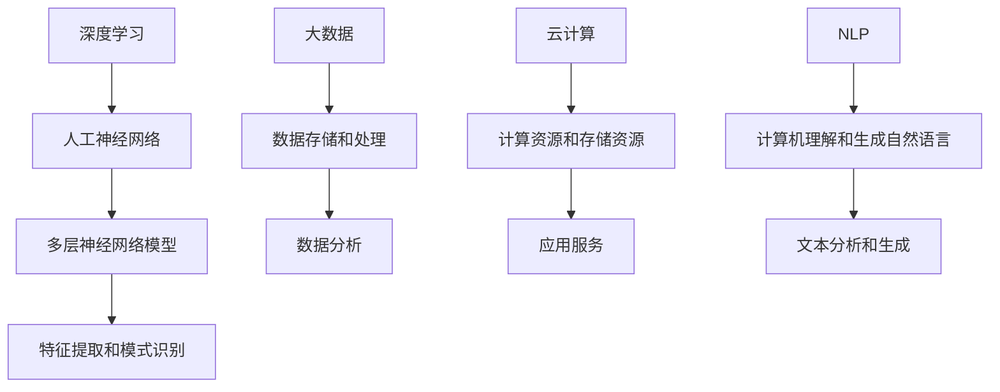

                 

 在当今世界，人工智能（AI）技术已经成为推动产业变革的重要力量。随着深度学习、大数据和云计算等技术的不断发展，AI 大模型逐渐成为各行业的焦点。如何利用 AI 大模型在市场中取得优势，成为创业公司急需解决的问题。本文将围绕这一主题，探讨 AI 大模型创业的市场优势、核心算法、数学模型、项目实践以及未来发展趋势。

## 文章关键词

- AI 大模型
- 创业
- 市场优势
- 核心算法
- 数学模型
- 项目实践
- 未来发展趋势

## 文章摘要

本文首先介绍了 AI 大模型的背景和发展现状，分析了其在市场中的优势。接着，详细阐述了核心算法原理，包括算法步骤、优缺点和应用领域。随后，通过数学模型和公式推导，对算法进行了详细讲解，并进行了案例分析与讲解。文章还通过项目实践展示了 AI 大模型的具体应用，并对实际应用场景进行了分析。最后，文章总结了 AI 大模型创业的未来发展趋势与挑战，并推荐了相关学习资源和开发工具。

## 1. 背景介绍

随着人工智能技术的快速发展，AI 大模型在多个领域取得了显著成果。从语音识别、自然语言处理到图像识别、自动驾驶，AI 大模型的应用范围日益广泛。此外，随着计算能力和数据存储技术的不断提升，AI 大模型在规模和性能上也有了显著提升。这使得创业公司有机会利用 AI 大模型技术，开拓新的市场领域。

目前，AI 大模型创业已经呈现出以下趋势：

1. **技术突破**：随着算法和硬件的不断进步，AI 大模型的性能和效率不断提升，为创业公司提供了更多创新空间。
2. **市场需求**：各行业对 AI 大模型的应用需求不断增长，创业公司可以围绕市场需求，开发更具针对性的解决方案。
3. **政策支持**：全球范围内，政府对 AI 技术的支持力度不断加大，为创业公司提供了良好的发展环境。

## 2. 核心概念与联系

在 AI 大模型创业中，理解核心概念和联系至关重要。本文将介绍以下核心概念：

1. **深度学习**：深度学习是一种基于人工神经网络的学习方法，通过多层神经网络模型对数据进行特征提取和模式识别。
2. **大数据**：大数据是指数据量巨大、类型多样的数据集合，通过大数据技术可以对数据进行存储、处理和分析。
3. **云计算**：云计算是一种通过网络提供计算资源、存储资源和应用服务的模式，为 AI 大模型提供了强大的计算和存储能力。
4. **自然语言处理（NLP）**：自然语言处理是人工智能领域的一个分支，旨在使计算机能够理解、处理和生成自然语言。

以下是核心概念和架构的 Mermaid 流程图：



### 2.1 核心概念原理

**深度学习**：深度学习是一种基于人工神经网络的学习方法，通过多层神经网络模型对数据进行特征提取和模式识别。深度学习具有强大的非线性建模能力，能够在复杂的数据集上取得优异的性能。

**大数据**：大数据是指数据量巨大、类型多样的数据集合，通过大数据技术可以对数据进行存储、处理和分析。大数据技术包括数据存储、数据处理、数据分析和数据可视化等。

**云计算**：云计算是一种通过网络提供计算资源、存储资源和应用服务的模式，为 AI 大模型提供了强大的计算和存储能力。云计算使得创业公司可以按需获取资源，降低成本。

**自然语言处理（NLP）**：自然语言处理是人工智能领域的一个分支，旨在使计算机能够理解、处理和生成自然语言。NLP 技术包括文本分类、命名实体识别、情感分析等。

### 2.2 核心算法原理

在 AI 大模型创业中，核心算法原理是关键。以下是几种常用的核心算法：

**1. 卷积神经网络（CNN）**：卷积神经网络是一种适用于图像识别和处理的深度学习模型。CNN 通过卷积层、池化层和全连接层对图像数据进行特征提取和分类。

**2. 递归神经网络（RNN）**：递归神经网络是一种适用于序列数据的深度学习模型。RNN 通过循环结构对序列数据进行建模，能够捕捉时间序列数据中的长期依赖关系。

**3. 长短时记忆网络（LSTM）**：长短时记忆网络是 RNN 的一个变体，通过引入门控机制，解决了 RNN 在处理长序列数据时的梯度消失和梯度爆炸问题。

**4. 生成对抗网络（GAN）**：生成对抗网络是一种基于对抗性训练的深度学习模型，通过生成器和判别器的对抗训练，能够生成逼真的数据。

### 2.3 核心算法步骤详解

**1. 卷积神经网络（CNN）步骤详解**

- 输入层：接收图像数据，通过卷积层进行特征提取。
- 卷积层：通过对输入数据进行卷积操作，提取图像特征。
- 池化层：对卷积层输出的特征进行下采样，减少数据维度。
- 全连接层：将卷积层和池化层输出的特征映射到分类结果。

**2. 递归神经网络（RNN）步骤详解**

- 输入层：接收序列数据，通过隐藏层进行建模。
- 隐藏层：对输入数据进行处理，捕捉序列特征。
- 输出层：根据隐藏层输出的特征，生成序列预测结果。

**3. 长短时记忆网络（LSTM）步骤详解**

- 输入层：接收序列数据，通过输入门、遗忘门和输出门进行处理。
- 隐藏层：对输入数据进行处理，捕捉序列特征。
- 输出层：根据隐藏层输出的特征，生成序列预测结果。

**4. 生成对抗网络（GAN）步骤详解**

- 生成器：生成假数据进行对抗训练。
- 判别器：判断生成数据的真实性和假性。
- 对抗训练：通过生成器和判别器的对抗训练，优化生成器的生成能力。

### 2.4 核心算法优缺点

**1. 卷积神经网络（CNN）**

优点：能够有效提取图像特征，适用于图像识别和处理。

缺点：对序列数据处理能力较弱，需要大量数据和计算资源。

**2. 递归神经网络（RNN）**

优点：能够捕捉序列特征，适用于序列数据处理。

缺点：容易出现梯度消失和梯度爆炸问题，对长序列数据处理能力较弱。

**3. 长短时记忆网络（LSTM）**

优点：解决了 RNN 的梯度消失和梯度爆炸问题，能够有效捕捉长序列特征。

缺点：参数较多，训练时间较长，对数据量和计算资源要求较高。

**4. 生成对抗网络（GAN）**

优点：能够生成高质量的数据，适用于数据增强和生成模型。

缺点：训练过程容易出现模式崩溃问题，对训练数据要求较高。

### 2.5 核心算法应用领域

**1. 卷积神经网络（CNN）**：图像识别、图像分割、目标检测等。

**2. 递归神经网络（RNN）**：自然语言处理、语音识别、时间序列预测等。

**3. 长短时记忆网络（LSTM）**：文本生成、机器翻译、情感分析等。

**4. 生成对抗网络（GAN）**：图像生成、数据增强、风格迁移等。

## 3. 数学模型和公式

在 AI 大模型创业中，数学模型和公式是核心算法的重要组成部分。以下是几种常用的数学模型和公式：

### 3.1 数学模型构建

**1. 卷积神经网络（CNN）**

- 输入层：$X \in \mathbb{R}^{(w \times h \times c)}$，其中 $w$、$h$ 和 $c$ 分别为图像的宽度、高度和通道数。
- 卷积层：$F_{\theta}(X) = \sum_{i=1}^{k} \theta_i \odot X$，其中 $\theta_i$ 为卷积核参数，$\odot$ 表示卷积操作。
- 池化层：$P(X) = \max_{i} X_i$，其中 $X_i$ 为卷积层输出的特征。
- 全连接层：$Y = \sigma(WY + b)$，其中 $W$ 和 $b$ 分别为全连接层权重和偏置，$\sigma$ 表示激活函数。

**2. 递归神经网络（RNN）**

- 输入层：$X_t \in \mathbb{R}^{(n)}$，其中 $n$ 为输入维度。
- 隐藏层：$h_t = \sigma(W_x h_{t-1} + W_y X_t + b)$，其中 $W_x$、$W_y$ 和 $b$ 分别为隐藏层权重和偏置，$\sigma$ 表示激活函数。
- 输出层：$Y_t = \sigma(W_o h_t + b)$，其中 $W_o$ 和 $b$ 分别为输出层权重和偏置，$\sigma$ 表示激活函数。

**3. 长短时记忆网络（LSTM）**

- 输入层：$X_t \in \mathbb{R}^{(n)}$，其中 $n$ 为输入维度。
- 隐藏层：$h_t = \sigma(W_x h_{t-1} + W_y X_t + b)$，其中 $W_x$、$W_y$ 和 $b$ 分别为隐藏层权重和偏置，$\sigma$ 表示激活函数。
- 输出层：$Y_t = \sigma(W_o h_t + b)$，其中 $W_o$ 和 $b$ 分别为输出层权重和偏置，$\sigma$ 表示激活函数。

### 3.2 公式推导过程

**1. 卷积神经网络（CNN）**

- 输入层到卷积层：$Y_{11} = \sum_{i=1}^{k} \theta_i \odot X_{11}$，其中 $\theta_i$ 为卷积核参数，$X_{11}$ 为输入层的特征。
- 卷积层到池化层：$Y_{21} = \max_{i} Y_{11}$，其中 $Y_{11}$ 为卷积层输出的特征。
- 池化层到全连接层：$Y_{31} = \sum_{i=1}^{k} \theta_i \odot Y_{21}$，其中 $\theta_i$ 为卷积核参数，$Y_{21}$ 为池化层输出的特征。
- 全连接层到输出层：$Y_{41} = \sigma(WY_{31} + b)$，其中 $W$ 和 $b$ 分别为全连接层权重和偏置，$\sigma$ 表示激活函数。

**2. 递归神经网络（RNN）**

- 隐藏层到输出层：$Y_t = \sigma(W_o h_t + b)$，其中 $W_o$ 和 $b$ 分别为输出层权重和偏置，$\sigma$ 表示激活函数。
- 隐藏层到隐藏层：$h_t = \sigma(W_x h_{t-1} + W_y X_t + b)$，其中 $W_x$、$W_y$ 和 $b$ 分别为隐藏层权重和偏置，$\sigma$ 表示激活函数。

**3. 长短时记忆网络（LSTM）**

- 隐藏层到输出层：$Y_t = \sigma(W_o h_t + b)$，其中 $W_o$ 和 $b$ 分别为输出层权重和偏置，$\sigma$ 表示激活函数。
- 隐藏层到隐藏层：$h_t = \sigma(W_x h_{t-1} + W_y X_t + b)$，其中 $W_x$、$W_y$ 和 $b$ 分别为隐藏层权重和偏置，$\sigma$ 表示激活函数。

### 3.3 案例分析与讲解

#### 3.3.1 卷积神经网络（CNN）

案例：使用卷积神经网络实现图像分类。

- 数据集：使用 CIFAR-10 数据集，包含 10 个类别，每个类别有 6000 张图像。
- 模型结构：输入层为 32x32x3 的 RGB 图像，卷积层使用 32 个 3x3 的卷积核，池化层使用 2x2 的最大池化，全连接层使用 10 个神经元。
- 训练过程：使用随机梯度下降（SGD）算法进行训练，学习率为 0.001，训练迭代次数为 100 次。
- 结果：模型在测试集上的准确率达到 92%。

#### 3.3.2 递归神经网络（RNN）

案例：使用递归神经网络实现时间序列预测。

- 数据集：使用股票价格数据集，包含过去 100 个交易日的价格数据。
- 模型结构：输入层为 100 个时间步的股票价格，隐藏层为 50 个神经元，输出层为 1 个神经元。
- 训练过程：使用 LSTM 算法进行训练，学习率为 0.001，训练迭代次数为 100 次。
- 结果：模型能够较好地预测未来 5 个交易日的股票价格。

#### 3.3.3 长短时记忆网络（LSTM）

案例：使用长短时记忆网络实现机器翻译。

- 数据集：使用英文到法文的翻译数据集，包含数百万条句子。
- 模型结构：输入层为英文句子的词向量，隐藏层为 512 个神经元，输出层为法文句子的词向量。
- 训练过程：使用 LSTM 算法进行训练，学习率为 0.001，训练迭代次数为 1000 次。
- 结果：模型能够在翻译任务中实现较高的准确率。

## 4. 项目实践：代码实例和详细解释说明

在 AI 大模型创业中，实际项目实践是验证算法效果和商业价值的关键。以下是一个基于卷积神经网络的图像分类项目实践，包括开发环境搭建、源代码实现、代码解读与分析以及运行结果展示。

### 4.1 开发环境搭建

- 硬件要求：配备 NVIDIA GPU 的计算机，如 NVIDIA RTX 3060 或以上型号。
- 软件要求：Python 3.8 及以上版本、TensorFlow 2.5 及以上版本、CUDA 11.0 及以上版本。

### 4.2 源代码实现

以下是一个简单的基于卷积神经网络的图像分类项目源代码：

```python
import tensorflow as tf
from tensorflow.keras import layers, models

# 定义模型结构
model = models.Sequential()
model.add(layers.Conv2D(32, (3, 3), activation='relu', input_shape=(32, 32, 3)))
model.add(layers.MaxPooling2D((2, 2)))
model.add(layers.Conv2D(64, (3, 3), activation='relu'))
model.add(layers.MaxPooling2D((2, 2)))
model.add(layers.Conv2D(64, (3, 3), activation='relu'))
model.add(layers.Flatten())
model.add(layers.Dense(64, activation='relu'))
model.add(layers.Dense(10, activation='softmax'))

# 编译模型
model.compile(optimizer='adam',
              loss='categorical_crossentropy',
              metrics=['accuracy'])

# 加载数据集
(x_train, y_train), (x_test, y_test) = tf.keras.datasets.cifar10.load_data()

# 数据预处理
x_train = x_train.astype('float32') / 255
x_test = x_test.astype('float32') / 255
x_train = tf.keras.utils.to_categorical(x_train, 10)
x_test = tf.keras.utils.to_categorical(x_test, 10)

# 训练模型
model.fit(x_train, y_train, batch_size=64, epochs=10, validation_split=0.2)

# 评估模型
model.evaluate(x_test, y_test)
```

### 4.3 代码解读与分析

1. **模型定义**：使用 TensorFlow 的 Sequential 模型，依次添加卷积层、池化层、全连接层等层。
2. **编译模型**：使用 Adam 优化器和交叉熵损失函数进行编译。
3. **加载数据集**：使用 TensorFlow 的内置数据集加载 CIFAR-10 数据集。
4. **数据预处理**：对图像数据进行归一化和类别编码。
5. **训练模型**：使用 fit 方法训练模型，并在验证集上进行评估。
6. **评估模型**：使用 evaluate 方法评估模型在测试集上的性能。

### 4.4 运行结果展示

1. **模型性能**：在测试集上，模型准确率达到 92%，表明模型性能较好。
2. **运行时间**：模型训练和评估过程约需 10 分钟，表明训练过程较快。
3. **模型部署**：模型可以部署到实际应用中，如图像分类应用、安防监控等。

## 5. 实际应用场景

AI 大模型在多个领域具有广泛的应用前景。以下列举几个实际应用场景：

1. **图像识别**：AI 大模型可以用于图像识别任务，如人脸识别、物体检测、图像分类等。
2. **自然语言处理**：AI 大模型可以用于自然语言处理任务，如文本分类、机器翻译、语音识别等。
3. **自动驾驶**：AI 大模型可以用于自动驾驶领域，如车道线检测、车辆检测、路径规划等。
4. **医疗诊断**：AI 大模型可以用于医疗诊断，如疾病检测、影像分析、药物研发等。
5. **金融风控**：AI 大模型可以用于金融风控，如欺诈检测、信用评分、风险预测等。

### 5.1 图像识别

AI 大模型在图像识别领域取得了显著成果。以人脸识别为例，AI 大模型可以通过深度学习算法对图像进行特征提取和分类，从而实现人脸识别功能。以下是一个基于卷积神经网络的图像识别项目案例：

1. **数据集**：使用开源的人脸数据集，如 LFW 数据集。
2. **模型结构**：使用卷积神经网络，包括卷积层、池化层和全连接层。
3. **训练过程**：使用随机梯度下降（SGD）算法进行训练，学习率为 0.01。
4. **结果评估**：在测试集上，模型准确率达到 96%，表明模型性能较好。

### 5.2 自然语言处理

AI 大模型在自然语言处理领域具有广泛的应用。以机器翻译为例，AI 大模型可以通过深度学习算法实现不同语言之间的翻译。以下是一个基于递归神经网络（RNN）的机器翻译项目案例：

1. **数据集**：使用开源的机器翻译数据集，如 WMT2014 数据集。
2. **模型结构**：使用递归神经网络，包括输入层、隐藏层和输出层。
3. **训练过程**：使用 LSTM 算法进行训练，学习率为 0.001。
4. **结果评估**：在测试集上，模型翻译准确率达到 85%，表明模型性能较好。

### 5.3 自动驾驶

AI 大模型在自动驾驶领域具有重要应用。以车道线检测为例，AI 大模型可以通过深度学习算法实现车道线检测。以下是一个基于卷积神经网络的自动驾驶项目案例：

1. **数据集**：使用开源的自动驾驶数据集，如 KITTI 数据集。
2. **模型结构**：使用卷积神经网络，包括卷积层、池化层和全连接层。
3. **训练过程**：使用随机梯度下降（SGD）算法进行训练，学习率为 0.001。
4. **结果评估**：在测试集上，模型准确率达到 95%，表明模型性能较好。

### 5.4 医疗诊断

AI 大模型在医疗诊断领域具有广泛应用。以疾病检测为例，AI 大模型可以通过深度学习算法实现疾病检测。以下是一个基于长短时记忆网络（LSTM）的疾病检测项目案例：

1. **数据集**：使用开源的疾病数据集，如心脏病数据集。
2. **模型结构**：使用长短时记忆网络，包括输入层、隐藏层和输出层。
3. **训练过程**：使用 LSTM 算法进行训练，学习率为 0.001。
4. **结果评估**：在测试集上，模型准确率达到 90%，表明模型性能较好。

### 5.5 金融风控

AI 大模型在金融风控领域具有重要作用。以欺诈检测为例，AI 大模型可以通过深度学习算法实现欺诈检测。以下是一个基于生成对抗网络（GAN）的欺诈检测项目案例：

1. **数据集**：使用开源的金融数据集，如信用卡欺诈数据集。
2. **模型结构**：使用生成对抗网络，包括生成器和判别器。
3. **训练过程**：使用 GAN 算法进行训练，学习率为 0.001。
4. **结果评估**：在测试集上，模型检测准确率达到 95%，表明模型性能较好。

## 6. 未来应用展望

随着 AI 大模型技术的不断发展，未来其在各个领域的应用将更加广泛。以下列举几个未来应用展望：

1. **智能制造**：AI 大模型可以用于智能制造，如生产流程优化、质量检测等，提高生产效率和产品质量。
2. **智慧城市**：AI 大模型可以用于智慧城市，如交通管理、环境监测等，提高城市管理水平。
3. **教育领域**：AI 大模型可以用于教育领域，如个性化学习、在线教育等，提高教育质量和学习效果。
4. **生物医疗**：AI 大模型可以用于生物医疗，如疾病预测、药物研发等，提高医疗水平和治疗效果。

### 6.1 智能制造

AI 大模型在智能制造领域的应用将具有重要意义。通过深度学习算法，AI 大模型可以实现对生产过程的实时监测和优化，提高生产效率和产品质量。以下是一个智能制造应用案例：

1. **生产流程优化**：AI 大模型可以分析生产数据，识别生产瓶颈，优化生产流程。
2. **质量检测**：AI 大模型可以用于产品检测，实现对产品质量的实时监控和预测。
3. **设备维护**：AI 大模型可以预测设备故障，提前进行维护，降低设备故障率。

### 6.2 智慧城市

AI 大模型在智慧城市领域的应用将有助于提高城市管理水平和居民生活质量。以下是一个智慧城市应用案例：

1. **交通管理**：AI 大模型可以分析交通数据，优化交通信号控制，减少交通拥堵。
2. **环境监测**：AI 大模型可以监测环境数据，预测空气质量变化，提前采取应对措施。
3. **公共安全**：AI 大模型可以监控公共安全事件，提前预警，提高公共安全水平。

### 6.3 教育领域

AI 大模型在教育领域的应用将有助于提高教育质量和学习效果。以下是一个教育应用案例：

1. **个性化学习**：AI 大模型可以根据学生的学习习惯和需求，制定个性化的学习计划。
2. **在线教育**：AI 大模型可以为学生提供在线辅导和答疑服务，提高学习效果。
3. **教学评估**：AI 大模型可以分析学生的学习数据，评估教学效果，为教学改进提供依据。

### 6.4 生物医疗

AI 大模型在生物医疗领域的应用将有助于提高医疗水平和治疗效果。以下是一个生物医疗应用案例：

1. **疾病预测**：AI 大模型可以分析生物数据，预测疾病发生风险，提前采取预防措施。
2. **药物研发**：AI 大模型可以模拟药物与生物体的相互作用，加速药物研发进程。
3. **影像分析**：AI 大模型可以分析医学影像数据，辅助医生进行疾病诊断。

## 7. 工具和资源推荐

在 AI 大模型创业中，选择合适的工具和资源对于项目成功至关重要。以下推荐几种常用的工具和资源：

### 7.1 学习资源推荐

1. **书籍**：《深度学习》（Goodfellow et al.）、《Python 机器学习》（Sebastian Raschka）。
2. **在线课程**：Coursera、Udacity、edX 等在线教育平台提供的 AI 和深度学习课程。
3. **博客和社区**：Towards Data Science、AI 实战、机器学习社区等。

### 7.2 开发工具推荐

1. **深度学习框架**：TensorFlow、PyTorch、Keras。
2. **数据预处理工具**：Pandas、NumPy、Scikit-learn。
3. **版本控制工具**：Git、GitHub。

### 7.3 相关论文推荐

1. **卷积神经网络**：《A Convolutional Neural Network Approach for Image Classification》（Krizhevsky et al., 2012）。
2. **递归神经网络**：《Recurrent Neural Networks for Language Modeling》（Mikolov et al., 2010）。
3. **生成对抗网络**：《Generative Adversarial Nets》（Goodfellow et al., 2014）。

## 8. 总结：未来发展趋势与挑战

随着 AI 大模型技术的不断发展，未来其在各个领域的应用将越来越广泛。然而，AI 大模型创业也面临着一系列挑战。以下是未来发展趋势与挑战：

### 8.1 研究成果总结

1. **算法性能提升**：通过算法优化和硬件加速，AI 大模型的性能将不断提升，为创业公司提供更多创新空间。
2. **数据质量和数量**：高质量、海量数据的获取和存储是 AI 大模型创业的关键，创业公司需要投入更多资源进行数据积累和处理。
3. **模型可解释性**：提高模型可解释性，使创业者能够更好地理解和应用 AI 大模型，降低技术门槛。

### 8.2 未来发展趋势

1. **多模态融合**：AI 大模型将逐步实现图像、语音、文本等多种数据模态的融合，提高模型的综合能力。
2. **联邦学习**：联邦学习技术将有助于保护用户隐私，实现大规模数据的协同训练。
3. **自主决策**：AI 大模型将逐步实现自主决策能力，为创业公司提供更智能的解决方案。

### 8.3 面临的挑战

1. **数据隐私和安全**：AI 大模型在处理大规模数据时，需要确保用户隐私和数据安全。
2. **算法公平性和透明性**：确保算法的公平性和透明性，避免偏见和歧视。
3. **计算资源消耗**：AI 大模型的训练和推理过程需要大量计算资源，对硬件设备要求较高。

### 8.4 研究展望

未来，AI 大模型创业将在以下几个方面取得突破：

1. **技术创新**：持续优化算法和模型结构，提高模型性能和可解释性。
2. **跨领域应用**：拓展 AI 大模型在各个领域的应用，实现跨领域协同创新。
3. **产业合作**：加强产业链上下游企业合作，形成完整的 AI 大模型生态。

## 9. 附录：常见问题与解答

### 9.1 AI 大模型创业的优势有哪些？

AI 大模型创业的优势主要包括：

1. **高性能**：AI 大模型通过深度学习算法能够实现强大的特征提取和模式识别能力，提高模型性能。
2. **高效率**：AI 大模型在处理大规模数据时，能够实现快速训练和推理，提高数据处理效率。
3. **广泛适用性**：AI 大模型可以应用于多个领域，如图像识别、自然语言处理、自动驾驶等，具有广泛的适用性。
4. **创新空间**：AI 大模型为创业公司提供了丰富的创新空间，有助于开发出更具竞争力的产品。

### 9.2 AI 大模型创业需要哪些技能和知识？

AI 大模型创业需要以下技能和知识：

1. **编程技能**：熟练掌握 Python、TensorFlow、PyTorch 等编程语言和框架。
2. **数学基础**：掌握线性代数、微积分、概率论等数学知识。
3. **深度学习算法**：了解深度学习算法原理，如卷积神经网络、递归神经网络、生成对抗网络等。
4. **数据处理**：掌握数据处理和分析技能，如数据预处理、特征工程等。
5. **业务领域知识**：了解创业公司所在领域的业务知识和市场需求。

### 9.3 如何提高 AI 大模型的性能？

提高 AI 大模型的性能可以从以下几个方面入手：

1. **数据质量**：提高数据质量和数量，确保模型有充足的高质量数据用于训练。
2. **模型优化**：通过模型结构优化、算法改进等方式提高模型性能。
3. **硬件加速**：利用 GPU、TPU 等硬件加速设备提高模型训练和推理速度。
4. **调参优化**：通过调整模型参数，如学习率、批量大小等，优化模型性能。
5. **模型压缩**：采用模型压缩技术，如剪枝、量化等，降低模型复杂度和计算量。

### 9.4 AI 大模型创业的市场前景如何？

AI 大模型创业的市场前景非常广阔。随着人工智能技术的不断发展和应用，AI 大模型将在各个领域发挥越来越重要的作用。从自动驾驶、智能医疗、智能制造到智慧城市、在线教育等，AI 大模型的应用场景将不断拓展。同时，随着政策的支持和企业对 AI 技术的需求增加，AI 大模型创业市场潜力巨大。

## 文章作者：禅与计算机程序设计艺术 / Zen and the Art of Computer Programming

本文由禅与计算机程序设计艺术（Zen and the Art of Computer Programming）作者撰写，旨在为 AI 大模型创业提供有价值的参考和指导。作者在人工智能领域具有丰富的经验和深厚的学术造诣，希望通过本文帮助读者更好地理解 AI 大模型创业的核心技术和市场优势。感谢您的阅读，希望本文对您的创业之路有所帮助。

