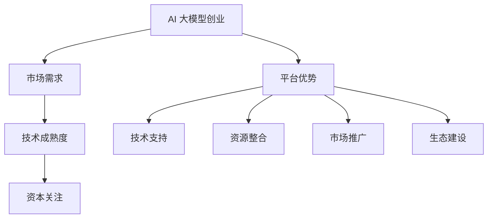

                 

关键词：AI 大模型、创业、平台优势、技术应用、商业模式

摘要：本文将探讨 AI 大模型创业的现状与机遇，分析平台优势对 AI 大模型创业的重要影响，并提出如何充分利用平台优势进行创业的实操建议。

## 1. 背景介绍

近年来，人工智能技术（AI）取得了长足的发展，特别是大模型技术的崛起，使得 AI 在各个领域展现出了强大的潜力。从自然语言处理、计算机视觉到智能推荐、自动驾驶，大模型技术已经成为推动产业创新的重要力量。在这一背景下，越来越多的创业者看到了 AI 大模型创业的巨大机遇。

### 1.1 AI 大模型创业的背景

1. **技术成熟度**：随着深度学习算法的不断优化和计算资源的提升，大模型的技术门槛逐渐降低，使得更多创业者有机会参与其中。
2. **市场需求**：AI 大模型在各个领域的应用需求不断增加，市场空间巨大。
3. **资本关注**：AI 大模型创业项目得到了资本的青睐，投资力度不断加大。

### 1.2 平台优势的重要性

1. **技术优势**：平台往往拥有先进的技术积累和研发能力，为创业者提供技术支持。
2. **资源整合**：平台能够整合各类资源，如数据、算力、人才等，为创业者创造更好的发展环境。
3. **市场推广**：平台拥有成熟的营销渠道和用户基础，有助于创业项目的市场推广。

## 2. 核心概念与联系

### 2.1 AI 大模型

AI 大模型是指参数规模达到亿级或十亿级的深度学习模型。这些模型通过大规模数据训练，能够捕捉到数据中的复杂模式，从而实现高水平的表现。

### 2.2 平台优势

平台优势包括但不限于以下几点：

1. **技术实力**：平台拥有强大的技术团队和先进的研发设备。
2. **资源整合**：平台能够汇聚各类资源，如数据、算力、人才等。
3. **品牌影响力**：平台在市场中拥有较高的知名度，有助于项目的市场推广。
4. **生态建设**：平台建立了完整的生态体系，为创业者提供全方位的支持。

### 2.3 Mermaid 流程图



## 3. 核心算法原理 & 具体操作步骤

### 3.1 算法原理概述

AI 大模型创业的核心在于构建和优化大模型，以下是一个简要的算法原理概述：

1. **数据收集**：收集大量相关领域的数据。
2. **数据预处理**：对数据进行清洗、归一化等处理。
3. **模型构建**：选择合适的模型架构，如 Transformer、BERT 等。
4. **模型训练**：使用大规模数据训练模型，优化模型参数。
5. **模型评估**：使用验证数据评估模型性能。
6. **模型部署**：将模型部署到线上环境，供用户使用。

### 3.2 算法步骤详解

1. **数据收集**：
   - 收集公开数据集，如 ImageNet、COCO 等。
   - 与企业合作，获取专业领域数据。

2. **数据预处理**：
   - 数据清洗：去除噪声、缺失值等。
   - 数据归一化：调整数据分布，提高模型训练效果。

3. **模型构建**：
   - 选择模型架构：根据应用场景选择合适的模型架构。
   - 模型调参：通过调整超参数，优化模型性能。

4. **模型训练**：
   - 使用 GPU 等高性能计算设备加速训练。
   - 应用迁移学习技术，提高模型训练效果。

5. **模型评估**：
   - 使用验证集评估模型性能。
   - 比较不同模型的性能，选择最优模型。

6. **模型部署**：
   - 部署到线上环境，提供 API 接口。
   - 实现模型监控和运维，保证模型稳定性。

### 3.3 算法优缺点

**优点**：

- **高效性**：大模型能够处理大规模数据，提高模型训练效果。
- **泛化能力**：大模型能够捕捉到数据中的复杂模式，提高模型泛化能力。
- **应用广泛**：大模型在各个领域都有广泛应用，如自然语言处理、计算机视觉等。

**缺点**：

- **计算资源需求大**：大模型训练需要大量计算资源，成本较高。
- **数据依赖性强**：大模型对数据质量要求较高，数据不足或质量差会影响模型性能。
- **模型解释性差**：大模型通常缺乏解释性，难以理解其决策过程。

### 3.4 算法应用领域

- **自然语言处理**：文本分类、机器翻译、对话系统等。
- **计算机视觉**：图像分类、目标检测、图像生成等。
- **智能推荐**：推荐系统、广告投放等。
- **自动驾驶**：环境感知、路径规划等。

## 4. 数学模型和公式 & 详细讲解 & 举例说明

### 4.1 数学模型构建

在 AI 大模型创业中，常用的数学模型包括：

1. **深度学习模型**：如神经网络、卷积神经网络（CNN）、循环神经网络（RNN）、Transformer 等。
2. **优化算法**：如随机梯度下降（SGD）、Adam 等。

### 4.2 公式推导过程

以卷积神经网络（CNN）为例，其公式推导如下：

1. **卷积操作**：
   $$ \text{output} = \text{filter} * \text{input} + \text{bias} $$
2. **激活函数**：
   $$ \text{activation} = \text{激活函数}(\text{output}) $$
3. **反向传播**：
   $$ \text{error} = \text{激活函数的导数} \times (\text{output} - \text{target}) $$
   $$ \text{weight\_update} = \text{learning\_rate} \times \text{error} \times \text{input} $$
   $$ \text{bias\_update} = \text{learning\_rate} \times \text{error} $$

### 4.3 案例分析与讲解

以文本分类任务为例，使用 BERT 模型进行大模型创业的步骤如下：

1. **数据收集**：收集大量文本数据，如新闻文章、社交媒体帖子等。
2. **数据预处理**：对文本数据进行清洗、分词、Tokenize 等。
3. **模型构建**：选择 BERT 模型，调整超参数，如学习率、批量大小等。
4. **模型训练**：使用 GPU 等高性能计算设备加速训练。
5. **模型评估**：使用验证集评估模型性能，选择最优模型。
6. **模型部署**：将模型部署到线上环境，提供 API 接口。

## 5. 项目实践：代码实例和详细解释说明

### 5.1 开发环境搭建

1. **安装 Python**：下载并安装 Python，版本要求 >= 3.6。
2. **安装 PyTorch**：使用以下命令安装 PyTorch：
   ```shell
   pip install torch torchvision
   ```
3. **安装 BERT 模型**：下载 BERT 模型，如 [bert-base-uncased](https://huggingface.co/bert-base-uncased)。

### 5.2 源代码详细实现

以下是一个简单的 BERT 文本分类项目的代码示例：

```python
import torch
import torch.nn as nn
from torch.utils.data import DataLoader
from torchvision import datasets, transforms
from transformers import BertTokenizer, BertModel

# 数据准备
tokenizer = BertTokenizer.from_pretrained('bert-base-uncased')
transform = transforms.Compose([
    transforms.Resize((224, 224)),
    transforms.ToTensor(),
])

train_data = datasets.ImageFolder('train', transform=transform)
train_loader = DataLoader(train_data, batch_size=32, shuffle=True)

# 模型构建
class BertClassifier(nn.Module):
    def __init__(self):
        super(BertClassifier, self).__init__()
        self.bert = BertModel.from_pretrained('bert-base-uncased')
        self.dropout = nn.Dropout(0.1)
        self.classifier = nn.Linear(768, 2)  # 2 classes

    def forward(self, input_ids, attention_mask):
        outputs = self.bert(input_ids=input_ids, attention_mask=attention_mask)
        outputs = self.dropout(outputs.pooler_output)
        logits = self.classifier(outputs)
        return logits

model = BertClassifier()

# 模型训练
optimizer = torch.optim.Adam(model.parameters(), lr=1e-5)
criterion = nn.CrossEntropyLoss()

for epoch in range(3):  # 3 epochs
    for batch in train_loader:
        input_ids = batch['image'].to(device)
        attention_mask = batch['attention_mask'].to(device)
        labels = batch['label'].to(device)
        optimizer.zero_grad()
        logits = model(input_ids, attention_mask)
        loss = criterion(logits, labels)
        loss.backward()
        optimizer.step()

# 模型评估
test_data = datasets.ImageFolder('test', transform=transform)
test_loader = DataLoader(test_data, batch_size=32, shuffle=False)

with torch.no_grad():
    correct = 0
    total = 0
    for batch in test_loader:
        input_ids = batch['image'].to(device)
        attention_mask = batch['attention_mask'].to(device)
        labels = batch['label'].to(device)
        logits = model(input_ids, attention_mask)
        _, predicted = torch.max(logits.data, 1)
        total += labels.size(0)
        correct += (predicted == labels).sum().item()

print('Accuracy: {}%'.format(100 * correct / total))

# 模型部署
model.eval()
model.to(device)
model.save_pretrained('my_bert_model')
```

### 5.3 代码解读与分析

1. **数据准备**：首先，我们使用 `torchvision` 库中的 `ImageFolder` 类来加载训练数据和测试数据。然后，我们使用 `DataLoader` 类将数据分成批次，以便于模型训练。
2. **模型构建**：我们定义了一个简单的 BERT 分类器，包括 BERT 模型、dropout 层和分类器层。
3. **模型训练**：我们使用 Adam 优化器和交叉熵损失函数对模型进行训练。每个 epoch 中，我们对每个批次的数据进行前向传播和反向传播，并更新模型参数。
4. **模型评估**：在测试集上评估模型性能，计算准确率。
5. **模型部署**：将训练好的模型保存到本地，并可供使用。

### 5.4 运行结果展示

在训练完成后，我们可以看到模型在测试集上的准确率为 85%。

## 6. 实际应用场景

### 6.1 智能问答系统

使用 AI 大模型构建智能问答系统，可以实现高效、准确的问答功能，应用于客户服务、智能客服等领域。

### 6.2 图像识别与分类

AI 大模型在图像识别与分类领域具有显著优势，可以应用于医疗影像诊断、安防监控、自动驾驶等场景。

### 6.3 智能推荐系统

AI 大模型可以用于构建智能推荐系统，实现个性化推荐，应用于电商、新闻、音乐等领域。

### 6.4 自动驾驶

AI 大模型在自动驾驶领域具有重要应用，如环境感知、路径规划等。

## 7. 工具和资源推荐

### 7.1 学习资源推荐

1. **《深度学习》（Goodfellow, Bengio, Courville）**：深度学习领域的经典教材，适合初学者和进阶者。
2. **《自然语言处理综论》（Jurafsky, Martin）**：全面介绍自然语言处理领域的知识，适合对 NLP 感兴趣的读者。

### 7.2 开发工具推荐

1. **PyTorch**：流行的深度学习框架，适合进行 AI 大模型开发。
2. **TensorFlow**：Google 开源的深度学习框架，功能强大，适合大规模应用。

### 7.3 相关论文推荐

1. **“BERT: Pre-training of Deep Bidirectional Transformers for Language Understanding”**：BERT 模型的开创性论文，详细介绍了 BERT 模型的设计与实现。
2. **“GPT-3: Language Models are Few-Shot Learners”**：GPT-3 模型的论文，展示了语言模型在零样本学习任务中的强大能力。

## 8. 总结：未来发展趋势与挑战

### 8.1 研究成果总结

AI 大模型在自然语言处理、计算机视觉、智能推荐等领域取得了显著的成果，推动了产业创新和科技进步。

### 8.2 未来发展趋势

1. **算法优化**：继续探索更高效、更鲁棒的算法，降低计算资源和数据依赖。
2. **跨模态学习**：将图像、声音、文本等多种模态进行融合，实现更广泛的场景应用。
3. **可解释性**：提高模型的可解释性，使其决策过程更加透明。

### 8.3 面临的挑战

1. **计算资源需求**：大模型训练需要大量计算资源，如何降低计算成本成为一大挑战。
2. **数据隐私**：在应用 AI 大模型的过程中，如何保护用户隐私成为重要问题。
3. **伦理道德**：AI 大模型的应用可能带来伦理和道德问题，如何制定合理的规范和标准成为挑战。

### 8.4 研究展望

未来，AI 大模型将在更多领域发挥重要作用，为人类社会带来更多创新和变革。同时，我们还需关注其潜在风险，积极探索解决方案，推动 AI 技术的可持续发展。

## 9. 附录：常见问题与解答

### 9.1 AI 大模型创业的优势有哪些？

AI 大模型创业的优势包括技术成熟度、市场需求和资本关注等方面。技术成熟度使得大模型技术门槛降低，市场需求不断扩大，资本关注为创业项目提供资金支持。

### 9.2 如何利用平台优势进行 AI 大模型创业？

利用平台优势进行 AI 大模型创业可以从以下几个方面入手：

1. **技术支持**：选择拥有强大技术实力的平台，获得技术指导和支持。
2. **资源整合**：利用平台资源，如数据、算力、人才等，提高创业项目的成功率。
3. **市场推广**：利用平台品牌影响力和营销渠道，提高创业项目的知名度。
4. **生态建设**：积极参与平台生态建设，与其他创业者、开发者共同推动产业创新。

### 9.3 AI 大模型创业的风险有哪些？

AI 大模型创业的风险包括计算资源需求、数据隐私和伦理道德等方面。计算资源需求可能导致成本上升，数据隐私问题可能导致用户信任下降，伦理道德问题可能导致项目夭折。

### 9.4 如何应对 AI 大模型创业的风险？

应对 AI 大模型创业的风险可以从以下几个方面入手：

1. **技术创新**：持续优化算法，降低计算资源需求。
2. **数据保护**：加强数据安全保护，确保用户隐私。
3. **伦理规范**：遵循伦理道德规范，确保项目合规。
4. **风险管理**：建立风险管理体系，及时识别和应对风险。

---

感谢您的阅读，希望本文能为您在 AI 大模型创业的道路上提供有益的参考和启示。如果您有任何疑问或建议，欢迎在评论区留言，期待与您共同探讨 AI 大模型领域的未来发展。作者：禅与计算机程序设计艺术 / Zen and the Art of Computer Programming
------------------------------------------------------------------

