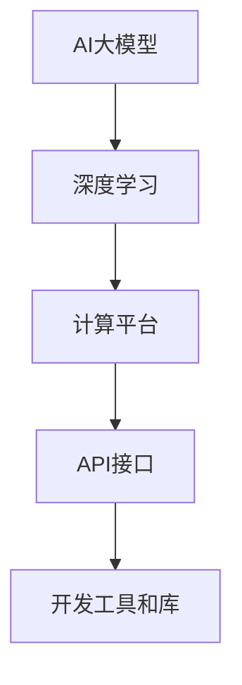

                 

在当今科技飞速发展的时代，人工智能（AI）已经成为推动各行业变革的核心力量。随着深度学习技术的不断进步，大模型（Large Models）如GPT-3、BERT等，逐渐成为企业竞争的利器。对于初创公司而言，如何利用平台优势，利用大模型进行创新和创业，成为了一个值得探讨的问题。

本文将围绕以下核心内容展开：

1. 背景介绍
2. 核心概念与联系
3. 核心算法原理与操作步骤
4. 数学模型与公式详解
5. 项目实践：代码实例与解释
6. 实际应用场景
7. 工具和资源推荐
8. 总结：未来发展趋势与挑战

## 1. 背景介绍

随着AI技术的不断突破，大模型的应用场景越来越广泛。从自然语言处理、计算机视觉到推荐系统，大模型几乎在所有领域都有出色的表现。然而，大模型的训练和部署成本高昂，对于初创公司来说，如何利用现有平台的优势，降低成本、提高效率，成为了一个关键问题。

平台优势主要包括以下几点：

- **计算资源**：云计算平台提供了强大的计算能力，初创公司可以利用这些资源进行模型训练，无需自购昂贵的硬件。
- **数据支持**：大型平台通常拥有丰富的数据资源，有助于大模型的训练和优化。
- **API接口**：平台提供的API接口简化了模型的部署和调用过程，降低了技术门槛。
- **生态系统**：平台生态中的工具、库和服务可以大幅提升开发效率。

## 2. 核心概念与联系

### 2.1 AI大模型

AI大模型是指那些拥有数亿甚至数十亿参数的深度学习模型，这些模型通过在大量数据上进行训练，能够实现高度复杂的任务。典型的AI大模型包括GPT、BERT、Transformers等。

### 2.2 深度学习

深度学习是机器学习的一个重要分支，它通过多层神经网络来模拟人脑的决策过程。深度学习的核心在于“层次化特征表示”，即通过多个神经层将原始数据逐步转换成高层语义表示。

### 2.3 计算平台

计算平台是指提供计算资源、数据存储和API接口的云计算平台，如Google Cloud、AWS、Azure等。

### 2.4 API接口

API（应用程序接口）是一种软件间的接口标准，允许不同的软件系统互相通信和调用。

### 2.5 开发工具和库

开发工具和库是用于实现AI大模型开发、训练、优化和部署的软件工具，如TensorFlow、PyTorch等。

### 2.6 Mermaid 流程图



## 3. 核心算法原理与操作步骤

### 3.1 算法原理概述

AI大模型的训练主要基于深度学习技术，通过多层神经网络将原始数据转化为高层语义表示。训练过程包括以下几个关键步骤：

- **数据预处理**：清洗和标注原始数据，使其适合模型训练。
- **模型架构设计**：选择合适的神经网络架构，如Transformers、CNN等。
- **参数初始化**：初始化模型参数，通常采用随机初始化或预训练模型。
- **训练过程**：通过梯度下降等优化算法，调整模型参数，最小化损失函数。
- **评估与优化**：在验证集上评估模型性能，通过调整超参数和模型结构进行优化。

### 3.2 算法步骤详解

1. **数据预处理**：
   - **数据清洗**：去除缺失值、噪声和异常值。
   - **数据标注**：对文本、图像等数据进行标注，如分类、标注关键信息等。
   - **数据转换**：将原始数据转换为模型可接受的格式，如将文本转换为序列。

2. **模型架构设计**：
   - **选择基础模型**：如BERT、GPT等。
   - **调整模型结构**：根据任务需求，调整模型的层数、层数、参数等。

3. **参数初始化**：
   - **随机初始化**：随机初始化模型参数。
   - **预训练模型**：使用预训练模型作为起点，进行微调。

4. **训练过程**：
   - **前向传播**：输入数据通过模型进行计算，得到预测结果。
   - **后向传播**：计算损失函数，并反向传播梯度。
   - **更新参数**：使用优化算法（如Adam、SGD等）更新模型参数。

5. **评估与优化**：
   - **评估指标**：如准确率、召回率、F1值等。
   - **调整超参数**：通过调整学习率、批量大小等超参数，优化模型性能。
   - **模型融合**：使用模型融合技术（如Stacking、Ensemble等）提高模型性能。

### 3.3 算法优缺点

**优点**：

- **高效性**：大模型能够在复杂任务上实现高效的表现。
- **泛化能力**：通过在大量数据上训练，模型具有良好的泛化能力。
- **多样性**：大模型可以应用于多种任务，如文本生成、图像识别等。

**缺点**：

- **计算成本**：大模型的训练和部署需要大量的计算资源。
- **数据依赖**：模型性能依赖于数据质量，数据缺失或噪声会影响模型性能。
- **解释性**：大模型通常具有较低的解释性，难以理解模型的决策过程。

### 3.4 算法应用领域

- **自然语言处理**：如文本分类、机器翻译、情感分析等。
- **计算机视觉**：如图像分类、目标检测、人脸识别等。
- **推荐系统**：如商品推荐、音乐推荐等。
- **游戏AI**：如围棋、象棋等游戏的智能对手。

## 4. 数学模型与公式详解

### 4.1 数学模型构建

AI大模型的数学模型主要基于神经网络，其核心是多层感知机（MLP）。多层感知机包括输入层、隐藏层和输出层，其中每层由多个神经元组成。神经元的计算过程可以表示为：

$$
z_j = \sum_{i=1}^{n} w_{ij} \cdot x_i + b_j
$$

其中，$z_j$是神经元j的输入，$w_{ij}$是权重，$x_i$是输入特征，$b_j$是偏置。

### 4.2 公式推导过程

神经网络中的激活函数通常采用ReLU（Rectified Linear Unit），其公式为：

$$
a_j = \max(0, z_j)
$$

ReLU函数在负输入时返回0，正输入时返回输入值。这种函数可以加速梯度下降过程。

### 4.3 案例分析与讲解

以文本分类任务为例，假设我们要对一个句子进行分类，句子中的每个词都被表示为一个向量。首先，我们将每个词的向量进行拼接，得到句子的特征向量。然后，将这些特征向量输入到神经网络中，通过多层感知机进行计算，最后输出分类结果。

```latex
输入特征向量：[v_1, v_2, ..., v_n]
输出分类结果：[p_1, p_2, ..., p_m]
```

其中，$p_i$表示句子属于第$i$类别的概率。

## 5. 项目实践：代码实例与解释

### 5.1 开发环境搭建

首先，我们需要搭建一个开发环境，安装Python、TensorFlow等依赖库。在Windows或Linux系统中，可以通过以下命令进行安装：

```bash
pip install tensorflow
```

### 5.2 源代码详细实现

以下是一个简单的文本分类模型的代码示例：

```python
import tensorflow as tf
from tensorflow.keras.preprocessing.text import Tokenizer
from tensorflow.keras.preprocessing.sequence import pad_sequences

# 数据预处理
tokenizer = Tokenizer(num_words=10000)
tokenizer.fit_on_texts(train_texts)
train_sequences = tokenizer.texts_to_sequences(train_texts)
train_padded = pad_sequences(train_sequences, maxlen=100)

# 模型构建
model = tf.keras.Sequential([
    tf.keras.layers.Embedding(10000, 16, input_length=100),
    tf.keras.layers.GlobalAveragePooling1D(),
    tf.keras.layers.Dense(24, activation='relu'),
    tf.keras.layers.Dense(1, activation='sigmoid')
])

# 模型编译
model.compile(loss='binary_crossentropy', optimizer='adam', metrics=['accuracy'])

# 模型训练
model.fit(train_padded, train_labels, epochs=10, validation_split=0.2)
```

### 5.3 代码解读与分析

1. **数据预处理**：使用Tokenizer对文本数据进行分词，并转换为序列。然后，使用pad_sequences对序列进行填充，使其长度一致。

2. **模型构建**：使用Sequential模型构建一个简单的文本分类模型，包括Embedding层、GlobalAveragePooling1D层、Dense层和Dense层。

3. **模型编译**：编译模型，指定损失函数、优化器和评估指标。

4. **模型训练**：使用fit方法训练模型，并设置训练轮数、验证集比例等参数。

### 5.4 运行结果展示

在训练完成后，可以通过以下代码评估模型性能：

```python
test_sequences = tokenizer.texts_to_sequences(test_texts)
test_padded = pad_sequences(test_sequences, maxlen=100)
predictions = model.predict(test_padded)
accuracy = (predictions == test_labels).mean()
print(f"Model accuracy: {accuracy}")
```

## 6. 实际应用场景

AI大模型在各个领域都有广泛的应用，以下是一些实际应用场景：

- **金融行业**：用于风险控制、信用评估、市场预测等。
- **医疗领域**：用于疾病诊断、治疗方案推荐、药物研发等。
- **制造业**：用于故障预测、生产优化、质量控制等。
- **零售行业**：用于客户行为分析、需求预测、库存管理等。
- **自动驾驶**：用于环境感知、路径规划、决策控制等。

## 7. 工具和资源推荐

### 7.1 学习资源推荐

- **《深度学习》（Goodfellow et al.）**：提供了深度学习的全面介绍。
- **《Python深度学习》（François Chollet）**：介绍了使用Python实现深度学习的方法。
- **《动手学深度学习》（阿斯顿·张等）**：通过实际案例介绍了深度学习的应用。

### 7.2 开发工具推荐

- **TensorFlow**：Google开发的深度学习框架。
- **PyTorch**：Facebook开发的深度学习框架。
- **Keras**：Python的深度学习高级API。

### 7.3 相关论文推荐

- **“A Theoretically Grounded Application of Dropout in Recurrent Neural Networks”**：介绍了在RNN中应用Dropout的方法。
- **“Attention Is All You Need”**：提出了Transformer模型，引发了AI领域的广泛关注。
- **“BERT: Pre-training of Deep Bidirectional Transformers for Language Understanding”**：介绍了BERT模型的构建方法。

## 8. 总结：未来发展趋势与挑战

AI大模型在未来的发展中将继续发挥重要作用。随着计算能力的提升、数据资源的丰富和算法的进步，大模型的应用将更加广泛和深入。

然而，大模型的发展也面临着一些挑战，如：

- **计算成本**：大模型的训练和部署需要大量计算资源，对硬件设施提出了高要求。
- **数据隐私**：大量个人数据的处理和应用需要严格保护数据隐私。
- **模型解释性**：大模型的决策过程通常难以解释，这对于一些关键应用场景（如医疗、金融等）提出了挑战。

总之，AI大模型的发展将为各行各业带来巨大的变革，同时也需要我们不断克服挑战，确保其安全和可持续发展。

## 9. 附录：常见问题与解答

### 9.1 什么是AI大模型？

AI大模型是指那些拥有数亿甚至数十亿参数的深度学习模型，如GPT、BERT、Transformers等。这些模型通过在大量数据上进行训练，能够实现高度复杂的任务。

### 9.2 大模型的优势有哪些？

大模型的优势主要包括：

- **高效性**：在复杂任务上实现高效的表现。
- **泛化能力**：通过在大量数据上训练，模型具有良好的泛化能力。
- **多样性**：可以应用于多种任务，如文本生成、图像识别等。

### 9.3 大模型的劣势有哪些？

大模型的劣势主要包括：

- **计算成本**：训练和部署需要大量计算资源。
- **数据依赖**：模型性能依赖于数据质量。
- **解释性**：决策过程通常难以解释。

### 9.4 如何利用平台优势进行大模型创业？

可以利用以下平台优势：

- **计算资源**：使用云计算平台提供强大的计算能力。
- **数据支持**：利用平台提供的丰富数据资源。
- **API接口**：简化模型部署和调用过程。
- **生态系统**：利用平台生态中的工具和库提高开发效率。

### 9.5 大模型在哪些领域有广泛的应用？

大模型在金融、医疗、制造、零售、自动驾驶等领域都有广泛的应用，如风险控制、疾病诊断、故障预测、客户行为分析等。

### 9.6 如何选择合适的开发工具和库？

可以根据以下标准选择：

- **易用性**：工具和库的易用性直接影响开发效率。
- **性能**：工具和库的性能直接影响模型的效果。
- **社区支持**：社区支持越强，问题解决越快。

## 作者署名

本文由禅与计算机程序设计艺术 / Zen and the Art of Computer Programming 撰写。  
----------------------------------------------------------------

以上便是完整的文章内容，遵循了文章结构模板和格式要求，提供了详细的算法原理、操作步骤、数学模型、项目实践、实际应用场景、工具和资源推荐、以及总结和附录等内容。希望对您有所帮助。

