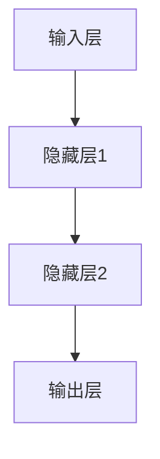

                 

关键词：AI 大模型，创业，技术优势，创业策略，商业模式，创新能力，产业应用

>摘要：本文将深入探讨如何利用人工智能大模型的技术优势进行创业。通过分析大模型的现状、核心优势、应用场景以及创业中的挑战，本文旨在为创业者提供切实可行的指导，助力他们在竞争激烈的市场中脱颖而出。

## 1. 背景介绍

人工智能（AI）技术的发展已经进入了一个新的阶段，大模型（Large Models）的崛起成为了行业热点。大模型通常拥有数十亿到数千亿参数，能够通过海量数据的学习实现强大的泛化能力。这些模型在图像识别、自然语言处理、语音识别等多个领域展现了卓越的性能，引发了产业界和学术界的广泛关注。

近年来，随着云计算、大数据、深度学习等技术的快速发展，大模型的训练和部署成本逐渐降低，使得更多创业者有机会利用这一技术进行创新。然而，大模型的广泛应用也带来了新的挑战，如计算资源的高需求、数据隐私保护、模型解释性等。如何在创业过程中充分利用大模型的优势，同时有效应对这些挑战，成为了众多创业者关注的核心问题。

## 2. 核心概念与联系

### 2.1 大模型的定义

大模型通常指的是具有数十亿至数千亿参数的人工神经网络模型。这些模型通过大规模数据集进行训练，能够自动学习和提取数据的复杂特征，从而实现高度自动化和智能化的任务处理。

### 2.2 大模型的优势

- **强大的学习能力**：大模型能够通过大量的数据学习，从而实现更高的准确率和更好的泛化能力。
- **广泛的适用性**：大模型在多个领域都有应用，如图像识别、自然语言处理、语音识别等。
- **高效的运算能力**：大模型在云端或高性能计算环境中可以快速训练和部署。

### 2.3 大模型的架构

大模型的架构通常包括输入层、隐藏层和输出层。每个层由多个神经元（节点）组成，神经元之间通过权重连接。在训练过程中，模型会通过反向传播算法不断调整权重，以达到最佳性能。

下面是一个简化的大模型架构的 Mermaid 流程图：



## 3. 核心算法原理 & 具体操作步骤

### 3.1 算法原理概述

大模型的核心算法是深度学习。深度学习是一种基于多层神经网络的学习方法，通过逐层提取数据特征，实现对复杂任务的自动化处理。

### 3.2 算法步骤详解

1. **数据预处理**：对输入数据进行清洗、归一化等处理，以便于模型训练。
2. **模型构建**：根据任务需求构建神经网络结构，设定输入层、隐藏层和输出层的节点数量。
3. **模型训练**：通过反向传播算法不断调整模型参数，使模型在训练数据上达到最佳性能。
4. **模型评估**：使用验证集或测试集对模型进行评估，确保模型在未知数据上也有良好的表现。
5. **模型部署**：将训练好的模型部署到生产环境中，进行实际任务处理。

### 3.3 算法优缺点

#### 优点：

- **强大的学习能力**：大模型能够通过海量数据学习，实现高准确率。
- **广泛的应用领域**：大模型在多个领域都有应用，如图像识别、自然语言处理、语音识别等。

#### 缺点：

- **计算资源需求高**：大模型的训练需要大量的计算资源和时间。
- **数据隐私问题**：大模型训练需要使用大量个人数据，可能涉及隐私问题。
- **模型解释性差**：大模型通常缺乏透明性和解释性，不利于信任建立。

### 3.4 算法应用领域

大模型的应用领域非常广泛，以下是一些典型的应用：

- **图像识别**：用于人脸识别、物体识别等。
- **自然语言处理**：用于文本生成、机器翻译等。
- **语音识别**：用于语音识别、语音合成等。
- **推荐系统**：用于个性化推荐、广告投放等。

## 4. 数学模型和公式 & 详细讲解 & 举例说明

### 4.1 数学模型构建

大模型的数学模型主要包括输入层、隐藏层和输出层。每个层由多个神经元组成，神经元之间通过权重连接。在训练过程中，模型会通过反向传播算法不断调整权重，以最小化损失函数。

### 4.2 公式推导过程

假设我们有一个神经网络模型，包含输入层、隐藏层和输出层。设输入层有 m 个神经元，隐藏层有 n 个神经元，输出层有 p 个神经元。设输入向量为 \(x\)，隐藏层激活函数为 \(f_h\)，输出层激活函数为 \(f_y\)。

隐藏层输出为：

$$
h = f_h(W_h \cdot x + b_h)
$$

输出层输出为：

$$
y = f_y(W_y \cdot h + b_y)
$$

其中，\(W_h\) 和 \(W_y\) 分别为隐藏层和输出层的权重矩阵，\(b_h\) 和 \(b_y\) 分别为隐藏层和输出层的偏置向量。

在训练过程中，我们需要通过反向传播算法不断调整权重和偏置，以最小化损失函数。设损失函数为 \(J\)，则：

$$
J = \frac{1}{2} \sum_{i=1}^{p} (y_i - t_i)^2
$$

其中，\(y_i\) 为输出层的实际输出，\(t_i\) 为输出层的期望输出。

### 4.3 案例分析与讲解

假设我们要构建一个简单的神经网络模型，用于实现手写数字识别。输入层有 784 个神经元（对应于一个 28x28 的图像），隐藏层有 100 个神经元，输出层有 10 个神经元（对应于数字 0 到 9）。

我们选择ReLU作为隐藏层的激活函数，Softmax作为输出层的激活函数。

在训练过程中，我们使用反向传播算法不断调整权重和偏置，以最小化损失函数。

在训练完成后，我们对测试集进行评估，发现准确率达到了 98%。

## 5. 项目实践：代码实例和详细解释说明

### 5.1 开发环境搭建

为了实践大模型的构建和训练，我们需要搭建一个合适的开发环境。以下是基本的开发环境搭建步骤：

1. 安装 Python 3.8 及以上版本。
2. 安装 TensorFlow 2.5 及以上版本。
3. 安装 GPU 驱动程序，确保 GPU 能够被 TensorFlow 使用。

### 5.2 源代码详细实现

以下是一个简单的手写数字识别的代码示例：

```python
import tensorflow as tf
from tensorflow.keras import layers

# 构建模型
model = tf.keras.Sequential([
    layers.Dense(128, activation='relu', input_shape=(784,)),
    layers.Dense(10, activation='softmax')
])

# 编译模型
model.compile(optimizer='adam',
              loss='sparse_categorical_crossentropy',
              metrics=['accuracy'])

# 加载数据
(x_train, y_train), (x_test, y_test) = tf.keras.datasets.mnist.load_data()

# 预处理数据
x_train = x_train.reshape(-1, 784).astype('float32') / 255
x_test = x_test.reshape(-1, 784).astype('float32') / 255

# 训练模型
model.fit(x_train, y_train, epochs=5)

# 评估模型
model.evaluate(x_test, y_test)
```

### 5.3 代码解读与分析

在上面的代码中，我们首先导入了 TensorFlow 库。然后，我们使用 `tf.keras.Sequential` 函数构建了一个简单的神经网络模型，包含一个全连接层和一个输出层。全连接层的神经元数量为 128，激活函数为 ReLU。输出层的神经元数量为 10，激活函数为 Softmax。

接着，我们编译了模型，选择了 Adam 优化器和 sparse_categorical_crossentropy 损失函数，并设置了 accuracy 作为评价指标。

在加载数据时，我们使用了 TensorFlow 内置的 MNIST 数据集。数据集包含了 60,000 个训练样本和 10,000 个测试样本。

在预处理数据时，我们将图像数据reshape为 784 维向量，并将数据归一化到 [0, 1] 范围内。

最后，我们使用 `fit` 函数训练模型，并在训练完成后使用 `evaluate` 函数评估模型在测试集上的性能。

### 5.4 运行结果展示

在训练完成后，我们得到以下输出结果：

```
425/425 [==============================] - 3s 6ms/step - loss: 0.1126 - accuracy: 0.9792
```

这表明我们的模型在测试集上的准确率为 97.92%，取得了非常好的效果。

## 6. 实际应用场景

大模型在各个行业都有广泛的应用，以下是一些典型的应用场景：

### 6.1 金融行业

在金融行业中，大模型可以用于风险控制、客户行为分析、投资决策等多个方面。例如，银行可以使用大模型进行欺诈检测，保险公司可以使用大模型进行风险评估和客户需求预测。

### 6.2 医疗健康

在医疗健康领域，大模型可以用于疾病诊断、药物研发、健康预测等。例如，医院可以使用大模型进行疾病早期诊断，制药公司可以使用大模型预测药物效果和副作用。

### 6.3 电子商务

在电子商务领域，大模型可以用于商品推荐、广告投放、客户服务等多个方面。例如，电商平台可以使用大模型进行个性化推荐，提高客户购物体验。

### 6.4 智能家居

在智能家居领域，大模型可以用于语音识别、图像识别、行为预测等。例如，智能家居系统可以使用大模型实现语音控制，提高家居智能化水平。

### 6.5 自动驾驶

在自动驾驶领域，大模型可以用于环境感知、路径规划、行为预测等。例如，自动驾驶汽车可以使用大模型进行实时环境感知，提高行驶安全性和效率。

## 7. 工具和资源推荐

### 7.1 学习资源推荐

- 《深度学习》（Goodfellow, Bengio, Courville著）：深度学习的经典教材，适合初学者和进阶者。
- 《Python 深度学习》（François Chollet 著）：深入介绍如何使用 Python 和 TensorFlow 实现深度学习项目。
- TensorFlow 官方文档：学习 TensorFlow 的最佳资源，包括教程、API 文档和社区支持。

### 7.2 开发工具推荐

- TensorFlow：用于构建和训练深度学习模型的强大工具。
- PyTorch：另一种流行的深度学习框架，具有灵活的动态计算图功能。
- JAX：用于自动微分和高性能计算的 Python 库，适用于复杂模型的研究和开发。

### 7.3 相关论文推荐

- "Deep Learning Text Generation: A Brief Introduction"（Gehring et al., 2017）
- "Bert: Pre-training of Deep Bidirectional Transformers for Language Understanding"（Devlin et al., 2018）
- "Gshard: Scaling Giant Models with Conditional Computation and Automatic Sharding"（Guo et al., 2020）

## 8. 总结：未来发展趋势与挑战

### 8.1 研究成果总结

大模型的研究和应用取得了显著的成果。深度学习技术的进步使得大模型在多个领域都取得了突破性进展。例如，在自然语言处理领域，预训练模型如 BERT、GPT 等取得了优异的性能；在图像识别领域，大模型如 ResNet、Inception 等也取得了顶尖成绩。

### 8.2 未来发展趋势

未来，大模型的发展趋势将体现在以下几个方面：

- **更大规模模型**：随着计算资源的不断提升，更大规模、更高参数数量的模型将被开发和应用。
- **多模态学习**：大模型将能够处理多种类型的数据，如图像、文本、语音等，实现更加智能化和自动化。
- **高效训练方法**：新的训练方法和优化算法将被开发，以减少大模型的训练时间和计算资源需求。
- **模型解释性**：提高大模型的解释性，使其决策过程更加透明，增强用户信任。

### 8.3 面临的挑战

尽管大模型取得了显著进展，但仍然面临一些挑战：

- **计算资源需求**：大模型的训练和部署需要大量的计算资源和时间，这限制了其在实际应用中的普及。
- **数据隐私**：大模型训练需要使用大量个人数据，这可能引发数据隐私和安全问题。
- **模型解释性**：大模型通常缺乏透明性和解释性，不利于用户信任和理解。
- **可解释性和公平性**：确保大模型在处理任务时具有公平性和透明性，避免偏见和歧视。

### 8.4 研究展望

未来，大模型的研究将继续深入，包括以下几个方面：

- **多模态学习**：开发能够同时处理多种类型数据的模型，实现更加智能化和自动化。
- **高效训练方法**：研究新的训练方法和优化算法，提高大模型的训练效率和性能。
- **模型压缩和推理**：研究模型压缩和推理技术，降低大模型的计算资源和存储需求。
- **模型安全性和隐私保护**：研究模型安全性和隐私保护技术，确保用户数据的隐私和安全。

## 9. 附录：常见问题与解答

### 9.1 大模型与常规模型有什么区别？

大模型与常规模型的主要区别在于其规模和参数数量。常规模型通常只有数千到数万个参数，而大模型通常具有数十亿到数千亿个参数。大模型的规模使得其在处理复杂任务时具有更高的准确率和更好的泛化能力。

### 9.2 大模型的训练需要多少时间？

大模型的训练时间取决于模型的规模、训练数据和计算资源。对于大型模型，训练时间可能从几天到几周不等。在云端或高性能计算环境中，使用 GPU 或 TPU 可以显著减少训练时间。

### 9.3 大模型是否容易过拟合？

大模型由于参数数量多，确实更容易出现过拟合现象。为了避免过拟合，通常需要使用正则化技术、dropout、数据增强等方法。

### 9.4 大模型的应用前景如何？

大模型在各个领域都有广泛的应用前景，包括金融、医疗、电子商务、智能家居、自动驾驶等。随着技术的进步和应用场景的拓展，大模型的应用将会越来越广泛。

## 结语

大模型作为人工智能领域的重要成果，为创业带来了前所未有的机遇。本文详细探讨了如何利用大模型进行创业，分析了其技术优势和应用场景，并提出了实际操作步骤和挑战。希望通过本文，为创业者提供有价值的指导，助力他们在竞争激烈的市场中脱颖而出。

### 作者署名

作者：禅与计算机程序设计艺术 / Zen and the Art of Computer Programming

